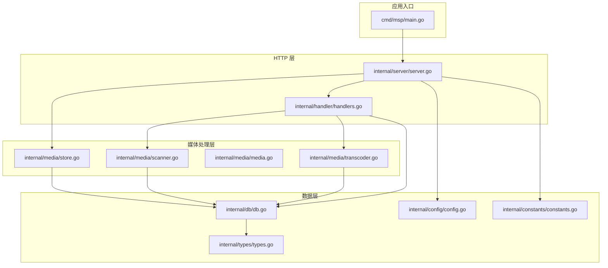
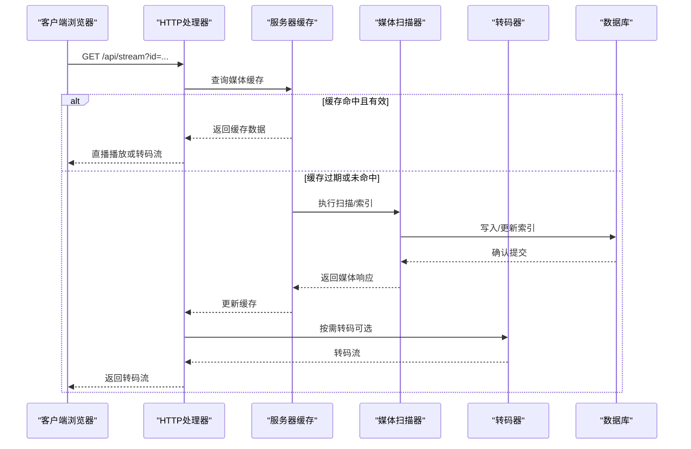
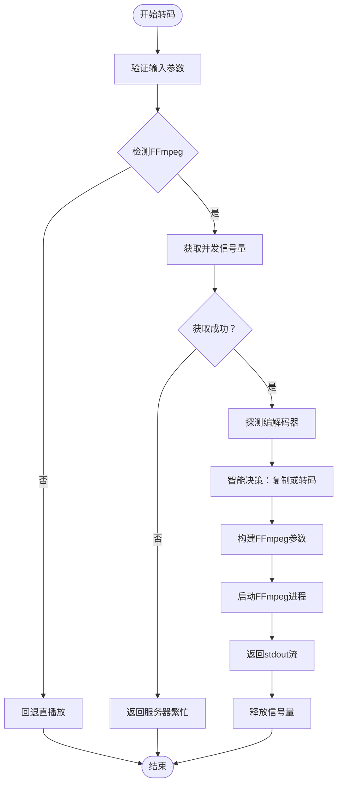
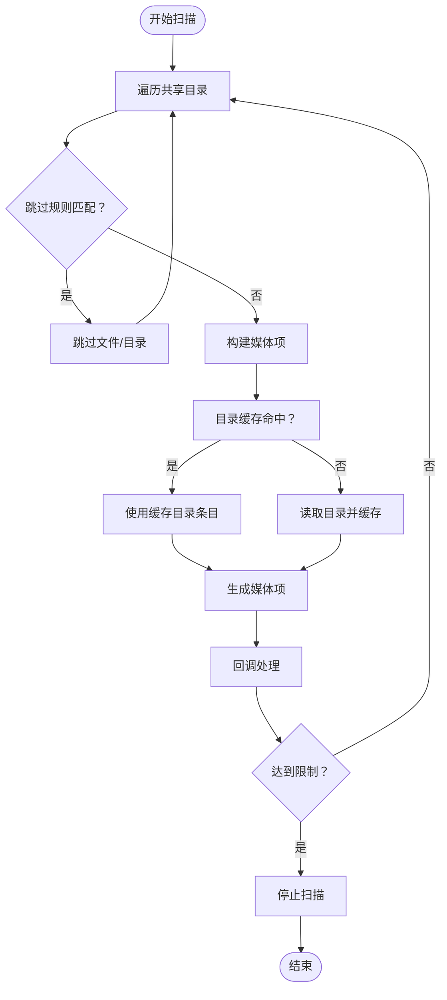
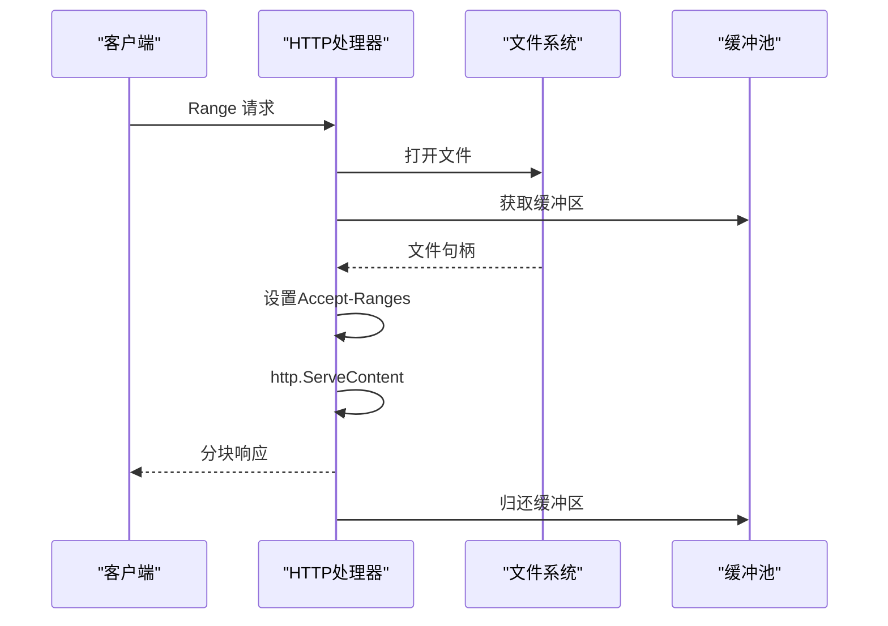
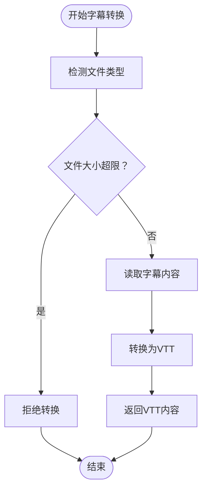
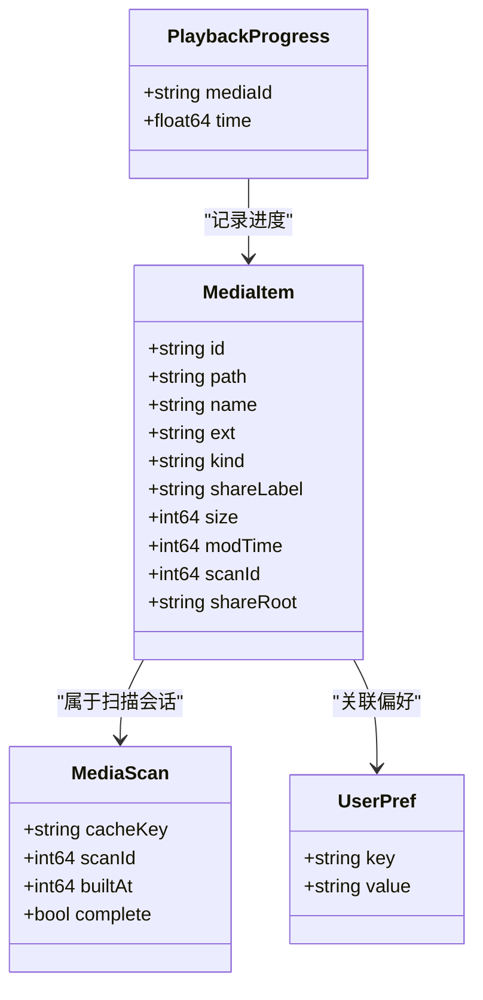
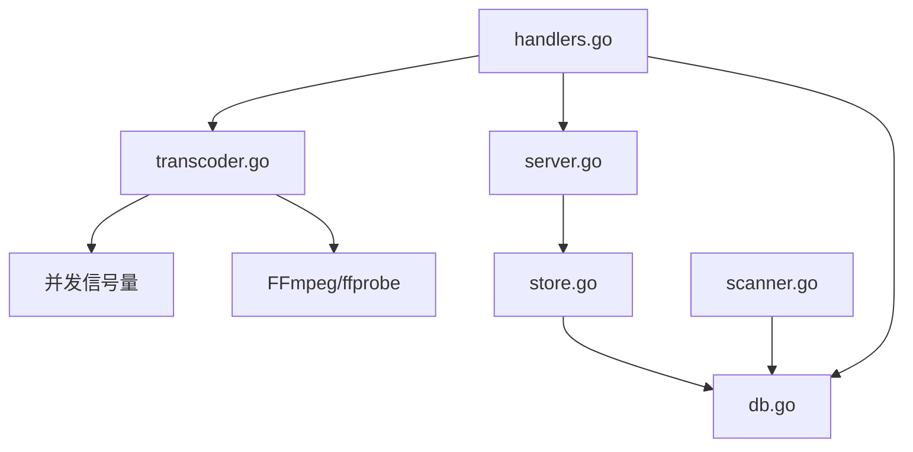

# 媒体处理性能优化

<cite>
**本文档引用的文件**
- [cmd/msp/main.go](file://cmd/msp/main.go)
- [internal/media/transcoder.go](file://internal/media/transcoder.go)
- [internal/media/scanner.go](file://internal/media/scanner.go)
- [internal/media/store.go](file://internal/media/store.go)
- [internal/media/media.go](file://internal/media/media.go)
- [internal/handler/handlers.go](file://internal/handler/handlers.go)
- [internal/server/server.go](file://internal/server/server.go)
- [internal/db/db.go](file://internal/db/db.go)
- [internal/config/config.go](file://internal/config/config.go)
- [internal/constants/constants.go](file://internal/constants/constants.go)
- [internal/types/types.go](file://internal/types/types.go)
- [PERFORMANCE_ANALYSIS.md](file://PERFORMANCE_ANALYSIS.md)
- [internal/media/transcoder_test.go](file://internal/media/transcoder_test.go)
- [internal/media/scanner_test.go](file://internal/media/scanner_test.go)
- [README.md](file://README.md)
</cite>

## 目录
1. [简介](#简介)
2. [项目结构](#项目结构)
3. [核心组件](#核心组件)
4. [架构概览](#架构概览)
5. [详细组件分析](#详细组件分析)
6. [依赖关系分析](#依赖关系分析)
7. [性能考虑因素](#性能考虑因素)
8. [故障排除指南](#故障排除指南)
9. [结论](#结论)

## 简介
本指南专注于 MSP 项目的媒体处理性能优化，涵盖转码性能优化（并发控制、FFmpeg 参数优化、转码缓存策略）、媒体扫描优化（目录缓存、增量扫描、文件系统监控）、流媒体传输优化（HTTP Range 请求处理、缓冲池、分块传输），以及针对不同媒体格式的处理策略（视频编码、音频解码、字幕转换）。同时提供监控指标与调优建议，帮助在家庭局域网环境中实现高效稳定的媒体服务。

## 项目结构
MSP 采用模块化分层架构：
- cmd/msp：应用入口与生命周期管理
- internal/server：HTTP 服务器、缓存与配置管理
- internal/media：媒体扫描、索引与转码
- internal/handler：HTTP 处理器与路由
- internal/db：SQLite 数据库封装与迁移
- internal/config：配置模型与默认值
- internal/types：数据库与 API 数据模型
- internal/constants：全局常量
- internal/util：工具函数
- web：前端静态资源与构建产物

**图表来源**
- [cmd/msp/main.go](file://cmd/msp/main.go#L26-L83)
- [internal/server/server.go](file://internal/server/server.go#L31-L74)
- [internal/handler/handlers.go](file://internal/handler/handlers.go#L38-L43)
- [internal/media/scanner.go](file://internal/media/scanner.go#L25-L57)
- [internal/media/store.go](file://internal/media/store.go#L49-L94)
- [internal/media/transcoder.go](file://internal/media/transcoder.go#L15-L17)
- [internal/db/db.go](file://internal/db/db.go#L32-L72)
- [internal/types/types.go](file://internal/types/types.go#L16-L32)
- [internal/config/config.go](file://internal/config/config.go#L77-L88)
- [internal/constants/constants.go](file://internal/constants/constants.go#L7-L50)

**章节来源**
- [cmd/msp/main.go](file://cmd/msp/main.go#L26-L83)
- [internal/server/server.go](file://internal/server/server.go#L31-L74)
- [internal/handler/handlers.go](file://internal/handler/handlers.go#L38-L43)
- [internal/media/scanner.go](file://internal/media/scanner.go#L25-L57)
- [internal/media/store.go](file://internal/media/store.go#L49-L94)
- [internal/media/transcoder.go](file://internal/media/transcoder.go#L15-L17)
- [internal/db/db.go](file://internal/db/db.go#L32-L72)
- [internal/types/types.go](file://internal/types/types.go#L16-L32)
- [internal/config/config.go](file://internal/config/config.go#L77-L88)
- [internal/constants/constants.go](file://internal/constants/constants.go#L7-L50)

## 核心组件
- 并发转码控制器：通过全局信号量限制同时进行的转码任务数量，避免 CPU 过载。
- 智能转码策略：根据容器与编解码器特性选择直接复制或转码，优化输出格式与参数。
- 媒体扫描器：支持黑名单过滤、目录缓存、增量扫描与限速，减少 I/O 开销。
- 媒体索引与缓存：基于 SQLite 的增量索引与内存/磁盘两级缓存，配合 ETag 实现条件请求。
- 流媒体传输：支持 HTTP Range 请求、分块传输与缓冲池，提升大文件播放体验。
- 字幕转换：SRT/ASS 到 VTT 的流式转换，降低内存占用。

**章节来源**
- [internal/media/transcoder.go](file://internal/media/transcoder.go#L15-L17)
- [internal/media/transcoder.go](file://internal/media/transcoder.go#L175-L248)
- [internal/media/scanner.go](file://internal/media/scanner.go#L25-L57)
- [internal/media/store.go](file://internal/media/store.go#L49-L94)
- [internal/server/server.go](file://internal/server/server.go#L332-L396)
- [internal/handler/handlers.go](file://internal/handler/handlers.go#L566-L579)
- [internal/media/scanner.go](file://internal/media/scanner.go#L689-L714)

## 架构概览
MSP 的媒体处理链路从 HTTP 请求开始，经由处理器解析与策略判断，调用媒体扫描与转码模块，最终通过流式传输返回给客户端。数据库负责持久化索引与用户偏好，服务器层协调缓存与配置热重载。

**图表来源**
- [internal/handler/handlers.go](file://internal/handler/handlers.go#L413-L446)
- [internal/server/server.go](file://internal/server/server.go#L332-L396)
- [internal/media/store.go](file://internal/media/store.go#L49-L94)
- [internal/media/transcoder.go](file://internal/media/transcoder.go#L138-L248)

**章节来源**
- [internal/handler/handlers.go](file://internal/handler/handlers.go#L413-L446)
- [internal/server/server.go](file://internal/server/server.go#L332-L396)
- [internal/media/store.go](file://internal/media/store.go#L49-L94)
- [internal/media/transcoder.go](file://internal/media/transcoder.go#L138-L248)

## 详细组件分析

### 转码性能优化
- 并发控制：全局信号量限制同时转码会话数量，防止 CPU 抢占与内存峰值。
- 参数优化：根据容器与编解码器特性自动选择复制或转码；使用快速预设与线程限制；输出格式添加 faststart 优化网络传输。
- 输入验证：严格校验转码选项（格式、码率、偏移量），确保安全性与稳定性。
- 错误处理：捕获 FFmpeg 标准错误输出，便于诊断；失败时回退直播放。

**图表来源**
- [internal/media/transcoder.go](file://internal/media/transcoder.go#L138-L248)
- [internal/media/transcoder.go](file://internal/media/transcoder.go#L15-L17)
- [internal/media/transcoder.go](file://internal/media/transcoder.go#L35-L70)

**章节来源**
- [internal/media/transcoder.go](file://internal/media/transcoder.go#L15-L17)
- [internal/media/transcoder.go](file://internal/media/transcoder.go#L35-L70)
- [internal/media/transcoder.go](file://internal/media/transcoder.go#L175-L248)
- [internal/media/transcoder_test.go](file://internal/media/transcoder_test.go#L193-L240)

### 媒体扫描优化
- 目录缓存：对目录内容进行缓存，避免重复读取，显著降低小文件场景的 I/O 压力。
- 黑名单过滤：支持扩展名、文件名、文件夹名与大小规则的黑名单，减少无关文件处理。
- 增量扫描：结合 SQLite 索引与清理策略，仅处理变更项，缩短全量扫描时间。
- 限速与取消：通过上下文控制扫描进度，支持取消与限速，避免长时间阻塞。

**图表来源**
- [internal/media/scanner.go](file://internal/media/scanner.go#L25-L57)
- [internal/media/scanner.go](file://internal/media/scanner.go#L74-L106)
- [internal/media/scanner.go](file://internal/media/scanner.go#L148-L179)

**章节来源**
- [internal/media/scanner.go](file://internal/media/scanner.go#L25-L57)
- [internal/media/scanner.go](file://internal/media/scanner.go#L74-L106)
- [internal/media/scanner.go](file://internal/media/scanner.go#L148-L179)
- [internal/media/scanner_test.go](file://internal/media/scanner_test.go#L305-L384)

### 流媒体传输优化
- HTTP Range 支持：启用 Accept-Ranges，配合 http.ServeContent 实现断点续传与拖拽播放。
- 缓冲池：使用 sync.Pool 提供固定大小的缓冲区，减少频繁分配与 GC 压力。
- 分块传输：转码流采用管道输出，天然支持分块传输，降低首帧延迟。
- 条件请求：ETag 与 If-None-Match 实现缓存一致性，减少重复传输。

**图表来源**
- [internal/handler/handlers.go](file://internal/handler/handlers.go#L566-L579)
- [internal/handler/handlers.go](file://internal/handler/handlers.go#L488-L511)

**章节来源**
- [internal/handler/handlers.go](file://internal/handler/handlers.go#L566-L579)
- [internal/handler/handlers.go](file://internal/handler/handlers.go#L488-L511)

### 字幕转换策略
- SRT/ASS 到 VTT：支持流式转换，避免大文件一次性读入内存；限制最大转换大小防止资源滥用。
- 语言标签映射：内置多语言标签映射，提升字幕显示友好性。
- 默认字幕选择：按语言优先级排序，默认字幕优先展示。

**图表来源**
- [internal/handler/handlers.go](file://internal/handler/handlers.go#L654-L684)
- [internal/media/scanner.go](file://internal/media/scanner.go#L689-L714)

**章节来源**
- [internal/handler/handlers.go](file://internal/handler/handlers.go#L654-L684)
- [internal/media/scanner.go](file://internal/media/scanner.go#L689-L714)

### 数据库与缓存策略
- SQLite 性能优化：WAL 模式、预编译语句缓存、连接池配置、PRAGMA 优化；批量插入减少事务开销。
- 媒体缓存：内存中缓存序列化 JSON，配合 ETag；支持后台重建与磁盘缓存作为后备。
- 清理策略：基于扫描 ID 与共享根目录的清理，保证索引一致性。

**图表来源**
- [internal/types/types.go](file://internal/types/types.go#L16-L32)
- [internal/types/types.go](file://internal/types/types.go#L34-L40)
- [internal/types/types.go](file://internal/types/types.go#L42-L52)

**章节来源**
- [internal/db/db.go](file://internal/db/db.go#L32-L72)
- [internal/media/store.go](file://internal/media/store.go#L49-L94)
- [internal/server/server.go](file://internal/server/server.go#L332-L396)
- [internal/types/types.go](file://internal/types/types.go#L16-L32)

## 依赖关系分析
- 并发控制依赖：转码器依赖全局信号量；服务器层对缓存重建进行并发限制。
- 数据一致性：扫描器与存储层通过事务与批量写入保证一致性；清理策略基于扫描 ID。
- 处理链路：处理器根据配置与内容类型决定直播放或转码；转码器依赖外部 FFmpeg/ffprobe。

**图表来源**
- [internal/media/transcoder.go](file://internal/media/transcoder.go#L15-L17)
- [internal/handler/handlers.go](file://internal/handler/handlers.go#L534-L564)
- [internal/server/server.go](file://internal/server/server.go#L439-L441)
- [internal/media/store.go](file://internal/media/store.go#L49-L94)
- [internal/db/db.go](file://internal/db/db.go#L32-L72)

**章节来源**
- [internal/media/transcoder.go](file://internal/media/transcoder.go#L15-L17)
- [internal/handler/handlers.go](file://internal/handler/handlers.go#L534-L564)
- [internal/server/server.go](file://internal/server/server.go#L439-L441)
- [internal/media/store.go](file://internal/media/store.go#L49-L94)
- [internal/db/db.go](file://internal/db/db.go#L32-L72)

## 性能考虑因素
- 转码并发：默认限制为 2，可根据 CPU 核心数与负载调整；建议在高核数机器上适度增加，但需避免过度竞争。
- FFmpeg 参数：使用 fast 预设与线程限制平衡速度与质量；输出格式添加 faststart 提升首帧速度。
- 缓冲池：32KB 固定大小缓冲区适配大多数场景；可根据网络带宽与延迟调优。
- 扫描批处理：批量插入减少事务次数；合理设置扫描上限避免长时间阻塞。
- 缓存策略：内存缓存 TTL 2 分钟，磁盘缓存 TTL 更长；ETag 保证缓存一致性。
- 数据库 PRAGMA：WAL、NORMAL 同步、缓存大小等参数已配置，可按硬件能力进一步优化。

**章节来源**
- [PERFORMANCE_ANALYSIS.md](file://PERFORMANCE_ANALYSIS.md#L151-L217)
- [PERFORMANCE_ANALYSIS.md](file://PERFORMANCE_ANALYSIS.md#L219-L258)
- [PERFORMANCE_ANALYSIS.md](file://PERFORMANCE_ANALYSIS.md#L260-L297)
- [PERFORMANCE_ANALYSIS.md](file://PERFORMANCE_ANALYSIS.md#L301-L376)
- [PERFORMANCE_ANALYSIS.md](file://PERFORMANCE_ANALYSIS.md#L464-L542)
- [internal/db/db.go](file://internal/db/db.go#L54-L69)
- [internal/server/server.go](file://internal/server/server.go#L332-L396)

## 故障排除指南
- 转码失败：检查 FFmpeg/ffprobe 是否安装；查看处理器日志中的 stderr 输出；确认输入文件存在且为常规文件。
- 并发限制：当返回“服务器繁忙”时，说明已达并发上限；可等待任务完成或调整并发数。
- 缓存异常：清除内存缓存与磁盘缓存文件；检查 ETag 生成与条件请求头。
- 数据库问题：确认 WAL 模式与 PRAGMA 设置；检查连接池配置与事务冲突。
- 字幕转换：超过大小限制会被拒绝；SRT/ASS 转换失败检查文件格式与编码。

**章节来源**
- [internal/media/transcoder.go](file://internal/media/transcoder.go#L138-L248)
- [internal/handler/handlers.go](file://internal/handler/handlers.go#L534-L564)
- [internal/server/server.go](file://internal/server/server.go#L332-L396)
- [internal/db/db.go](file://internal/db/db.go#L32-L72)
- [internal/handler/handlers.go](file://internal/handler/handlers.go#L654-L684)

## 结论
MSP 在媒体处理方面已实现较为完善的性能优化：并发转码控制、智能转码策略、目录缓存与增量扫描、HTTP Range 传输与缓冲池、字幕流式转换等。通过数据库 PRAGMA 优化与两级缓存策略，系统在家庭局域网环境下具备良好的吞吐与响应表现。建议根据实际硬件与负载情况进一步微调并发数、缓冲池大小与数据库参数，以获得最佳性能。