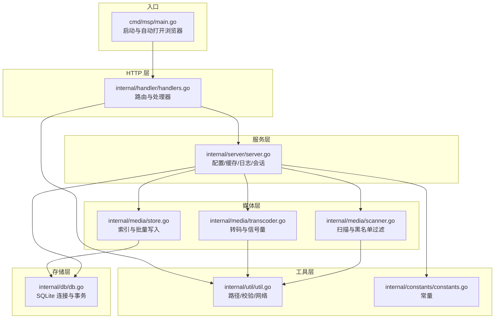
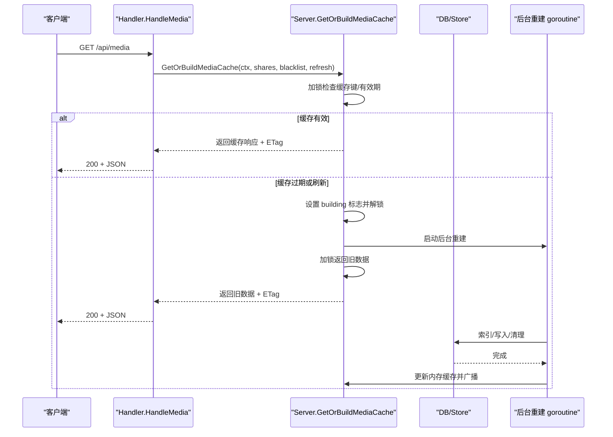
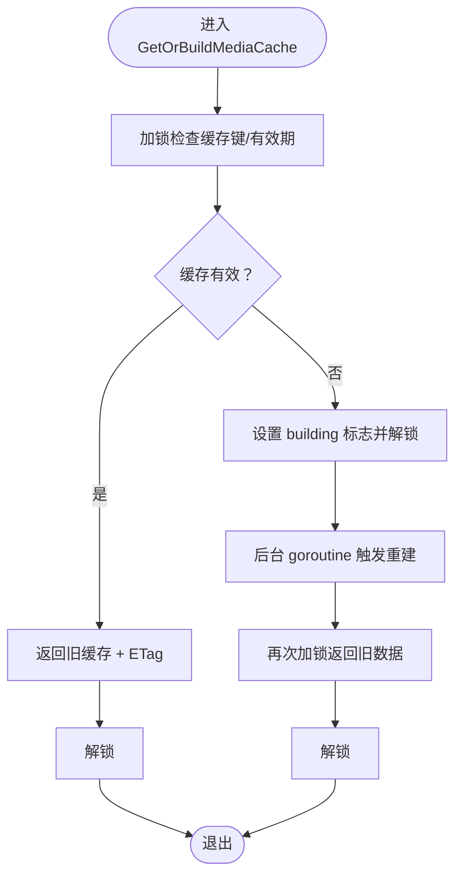
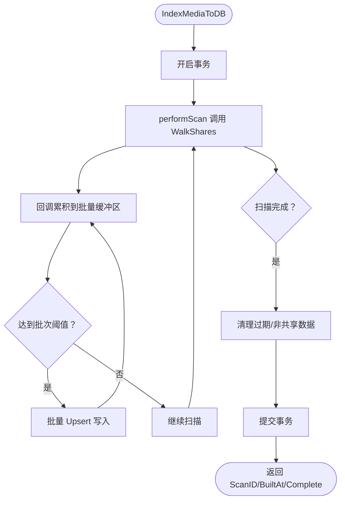
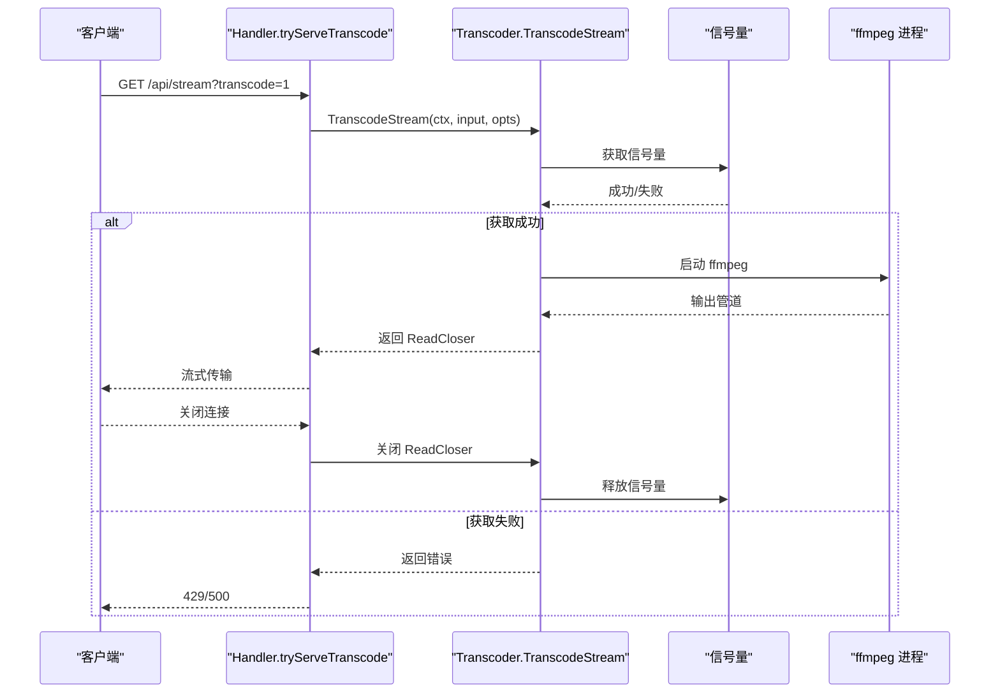
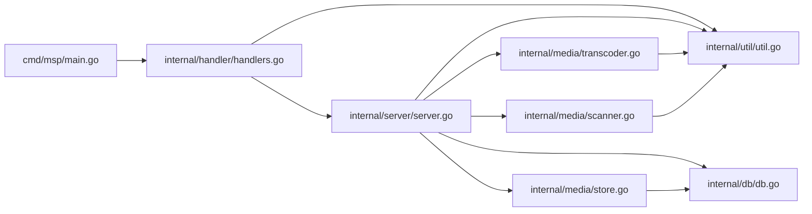

# 并发处理优化

<cite>
**本文引用的文件**
- [cmd/msp/main.go](file://cmd/msp/main.go)
- [internal/server/server.go](file://internal/server/server.go)
- [internal/media/transcoder.go](file://internal/media/transcoder.go)
- [internal/media/scanner.go](file://internal/media/scanner.go)
- [internal/media/store.go](file://internal/media/store.go)
- [internal/handler/handlers.go](file://internal/handler/handlers.go)
- [internal/db/db.go](file://internal/db/db.go)
- [internal/util/util.go](file://internal/util/util.go)
- [internal/constants/constants.go](file://internal/constants/constants.go)
- [PERFORMANCE_ANALYSIS.md](file://PERFORMANCE_ANALYSIS.md)
- [.golangci.yml](file://.golangci.yml)
</cite>

## 目录
1. [简介](#简介)
2. [项目结构](#项目结构)
3. [核心组件](#核心组件)
4. [架构总览](#架构总览)
5. [详细组件分析](#详细组件分析)
6. [依赖关系分析](#依赖关系分析)
7. [性能考量](#性能考量)
8. [故障排查指南](#故障排查指南)
9. [结论](#结论)
10. [附录](#附录)

## 简介
本指南聚焦于 MSP 项目的并发处理优化，围绕 goroutine 使用模式（并发限制、信号量控制、协程池管理）、锁优化策略（细粒度锁设计、原子操作替代、读写锁使用）、并发数据结构（并发映射、条件变量、通道通信）、竞态条件检测与预防（双重检查锁定、内存顺序约束），以及并发性能监控与调试工具展开。文档结合代码实际实现，提供可视化图示与实践建议，帮助开发者在保证正确性的前提下提升系统吞吐与稳定性。

## 项目结构
MSP 采用分层架构：入口程序负责初始化与服务启动；HTTP 层负责路由与中间件；业务层负责配置、媒体扫描与转码；存储层负责 SQLite 数据持久化；工具层提供通用能力（路径、校验、网络等）。并发点主要分布在：
- 服务端缓存构建与重建（含条件变量与信号量）
- 媒体扫描与数据库写入（批量插入、事务控制）
- 转码流程（信号量、子进程、通道）
- 配置热重载（定时器 + goroutine）

图表来源
- [cmd/msp/main.go](file://cmd/msp/main.go#L26-L83)
- [internal/handler/handlers.go](file://internal/handler/handlers.go#L38-L43)
- [internal/server/server.go](file://internal/server/server.go#L31-L74)
- [internal/media/transcoder.go](file://internal/media/transcoder.go#L15-L17)
- [internal/media/scanner.go](file://internal/media/scanner.go#L27-L57)
- [internal/media/store.go](file://internal/media/store.go#L51-L94)
- [internal/db/db.go](file://internal/db/db.go#L32-L72)
- [internal/util/util.go](file://internal/util/util.go#L18-L34)
- [internal/constants/constants.go](file://internal/constants/constants.go#L7-L50)

章节来源
- [cmd/msp/main.go](file://cmd/msp/main.go#L26-L83)
- [internal/server/server.go](file://internal/server/server.go#L31-L74)

## 核心组件
- 服务端缓存与重建：使用 RWMutex 保护配置，Mutex + Cond 协调缓存构建，支持后台重建与 ETag 条件请求。
- 媒体扫描与索引：基于 WalkShares 的回调扫描，批量写入数据库，事务控制与清理过期数据。
- 转码控制：全局信号量限制并发转码会话，转码完成后释放；转码流通过管道与 defer 保障资源回收。
- 数据库连接池：SQLite 单连接 + WAL + 预编译语句，减少锁竞争与提升写入性能。
- 配置热重载：定时器周期检查配置文件修改，必要时更新内存配置并记录日志。

章节来源
- [internal/server/server.go](file://internal/server/server.go#L31-L74)
- [internal/media/store.go](file://internal/media/store.go#L51-L94)
- [internal/media/transcoder.go](file://internal/media/transcoder.go#L15-L17)
- [internal/db/db.go](file://internal/db/db.go#L32-L72)

## 架构总览
以下序列图展示“媒体缓存获取”关键流程，体现并发限制、条件变量与后台重建协作。

图表来源
- [internal/handler/handlers.go](file://internal/handler/handlers.go#L333-L362)
- [internal/server/server.go](file://internal/server/server.go#L332-L437)

## 详细组件分析

### 1) 服务端缓存与重建（并发限制与条件变量）
- 设计要点
  - 使用 RWMutex 保护配置读写，降低锁争用。
  - 使用 Mutex + Cond 协调缓存构建，避免多个 goroutine 同时重建。
  - 使用 ETag + JSON 序列化减少内存占用与序列化开销。
  - 支持后台重建：在持有锁外触发重建，锁内仅更新状态并广播通知。
- 并发限制
  - 通过布尔标志与条件变量避免重复重建。
  - 可引入信号量限制同时重建数量（参考性能分析建议）。
- 竞态条件
  - 双重检查锁定模式：先读锁检查，再根据情况加锁设置标志位，最后解锁后异步重建，返回旧数据，避免长时间持锁。

图表来源
- [internal/server/server.go](file://internal/server/server.go#L332-L396)

章节来源
- [internal/server/server.go](file://internal/server/server.go#L31-L74)
- [internal/server/server.go](file://internal/server/server.go#L332-L437)
- [PERFORMANCE_ANALYSIS.md](file://PERFORMANCE_ANALYSIS.md#L464-L502)

### 2) 媒体扫描与索引（批量写入与事务）
- 设计要点
  - WalkShares 回调扫描，支持黑名单过滤与上限控制。
  - 批量插入缓冲区（固定批次大小）减少数据库往返。
  - 事务包裹索引过程，失败回滚，成功提交。
  - 清理过期数据与非共享根目录数据，保持数据一致性。
- 并发与锁
  - 扫描阶段无共享状态，回调中追加到批量缓冲区。
  - 事务内批量写入，避免锁竞争。
- 性能优化
  - 批量 Upsert 提升写入效率。
  - 索引复合字段，优化查询与清理。

图表来源
- [internal/media/store.go](file://internal/media/store.go#L51-L94)
- [internal/media/store.go](file://internal/media/store.go#L111-L152)

章节来源
- [internal/media/store.go](file://internal/media/store.go#L51-L94)
- [internal/media/store.go](file://internal/media/store.go#L111-L152)
- [internal/media/scanner.go](file://internal/media/scanner.go#L27-L57)

### 3) 转码控制（信号量与资源回收）
- 设计要点
  - 全局信号量限制并发转码会话数量，避免 CPU 过载。
  - 转码完成后通过自定义 ReadCloser 的 Close 方法释放信号量。
  - 转码参数智能选择：H.264/AAC/MP3 直接复制，其他编码使用 libx264 快速预设与限制线程数。
  - 子进程等待在独立 goroutine，避免阻塞主流程。
- 并发与资源
  - 信号量作为轻量级并发控制器，配合 defer 确保异常路径也能释放。
  - 转码流通过管道输出，避免一次性读取整个文件。

图表来源
- [internal/handler/handlers.go](file://internal/handler/handlers.go#L534-L564)
- [internal/media/transcoder.go](file://internal/media/transcoder.go#L139-L248)

章节来源
- [internal/media/transcoder.go](file://internal/media/transcoder.go#L15-L17)
- [internal/media/transcoder.go](file://internal/media/transcoder.go#L139-L248)
- [internal/handler/handlers.go](file://internal/handler/handlers.go#L534-L564)

### 4) 配置热重载（定时器 + goroutine）
- 设计要点
  - 定时器周期检查配置文件修改时间，若变化则重新加载并保存。
  - 使用 RWMutex 保护配置读写，避免并发读写冲突。
  - 日志轮转与旋转检查频率通过原子计数器控制，降低 Stat 调用开销。
- 并发与性能
  - 独立 goroutine 轮询，不影响主线程。
  - 仅在文件变更时更新配置，减少不必要的写入。

章节来源
- [internal/server/server.go](file://internal/server/server.go#L140-L188)
- [internal/server/server.go](file://internal/server/server.go#L190-L284)

### 5) 数据库连接池与事务（锁竞争最小化）
- 设计要点
  - SQLite 单连接 + WAL 模式，减少锁竞争。
  - 预编译语句缓存，提升查询性能。
  - 禁用默认事务，业务层显式控制事务边界。
  - 批量 Upsert 减少往返次数。
- 并发与锁
  - 通过单连接与 WAL 降低锁冲突概率。
  - 事务内批量写入，避免频繁提交。

章节来源
- [internal/db/db.go](file://internal/db/db.go#L32-L72)
- [internal/db/db.go](file://internal/db/db.go#L130-L172)

### 6) 并发数据结构与工具
- 并发映射
  - 使用 sync.Map 存储已见 IP，避免锁争用。
- 条件变量
  - 使用 sync.Cond 协调缓存构建完成通知。
- 通道通信
  - 使用信号量 chan 控制并发转码会话。
- 原子操作
  - 使用 atomic.AddInt32 控制日志轮转检查频率。
- 读写锁
  - 使用 RWMutex 保护配置读写，降低锁粒度。

章节来源
- [internal/server/server.go](file://internal/server/server.go#L48-L51)
- [internal/server/server.go](file://internal/server/server.go#L72-L72)
- [internal/media/transcoder.go](file://internal/media/transcoder.go#L15-L17)
- [internal/server/server.go](file://internal/server/server.go#L244-L246)

### 7) 竞态条件检测与预防
- 双重检查锁定
  - 缓存获取流程中先读锁检查，再根据情况加锁设置标志位，最后解锁后异步重建，返回旧数据。
- 内存顺序约束
  - 使用锁与条件变量保证状态变更的可见性与顺序。
- 建议
  - 参考性能分析文档中的建议，增加并发重建信号量与 goroutine 数量监控。

章节来源
- [internal/server/server.go](file://internal/server/server.go#L332-L396)
- [PERFORMANCE_ANALYSIS.md](file://PERFORMANCE_ANALYSIS.md#L543-L586)

## 依赖关系分析
- 入口程序启动 HTTP 服务器，注册路由，启用日志与安全中间件。
- HTTP 处理器依赖服务层获取配置与缓存，依赖媒体层进行转码与直播，依赖数据库层进行进度与偏好设置。
- 服务层依赖媒体层进行扫描与缓存构建，依赖数据库层进行持久化。
- 媒体层依赖工具层进行路径规范化与安全校验。

图表来源
- [cmd/msp/main.go](file://cmd/msp/main.go#L85-L107)
- [internal/handler/handlers.go](file://internal/handler/handlers.go#L38-L43)
- [internal/server/server.go](file://internal/server/server.go#L31-L74)

章节来源
- [cmd/msp/main.go](file://cmd/msp/main.go#L85-L107)
- [internal/handler/handlers.go](file://internal/handler/handlers.go#L38-L43)

## 性能考量
- 并发限制
  - 转码并发：通过信号量限制为 2，避免 CPU 过载。
  - 缓存重建：建议引入信号量限制同时重建数量（参考性能分析建议）。
- 锁优化
  - 使用 RWMutex 降低配置读写争用。
  - 使用细粒度锁拆分不同子域（配置/缓存/日志/会话）。
  - 使用原子计数器替代锁（如日志轮转检查）。
- 数据结构
  - 使用 sync.Map 存储已见 IP，避免锁争用。
  - 使用 sync.Cond 协调缓存构建完成通知。
- 数据库
  - 单连接 + WAL + 预编译语句 + 批量 Upsert。
  - 建议添加复合索引优化清理与排序查询。
- 内存与 GC
  - 积极 GC 与定期释放 OS 内存。
  - 大文件字幕转换采用流式处理，避免一次性读取。

章节来源
- [internal/media/transcoder.go](file://internal/media/transcoder.go#L15-L17)
- [internal/server/server.go](file://internal/server/server.go#L48-L51)
- [internal/db/db.go](file://internal/db/db.go#L54-L71)
- [PERFORMANCE_ANALYSIS.md](file://PERFORMANCE_ANALYSIS.md#L464-L502)

## 故障排查指南
- 转码失败
  - 检查 ffmpeg/ffprobe 是否安装，查看 stderr 输出。
  - 确认信号量未被异常占用（关闭连接后会释放）。
- 缓存未更新
  - 检查缓存 TTL 与 ETag 逻辑，确认是否命中条件请求。
  - 观察后台重建 goroutine 是否被并发限制阻塞。
- 数据库写入慢
  - 检查是否使用批量 Upsert，确认事务边界。
  - 关注索引是否覆盖清理与排序场景。
- 配置热重载无效
  - 检查配置文件修改时间是否更新，定时器是否正常运行。
- 并发过高导致 CPU 占用
  - 调整转码并发限制与缓存重建并发限制。
  - 监控 goroutine 数量与内存使用。

章节来源
- [internal/media/transcoder.go](file://internal/media/transcoder.go#L91-L104)
- [internal/server/server.go](file://internal/server/server.go#L140-L188)
- [internal/db/db.go](file://internal/db/db.go#L130-L172)

## 结论
MSP 在并发处理方面已具备良好的基础：信号量控制转码、条件变量协调缓存、批量写入数据库、RWMutex 保护配置等。为进一步提升性能与稳定性，建议：
- 引入并发重建信号量与 goroutine 数量监控；
- 细粒度锁拆分与原子操作替代；
- 数据库复合索引优化与更多 PRAGMA 调优；
- 大文件与高并发场景下的流式处理与资源回收。

## 附录
- 并发工具与规范
  - 使用 .golangci.yml 启用静态检查，持续发现并发与安全问题。
  - 在长时间运行任务中传递 context，支持超时与取消。

章节来源
- [.golangci.yml](file://.golangci.yml#L7-L16)