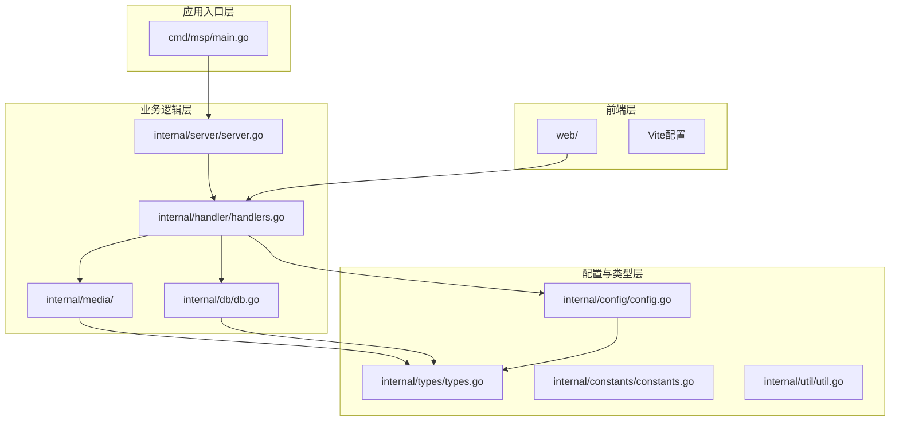
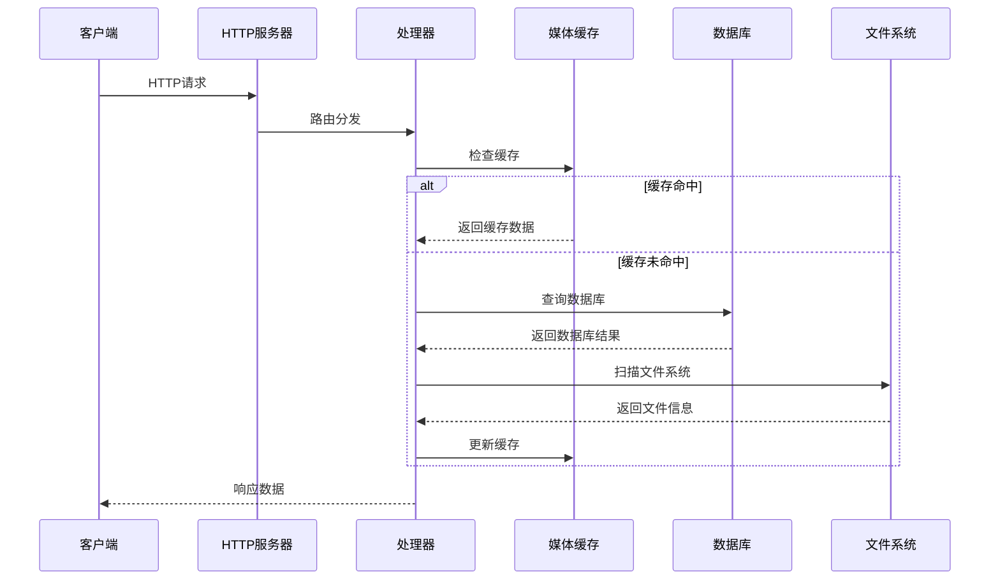
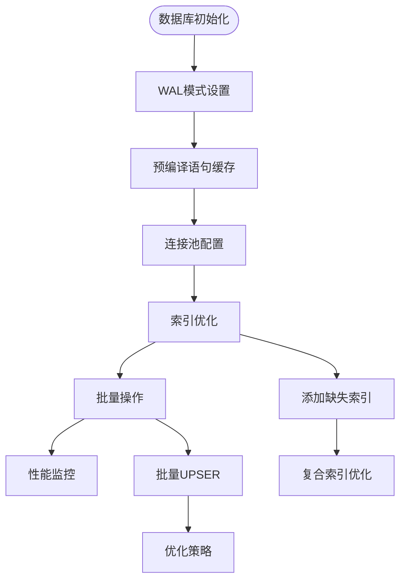
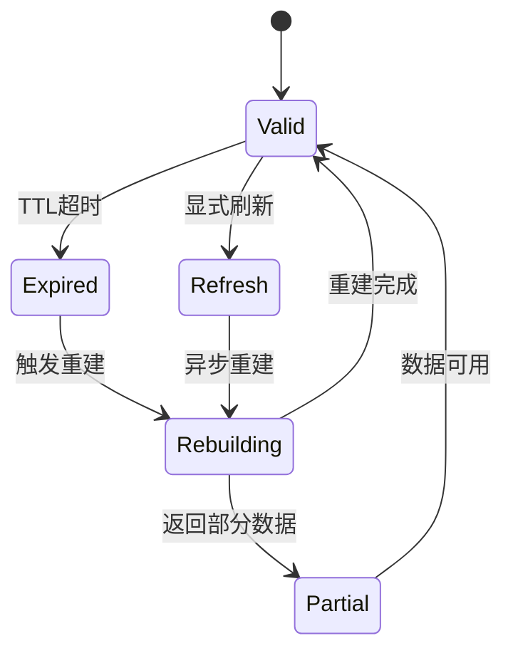
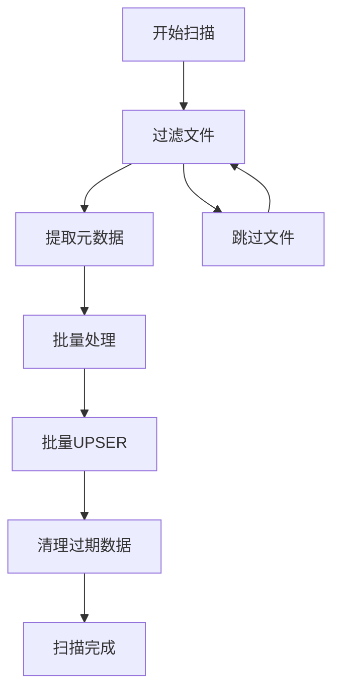
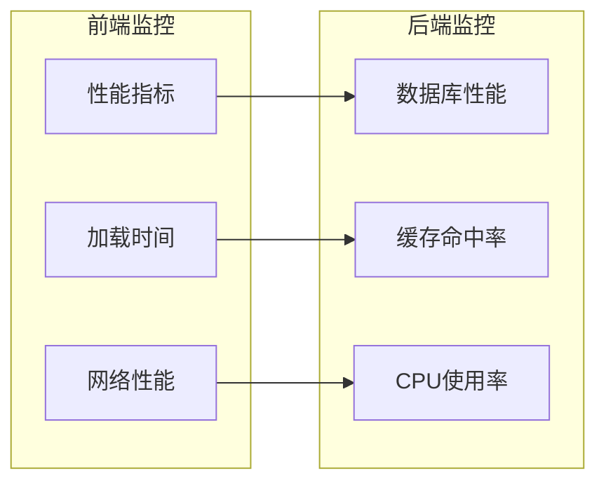
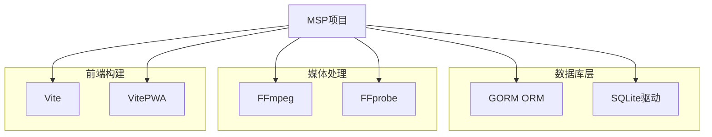
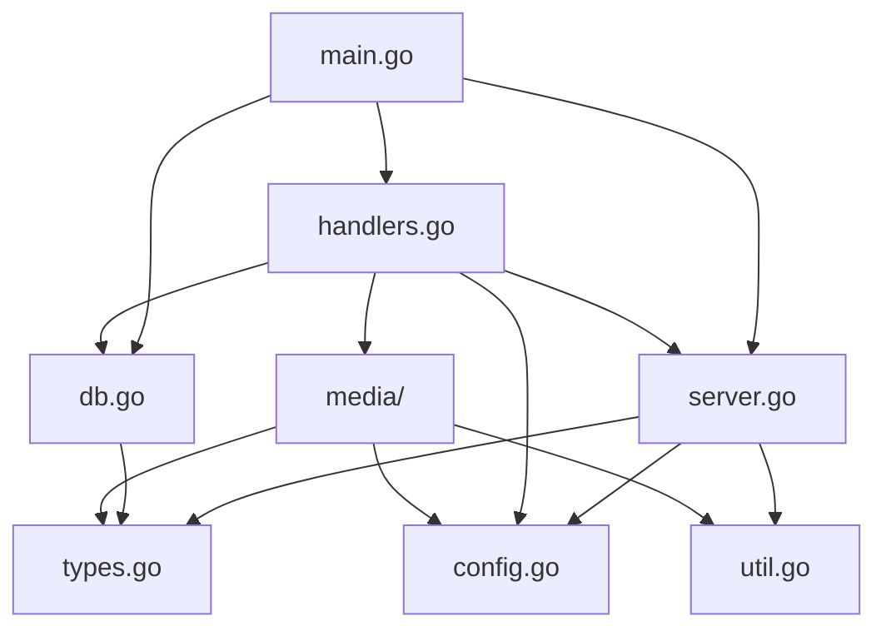

# 性能优化

<cite>
**本文档引用的文件**
- [cmd/msp/main.go](file://cmd/msp/main.go)
- [internal/db/db.go](file://internal/db/db.go)
- [internal/server/server.go](file://internal/server/server.go)
- [internal/media/transcoder.go](file://internal/media/transcoder.go)
- [internal/media/scanner.go](file://internal/media/scanner.go)
- [internal/handler/handlers.go](file://internal/handler/handlers.go)
- [internal/util/util.go](file://internal/util/util.go)
- [internal/config/config.go](file://internal/config/config.go)
- [internal/types/types.go](file://internal/types/types.go)
- [internal/constants/constants.go](file://internal/constants/constants.go)
- [PERFORMANCE_ANALYSIS.md](file://PERFORMANCE_ANALYSIS.md)
- [go.mod](file://go.mod)
- [web/vite.config.js](file://web/vite.config.js)
</cite>

## 目录
1. [简介](#简介)
2. [项目结构](#项目结构)
3. [核心组件](#核心组件)
4. [架构概览](#架构概览)
5. [详细组件分析](#详细组件分析)
6. [依赖关系分析](#依赖关系分析)
7. [性能考量](#性能考量)
8. [故障排除指南](#故障排除指南)
9. [结论](#结论)
10. [附录](#附录)

## 简介

MSP是一个基于Go语言开发的本地局域网媒体共享和预览系统。该项目实现了完整的媒体管理系统，包括媒体扫描、索引、缓存、转码和播放功能。本文档旨在提供全面的性能优化指南，涵盖内存管理、CPU使用率、网络带宽等关键指标，以及缓存优化、并发处理、数据库查询优化、前端性能优化等方面的最佳实践。

## 项目结构

MSP项目采用模块化的Go语言架构，主要分为以下层次：

**图表来源**
- [cmd/msp/main.go](file://cmd/msp/main.go#L26-L83)
- [internal/server/server.go](file://internal/server/server.go#L31-L74)
- [internal/handler/handlers.go](file://internal/handler/handlers.go#L28-L43)

**章节来源**
- [cmd/msp/main.go](file://cmd/msp/main.go#L1-L151)
- [internal/server/server.go](file://internal/server/server.go#L1-L627)

## 核心组件

### 1. 应用入口与初始化

主程序负责应用的整体初始化，包括：
- 设置垃圾回收策略
- 初始化数据库连接
- 启动配置文件监听
- 启动媒体缓存预构建
- 配置HTTP服务器

### 2. 服务器核心

服务器组件提供：
- 配置管理与热重载
- 媒体缓存管理（内存+磁盘）
- 日志系统管理
- 会话管理
- 并发控制

### 3. 处理器层

处理器负责HTTP请求处理：
- 媒体列表API
- 媒体流API
- 字幕处理API
- 配置管理API
- 转码控制API

### 4. 媒体处理引擎

媒体处理组件包括：
- 媒体扫描与索引
- 转码引擎
- 字幕处理
- 文件系统操作

**章节来源**
- [internal/db/db.go](file://internal/db/db.go#L32-L72)
- [internal/server/server.go](file://internal/server/server.go#L31-L74)
- [internal/handler/handlers.go](file://internal/handler/handlers.go#L28-L43)

## 架构概览

MSP采用分层架构设计，确保了良好的性能表现和可维护性：

**图表来源**
- [internal/server/server.go](file://internal/server/server.go#L332-L396)
- [internal/handler/handlers.go](file://internal/handler/handlers.go#L333-L362)

## 详细组件分析

### 数据库性能优化

#### 当前实现分析

数据库层已经实现了多项性能优化措施：

**SQLite WAL模式优化**
- 使用WAL模式提高并发写入性能
- 单连接模式避免锁竞争
- 预编译语句缓存减少SQL解析开销

**索引策略**
- 复合索引优化查询性能
- 针对扫描ID和共享标签的索引设计
- 支持高效的数据清理操作

**事务管理**
- 禁用默认事务提高写入性能
- 手动控制事务边界
- 批量操作优化

#### 性能优化建议

基于现有实现，可以进一步优化：

**图表来源**
- [internal/db/db.go](file://internal/db/db.go#L54-L71)
- [PERFORMANCE_ANALYSIS.md](file://PERFORMANCE_ANALYSIS.md#L56-L79)

**章节来源**
- [internal/db/db.go](file://internal/db/db.go#L32-L72)
- [PERFORMANCE_ANALYSIS.md](file://PERFORMANCE_ANALYSIS.md#L9-L52)

### 媒体缓存系统

#### 多级缓存策略

MSP实现了高效的多级缓存系统：

**内存缓存**
- 序列化后的JSON数据存储
- ETag支持条件请求
- TTL过期机制
- 后台重建机制

**磁盘缓存**
- 失败时的持久化存储
- 快速恢复机制
- 磁盘空间管理

**缓存键生成**
- 基于配置内容的动态键生成
- FNV哈希算法
- 时间戳集成

#### 缓存失效机制

**图表来源**
- [internal/server/server.go](file://internal/server/server.go#L332-L437)

**章节来源**
- [internal/server/server.go](file://internal/server/server.go#L322-L437)
- [PERFORMANCE_ANALYSIS.md](file://PERFORMANCE_ANALYSIS.md#L260-L297)

### 并发处理优化

#### 转码并发控制

转码系统实现了严格的并发控制：

**信号量机制**
- 限制同时进行的转码任务数量
- 防止CPU资源耗尽
- 自动资源释放

**转码策略优化**
- 智能检测媒体编码
- 直接复制支持的格式
- 动态参数调整

#### 并发锁优化

服务器组件使用多种锁策略：

**读写锁分离**
- 配置读取使用读锁
- 配置修改使用写锁
- 提高并发性能

**细粒度锁**
- 将大锁拆分为多个小锁
- 减少锁竞争
- 提高系统吞吐量

**章节来源**
- [internal/media/transcoder.go](file://internal/media/transcoder.go#L15-L83)
- [internal/server/server.go](file://internal/server/server.go#L518-L541)

### 媒体扫描与索引

#### 扫描优化策略

媒体扫描系统采用了多项优化技术：

**目录缓存**
- LRU缓存机制
- 限制缓存大小
- 避免内存泄漏

**黑名单过滤**
- 正则表达式优化
- 多级过滤策略
- 性能友好的匹配算法

**文件系统操作优化**
- 批量文件操作
- 避免重复系统调用
- 智能路径处理

#### 索引构建优化

**图表来源**
- [internal/media/scanner.go](file://internal/media/scanner.go#L27-L56)

**章节来源**
- [internal/media/scanner.go](file://internal/media/scanner.go#L27-L56)
- [PERFORMANCE_ANALYSIS.md](file://PERFORMANCE_ANALYSIS.md#L81-L128)

### 前端性能优化

#### 资源加载优化

前端系统已经实现了多项性能优化：

**PWA支持**
- 离线缓存
- 渐进式Web应用
- 快速启动

**静态资源优化**
- CDN集成
- 资源预加载
- 缓存策略优化

**代码分割**
- 按需加载
- 第三方库分离
- 功能模块化

#### 性能监控

**图表来源**
- [web/vite.config.js](file://web/vite.config.js#L1-L48)

**章节来源**
- [web/vite.config.js](file://web/vite.config.js#L1-L48)
- [PERFORMANCE_ANALYSIS.md](file://PERFORMANCE_ANALYSIS.md#L590-L730)

## 依赖关系分析

### 外部依赖

MSP项目使用了经过精心选择的外部依赖：

**图表来源**
- [go.mod](file://go.mod#L5-L30)

### 内部模块依赖

内部模块之间的依赖关系清晰明确：

**图表来源**
- [cmd/msp/main.go](file://cmd/msp/main.go#L18-L23)
- [internal/handler/handlers.go](file://internal/handler/handlers.go#L3-L26)

**章节来源**
- [go.mod](file://go.mod#L1-L31)

## 性能考量

### 内存管理

#### 当前优化措施

MSP在内存管理方面已经实现了多项优化：

**垃圾回收优化**
- 设置积极的GC策略
- 定期强制内存回收
- 内存限制配置

**大对象处理**
- 流式处理大文件
- 缓冲区池复用
- 内存映射优化

**内存泄漏防护**
- 严格的资源释放
- LRU缓存淘汰
- 定期清理机制

#### 性能监控指标

建议监控以下关键指标：
- GC暂停时间
- 内存分配速率
- 对象存活率
- 缓存命中率

### CPU使用率优化

#### 并发控制策略

**转码并发限制**
- 限制同时进行的转码任务
- 防止CPU过载
- 动态资源调整

**扫描优化**
- 批量处理减少系统调用
- 智能过滤减少工作量
- 并行处理优化

**计算密集型操作**
- 结果缓存
- 异步处理
- 资源池管理

### 网络带宽优化

#### 传输优化

**HTTP头优化**
- ETag支持条件请求
- 缓存控制策略
- Range请求支持

**流媒体优化**
- 分块传输编码
- 自适应码率
- 前向纠错

**CDN集成**
- 静态资源CDN
- 动态内容缓存
- 智能路由

### 存储I/O优化

#### 文件系统优化

**批量操作**
- 批量文件读写
- 减少系统调用
- 内存映射优化

**缓存策略**
- LRU缓存
- 预读优化
- 写入合并

**I/O调度**
- 顺序访问优化
- 随机访问缓存
- 磁盘队列优化

## 故障排除指南

### 常见性能问题诊断

#### 数据库性能问题

**症状识别**
- 查询响应时间过长
- 数据库锁等待
- 写入延迟增加

**诊断步骤**
1. 检查索引使用情况
2. 分析慢查询日志
3. 监控连接池状态
4. 评估批量操作效果

**解决方案**
- 添加缺失的索引
- 优化查询计划
- 调整连接池配置
- 实施批量操作

#### 缓存性能问题

**症状识别**
- 缓存命中率低
- 缓存失效频繁
- 内存使用过高

**诊断步骤**
1. 分析缓存访问模式
2. 检查缓存键设计
3. 监控缓存生命周期
4. 评估缓存策略有效性

**解决方案**
- 优化缓存键生成
- 调整TTL策略
- 实施LRU淘汰
- 增加缓存层级

#### 并发性能问题

**症状识别**
- 线程阻塞
- 死锁现象
- 资源竞争激烈

**诊断步骤**
1. 分析锁使用情况
2. 检查并发模式
3. 监控资源使用
4. 评估同步机制

**解决方案**
- 优化锁粒度
- 实施无锁数据结构
- 调整并发策略
- 实施资源池

### 性能监控工具使用

#### Go语言内置工具

**pprof分析**
- CPU性能分析
- 内存使用分析
- 程序跟踪

**运行时监控**
- GODEBUG环境变量
- GC统计信息
- 内存分配跟踪

#### 外部监控工具

**系统监控**
- CPU使用率
- 内存使用情况
- 磁盘I/O
- 网络流量

**应用监控**
- 请求响应时间
- 错误率统计
- 缓存性能指标
- 数据库性能指标

**章节来源**
- [PERFORMANCE_ANALYSIS.md](file://PERFORMANCE_ANALYSIS.md#L378-L460)

## 结论

MSP项目在性能优化方面已经实现了相当完善的架构设计。通过多级缓存、并发控制、数据库优化和前端性能优化等措施，系统在各种硬件配置下都能保持良好的性能表现。

### 主要成就

1. **高效的缓存系统** - 实现了内存+磁盘的多级缓存策略
2. **智能的并发控制** - 通过信号量和锁机制保证系统稳定性
3. **优化的数据库设计** - SQLite WAL模式和复合索引的合理使用
4. **完善的媒体处理** - 流式处理和智能转码策略
5. **前端性能优化** - PWA支持和资源优化

### 未来改进方向

1. **监控系统增强** - 实施更全面的性能监控和告警机制
2. **自动调优** - 基于负载的自适应性能调优
3. **分布式扩展** - 支持多节点部署和负载均衡
4. **AI辅助优化** - 使用机器学习预测和优化性能

## 附录

### 不同硬件配置下的性能调优建议

#### 低配置硬件（单核CPU，4GB内存）

**数据库优化**
- 减少WAL模式的使用
- 降低连接池大小
- 禁用预编译语句缓存

**缓存策略**
- 缩短缓存TTL
- 减少缓存大小
- 禁用磁盘缓存

**并发控制**
- 降低并发限制
- 禁用后台重建
- 减少转码任务

#### 中等配置硬件（双核CPU，8GB内存）

**推荐配置**
- 启用WAL模式
- 使用默认连接池
- 启用预编译语句
- 启用磁盘缓存
- 适度并发控制

#### 高端配置硬件（多核CPU，32GB+内存）

**优化策略**
- 启用所有优化
- 增加并发限制
- 启用高级缓存策略
- 实施批量操作

### 性能测试基准

建议建立以下性能测试基准：
- 媒体扫描速度
- 缓存命中率
- 并发处理能力
- 转码性能
- 内存使用效率