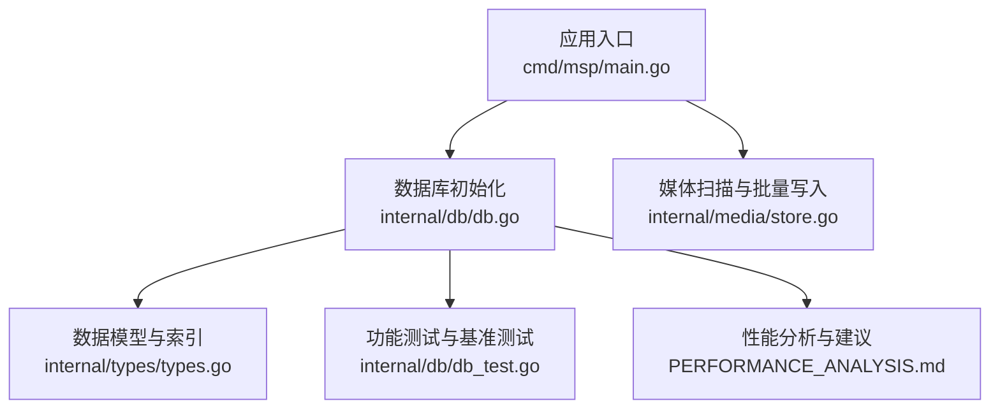
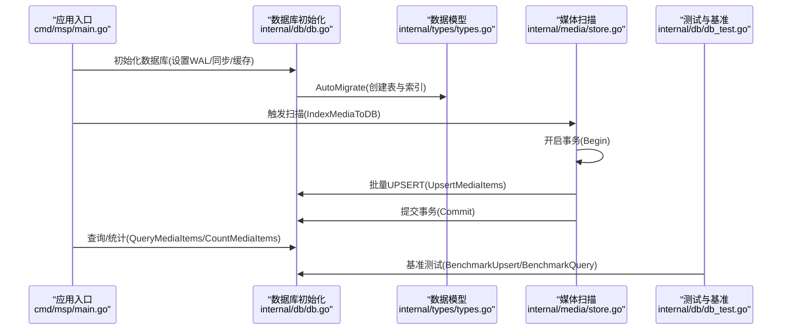
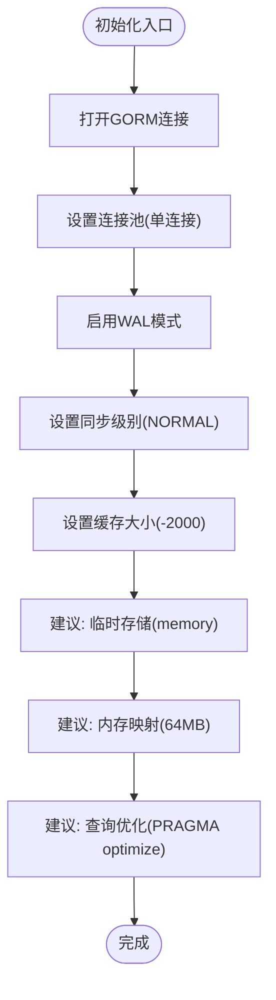
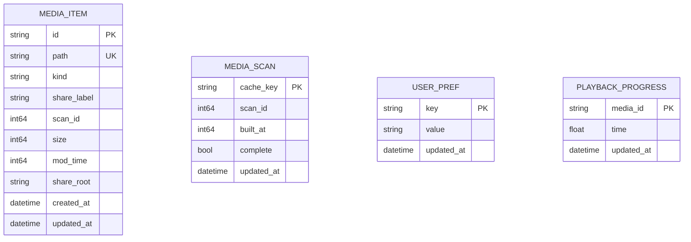
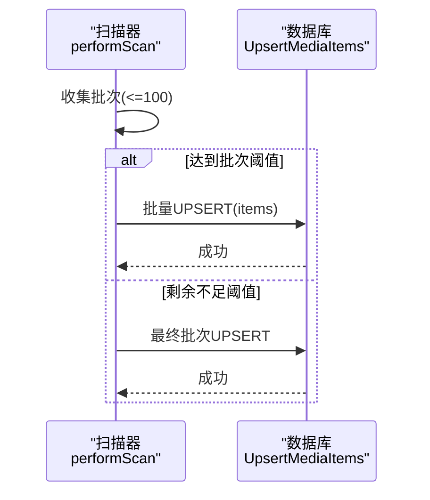
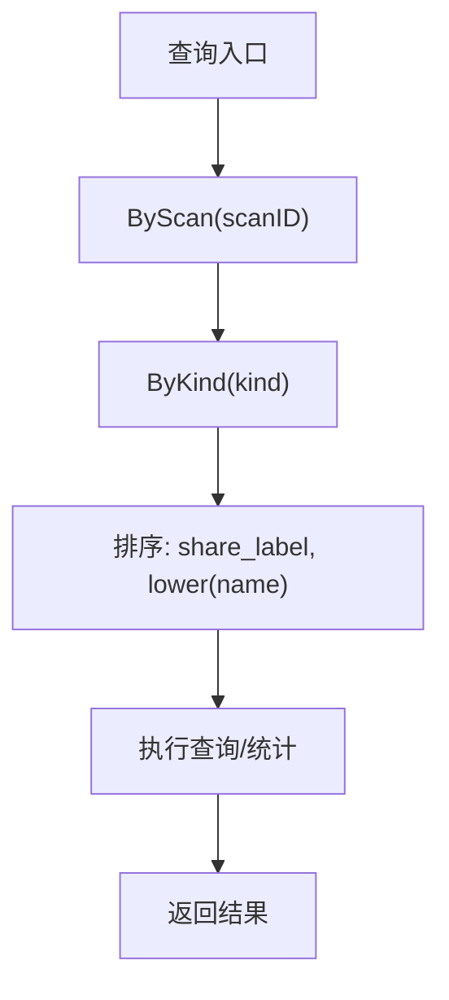
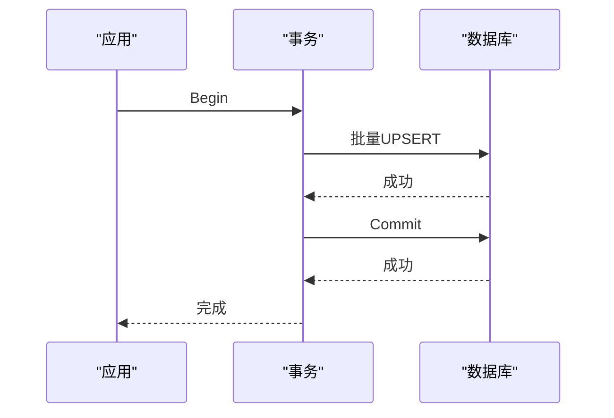
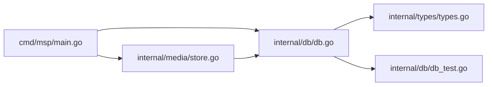

# 数据库性能优化

<cite>
**本文引用的文件**
- [internal/db/db.go](file://internal/db/db.go)
- [internal/types/types.go](file://internal/types/types.go)
- [internal/media/store.go](file://internal/media/store.go)
- [cmd/msp/main.go](file://cmd/msp/main.go)
- [PERFORMANCE_ANALYSIS.md](file://PERFORMANCE_ANALYSIS.md)
- [internal/db/db_test.go](file://internal/db/db_test.go)
</cite>

## 目录
1. [简介](#简介)
2. [项目结构](#项目结构)
3. [核心组件](#核心组件)
4. [架构总览](#架构总览)
5. [详细组件分析](#详细组件分析)
6. [依赖关系分析](#依赖关系分析)
7. [性能考量](#性能考量)
8. [故障排查指南](#故障排查指南)
9. [结论](#结论)
10. [附录](#附录)

## 简介
本指南聚焦于MSP项目中基于SQLite的数据库性能优化实践，结合现有实现与文档建议，系统阐述以下主题：
- SQLite WAL模式配置与同步级别调优
- 预编译语句缓存与连接池策略
- 索引优化设计与查询计划分析
- 批量操作优化（批量插入、UPSERT、事务）
- 数据库配置参数（缓存大小、内存映射、临时存储等）
- 性能监控指标与调优建议
- 面向不同硬件配置的优化策略

## 项目结构
数据库相关的核心代码集中在以下模块：
- 数据库初始化与连接管理：internal/db/db.go
- 数据模型定义（含索引注解）：internal/types/types.go
- 媒体扫描与批量写入流程：internal/media/store.go
- 应用入口与数据库初始化时机：cmd/msp/main.go
- 性能分析与优化建议：PERFORMANCE_ANALYSIS.md
- 数据库功能测试与基准测试：internal/db/db_test.go

图表来源
- [cmd/msp/main.go](file://cmd/msp/main.go#L26-L83)
- [internal/db/db.go](file://internal/db/db.go#L32-L72)
- [internal/types/types.go](file://internal/types/types.go#L16-L32)
- [internal/media/store.go](file://internal/media/store.go#L49-L94)
- [PERFORMANCE_ANALYSIS.md](file://PERFORMANCE_ANALYSIS.md#L1-L80)
- [internal/db/db_test.go](file://internal/db/db_test.go#L164-L210)

章节来源
- [cmd/msp/main.go](file://cmd/msp/main.go#L26-L83)
- [internal/db/db.go](file://internal/db/db.go#L32-L72)
- [internal/types/types.go](file://internal/types/types.go#L16-L32)
- [internal/media/store.go](file://internal/media/store.go#L49-L94)
- [PERFORMANCE_ANALYSIS.md](file://PERFORMANCE_ANALYSIS.md#L1-L80)
- [internal/db/db_test.go](file://internal/db/db_test.go#L164-L210)

## 核心组件
- 数据库初始化与配置
  - 使用GORM与sqlite驱动，启用预编译语句缓存与跳过默认事务
  - 连接池设置为单连接（SQLite推荐）
  - 启用WAL模式、调整同步级别、设置缓存大小
- 数据模型与索引
  - 媒体项主键、唯一索引、复合索引（kind、share_label、scan_id）
- 批量写入与事务
  - 媒体扫描阶段采用批量UPSERT，配合显式事务
- 查询与统计
  - 通过Scopes组合查询条件，支持按scan_id与kind过滤
- 性能测试
  - 包含批量UPSERT与查询的基准测试

章节来源
- [internal/db/db.go](file://internal/db/db.go#L32-L72)
- [internal/types/types.go](file://internal/types/types.go#L16-L32)
- [internal/media/store.go](file://internal/media/store.go#L111-L152)
- [internal/db/db_test.go](file://internal/db/db_test.go#L548-L575)

## 架构总览
下图展示了数据库初始化、媒体扫描与查询的整体流程，以及关键优化点的落地位置。

图表来源
- [cmd/msp/main.go](file://cmd/msp/main.go#L26-L83)
- [internal/db/db.go](file://internal/db/db.go#L32-L72)
- [internal/types/types.go](file://internal/types/types.go#L16-L32)
- [internal/media/store.go](file://internal/media/store.go#L49-L94)
- [internal/db/db_test.go](file://internal/db/db_test.go#L548-L575)

## 详细组件分析

### 数据库初始化与配置
- 预编译语句缓存：开启PrepareStmt，减少SQL解析开销
- 跳过默认事务：SkipDefaultTransaction，由业务层控制事务边界
- 连接池：SetMaxOpenConns(1)，避免SQLite锁竞争
- WAL模式：PRAGMA journal_mode=WAL，提升并发写入能力
- 同步级别：PRAGMA synchronous=NORMAL，平衡性能与安全性
- 缓存大小：PRAGMA cache_size=-2000（约2MB），适配小内存设备
- 临时存储：建议启用PRAGMA temp_store=memory（参考性能分析）
- 内存映射：建议启用PRAGMA mmap_size（参考性能分析）

图表来源
- [internal/db/db.go](file://internal/db/db.go#L32-L72)
- [PERFORMANCE_ANALYSIS.md](file://PERFORMANCE_ANALYSIS.md#L56-L79)

章节来源
- [internal/db/db.go](file://internal/db/db.go#L32-L72)
- [PERFORMANCE_ANALYSIS.md](file://PERFORMANCE_ANALYSIS.md#L56-L79)

### 数据模型与索引设计
- 主键：ID
- 唯一索引：Path（保证路径唯一）
- 复合索引：
  - idx_kind、idx_scan_kind：按kind过滤
  - idx_share_label、idx_scan_share_label：按share_label过滤
  - idx_scan_id、idx_scan_kind、idx_scan_share_label：扫描会话维度的多字段过滤
- 推荐补充：
  - idx_cleanup(scan_id, share_root)：清理过期数据
  - idx_sort(scan_id, kind, share_label, name)：排序查询

图表来源
- [internal/types/types.go](file://internal/types/types.go#L16-L52)

章节来源
- [internal/types/types.go](file://internal/types/types.go#L16-L52)
- [PERFORMANCE_ANALYSIS.md](file://PERFORMANCE_ANALYSIS.md#L30-L52)

### 批量插入与UPSERT优化
- 扫描阶段采用批量缓冲（默认100条），减少事务提交次数
- 使用ON CONFLICT ON COLUMN(id) UPDATE ALL进行UPSERT
- 事务边界明确：Begin/Commit，确保一致性与性能平衡

图表来源
- [internal/media/store.go](file://internal/media/store.go#L111-L152)
- [internal/db/db.go](file://internal/db/db.go#L159-L172)

章节来源
- [internal/media/store.go](file://internal/media/store.go#L111-L152)
- [internal/db/db.go](file://internal/db/db.go#L159-L172)
- [internal/db/db_test.go](file://internal/db/db_test.go#L164-L210)

### 查询与统计
- 通过Scopes组合过滤条件（ByScan、ByKind）
- 查询排序：按share_label与名称排序
- 统计接口：CountMediaItems用于总数统计

图表来源
- [internal/db/db.go](file://internal/db/db.go#L101-L114)
- [internal/db/db.go](file://internal/db/db.go#L201-L224)

章节来源
- [internal/db/db.go](file://internal/db/db.go#L101-L114)
- [internal/db/db.go](file://internal/db/db.go#L201-L224)

### 事务处理与并发
- 扫描过程使用显式事务，保证批量写入的一致性
- 测试覆盖并发读写进度（SetProgress/GetProgress）
- 建议：在高并发场景下，保持单连接（SQLite特性）并合理设置WAL

图表来源
- [internal/media/store.go](file://internal/media/store.go#L61-L93)
- [internal/db/db_test.go](file://internal/db/db_test.go#L442-L462)

章节来源
- [internal/media/store.go](file://internal/media/store.go#L61-L93)
- [internal/db/db_test.go](file://internal/db/db_test.go#L442-L462)

## 依赖关系分析
- 应用入口依赖数据库初始化
- 数据库初始化依赖数据模型（AutoMigrate）
- 媒体扫描依赖数据库的批量UPSERT与事务
- 测试依赖数据库功能与基准测试

图表来源
- [cmd/msp/main.go](file://cmd/msp/main.go#L26-L83)
- [internal/db/db.go](file://internal/db/db.go#L32-L72)
- [internal/types/types.go](file://internal/types/types.go#L16-L32)
- [internal/media/store.go](file://internal/media/store.go#L49-L94)
- [internal/db/db_test.go](file://internal/db/db_test.go#L164-L210)

章节来源
- [cmd/msp/main.go](file://cmd/msp/main.go#L26-L83)
- [internal/db/db.go](file://internal/db/db.go#L32-L72)
- [internal/types/types.go](file://internal/types/types.go#L16-L32)
- [internal/media/store.go](file://internal/media/store.go#L49-L94)
- [internal/db/db_test.go](file://internal/db/db_test.go#L164-L210)

## 性能考量
- WAL模式与同步级别
  - WAL模式显著提升并发写入性能；synchronous=NORMAL在性能与可靠性间取得平衡
- 预编译语句缓存
  - PrepareStmt=true减少SQL解析成本，适合高频重复查询
- 连接池策略
  - SQLite单连接策略避免锁竞争；仅在启用WAL时可考虑放宽
- 缓存大小
  - cache_size=-2000（约2MB）适合小内存设备；可根据内存情况调整
- 临时存储与内存映射
  - 建议启用temp_store=memory与mmap_size（参考性能分析），提升临时表与读取性能
- 批量操作
  - 批量UPSERT（默认100条/批）降低事务提交频率；注意内存占用与异常回滚
- 查询优化
  - 利用复合索引（kind、share_label、scan_id）与排序字段组合，减少全表扫描
- 监控与调优
  - 结合基准测试（批量UPSERT与查询）评估不同参数组合的效果
  - 关注慢查询日志（SlowThreshold=2s）定位热点SQL

章节来源
- [internal/db/db.go](file://internal/db/db.go#L32-L72)
- [PERFORMANCE_ANALYSIS.md](file://PERFORMANCE_ANALYSIS.md#L56-L79)
- [internal/db/db_test.go](file://internal/db/db_test.go#L548-L575)

## 故障排查指南
- UNIQUE约束失败
  - 现象：媒体入库时报UNIQUE constraint failed: media_items.id
  - 原因：路径规范化差异导致ID不一致
  - 解决：将冲突检测目标从path迁移到id，确保UPSERT稳定性
- 批量写入卡顿
  - 检查批次大小是否过大导致内存压力
  - 确认事务未频繁提交
- 查询缓慢
  - 检查是否命中复合索引
  - 评估排序字段是否可利用索引
- 并发写入冲突
  - 确保使用WAL模式与单连接策略
  - 控制写入并发，避免过多写操作同时进行

章节来源
- [PERFORMANCE_ANALYSIS.md](file://PERFORMANCE_ANALYSIS.md#L1-L80)
- [internal/db/db.go](file://internal/db/db.go#L159-L172)

## 结论
MSP项目已在SQLite数据库上实施了多项关键性能优化：WAL模式、预编译语句缓存、单连接池、同步级别与缓存大小调优，并通过复合索引与批量UPSERT提升写入与查询效率。为进一步提升性能，建议按性能分析文档逐步引入临时存储内存化、内存映射I/O与查询优化等高级参数，并结合基准测试与监控指标持续迭代。

## 附录
- 快速优化清单
  - 在数据库初始化中添加PRAGMA temp_store=memory与mmap_size
  - 在扫描阶段保持默认100条/批的批量UPSERT
  - 使用复合索引优化常见查询路径（kind、share_label、scan_id）
  - 结合基准测试评估不同参数组合效果

章节来源
- [PERFORMANCE_ANALYSIS.md](file://PERFORMANCE_ANALYSIS.md#L1004-L1018)