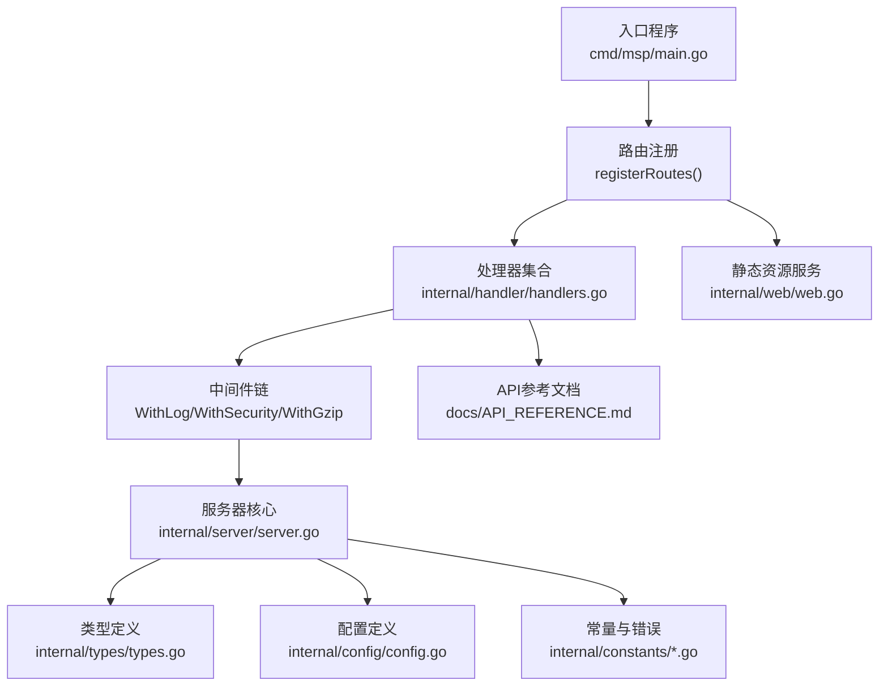
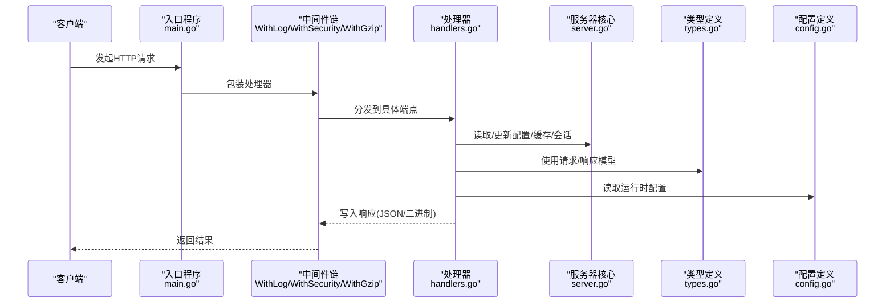
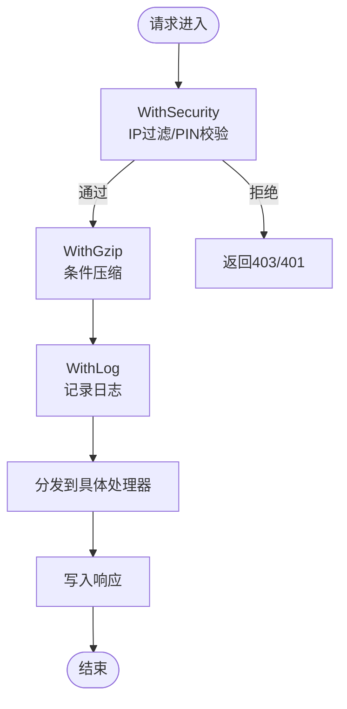
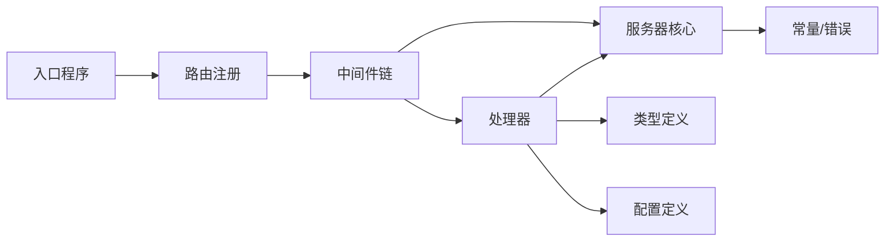

# API扩展

<cite>
**本文引用的文件**
- [cmd/msp/main.go](file://cmd/msp/main.go)
- [internal/handler/handlers.go](file://internal/handler/handlers.go)
- [internal/handler/middleware.go](file://internal/handler/middleware.go)
- [internal/server/server.go](file://internal/server/server.go)
- [internal/web/web.go](file://internal/web/web.go)
- [internal/types/types.go](file://internal/types/types.go)
- [internal/config/config.go](file://internal/config/config.go)
- [internal/constants/constants.go](file://internal/constants/constants.go)
- [internal/constants/errors.go](file://internal/constants/errors.go)
- [docs/API_REFERENCE.md](file://docs/API_REFERENCE.md)
</cite>

## 目录
1. [简介](#简介)
2. [项目结构](#项目结构)
3. [核心组件](#核心组件)
4. [架构总览](#架构总览)
5. [详细组件分析](#详细组件分析)
6. [依赖关系分析](#依赖关系分析)
7. [性能考量](#性能考量)
8. [故障排查指南](#故障排查指南)
9. [结论](#结论)
10. [附录](#附录)

## 简介
本指南面向希望在MSP项目上进行API扩展的开发者，系统讲解如何新增HTTP端点与路由配置、RESTful API设计原则、请求参数处理与响应格式定义；如何修改现有API接口以满足新需求（版本兼容性与向后兼容性）、API演进策略；以及认证与授权机制的扩展方法（自定义认证方式、权限控制、会话管理）。同时提供从设计到实现再到测试的全流程实践步骤，帮助快速、安全地完成API扩展。

## 项目结构
MSP采用分层清晰的Go模块化结构：
- 入口程序负责初始化配置、数据库、嵌入式Web资源，并注册路由与中间件
- 处理器层封装各API端点的业务逻辑
- 中间件层提供日志、压缩、安全（IP过滤/PIN认证）等横切能力
- 服务器层提供配置热重载、媒体缓存、会话管理等基础设施
- 类型与配置层定义API契约与运行时配置
- 文档层提供API参考与发布说明

图表来源
- [cmd/msp/main.go](file://cmd/msp/main.go#L85-L107)
- [internal/handler/handlers.go](file://internal/handler/handlers.go#L1-L721)
- [internal/handler/middleware.go](file://internal/handler/middleware.go#L1-L229)
- [internal/server/server.go](file://internal/server/server.go#L1-L627)
- [internal/web/web.go](file://internal/web/web.go#L1-L84)
- [internal/types/types.go](file://internal/types/types.go#L1-L112)
- [internal/config/config.go](file://internal/config/config.go#L1-L286)
- [internal/constants/constants.go](file://internal/constants/constants.go#L1-L115)
- [internal/constants/errors.go](file://internal/constants/errors.go#L1-L68)
- [docs/API_REFERENCE.md](file://docs/API_REFERENCE.md#L1-L215)

章节来源
- [cmd/msp/main.go](file://cmd/msp/main.go#L26-L83)
- [docs/API_REFERENCE.md](file://docs/API_REFERENCE.md#L1-L215)

## 核心组件
- 路由与入口
  - 入口程序初始化配置、数据库、嵌入式Web资源，注册所有API端点与根路径静态资源，并将处理器置于日志、安全、压缩中间件链之后
- 处理器
  - 统一的Handler结构体承载各端点逻辑，内置JSON解析、响应写入、错误处理与内容协商
- 中间件
  - WithLog：统一记录请求耗时与状态
  - WithSecurity：IP白/黑名单与PIN认证
  - WithGzip：对API响应进行gzip压缩（排除流媒体）
- 服务器核心
  - 提供配置热重载、媒体缓存（含ETag与增量重建）、日志轮转、会话管理（PIN）
- 类型与配置
  - 定义API响应模型、请求模型与运行时配置结构，确保前后端契约一致
- 常量与错误
  - 统一错误消息与HTTP状态码常量，便于一致性处理

章节来源
- [cmd/msp/main.go](file://cmd/msp/main.go#L85-L107)
- [internal/handler/handlers.go](file://internal/handler/handlers.go#L28-L43)
- [internal/handler/middleware.go](file://internal/handler/middleware.go#L45-L120)
- [internal/server/server.go](file://internal/server/server.go#L31-L74)
- [internal/types/types.go](file://internal/types/types.go#L54-L112)
- [internal/config/config.go](file://internal/config/config.go#L77-L146)
- [internal/constants/errors.go](file://internal/constants/errors.go#L3-L67)

## 架构总览
MSP的API扩展遵循“路由—中间件—处理器—服务/存储”的分层架构。新增端点只需在入口处注册路由，编写处理器函数，必要时接入中间件与服务器能力即可。

图表来源
- [cmd/msp/main.go](file://cmd/msp/main.go#L65-L82)
- [internal/handler/middleware.go](file://internal/handler/middleware.go#L45-L120)
- [internal/handler/handlers.go](file://internal/handler/handlers.go#L45-L66)
- [internal/server/server.go](file://internal/server/server.go#L127-L138)
- [internal/types/types.go](file://internal/types/types.go#L54-L112)
- [internal/config/config.go](file://internal/config/config.go#L77-L146)

## 详细组件分析

### 路由与入口扩展
- 新增端点步骤
  1) 在入口程序中注册路由：在路由注册函数中添加新的HandleFunc映射
  2) 在处理器中实现对应处理函数
  3) 将处理器置于中间件链中（日志、安全、压缩）
  4) 如需静态资源访问，确保路径不与/api冲突
- 路由注册位置
  - 入口程序中的路由注册函数集中管理所有端点映射
- 响应与错误
  - 统一使用JSON写入工具函数，错误通过常量消息与标准HTTP状态码返回

章节来源
- [cmd/msp/main.go](file://cmd/msp/main.go#L85-L107)
- [internal/handler/handlers.go](file://internal/handler/handlers.go#L686-L720)
- [internal/constants/errors.go](file://internal/constants/errors.go#L3-L67)

### 处理器层设计与最佳实践
- 设计原则
  - 明确HTTP方法与路径语义，遵循REST风格
  - 统一参数校验与错误处理，使用常量错误消息
  - 控制响应体大小，必要时使用分页/限制参数
- 请求参数处理
  - 查询参数：使用URL查询解析，严格校验必填项
  - 请求体：限制最大字节数，使用解码器解析JSON
  - 文件/二进制：根据端点特性选择直接流式或临时缓冲
- 响应格式
  - JSON响应：统一Content-Type与Cache-Control头部
  - 错误响应：返回结构化的错误对象，包含message字段
  - 无内容响应：使用204状态码
- 示例端点参考
  - 配置管理、共享目录、媒体列表、流媒体、字幕、探针、进度、偏好、日志、PIN认证等

章节来源
- [internal/handler/handlers.go](file://internal/handler/handlers.go#L45-L66)
- [internal/handler/handlers.go](file://internal/handler/handlers.go#L161-L189)
- [internal/handler/handlers.go](file://internal/handler/handlers.go#L333-L362)
- [internal/handler/handlers.go](file://internal/handler/handlers.go#L413-L446)
- [internal/handler/handlers.go](file://internal/handler/handlers.go#L623-L646)
- [internal/handler/handlers.go](file://internal/handler/handlers.go#L581-L621)
- [internal/handler/handlers.go](file://internal/handler/handlers.go#L192-L233)
- [internal/handler/handlers.go](file://internal/handler/handlers.go#L161-L189)
- [internal/handler/handlers.go](file://internal/handler/handlers.go#L235-L253)
- [internal/handler/handlers.go](file://internal/handler/handlers.go#L256-L319)
- [docs/API_REFERENCE.md](file://docs/API_REFERENCE.md#L12-L215)

### 中间件扩展与安全
- 中间件链
  - WithLog：记录请求耗时与状态，便于审计
  - WithSecurity：IP白/黑名单与PIN认证，对/api路径生效
  - WithGzip：对JSON响应进行压缩，排除流媒体端点
- IP过滤与PIN认证
  - IP支持CIDR匹配，白名单优先于黑名单
  - PIN认证豁免部分端点（如获取IP、配置、PIN自身）
  - 会话通过Cookie或请求头传递，服务端维护会话表与过期清理
- 自定义中间件
  - 可在现有中间件基础上增加鉴权、限流、审计等能力

图表来源
- [internal/handler/middleware.go](file://internal/handler/middleware.go#L77-L120)
- [internal/handler/middleware.go](file://internal/handler/middleware.go#L25-L43)
- [internal/handler/middleware.go](file://internal/handler/middleware.go#L45-L52)
- [internal/server/server.go](file://internal/server/server.go#L570-L626)

章节来源
- [internal/handler/middleware.go](file://internal/handler/middleware.go#L77-L120)
- [internal/handler/middleware.go](file://internal/handler/middleware.go#L134-L144)
- [internal/handler/middleware.go](file://internal/handler/middleware.go#L146-L163)
- [internal/handler/middleware.go](file://internal/handler/middleware.go#L203-L228)
- [internal/server/server.go](file://internal/server/server.go#L570-L626)

### 服务器核心与会话管理
- 配置热重载
  - 定期检查配置文件修改，自动重新加载并应用
- 媒体缓存
  - 内存+磁盘双层缓存，支持ETag与增量重建
- 会话管理
  - 生成随机会话令牌，设置过期时间，定期清理过期会话
- 日志
  - 支持级别控制与轮转，减少IO压力

章节来源
- [internal/server/server.go](file://internal/server/server.go#L140-L188)
- [internal/server/server.go](file://internal/server/server.go#L332-L437)
- [internal/server/server.go](file://internal/server/server.go#L570-L626)
- [internal/server/server.go](file://internal/server/server.go#L190-L284)

### 类型与配置契约
- 类型定义
  - 统一的请求/响应模型，确保前后端一致性
- 配置定义
  - 运行时配置结构，支持默认值填充与热重载
- 常量与错误
  - 统一错误消息与HTTP状态码，便于全局处理

章节来源
- [internal/types/types.go](file://internal/types/types.go#L54-L112)
- [internal/config/config.go](file://internal/config/config.go#L77-L146)
- [internal/constants/errors.go](file://internal/constants/errors.go#L3-L67)
- [internal/constants/constants.go](file://internal/constants/constants.go#L97-L108)

## 依赖关系分析
- 组件耦合
  - 入口程序依赖路由注册与中间件链
  - 处理器依赖服务器核心与类型/配置定义
  - 中间件依赖服务器核心的配置与会话能力
- 外部依赖
  - 媒体转码依赖FFmpeg（可选）
  - 嵌入式Web资源通过Go 1.16+的embed FS提供

图表来源
- [cmd/msp/main.go](file://cmd/msp/main.go#L85-L107)
- [internal/handler/middleware.go](file://internal/handler/middleware.go#L45-L120)
- [internal/handler/handlers.go](file://internal/handler/handlers.go#L28-L43)
- [internal/server/server.go](file://internal/server/server.go#L31-L74)
- [internal/types/types.go](file://internal/types/types.go#L54-L112)
- [internal/config/config.go](file://internal/config/config.go#L77-L146)
- [internal/constants/constants.go](file://internal/constants/constants.go#L1-L115)
- [internal/constants/errors.go](file://internal/constants/errors.go#L1-L68)

## 性能考量
- 压缩策略
  - 仅对/api路径且非流媒体端点启用gzip，避免对大文件流造成额外CPU消耗
- 缓存策略
  - 媒体响应使用ETag与弱ETag，结合内存与磁盘缓存，降低重复扫描成本
- I/O与日志
  - 日志轮转与级别控制，减少频繁Stat与写入
- 会话与安全
  - 会话令牌长度与过期时间平衡安全性与性能

章节来源
- [internal/handler/middleware.go](file://internal/handler/middleware.go#L25-L43)
- [internal/server/server.go](file://internal/server/server.go#L332-L437)
- [internal/server/server.go](file://internal/server/server.go#L190-L284)
- [internal/server/server.go](file://internal/server/server.go#L570-L626)

## 故障排查指南
- 常见错误与定位
  - JSON解析失败：检查请求体大小限制与编码
  - 权限不足：确认IP白/黑名单与PIN认证状态
  - 资源不存在：检查ID编码与路径合法性
  - 转码失败：确认FFmpeg可用与转码策略配置
- 日志与审计
  - 使用WithLog中间件输出请求耗时与状态
  - 服务器日志支持级别控制与轮转
- 会话问题
  - 确认Cookie或请求头携带正确会话令牌
  - 检查会话过期与清理逻辑

章节来源
- [internal/handler/handlers.go](file://internal/handler/handlers.go#L699-L720)
- [internal/handler/middleware.go](file://internal/handler/middleware.go#L77-L120)
- [internal/server/server.go](file://internal/server/server.go#L222-L248)
- [internal/server/server.go](file://internal/server/server.go#L570-L626)

## 结论
通过以上架构与组件分析，开发者可以在MSP上高效扩展API：在入口程序注册路由，在处理器中实现业务逻辑，利用中间件保障安全与性能，借助服务器核心能力实现配置热重载、媒体缓存与会话管理。遵循REST设计原则与统一的错误/响应规范，可确保扩展的稳定性与可维护性。

## 附录

### API扩展全流程实践
- 设计阶段
  - 明确端点路径、HTTP方法、请求参数与响应结构
  - 参考现有类型定义与API参考文档
- 实现阶段
  - 在入口程序注册路由
  - 在处理器中实现端点逻辑，使用统一的参数校验与错误处理
  - 必要时接入中间件（日志、安全、压缩）
- 测试阶段
  - 编写单元测试覆盖正常与异常场景
  - 使用测试服务器验证中间件与端点行为
- 部署与演进
  - 保持向后兼容，逐步引入新字段与版本策略
  - 通过配置热重载平滑应用变更

章节来源
- [docs/API_REFERENCE.md](file://docs/API_REFERENCE.md#L1-L215)
- [internal/handler/handlers.go](file://internal/handler/handlers.go#L686-L720)
- [internal/handler/middleware.go](file://internal/handler/middleware.go#L45-L120)
- [internal/server/server.go](file://internal/server/server.go#L140-L188)