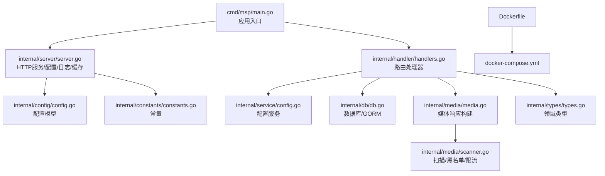
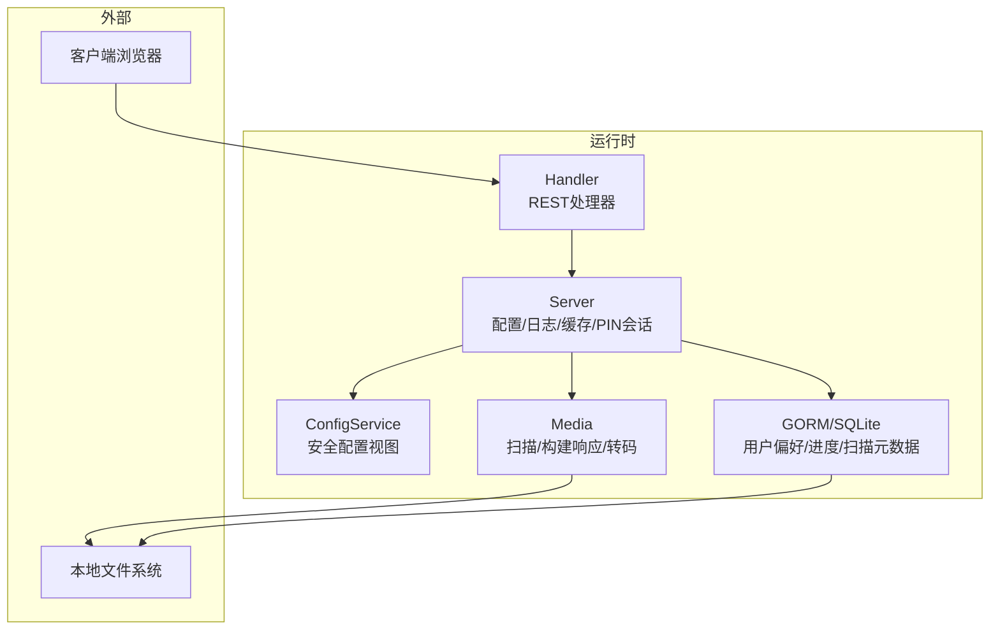
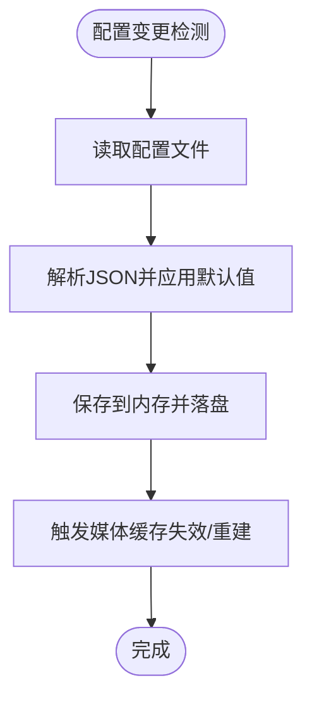
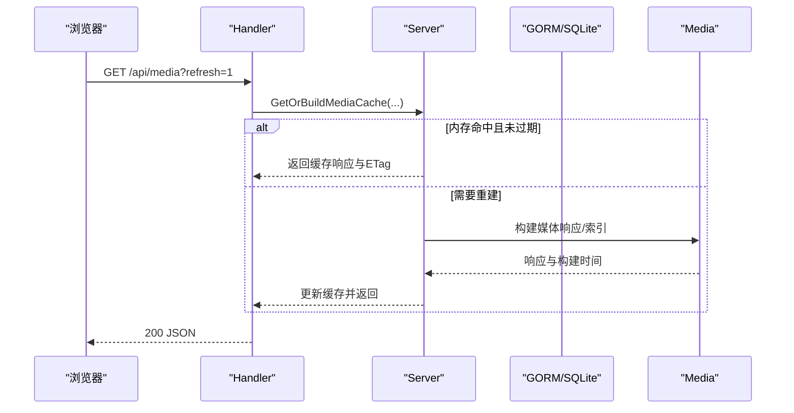
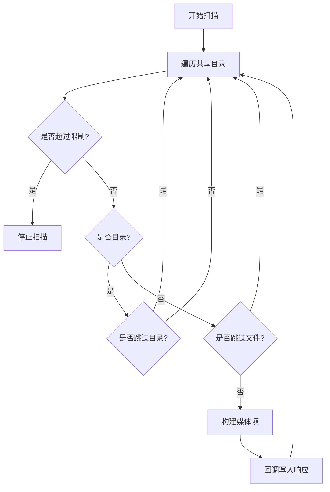
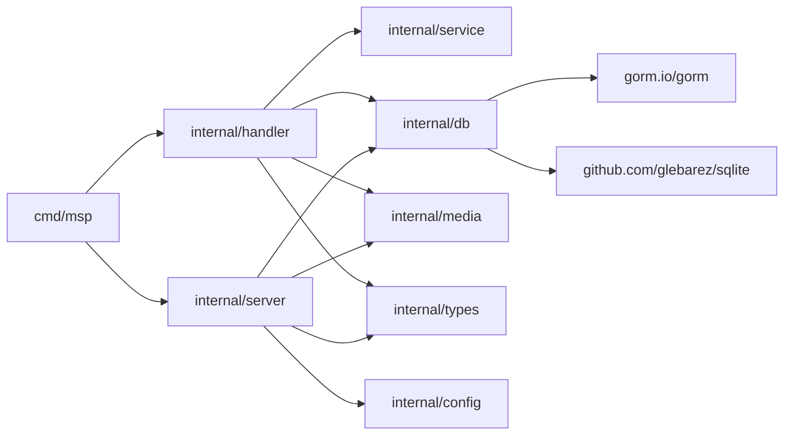

# 微服务架构

<cite>
**本文引用的文件**
- [cmd/msp/main.go](file://cmd/msp/main.go)
- [internal/server/server.go](file://internal/server/server.go)
- [internal/handler/handlers.go](file://internal/handler/handlers.go)
- [internal/config/config.go](file://internal/config/config.go)
- [internal/service/config.go](file://internal/service/config.go)
- [internal/db/db.go](file://internal/db/db.go)
- [internal/media/media.go](file://internal/media/media.go)
- [internal/media/scanner.go](file://internal/media/scanner.go)
- [internal/constants/constants.go](file://internal/constants/constants.go)
- [internal/types/types.go](file://internal/types/types.go)
- [Dockerfile](file://Dockerfile)
- [docker-compose.yml](file://docker-compose.yml)
- [go.mod](file://go.mod)
- [README.md](file://README.md)
</cite>

## 目录
1. [简介](#简介)
2. [项目结构](#项目结构)
3. [核心组件](#核心组件)
4. [架构总览](#架构总览)
5. [详细组件分析](#详细组件分析)
6. [依赖关系分析](#依赖关系分析)
7. [性能考量](#性能考量)
8. [故障排查指南](#故障排查指南)
9. [结论](#结论)
10. [附录](#附录)

## 简介
本指南围绕 MSP 的现有实现，总结其作为“单体媒体服务”的架构设计与工程实践，并在此基础上提出面向“微服务化”的演进建议与实施方案。MSP 当前采用单二进制、单进程、单数据库（SQLite）的轻量级架构：HTTP 服务承载路由与处理，内置媒体扫描与缓存，通过 GORM + SQLite 存储用户偏好与播放进度等状态。该形态便于零依赖部署与快速迭代，但若要向微服务演进，需在服务拆分、通信机制、可观测性、部署与运维等方面进行系统性设计。

## 项目结构
MSP 的代码组织遵循 Go 的“按功能域分层”风格：
- cmd/msp：应用入口与 HTTP 服务器装配
- internal/*：核心领域模块（配置、服务、数据库、媒体、类型、常量）
- web：前端静态资源打包后嵌入
- 根目录：容器化与编排脚本（Dockerfile、docker-compose.yml）



图表来源
- [cmd/msp/main.go](file://cmd/msp/main.go#L26-L83)
- [internal/server/server.go](file://internal/server/server.go#L65-L74)
- [internal/handler/handlers.go](file://internal/handler/handlers.go#L38-L43)
- [internal/service/config.go](file://internal/service/config.go#L16-L18)
- [internal/db/db.go](file://internal/db/db.go#L32-L72)
- [internal/media/media.go](file://internal/media/media.go#L12-L52)
- [internal/media/scanner.go](file://internal/media/scanner.go#L25-L57)
- [internal/config/config.go](file://internal/config/config.go#L77-L88)
- [internal/constants/constants.go](file://internal/constants/constants.go#L7-L50)
- [internal/types/types.go](file://internal/types/types.go#L16-L66)
- [Dockerfile](file://Dockerfile#L1-L49)
- [docker-compose.yml](file://docker-compose.yml#L1-L20)

章节来源
- [cmd/msp/main.go](file://cmd/msp/main.go#L26-L83)
- [README.md](file://README.md#L21-L31)

## 核心组件
- 应用入口与服务器
  - 入口负责初始化配置、日志、数据库、媒体缓存预热与 HTTP 服务启动；注册路由并应用中间件链。
- 服务器（Server）
  - 负责配置加载/热重载、日志轮转、媒体缓存（内存+磁盘）、会话管理（PIN）。
- 处理器（Handler）
  - 实现 REST API：配置、共享目录、媒体列表、流式播放、字幕、探测、进度、日志、PIN 登录等。
- 配置服务（ConfigService）
  - 对外提供安全的配置视图，屏蔽敏感字段；负责配置校验与去重。
- 数据库（GORM + SQLite）
  - 存储媒体项、扫描元数据、用户偏好、播放进度；启用 WAL、调整连接池与缓存。
- 媒体模块
  - 构建媒体响应、扫描共享目录、黑名单过滤、限流、侧车字幕/歌词解析、转码策略。
- 常量与类型
  - 统一管理端口、权限、缓存 TTL、日志轮转、扫描限制等常量；定义领域数据结构。

章节来源
- [cmd/msp/main.go](file://cmd/msp/main.go#L26-L83)
- [internal/server/server.go](file://internal/server/server.go#L31-L74)
- [internal/handler/handlers.go](file://internal/handler/handlers.go#L28-L43)
- [internal/service/config.go](file://internal/service/config.go#L12-L18)
- [internal/db/db.go](file://internal/db/db.go#L32-L72)
- [internal/media/media.go](file://internal/media/media.go#L12-L52)
- [internal/media/scanner.go](file://internal/media/scanner.go#L25-L57)
- [internal/constants/constants.go](file://internal/constants/constants.go#L7-L50)
- [internal/types/types.go](file://internal/types/types.go#L16-L66)

## 架构总览
下图展示当前单体架构的组件交互与数据流：



图表来源
- [internal/server/server.go](file://internal/server/server.go#L31-L74)
- [internal/handler/handlers.go](file://internal/handler/handlers.go#L28-L43)
- [internal/service/config.go](file://internal/service/config.go#L73-L90)
- [internal/db/db.go](file://internal/db/db.go#L32-L72)
- [internal/media/media.go](file://internal/media/media.go#L12-L52)

## 详细组件分析

### 服务器与配置管理
- 配置加载与热重载：从磁盘读取 JSON 配置，应用默认值，记录修改时间，周期性检测变更并自动重载。
- 日志系统：可配置输出到文件，支持按大小轮转与级别过滤。
- 媒体缓存：基于键（共享目录+黑名单规则）生成弱 ETag，内存缓存+磁盘持久化，支持并发重建与广播通知。
- 会话管理：PIN 登录生成随机会话令牌，带过期清理。



图表来源
- [internal/server/server.go](file://internal/server/server.go#L140-L188)
- [internal/server/server.go](file://internal/server/server.go#L322-L330)

章节来源
- [internal/server/server.go](file://internal/server/server.go#L76-L125)
- [internal/server/server.go](file://internal/server/server.go#L140-L188)
- [internal/server/server.go](file://internal/server/server.go#L190-L284)
- [internal/server/server.go](file://internal/server/server.go#L322-L396)
- [internal/server/server.go](file://internal/server/server.go#L570-L626)

### 处理器与路由
- 路由注册：统一在入口函数中注册 API 路由，挂载日志、安全、压缩中间件链。
- 处理器职责：配置读写、共享目录增删、媒体列表与缓存、流式播放与转码、字幕转换、探测、进度与偏好、日志上报、PIN 登录。
- 中间件：日志、安全（IP 白名单/黑名单、PIN）、GZIP 压缩。



图表来源
- [cmd/msp/main.go](file://cmd/msp/main.go#L85-L107)
- [internal/handler/handlers.go](file://internal/handler/handlers.go#L333-L362)
- [internal/server/server.go](file://internal/server/server.go#L332-L396)

章节来源
- [cmd/msp/main.go](file://cmd/msp/main.go#L85-L107)
- [internal/handler/handlers.go](file://internal/handler/handlers.go#L45-L94)
- [internal/handler/handlers.go](file://internal/handler/handlers.go#L333-L446)

### 数据库与状态存储
- 初始化：确保目录存在，打开连接，设置 WAL、同步与缓存参数，迁移表结构。
- 读写：播放进度、用户偏好、扫描元数据、媒体项的增删改查；使用冲突更新策略减少写放大。
- 性能：单连接、预编译语句、静默日志降低噪音。

```mermaid
erDiagram
MEDIA_ITEM {
string id PK
string path UK
string name
string ext
string kind IDX
string share_label IDX
int64 size
int64 mod_time
json subtitles
string audio_cover
string audio_lyrics
int64 scan_id IDX
string share_root
time created_at
time updated_at
}
MEDIA_SCAN {
string cache_key PK
int64 scan_id
int64 built_at
bool complete
time updated_at
}
USER_PREF {
string key PK
string value
time updated_at
}
PLAYBACK_PROGRESS {
string media_id PK
float time
time updated_at
}
```

图表来源
- [internal/db/db.go](file://internal/db/db.go#L32-L72)
- [internal/types/types.go](file://internal/types/types.go#L16-L52)

章节来源
- [internal/db/db.go](file://internal/db/db.go#L32-L72)
- [internal/db/db.go](file://internal/db/db.go#L74-L99)
- [internal/db/db.go](file://internal/db/db.go#L226-L259)

### 媒体扫描与缓存
- 扫描策略：遍历共享目录，尊重黑名单（扩展名、文件名、文件夹、大小规则），支持上下文取消与限流。
- 响应构建：按类型分类排序，补充侧车字幕/歌词，计算总数与“是否限流”标记。
- 缓存策略：内存缓存+磁盘持久化，弱 ETag，TTL 过期触发异步重建，广播唤醒等待者。



图表来源
- [internal/media/scanner.go](file://internal/media/scanner.go#L25-L57)
- [internal/media/scanner.go](file://internal/media/scanner.go#L68-L106)
- [internal/media/scanner.go](file://internal/media/scanner.go#L108-L146)

章节来源
- [internal/media/media.go](file://internal/media/media.go#L12-L52)
- [internal/media/scanner.go](file://internal/media/scanner.go#L25-L57)
- [internal/server/server.go](file://internal/server/server.go#L332-L441)

### 配置与安全
- 配置模型：端口、共享目录、特性开关、UI、播放策略、黑名单、安全（IP 白/黑名单、PIN）、日志级别与文件。
- 安全视图：对外仅暴露非敏感字段，隐藏 PIN。
- 默认值：多层级默认值合并，保证最小可用配置。

章节来源
- [internal/config/config.go](file://internal/config/config.go#L77-L88)
- [internal/config/config.go](file://internal/config/config.go#L94-L146)
- [internal/service/config.go](file://internal/service/config.go#L20-L71)

## 依赖关系分析
- 模块依赖
  - cmd/msp 依赖 internal/server、internal/handler、internal/web（嵌入静态资源）
  - internal/handler 依赖 internal/server、internal/service、internal/db、internal/media、internal/types
  - internal/server 依赖 internal/config、internal/db、internal/media、internal/types、internal/util
  - internal/db 使用 github.com/glebarez/sqlite 与 gorm.io/gorm
- 外部依赖
  - go.mod 明确声明 GORM 与 SQLite 相关依赖



图表来源
- [go.mod](file://go.mod#L5-L9)
- [cmd/msp/main.go](file://cmd/msp/main.go#L18-L23)
- [internal/handler/handlers.go](file://internal/handler/handlers.go#L3-L26)
- [internal/server/server.go](file://internal/server/server.go#L3-L29)

章节来源
- [go.mod](file://go.mod#L5-L30)

## 性能考量
- 缓存与重建
  - 媒体缓存 TTL 与弱 ETag，避免重复扫描；过期后后台重建，前台返回旧数据并尽快刷新。
- 数据库优化
  - WAL 模式、连接池仅 1 连接、预编译语句、冲突更新，减少锁竞争与写放大。
- I/O 与扫描
  - 黑名单与大小规则提前过滤，扫描限流，目录/文件缓存减少 Stat 开销。
- 流式播放
  - 直播优先，失败再转码；大文件短缓存，小文件禁用缓存，合理设置 Range 与 Content-Type。

章节来源
- [internal/server/server.go](file://internal/server/server.go#L398-L441)
- [internal/db/db.go](file://internal/db/db.go#L54-L72)
- [internal/media/scanner.go](file://internal/media/scanner.go#L25-L57)
- [internal/handler/handlers.go](file://internal/handler/handlers.go#L566-L579)

## 故障排查指南
- 启动与端口
  - 确认端口占用与防火墙；查看启动日志打印的访问 URL。
- 配置热重载
  - 修改配置文件后，确认后台定时器检测到变更并重新加载。
- 日志定位
  - 检查日志文件路径与轮转阈值；注意错误级别过滤。
- 媒体扫描
  - 排查共享目录权限与路径规范化；关注黑名单规则导致的过滤。
- 数据库问题
  - WAL 设置失败、连接池参数、慢查询日志；必要时关闭静默日志定位异常。
- 流式播放
  - 检查转码策略与 FFmpeg 可用性；确认 Content-Type 与 Range 支持。

章节来源
- [cmd/msp/main.go](file://cmd/msp/main.go#L109-L123)
- [internal/server/server.go](file://internal/server/server.go#L140-L188)
- [internal/server/server.go](file://internal/server/server.go#L190-L284)
- [internal/media/scanner.go](file://internal/media/scanner.go#L108-L146)
- [internal/db/db.go](file://internal/db/db.go#L20-L30)

## 结论
MSP 当前以“单体 + SQLite”的方式实现了轻量、易部署的媒体服务。若向微服务演进，建议：
- 服务拆分：配置中心、媒体扫描/索引、播放服务、状态服务（偏好/进度）、鉴权/PIN 服务
- 通信机制：内部优先 gRPC/HTTP，跨机房/多集群引入消息队列（如 Kafka/RabbitMQ）做事件解耦
- 部署与发现：容器化（已具备 Dockerfile/docker-compose），结合 Kubernetes（Service/Ingress/HPA/滚动更新）
- 观测性：统一日志（结构化）、指标（Prometheus）、追踪（OpenTelemetry），集中化收集与可视化
- 安全：细粒度 RBAC、传输加密、审计日志、最小权限原则

以上建议基于当前代码的职责边界与数据流抽象而来，具体落地需结合业务规模与团队能力制定实施路线图。

## 附录

### 容器化与编排
- Dockerfile：多阶段构建前端与后端，最终运行时基于 Alpine，暴露端口并挂载数据卷
- docker-compose：映射数据与媒体目录，软链接配置与数据库文件，禁用自动打开浏览器

章节来源
- [Dockerfile](file://Dockerfile#L1-L49)
- [docker-compose.yml](file://docker-compose.yml#L1-L20)

### API 一览（基于处理器）
- 配置：GET/POST /api/config
- 共享目录：POST /api/shares
- 媒体：GET /api/media?refresh=1
- 流式播放：GET/HEAD /api/stream?id=...&transcode=1&format=...
- 字幕：GET /api/subtitle?id=...
- 探测：GET /api/probe?id=...
- IP 列表：GET /api/ip
- 偏好：GET/POST /api/prefs
- 进度：GET/POST /api/progress
- 日志：POST /api/log
- PIN 登录：POST /api/pin

章节来源
- [cmd/msp/main.go](file://cmd/msp/main.go#L85-L107)
- [internal/handler/handlers.go](file://internal/handler/handlers.go#L45-L94)
- [internal/handler/handlers.go](file://internal/handler/handlers.go#L161-L190)
- [internal/handler/handlers.go](file://internal/handler/handlers.go#L192-L233)
- [internal/handler/handlers.go](file://internal/handler/handlers.go#L235-L253)
- [internal/handler/handlers.go](file://internal/handler/handlers.go#L255-L319)
- [internal/handler/handlers.go](file://internal/handler/handlers.go#L413-L446)
- [internal/handler/handlers.go](file://internal/handler/handlers.go#L623-L646)