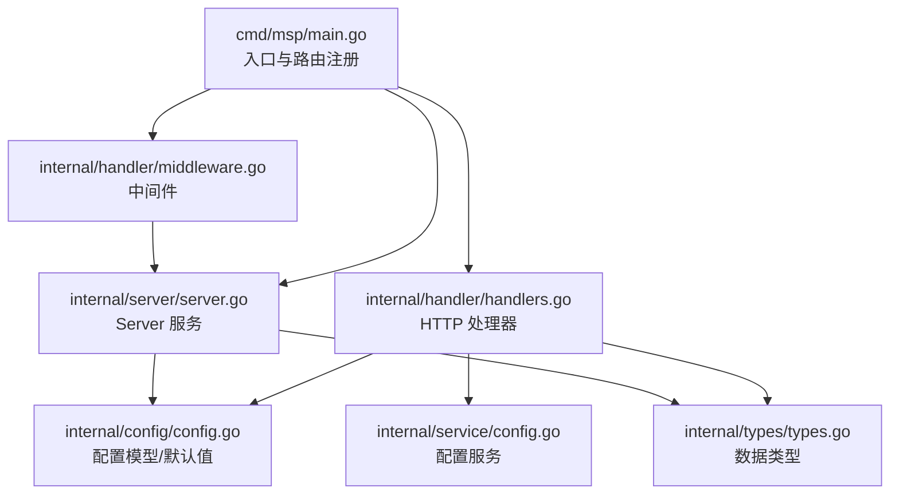
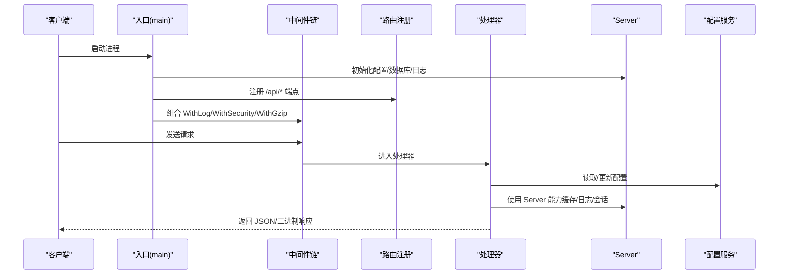
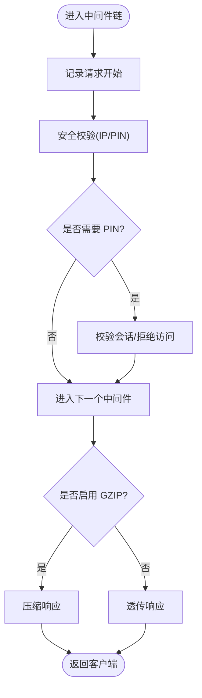
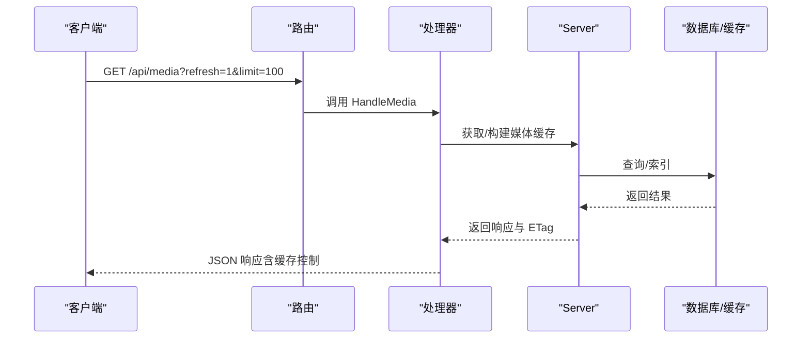
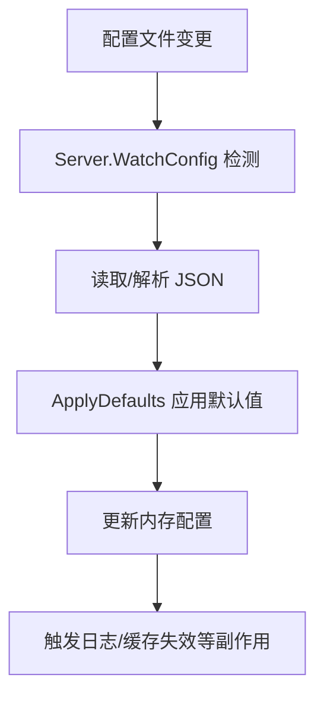
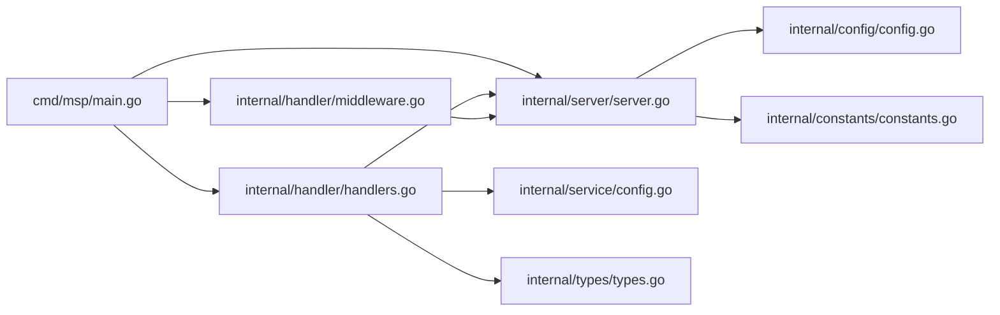

# 扩展开发

<cite>
**本文引用的文件**
- [cmd/msp/main.go](file://cmd/msp/main.go)
- [internal/server/server.go](file://internal/server/server.go)
- [internal/handler/handlers.go](file://internal/handler/handlers.go)
- [internal/handler/middleware.go](file://internal/handler/middleware.go)
- [internal/config/config.go](file://internal/config/config.go)
- [internal/config/validate.go](file://internal/config/validate.go)
- [internal/service/config.go](file://internal/service/config.go)
- [internal/types/types.go](file://internal/types/types.go)
- [internal/constants/constants.go](file://internal/constants/constants.go)
- [docs/API_REFERENCE.md](file://docs/API_REFERENCE.md)
- [config.example.json](file://config.example.json)
- [internal/handler/middleware_test.go](file://internal/handler/middleware_test.go)
- [CONTRIBUTING.md](file://CONTRIBUTING.md)
- [README.md](file://README.md)
</cite>

## 目录
1. [简介](#简介)
2. [项目结构](#项目结构)
3. [核心组件](#核心组件)
4. [架构总览](#架构总览)
5. [详细组件分析](#详细组件分析)
6. [依赖关系分析](#依赖关系分析)
7. [性能考量](#性能考量)
8. [故障排查指南](#故障排查指南)
9. [结论](#结论)
10. [附录](#附录)

## 简介
本指南面向希望在 MSP 项目上进行扩展开发的工程师，围绕以下目标展开：
- 自定义中间件开发与接入
- 利用现有扩展点与钩子（安全、日志、压缩、会话）
- API 扩展方法：新增 HTTP 端点、修改现有接口、添加认证方式
- 第三方集成：外部服务对接、数据格式转换、协议适配
- 微服务化可能性与实施方案
- 配置扩展：新增配置项、自定义验证规则、动态配置
- 最佳实践与设计原则
- 扩展测试与发布流程

## 项目结构
MSP 采用分层清晰的 Go 后端与嵌入式前端资源组织方式：
- 入口程序负责初始化配置、数据库、路由注册与中间件组合
- 服务层封装业务与配置读写、缓存与日志
- 处理器层实现 HTTP 接口与业务处理
- 配置与类型定义集中管理
- 文档与示例配置提供 API 参考与配置样例

图表来源
- [cmd/msp/main.go](file://cmd/msp/main.go#L85-L107)
- [internal/server/server.go](file://internal/server/server.go#L31-L74)
- [internal/handler/handlers.go](file://internal/handler/handlers.go#L28-L43)
- [internal/handler/middleware.go](file://internal/handler/middleware.go#L25-L52)
- [internal/service/config.go](file://internal/service/config.go#L12-L18)
- [internal/config/config.go](file://internal/config/config.go#L77-L88)
- [internal/types/types.go](file://internal/types/types.go#L54-L66)

章节来源
- [cmd/msp/main.go](file://cmd/msp/main.go#L26-L83)
- [internal/server/server.go](file://internal/server/server.go#L65-L74)
- [internal/handler/handlers.go](file://internal/handler/handlers.go#L38-L43)
- [internal/handler/middleware.go](file://internal/handler/middleware.go#L25-L52)
- [internal/service/config.go](file://internal/service/config.go#L12-L18)
- [internal/config/config.go](file://internal/config/config.go#L77-L88)
- [internal/types/types.go](file://internal/types/types.go#L54-L66)

## 核心组件
- Server：统一管理配置、日志、媒体缓存、会话与安全策略
- Handler：HTTP 接口实现，封装业务逻辑与错误处理
- 中间件：日志记录、安全校验、GZIP 压缩
- 配置服务：安全视图生成、配置更新与校验
- 配置模型与默认值：集中定义配置结构、默认值与应用逻辑
- 数据类型：媒体、进度、偏好等统一数据契约

章节来源
- [internal/server/server.go](file://internal/server/server.go#L31-L74)
- [internal/handler/handlers.go](file://internal/handler/handlers.go#L28-L43)
- [internal/handler/middleware.go](file://internal/handler/middleware.go#L45-L120)
- [internal/service/config.go](file://internal/service/config.go#L12-L18)
- [internal/config/config.go](file://internal/config/config.go#L77-L146)
- [internal/types/types.go](file://internal/types/types.go#L54-L66)

## 架构总览
MSP 的运行时由“入口程序 → 中间件链 → 路由 → 处理器 → 服务/配置/类型”构成，整体遵循“中间件前置、处理器专注业务”的分层思想。

图表来源
- [cmd/msp/main.go](file://cmd/msp/main.go#L26-L83)
- [cmd/msp/main.go](file://cmd/msp/main.go#L85-L107)
- [internal/handler/middleware.go](file://internal/handler/middleware.go#L25-L52)
- [internal/handler/handlers.go](file://internal/handler/handlers.go#L45-L66)
- [internal/service/config.go](file://internal/service/config.go#L73-L90)
- [internal/server/server.go](file://internal/server/server.go#L76-L138)

## 详细组件分析

### 中间件体系（自定义中间件开发）
- WithLog：记录请求耗时、状态码、UA，并按日志级别输出
- WithSecurity：注入安全头、IP 白/黑名单、PIN 会话校验
- WithGzip：对 /api/* 非流媒体端点启用 GZIP 压缩

扩展建议：
- 新增中间件时，遵循“前置校验、后置统计”的模式，确保与现有链路兼容
- 若需对特定端点放行，请参考 requiresPIN 与路径白名单策略

图表来源
- [internal/handler/middleware.go](file://internal/handler/middleware.go#L45-L120)
- [internal/handler/middleware.go](file://internal/handler/middleware.go#L25-L52)

章节来源
- [internal/handler/middleware.go](file://internal/handler/middleware.go#L25-L120)
- [internal/handler/middleware_test.go](file://internal/handler/middleware_test.go#L212-L258)

### 处理器与 API 扩展
- 已有端点：/api/config、/api/shares、/api/media、/api/stream、/api/subtitle、/api/probe、/api/ip、/api/prefs、/api/progress、/api/log、/api/pin
- 扩展方式：
  - 新增端点：在路由注册处添加新路径映射，编写对应处理器方法
  - 修改现有接口：在处理器中调整参数解析、业务逻辑与响应结构
  - 认证增强：在 WithSecurity 中扩展 requiresPIN 规则或引入新的会话令牌来源

图表来源
- [cmd/msp/main.go](file://cmd/msp/main.go#L85-L107)
- [internal/handler/handlers.go](file://internal/handler/handlers.go#L333-L362)
- [internal/server/server.go](file://internal/server/server.go#L332-L396)

章节来源
- [docs/API_REFERENCE.md](file://docs/API_REFERENCE.md#L12-L215)
- [internal/handler/handlers.go](file://internal/handler/handlers.go#L45-L66)
- [internal/handler/handlers.go](file://internal/handler/handlers.go#L333-L362)

### 配置扩展（新增配置项、验证与动态配置）
- 配置模型：Config、PlaybackConfig、SecurityConfig、BlacklistConfig 等
- 默认值应用：ApplyDefaults 分类设置默认值，确保向后兼容
- 动态配置：Server.WatchConfig 监控配置文件变更并热重载
- 安全视图：ConfigService 提供隐藏敏感字段的安全配置视图
- 验证规则：Validate/validate* 提供端口、日志级别、共享目录、安全、黑名单、播放范围等校验

图表来源
- [internal/server/server.go](file://internal/server/server.go#L140-L188)
- [internal/config/config.go](file://internal/config/config.go#L148-L162)
- [internal/service/config.go](file://internal/service/config.go#L73-L90)

章节来源
- [internal/config/config.go](file://internal/config/config.go#L77-L146)
- [internal/config/validate.go](file://internal/config/validate.go#L19-L58)
- [internal/server/server.go](file://internal/server/server.go#L140-L188)
- [internal/service/config.go](file://internal/service/config.go#L73-L90)
- [config.example.json](file://config.example.json#L1-L56)

### 数据模型与类型契约
- MediaResponse、MediaItem、PlaybackProgress、UserPref 等统一数据结构，便于前后端交互与扩展

章节来源
- [internal/types/types.go](file://internal/types/types.go#L54-L66)
- [internal/types/types.go](file://internal/types/types.go#L16-L32)
- [internal/types/types.go](file://internal/types/types.go#L48-L52)

### 常量与默认行为
- 默认端口、日志轮转、缓存 TTL、会话有效期、字节单位等集中管理，便于统一调整

章节来源
- [internal/constants/constants.go](file://internal/constants/constants.go#L9-L50)
- [internal/constants/constants.go](file://internal/constants/constants.go#L26-L35)

## 依赖关系分析
- 入口依赖 Server、Handler、Web 资源
- Handler 依赖 Server、ConfigService、Types、Media、Util
- Server 依赖 Config、Constants、DB、Media、Types、Util
- 中间件依赖 Server、Constants

图表来源
- [cmd/msp/main.go](file://cmd/msp/main.go#L18-L24)
- [internal/handler/handlers.go](file://internal/handler/handlers.go#L18-L26)
- [internal/server/server.go](file://internal/server/server.go#L23-L29)
- [internal/handler/middleware.go](file://internal/handler/middleware.go#L3-L14)

章节来源
- [cmd/msp/main.go](file://cmd/msp/main.go#L18-L24)
- [internal/handler/handlers.go](file://internal/handler/handlers.go#L18-L26)
- [internal/server/server.go](file://internal/server/server.go#L23-L29)
- [internal/handler/middleware.go](file://internal/handler/middleware.go#L3-L14)

## 性能考量
- 媒体缓存：弱 ETag + 内存缓存 + 磁盘持久化，降低重复扫描成本
- 压缩：仅对非流媒体 API 启用 GZIP，避免影响大文件传输
- 日志轮转：按大小轮换，减少 IO 压力
- 会话清理：定期清理过期会话，避免内存泄漏

章节来源
- [internal/server/server.go](file://internal/server/server.go#L332-L437)
- [internal/handler/middleware.go](file://internal/handler/middleware.go#L25-L43)
- [internal/server/server.go](file://internal/server/server.go#L250-L284)

## 故障排查指南
- 中间件测试覆盖：IP 白/黑名单、CIDR 匹配、客户端 IP 提取、PIN 要求判定
- 常见问题定位：
  - 访问被拒绝：检查 IP 白/黑名单与 requiresPIN 规则
  - 配置未生效：确认 WatchConfig 是否正常、ApplyDefaults 是否覆盖
  - 媒体列表为空：检查 shares、blacklist、缓存失效与扫描状态

章节来源
- [internal/handler/middleware_test.go](file://internal/handler/middleware_test.go#L13-L87)
- [internal/handler/middleware_test.go](file://internal/handler/middleware_test.go#L89-L142)
- [internal/handler/middleware_test.go](file://internal/handler/middleware_test.go#L144-L210)
- [internal/handler/middleware_test.go](file://internal/handler/middleware_test.go#L212-L258)
- [internal/server/server.go](file://internal/server/server.go#L140-L188)

## 结论
MSP 提供了清晰的中间件链、完善的配置与验证体系、稳定的 API 扩展点以及可热加载的配置机制。按照本文的扩展指南，开发者可以安全地新增端点、增强认证、集成第三方服务，并在保持性能与安全的前提下实现微服务化演进。

## 附录

### API 扩展清单（新增/修改/认证）
- 新增端点：在路由注册处添加新路径映射，编写处理器方法，必要时接入中间件链
- 修改现有接口：在处理器中调整参数解析、业务逻辑与响应结构，保持向后兼容
- 添加认证方式：在 WithSecurity 中扩展 requiresPIN 规则或引入新的会话令牌来源

章节来源
- [cmd/msp/main.go](file://cmd/msp/main.go#L85-L107)
- [docs/API_REFERENCE.md](file://docs/API_REFERENCE.md#L12-L215)
- [internal/handler/middleware.go](file://internal/handler/middleware.go#L77-L120)

### 第三方集成指导
- 外部服务对接：通过处理器调用外部 HTTP/GRPC 服务，注意超时与熔断
- 数据格式转换：在处理器中进行 JSON/XML/二进制转换，确保内容类型正确
- 协议适配：根据目标协议调整头部、鉴权与分片策略

章节来源
- [internal/handler/handlers.go](file://internal/handler/handlers.go#L686-L721)

### 微服务化可能性与实施方案
- 方案一：将媒体扫描与缓存独立为服务，Server 通过远程调用获取媒体索引
- 方案二：将配置中心与会话管理抽取为独立服务，Handler 通过 RPC/REST 访问
- 注意：保持一致的中间件链与安全策略，确保跨服务一致性

章节来源
- [internal/server/server.go](file://internal/server/server.go#L31-L74)
- [internal/handler/middleware.go](file://internal/handler/middleware.go#L77-L120)

### 配置扩展最佳实践
- 新增配置项：在 Config 结构体中添加字段，提供默认值并在 ApplyDefaults 中设置
- 自定义验证规则：在 Validate/validate* 中增加校验逻辑，返回 ValidationError
- 动态配置：通过 WatchConfig 实现热重载，注意副作用（日志、缓存、会话）

章节来源
- [internal/config/config.go](file://internal/config/config.go#L77-L146)
- [internal/config/validate.go](file://internal/config/validate.go#L19-L58)
- [internal/server/server.go](file://internal/server/server.go#L140-L188)

### 扩展测试与发布流程
- 测试：运行 go test ./...，确保中间件与处理器行为符合预期
- 本地构建：按贡献指南构建后端与前端产物
- 发布：遵循 Conventional Commits，提交 PR 并附带变更说明

章节来源
- [CONTRIBUTING.md](file://CONTRIBUTING.md#L42-L52)
- [README.md](file://README.md#L82-L95)