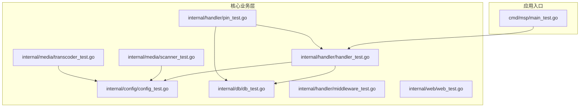
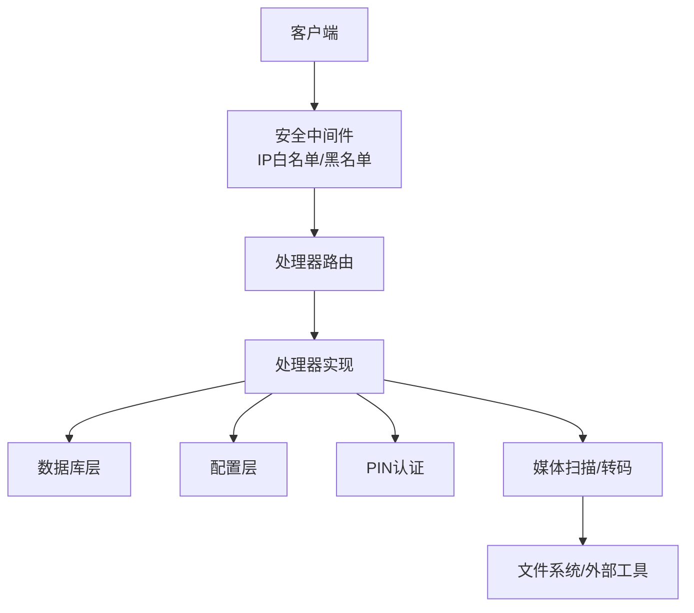
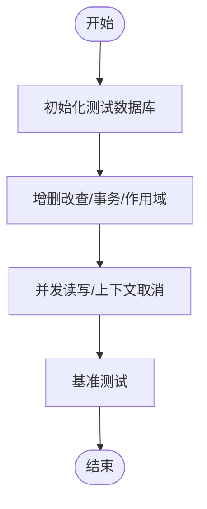
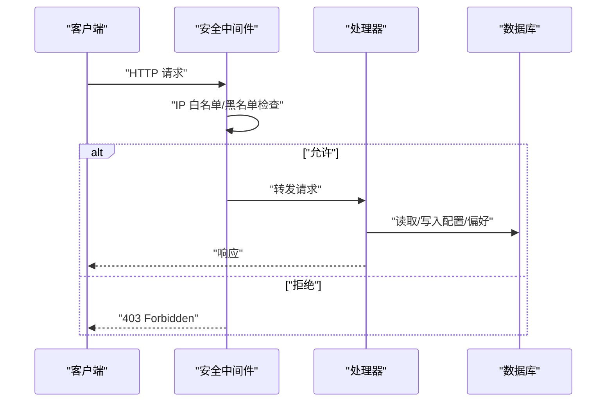
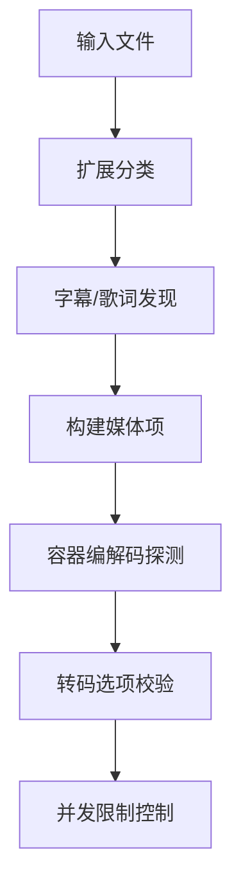
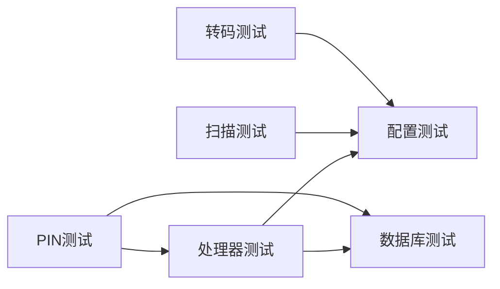

# 扩展测试

<cite>
**本文档引用的文件**
- [cmd/msp/main_test.go](file://cmd/msp/main_test.go)
- [internal/config/config_test.go](file://internal/config/config_test.go)
- [internal/db/db_test.go](file://internal/db/db_test.go)
- [internal/handler/handler_test.go](file://internal/handler/handler_test.go)
- [internal/handler/middleware_test.go](file://internal/handler/middleware_test.go)
- [internal/handler/pin_test.go](file://internal/handler/pin_test.go)
- [internal/media/scanner_test.go](file://internal/media/scanner_test.go)
- [internal/media/transcoder_test.go](file://internal/media/transcoder_test.go)
- [internal/web/web_test.go](file://internal/web/web_test.go)
- [.golangci.yml](file://.golangci.yml)
</cite>

## 目录
1. [简介](#简介)
2. [项目结构](#项目结构)
3. [核心组件](#核心组件)
4. [架构总览](#架构总览)
5. [详细组件分析](#详细组件分析)
6. [依赖关系分析](#依赖关系分析)
7. [性能考虑](#性能考虑)
8. [故障排除指南](#故障排除指南)
9. [结论](#结论)
10. [附录](#附录)

## 简介
本指南面向MSP项目的扩展测试，系统性阐述如何设计与实施单元测试、集成测试与端到端测试，覆盖测试环境搭建、模拟服务、测试数据准备、测试数据库管理、测试用例设计原则（边界条件、异常处理、性能测试）、持续集成中的自动化测试执行、覆盖率分析与测试报告生成，并总结最佳实践与调试技巧。文档基于仓库现有测试文件进行归纳与可视化，帮助开发者快速建立可维护、可扩展的测试体系。

## 项目结构
MSP采用Go模块化组织，测试分布在各内部包中，遵循按功能域划分的层次结构：
- cmd/msp：主程序入口测试（示例）
- internal/*：核心业务层测试（配置、数据库、处理器、媒体扫描与转码、Web嵌入资源）
- web：前端构建产物与嵌入资源测试（示例）

图表来源
- [cmd/msp/main_test.go](file://cmd/msp/main_test.go#L1-L10)
- [internal/db/db_test.go](file://internal/db/db_test.go#L1-L609)
- [internal/handler/handler_test.go](file://internal/handler/handler_test.go#L1-L32)
- [internal/handler/middleware_test.go](file://internal/handler/middleware_test.go#L1-L312)
- [internal/handler/pin_test.go](file://internal/handler/pin_test.go#L1-L136)
- [internal/media/scanner_test.go](file://internal/media/scanner_test.go#L1-L628)
- [internal/media/transcoder_test.go](file://internal/media/transcoder_test.go#L1-L283)
- [internal/web/web_test.go](file://internal/web/web_test.go#L1-L21)

章节来源
- [cmd/msp/main_test.go](file://cmd/msp/main_test.go#L1-L10)
- [internal/db/db_test.go](file://internal/db/db_test.go#L1-L609)
- [internal/handler/handler_test.go](file://internal/handler/handler_test.go#L1-L32)
- [internal/handler/middleware_test.go](file://internal/handler/middleware_test.go#L1-L312)
- [internal/handler/pin_test.go](file://internal/handler/pin_test.go#L1-L136)
- [internal/media/scanner_test.go](file://internal/media/scanner_test.go#L1-L628)
- [internal/media/transcoder_test.go](file://internal/media/transcoder_test.go#L1-L283)
- [internal/web/web_test.go](file://internal/web/web_test.go#L1-L21)

## 核心组件
- 数据库层：初始化、进度与扫描元数据、媒体项增删改查、用户偏好、作用域与事务、并发访问、上下文取消、基准测试
- 处理器层：路由与响应、内容类型判定、IP过滤中间件、PIN认证流程
- 媒体层：扩展分类、字幕/歌词识别、黑名单匹配、容器编解码探测、媒体项构建、基准测试
- 转码层：选项校验、FFmpeg/FFprobe检测、并发限制与限流释放器
- Web嵌入：静态资源服务测试

章节来源
- [internal/db/db_test.go](file://internal/db/db_test.go#L1-L609)
- [internal/handler/handler_test.go](file://internal/handler/handler_test.go#L1-L32)
- [internal/handler/middleware_test.go](file://internal/handler/middleware_test.go#L1-L312)
- [internal/handler/pin_test.go](file://internal/handler/pin_test.go#L1-L136)
- [internal/media/scanner_test.go](file://internal/media/scanner_test.go#L1-L628)
- [internal/media/transcoder_test.go](file://internal/media/transcoder_test.go#L1-L283)
- [internal/web/web_test.go](file://internal/web/web_test.go#L1-L21)

## 架构总览
下图展示测试视角下的关键交互：处理器接收请求，调用数据库与配置，PIN中间件进行鉴权，媒体扫描与转码模块提供能力。

图表来源
- [internal/handler/middleware_test.go](file://internal/handler/middleware_test.go#L1-L312)
- [internal/handler/pin_test.go](file://internal/handler/pin_test.go#L1-L136)
- [internal/db/db_test.go](file://internal/db/db_test.go#L1-L609)
- [internal/media/scanner_test.go](file://internal/media/scanner_test.go#L1-L628)
- [internal/media/transcoder_test.go](file://internal/media/transcoder_test.go#L1-L283)

## 详细组件分析

### 数据库层测试
- 初始化与目录创建：确保数据库路径存在、自动创建缺失目录
- 进度管理：不存在ID返回默认值、保存/更新/并发读写一致性
- 扫描元数据：缓存键、扫描ID、完成状态的存取与更新
- 媒体项：单条/批量插入、更新、查询、计数、按扫描ID与共享根清理
- 用户偏好：键值对持久化、空键过滤、空映射处理
- 作用域与事务：ByScan/ByKind组合查询、GORM事务包裹
- 异常与边界：DB为空、上下文取消、并发竞争
- 性能：批量插入与查询的基准测试

图表来源
- [internal/db/db_test.go](file://internal/db/db_test.go#L17-L609)

章节来源
- [internal/db/db_test.go](file://internal/db/db_test.go#L1-L609)

### 处理器与中间件测试
- 路由与响应：构造HTTP请求，验证状态码
- 内容类型判定：扩展名到MIME映射
- IP过滤：白名单/黑名单、CIDR匹配、代理信任策略
- 客户端IP解析：RemoteAddr与X-Forwarded-For/X-Real-IP
- PIN鉴权：登录流程、会话Cookie、受保护路径

图表来源
- [internal/handler/middleware_test.go](file://internal/handler/middleware_test.go#L13-L312)
- [internal/handler/handler_test.go](file://internal/handler/handler_test.go#L9-L32)

章节来源
- [internal/handler/handler_test.go](file://internal/handler/handler_test.go#L1-L32)
- [internal/handler/middleware_test.go](file://internal/handler/middleware_test.go#L1-L312)
- [internal/handler/pin_test.go](file://internal/handler/pin_test.go#L1-L136)

### 媒体扫描与转码测试
- 扩展分类：视频/音频/图片/其他，大小写与大小写敏感
- 字幕/歌词：后缀识别、标签本地化
- 黑名单：字符串精确/正则匹配、大小写不敏感、尺寸阈值
- 媒体项构建：从文件系统收集元数据、字幕/歌词关联
- 容器编解码探测：通过特征码识别视频/音频编码
- 转码：选项校验、外部工具可用性、并发限制与限流释放器

图表来源
- [internal/media/scanner_test.go](file://internal/media/scanner_test.go#L18-L628)
- [internal/media/transcoder_test.go](file://internal/media/transcoder_test.go#L17-L283)

章节来源
- [internal/media/scanner_test.go](file://internal/media/scanner_test.go#L1-L628)
- [internal/media/transcoder_test.go](file://internal/media/transcoder_test.go#L1-L283)

### Web嵌入资源测试
- 静态文件服务：MapFS模拟嵌入文件系统，验证响应状态

章节来源
- [internal/web/web_test.go](file://internal/web/web_test.go#L1-L21)

## 依赖关系分析
测试文件之间存在清晰的依赖链，体现模块化与分层设计：
- 处理器依赖配置与数据库
- PIN认证依赖处理器与数据库
- 媒体扫描依赖配置与工具
- 转码依赖外部工具与并发控制

图表来源
- [internal/handler/handler_test.go](file://internal/handler/handler_test.go#L1-L32)
- [internal/handler/middleware_test.go](file://internal/handler/middleware_test.go#L1-L312)
- [internal/handler/pin_test.go](file://internal/handler/pin_test.go#L1-L136)
- [internal/media/scanner_test.go](file://internal/media/scanner_test.go#L1-L628)
- [internal/media/transcoder_test.go](file://internal/media/transcoder_test.go#L1-L283)
- [internal/db/db_test.go](file://internal/db/db_test.go#L1-L609)

章节来源
- [internal/handler/handler_test.go](file://internal/handler/handler_test.go#L1-L32)
- [internal/handler/middleware_test.go](file://internal/handler/middleware_test.go#L1-L312)
- [internal/handler/pin_test.go](file://internal/handler/pin_test.go#L1-L136)
- [internal/media/scanner_test.go](file://internal/media/scanner_test.go#L1-L628)
- [internal/media/transcoder_test.go](file://internal/media/transcoder_test.go#L1-L283)
- [internal/db/db_test.go](file://internal/db/db_test.go#L1-L609)

## 性能考虑
- 基准测试：针对扩展分类、黑名单匹配、SRT转VTT等热点逻辑提供Benchmarks，便于回归性能
- 并发与限流：转码并发限制与限流释放器保障资源占用可控
- 数据库批量操作：批量插入与查询的基准测试有助于评估I/O瓶颈

章节来源
- [internal/media/scanner_test.go](file://internal/media/scanner_test.go#L518-L550)
- [internal/media/transcoder_test.go](file://internal/media/transcoder_test.go#L193-L240)
- [internal/db/db_test.go](file://internal/db/db_test.go#L548-L608)

## 故障排除指南
- 数据库相关
  - 症状：上下文取消导致操作异常
  - 排查：确认上下文传播与GORM适配
  - 参考：上下文取消测试
- 并发问题
  - 症状：并发读写导致竞态
  - 排查：使用并发测试验证一致性
  - 参考：并发访问测试
- 转码失败
  - 症状：外部工具不可用或并发超限
  - 排查：检查FFmpeg/FFprobe可用性与并发限制
  - 参考：转码选项校验与并发限制测试
- 认证与授权
  - 症状：PIN登录失败或会话未生效
  - 排查：核对PIN配置、Cookie设置与受保护路径
  - 参考：PIN认证测试

章节来源
- [internal/db/db_test.go](file://internal/db/db_test.go#L503-L517)
- [internal/media/transcoder_test.go](file://internal/media/transcoder_test.go#L103-L191)
- [internal/handler/pin_test.go](file://internal/handler/pin_test.go#L99-L134)

## 结论
MSP的测试体系覆盖核心业务的关键路径：数据库、处理器、媒体扫描与转码、Web嵌入与安全中间件。通过单元测试、集成测试与端到端测试相结合，配合基准测试与并发验证，能够有效保障扩展功能的稳定性与性能。建议在持续集成中引入覆盖率统计与报告生成，进一步提升质量保障水平。

## 附录

### 测试环境搭建与配置
- Go测试框架：使用标准库testing，结合testify断言库
- 临时数据库：每个测试独立创建临时目录与数据库文件，测试结束后清理
- 外部工具：FFmpeg/FFprobe检测与基准测试需根据实际环境启用/跳过
- 配置注入：通过服务器实例动态更新配置以驱动中间件与PIN逻辑

章节来源
- [internal/db/db_test.go](file://internal/db/db_test.go#L17-L51)
- [internal/media/transcoder_test.go](file://internal/media/transcoder_test.go#L103-L145)
- [internal/handler/middleware_test.go](file://internal/handler/middleware_test.go#L260-L311)
- [internal/handler/pin_test.go](file://internal/handler/pin_test.go#L16-L52)

### 测试用例设计原则
- 边界条件：空ID、空映射、空列表、空字符串、极值（负偏移、大码率）
- 异常处理：不存在项、上下文取消、外部工具不可用、并发超限
- 性能测试：热点函数的基准测试，关注批量操作吞吐
- 端到端：PIN认证流程、IP过滤中间件、静态资源服务

章节来源
- [internal/db/db_test.go](file://internal/db/db_test.go#L471-L517)
- [internal/media/transcoder_test.go](file://internal/media/transcoder_test.go#L17-L101)
- [internal/handler/pin_test.go](file://internal/handler/pin_test.go#L63-L134)
- [internal/web/web_test.go](file://internal/web/web_test.go#L10-L21)

### 持续集成中的测试流程
- 自动化执行：在CI中运行go test，启用测试标志
- 覆盖率分析：建议添加覆盖率收集与报告生成步骤
- 报告生成：结合CI平台输出JUnit/HTML报告
- 工具链：golangci-lint启用多项静态检查，辅助质量门禁

章节来源
- [.golangci.yml](file://.golangci.yml#L1-L21)