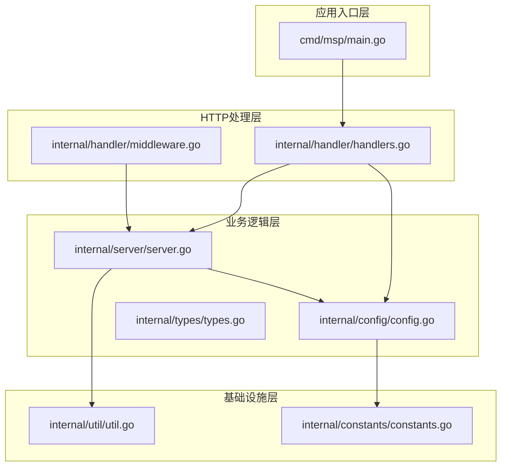
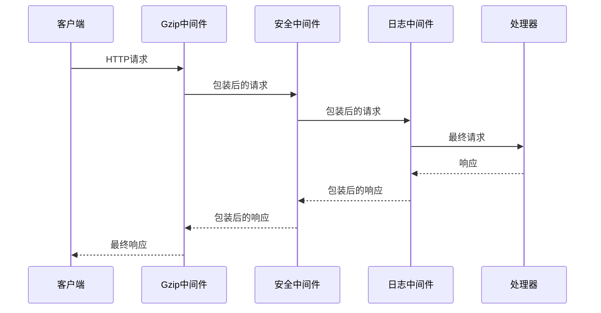
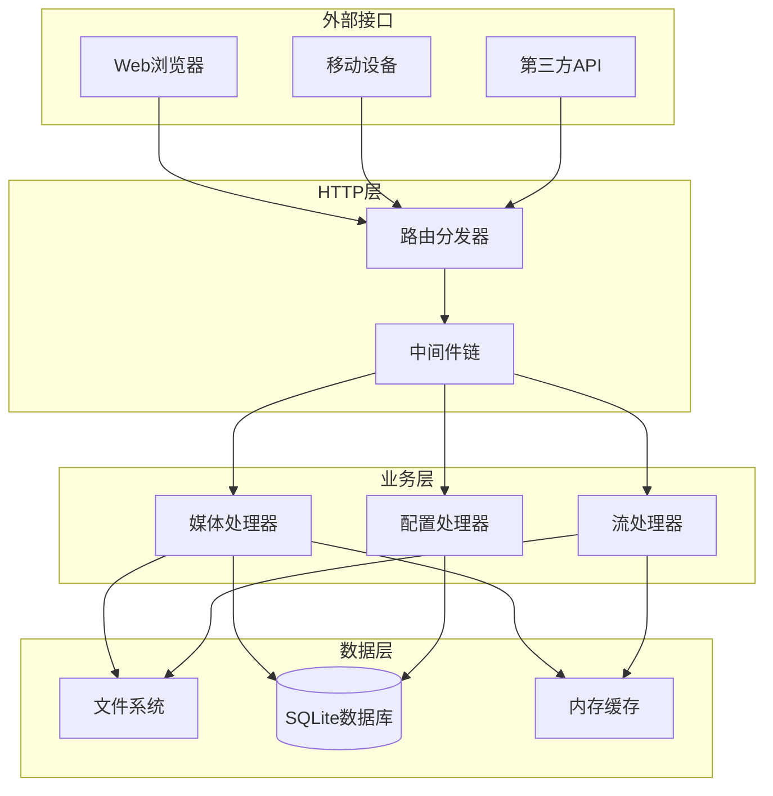
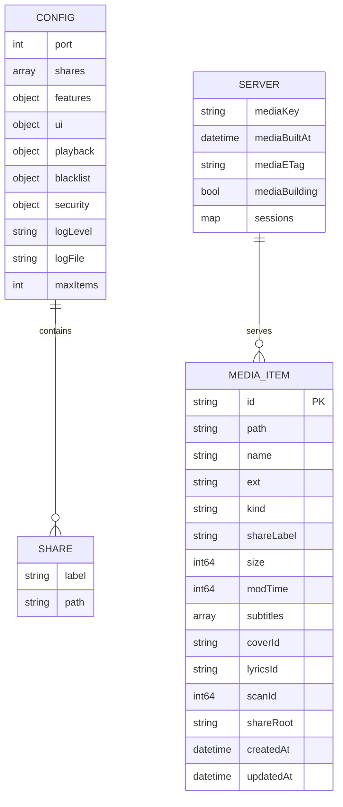
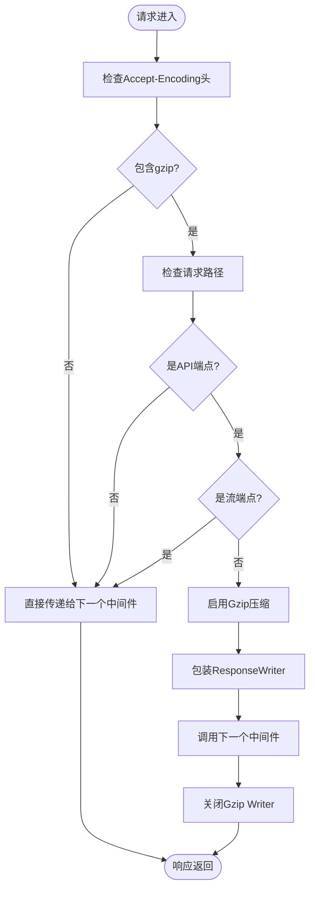
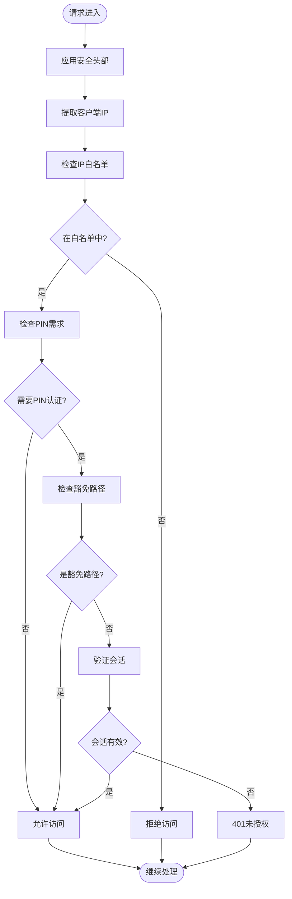
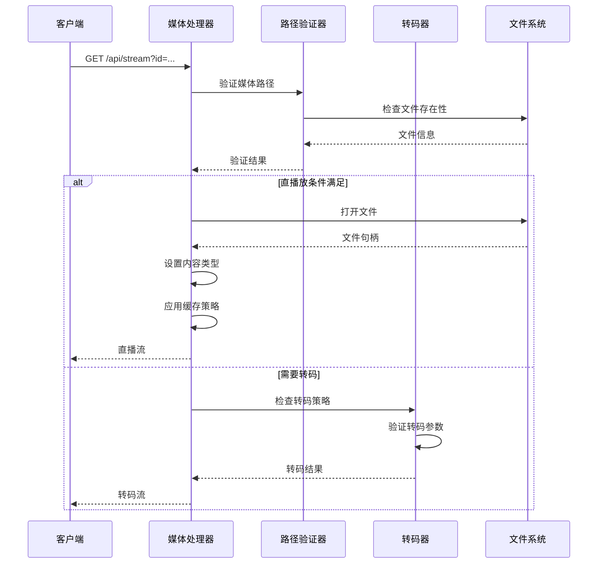
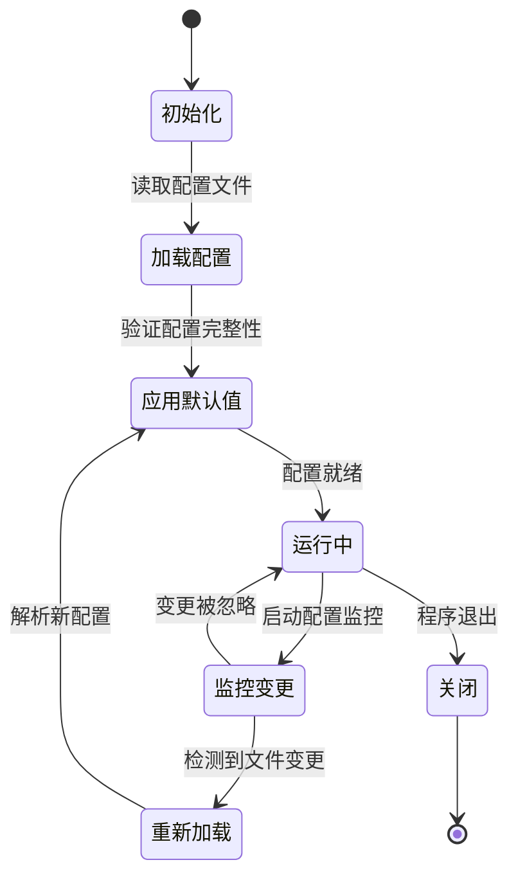
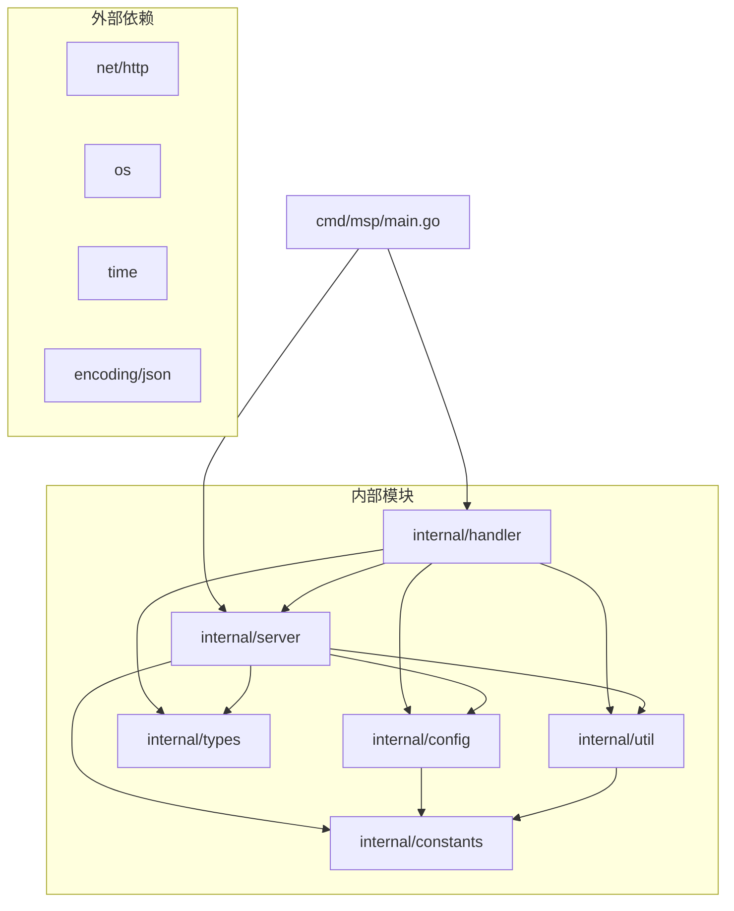
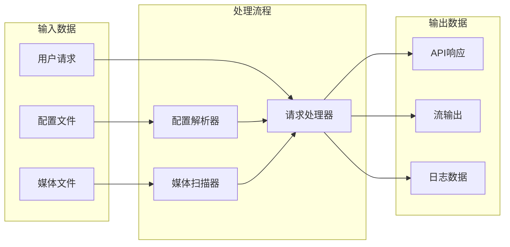

# 插件开发

<cite>
**本文档引用的文件**
- [main.go](file://cmd/msp/main.go)
- [middleware.go](file://internal/handler/middleware.go)
- [handlers.go](file://internal/handler/handlers.go)
- [server.go](file://internal/server/server.go)
- [config.go](file://internal/config/config.go)
- [constants.go](file://internal/constants/constants.go)
- [types.go](file://internal/types/types.go)
- [util.go](file://internal/util/util.go)
- [README.md](file://README.md)
</cite>

## 目录
1. [简介](#简介)
2. [项目结构](#项目结构)
3. [核心组件](#核心组件)
4. [架构概览](#架构概览)
5. [详细组件分析](#详细组件分析)
6. [依赖关系分析](#依赖关系分析)
7. [性能考虑](#性能考虑)
8. [故障排除指南](#故障排除指南)
9. [结论](#结论)

## 简介

MSP是一个轻量级的个人媒体服务器，专注于家庭局域网流媒体播放。本文档提供了MSP插件开发的详细指南，重点解释插件系统的架构设计和扩展机制。

MSP采用中间件模式构建其HTTP请求处理管道，通过可组合的中间件函数实现功能扩展。每个中间件都可以独立地处理请求和响应，形成强大的插件生态系统。

## 项目结构

MSP项目采用清晰的分层架构，主要分为以下几个核心层次：

**图表来源**
- [main.go](file://cmd/msp/main.go#L26-L83)
- [handlers.go](file://internal/handler/handlers.go#L38-L43)
- [server.go](file://internal/server/server.go#L65-L74)

**章节来源**
- [main.go](file://cmd/msp/main.go#L1-L151)
- [README.md](file://README.md#L1-L106)

## 核心组件

### 中间件系统架构

MSP的中间件系统是其插件架构的核心，采用装饰器模式实现请求处理的链式调用：

**图表来源**
- [main.go](file://cmd/msp/main.go#L65-L66)
- [middleware.go](file://internal/handler/middleware.go#L25-L43)

### 请求处理流程

MSP的HTTP请求处理遵循严格的中间件链模式：

1. **Gzip压缩中间件**：自动检测客户端支持的压缩算法
2. **安全中间件**：IP白名单/黑名单和PIN认证
3. **日志中间件**：记录请求处理统计信息
4. **业务处理器**：具体的功能实现

**章节来源**
- [middleware.go](file://internal/handler/middleware.go#L25-L120)
- [handlers.go](file://internal/handler/handlers.go#L45-L66)

## 架构概览

### 整体架构设计

**图表来源**
- [main.go](file://cmd/msp/main.go#L85-L107)
- [server.go](file://internal/server/server.go#L332-L396)

### 数据模型架构

**图表来源**
- [config.go](file://internal/config/config.go#L77-L88)
- [types.go](file://internal/types/types.go#L16-L32)
- [server.go](file://internal/server/server.go#L31-L56)

## 详细组件分析

### 中间件系统详解

#### Gzip压缩中间件

Gzip中间件实现了智能的响应压缩策略：

**图表来源**
- [middleware.go](file://internal/handler/middleware.go#L25-L43)

#### 安全中间件

安全中间件提供了多层防护机制：

**图表来源**
- [middleware.go](file://internal/handler/middleware.go#L77-L120)

**章节来源**
- [middleware.go](file://internal/handler/middleware.go#L16-L229)

### 处理器架构

#### 媒体处理流程

媒体处理是MSP的核心功能，实现了智能的直播放和转码策略：

**图表来源**
- [handlers.go](file://internal/handler/handlers.go#L413-L446)
- [handlers.go](file://internal/handler/handlers.go#L513-L532)

**章节来源**
- [handlers.go](file://internal/handler/handlers.go#L333-L580)

### 服务器生命周期管理

#### 配置管理系统

服务器实现了完整的配置生命周期管理：

**图表来源**
- [server.go](file://internal/server/server.go#L76-L112)
- [server.go](file://internal/server/server.go#L140-L188)

**章节来源**
- [server.go](file://internal/server/server.go#L76-L330)

## 依赖关系分析

### 组件依赖图

**图表来源**
- [main.go](file://cmd/msp/main.go#L3-L24)
- [handlers.go](file://internal/handler/handlers.go#L3-L26)

### 数据流依赖

**图表来源**
- [server.go](file://internal/server/server.go#L332-L396)
- [handlers.go](file://internal/handler/handlers.go#L413-L446)

**章节来源**
- [config.go](file://internal/config/config.go#L1-L286)
- [types.go](file://internal/types/types.go#L1-L112)

## 性能考虑

### 缓存策略

MSP实现了多层次的缓存机制以优化性能：

1. **内存缓存**：媒体库的内存缓存，支持TTL失效
2. **磁盘缓存**：在无数据库时的持久化缓存
3. **HTTP缓存**：ETag支持和条件请求处理
4. **会话缓存**：PIN认证会话的内存存储

### 并发处理

系统采用多种并发模式：

- **读写锁**：保护配置和媒体缓存的并发访问
- **条件变量**：协调媒体缓存的重建过程
- **goroutine池**：异步任务处理（配置监控、缓存重建）

## 故障排除指南

### 常见问题诊断

#### 中间件链问题

当请求在中间件链中出现问题时，可以通过以下方式诊断：

1. **检查中间件顺序**：确保Gzip中间件位于链的前端
2. **验证安全配置**：确认IP白名单/黑名单设置正确
3. **调试日志**：启用详细日志查看请求处理流程

#### 媒体处理问题

媒体流问题的排查步骤：

1. **验证文件路径**：确认媒体文件在共享目录内
2. **检查转码配置**：验证转码策略设置
3. **网络连接测试**：确认客户端能够正常访问

**章节来源**
- [middleware.go](file://internal/handler/middleware.go#L77-L120)
- [handlers.go](file://internal/handler/handlers.go#L413-L446)

## 结论

MSP的插件系统通过中间件模式实现了高度模块化的架构设计。这种设计具有以下优势：

1. **可扩展性**：新的功能可以通过添加中间件轻松实现
2. **可维护性**：每个中间件职责单一，便于测试和维护
3. **性能**：中间件链按需执行，避免不必要的处理
4. **安全性**：内置的安全中间件提供了多层防护

对于开发者而言，理解MSP的中间件架构是开发插件的关键。通过参考现有的中间件实现，可以快速掌握如何创建自定义中间件来扩展HTTP请求处理逻辑。