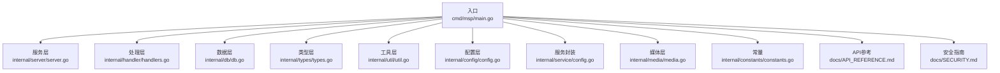
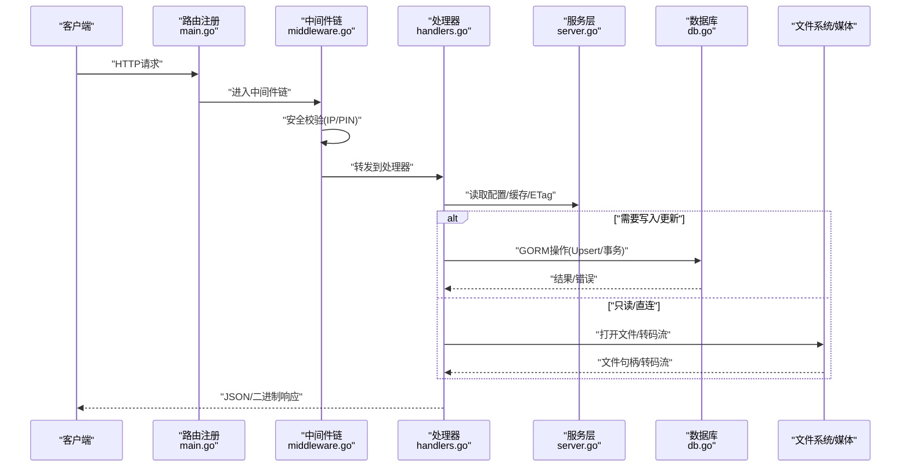
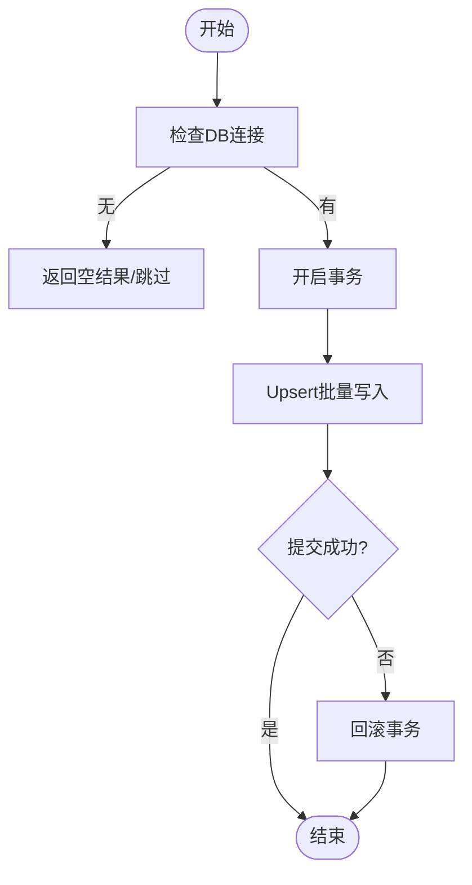
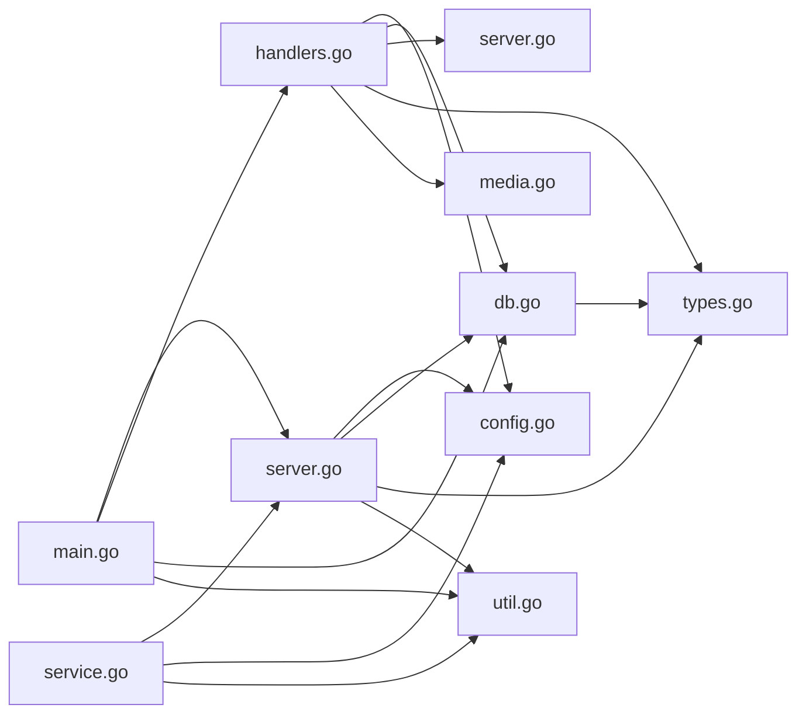

# 第三方集成

<cite>
**本文引用的文件**
- [cmd\msp\main.go](file://cmd\msp\main.go)
- [internal\config\config.go](file://internal\config\config.go)
- [internal\db\db.go](file://internal\db\db.go)
- [internal\handler\handlers.go](file://internal\handler\handlers.go)
- [internal\handler\middleware.go](file://internal\handler\middleware.go)
- [internal\service\config.go](file://internal\service\config.go)
- [internal\types\types.go](file://internal\types\types.go)
- [internal\media\media.go](file://internal\media\media.go)
- [internal\server\server.go](file://internal\server\server.go)
- [internal\util\util.go](file://internal\util\util.go)
- [internal\constants\constants.go](file://internal\constants\constants.go)
- [config.example.json](file://config.example.json)
- [docs\API_REFERENCE.md](file://docs\API_REFERENCE.md)
- [docs\SECURITY.md](file://docs\SECURITY.md)
</cite>

## 目录
1. [简介](#简介)
2. [项目结构](#项目结构)
3. [核心组件](#核心组件)
4. [架构总览](#架构总览)
5. [详细组件分析](#详细组件分析)
6. [依赖关系分析](#依赖关系分析)
7. [性能考量](#性能考量)
8. [故障排查指南](#故障排查指南)
9. [结论](#结论)
10. [附录](#附录)

## 简介
本指南聚焦于“第三方集成开发”，围绕以下目标展开：
- 如何集成外部服务与API：HTTP客户端使用、数据格式转换、错误处理与重试机制
- 协议适配方案：自定义协议实现、网络通信优化、连接池管理
- 数据库集成最佳实践：ORM使用、连接管理、事务处理
- 具体集成案例与实现示例：结合MSP现有模块，给出可落地的扩展思路

MSP是一个轻量级家庭局域网媒体服务器，采用Go语言实现，内置HTTP服务、静态资源嵌入、SQLite数据库、媒体扫描与转码能力。其API层、中间件层、服务层与数据层职责清晰，便于扩展第三方能力。

## 项目结构
MSP采用分层架构：
- 入口层：cmd/msp/main.go负责初始化配置、数据库、路由注册与HTTP服务启动
- 服务层：internal/server 提供配置热加载、媒体缓存、日志与会话管理
- 处理层：internal/handler 提供HTTP端点处理、JSON编解码、安全中间件
- 服务层：internal/service 提供配置视图与安全视图封装
- 数据层：internal/db 基于GORM/SQLite，提供ORM模型与CRUD操作
- 工具层：internal/util 提供路径、ID编解码、IP判定、去重等工具
- 类型层：internal/types 定义API与数据库模型
- 媒体层：internal/media 提供媒体扫描、转码、字幕转换等能力

图表来源
- [cmd\msp\main.go](file://cmd\msp\main.go#L26-L83)
- [internal\server\server.go](file://internal\server\server.go#L31-L74)
- [internal\handler\handlers.go](file://internal\handler\handlers.go#L28-L43)
- [internal\db\db.go](file://internal\db\db.go#L18-L72)
- [internal\types\types.go](file://internal\types\types.go#L16-L52)
- [internal\util\util.go](file://internal\util\util.go#L18-L50)
- [internal\config\config.go](file://internal\config\config.go#L77-L88)
- [internal\service\config.go](file://internal\service\config.go#L12-L50)
- [internal\media\media.go](file://internal\media\media.go#L12-L52)
- [internal\constants\constants.go](file://internal\constants\constants.go#L7-L14)
- [docs\API_REFERENCE.md](file://docs\API_REFERENCE.md#L1-L215)
- [docs\SECURITY.md](file://docs\SECURITY.md#L1-L188)

章节来源
- [cmd\msp\main.go](file://cmd\msp\main.go#L26-L83)
- [internal\server\server.go](file://internal\server\server.go#L31-L74)
- [internal\handler\handlers.go](file://internal\handler\handlers.go#L28-L43)
- [internal\db\db.go](file://internal\db\db.go#L18-L72)
- [internal\types\types.go](file://internal\types\types.go#L16-L52)
- [internal\util\util.go](file://internal\util\util.go#L18-L50)
- [internal\config\config.go](file://internal\config\config.go#L77-L88)
- [internal\service\config.go](file://internal\service\config.go#L12-L50)
- [internal\media\media.go](file://internal\media\media.go#L12-L52)
- [internal\constants\constants.go](file://internal\constants\constants.go#L7-L14)
- [docs\API_REFERENCE.md](file://docs\API_REFERENCE.md#L1-L215)
- [docs\SECURITY.md](file://docs\SECURITY.md#L1-L188)

## 核心组件
- HTTP入口与路由
  - 入口函数初始化配置、数据库、日志、配置热监听与媒体缓存预构建，随后注册路由并启动HTTP服务
  - 路由覆盖配置、共享目录、媒体、流媒体、字幕、探针、IP、偏好、进度、日志、PIN等端点
- 中间件体系
  - 安全中间件：IP白/黑名单、PIN会话校验、安全响应头
  - 日志中间件：记录请求耗时、状态码、UA、新设备提示
  - Gzip压缩中间件：对非流媒体API响应启用gzip压缩
- 处理器（Handlers）
  - 统一JSON编解码与错误处理，统一响应头设置，内容类型推断与字幕格式转换
  - 流媒体与转码策略：直连优先，必要时转码；支持断点续传Range
- 服务封装（ConfigService）
  - 安全视图输出，隐藏敏感字段；提供前端所需环境信息
- 数据库（GORM/SQLite）
  - 自动迁移、连接池优化、事务控制（显式）、Upsert、查询作用域
- 工具与常量
  - 路径规范化、ID编解码、IP判定、去重、日志轮转、缓存键生成、ETag弱校验

章节来源
- [cmd\msp\main.go](file://cmd\msp\main.go#L26-L83)
- [internal\handler\middleware.go](file://internal\handler\middleware.go#L77-L120)
- [internal\handler\handlers.go](file://internal\handler\handlers.go#L45-L66)
- [internal\service\config.go](file://internal\service\config.go#L20-L90)
- [internal\db\db.go](file://internal\db\db.go#L32-L72)
- [internal\util\util.go](file://internal\util\util.go#L18-L50)
- [internal\constants\constants.go](file://internal\constants\constants.go#L25-L50)

## 架构总览
下图展示从HTTP请求到数据库与媒体层的调用链路，以及安全中间件与缓存策略的交互。

图表来源
- [cmd\msp\main.go](file://cmd\msp\main.go#L85-L107)
- [internal\handler\middleware.go](file://internal\handler\middleware.go#L77-L120)
- [internal\handler\handlers.go](file://internal\handler\handlers.go#L413-L446)
- [internal\server\server.go](file://internal\server\server.go#L332-L396)
- [internal\db\db.go](file://internal\db\db.go#L144-L172)

## 详细组件分析

### HTTP客户端与API集成
- HTTP客户端使用
  - 使用标准库http.Client即可满足大多数第三方API调用场景；对于需要超时、重试、并发控制的场景，建议封装client并注入context
  - 对于第三方服务的鉴权（如Bearer Token、签名），可在发起请求前构造Authorization头或使用自定义RoundTripper
- 数据格式转换
  - JSON编解码：统一使用json.NewDecoder与json.NewEncoder，配合MaxBytesReader限制请求体大小，避免内存膨胀
  - 字符串与字节互转：使用strings.Builder与bytes.Reader，避免不必要的拷贝
  - 编解码错误处理：区分“负载过大”与“非法JSON”，分别返回413与400
- 错误处理与重试
  - 对于幂等请求，可在上层封装指数退避重试；对非幂等请求需谨慎
  - 对第三方服务的超时与取消：通过context.WithTimeout/Cancel控制生命周期
  - 对常见错误（网络异常、HTTP 5xx）进行分类处理与日志记录

章节来源
- [internal\handler\handlers.go](file://internal\handler\handlers.go#L699-L720)
- [internal\handler\handlers.go](file://internal\handler\handlers.go#L686-L697)

### 数据格式转换与验证
- JSON/XML处理
  - JSON：使用标准库json包；对复杂结构使用结构体标签（如gorm、json）与序列化器
  - XML：如需对接XML服务，可使用encoding/xml；注意命名空间与属性映射
- 编码解码
  - ID编解码：使用base64 URL安全编码，避免路径穿越与跨平台差异
  - 路径规范化：统一使用filepath与Clean，Windows大小写不敏感，Linux严格区分
- 数据验证
  - 输入校验：长度、范围、格式（正则）、枚举值
  - 结构体默认值：使用指针字段与ApplyDefaults，避免零值污染
  - 黑名单规则：扩展黑名单配置，支持大小规则、文件名/扩展名/目录匹配

章节来源
- [internal\util\util.go](file://internal\util\util.go#L18-L50)
- [internal\config\config.go](file://internal\config\config.go#L148-L162)
- [internal\config\config.go](file://internal\config\config.go#L252-L267)

### 协议适配与网络优化
- 自定义协议实现
  - 基于http.Handler与http.HandlerFunc实现REST风格API；对非JSON接口（如流媒体）保持二进制传输
  - 对WebSocket或长连接需求，可扩展新的Handler并接入现有中间件链
- 网络通信优化
  - 压缩：对非流媒体API启用gzip压缩，减少带宽占用
  - 缓存：利用ETag与If-None-Match实现条件请求；媒体缓存采用内存+磁盘双缓存
  - 超时：合理设置ReadHeaderTimeout/ReadTimeout/IdleTimeout，避免资源泄露
- 连接池管理
  - 对外HTTP调用建议复用Transport，设置最大空闲连接与每主机最大连接数
  - 对第三方服务限流：使用信号量或令牌桶，避免触发对方限流

章节来源
- [internal\handler\middleware.go](file://internal\handler\middleware.go#L25-L43)
- [internal\server\server.go](file://internal\server\server.go#L332-L396)
- [cmd\msp\main.go](file://cmd\msp\main.go#L67-L74)

### 数据库集成最佳实践
- ORM使用
  - GORM配置：预编译语句、慢查询日志、忽略记录未找到错误
  - AutoMigrate：首次启动或版本升级时自动迁移
- 连接管理
  - SQLite单连接策略：避免锁竞争；开启WAL、调整缓存大小
  - 连接池：SetMaxOpenConns/SetMaxIdleConns；生产环境可考虑外部数据库
- 事务处理
  - 显式事务：SkipDefaultTransaction=true，业务层手动Begin/Commit/Rollback
  - 幂等写入：使用OnConflict更新，避免重复主键冲突
- 查询与作用域
  - ByScan/ByKind等作用域复用查询条件
  - 分页与限制：结合limit参数与内存缓存，平衡性能与内存

图表来源
- [internal\db\db.go](file://internal\db\db.go#L144-L172)
- [internal\db\db.go](file://internal\db\db.go#L32-L72)

章节来源
- [internal\db\db.go](file://internal\db\db.go#L32-L72)
- [internal\db\db.go](file://internal\db\db.go#L101-L114)
- [internal\db\db.go](file://internal\db\db.go#L144-L172)
- [internal\db\db.go](file://internal\db\db.go#L201-L224)

### 具体集成案例与实现示例
- 案例一：对接第三方认证服务（如OAuth2）
  - 步骤
    - 在中间件层增加鉴权中间件，拦截/api/*请求
    - 通过http.Client调用第三方认证服务，获取access_token
    - 将token写入上下文或会话，后续路由根据token放行
  - 关键点
    - 超时与重试：WithTimeout + 指数退避
    - 错误分类：网络错误、401、5xx
    - 安全：避免明文打印token，使用HttpOnly Cookie或短时效Token
- 案例二：集成外部统计/埋点服务
  - 步骤
    - 在日志中间件中收集请求指标（状态码、耗时、UA）
    - 异步上报至第三方服务（队列+批量发送）
  - 关键点
    - 上报失败不阻塞主流程；失败重试与降级
    - 采样策略：降低高QPS场景的上报频率
- 案例三：对接外部转码服务（如FFmpeg云服务）
  - 步骤
    - 在流媒体处理器中检测转码策略，若启用则调用外部服务
    - 使用multipart/form-data上传媒体，接收转码任务ID轮询结果
  - 关键点
    - 断点续传：Range请求与外部服务的seek能力
    - 费用控制：限制并发与码率，避免过度转码

章节来源
- [internal\handler\middleware.go](file://internal\handler\middleware.go#L77-L120)
- [internal\handler\handlers.go](file://internal\handler\handlers.go#L513-L532)
- [internal\handler\handlers.go](file://internal\handler\handlers.go#L534-L564)

## 依赖关系分析
- 组件耦合
  - main.go依赖server、handler、db、util、webassets，形成入口聚合
  - handler依赖server、config、db、types、util、media，承担业务处理
  - server依赖config、db、types、util，负责配置、缓存、日志、会话
  - db依赖gorm、sqlite、types，提供ORM与连接池
  - service依赖server、config、util，提供安全视图与配置更新
- 外部依赖
  - GORM/SQLite：ORM与轻量存储
  - FFmpeg/FFprobe：媒体转码与探针
  - 标准库：http、net、json、gzip、time、sync等

图表来源
- [cmd\msp\main.go](file://cmd\msp\main.go#L18-L24)
- [internal\handler\handlers.go](file://internal\handler\handlers.go#L18-L26)
- [internal\server\server.go](file://internal\server\server.go#L31-L56)
- [internal\db\db.go](file://internal\db\db.go#L18-L16)
- [internal\service\config.go](file://internal\service\config.go#L12-L18)

章节来源
- [cmd\msp\main.go](file://cmd\msp\main.go#L18-L24)
- [internal\handler\handlers.go](file://internal\handler\handlers.go#L18-L26)
- [internal\server\server.go](file://internal\server\server.go#L31-L56)
- [internal\db\db.go](file://internal\db\db.go#L18-L16)
- [internal\service\config.go](file://internal\service\config.go#L12-L18)

## 性能考量
- 缓存策略
  - 媒体缓存：内存+磁盘双缓存，弱ETag，TTL失效后异步重建
  - 配置热加载：2秒周期检查文件变更，避免频繁IO
- 数据库优化
  - SQLite单连接+WAL+缓存调优；关闭默认事务，业务层手动事务
  - 预编译语句、索引（kind/share_label/scan_id）提升查询性能
- 网络优化
  - gzip压缩非流媒体API；合理设置超时；断点续传支持Range
- 日志与监控
  - 条件日志级别；日志轮转；新设备告警；错误计数

章节来源
- [internal\server\server.go](file://internal\server\server.go#L332-L396)
- [internal\db\db.go](file://internal\db\db.go#L32-L72)
- [internal\handler\middleware.go](file://internal\handler\middleware.go#L25-L43)

## 故障排查指南
- 常见问题
  - 配置热重载无效：确认配置文件路径与权限，检查2秒检查间隔
  - 媒体缓存不更新：检查ETag与refresh参数，确认TTL到期后重建
  - 数据库写入失败：检查连接池配置、WAL模式、权限
  - PIN认证失败：确认会话Cookie或Header、PIN长度与范围
- 定位方法
  - 查看日志：按级别过滤，关注错误与新设备提示
  - 抓包分析：确认安全中间件是否正确设置响应头与拒绝原因
  - 单元测试：针对关键路径（JSON编解码、路径判定、ID编解码）编写测试

章节来源
- [internal\server\server.go](file://internal\server\server.go#L140-L188)
- [internal\handler\middleware.go](file://internal\handler\middleware.go#L77-L120)
- [internal\handler\handlers.go](file://internal\handler\handlers.go#L699-L720)
- [internal\util\util.go](file://internal\util\util.go#L148-L182)

## 结论
MSP提供了清晰的分层架构与完善的基础设施（HTTP中间件、安全中间件、数据库ORM、媒体处理），为第三方集成提供了良好基础。通过本文档的指导，开发者可以在不破坏现有架构的前提下，安全、高效地接入外部服务与API，并在性能与可靠性之间取得平衡。

## 附录
- API参考与安全指南
  - API参考：涵盖配置、共享目录、媒体、流媒体、字幕、探针、进度、偏好、日志、PIN等端点
  - 安全指南：IP白/黑名单、PIN认证、会话管理、安全响应头
- 配置示例
  - config.example.json展示了各配置项的默认值与典型组合

章节来源
- [docs\API_REFERENCE.md](file://docs\API_REFERENCE.md#L1-L215)
- [docs\SECURITY.md](file://docs\SECURITY.md#L1-L188)
- [config.example.json](file://config.example.json#L1-L56)