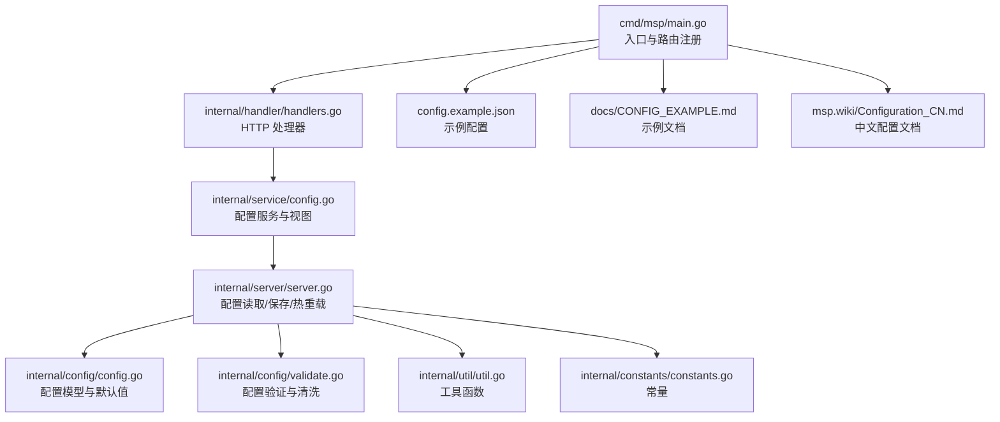
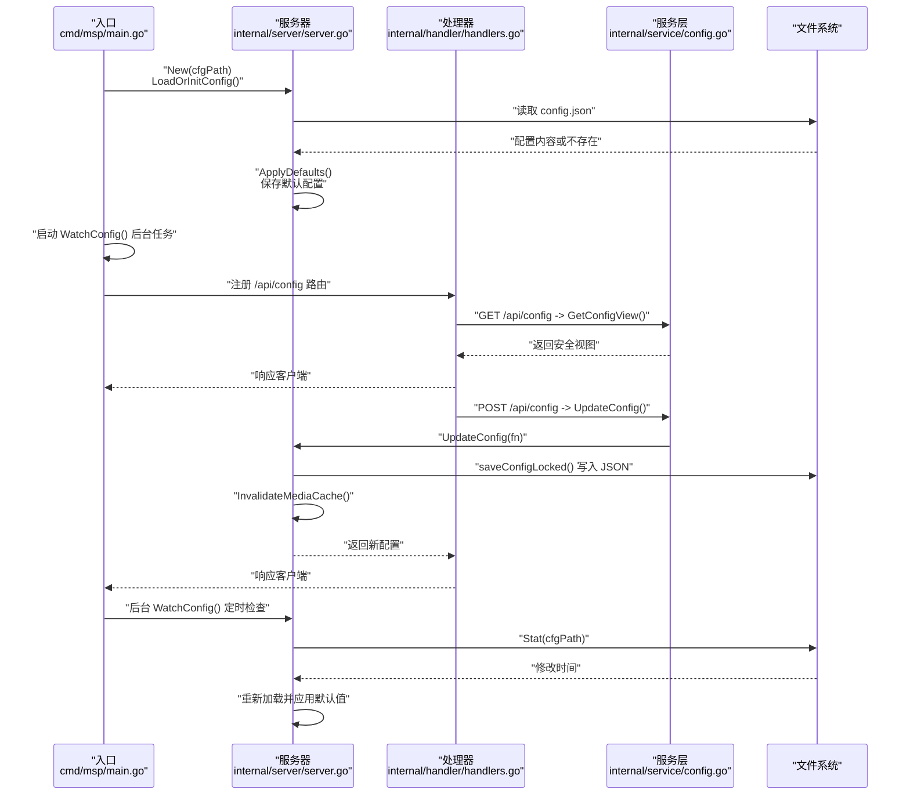
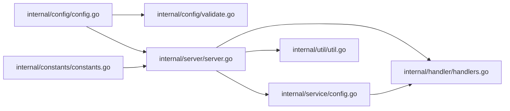

# 配置扩展

<cite>
**本文引用的文件**
- [internal/config/config.go](file://internal/config/config.go)
- [internal/config/validate.go](file://internal/config/validate.go)
- [internal/config/config_test.go](file://internal/config/config_test.go)
- [internal/config/validate_test.go](file://internal/config/validate_test.go)
- [internal/constants/constants.go](file://internal/constants/constants.go)
- [internal/server/server.go](file://internal/server/server.go)
- [internal/service/config.go](file://internal/service/config.go)
- [internal/handler/handlers.go](file://internal/handler/handlers.go)
- [internal/util/util.go](file://internal/util/util.go)
- [cmd/msp/main.go](file://cmd/msp/main.go)
- [config.example.json](file://config.example.json)
- [docs/CONFIG_EXAMPLE.md](file://docs/CONFIG_EXAMPLE.md)
- [msp.wiki/Configuration_CN.md](file://msp.wiki/Configuration_CN.md)
</cite>

## 目录
1. [简介](#简介)
2. [项目结构](#项目结构)
3. [核心组件](#核心组件)
4. [架构总览](#架构总览)
5. [详细组件分析](#详细组件分析)
6. [依赖分析](#依赖分析)
7. [性能考虑](#性能考虑)
8. [故障排查指南](#故障排查指南)
9. [结论](#结论)
10. [附录](#附录)

## 简介
本指南面向希望在 MSP 中进行“配置扩展开发”的工程师，系统讲解配置系统的架构与扩展机制，涵盖以下主题：
- 新增配置项的定义、默认值设置与持久化
- 配置验证规则的设计与实现（数据类型、范围、依赖关系）
- 动态配置管理（运行时更新、热重载、持久化）
- 配置文件格式扩展（JSON 支持、模板与环境变量覆盖建议）
- 测试方法与最佳实践

## 项目结构
MSP 的配置系统围绕 JSON 文件与 Go 结构体模型展开，核心模块如下：
- 配置模型与默认值：internal/config
- 配置验证与清洗：internal/config
- 服务层视图与更新：internal/service
- HTTP 接口：internal/handler
- 服务器热重载与持久化：internal/server
- 工具函数（路径、去重、校验等）：internal/util
- 入口与路由：cmd/msp
- 示例与文档：config.example.json、docs、wiki

图表来源
- [cmd/msp/main.go](file://cmd/msp/main.go#L26-L83)
- [internal/handler/handlers.go](file://internal/handler/handlers.go#L38-L66)
- [internal/service/config.go](file://internal/service/config.go#L12-L90)
- [internal/server/server.go](file://internal/server/server.go#L65-L188)
- [internal/config/config.go](file://internal/config/config.go#L77-L146)
- [internal/config/validate.go](file://internal/config/validate.go#L19-L58)
- [internal/util/util.go](file://internal/util/util.go#L101-L140)
- [internal/constants/constants.go](file://internal/constants/constants.go#L9-L14)
- [config.example.json](file://config.example.json#L1-L56)
- [docs/CONFIG_EXAMPLE.md](file://docs/CONFIG_EXAMPLE.md#L1-L202)
- [msp.wiki/Configuration_CN.md](file://msp.wiki/Configuration_CN.md#L1-L241)

章节来源
- [cmd/msp/main.go](file://cmd/msp/main.go#L26-L83)
- [internal/server/server.go](file://internal/server/server.go#L65-L188)
- [internal/config/config.go](file://internal/config/config.go#L77-L146)
- [internal/config/validate.go](file://internal/config/validate.go#L19-L58)
- [internal/service/config.go](file://internal/service/config.go#L12-L90)
- [internal/handler/handlers.go](file://internal/handler/handlers.go#L38-L66)
- [internal/util/util.go](file://internal/util/util.go#L101-L140)
- [internal/constants/constants.go](file://internal/constants/constants.go#L9-L14)
- [config.example.json](file://config.example.json#L1-L56)
- [docs/CONFIG_EXAMPLE.md](file://docs/CONFIG_EXAMPLE.md#L1-L202)
- [msp.wiki/Configuration_CN.md](file://msp.wiki/Configuration_CN.md#L1-L241)

## 核心组件
- 配置模型与默认值
  - 定义了完整的配置结构体（端口、共享目录、功能开关、UI、播放、黑名单、安全、日志等），并通过默认值函数与分段默认值应用逻辑确保缺失字段被补齐。
- 配置验证与清洗
  - 提供 Validate/Sanitize/IsValid 等能力，覆盖端口、日志级别、共享目录、安全（IP/CIDR/PIN）、黑名单（扩展名、大小规则）、播放范围等。
- 服务层视图与更新
  - 提供安全视图（隐藏敏感字段）与配置更新流程，负责规范化共享目录、去重、持久化与缓存失效。
- 服务器热重载与持久化
  - 负责配置文件读取、保存、变更检测与自动重载，以及日志与缓存管理。
- 工具函数
  - 路径规范化、共享目录去重、大小解析、IP/CIDR 校验等。

章节来源
- [internal/config/config.go](file://internal/config/config.go#L77-L146)
- [internal/config/validate.go](file://internal/config/validate.go#L19-L58)
- [internal/service/config.go](file://internal/service/config.go#L12-L90)
- [internal/server/server.go](file://internal/server/server.go#L65-L188)
- [internal/util/util.go](file://internal/util/util.go#L101-L140)

## 架构总览
MSP 的配置生命周期如下：
- 启动阶段：读取配置文件，若不存在则生成默认配置并保存；随后初始化日志、数据库与热重载。
- 运行阶段：提供 HTTP 接口用于获取配置视图与更新配置；更新后持久化并使媒体缓存失效。
- 热重载：后台定时轮询配置文件修改时间，发现变更后重新加载并应用默认值。

图表来源
- [cmd/msp/main.go](file://cmd/msp/main.go#L26-L83)
- [internal/server/server.go](file://internal/server/server.go#L76-L188)
- [internal/handler/handlers.go](file://internal/handler/handlers.go#L45-L66)
- [internal/service/config.go](file://internal/service/config.go#L73-L122)

## 详细组件分析

### 配置模型与默认值
- 模型结构
  - 核心结构体包含端口、共享目录、功能开关、UI、播放、黑名单、安全、日志等字段，采用指针字段以区分“未设置”和“显式设置的零值”。
- 默认值策略
  - 提供 Default 函数与分段默认值应用（基础、功能、UI、播放、黑名单、安全），确保缺失字段被补齐。
  - 使用辅助函数设置布尔与字符串默认值，避免覆盖显式设置。
- 关键实现位置
  - 模型与默认值：[internal/config/config.go](file://internal/config/config.go#L77-L146)
  - 分段默认值应用：[internal/config/config.go](file://internal/config/config.go#L148-L285)

章节来源
- [internal/config/config.go](file://internal/config/config.go#L77-L146)
- [internal/config/config.go](file://internal/config/config.go#L148-L285)

### 配置验证规则
- 验证范围
  - 端口：必须为 1-65535，小于 1024 需管理员权限。
  - 日志级别：支持 debug/info/error/none，忽略大小写与空白。
  - 共享目录：路径与标签非空，路径大小写不敏感去重，标签去重。
  - 安全：PIN 长度与字符校验，IP/CIDR 格式校验。
  - 黑名单：扩展名需以点开头，大小规则支持比较与区间两种格式。
  - 播放范围：scope 限定为 all/folder/share。
- 清洗与快速校验
  - Sanitize 返回不含敏感信息的安全副本；IsValid 提供快速布尔判断。
- 关键实现位置
  - 验证主流程与错误封装：[internal/config/validate.go](file://internal/config/validate.go#L19-L58)
  - 端口与日志级别：[internal/config/validate.go](file://internal/config/validate.go#L60-L88)
  - 共享目录：[internal/config/validate.go](file://internal/config/validate.go#L90-L139)
  - 安全（PIN/IP/CIDR）：[internal/config/validate.go](file://internal/config/validate.go#L141-L176)
  - 黑名单（扩展名/大小规则）：[internal/config/validate.go](file://internal/config/validate.go#L242-L310)
  - 播放范围：[internal/config/validate.go](file://internal/config/validate.go#L344-L391)
  - 清洗与快速校验：[internal/config/validate.go](file://internal/config/validate.go#L393-L411)

章节来源
- [internal/config/validate.go](file://internal/config/validate.go#L19-L58)
- [internal/config/validate.go](file://internal/config/validate.go#L60-L88)
- [internal/config/validate.go](file://internal/config/validate.go#L90-L139)
- [internal/config/validate.go](file://internal/config/validate.go#L141-L176)
- [internal/config/validate.go](file://internal/config/validate.go#L242-L310)
- [internal/config/validate.go](file://internal/config/validate.go#L344-L391)
- [internal/config/validate.go](file://internal/config/validate.go#L393-L411)

### 服务层视图与更新
- 安全视图
  - 安全视图隐藏 PIN，仅暴露白名单、黑名单与 PIN 开关。
- 配置更新流程
  - 规范化共享目录（路径、标签、去重），校验目录有效性，更新服务器配置并持久化，最后失效媒体缓存。
- 关键实现位置
  - 安全视图与转换：[internal/service/config.go](file://internal/service/config.go#L20-L71)
  - 获取视图：[internal/service/config.go](file://internal/service/config.go#L73-L90)
  - 更新配置：[internal/service/config.go](file://internal/service/config.go#L92-L122)

章节来源
- [internal/service/config.go](file://internal/service/config.go#L20-L71)
- [internal/service/config.go](file://internal/service/config.go#L73-L122)

### HTTP 接口与控制器
- GET /api/config：返回安全配置视图（含 LAN IP、URL、FFmpeg 状态等）。
- POST /api/config：接收客户端提交的新配置，调用服务层更新并返回最新配置。
- 共享目录操作：POST /api/shares 支持添加/移除共享目录。
- 关键实现位置
  - 处理器构造与路由注册：[internal/handler/handlers.go](file://internal/handler/handlers.go#L38-L43)
  - GET/POST /api/config：[internal/handler/handlers.go](file://internal/handler/handlers.go#L45-L66)
  - 共享目录添加/移除：[internal/handler/handlers.go](file://internal/handler/handlers.go#L106-L149)

章节来源
- [internal/handler/handlers.go](file://internal/handler/handlers.go#L38-L66)
- [internal/handler/handlers.go](file://internal/handler/handlers.go#L106-L149)

### 服务器热重载与持久化
- 加载与初始化
  - 若配置文件不存在，生成默认配置并保存；记录文件修改时间。
- 热重载
  - 后台定时器按固定间隔检查配置文件修改时间，发现变更后重新读取、应用默认值并更新内存配置。
- 持久化
  - 更新配置时写入临时文件再原子重命名，保证一致性。
- 关键实现位置
  - 加载/保存/更新/热重载：[internal/server/server.go](file://internal/server/server.go#L76-L188)
  - 常量（检查间隔等）：[internal/constants/constants.go](file://internal/constants/constants.go#L42-L43)

章节来源
- [internal/server/server.go](file://internal/server/server.go#L76-L188)
- [internal/constants/constants.go](file://internal/constants/constants.go#L42-L43)

### 工具函数与辅助
- 路径与共享目录
  - NormalizePath、NormalizeShares、DedupeShares、IsExistingDir、WithinRoot 等。
- 大小解析
  - ParseSize/parseSize 支持 B/KB/MB/GB/TB 单位解析。
- 关键实现位置
  - 共享目录与路径工具：[internal/util/util.go](file://internal/util/util.go#L101-L140)
  - 大小解析：[internal/util/util.go](file://internal/util/util.go#L52-L78)

章节来源
- [internal/util/util.go](file://internal/util/util.go#L101-L140)
- [internal/util/util.go](file://internal/util/util.go#L52-L78)

## 依赖分析
- 组件耦合
  - server 对 config/validate/util 有直接依赖；service 对 server/config/util 有依赖；handler 对 server/service/util 有依赖。
- 关键依赖链
  - 配置文件 → server.LoadOrInitConfig/WatchConfig → server.UpdateConfig → server.saveConfigLocked
  - handler.HandleConfig → service.UpdateConfig → server.UpdateConfig
- 循环依赖
  - 未发现循环依赖迹象。

图表来源
- [internal/config/config.go](file://internal/config/config.go#L77-L146)
- [internal/config/validate.go](file://internal/config/validate.go#L19-L58)
- [internal/server/server.go](file://internal/server/server.go#L76-L188)
- [internal/handler/handlers.go](file://internal/handler/handlers.go#L45-L66)
- [internal/service/config.go](file://internal/service/config.go#L92-L122)
- [internal/util/util.go](file://internal/util/util.go#L101-L140)
- [internal/constants/constants.go](file://internal/constants/constants.go#L42-L43)

章节来源
- [internal/config/config.go](file://internal/config/config.go#L77-L146)
- [internal/config/validate.go](file://internal/config/validate.go#L19-L58)
- [internal/server/server.go](file://internal/server/server.go#L76-L188)
- [internal/handler/handlers.go](file://internal/handler/handlers.go#L45-L66)
- [internal/service/config.go](file://internal/service/config.go#L92-L122)
- [internal/util/util.go](file://internal/util/util.go#L101-L140)
- [internal/constants/constants.go](file://internal/constants/constants.go#L42-L43)

## 性能考虑
- 热重载轮询
  - 使用固定周期检查配置文件修改时间，避免频繁 IO；可在常量中调整检查间隔以平衡实时性与开销。
- 媒体缓存失效
  - 更新配置后主动失效媒体缓存，确保后续请求使用新配置，避免陈旧状态。
- JSON 持久化
  - 写入临时文件再原子重命名，减少文件损坏风险。
- 验证与默认值
  - 在热重载与更新路径均应用默认值，降低运行时分支复杂度。

章节来源
- [internal/server/server.go](file://internal/server/server.go#L140-L188)
- [internal/constants/constants.go](file://internal/constants/constants.go#L42-L43)
- [internal/service/config.go](file://internal/service/config.go#L120-L122)

## 故障排查指南
- 配置验证错误
  - 使用 Validate/IsValid 快速定位问题；Sanitize 输出可用于日志与前端展示。
  - 常见问题：端口越界、日志级别非法、共享目录路径为空或重复、IP/CIDR 格式错误、PIN 非法、扩展名格式不正确、大小规则格式错误。
- 热重载未生效
  - 检查后台是否运行 WatchConfig；确认配置文件保存成功且修改时间确有变化；查看日志输出。
- 更新接口失败
  - 检查 POST /api/config 的请求体是否符合配置模型；确认共享目录存在且可访问；查看服务层返回的错误信息。
- 测试辅助
  - 使用单元测试覆盖验证逻辑与默认值应用，确保回归稳定。

章节来源
- [internal/config/validate.go](file://internal/config/validate.go#L19-L58)
- [internal/config/validate.go](file://internal/config/validate.go#L393-L411)
- [internal/server/server.go](file://internal/server/server.go#L140-L188)
- [internal/handler/handlers.go](file://internal/handler/handlers.go#L45-L66)
- [internal/config/validate_test.go](file://internal/config/validate_test.go#L242-L288)

## 结论
MSP 的配置系统以清晰的模型、严格的验证与完善的默认值为基础，结合服务层视图与热重载机制，提供了可靠的运行时配置管理能力。扩展新的配置项时，遵循“模型定义 → 默认值 → 验证规则 → 服务层视图与更新 → 热重载与持久化”的流程，即可平滑集成并保障稳定性。

## 附录

### 新增配置项的步骤清单
- 定义模型字段
  - 在配置结构体中新增字段，必要时定义嵌套结构体。
  - 参考：[internal/config/config.go](file://internal/config/config.go#L77-L88)
- 设置默认值
  - 在 Default 函数与对应分段默认值应用函数中补充默认值。
  - 参考：[internal/config/config.go](file://internal/config/config.go#L94-L146)
- 实现验证规则
  - 在 Validate 函数中新增校验分支，必要时新增专用校验函数。
  - 参考：[internal/config/validate.go](file://internal/config/validate.go#L19-L58)
- 更新服务层视图
  - 如涉及敏感信息，更新安全视图结构与转换逻辑。
  - 参考：[internal/service/config.go](file://internal/service/config.go#L20-L71)
- 处理运行时更新
  - 在服务层 UpdateConfig 中应用规范化与持久化逻辑。
  - 参考：[internal/service/config.go](file://internal/service/config.go#L92-L122)
- 支持热重载
  - 确保默认值在热重载路径中再次应用，避免遗漏。
  - 参考：[internal/server/server.go](file://internal/server/server.go#L140-L188)
- 编写测试
  - 为新增字段编写单元测试，覆盖边界与异常情况。
  - 参考：[internal/config/validate_test.go](file://internal/config/validate_test.go#L242-L322)

### 配置文件格式扩展建议
- YAML/JSON 支持
  - 当前实现基于 JSON；如需扩展 YAML，应在加载阶段增加解析器并保持配置模型不变。
- 配置模板与环境变量覆盖
  - 建议在加载前进行模板渲染与环境变量替换，再进行 JSON 解析；注意对敏感字段（如 PIN）进行显式覆盖而非硬编码。
- 示例与文档
  - 参考示例配置与文档，确保新增字段在示例与文档中同步更新。
  - 参考：[config.example.json](file://config.example.json#L1-L56)、[docs/CONFIG_EXAMPLE.md](file://docs/CONFIG_EXAMPLE.md#L1-L202)、[msp.wiki/Configuration_CN.md](file://msp.wiki/Configuration_CN.md#L1-L241)

### 配置扩展测试方法与最佳实践
- 单元测试
  - 使用 testify assert 进行断言，覆盖正常与异常场景。
  - 参考：[internal/config/validate_test.go](file://internal/config/validate_test.go#L9-L322)
- 集成测试
  - 通过 HTTP 接口 POST /api/config 验证更新流程与持久化效果。
  - 参考：[internal/handler/handlers.go](file://internal/handler/handlers.go#L45-L66)
- 回归测试
  - 在每次新增字段后运行默认值与验证测试，确保不破坏现有行为。
  - 参考：[internal/config/config_test.go](file://internal/config/config_test.go#L5-L11)