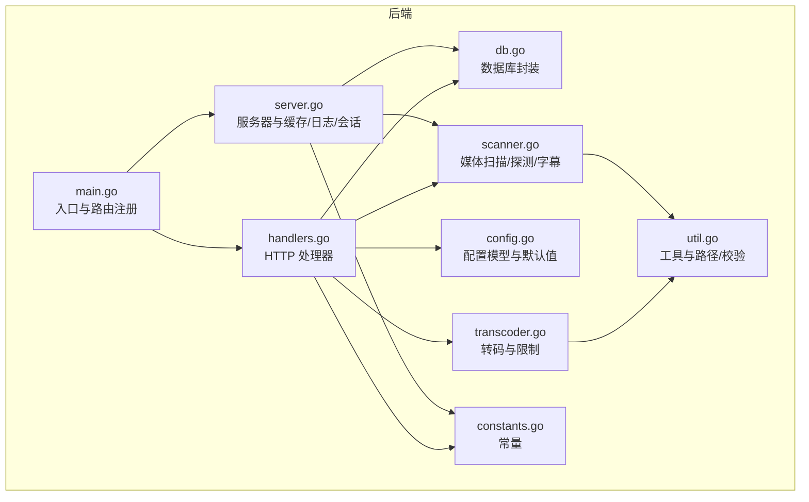
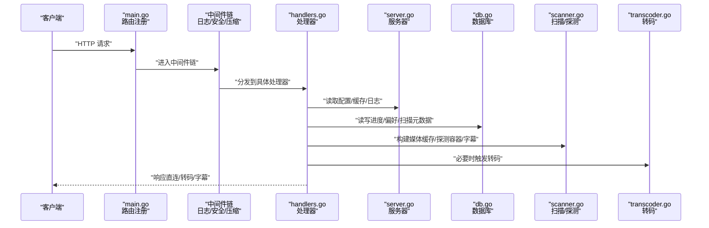
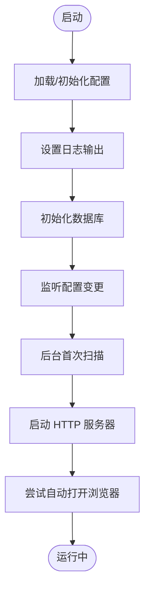
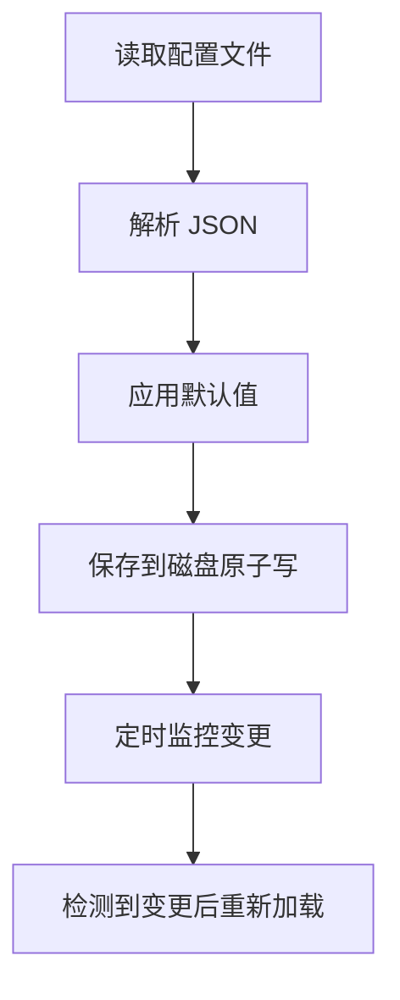
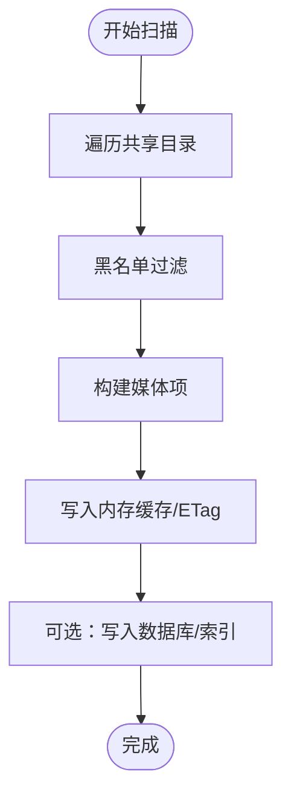
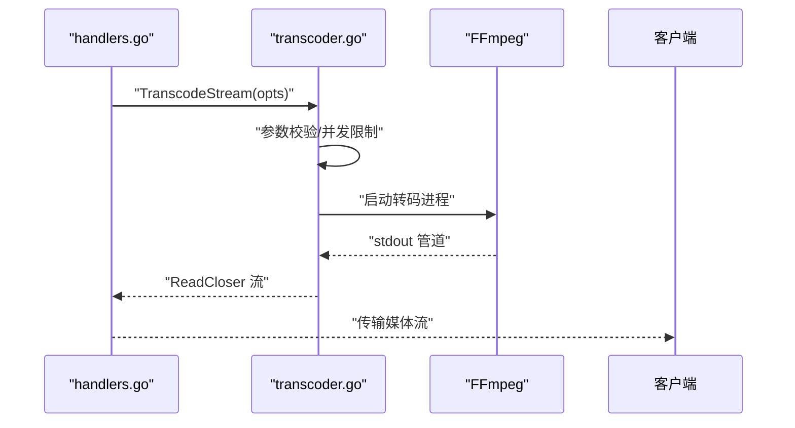
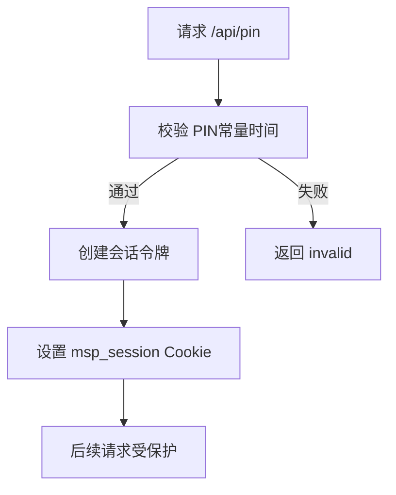
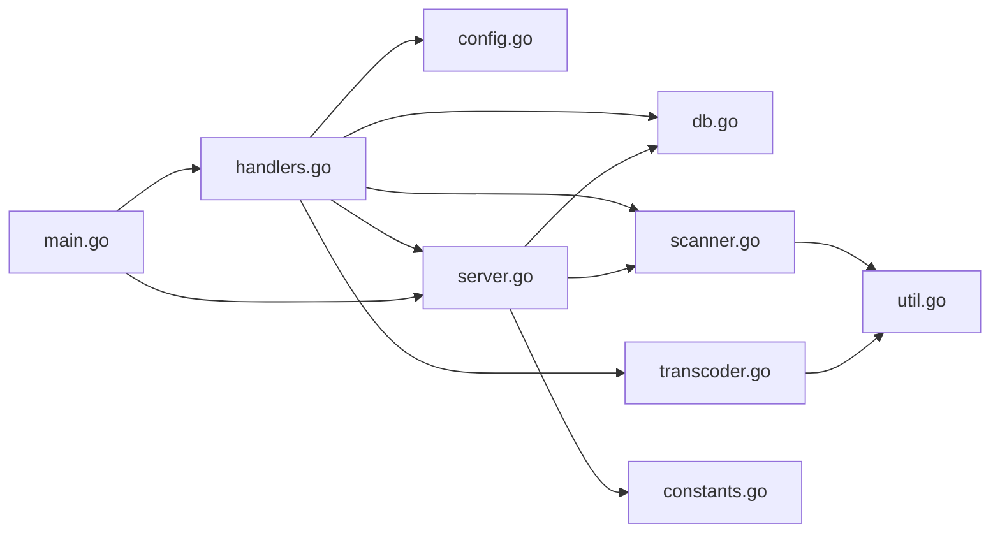

# 故障排除

<cite>
**本文引用的文件**
- [README.md](file://README.md)
- [main.go](file://cmd/msp/main.go)
- [errors.go](file://internal/constants/errors.go)
- [config.go](file://internal/config/config.go)
- [db.go](file://internal/db/db.go)
- [scanner.go](file://internal/media/scanner.go)
- [transcoder.go](file://internal/media/transcoder.go)
- [handlers.go](file://internal/handler/handlers.go)
- [server.go](file://internal/server/server.go)
- [constants.go](file://internal/constants/constants.go)
- [util.go](file://internal/util/util.go)
- [SECURITY.md](file://docs/SECURITY.md)
- [API_REFERENCE.md](file://docs/API_REFERENCE.md)
- [dev.sh](file://scripts/dev.sh)
- [build.sh](file://scripts/build.sh)
- [config.example.json](file://config.example.json)
</cite>

## 目录
1. [简介](#简介)
2. [项目结构](#项目结构)
3. [核心组件](#核心组件)
4. [架构总览](#架构总览)
5. [详细组件分析](#详细组件分析)
6. [依赖关系分析](#依赖关系分析)
7. [性能注意事项](#性能注意事项)
8. [故障排除指南](#故障排除指南)
9. [结论](#结论)
10. [附录](#附录)

## 简介
本指南面向 MSP（Media Share & Preview）项目的使用者与维护者，提供系统化的故障排除方法与诊断流程。覆盖安装失败、启动异常、媒体无法播放、网络连接问题、性能问题、安全相关问题、媒体处理问题、调试工具使用以及社区支持渠道。

## 项目结构
MSP 采用前后端分离的单二进制设计：后端为 Go 实现的 HTTP 服务，内置静态资源并通过嵌入式文件系统提供前端页面。核心模块包括：
- 服务器与路由：HTTP 服务器初始化、中间件链、路由注册
- 配置与持久化：配置加载/保存、默认值应用、热重载
- 数据层：SQLite 数据库封装、媒体缓存与进度存储
- 媒体处理：扫描、探测、字幕处理、转码
- 安全：IP 白/黑名单、PIN 认证、会话管理
- 工具与脚本：开发与构建脚本、日志与环境辅助

**图示来源**
- [main.go](file://cmd/msp/main.go#L26-L83)
- [server.go](file://internal/server/server.go#L31-L74)
- [handlers.go](file://internal/handler/handlers.go#L28-L43)
- [config.go](file://internal/config/config.go#L77-L88)
- [db.go](file://internal/db/db.go#L32-L72)
- [scanner.go](file://internal/media/scanner.go#L25-L57)
- [transcoder.go](file://internal/media/transcoder.go#L15-L33)
- [util.go](file://internal/util/util.go#L18-L50)
- [constants.go](file://internal/constants/constants.go#L9-L14)

**章节来源**
- [README.md](file://README.md#L1-L106)
- [main.go](file://cmd/msp/main.go#L26-L83)

## 核心组件
- 服务器与路由：负责启动 HTTP 服务、注册路由、中间件链（日志、安全、压缩）、自动打开浏览器、优雅关闭
- 配置系统：默认值填充、配置热重载、持久化保存
- 数据库：SQLite 封装、迁移、进度与偏好存储、扫描元数据
- 媒体处理：扫描共享目录、黑名单过滤、字幕与封面发现、容器与编解码探测、SRT/ASS 转 VTT
- 转码：并发限制、格式白名单、参数校验、FFmpeg/ffprobe 探测与调用
- 安全：IP 白/黑名单、PIN 认证、会话令牌、常量时间比较
- 工具：路径规范化、大小解析、IP 列表、权限与私网判断

**章节来源**
- [server.go](file://internal/server/server.go#L31-L74)
- [config.go](file://internal/config/config.go#L77-L146)
- [db.go](file://internal/db/db.go#L32-L72)
- [scanner.go](file://internal/media/scanner.go#L25-L57)
- [transcoder.go](file://internal/media/transcoder.go#L15-L33)
- [handlers.go](file://internal/handler/handlers.go#L28-L43)
- [util.go](file://internal/util/util.go#L18-L50)
- [constants.go](file://internal/constants/constants.go#L9-L14)

## 架构总览
MSP 的请求处理链路如下：

**图示来源**
- [main.go](file://cmd/msp/main.go#L85-L107)
- [handlers.go](file://internal/handler/handlers.go#L413-L446)
- [server.go](file://internal/server/server.go#L332-L396)
- [db.go](file://internal/db/db.go#L74-L99)
- [scanner.go](file://internal/media/scanner.go#L588-L616)
- [transcoder.go](file://internal/media/transcoder.go#L138-L248)

## 详细组件分析

### 组件A：启动与路由（main.go）
- 初始化日志、配置、数据库、静态资源
- 注册路由与中间件链（日志、安全、压缩）
- 自动打开浏览器、优雅关闭
- 错误处理：致命错误直接退出，非致命错误记录日志

**图示来源**
- [main.go](file://cmd/msp/main.go#L26-L83)

**章节来源**
- [main.go](file://cmd/msp/main.go#L26-L83)

### 组件B：配置系统（config.go + server.go）
- 默认值应用：端口、特性、UI、播放、黑名单、安全等
- 热重载：定时检查配置文件修改并重新加载
- 保存策略：原子写入（临时文件 + 原子重命名）

**图示来源**
- [config.go](file://internal/config/config.go#L148-L162)
- [server.go](file://internal/server/server.go#L76-L112)
- [server.go](file://internal/server/server.go#L140-L188)

**章节来源**
- [config.go](file://internal/config/config.go#L94-L146)
- [server.go](file://internal/server/server.go#L76-L112)
- [server.go](file://internal/server/server.go#L140-L188)

### 组件C：媒体扫描与缓存（scanner.go + server.go）
- 扫描策略：遍历共享目录，黑名单过滤，限制数量
- 缓存策略：内存缓存 + ETag + TTL；支持增量重建与磁盘缓存
- 探测与字幕：容器与编解码探测、字幕与封面发现、SRT/ASS 转 VTT

**图示来源**
- [scanner.go](file://internal/media/scanner.go#L25-L57)
- [scanner.go](file://internal/media/scanner.go#L588-L616)
- [server.go](file://internal/server/server.go#L332-L396)

**章节来源**
- [scanner.go](file://internal/media/scanner.go#L25-L57)
- [scanner.go](file://internal/media/scanner.go#L588-L616)
- [server.go](file://internal/server/server.go#L332-L396)

### 组件D：转码与播放（transcoder.go + handlers.go）
- 并发限制：全局转码通道限制并发数
- 格式白名单与参数校验：格式、码率、偏移
- FFmpeg/ffprobe 探测：自动选择复制或转码策略
- 流式输出：管道读取、超时与错误捕获

**图示来源**
- [transcoder.go](file://internal/media/transcoder.go#L138-L248)
- [handlers.go](file://internal/handler/handlers.go#L534-L564)

**章节来源**
- [transcoder.go](file://internal/media/transcoder.go#L15-L33)
- [transcoder.go](file://internal/media/transcoder.go#L138-L248)
- [handlers.go](file://internal/handler/handlers.go#L534-L564)

### 组件E：安全与会话（SECURITY.md + handlers.go + server.go）
- IP 白/黑名单：CIDR 支持，黑名单优先
- PIN 认证：常量时间比较，HttpOnly Cookie，7 天有效期
- 会话管理：令牌生成、过期清理、校验

**图示来源**
- [SECURITY.md](file://docs/SECURITY.md#L135-L167)
- [handlers.go](file://internal/handler/handlers.go#L255-L319)
- [server.go](file://internal/server/server.go#L570-L626)

**章节来源**
- [SECURITY.md](file://docs/SECURITY.md#L1-L188)
- [handlers.go](file://internal/handler/handlers.go#L255-L319)
- [server.go](file://internal/server/server.go#L570-L626)

## 依赖关系分析
- 组件耦合：处理器依赖服务器、配置、数据库、媒体与转码模块
- 外部依赖：SQLite、FFmpeg/ffprobe、Gin（通过嵌入式资源）
- 关键接口：配置热重载、媒体缓存、日志轮转、会话令牌

**图示来源**
- [handlers.go](file://internal/handler/handlers.go#L28-L43)
- [server.go](file://internal/server/server.go#L31-L74)
- [main.go](file://cmd/msp/main.go#L26-L83)

**章节来源**
- [handlers.go](file://internal/handler/handlers.go#L28-L43)
- [server.go](file://internal/server/server.go#L31-L74)
- [main.go](file://cmd/msp/main.go#L26-L83)

## 性能注意事项
- 内存与 GC：设置 GC 百分比以降低内存峰值
- 数据库：SQLite 单连接 + WAL + PRAGMA 调优；禁用默认事务，手动控制
- 缓存：媒体缓存 TTL、ETag、内存与磁盘缓存；扫描限制
- 转码：并发限制、格式白名单、参数校验；避免不必要的转码
- 日志：轮转阈值与频率，减少 IO 压力

**章节来源**
- [main.go](file://cmd/msp/main.go#L26-L28)
- [db.go](file://internal/db/db.go#L32-L72)
- [server.go](file://internal/server/server.go#L332-L396)
- [transcoder.go](file://internal/media/transcoder.go#L15-L17)

## 故障排除指南

### 一、安装与启动类问题
- 症状：启动后无响应或立即退出
  - 排查要点：
    - 检查配置文件是否存在与可读写（默认路径为可执行文件目录）
    - 查看日志文件（默认在 logs 目录下），确认端口占用与权限
    - 确认数据库初始化是否成功（SQLite 文件创建）
  - 相关实现参考：
    - [main.go](file://cmd/msp/main.go#L30-L45)
    - [server.go](file://internal/server/server.go#L190-L220)
    - [db.go](file://internal/db/db.go#L32-L72)

- 症状：浏览器未自动打开或无法访问
  - 排查要点：
    - 确认端口未被占用，查看启动日志打印的访问 URL
    - 检查防火墙与安全软件拦截
    - 若设置了 MSP_NO_AUTO_OPEN 环境变量，需手动打开
  - 相关实现参考：
    - [main.go](file://cmd/msp/main.go#L65-L82)
    - [main.go](file://cmd/msp/main.go#L125-L139)

- 症状：开发脚本无法运行
  - 排查要点：
    - 确认 pnpm 安装与可用，或启用 corepack
    - 检查 Go 版本与交叉编译工具链
  - 相关实现参考：
    - [dev.sh](file://scripts/dev.sh#L112-L131)
    - [build.sh](file://scripts/build.sh#L127-L143)

**章节来源**
- [main.go](file://cmd/msp/main.go#L30-L45)
- [server.go](file://internal/server/server.go#L190-L220)
- [db.go](file://internal/db/db.go#L32-L72)
- [main.go](file://cmd/msp/main.go#L65-L82)
- [main.go](file://cmd/msp/main.go#L125-L139)
- [dev.sh](file://scripts/dev.sh#L112-L131)
- [build.sh](file://scripts/build.sh#L127-L143)

### 二、网络连接与访问问题
- 症状：局域网内无法访问
  - 排查要点：
    - 检查 IP 白名单/黑名单配置，确认自身 IP 在白名单中
    - 使用 GET /api/ip 获取本机局域网 IP 列表核对
    - 确认路由器未做额外 ACL 限制
  - 相关实现参考：
    - [SECURITY.md](file://docs/SECURITY.md#L11-L60)
    - [handlers.go](file://internal/handler/handlers.go#L151-L159)
    - [util.go](file://internal/util/util.go#L218-L256)

- 症状：跨设备访问被拒绝
  - 排查要点：
    - 启用 PIN 认证并正确提交 PIN，验证会话 Cookie
    - 检查会话是否过期（7 天）
  - 相关实现参考：
    - [SECURITY.md](file://docs/SECURITY.md#L135-L167)
    - [handlers.go](file://internal/handler/handlers.go#L255-L319)
    - [server.go](file://internal/server/server.go#L570-L626)

**章节来源**
- [SECURITY.md](file://docs/SECURITY.md#L11-L60)
- [handlers.go](file://internal/handler/handlers.go#L151-L159)
- [util.go](file://internal/util/util.go#L218-L256)
- [SECURITY.md](file://docs/SECURITY.md#L135-L167)
- [handlers.go](file://internal/handler/handlers.go#L255-L319)
- [server.go](file://internal/server/server.go#L570-L626)

### 三、媒体播放与转码问题
- 症状：媒体无法播放或播放卡顿
  - 排查要点：
    - 使用 GET /api/probe 获取容器与编解码信息，判断是否需要转码
    - 检查转码开关与格式白名单
    - 确认 FFmpeg/ffprobe 可用
  - 相关实现参考：
    - [handlers.go](file://internal/handler/handlers.go#L581-L621)
    - [handlers.go](file://internal/handler/handlers.go#L513-L532)
    - [transcoder.go](file://internal/media/transcoder.go#L91-L104)

- 症状：转码失败或耗时过长
  - 排查要点：
    - 检查并发限制（最多 2 个转码任务）
    - 校验转码参数（格式、码率、偏移）
    - 查看转码错误日志（stderr 捕获）
  - 相关实现参考：
    - [transcoder.go](file://internal/media/transcoder.go#L15-L17)
    - [transcoder.go](file://internal/media/transcoder.go#L138-L248)

- 症状：字幕不显示或格式不支持
  - 排查要点：
    - 仅支持 .vtt/.srt/.ass/.ssa；.srt/.ass/.ssa 会被转换为 VTT
    - 检查字幕文件大小限制
  - 相关实现参考：
    - [handlers.go](file://internal/handler/handlers.go#L623-L684)
    - [scanner.go](file://internal/media/scanner.go#L689-L714)

**章节来源**
- [handlers.go](file://internal/handler/handlers.go#L581-L621)
- [handlers.go](file://internal/handler/handlers.go#L513-L532)
- [transcoder.go](file://internal/media/transcoder.go#L91-L104)
- [transcoder.go](file://internal/media/transcoder.go#L15-L17)
- [transcoder.go](file://internal/media/transcoder.go#L138-L248)
- [handlers.go](file://internal/handler/handlers.go#L623-L684)
- [scanner.go](file://internal/media/scanner.go#L689-L714)

### 四、性能问题排查
- 症状：CPU 占用高
  - 排查要点：
    - 检查是否有大量并发转码任务
    - 适当降低转码并发或调整目标格式/码率
  - 相关实现参考：
    - [transcoder.go](file://internal/media/transcoder.go#L15-L17)

- 症状：内存占用高
  - 排查要点：
    - 检查媒体缓存 TTL 与内存缓存大小
    - 观察 GC 行为与内存峰值
  - 相关实现参考：
    - [main.go](file://cmd/msp/main.go#L26-L28)
    - [server.go](file://internal/server/server.go#L332-L396)

- 症状：网络延迟大
  - 排查要点：
    - 检查转码是否启用，直连优先
    - 使用断点续传与 Range 请求优化
  - 相关实现参考：
    - [handlers.go](file://internal/handler/handlers.go#L566-L579)

**章节来源**
- [transcoder.go](file://internal/media/transcoder.go#L15-L17)
- [main.go](file://cmd/msp/main.go#L26-L28)
- [server.go](file://internal/server/server.go#L332-L396)
- [handlers.go](file://internal/handler/handlers.go#L566-L579)

### 五、安全相关问题
- 症状：访问被拒绝
  - 排查要点：
    - 检查 IP 白名单/黑名单配置，确认自身 IP 是否被允许
    - 黑名单优先级高于白名单
  - 相关实现参考：
    - [SECURITY.md](file://docs/SECURITY.md#L11-L60)

- 症状：认证失败
  - 排查要点：
    - 确认 PIN 码长度与格式（4-8 位数字）
    - 检查会话 Cookie 是否设置与未过期
  - 相关实现参考：
    - [SECURITY.md](file://docs/SECURITY.md#L61-L81)
    - [handlers.go](file://internal/handler/handlers.go#L255-L319)

**章节来源**
- [SECURITY.md](file://docs/SECURITY.md#L11-L60)
- [SECURITY.md](file://docs/SECURITY.md#L61-L81)
- [handlers.go](file://internal/handler/handlers.go#L255-L319)

### 六、媒体处理问题
- 症状：扫描失败或媒体缺失
  - 排查要点：
    - 检查共享目录路径是否可读、是否存在
    - 核对黑名单规则（扩展名、文件名、文件夹、大小规则）
    - 使用刷新参数强制重新扫描
  - 相关实现参考：
    - [scanner.go](file://internal/media/scanner.go#L25-L57)
    - [scanner.go](file://internal/media/scanner.go#L181-L231)
    - [handlers.go](file://internal/handler/handlers.go#L333-L362)

- 症状：字幕/封面未识别
  - 排查要点：
    - 检查字幕文件命名与语言标记
    - 确认音频封面候选文件名
  - 相关实现参考：
    - [scanner.go](file://internal/media/scanner.go#L259-L285)
    - [scanner.go](file://internal/media/scanner.go#L490-L509)

**章节来源**
- [scanner.go](file://internal/media/scanner.go#L25-L57)
- [scanner.go](file://internal/media/scanner.go#L181-L231)
- [handlers.go](file://internal/handler/handlers.go#L333-L362)
- [scanner.go](file://internal/media/scanner.go#L259-L285)
- [scanner.go](file://internal/media/scanner.go#L490-L509)

### 七、日志分析与错误解读
- 日志级别与轮转：
  - 支持 error/info/debug，按阈值轮转
  - 通过配置 logLevel/logFile 控制
- 常见错误码与含义：
  - JSON 解析失败、写入/读取配置失败、读取偏好/进度失败
  - 缺少 id/path/prefs、非法请求、方法不允许、不支持的格式
  - 访问被拒绝、未授权、转码未启用
- 相关实现参考：
  - [errors.go](file://internal/constants/errors.go#L4-L67)
  - [server.go](file://internal/server/server.go#L190-L220)
  - [server.go](file://internal/server/server.go#L222-L248)

**章节来源**
- [errors.go](file://internal/constants/errors.go#L4-L67)
- [server.go](file://internal/server/server.go#L190-L220)
- [server.go](file://internal/server/server.go#L222-L248)

### 八、调试工具与技巧
- 开发脚本：
  - 自动构建后端、启动前端、监听 Go 文件变化并重启
- 构建脚本：
  - 跨平台构建、生成校验和、调试符号拷贝
- 前端开发：
  - 通过环境变量指向后端地址，启用热更新
- 相关实现参考：
  - [dev.sh](file://scripts/dev.sh#L92-L150)
  - [build.sh](file://scripts/build.sh#L150-L203)

**章节来源**
- [dev.sh](file://scripts/dev.sh#L92-L150)
- [build.sh](file://scripts/build.sh#L150-L203)

### 九、社区支持与问题反馈
- 文档与 Wiki：安装、配置、播放/转码、安全、发布流程
- 问题反馈：通过 GitHub Issues 提交
- 相关实现参考：
  - [README.md](file://README.md#L73-L81)

**章节来源**
- [README.md](file://README.md#L73-L81)

## 结论
本指南提供了 MSP 从安装、启动、网络访问、媒体播放、转码、性能优化到安全与调试的全流程故障排除方法。建议按“日志 → 配置 → 网络 → 媒体 → 转码”的顺序逐项排查，结合内置 API 与工具快速定位问题。

## 附录

### A. 常用 API 参考
- 配置：GET/POST /api/config
- 共享目录：POST /api/shares
- 媒体：GET /api/media（支持 refresh/limit）
- 流媒体：GET /api/stream（支持 transcode/start/format/bitrate）
- 字幕：GET /api/subtitle
- 探针：GET /api/probe
- 进度：GET/POST /api/progress
- 偏好：GET/POST /api/prefs
- IP：GET /api/ip
- PIN：POST /api/pin
- 前端日志上报：POST /api/log

**章节来源**
- [API_REFERENCE.md](file://docs/API_REFERENCE.md#L12-L215)

### B. 配置示例与默认值
- 示例配置：端口、共享目录、特性、UI、播放、黑名单、安全
- 默认值：端口、特性选项、UI 默认页签、播放范围/转码开关、黑名单为空、安全默认 PIN

**章节来源**
- [config.example.json](file://config.example.json#L1-L56)
- [config.go](file://internal/config/config.go#L94-L146)