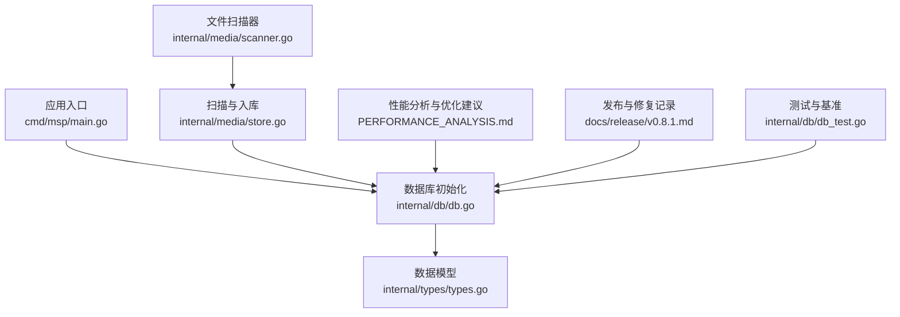
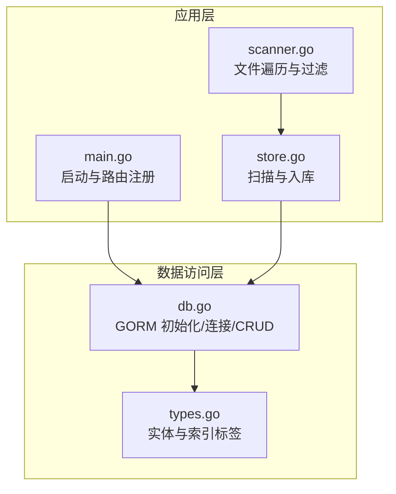
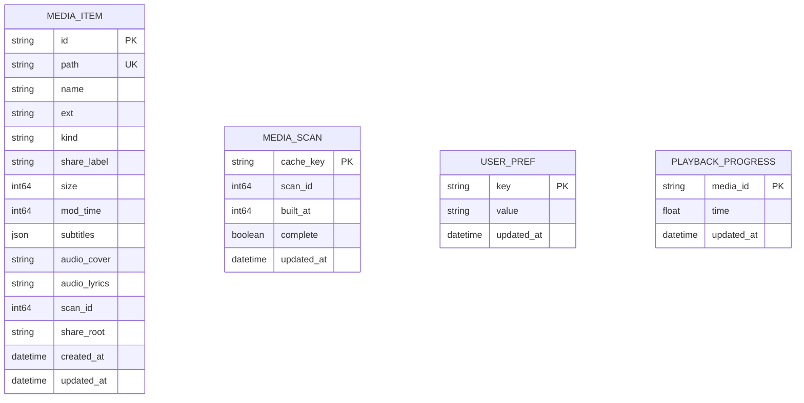
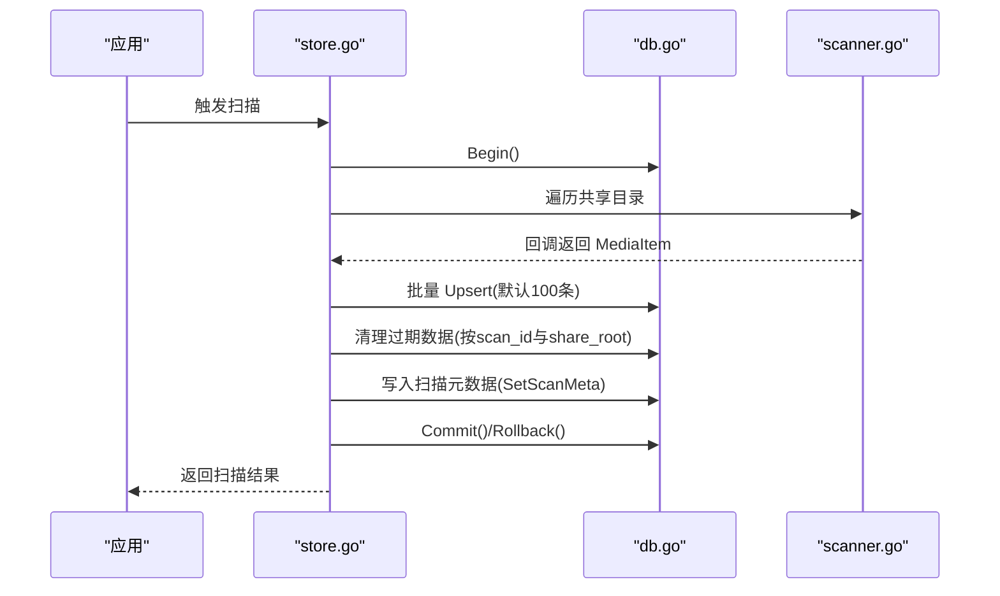
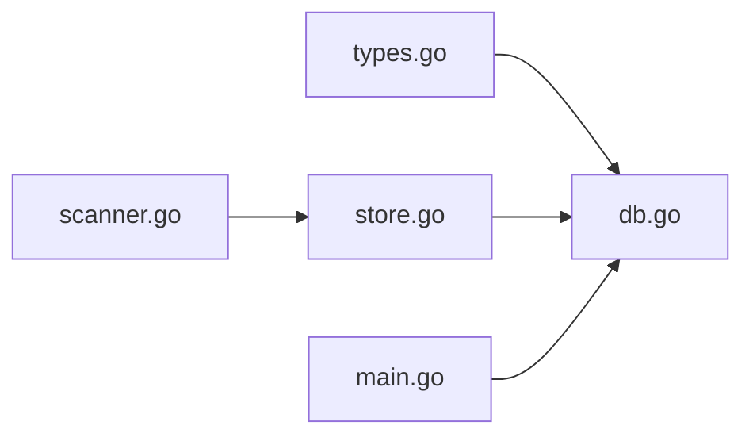

# 数据库设计

<cite>
**本文引用的文件**
- [internal/db/db.go](file://internal/db/db.go)
- [internal/types/types.go](file://internal/types/types.go)
- [internal/media/store.go](file://internal/media/store.go)
- [internal/media/scanner.go](file://internal/media/scanner.go)
- [cmd/msp/main.go](file://cmd/msp/main.go)
- [PERFORMANCE_ANALYSIS.md](file://PERFORMANCE_ANALYSIS.md)
- [docs/release/v0.8.1.md](file://docs/release/v0.8.1.md)
- [internal/db/db_test.go](file://internal/db/db_test.go)
</cite>

## 目录
1. [简介](#简介)
2. [项目结构](#项目结构)
3. [核心组件](#核心组件)
4. [架构总览](#架构总览)
5. [详细组件分析](#详细组件分析)
6. [依赖关系分析](#依赖关系分析)
7. [性能考量](#性能考量)
8. [故障排除指南](#故障排除指南)
9. [结论](#结论)
10. [附录](#附录)

## 简介
本文件面向 MSP 项目的数据库设计，聚焦 SQLite 作为本地嵌入式数据库的使用方式，系统化阐述表结构、字段定义、索引策略、核心实体关系与约束、ORM 映射与查询优化、初始化与版本管理、事务与并发控制、性能优化与监控、以及备份恢复与迁移实践。文档同时提供调试与故障排除方法，帮助开发者与运维人员高效维护数据库。

## 项目结构
数据库相关代码主要分布在以下模块：
- 初始化与连接：cmd/msp/main.go 负责应用启动时初始化数据库路径与连接；internal/db/db.go 负责 GORM 初始化、PRAGMA 调优、AutoMigrate 与 CRUD 接口。
- 数据模型：internal/types/types.go 定义 MediaItem、MediaScan、UserPref、PlaybackProgress 等实体及其 GORM 标签。
- 扫描与入库：internal/media/store.go 实现扫描、事务封装、批量入库与清理；internal/media/scanner.go 提供遍历与过滤逻辑。
- 性能与优化：PERFORMANCE_ANALYSIS.md 提供索引与 PRAGMA 优化建议。
- 版本与健壮性：docs/release/v0.8.1.md 记录数据库健壮性修复与迁移策略。
- 测试与基准：internal/db/db_test.go 包含单元测试与基准测试，覆盖事务、并发、查询与批量写入。

**图示来源**
- [cmd/msp/main.go](file://cmd/msp/main.go#L26-L83)
- [internal/db/db.go](file://internal/db/db.go#L32-L72)
- [internal/types/types.go](file://internal/types/types.go#L16-L52)
- [internal/media/store.go](file://internal/media/store.go#L49-L94)
- [internal/media/scanner.go](file://internal/media/scanner.go#L25-L57)
- [PERFORMANCE_ANALYSIS.md](file://PERFORMANCE_ANALYSIS.md#L9-L79)
- [docs/release/v0.8.1.md](file://docs/release/v0.8.1.md#L1-L22)
- [internal/db/db_test.go](file://internal/db/db_test.go#L17-L51)

**章节来源**
- [cmd/msp/main.go](file://cmd/msp/main.go#L26-L83)
- [internal/db/db.go](file://internal/db/db.go#L32-L72)

## 核心组件
- 数据库初始化与连接
  - 使用 GORM + sqlite 驱动，启用 PrepareStmt 缓存与 SkipDefaultTransaction 以提升写入性能。
  - 连接池设置为单连接，配合 WAL 模式减少锁竞争。
  - 通过 PRAGMA 调优：journal_mode=WAL、synchronous=NORMAL、cache_size=-2000。
  - AutoMigrate 创建 MediaItem、MediaScan、UserPref、PlaybackProgress 表。
- ORM 映射与查询接口
  - PlaybackProgress、UserPref、MediaScan 使用 OnConflict 更新策略。
  - 提供 ByScan、ByKind 等可复用 Scope，支持组合查询。
  - 提供批量 Upsert、删除过期数据、按共享根目录清理等高级操作。
- 扫描与事务
  - 扫描过程在单事务内完成，先批量写入，再清理过期数据，最后写入扫描元数据。
  - 采用批量缓冲（默认 100）提升入库吞吐。

**章节来源**
- [internal/db/db.go](file://internal/db/db.go#L32-L72)
- [internal/db/db.go](file://internal/db/db.go#L101-L114)
- [internal/db/db.go](file://internal/db/db.go#L144-L172)
- [internal/media/store.go](file://internal/media/store.go#L49-L94)
- [internal/media/store.go](file://internal/media/store.go#L118-L152)

## 架构总览
数据库层围绕 GORM 与 SQLite 展开，应用启动时建立连接并进行初始化，随后由扫描模块负责批量写入与清理，查询模块提供高效检索能力。

**图示来源**
- [cmd/msp/main.go](file://cmd/msp/main.go#L26-L83)
- [internal/media/store.go](file://internal/media/store.go#L49-L94)
- [internal/media/scanner.go](file://internal/media/scanner.go#L25-L57)
- [internal/db/db.go](file://internal/db/db.go#L32-L72)
- [internal/types/types.go](file://internal/types/types.go#L16-L52)

## 详细组件分析

### 数据模型与表结构
- MediaItem
  - 主键：ID（基于路径编码）
  - 唯一索引：Path（保证路径唯一）
  - 复合索引：kind、share_label、scan_id、name 等，用于查询与排序
  - 字段：ID、Path、Name、Ext、Kind、ShareLabel、Size、ModTime、Subtitles、CoverID、LyricsID、ScanID、ShareRoot、CreatedAt、UpdatedAt
- MediaScan
  - 主键：CacheKey
  - 字段：ScanID、BuiltAt、Complete、UpdatedAt
- UserPref
  - 主键：Key
  - 字段：Key、Value、UpdatedAt
- PlaybackProgress
  - 主键：MediaID
  - 字段：MediaID、Time、UpdatedAt

**图示来源**
- [internal/types/types.go](file://internal/types/types.go#L16-L52)

**章节来源**
- [internal/types/types.go](file://internal/types/types.go#L16-L52)

### ORM 映射关系与约束
- 主键与唯一性
  - MediaItem.Path 唯一索引，防止重复路径入库。
  - PlaybackProgress、UserPref、MediaScan 主键约束。
- 复合索引与查询优化
  - 通过 GORM 标签定义复合索引，覆盖常见查询场景（kind、scan_id、share_label、name）。
- 冲突处理
  - Upsert 使用 OnConflict 更新策略，避免重复插入错误。
- 查询作用域
  - ByScan、ByKind 提供可复用筛选条件，支持组合查询与排序。

**章节来源**
- [internal/types/types.go](file://internal/types/types.go#L16-L52)
- [internal/db/db.go](file://internal/db/db.go#L101-L114)
- [internal/db/db.go](file://internal/db/db.go#L144-L172)

### 查询与事务处理流程
- 扫描与入库
  - 生成 scanID，开启事务，遍历共享目录，构建 MediaItem，批量写入（默认 100 条一批），完成后清理过期数据并写入扫描元数据，提交事务。
- 进度读写
  - GetProgress：静默查询，不存在返回 0。
  - SetProgress：OnConflict 更新播放进度。
- 用户偏好
  - SetPrefs：批量 Upsert，忽略空键。
- 元数据与清理
  - GetScanMeta/SetScanMeta：按缓存键读写扫描元数据。
  - DeleteStaleByScan/DeleteByShareRootsNotIn：按扫描会话与共享根目录清理过期数据。

**图示来源**
- [internal/media/store.go](file://internal/media/store.go#L49-L94)
- [internal/media/store.go](file://internal/media/store.go#L118-L152)
- [internal/db/db.go](file://internal/db/db.go#L130-L142)
- [internal/db/db.go](file://internal/db/db.go#L174-L199)

**章节来源**
- [internal/media/store.go](file://internal/media/store.go#L49-L94)
- [internal/media/store.go](file://internal/media/store.go#L118-L152)
- [internal/db/db.go](file://internal/db/db.go#L130-L142)
- [internal/db/db.go](file://internal/db/db.go#L174-L199)

### 并发控制与事务策略
- 连接池：单连接，避免 SQLite 锁竞争。
- WAL 模式：提升并发写入性能。
- 事务：扫描过程在单事务内完成，保证一致性；业务层手动控制事务，避免 GORM 默认事务带来的额外开销。
- 并发读写：PlaybackProgress 与 UserPref 通过 OnConflict 与单条写入实现无锁更新；测试覆盖并发读写场景。

**章节来源**
- [internal/db/db.go](file://internal/db/db.go#L54-L71)
- [internal/media/store.go](file://internal/media/store.go#L61-L93)
- [internal/db/db_test.go](file://internal/db/db_test.go#L519-L546)

## 依赖关系分析
- 类型依赖
  - db.go 依赖 types.go 中的实体定义。
  - store.go 依赖 db.go 的 Upsert、Query、Delete 等接口。
  - scanner.go 仅提供数据构建与遍历，不直接依赖数据库。
- 初始化依赖
  - main.go 在启动阶段初始化数据库，随后注册路由与后台任务。

**图示来源**
- [internal/types/types.go](file://internal/types/types.go#L16-L52)
- [internal/db/db.go](file://internal/db/db.go#L32-L72)
- [internal/media/store.go](file://internal/media/store.go#L49-L94)
- [internal/media/scanner.go](file://internal/media/scanner.go#L25-L57)
- [cmd/msp/main.go](file://cmd/msp/main.go#L26-L83)

**章节来源**
- [internal/types/types.go](file://internal/types/types.go#L16-L52)
- [internal/db/db.go](file://internal/db/db.go#L32-L72)
- [internal/media/store.go](file://internal/media/store.go#L49-L94)
- [internal/media/scanner.go](file://internal/media/scanner.go#L25-L57)
- [cmd/msp/main.go](file://cmd/msp/main.go#L26-L83)

## 性能考量
- 已实施优化
  - WAL 模式、预编译语句缓存、单连接、synchronous=NORMAL、cache_size=-2000。
  - 复合索引覆盖常见查询与排序场景。
- 建议优化
  - 添加 idx_cleanup（scan_id, share_root）与 idx_sort（scan_id, kind, share_label, name）复合索引。
  - 启用 PRAGMA temp_store=memory、mmap_size=64MB、PRAGMA optimize。
  - 批量写入（默认 100 条/批）进一步提升扫描性能。
- 监控指标
  - 建议收集慢查询、连接数、缓存命中率、磁盘 I/O、WAL 文件大小等指标。

**章节来源**
- [PERFORMANCE_ANALYSIS.md](file://PERFORMANCE_ANALYSIS.md#L9-L79)
- [internal/db/db.go](file://internal/db/db.go#L54-L71)

## 故障排除指南
- 数据库初始化失败
  - 检查 dbPath 所在目录是否存在与权限是否足够；确保目录提前创建。
  - 查看日志中 PRAGMA 设置失败提示，确认 SQLite 版本与驱动兼容性。
- 唯一约束冲突
  - v0.8.1 修复了因路径索引不一致导致的 UNIQUE constraint failed: media_items.id；如遇冲突，确认 Upsert 冲突目标为主键（ID）而非 Path。
- 扫描过程异常
  - 确认事务是否正常提交；若中途失败，回滚会撤销已写入数据。
  - 检查共享根目录合法性与可访问性。
- 并发问题
  - 单连接与 WAL 已降低锁竞争；如仍出现写入阻塞，考虑减少并发写入或调整批量大小。
- 日志与诊断
  - 使用 /api/log 接口上报前端或客户端侧日志，便于定位问题。
  - 结合测试用例（db_test.go）验证关键路径行为。

**章节来源**
- [docs/release/v0.8.1.md](file://docs/release/v0.8.1.md#L1-L22)
- [internal/db/db_test.go](file://internal/db/db_test.go#L442-L469)
- [internal/db/db.go](file://internal/db/db.go#L32-L72)

## 结论
MSP 项目采用 SQLite + GORM 的轻量级数据库方案，通过 WAL、单连接、复合索引与批量写入等策略实现了良好的性能与可靠性。核心实体与查询接口清晰，事务与并发控制合理。建议按性能分析报告逐步完善索引与 PRAGMA 配置，并建立完善的监控与日志体系，持续保障数据库稳定运行。

## 附录

### 数据库初始化流程
- 应用启动时，main.go 调用 db.Init(dbPath)，内部：
  - 确保目录存在
  - 初始化 GORM 连接（PrepareStmt、SkipDefaultTransaction）
  - 设置连接池（单连接）
  - 执行 PRAGMA 调优（WAL、synchronous、cache_size）
  - AutoMigrate 创建表结构
- 扫描流程（store.go）：
  - 生成 scanID，Begin 事务
  - 遍历共享目录，批量 Upsert
  - 清理过期数据与共享根目录外数据
  - 写入扫描元数据，Commit

**章节来源**
- [cmd/msp/main.go](file://cmd/msp/main.go#L26-L83)
- [internal/db/db.go](file://internal/db/db.go#L32-L72)
- [internal/media/store.go](file://internal/media/store.go#L49-L94)

### 版本管理与迁移
- v0.8.1 修复了媒体入库的健壮性问题，将 Upsert 冲突目标从 Path 迁移至 ID，确保在不同文件系统下入库的绝对可靠性；该版本不涉及表结构变更，无需数据库迁移。

**章节来源**
- [docs/release/v0.8.1.md](file://docs/release/v0.8.1.md#L1-L22)

### 备份、恢复与迁移
- 备份
  - 直接复制 msp.db 文件；如需在线备份，可在 WAL 模式下复制数据库文件与其 WAL/SHM 文件。
- 恢复
  - 停止服务后，用备份文件替换当前数据库文件，重启服务。
- 迁移
  - 当前版本无结构变更需求；如未来引入新表或列，建议在事务中执行 ALTER TABLE，并在测试环境验证后再上线。

[本节为通用实践说明，不直接分析具体源文件]

### 数据库调试与监控
- 调试
  - 使用 db_test.go 中的测试用例快速验证功能与边界行为（空 DB、并发、事务、批量写入等）。
  - 通过 /api/log 接口上报前端日志，辅助定位问题。
- 监控
  - 建议采集慢查询、连接数、缓存命中、WAL 文件大小、磁盘 I/O 等指标，结合 expvar 或外部监控系统。

**章节来源**
- [internal/db/db_test.go](file://internal/db/db_test.go#L17-L51)
- [internal/db/db_test.go](file://internal/db/db_test.go#L519-L546)
- [PERFORMANCE_ANALYSIS.md](file://PERFORMANCE_ANALYSIS.md#L875-L929)