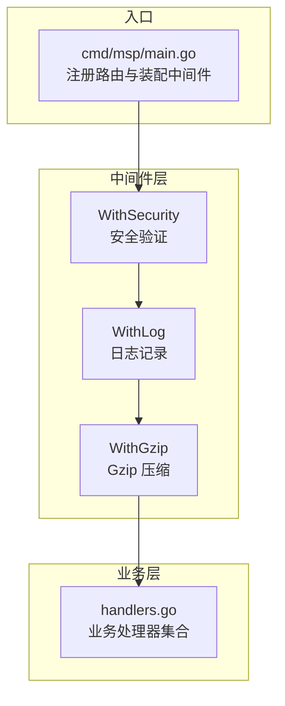
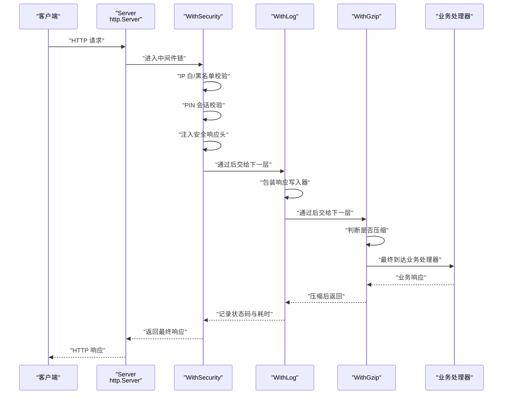
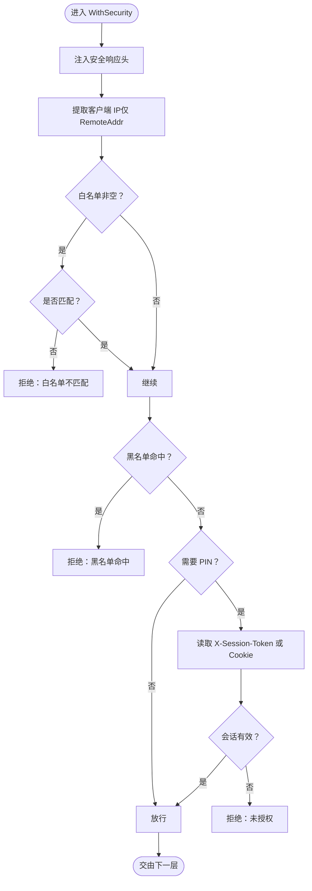
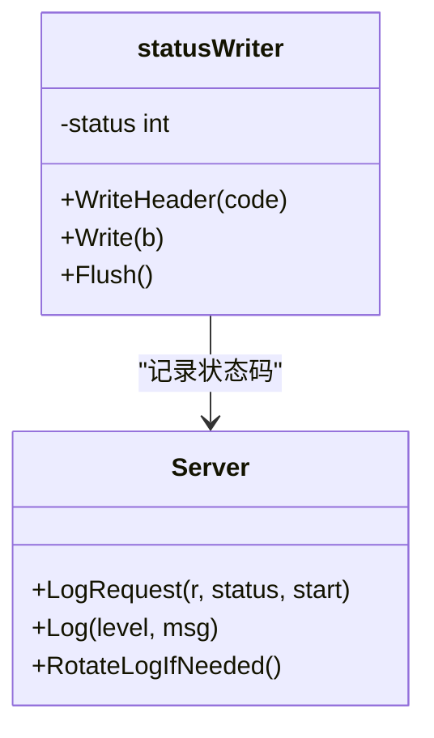
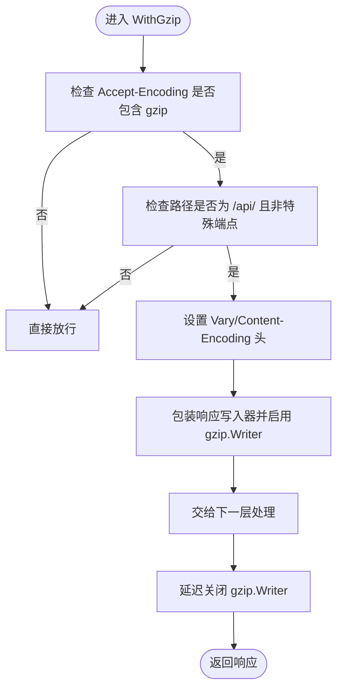
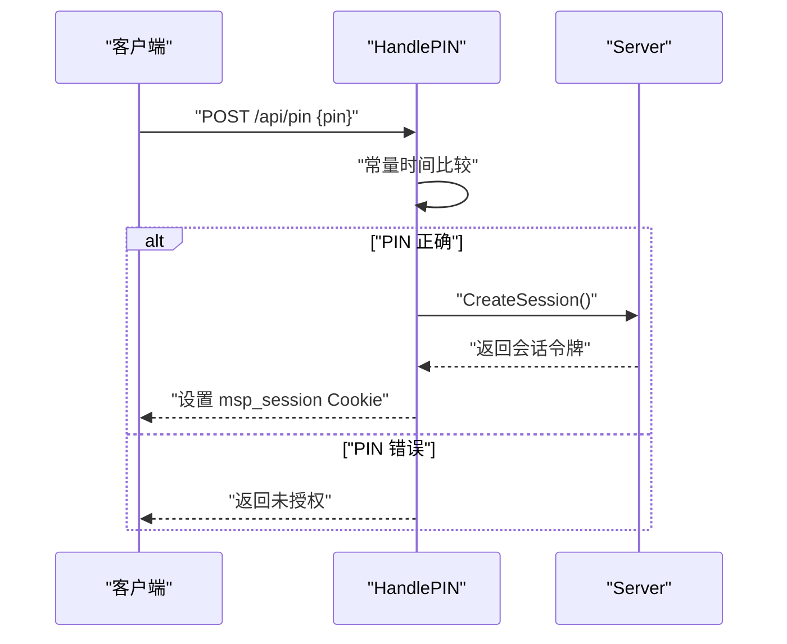
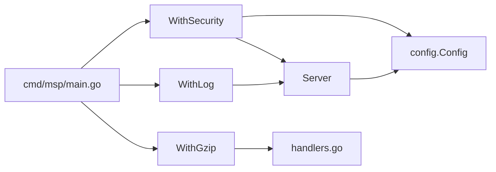

# 中间件系统

<cite>
**本文引用的文件**
- [cmd/msp/main.go](file://cmd/msp/main.go)
- [internal/handler/middleware.go](file://internal/handler/middleware.go)
- [internal/handler/handlers.go](file://internal/handler/handlers.go)
- [internal/server/server.go](file://internal/server/server.go)
- [internal/config/config.go](file://internal/config/config.go)
- [internal/constants/constants.go](file://internal/constants/constants.go)
- [internal/constants/errors.go](file://internal/constants/errors.go)
- [internal/handler/middleware_test.go](file://internal/handler/middleware_test.go)
- [config.example.json](file://config.example.json)
</cite>

## 目录
1. [简介](#简介)
2. [项目结构](#项目结构)
3. [核心组件](#核心组件)
4. [架构总览](#架构总览)
5. [详细组件分析](#详细组件分析)
6. [依赖关系分析](#依赖关系分析)
7. [性能考量](#性能考量)
8. [故障排查指南](#故障排查指南)
9. [结论](#结论)
10. [附录](#附录)

## 简介
本文件系统化阐述 MSP 项目的中间件体系，重点覆盖请求处理链的构建与执行顺序、各中间件的功能与作用（安全验证、日志记录、Gzip 压缩）、注册机制与配置方法，并提供执行流程图与性能优化建议。读者无需深厚的底层背景即可理解中间件如何协作，保障安全、可观测与传输效率。

## 项目结构
中间件系统位于后端入口与业务处理器之间，形成“入口路由 -> 中间件链 -> 业务处理器”的标准 HTTP 处理链。入口在主程序中注册路由并装配中间件；中间件负责安全、日志与压缩；业务处理器负责具体 API 逻辑。

图表来源
- [cmd/msp/main.go](file://cmd/msp/main.go#L58-L107)
- [internal/handler/middleware.go](file://internal/handler/middleware.go#L25-L120)
- [internal/handler/handlers.go](file://internal/handler/handlers.go#L38-L107)

章节来源
- [cmd/msp/main.go](file://cmd/msp/main.go#L58-L107)

## 核心组件
- 安全中间件 WithSecurity：负责 IP 白名单/黑名单过滤与 PIN 会话校验，统一注入安全响应头。
- 日志中间件 WithLog：包装响应写入器，统计状态码与耗时，统一记录请求日志。
- Gzip 中间件 WithGzip：按请求头与路径规则进行条件压缩，避免对流式/大文件的不必要压缩。

章节来源
- [internal/handler/middleware.go](file://internal/handler/middleware.go#L25-L120)

## 架构总览
中间件链在入口处一次性装配，形成固定的执行顺序。请求进入后依次经过安全校验、日志统计、压缩处理，最后到达业务处理器；响应返回时沿相反方向回传，完成日志记录与压缩收尾。

图表来源
- [cmd/msp/main.go](file://cmd/msp/main.go#L65-L74)
- [internal/handler/middleware.go](file://internal/handler/middleware.go#L25-L120)
- [internal/server/server.go](file://internal/server/server.go#L286-L311)

章节来源
- [cmd/msp/main.go](file://cmd/msp/main.go#L65-L74)

## 详细组件分析

### 安全中间件 WithSecurity
- 功能要点
  - 统一注入安全响应头（防嗅探、防点击劫持、XSS 保护、Referrer 策略）。
  - 家庭/局域网模式下仅信任直连远端地址，不信任代理头，降低误判风险。
  - IP 白名单优先于黑名单：若白名单非空且不在其中则拒绝；若命中黑名单则拒绝。
  - PIN 认证：对 API 路径进行 PIN 校验，静态资源与特定端点豁免；支持请求头或 Cookie 传递会话令牌。
- 关键算法
  - IP 列表匹配：支持精确 IP 与 CIDR；CIDR 使用标准库解析。
  - 路径豁免：明确豁免 /api/pin、/api/ip、/api/config 等端点。
  - 会话校验：基于服务端会话表与过期时间，自动清理过期会话。
- 性能与安全权衡
  - 仅在必要路径执行 PIN 校验，避免对静态资源与根路径造成额外开销。
  - 会话存储采用并发安全结构，定期清理过期项。

图表来源
- [internal/handler/middleware.go](file://internal/handler/middleware.go#L78-L120)
- [internal/handler/middleware.go](file://internal/handler/middleware.go#L134-L144)
- [internal/handler/middleware.go](file://internal/handler/middleware.go#L146-L163)
- [internal/handler/middleware.go](file://internal/handler/middleware.go#L165-L187)
- [internal/handler/middleware.go](file://internal/handler/middleware.go#L189-L201)
- [internal/handler/middleware.go](file://internal/handler/middleware.go#L203-L228)
- [internal/server/server.go](file://internal/server/server.go#L572-L615)

章节来源
- [internal/handler/middleware.go](file://internal/handler/middleware.go#L78-L120)
- [internal/handler/middleware.go](file://internal/handler/middleware.go#L134-L144)
- [internal/handler/middleware.go](file://internal/handler/middleware.go#L146-L163)
- [internal/handler/middleware.go](file://internal/handler/middleware.go#L165-L187)
- [internal/handler/middleware.go](file://internal/handler/middleware.go#L189-L201)
- [internal/handler/middleware.go](file://internal/handler/middleware.go#L203-L228)
- [internal/server/server.go](file://internal/server/server.go#L572-L615)

### 日志中间件 WithLog
- 功能要点
  - 包装响应写入器以捕获最终状态码。
  - 记录请求方法、路径、状态码、用户代理与耗时。
  - 根据状态码级别选择日志等级；首次来自新 IP 的设备会单独提示。
- 性能特性
  - 仅在业务处理完成后记录，避免重复写入。
  - 日志轮转按计数周期触发，降低频繁 Stat 的开销。

图表来源
- [internal/handler/middleware.go](file://internal/handler/middleware.go#L45-L75)
- [internal/server/server.go](file://internal/server/server.go#L286-L311)
- [internal/server/server.go](file://internal/server/server.go#L222-L248)
- [internal/server/server.go](file://internal/server/server.go#L250-L284)

章节来源
- [internal/handler/middleware.go](file://internal/handler/middleware.go#L45-L75)
- [internal/server/server.go](file://internal/server/server.go#L286-L311)
- [internal/server/server.go](file://internal/server/server.go#L222-L248)
- [internal/server/server.go](file://internal/server/server.go#L250-L284)

### Gzip 中间件 WithGzip
- 功能要点
  - 仅当请求声明支持 gzip 且路径满足条件时才启用压缩。
  - 对 /api/ 路径进行条件压缩，排除流式/字幕等特殊端点，避免不必要的 CPU 开销。
  - 设置 Vary: Accept-Encoding 并在响应头标记 Content-Encoding: gzip。
- 性能特性
  - 压缩器按需创建与关闭，避免常驻开销。
  - 对大文件与流式传输保持谨慎，优先保证吞吐与兼容性。

图表来源
- [internal/handler/middleware.go](file://internal/handler/middleware.go#L25-L43)

章节来源
- [internal/handler/middleware.go](file://internal/handler/middleware.go#L25-L43)

### 业务处理器与会话管理
- PIN 认证端点：接收客户端提交的 PIN，进行常量时间比较，成功后创建会话令牌并设置 Cookie。
- 会话生命周期：服务端生成随机令牌，设定过期时间，定期清理过期项；支持通过请求头或 Cookie 传递。
- 其他业务处理器：配置、分享、媒体、字幕、探测、进度、偏好、日志等，均在安全与日志中间件之后执行。

图表来源
- [internal/handler/handlers.go](file://internal/handler/handlers.go#L256-L319)
- [internal/server/server.go](file://internal/server/server.go#L572-L590)

章节来源
- [internal/handler/handlers.go](file://internal/handler/handlers.go#L256-L319)
- [internal/server/server.go](file://internal/server/server.go#L572-L590)

## 依赖关系分析
- 入口装配：主程序在注册路由后，将中间件以“洋葱模型”层层包裹，形成固定顺序。
- 中间件耦合：安全中间件依赖服务端配置与会话管理；日志中间件依赖服务端日志接口；Gzip 中间件与业务处理器解耦。
- 配置来源：安全策略与日志级别来自配置文件，支持热重载。

图表来源
- [cmd/msp/main.go](file://cmd/msp/main.go#L58-L107)
- [internal/handler/middleware.go](file://internal/handler/middleware.go#L78-L120)
- [internal/server/server.go](file://internal/server/server.go#L76-L138)
- [internal/config/config.go](file://internal/config/config.go#L56-L88)

章节来源
- [cmd/msp/main.go](file://cmd/msp/main.go#L58-L107)
- [internal/handler/middleware.go](file://internal/handler/middleware.go#L78-L120)
- [internal/server/server.go](file://internal/server/server.go#L76-L138)
- [internal/config/config.go](file://internal/config/config.go#L56-L88)

## 性能考量
- 中间件顺序与开销
  - 安全中间件：IP/CIDR 匹配与会话校验开销低，但对每个请求必经；建议合理配置白/黑名单，避免过大列表。
  - 日志中间件：仅记录状态码与耗时，开销极低。
  - Gzip 中间件：CPU 密集型，建议仅对 JSON/文本类响应启用；对流式/大文件谨慎使用。
- 路径与内容类型策略
  - 仅对 /api/ 路径进行条件压缩，避免对静态资源与流式端点造成额外负担。
  - 对大文件采用短缓存策略，减少不必要的压缩与传输。
- 并发与资源
  - 会话存储采用并发安全结构，定期清理过期项，避免内存膨胀。
  - 日志轮转按计数周期触发，降低频繁 IO。

章节来源
- [internal/handler/middleware.go](file://internal/handler/middleware.go#L25-L43)
- [internal/handler/handlers.go](file://internal/handler/handlers.go#L566-L579)
- [internal/server/server.go](file://internal/server/server.go#L572-L615)
- [internal/server/server.go](file://internal/server/server.go#L250-L284)

## 故障排查指南
- 访问被拒绝（403）
  - 检查 IP 白名单/黑名单配置；确认是否命中黑名单。
  - 若启用 PIN，确认会话令牌是否正确传递（请求头或 Cookie）。
- 未授权（401）
  - 确认 PIN 已启用且输入正确；检查会话是否过期。
- 日志无输出
  - 检查日志级别与文件路径；确认服务端日志初始化成功。
- 压缩异常
  - 确认请求头 Accept-Encoding 包含 gzip；检查路径是否命中压缩条件。

章节来源
- [internal/handler/middleware.go](file://internal/handler/middleware.go#L88-L116)
- [internal/handler/handlers.go](file://internal/handler/handlers.go#L256-L319)
- [internal/server/server.go](file://internal/server/server.go#L190-L220)
- [internal/constants/errors.go](file://internal/constants/errors.go#L53-L57)

## 结论
MSP 的中间件系统采用简洁而高效的洋葱模型，将安全、日志与压缩职责清晰分离。通过合理的路径与内容策略、并发安全的会话管理以及可热重载的配置，系统在保证安全与可观测的同时，兼顾了性能与易用性。建议在生产环境中结合实际流量特征调整中间件顺序与策略，以获得最佳体验。

## 附录

### 中间件注册与配置方法
- 注册机制
  - 在入口处注册路由后，使用中间件函数将处理器包裹，形成固定顺序的处理链。
- 配置方法
  - 安全策略：通过配置文件的 security 字段设置 IP 白名单/黑名单、PIN 开关与 PIN 值。
  - 日志级别：通过 logLevel 控制日志输出级别；logfile 指定日志文件路径。
  - 热重载：服务端监听配置文件变更并自动重载，通常 2 秒内生效。

章节来源
- [cmd/msp/main.go](file://cmd/msp/main.go#L58-L107)
- [internal/config/config.go](file://internal/config/config.go#L56-L88)
- [internal/server/server.go](file://internal/server/server.go#L140-L188)
- [config.example.json](file://config.example.json#L50-L56)