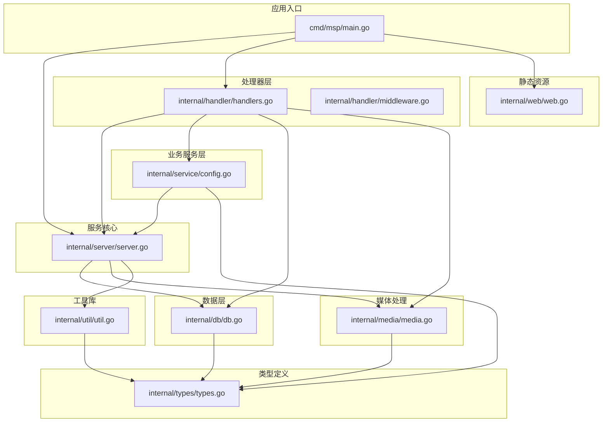
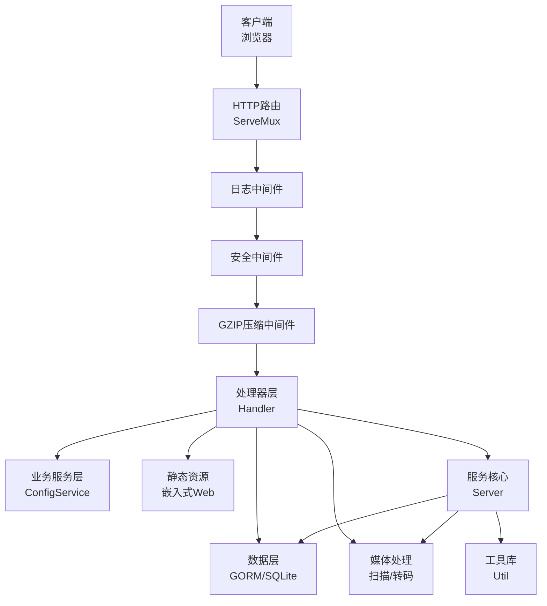
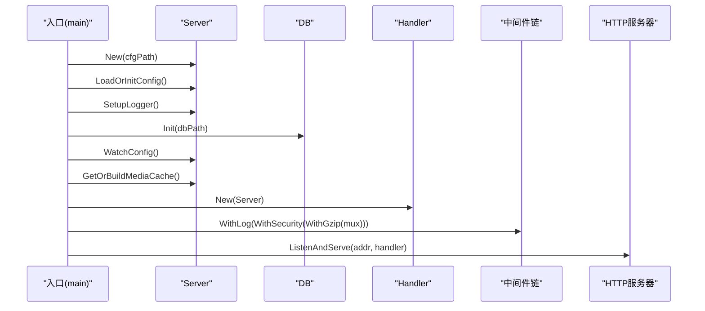
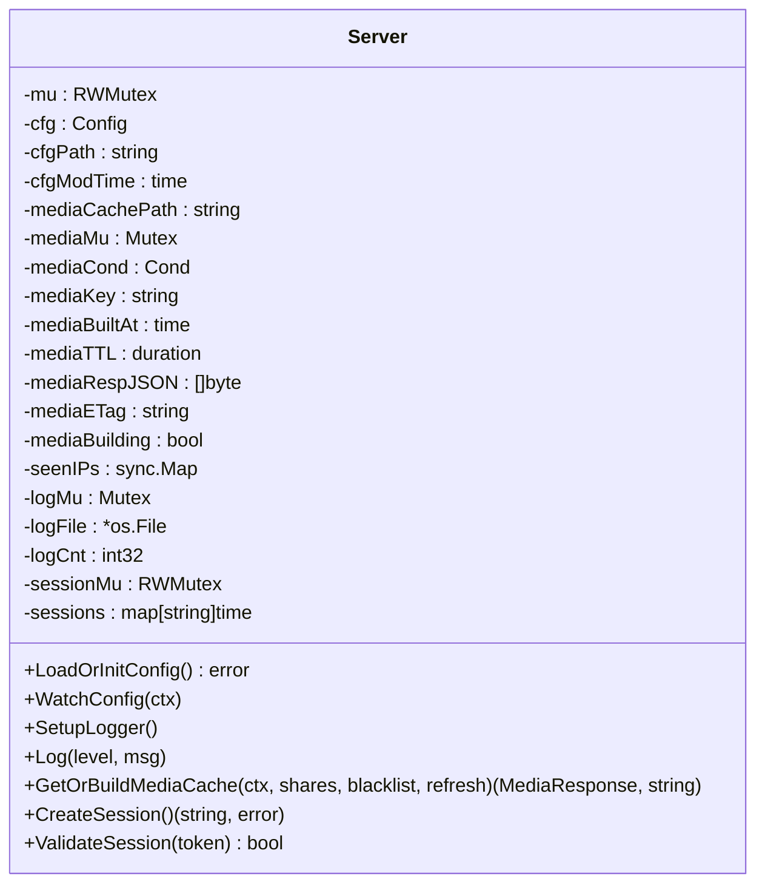
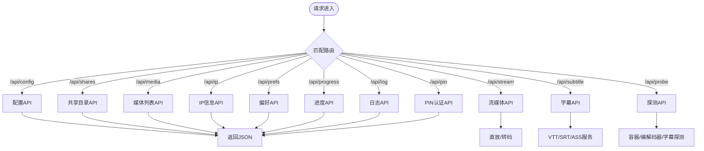
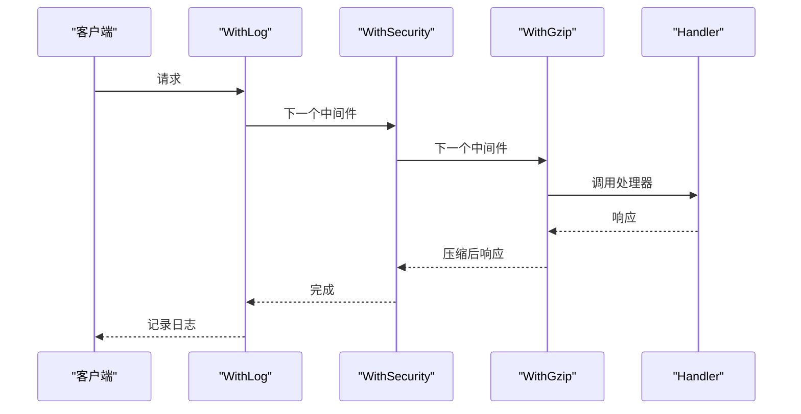
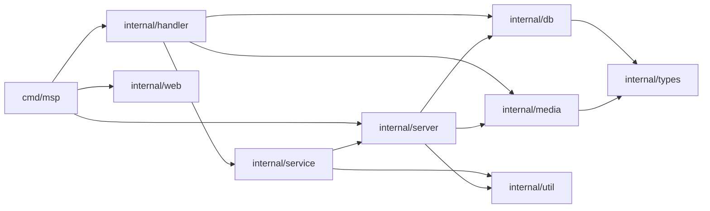

# 整体架构设计

<cite>
**本文档引用的文件**
- [cmd/msp/main.go](file://cmd/msp/main.go)
- [internal/server/server.go](file://internal/server/server.go)
- [internal/handler/handlers.go](file://internal/handler/handlers.go)
- [internal/handler/middleware.go](file://internal/handler/middleware.go)
- [internal/db/db.go](file://internal/db/db.go)
- [internal/config/config.go](file://internal/config/config.go)
- [internal/service/config.go](file://internal/service/config.go)
- [internal/media/media.go](file://internal/media/media.go)
- [internal/types/types.go](file://internal/types/types.go)
- [internal/util/util.go](file://internal/util/util.go)
- [internal/web/web.go](file://internal/web/web.go)
- [go.mod](file://go.mod)
- [README.md](file://README.md)
</cite>

## 目录
1. [简介](#简介)
2. [项目结构](#项目结构)
3. [核心组件](#核心组件)
4. [架构总览](#架构总览)
5. [详细组件分析](#详细组件分析)
6. [依赖关系分析](#依赖关系分析)
7. [性能考量](#性能考量)
8. [故障排查指南](#故障排查指南)
9. [结论](#结论)

## 简介
本项目是一个面向家庭局域网的轻量级媒体服务器，采用单二进制部署，支持浏览器端直接播放本地共享目录中的音视频内容。系统遵循分层架构设计，包含表现层、控制层、业务层与数据层，通过中间件系统实现统一的安全与日志处理，并通过SQLite数据库持久化用户偏好与播放进度等状态数据。

## 项目结构
项目采用Go模块化组织方式，主要目录与职责如下：
- cmd/msp：应用入口，负责初始化配置、数据库、路由注册与HTTP服务器启动
- internal/server：服务核心，负责配置管理、日志、媒体缓存、会话管理等
- internal/handler：HTTP处理器层，负责API路由与业务逻辑协调
- internal/service：业务服务层，封装配置视图与安全策略
- internal/db：数据库层，基于GORM与SQLite实现
- internal/media：媒体扫描与转码相关能力
- internal/types：领域模型与API响应结构
- internal/util：通用工具函数（路径、校验、网络等）
- internal/web：嵌入式静态资源服务
- web：前端打包产物（dist目录），通过embed集成到二进制



**图表来源**
- [cmd/msp/main.go](file://cmd/msp/main.go#L26-L83)
- [internal/server/server.go](file://internal/server/server.go#L31-L74)
- [internal/handler/handlers.go](file://internal/handler/handlers.go#L28-L43)
- [internal/handler/middleware.go](file://internal/handler/middleware.go#L25-L43)
- [internal/db/db.go](file://internal/db/db.go#L32-L72)
- [internal/media/media.go](file://internal/media/media.go#L12-L52)
- [internal/types/types.go](file://internal/types/types.go#L16-L66)
- [internal/util/util.go](file://internal/util/util.go#L18-L50)
- [internal/web/web.go](file://internal/web/web.go#L14-L32)

**章节来源**
- [cmd/msp/main.go](file://cmd/msp/main.go#L26-L83)
- [go.mod](file://go.mod#L1-L31)

## 核心组件
- 应用入口与HTTP服务器
  - 初始化配置、数据库、日志、媒体缓存预热
  - 注册路由并启动HTTP服务器，启用中间件链
- 服务核心（Server）
  - 配置加载与热重载、日志轮转、媒体缓存（内存+磁盘）、会话管理
- 处理器层（Handler）
  - API路由与业务逻辑协调，包含配置、媒体、流媒体、字幕、进度、日志、PIN认证等
- 中间件系统
  - 日志记录、安全头、IP白黑名单、PIN会话校验、GZIP压缩
- 数据层（DB）
  - 基于GORM/SQLite的Schema迁移与CRUD，支持播放进度、用户偏好、扫描元数据
- 业务服务层（ConfigService）
  - 配置视图生成（隐藏敏感信息）、安全配置视图、FFmpeg可用性检测
- 媒体处理（Media）
  - 共享目录扫描、媒体分类、ETag生成、缓存键计算
- 类型定义（Types）
  - 媒体项、扫描元数据、用户偏好、播放进度、API响应结构
- 工具库（Util）
  - 路径规范化、ID编解码、IP合法性、权限校验、网络接口枚举
- 静态资源（Web）
  - 嵌入式前端资源服务，支持缓存策略与MIME类型推断

**章节来源**
- [internal/server/server.go](file://internal/server/server.go#L31-L74)
- [internal/handler/handlers.go](file://internal/handler/handlers.go#L28-L43)
- [internal/handler/middleware.go](file://internal/handler/middleware.go#L25-L43)
- [internal/db/db.go](file://internal/db/db.go#L32-L72)
- [internal/service/config.go](file://internal/service/config.go#L12-L18)
- [internal/media/media.go](file://internal/media/media.go#L12-L52)
- [internal/types/types.go](file://internal/types/types.go#L16-L66)
- [internal/util/util.go](file://internal/util/util.go#L18-L50)
- [internal/web/web.go](file://internal/web/web.go#L14-L32)

## 架构总览
系统采用经典的分层架构：
- 表现层：嵌入式Web资源与静态文件服务
- 控制层：HTTP路由与中间件链
- 业务层：处理器与服务层协调业务规则
- 数据层：SQLite数据库与GORM抽象



**图表来源**
- [cmd/msp/main.go](file://cmd/msp/main.go#L58-L107)
- [internal/handler/middleware.go](file://internal/handler/middleware.go#L25-L43)
- [internal/handler/handlers.go](file://internal/handler/handlers.go#L28-L43)
- [internal/server/server.go](file://internal/server/server.go#L31-L74)
- [internal/db/db.go](file://internal/db/db.go#L32-L72)
- [internal/media/media.go](file://internal/media/media.go#L12-L52)
- [internal/web/web.go](file://internal/web/web.go#L14-L32)

## 详细组件分析

### 应用入口与HTTP服务器
- 初始化顺序
  - 设置GC参数、日志格式
  - 加载或初始化配置，设置日志文件
  - 初始化数据库（SQLite），关闭时释放连接
  - 启动配置文件监控与媒体缓存预热
  - 注册路由并组装中间件链（日志、安全、GZIP）
  - 启动HTTP服务器，自动打开浏览器
- 关键点
  - 配置热重载：后台定时检查配置文件修改并自动重载
  - 媒体缓存：内存+磁盘双层缓存，弱ETag支持条件请求
  - 中间件链：WithLog -> WithSecurity -> WithGzip，保证日志、安全与传输优化



**图表来源**
- [cmd/msp/main.go](file://cmd/msp/main.go#L26-L83)
- [internal/server/server.go](file://internal/server/server.go#L76-L112)
- [internal/db/db.go](file://internal/db/db.go#L32-L72)
- [internal/handler/handlers.go](file://internal/handler/handlers.go#L38-L43)
- [internal/handler/middleware.go](file://internal/handler/middleware.go#L25-L43)

**章节来源**
- [cmd/msp/main.go](file://cmd/msp/main.go#L26-L83)

### 服务核心（Server）
- 职责
  - 配置管理：加载/保存、默认值填充、热重载
  - 日志管理：级别过滤、轮转、新设备告警
  - 媒体缓存：内存缓存（JSON序列化）、磁盘缓存、ETag、并发重建
  - 会话管理：PIN认证令牌生成与校验、过期清理
- 设计要点
  - 读写锁保护配置与日志
  - 条件变量用于媒体缓存重建通知
  - 弱ETag基于缓存键与构建时间生成，支持条件请求



**图表来源**
- [internal/server/server.go](file://internal/server/server.go#L31-L74)

**章节来源**
- [internal/server/server.go](file://internal/server/server.go#L31-L74)

### 处理器层（Handler）
- 职责
  - API路由：配置、共享目录、媒体列表、流媒体、字幕、探测、IP、偏好、进度、日志、PIN
  - 业务协调：调用服务层与数据层，处理输入校验与错误响应
  - 流媒体：直播放、转码回退、范围请求、缓存控制
  - 字幕：VTT/SRT/ASS转换与服务
- 设计要点
  - JSON负载限制、超大请求处理
  - 条件请求与ETag配合
  - 转码策略与FFmpeg可用性检测



**图表来源**
- [internal/handler/handlers.go](file://internal/handler/handlers.go#L45-L104)
- [internal/handler/handlers.go](file://internal/handler/handlers.go#L333-L362)
- [internal/handler/handlers.go](file://internal/handler/handlers.go#L413-L446)
- [internal/handler/handlers.go](file://internal/handler/handlers.go#L623-L646)

**章节来源**
- [internal/handler/handlers.go](file://internal/handler/handlers.go#L28-L43)

### 中间件系统
- WithLog：记录请求耗时、状态码、UA，按级别输出
- WithSecurity：安全头、IP白名单/黑名单、PIN会话校验
- WithGzip：仅对API非流媒体响应启用GZIP压缩，设置Vary头



**图表来源**
- [internal/handler/middleware.go](file://internal/handler/middleware.go#L45-L52)
- [internal/handler/middleware.go](file://internal/handler/middleware.go#L77-L120)
- [internal/handler/middleware.go](file://internal/handler/middleware.go#L25-L43)

**章节来源**
- [internal/handler/middleware.go](file://internal/handler/middleware.go#L25-L43)

### 数据层（DB）
- 初始化
  - 创建SQLite连接，设置连接池与PRAGMA优化
  - 自动迁移Schema：媒体项、扫描元数据、用户偏好、播放进度
- 查询与写入
  - 播放进度：按媒体ID查询/写入，冲突更新
  - 用户偏好：批量写入，冲突更新
  - 扫描元数据：按缓存键查询/写入
  - 媒体项：按扫描ID与类型查询、统计、批量Upsert

```mermaid
erDiagram
MEDIA_ITEM {
string id PK
string path UK
string name
string ext
string kind IDX
string share_label IDX
int64 size
int64 mod_time
json subtitles
string audio_cover
string audio_lyrics
int64 scan_id IDX
string share_root
datetime created_at
datetime updated_at
}
MEDIA_SCAN {
string cache_key PK
int64 scan_id
int64 built_at
bool complete
datetime updated_at
}
USER_PREF {
string key PK
string value
datetime updated_at
}
PLAYBACK_PROGRESS {
string media_id PK
float time
datetime updated_at
}
```

**图表来源**
- [internal/types/types.go](file://internal/types/types.go#L16-L52)
- [internal/db/db.go](file://internal/db/db.go#L74-L99)
- [internal/db/db.go](file://internal/db/db.go#L117-L142)
- [internal/db/db.go](file://internal/db/db.go#L227-L259)

**章节来源**
- [internal/db/db.go](file://internal/db/db.go#L32-L72)

### 业务服务层（ConfigService）
- 职责
  - 生成前端可见的配置视图（隐藏PIN等敏感信息）
  - 校验与规范化共享目录，去重与标签补全
  - 更新配置并触发媒体缓存失效
  - 检测FFmpeg/FFprobe可用性
- 设计要点
  - 安全视图：仅暴露必要配置字段
  - 与Server协作更新配置并触发缓存失效

**章节来源**
- [internal/service/config.go](file://internal/service/config.go#L12-L18)
- [internal/service/config.go](file://internal/service/config.go#L73-L90)
- [internal/service/config.go](file://internal/service/config.go#L92-L122)

### 媒体处理（Media）
- 职责
  - 构建媒体响应：扫描共享目录，按类型分类，排序
  - 缓存键与ETag：基于共享目录与黑名单规则生成
  - 扫描与索引：增量扫描、清理过期数据
- 设计要点
  - 回调式扫描，便于扩展
  - 内存中存储JSON字节，减少序列化开销

**章节来源**
- [internal/media/media.go](file://internal/media/media.go#L12-L52)
- [internal/server/server.go](file://internal/server/server.go#L443-L465)
- [internal/server/server.go](file://internal/server/server.go#L556-L568)

### 类型定义（Types）
- 定义了媒体项、扫描元数据、用户偏好、播放进度、API响应等核心数据结构
- 为各层提供稳定的契约与序列化支持

**章节来源**
- [internal/types/types.go](file://internal/types/types.go#L16-L66)

### 工具库（Util）
- 路径与ID：规范化、编码/解码、去重、同路径判断
- 文件与目录：合法性检查、符号链接解析、目录遍历防护
- 网络：IPv4枚举、私有地址判断、端口工具
- 设计要点
  - 安全优先：符号链接解析、目录遍历防护
  - 平台兼容：Windows大小写不敏感比较

**章节来源**
- [internal/util/util.go](file://internal/util/util.go#L18-L50)
- [internal/util/util.go](file://internal/util/util.go#L148-L182)
- [internal/util/util.go](file://internal/util/util.go#L218-L256)

### 静态资源（Web）
- 嵌入式前端资源服务，支持缓存策略与MIME类型推断
- 防止API路径误访问，确保静态资源安全

**章节来源**
- [internal/web/web.go](file://internal/web/web.go#L14-L32)

## 依赖关系分析
- 模块化设计
  - cmd/msp依赖internal/server、internal/handler、internal/db、internal/web
  - internal/handler依赖internal/server、internal/service、internal/db、internal/media
  - internal/service依赖internal/server、internal/util
  - internal/db依赖internal/types
  - internal/media依赖internal/config、internal/types
  - internal/util与各层松耦合
- 外部依赖
  - GORM/SQLite：ORM与数据库驱动
  - testify：测试辅助



**图表来源**
- [cmd/msp/main.go](file://cmd/msp/main.go#L18-L24)
- [internal/handler/handlers.go](file://internal/handler/handlers.go#L18-L26)
- [internal/service/config.go](file://internal/service/config.go#L3-L10)
- [internal/db/db.go](file://internal/db/db.go#L3-L16)
- [go.mod](file://go.mod#L5-L9)

**章节来源**
- [go.mod](file://go.mod#L1-L31)

## 性能考量
- 并发与缓存
  - 媒体缓存：内存JSON缓存+磁盘缓存，弱ETag支持条件请求；重建过程异步进行，避免阻塞请求
  - 读写锁保护配置与日志，降低锁竞争
- 数据库优化
  - 单连接池（SQLite建议），启用WAL、NORMAL同步、缓存大小调整
  - 预编译语句、无默认事务，手动控制事务提升写入性能
- 网络与传输
  - GZIP压缩仅对API非流媒体响应启用，避免影响流媒体传输
  - 直放优先、转码回退策略，减少不必要的转码开销
- 资源服务
  - 嵌入式静态资源，减少外部文件系统依赖
  - 针对不同扩展名设置合适的Cache-Control策略

[本节为通用性能讨论，无需特定文件引用]

## 故障排查指南
- 配置热重载失败
  - 检查配置文件权限与路径，确认修改时间更新
  - 查看日志级别与日志文件路径
- 媒体缓存异常
  - 清理缓存文件与内存缓存，触发重建
  - 检查共享目录权限与黑名单规则
- 数据库问题
  - 确认SQLite文件权限与磁盘空间
  - 查看GORM慢查询日志与错误日志
- 流媒体播放失败
  - 检查转码策略与FFmpeg可用性
  - 查看直放与转码回退日志
- 安全访问受限
  - 校验IP白名单/黑名单与代理信任设置
  - 确认PIN会话有效性与Cookie设置

**章节来源**
- [internal/server/server.go](file://internal/server/server.go#L140-L188)
- [internal/handler/middleware.go](file://internal/handler/middleware.go#L77-L120)
- [internal/db/db.go](file://internal/db/db.go#L32-L72)

## 结论
本项目通过清晰的分层架构与模块化设计，实现了从配置管理、安全控制、媒体处理到数据持久化的完整闭环。入口与HTTP服务器负责生命周期管理与中间件装配，服务核心提供配置、日志、缓存与会话管理，处理器层协调业务逻辑，数据层以SQLite与GORM提供高效的数据持久化。整体设计兼顾易用性与安全性，适合家庭局域网场景的媒体分享与播放需求。