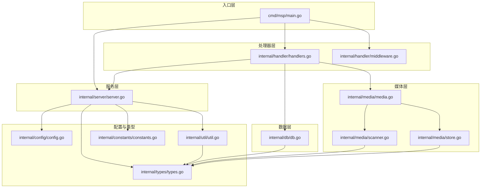
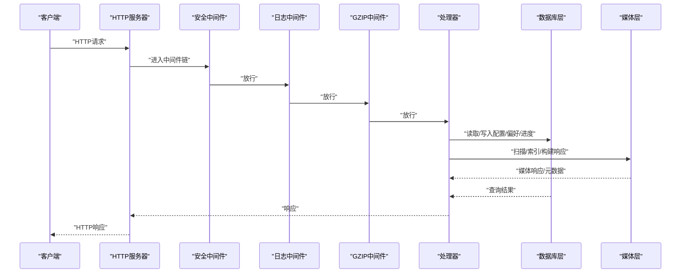
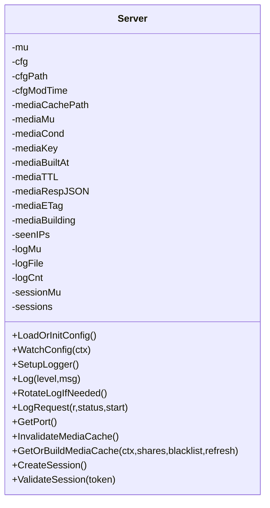
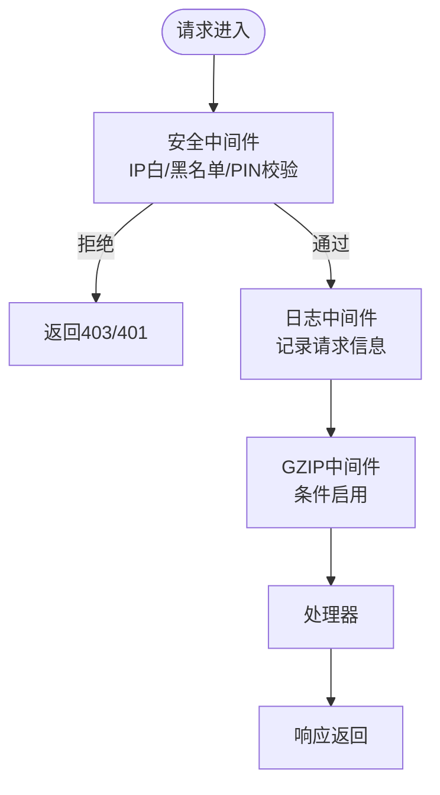
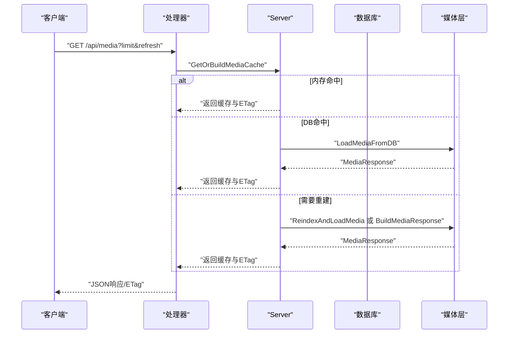
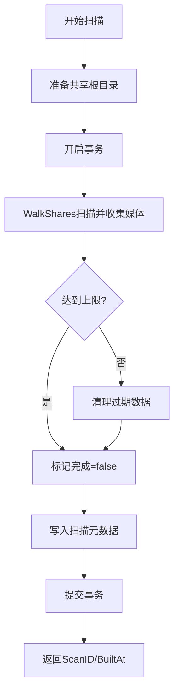
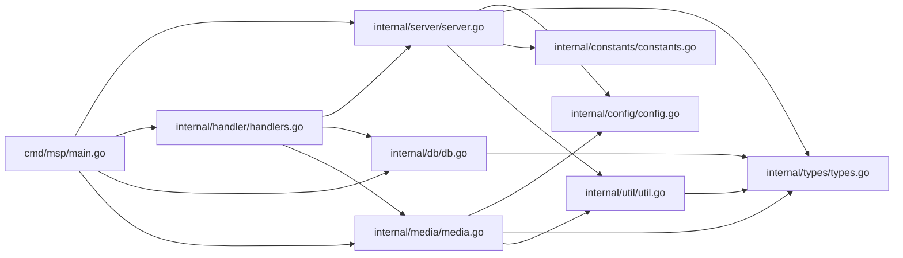

# 核心架构

<cite>
**本文引用的文件**
- [cmd/msp/main.go](file://cmd/msp/main.go)
- [internal/server/server.go](file://internal/server/server.go)
- [internal/handler/handlers.go](file://internal/handler/handlers.go)
- [internal/handler/middleware.go](file://internal/handler/middleware.go)
- [internal/db/db.go](file://internal/db/db.go)
- [internal/media/media.go](file://internal/media/media.go)
- [internal/media/scanner.go](file://internal/media/scanner.go)
- [internal/media/store.go](file://internal/media/store.go)
- [internal/config/config.go](file://internal/config/config.go)
- [internal/types/types.go](file://internal/types/types.go)
- [internal/constants/constants.go](file://internal/constants/constants.go)
- [internal/util/util.go](file://internal/util/util.go)
- [go.mod](file://go.mod)
</cite>

## 目录
1. [简介](#简介)
2. [项目结构](#项目结构)
3. [核心组件](#核心组件)
4. [架构总览](#架构总览)
5. [详细组件分析](#详细组件分析)
6. [依赖关系分析](#依赖关系分析)
7. [性能考量](#性能考量)
8. [故障排查指南](#故障排查指南)
9. [结论](#结论)

## 简介
本文件面向MSP项目的开发者与运维人员，系统性阐述其核心架构设计与实现要点。MSP是一个基于Go语言开发的媒体服务，提供媒体扫描、缓存、流式播放、字幕处理、用户偏好与播放进度持久化等功能。本文重点覆盖：
- 分层架构与模块化设计
- 中间件系统（安全、日志、压缩）
- 缓存策略（内存/磁盘/ETag）
- 错误处理与异常恢复
- 数据库层与媒体扫描/索引流程
- 组件交互关系与关键流程图

## 项目结构
MSP采用清晰的分层与模块化组织：
- 入口层：cmd/msp/main.go 启动HTTP服务器、注册路由、装配中间件
- 服务层：internal/server 提供配置、日志、媒体缓存、会话管理等核心能力
- 处理器层：internal/handler 提供REST API处理器与中间件
- 数据层：internal/db 基于GORM/SQLite的数据库访问
- 媒体层：internal/media 媒体扫描、索引、响应构建、转码与字幕处理
- 配置与类型：internal/config、internal/types
- 工具与常量：internal/util、internal/constants



图表来源
- [cmd/msp/main.go](file://cmd/msp/main.go#L26-L83)
- [internal/server/server.go](file://internal/server/server.go#L31-L74)
- [internal/handler/handlers.go](file://internal/handler/handlers.go#L28-L43)
- [internal/handler/middleware.go](file://internal/handler/middleware.go#L25-L43)
- [internal/db/db.go](file://internal/db/db.go#L32-L72)
- [internal/media/media.go](file://internal/media/media.go#L12-L52)
- [internal/media/scanner.go](file://internal/media/scanner.go#L25-L57)
- [internal/media/store.go](file://internal/media/store.go#L17-L47)
- [internal/config/config.go](file://internal/config/config.go#L77-L88)
- [internal/types/types.go](file://internal/types/types.go#L16-L66)
- [internal/constants/constants.go](file://internal/constants/constants.go#L7-L50)
- [internal/util/util.go](file://internal/util/util.go#L18-L50)

章节来源
- [cmd/msp/main.go](file://cmd/msp/main.go#L26-L83)
- [go.mod](file://go.mod#L1-L31)

## 核心组件
- HTTP服务器与路由
  - 在入口处创建http.Server，注册静态资源与API路由，装配中间件链
- 服务器核心（Server）
  - 配置管理与热重载、日志系统与轮转、媒体缓存（内存+磁盘）、会话管理（PIN）
- 处理器层（Handler）
  - API处理器：配置、分享目录、媒体列表、流式播放、字幕、探测、进度、日志、PIN
  - 中间件：安全（IP白/黑名单、PIN会话）、日志、GZIP压缩
- 数据库层（db）
  - GORM+SQLite，提供播放进度、用户偏好、媒体扫描元数据、媒体条目等CRUD
- 媒体层（media）
  - 扫描共享目录、构建响应、索引到数据库、ETag生成、转码、字幕转换
- 工具与常量
  - 路径/ID编码解码、去重、合法性校验、尺寸解析、常量定义

章节来源
- [cmd/msp/main.go](file://cmd/msp/main.go#L58-L107)
- [internal/server/server.go](file://internal/server/server.go#L31-L74)
- [internal/handler/handlers.go](file://internal/handler/handlers.go#L28-L43)
- [internal/handler/middleware.go](file://internal/handler/middleware.go#L77-L120)
- [internal/db/db.go](file://internal/db/db.go#L32-L72)
- [internal/media/media.go](file://internal/media/media.go#L12-L52)
- [internal/media/store.go](file://internal/media/store.go#L17-L47)
- [internal/util/util.go](file://internal/util/util.go#L18-L50)
- [internal/constants/constants.go](file://internal/constants/constants.go#L7-L50)

## 架构总览
MSP采用“入口层-服务层-处理器层-数据层-媒体层”的分层架构，配合中间件系统形成清晰的请求处理链路。核心流程如下：
- 请求进入HTTP服务器，按顺序经过安全中间件、日志中间件、GZIP中间件
- 路由分发至对应处理器，处理器读取配置、访问数据库或媒体层
- 媒体层负责扫描/索引与响应构建，结合内存缓存与ETag进行缓存控制
- 数据库层提供持久化能力，支持播放进度、用户偏好与扫描元数据



图表来源
- [cmd/msp/main.go](file://cmd/msp/main.go#L65-L74)
- [internal/handler/middleware.go](file://internal/handler/middleware.go#L77-L120)
- [internal/handler/handlers.go](file://internal/handler/handlers.go#L45-L66)
- [internal/db/db.go](file://internal/db/db.go#L74-L99)
- [internal/media/media.go](file://internal/media/media.go#L12-L52)

## 详细组件分析

### HTTP服务器与路由
- 创建http.Server，设置超时参数；注册静态首页与API路由
- 路由映射：/api/config、/api/shares、/api/media、/api/stream、/api/subtitle、/api/probe、/api/ip、/api/prefs、/api/progress、/api/log、/api/pin
- 中间件装配顺序：WithLog -> WithSecurity -> WithGzip

章节来源
- [cmd/msp/main.go](file://cmd/msp/main.go#L65-L107)

### 服务器核心（Server）
- 配置管理
  - 加载/初始化配置、热重载监听、保存配置（原子写tmp再rename）
- 日志系统
  - 可配置日志级别与文件路径，支持周期性轮转
- 媒体缓存
  - 内存缓存（JSON序列化以节省内存）、ETag弱标签、TTL失效与重建
  - 支持磁盘缓存（无DB时）与DB缓存（有DB时）
- 会话管理（PIN）
  - 会话令牌生成、存储与过期清理



图表来源
- [internal/server/server.go](file://internal/server/server.go#L31-L74)

章节来源
- [internal/server/server.go](file://internal/server/server.go#L76-L188)
- [internal/server/server.go](file://internal/server/server.go#L190-L284)
- [internal/server/server.go](file://internal/server/server.go#L332-L441)
- [internal/server/server.go](file://internal/server/server.go#L570-L626)

### 中间件系统
- 安全中间件（WithSecurity）
  - 设置安全响应头（X-Content-Type-Options、X-Frame-Options、X-XSS-Protection、Referrer-Policy）
  - IP白/黑名单校验（支持CIDR），Home/LAN模式仅信任直连RemoteAddr
  - PIN认证：对API路径进行会话校验，支持X-Session-Token或Cookie
- 日志中间件（WithLog）
  - 记录请求方法、路径、状态码、User-Agent、耗时；统计新设备访问
- GZIP中间件（WithGzip）
  - 对/api/路径启用（排除/stream与/subtitle），设置Vary与Content-Encoding



图表来源
- [internal/handler/middleware.go](file://internal/handler/middleware.go#L77-L120)
- [internal/handler/middleware.go](file://internal/handler/middleware.go#L45-L52)
- [internal/handler/middleware.go](file://internal/handler/middleware.go#L25-L43)

章节来源
- [internal/handler/middleware.go](file://internal/handler/middleware.go#L77-L120)
- [internal/handler/middleware.go](file://internal/handler/middleware.go#L122-L132)
- [internal/handler/middleware.go](file://internal/handler/middleware.go#L134-L144)
- [internal/handler/middleware.go](file://internal/handler/middleware.go#L146-L163)
- [internal/handler/middleware.go](file://internal/handler/middleware.go#L165-L187)
- [internal/handler/middleware.go](file://internal/handler/middleware.go#L189-L201)
- [internal/handler/middleware.go](file://internal/handler/middleware.go#L203-L228)

### 处理器层（API）
- 配置与分享目录
  - HandleConfig：GET/POST配置视图与更新
  - HandleShares：添加/移除分享目录，触发媒体缓存失效
- 媒体与播放
  - HandleMedia：构建/获取媒体列表，支持limit与ETag
  - HandleStream：解析目标、转码策略、直接播放或转码流
  - HandleSubtitle：VTT/SRT/ASS字幕服务，SRT/ASS转VTT
  - HandleProbe：容器与音视频/字幕探测
- 用户偏好与进度
  - HandlePrefs：读取/保存用户偏好
  - HandleProgress：读取/保存播放进度
- 日志与PIN
  - HandleLog：远程写日志
  - HandlePIN：PIN校验并发放会话Cookie



图表来源
- [internal/handler/handlers.go](file://internal/handler/handlers.go#L333-L362)
- [internal/server/server.go](file://internal/server/server.go#L332-L396)
- [internal/media/store.go](file://internal/media/store.go#L17-L47)

章节来源
- [internal/handler/handlers.go](file://internal/handler/handlers.go#L45-L94)
- [internal/handler/handlers.go](file://internal/handler/handlers.go#L161-L190)
- [internal/handler/handlers.go](file://internal/handler/handlers.go#L192-L233)
- [internal/handler/handlers.go](file://internal/handler/handlers.go#L235-L253)
- [internal/handler/handlers.go](file://internal/handler/handlers.go#L255-L319)
- [internal/handler/handlers.go](file://internal/handler/handlers.go#L333-L411)
- [internal/handler/handlers.go](file://internal/handler/handlers.go#L413-L580)
- [internal/handler/handlers.go](file://internal/handler/handlers.go#L623-L684)

### 数据库层（db）
- 初始化与连接池优化：WAL、同步模式、缓存预编译语句
- 主要实体：MediaItem、MediaScan、UserPref、PlaybackProgress
- 关键操作：播放进度读写、用户偏好读写、扫描元数据与媒体条目CRUD

```mermaid
erDiagram
    MEDIA_ITEM {
        string id PK
        string path UK
        string name
        string ext
        string kind IDX
        string share_label IDX
        int64 size
        int64 mod_time
        json subtitles
        string audio_cover
        string audio_lyrics
        int64 scan_id IDX
        string share_root
        datetime created_at
        datetime updated_at
    }
    MEDIA_SCAN {
        string cache_key PK
        int64 scan_id
        int64 built_at
        bool complete
        datetime updated_at
    }
    USER_PREF {
        string key PK
        string value
        datetime updated_at
    }
    PLAYBACK_PROGRESS {
        string media_id PK
        float time
        datetime updated_at
    }
    MEDIA_ITEM ||--o{ MEDIA_SCAN : "scan_id"
    MEDIA_ITEM ||--o{ USER_PREF : "key"
    MEDIA_ITEM ||--o{ PLAYBACK_PROGRESS : "media_id"
```

图表来源
- [internal/types/types.go](file://internal/types/types.go#L16-L66)
- [internal/db/db.go](file://internal/db/db.go#L32-L72)

章节来源
- [internal/db/db.go](file://internal/db/db.go#L32-L72)
- [internal/db/db.go](file://internal/db/db.go#L74-L99)
- [internal/db/db.go](file://internal/db/db.go#L116-L142)
- [internal/db/db.go](file://internal/db/db.go#L144-L172)
- [internal/db/db.go](file://internal/db/db.go#L174-L199)
- [internal/db/db.go](file://internal/db/db.go#L201-L224)
- [internal/db/db.go](file://internal/db/db.go#L226-L259)

### 媒体层（扫描/索引/响应）
- 响应构建：WalkShares递归扫描，按类型分类，排序
- 索引到DB：事务内批量写入，清理过期数据，记录扫描元数据
- ETag生成：基于cacheKey与builtAt的弱ETag
- 转码与字幕：根据配置决定是否转码，SRT/ASS转VTT



图表来源
- [internal/media/store.go](file://internal/media/store.go#L49-L94)
- [internal/media/scanner.go](file://internal/media/scanner.go#L25-L57)

章节来源
- [internal/media/media.go](file://internal/media/media.go#L12-L52)
- [internal/media/store.go](file://internal/media/store.go#L17-L47)
- [internal/media/store.go](file://internal/media/store.go#L49-L94)
- [internal/media/store.go](file://internal/media/store.go#L154-L162)
- [internal/media/scanner.go](file://internal/media/scanner.go#L25-L57)
- [internal/media/scanner.go](file://internal/media/scanner.go#L181-L200)

### 缓存策略
- 内存缓存
  - JSON序列化响应，减少内存占用；TTL到期后异步重建
  - 并发安全：互斥锁保护，条件变量通知等待者
- 磁盘缓存
  - 无DB时持久化媒体缓存到磁盘，启动时尝试加载
- ETag缓存
  - 弱ETag基于cacheKey与builtAt哈希，支持If-None-Match短路
- 媒体列表接口
  - 支持limit裁剪；未裁剪时设置Cache-Control；ETag短路

章节来源
- [internal/server/server.go](file://internal/server/server.go#L332-L441)
- [internal/server/server.go](file://internal/server/server.go#L487-L536)
- [internal/server/server.go](file://internal/server/server.go#L556-L568)
- [internal/handler/handlers.go](file://internal/handler/handlers.go#L333-L411)

### 错误处理与异常恢复
- 中间件链中统一记录请求日志与状态
- JSON请求体限制与错误响应
- 数据库操作静默日志与降噪
- 媒体扫描上下文取消支持
- 会话过期自动清理

章节来源
- [internal/handler/middleware.go](file://internal/handler/middleware.go#L45-L52)
- [internal/handler/handlers.go](file://internal/handler/handlers.go#L699-L720)
- [internal/db/db.go](file://internal/db/db.go#L80-L85)
- [internal/media/scanner.go](file://internal/media/scanner.go#L74-L79)
- [internal/server/server.go](file://internal/server/server.go#L617-L626)

## 依赖关系分析
- 外部依赖
  - GORM/SQLite：ORM与数据库驱动
  - testify：测试断言
- 内部模块耦合
  - main依赖server、handler、db、util、webassets
  - handler依赖server、db、media、config、types、util
  - server依赖config、constants、db、media、types、util
  - media依赖config、types、util、constants
  - db依赖types、constants



图表来源
- [go.mod](file://go.mod#L5-L9)
- [cmd/msp/main.go](file://cmd/msp/main.go#L18-L23)
- [internal/handler/handlers.go](file://internal/handler/handlers.go#L3-L26)
- [internal/server/server.go](file://internal/server/server.go#L3-L29)
- [internal/media/media.go](file://internal/media/media.go#L3-L10)
- [internal/db/db.go](file://internal/db/db.go#L3-L16)
- [internal/util/util.go](file://internal/util/util.go#L3-L16)

章节来源
- [go.mod](file://go.mod#L1-L31)
- [cmd/msp/main.go](file://cmd/msp/main.go#L18-L23)

## 性能考量
- 数据库连接池与WAL模式：单连接、WAL、NORMAL同步、缓存预编译语句
- 批量写入：媒体索引使用批量upsert，降低事务开销
- 媒体缓存：内存JSON序列化、弱ETag、TTL与并发重建
- 压缩：仅对JSON API启用GZIP，避免大文件二次压缩
- 扫描限制：默认扫描上限，避免长时间阻塞

章节来源
- [internal/db/db.go](file://internal/db/db.go#L54-L72)
- [internal/media/store.go](file://internal/media/store.go#L118-L151)
- [internal/handler/middleware.go](file://internal/handler/middleware.go#L25-L43)
- [internal/server/server.go](file://internal/server/server.go#L332-L396)

## 故障排查指南
- 配置热重载
  - 检查配置文件修改时间变更，确认已重新加载
- 日志定位
  - 查看日志级别与轮转策略，关注新设备访问提示
- 媒体缓存
  - 使用?refresh=1强制重建；检查ETag是否变化；确认TTL与并发重建逻辑
- 数据库问题
  - WAL与同步模式设置；检查扫描元数据与媒体条目一致性
- 安全与会话
  - IP白/黑名单匹配；PIN会话是否过期；Cookie是否正确下发

章节来源
- [internal/server/server.go](file://internal/server/server.go#L140-L188)
- [internal/server/server.go](file://internal/server/server.go#L190-L284)
- [internal/server/server.go](file://internal/server/server.go#L332-L441)
- [internal/db/db.go](file://internal/db/db.go#L32-L72)
- [internal/handler/middleware.go](file://internal/handler/middleware.go#L77-L120)

## 结论
MSP通过清晰的分层架构与模块化设计，实现了媒体服务的高可用与高性能。中间件系统提供了统一的安全、日志与压缩能力；缓存策略结合内存与磁盘实现快速响应；数据库层以事务与批量写入保障一致性与吞吐。整体设计兼顾易用性与扩展性，适合在家庭/局域网环境中稳定运行。