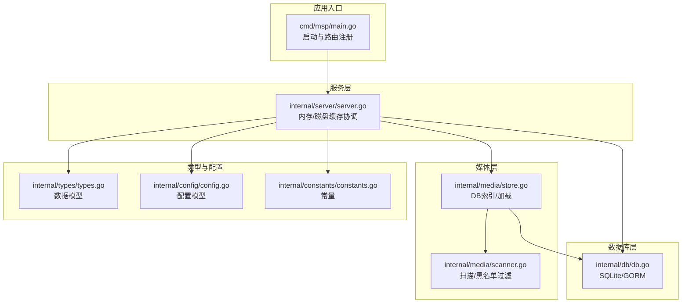
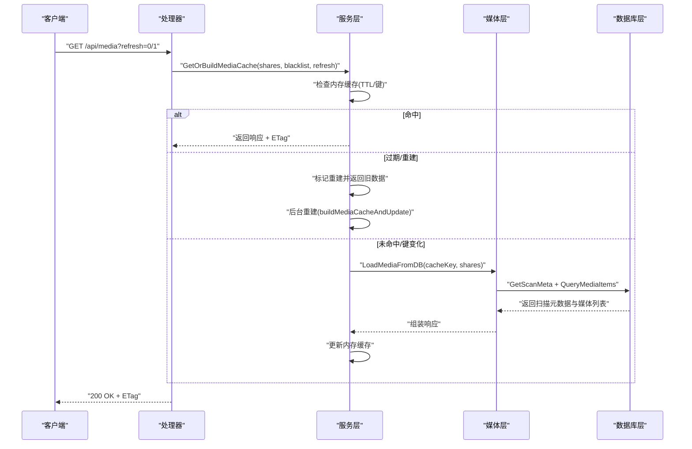
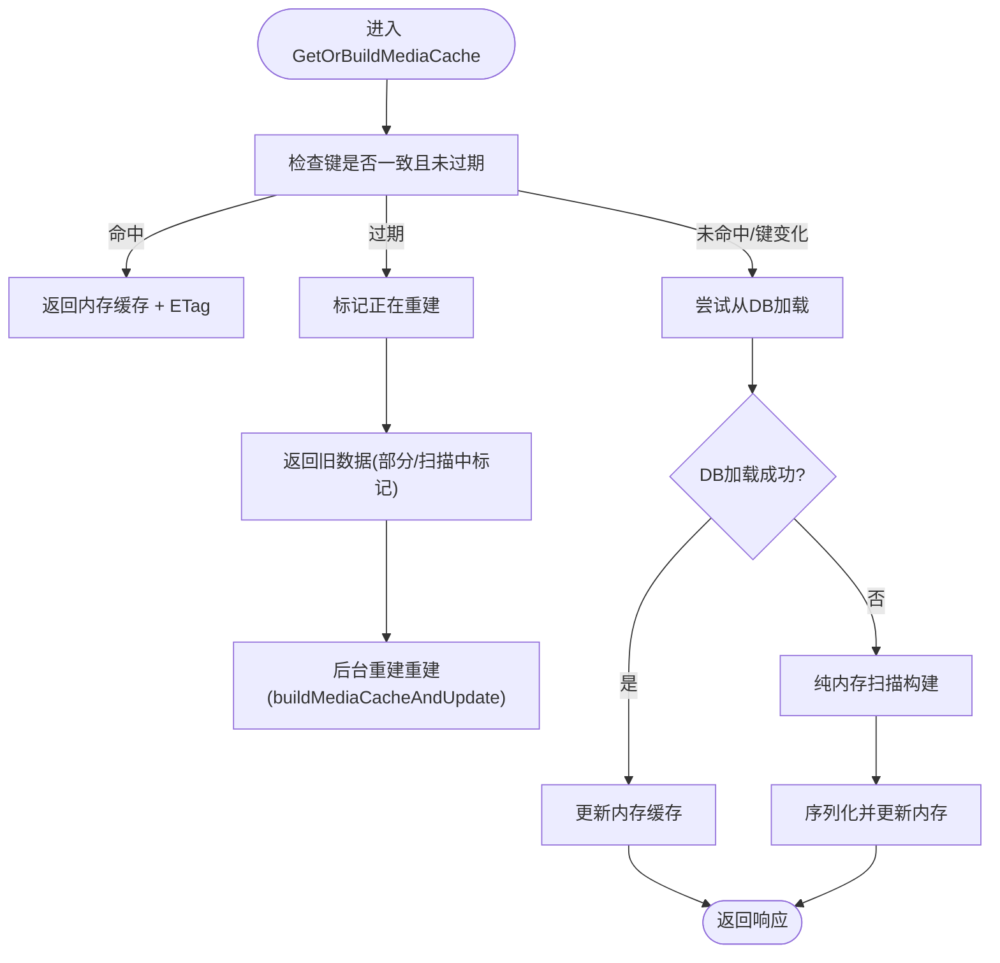
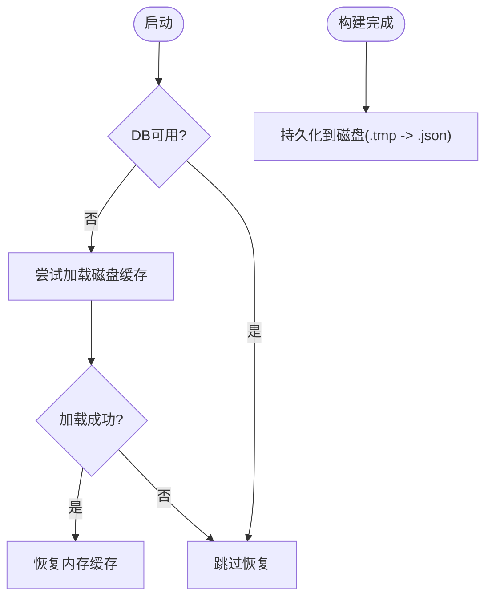
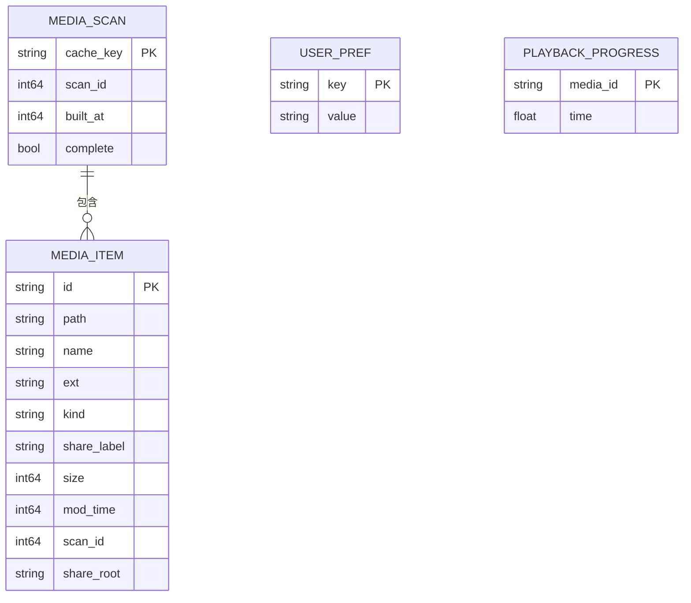
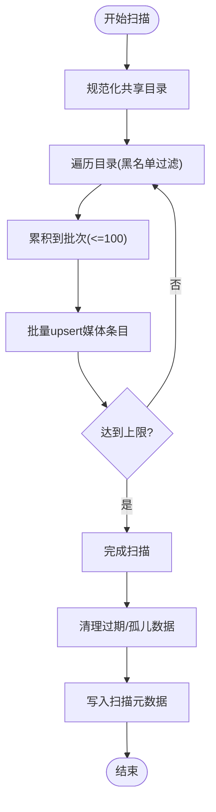
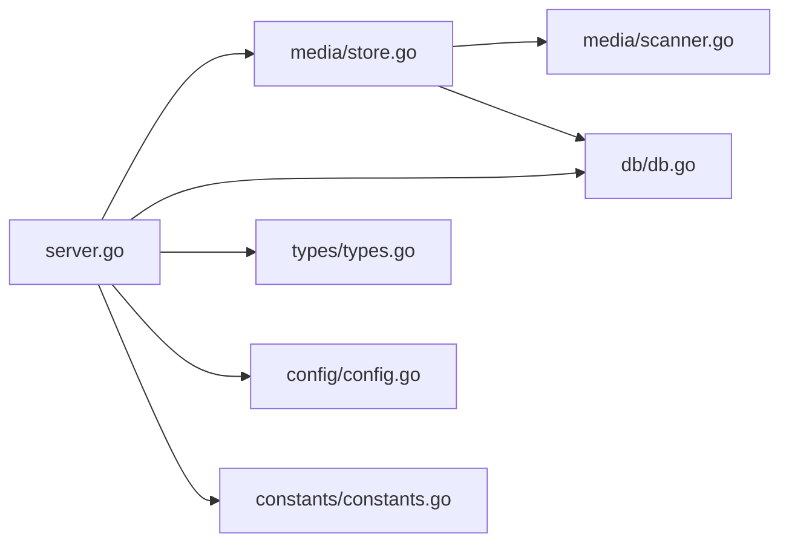

# 缓存策略

<cite>
**本文引用的文件**
- [cmd/msp/main.go](file://cmd/msp/main.go)
- [internal/server/server.go](file://internal/server/server.go)
- [internal/media/store.go](file://internal/media/store.go)
- [internal/media/scanner.go](file://internal/media/scanner.go)
- [internal/db/db.go](file://internal/db/db.go)
- [internal/types/types.go](file://internal/types/types.go)
- [internal/config/config.go](file://internal/config/config.go)
- [internal/constants/constants.go](file://internal/constants/constants.go)
- [internal/handler/handlers.go](file://internal/handler/handlers.go)
- [docs/CONFIG_EXAMPLE.md](file://docs/CONFIG_EXAMPLE.md)
- [PERFORMANCE_ANALYSIS.md](file://PERFORMANCE_ANALYSIS.md)
</cite>

## 目录
1. [简介](#简介)
2. [项目结构](#项目结构)
3. [核心组件](#核心组件)
4. [架构总览](#架构总览)
5. [详细组件分析](#详细组件分析)
6. [依赖关系分析](#依赖关系分析)
7. [性能考量](#性能考量)
8. [故障排查指南](#故障排查指南)
9. [结论](#结论)
10. [附录](#附录)

## 简介
本文件系统性阐述 MSP 项目的多层缓存策略与实现细节，覆盖内存缓存、磁盘缓存与数据库缓存的协同工作机制；详解媒体缓存的键生成、ETag 机制与失效策略；说明缓存生命周期管理与更新机制（预热、增量更新、手动刷新）；并提供性能优化方案、配置参数说明与调优建议，以及故障排查与监控方法。

## 项目结构
MSP 的缓存体系围绕以下模块协作：
- 服务层：负责缓存键生成、内存缓存读写、ETag 生成、缓存重建与持久化调度
- 媒体层：负责扫描、索引、批量写入、数据库读取与响应组装
- 数据库层：SQLite 后端，提供扫描元数据、媒体条目、用户偏好与播放进度存储
- 类型与常量：定义缓存模型、扫描模型、ETag 生成规则与 TTL 等常量

图表来源
- [cmd/msp/main.go](file://cmd/msp/main.go#L26-L83)
- [internal/server/server.go](file://internal/server/server.go#L31-L74)
- [internal/media/store.go](file://internal/media/store.go#L17-L94)
- [internal/media/scanner.go](file://internal/media/scanner.go#L25-L57)
- [internal/db/db.go](file://internal/db/db.go#L32-L72)
- [internal/types/types.go](file://internal/types/types.go#L16-L66)
- [internal/config/config.go](file://internal/config/config.go#L77-L88)
- [internal/constants/constants.go](file://internal/constants/constants.go#L37-L50)

章节来源
- [cmd/msp/main.go](file://cmd/msp/main.go#L26-L83)
- [internal/server/server.go](file://internal/server/server.go#L31-L74)
- [internal/media/store.go](file://internal/media/store.go#L17-L94)
- [internal/media/scanner.go](file://internal/media/scanner.go#L25-L57)
- [internal/db/db.go](file://internal/db/db.go#L32-L72)
- [internal/types/types.go](file://internal/types/types.go#L16-L66)
- [internal/config/config.go](file://internal/config/config.go#L77-L88)
- [internal/constants/constants.go](file://internal/constants/constants.go#L37-L50)

## 核心组件
- 内存缓存：驻留最近一次媒体响应与 ETag，支持 TTL 过期与并发读写
- 磁盘缓存：在无数据库时持久化内存缓存，启动时尝试加载
- 数据库缓存：以扫描会话为单位存储媒体索引与扫描元数据，支持增量扫描与清理
- ETag 机制：基于缓存键与构建时间生成弱 ETag，用于条件请求与缓存一致性
- 缓存键：由共享目录规范化与黑名单规则拼接而成，确保键稳定且可区分

章节来源
- [internal/server/server.go](file://internal/server/server.go#L31-L74)
- [internal/server/server.go](file://internal/server/server.go#L333-L396)
- [internal/server/server.go](file://internal/server/server.go#L400-L437)
- [internal/server/server.go](file://internal/server/server.go#L487-L518)
- [internal/server/server.go](file://internal/server/server.go#L520-L536)
- [internal/server/server.go](file://internal/server/server.go#L556-L568)
- [internal/server/server.go](file://internal/server/server.go#L443-L478)
- [internal/db/db.go](file://internal/db/db.go#L116-L142)
- [internal/db/db.go](file://internal/db/db.go#L201-L212)
- [internal/types/types.go](file://internal/types/types.go#L34-L40)
- [internal/types/types.go](file://internal/types/types.go#L54-L66)

## 架构总览
MSP 的缓存采用“内存为主、数据库为辅、磁盘兜底”的三层协同架构。请求流程如下：
- 服务层先查内存缓存，命中则返回；过期则异步重建并在锁外返回旧数据
- 若内存未命中或键变化，则尝试从数据库加载扫描元数据与媒体响应
- 若数据库不可用或加载失败，则回退到纯内存扫描构建
- 构建完成后，序列化内存缓存并按需持久化到磁盘

图表来源
- [internal/handler/handlers.go](file://internal/handler/handlers.go#L340-L362)
- [internal/server/server.go](file://internal/server/server.go#L333-L396)
- [internal/server/server.go](file://internal/server/server.go#L398-L437)
- [internal/media/store.go](file://internal/media/store.go#L17-L31)
- [internal/db/db.go](file://internal/db/db.go#L116-L142)
- [internal/db/db.go](file://internal/db/db.go#L201-L212)

## 详细组件分析

### 内存缓存与 ETag
- 内存缓存字段：键、构建时间、TTL、序列化的响应体、ETag
- 读路径：双重检查 + 锁内解包，命中即返回；过期则标记重建并返回旧数据
- 写路径：构建完成序列化后原子更新键、时间、ETag，并广播唤醒等待者
- ETag：弱 ETag，由缓存键与构建时间哈希组成，保证内容变更即失效

图表来源
- [internal/server/server.go](file://internal/server/server.go#L333-L396)
- [internal/server/server.go](file://internal/server/server.go#L398-L437)
- [internal/server/server.go](file://internal/server/server.go#L556-L568)

章节来源
- [internal/server/server.go](file://internal/server/server.go#L333-L396)
- [internal/server/server.go](file://internal/server/server.go#L398-L437)
- [internal/server/server.go](file://internal/server/server.go#L556-L568)

### 磁盘缓存（无数据库时）
- 触发条件：当数据库未初始化或不可用时，构建完成后异步持久化
- 加载条件：启动时尝试读取磁盘缓存文件，若键匹配且构建时间有效则恢复内存
- 文件格式：包含缓存键、构建时间、ETag 与完整响应体

图表来源
- [internal/server/server.go](file://internal/server/server.go#L487-L518)
- [internal/server/server.go](file://internal/server/server.go#L520-L536)
- [cmd/msp/main.go](file://cmd/msp/main.go#L50-L51)

章节来源
- [internal/server/server.go](file://internal/server/server.go#L487-L518)
- [internal/server/server.go](file://internal/server/server.go#L520-L536)
- [cmd/msp/main.go](file://cmd/msp/main.go#L50-L51)

### 数据库缓存（扫描与索引）
- 扫描元数据：以 cache_key 为主键，记录本次扫描的 scan_id、构建时间与完成标志
- 媒体条目：按 scan_id + kind 进行分区存储，支持批量 upsert 与清理
- 增量扫描：通过比较 share_root 与扫描会话，删除过期与孤儿数据
- 查询接口：按 scan_id + kind 查询，排序返回

图表来源
- [internal/types/types.go](file://internal/types/types.go#L34-L52)
- [internal/db/db.go](file://internal/db/db.go#L116-L142)
- [internal/db/db.go](file://internal/db/db.go#L201-L212)
- [internal/media/store.go](file://internal/media/store.go#L49-L94)
- [internal/media/store.go](file://internal/media/store.go#L154-L162)

章节来源
- [internal/db/db.go](file://internal/db/db.go#L116-L142)
- [internal/db/db.go](file://internal/db/db.go#L174-L199)
- [internal/db/db.go](file://internal/db/db.go#L201-L212)
- [internal/media/store.go](file://internal/media/store.go#L49-L94)
- [internal/media/store.go](file://internal/media/store.go#L154-L162)
- [internal/types/types.go](file://internal/types/types.go#L34-L52)

### 媒体扫描与索引
- 扫描流程：遍历共享目录，按黑名单规则过滤，构建媒体项并批量 upsert
- 批量写入：100 条一批，显著降低数据库写入开销
- 增量清理：扫描完成后删除非本次会话与非当前共享根的过期数据
- 响应组装：按 kind 分类聚合，返回 videos/audios/images/others

图表来源
- [internal/media/store.go](file://internal/media/store.go#L49-L94)
- [internal/media/store.go](file://internal/media/store.go#L111-L152)
- [internal/media/store.go](file://internal/media/store.go#L154-L162)
- [internal/media/scanner.go](file://internal/media/scanner.go#L25-L57)
- [internal/media/scanner.go](file://internal/media/scanner.go#L68-L106)

章节来源
- [internal/media/store.go](file://internal/media/store.go#L49-L94)
- [internal/media/store.go](file://internal/media/store.go#L111-L152)
- [internal/media/store.go](file://internal/media/store.go#L154-L162)
- [internal/media/scanner.go](file://internal/media/scanner.go#L25-L57)
- [internal/media/scanner.go](file://internal/media/scanner.go#L68-L106)

### 缓存键生成与 ETag
- 缓存键：共享目录规范化排序 + 黑名单规则标准化排序拼接
- ETag：弱 ETag，由缓存键 + 构建时间哈希组成，确保内容变更即失效
- 作用：保证不同配置组合的缓存隔离，以及内容更新后的自动失效

章节来源
- [internal/server/server.go](file://internal/server/server.go#L443-L478)
- [internal/server/server.go](file://internal/server/server.go#L556-L568)
- [internal/server/server.go](file://internal/server/server.go#L538-L554)

### 生命周期管理与更新机制
- 预热：启动时后台触发首次扫描，缩短首次请求延迟
- 增量更新：TTL 过期后异步重建，期间返回旧数据，避免阻塞
- 手动刷新：携带 refresh=1 参数强制重建并返回扫描中标记的数据
- 配置热重载：监听配置文件变更，2 秒周期检测并自动重载

章节来源
- [cmd/msp/main.go](file://cmd/msp/main.go#L50-L51)
- [internal/server/server.go](file://internal/server/server.go#L333-L396)
- [internal/server/server.go](file://internal/server/server.go#L362-L372)
- [internal/server/server.go](file://internal/server/server.go#L140-L188)
- [internal/handler/handlers.go](file://internal/handler/handlers.go#L340-L362)

## 依赖关系分析
- 服务层依赖媒体层进行扫描与加载，依赖数据库层进行元数据与条目操作
- 媒体层依赖扫描器与数据库层，提供批量 upsert 与清理能力
- 类型与常量为各层提供统一的数据模型与行为约束

图表来源
- [internal/server/server.go](file://internal/server/server.go#L23-L29)
- [internal/media/store.go](file://internal/media/store.go#L3-L15)
- [internal/media/scanner.go](file://internal/media/scanner.go#L3-L19)
- [internal/db/db.go](file://internal/db/db.go#L3-L16)
- [internal/types/types.go](file://internal/types/types.go#L3-L6)
- [internal/config/config.go](file://internal/config/config.go#L3-L4)
- [internal/constants/constants.go](file://internal/constants/constants.go#L5-L6)

章节来源
- [internal/server/server.go](file://internal/server/server.go#L23-L29)
- [internal/media/store.go](file://internal/media/store.go#L3-L15)
- [internal/media/scanner.go](file://internal/media/scanner.go#L3-L19)
- [internal/db/db.go](file://internal/db/db.go#L3-L16)
- [internal/types/types.go](file://internal/types/types.go#L3-L6)
- [internal/config/config.go](file://internal/config/config.go#L3-L4)
- [internal/constants/constants.go](file://internal/constants/constants.go#L5-L6)

## 性能考量
- 内存使用优化
  - 内存缓存仅保存序列化后的响应体，减少对象分配
  - 构建完成后触发 GC，释放扫描阶段临时内存
- 磁盘 I/O 减少
  - 批量 upsert（100 条/批），显著降低写放大
  - 磁盘缓存采用 .tmp -> 正式文件的原子替换，避免部分写
- 数据库性能
  - WAL 模式与同步模式调整，减少锁竞争
  - 连接池仅 1 个连接，避免 SQLite 多连接锁争用
  - 预编译语句缓存，减少 SQL 解析开销
- 并发与锁
  - RWMutex 保护配置，Mutex + Cond 协调缓存构建
  - 重建过程在锁外进行，避免阻塞其他请求
- 可观测性
  - expvar 指标采集（请求总数、平均耗时、内存、goroutine 数）
  - 建议添加缓存命中/未命中计数与转码统计

章节来源
- [internal/server/server.go](file://internal/server/server.go#L417-L437)
- [cmd/msp/main.go](file://cmd/msp/main.go#L27)
- [internal/db/db.go](file://internal/db/db.go#L54-L71)
- [internal/media/store.go](file://internal/media/store.go#L118-L134)
- [internal/server/server.go](file://internal/server/server.go#L520-L536)
- [PERFORMANCE_ANALYSIS.md](file://PERFORMANCE_ANALYSIS.md#L434-L460)
- [PERFORMANCE_ANALYSIS.md](file://PERFORMANCE_ANALYSIS.md#L875-L929)

## 故障排查指南
- 缓存未命中/频繁重建
  - 检查共享目录路径是否规范化，确认缓存键是否一致
  - 确认 TTL 是否过短，必要时延长 MediaCacheTTL
- ETag 不生效
  - 确认请求是否携带 If-None-Match，响应是否正确返回 ETag
  - 检查缓存键是否因黑名单规则变化而改变
- 数据库异常
  - 确认 SQLite 文件权限与路径，检查 WAL/synchronous/cache_size 设置
  - 观察 DB 初始化日志，确认迁移成功
- 磁盘缓存无法恢复
  - 检查磁盘缓存文件是否存在、键与构建时间是否有效
  - 确认无并发写入导致的损坏
- 配置热重载无效
  - 确认配置文件路径与权限，检查监听周期与修改时间判断

章节来源
- [internal/server/server.go](file://internal/server/server.go#L333-L396)
- [internal/server/server.go](file://internal/server/server.go#L374-L388)
- [internal/server/server.go](file://internal/server/server.go#L487-L518)
- [internal/db/db.go](file://internal/db/db.go#L32-L72)
- [internal/constants/constants.go](file://internal/constants/constants.go#L37-L50)
- [internal/handler/handlers.go](file://internal/handler/handlers.go#L358-L361)

## 结论
MSP 的缓存策略通过“内存为主、数据库为辅、磁盘兜底”的多层协同，在保证一致性的同时兼顾性能与可靠性。ETag 与缓存键设计确保了缓存的精确失效与隔离；增量扫描与批量写入降低了数据库压力；TTL 过期与异步重建提升了用户体验。结合可观测性与调优建议，可在不同规模与环境下获得稳定的媒体缓存表现。

## 附录

### 缓存配置参数说明与调优建议
- 基本参数
  - logLevel/logFile：日志级别与文件路径，便于定位缓存与扫描问题
  - port/maxItems：端口与扫描上限，maxItems=0 表示无限制，适合 SQLite 增量扫描
- 功能与 UI
  - features/ui/playback：影响媒体分类与展示，间接影响缓存键
- 黑名单
  - extensions/filenames/folders/sizeRule：严格控制扫描范围，减少数据库写入与内存占用
- 安全
  - ipWhitelist/ipBlacklist/pinEnabled/pin：保障服务稳定运行，避免异常流量冲击缓存

章节来源
- [docs/CONFIG_EXAMPLE.md](file://docs/CONFIG_EXAMPLE.md#L6-L24)
- [docs/CONFIG_EXAMPLE.md](file://docs/CONFIG_EXAMPLE.md#L94-L111)
- [docs/CONFIG_EXAMPLE.md](file://docs/CONFIG_EXAMPLE.md#L113-L134)
- [internal/config/config.go](file://internal/config/config.go#L77-L88)