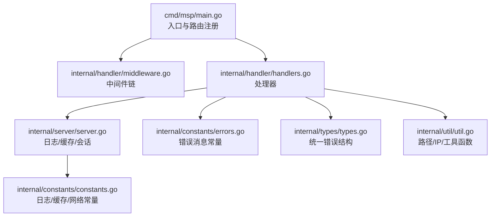
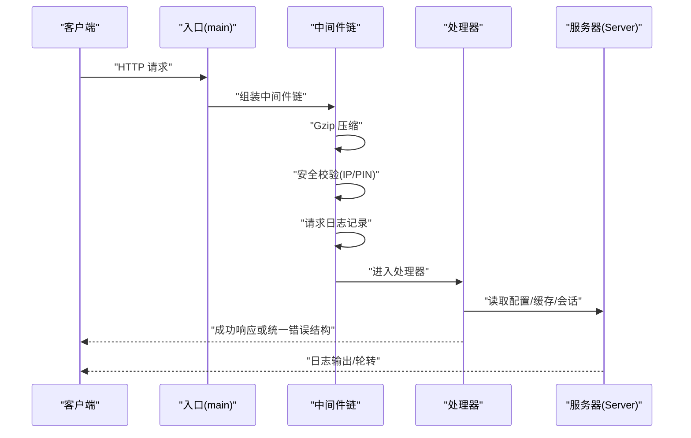
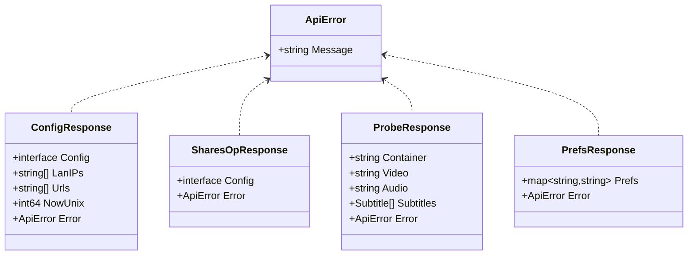
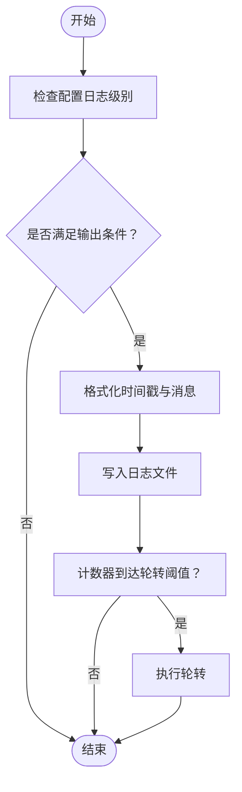
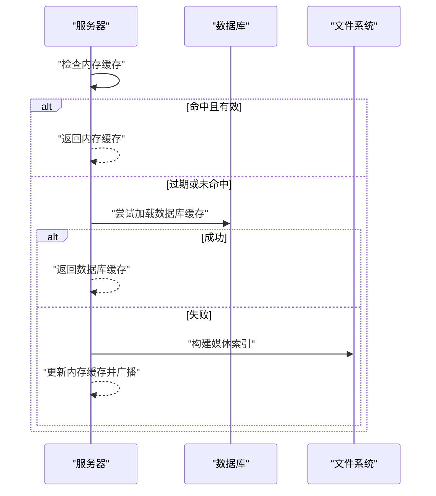
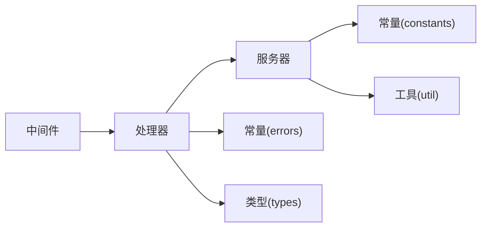

# 错误处理机制

<cite>
**本文引用的文件**
- [cmd/msp/main.go](file://cmd/msp/main.go)
- [internal/handler/middleware.go](file://internal/handler/middleware.go)
- [internal/handler/handlers.go](file://internal/handler/handlers.go)
- [internal/server/server.go](file://internal/server/server.go)
- [internal/constants/constants.go](file://internal/constants/constants.go)
- [internal/constants/errors.go](file://internal/constants/errors.go)
- [internal/types/types.go](file://internal/types/types.go)
- [internal/util/util.go](file://internal/util/util.go)
- [SECURITY_AUDIT_REPORT.md](file://SECURITY_AUDIT_REPORT.md)
- [PERFORMANCE_ANALYSIS.md](file://PERFORMANCE_ANALYSIS.md)
</cite>

## 目录
1. [简介](#简介)
2. [项目结构](#项目结构)
3. [核心组件](#核心组件)
4. [架构总览](#架构总览)
5. [详细组件分析](#详细组件分析)
6. [依赖关系分析](#依赖关系分析)
7. [性能考量](#性能考量)
8. [故障排查指南](#故障排查指南)
9. [结论](#结论)
10. [附录](#附录)

## 简介
本文件系统性梳理 MSP 项目的错误处理机制，覆盖错误分类与处理策略、错误码与错误消息格式、日志记录与轮转、错误恢复与降级、常见场景诊断与监控告警配置等内容。文档面向开发者与运维人员，既提供代码级分析，也给出可操作的排障建议。

## 项目结构
围绕错误处理的关键模块如下：
- 中间件层：安全校验、日志记录、压缩响应
- 处理器层：API 业务逻辑与错误响应封装
- 服务器层：日志系统、配置热重载、缓存与会话
- 常量与类型：错误消息常量、统一错误结构、日志级别与常量
- 工具与安全：路径校验、IP 白黑名单匹配、PIN 校验

图表来源
- [cmd/msp/main.go](file://cmd/msp/main.go#L85-L107)
- [internal/handler/middleware.go](file://internal/handler/middleware.go#L25-L52)
- [internal/handler/handlers.go](file://internal/handler/handlers.go#L38-L43)
- [internal/server/server.go](file://internal/server/server.go#L190-L248)
- [internal/constants/errors.go](file://internal/constants/errors.go#L4-L67)
- [internal/types/types.go](file://internal/types/types.go#L76-L78)
- [internal/constants/constants.go](file://internal/constants/constants.go#L26-L50)
- [internal/util/util.go](file://internal/util/util.go#L148-L182)

章节来源
- [cmd/msp/main.go](file://cmd/msp/main.go#L85-L107)
- [internal/handler/middleware.go](file://internal/handler/middleware.go#L25-L52)
- [internal/handler/handlers.go](file://internal/handler/handlers.go#L38-L43)
- [internal/server/server.go](file://internal/server/server.go#L190-L248)
- [internal/constants/errors.go](file://internal/constants/errors.go#L4-L67)
- [internal/types/types.go](file://internal/types/types.go#L76-L78)
- [internal/constants/constants.go](file://internal/constants/constants.go#L26-L50)
- [internal/util/util.go](file://internal/util/util.go#L148-L182)

## 核心组件
- 中间件链：按序组合 Gzip 响应压缩、安全校验（IP 白黑名单/PIN）、请求日志记录
- 处理器：对各 API 路由进行业务处理，统一 JSON 错误响应结构
- 服务器：集中日志输出、日志轮转、配置热重载、媒体缓存与会话管理
- 常量与类型：统一错误消息常量、统一错误结构体、日志级别与常量定义
- 工具与安全：路径合法性校验、IP 匹配、PIN 安全比较

章节来源
- [internal/handler/middleware.go](file://internal/handler/middleware.go#L25-L52)
- [internal/handler/handlers.go](file://internal/handler/handlers.go#L686-L720)
- [internal/server/server.go](file://internal/server/server.go#L222-L248)
- [internal/constants/errors.go](file://internal/constants/errors.go#L4-L67)
- [internal/types/types.go](file://internal/types/types.go#L76-L78)
- [internal/constants/constants.go](file://internal/constants/constants.go#L26-L50)
- [internal/util/util.go](file://internal/util/util.go#L148-L182)

## 架构总览
下图展示错误处理在请求生命周期中的流转：

图表来源
- [cmd/msp/main.go](file://cmd/msp/main.go#L65-L83)
- [internal/handler/middleware.go](file://internal/handler/middleware.go#L25-L52)
- [internal/handler/handlers.go](file://internal/handler/handlers.go#L45-L66)
- [internal/server/server.go](file://internal/server/server.go#L286-L311)

## 详细组件分析

### 错误分类与处理策略
- 业务错误
  - 示例：配置写入失败、偏好设置读写失败、播放进度读写失败、分享操作参数缺失/冲突
  - 处理：返回统一错误结构，状态码按业务语义选择（如 400/404/500），错误消息来自常量
- 系统错误
  - 示例：数据库初始化失败、日志文件打开失败、媒体缓存重建异常
  - 处理：记录错误日志，必要时降级返回部分数据或空数据，避免崩溃
- 网络错误
  - 示例：JSON 解码失败、请求体过大、方法不允许、资源不存在
  - 处理：根据具体场景返回相应状态码与错误消息；对非法请求直接返回 4xx
- 安全错误
  - 示例：IP 不在白名单、PIN 未认证、访问被拒绝
  - 处理：统一返回 403/401，记录访问日志并提示

章节来源
- [internal/handler/handlers.go](file://internal/handler/handlers.go#L45-L66)
- [internal/handler/handlers.go](file://internal/handler/handlers.go#L161-L190)
- [internal/handler/handlers.go](file://internal/handler/handlers.go#L192-L233)
- [internal/handler/handlers.go](file://internal/handler/handlers.go#L255-L319)
- [internal/handler/middleware.go](file://internal/handler/middleware.go#L77-L120)

### 错误码体系与错误消息格式
- 统一错误结构
  - 结构体：包含 message 字段
  - 使用场景：处理器在发生错误时返回统一的 ApiError 对象
- 错误消息来源
  - 常量：集中于 constants/errors.go，便于维护与一致性
  - 动态消息：如 JSON 解码失败、请求体过大等
- HTTP 状态码
  - 常量：constants 中定义常用状态码常量，便于复用
  - 实际使用：处理器按业务选择合适的 4xx/5xx 状态码

图表来源
- [internal/types/types.go](file://internal/types/types.go#L76-L78)
- [internal/types/types.go](file://internal/types/types.go#L68-L74)
- [internal/types/types.go](file://internal/types/types.go#L86-L89)
- [internal/types/types.go](file://internal/types/types.go#L91-L97)
- [internal/types/types.go](file://internal/types/types.go#L99-L102)

章节来源
- [internal/types/types.go](file://internal/types/types.go#L76-L78)
- [internal/constants/errors.go](file://internal/constants/errors.go#L4-L67)
- [internal/constants/constants.go](file://internal/constants/constants.go#L97-L108)

### 错误日志记录机制
- 日志级别
  - 支持：error、info、debug、none
  - 控制：根据配置的 logLevel 决定是否输出
- 日志内容
  - 请求日志：包含方法、路径、状态码、User-Agent、耗时
  - 新设备检测：对首次访问的外部 IP 输出提示
- 日志轮转
  - 触发条件：达到阈值大小后轮转
  - 文件命名：保留旧日志为 .1
- 日志输出
  - 初始化：SetupLogger 根据配置创建/打开日志文件
  - 输出：Log 方法按级别输出，支持时间戳格式化

图表来源
- [internal/server/server.go](file://internal/server/server.go#L222-L248)
- [internal/server/server.go](file://internal/server/server.go#L286-L311)
- [internal/server/server.go](file://internal/server/server.go#L250-L284)
- [internal/constants/constants.go](file://internal/constants/constants.go#L26-L35)

章节来源
- [internal/server/server.go](file://internal/server/server.go#L222-L248)
- [internal/server/server.go](file://internal/server/server.go#L286-L311)
- [internal/server/server.go](file://internal/server/server.go#L250-L284)
- [internal/constants/constants.go](file://internal/constants/constants.go#L26-L35)

### 错误恢复策略与降级机制
- 配置热重载
  - 监控：周期性检查配置文件修改时间
  - 行为：读取并解析新配置，应用默认值，更新内存配置并记录日志
- 媒体缓存降级
  - 内存缓存：命中则直接返回；过期则后台重建，同时返回旧数据
  - 数据库缓存：优先尝试从数据库加载缓存，失败则回退到实时构建
  - 磁盘缓存：无数据库时持久化到磁盘，启动时尝试加载
- 转码降级
  - 策略：转码失败时记录警告并回退直播放
  - 并发限制：通过信号量限制并发转码任务，避免资源争用
- 会话与安全
  - 会话：创建与校验，自动清理过期会话
  - 安全：IP 白黑名单匹配、PIN 校验、安全头设置

图表来源
- [internal/server/server.go](file://internal/server/server.go#L332-L396)
- [internal/server/server.go](file://internal/server/server.go#L398-L437)
- [internal/server/server.go](file://internal/server/server.go#L487-L518)

章节来源
- [internal/server/server.go](file://internal/server/server.go#L140-L188)
- [internal/server/server.go](file://internal/server/server.go#L332-L396)
- [internal/server/server.go](file://internal/server/server.go#L398-L437)
- [internal/server/server.go](file://internal/server/server.go#L487-L518)
- [internal/handler/middleware.go](file://internal/handler/middleware.go#L77-L120)
- [PERFORMANCE_ANALYSIS.md](file://PERFORMANCE_ANALYSIS.md#L476-L502)

### 常见错误场景与诊断
- JSON 解码失败
  - 现象：返回 400 或实体过大
  - 处理：decodeJSONBody 限制请求体大小，writeJSONDecodeError 统一错误响应
- 资源不存在/路径非法
  - 现象：返回 404 或 403
  - 处理：resolveMediaTarget 校验路径合法性与访问权限
- 转码失败
  - 现象：记录警告并回退直播放
  - 处理：tryServeTranscode 失败时回退 serveDirect
- 配置读写失败
  - 现象：返回统一错误消息
  - 处理：处理器捕获错误并返回 ApiError
- 日志文件打开失败
  - 现象：stderr 输出错误信息
  - 处理：SetupLogger 失败时提示并继续运行

章节来源
- [internal/handler/handlers.go](file://internal/handler/handlers.go#L699-L720)
- [internal/handler/handlers.go](file://internal/handler/handlers.go#L448-L486)
- [internal/handler/handlers.go](file://internal/handler/handlers.go#L534-L564)
- [internal/handler/handlers.go](file://internal/handler/handlers.go#L45-L66)
- [internal/server/server.go](file://internal/server/server.go#L190-L220)

### 国际化支持
- 前端国际化
  - 位置：web/src/modules/i18n.js
  - 特点：键值映射，支持占位符替换，按语言切换
- 后端错误消息
  - 现状：错误消息常量位于后端，统一为中文
  - 建议：若需多语言，可在前端层映射后端错误键，或扩展后端多语言能力

章节来源
- [web/src/modules/i18n.js](file://web/src/modules/i18n.js#L165-L182)

## 依赖关系分析
- 中间件依赖处理器与服务器，负责请求前处理与后处理
- 处理器依赖服务器（配置、缓存、日志、会话）、常量与类型
- 服务器依赖常量与工具函数，提供日志、缓存、会话与配置管理
- 常量与类型为全局共享，保证一致性

图表来源
- [internal/handler/middleware.go](file://internal/handler/middleware.go#L25-L52)
- [internal/handler/handlers.go](file://internal/handler/handlers.go#L38-L43)
- [internal/server/server.go](file://internal/server/server.go#L190-L248)
- [internal/constants/errors.go](file://internal/constants/errors.go#L4-L67)
- [internal/types/types.go](file://internal/types/types.go#L76-L78)
- [internal/constants/constants.go](file://internal/constants/constants.go#L26-L50)
- [internal/util/util.go](file://internal/util/util.go#L148-L182)

章节来源
- [internal/handler/middleware.go](file://internal/handler/middleware.go#L25-L52)
- [internal/handler/handlers.go](file://internal/handler/handlers.go#L38-L43)
- [internal/server/server.go](file://internal/server/server.go#L190-L248)
- [internal/constants/errors.go](file://internal/constants/errors.go#L4-L67)
- [internal/types/types.go](file://internal/types/types.go#L76-L78)
- [internal/constants/constants.go](file://internal/constants/constants.go#L26-L50)
- [internal/util/util.go](file://internal/util/util.go#L148-L182)

## 性能考量
- 压缩响应：仅对 API 文本响应启用 gzip，避免对流媒体与二进制大文件压缩
- 超时配置：合理设置读取与空闲超时，避免长时间占用连接
- 并发控制：转码并发限制，防止 CPU/IO 抢占导致整体性能下降
- GC 与内存：调整 GC 策略，定期回收内存，降低峰值占用
- 缓存策略：媒体缓存 TTL 与弱 ETag，减少重复扫描与传输

章节来源
- [internal/handler/middleware.go](file://internal/handler/middleware.go#L25-L43)
- [cmd/msp/main.go](file://cmd/msp/main.go#L67-L74)
- [PERFORMANCE_ANALYSIS.md](file://PERFORMANCE_ANALYSIS.md#L434-L460)
- [PERFORMANCE_ANALYSIS.md](file://PERFORMANCE_ANALYSIS.md#L476-L502)
- [internal/server/server.go](file://internal/server/server.go#L58-L63)

## 故障排查指南
- 启动阶段
  - 配置文件不存在：自动初始化默认配置并保存
  - 数据库初始化失败：记录警告并继续运行（部分功能受限）
- 运行阶段
  - 日志无法写入：stderr 提示，检查日志路径与权限
  - 配置热重载失败：记录错误并跳过本次更新
  - 媒体缓存构建失败：回退到旧缓存或实时构建
- 安全相关
  - IP 被拒绝：检查白名单/黑名单配置
  - PIN 未认证：确认会话是否有效或重新登录
- 转码失败
  - 查看转码日志与回退路径，确认 FFmpeg 可用性与资源限制

章节来源
- [cmd/msp/main.go](file://cmd/msp/main.go#L34-L45)
- [internal/server/server.go](file://internal/server/server.go#L140-L188)
- [internal/server/server.go](file://internal/server/server.go#L190-L220)
- [internal/handler/middleware.go](file://internal/handler/middleware.go#L77-L120)
- [internal/handler/handlers.go](file://internal/handler/handlers.go#L534-L564)

## 结论
MSP 的错误处理机制以“统一错误结构 + 明确日志级别 + 安全中间件 + 缓存降级 + 并发限制”为核心，兼顾易用性与稳定性。建议后续在以下方面持续改进：
- 前端错误键映射与后端多语言支持
- 更细粒度的错误码与错误上下文
- 错误监控与告警集成（如 Prometheus/日志聚合）

## 附录
- 错误消息常量清单（摘自 constants/errors.go）
  - JSON 解析失败、写入配置失败、读取配置失败、读取偏好失败、写入偏好失败、读取进度失败、保存进度失败、缺少 id、缺少 Path、缺少 prefs、bad id、not allowed、not found、open failed、read failed、转码未启用、Access Denied、Unauthorized、Invalid request、Method Not Allowed、不支持的字幕格式
- 日志级别与常量
  - 日志级别：error、info、debug、none
  - 日志轮转阈值：10MB，检查间隔：100 条
  - 媒体缓存 TTL：2 分钟，配置检查间隔：2 秒
- 安全审计要点
  - 错误信息不泄露内部细节
  - CORS 默认同源策略
  - 建议过滤敏感字段（如 PIN）后再返回配置视图

章节来源
- [internal/constants/errors.go](file://internal/constants/errors.go#L4-L67)
- [internal/constants/constants.go](file://internal/constants/constants.go#L26-L50)
- [SECURITY_AUDIT_REPORT.md](file://SECURITY_AUDIT_REPORT.md#L456-L464)
- [SECURITY_AUDIT_REPORT.md](file://SECURITY_AUDIT_REPORT.md#L444-L453)
- [SECURITY_AUDIT_REPORT.md](file://SECURITY_AUDIT_REPORT.md#L466-L481)