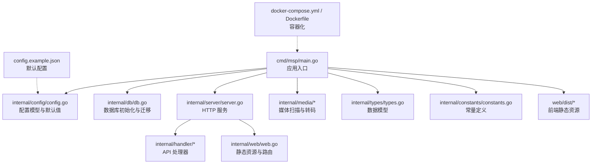
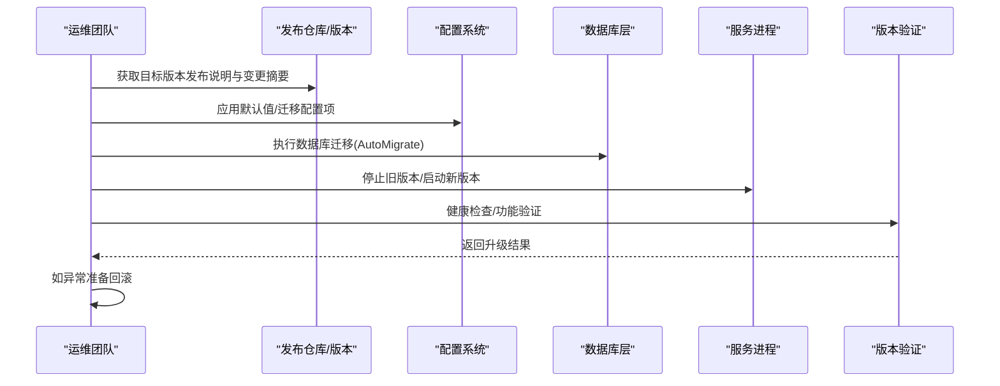
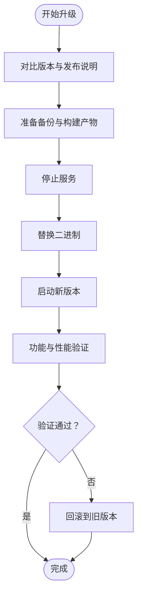
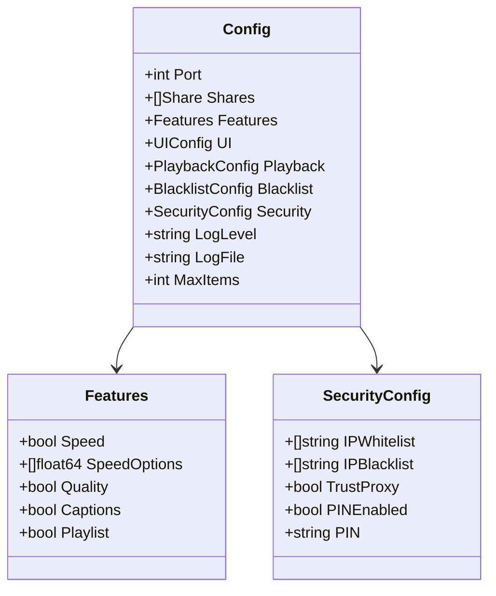
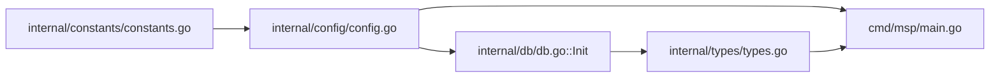

# 升级维护

<cite>
**本文引用的文件**
- [README.md](file://README.md)
- [CHANGELOG.md](file://CHANGELOG.md)
- [docs/release/v0.8.12.md](file://docs/release/v0.8.12.md)
- [internal/config/config.go](file://internal/config/config.go)
- [internal/config/validate.go](file://internal/config/validate.go)
- [internal/db/db.go](file://internal/db/db.go)
- [internal/types/types.go](file://internal/types/types.go)
- [internal/constants/constants.go](file://internal/constants/constants.go)
- [config.example.json](file://config.example.json)
- [cmd/msp/main.go](file://cmd/msp/main.go)
- [scripts/build.sh](file://scripts/build.sh)
- [scripts/build.ps1](file://scripts/build.ps1)
- [docker-compose.yml](file://docker-compose.yml)
- [Dockerfile](file://Dockerfile)
- [docs/SECURITY_UPDATE.md](file://docs/SECURITY_UPDATE.md)
- [docs/SECURITY.md](file://docs/SECURITY.md)
- [docs/API_REFERENCE.md](file://docs/API_REFERENCE.md)
- [docs/CONFIG_EXAMPLE.md](file://docs/CONFIG_EXAMPLE.md)
</cite>

## 目录
1. [简介](#简介)
2. [项目结构](#项目结构)
3. [核心组件](#核心组件)
4. [架构总览](#架构总览)
5. [详细组件分析](#详细组件分析)
6. [依赖关系分析](#依赖关系分析)
7. [性能考量](#性能考量)
8. [故障排查指南](#故障排查指南)
9. [结论](#结论)
10. [附录](#附录)

## 简介
本指南面向运维与开发团队，提供 MSP 在生产环境中的升级与维护操作手册。内容涵盖版本升级流程、配置迁移策略、数据库迁移方案、维护窗口规划、热更新与零停机升级可能性、风险评估与应急预案、批量升级与多实例部署管理策略，以及补丁与安全更新流程。文档结合仓库内的配置模型、数据库结构与发布说明，给出可落地的操作步骤与可视化图示。

## 项目结构
MSP 采用前后端一体化单二进制设计，核心由 Go 后端、SQLite 数据库存储、前端 Web 资源嵌入组成。主要目录与职责如下：
- cmd/msp：应用入口与主流程
- internal/*：后端核心模块（配置、数据库、媒体扫描、服务、类型定义等）
- web：前端资源与打包配置
- docs：发布说明、配置参考、安全指南等
- scripts：跨平台构建脚本
- docker-compose.yml / Dockerfile：容器化部署
- config.example.json：默认配置模板



图表来源
- [cmd/msp/main.go](file://cmd/msp/main.go)
- [internal/config/config.go](file://internal/config/config.go)
- [internal/db/db.go](file://internal/db/db.go)
- [internal/types/types.go](file://internal/types/types.go)
- [internal/constants/constants.go](file://internal/constants/constants.go)
- [config.example.json](file://config.example.json)
- [docker-compose.yml](file://docker-compose.yml)
- [Dockerfile](file://Dockerfile)

章节来源
- [README.md](file://README.md#L1-L106)
- [CHANGELOG.md](file://CHANGELOG.md#L1-L156)

## 核心组件
- 配置系统：定义 Features/UI/Playback/Blacklist/Security 等配置段，并提供默认值与校验逻辑，支持运行时默认值补齐与兼容旧配置。
- 数据库层：基于 GORM + SQLite，自动迁移 MediaItem/MediaScan/UserPref/PlaybackProgress 等表；提供进度读写、扫描元数据、批量写入等能力。
- 类型与常量：统一的数据结构与常量定义，确保配置与数据库模型一致性。
- 构建与部署：跨平台构建脚本与容器化配置，便于在多环境中进行升级与回滚。

章节来源
- [internal/config/config.go](file://internal/config/config.go#L1-L286)
- [internal/db/db.go](file://internal/db/db.go#L1-L270)
- [internal/types/types.go](file://internal/types/types.go#L1-L112)
- [internal/constants/constants.go](file://internal/constants/constants.go#L1-L115)
- [config.example.json](file://config.example.json#L1-L56)

## 架构总览
下图展示了升级过程中的关键交互：版本比较与发布说明、配置迁移、数据库迁移、服务重启与健康检查、回滚准备与验证。



图表来源
- [CHANGELOG.md](file://CHANGELOG.md#L1-L156)
- [docs/release/v0.8.12.md](file://docs/release/v0.8.12.md#L1-L27)
- [internal/config/config.go](file://internal/config/config.go#L148-L162)
- [internal/db/db.go](file://internal/db/db.go#L32-L72)
- [cmd/msp/main.go](file://cmd/msp/main.go)

## 详细组件分析

### 版本升级流程
- 版本对比与影响评估
  - 通过发布说明与变更日志评估破坏性变更、新增 API、配置项变化与数据库结构变更。
  - 示例：0.8.12 说明了播放策略收敛、播放器稳定性增强与 WMV 兼容补强，未引入新依赖且不改动 API 协议。
- 升级前准备
  - 备份配置与数据库：备份 config.json 与 msp.db。
  - 验证构建产物：使用构建脚本生成目标平台二进制，核对校验和。
  - 评估停机窗口：根据媒体库规模与增量扫描策略估算停机时间。
- 升级步骤
  - 停止服务 → 替换二进制 → 启动服务 → 观察日志与健康状态。
  - 若涉及配置变更，先应用默认值补齐，再启动服务。
- 升级后验证
  - 功能验证：播放、转码、进度、PIN/黑白名单等。
  - 性能验证：扫描耗时、并发转码、数据库写入性能。
  - 回滚准备：保留旧二进制与备份，准备回滚脚本。



章节来源
- [CHANGELOG.md](file://CHANGELOG.md#L1-L156)
- [docs/release/v0.8.12.md](file://docs/release/v0.8.12.md#L1-L27)
- [scripts/build.sh](file://scripts/build.sh)
- [scripts/build.ps1](file://scripts/build.ps1)

### 配置迁移策略
- 配置文件格式与默认值
  - 使用结构体定义配置段，提供 Default() 与 ApplyDefaults()，自动补齐缺失字段，兼容旧配置。
  - 关键配置段：features/ui/playback/blacklist/security 等。
- 新增/废弃配置项处理
  - 新增：在结构体中添加字段，提供默认值与校验；ApplyDefaults 自动生效。
  - 废弃：保留字段但标记为兼容，或在发布说明中明确迁移路径。
- 运行时默认值补齐
  - 通过 ApplyDefaults 对空值字段进行补齐，避免运行时错误。
- 配置示例与校验
  - 使用 config.example.json 作为参考；validate.go 提供校验逻辑，确保配置合法。



图表来源
- [internal/config/config.go](file://internal/config/config.go#L77-L88)
- [internal/config/config.go](file://internal/config/config.go#L5-L11)
- [internal/config/config.go](file://internal/config/config.go#L56-L75)

章节来源
- [internal/config/config.go](file://internal/config/config.go#L94-L146)
- [internal/config/config.go](file://internal/config/config.go#L148-L162)
- [internal/config/validate.go](file://internal/config/validate.go)
- [config.example.json](file://config.example.json#L1-L56)

### 数据库迁移方案
- 迁移入口与策略
  - Init(dbPath) 负责初始化连接、设置 SQLite 参数、开启 WAL 并执行 AutoMigrate。
  - AutoMigrate 将创建/更新 MediaItem/MediaScan/UserPref/PlaybackProgress 表。
- 表结构与字段
  - PlaybackProgress：媒体播放进度，主键为 MediaID，支持 ON CONFLICT 更新。
  - MediaItem：媒体条目，含索引与 JSON 字段（字幕等）。
  - MediaScan：扫描会话元数据，包含缓存键、扫描 ID、完成状态等。
  - UserPref：用户偏好键值对，支持批量 Upsert。
- 数据转换与兼容性
  - 通过 ON CONFLICT 更新与 Upsert 接口保证数据一致性。
  - 旧版本数据可通过 AutoMigrate 自动迁移，无需手工 SQL。
- 性能优化
  - WAL 模式、同步级别、缓存大小等参数在 Init 中设置，提升写入与查询性能。

```mermaid
erDiagram
MEDIA_ITEM {
string id PK
string path UK
string name
string ext
string kind IDX
string share_label IDX
int64 size
int64 mod_time
json subtitles
string audio_cover
string audio_lyrics
int64 scan_id IDX
string share_root
}
MEDIA_SCAN {
string cache_key PK
int64 scan_id
int64 built_at
bool complete
}
USER_PREF {
string key PK
string value
}
PLAYBACK_PROGRESS {
string media_id PK
float time
}
```

图表来源
- [internal/db/db.go](file://internal/db/db.go#L71-L72)
- [internal/types/types.go](file://internal/types/types.go#L16-L52)

章节来源
- [internal/db/db.go](file://internal/db/db.go#L32-L72)
- [internal/db/db.go](file://internal/db/db.go#L88-L99)
- [internal/db/db.go](file://internal/db/db.go#L144-L172)
- [internal/types/types.go](file://internal/types/types.go#L16-L52)

### 维护窗口规划建议
- 停机时间估算
  - 基于媒体库规模与扫描限制（默认与数据库扫描限制常量）估算停机时间。
  - 增量扫描与 SQLite WAL 模式可降低停机窗口。
- 用户通知
  - 在发布说明与变更日志中明确影响范围与注意事项。
- 回滚准备
  - 保留旧二进制与数据库快照，制定一键回滚脚本。
- 验证清单
  - 启动后检查日志、播放功能、转码链路、进度持久化、安全策略等。

章节来源
- [internal/constants/constants.go](file://internal/constants/constants.go#L52-L59)
- [CHANGELOG.md](file://CHANGELOG.md#L1-L156)
- [docs/release/v0.8.12.md](file://docs/release/v0.8.12.md#L18-L27)

### 热更新与零停机升级
- 当前实现
  - MSP 为单二进制、本地 SQLite 存储，未内置热更新机制。
- 实现思路（概念性）
  - 多实例滚动升级：前置负载均衡/反向代理，逐台替换二进制并健康检查。
  - 配置热加载：在不重启情况下应用非破坏性配置变更（需自行扩展）。
  - 数据库迁移：在维护窗口内执行，避免在线 DDL。
- 风险与权衡
  - 零停机需外部协调（LB/探活/会话保持），对小规模家庭部署可能不适用。

章节来源
- [README.md](file://README.md#L21-L31)
- [internal/db/db.go](file://internal/db/db.go#L32-L72)

### 升级风险评估与应急预案
- 风险类别
  - 配置破坏：新增字段未补齐导致行为异常。
  - 数据库不兼容：表结构变更引发迁移失败。
  - 播放链路中断：转码策略调整影响直连/回退。
- 应急预案
  - 回滚：停止新版本、恢复旧二进制与备份。
  - 快速诊断：查看日志轮转阈值与时间格式常量，定位异常。
  - 隔离验证：在测试环境先行验证发布说明中的变更。

章节来源
- [docs/SECURITY_UPDATE.md](file://docs/SECURITY_UPDATE.md)
- [docs/SECURITY.md](file://docs/SECURITY.md)
- [internal/constants/constants.go](file://internal/constants/constants.go#L25-L35)

### 批量升级与多实例部署
- 批量升级
  - 使用构建脚本生成多平台二进制，统一校验和，自动化替换与启动。
- 多实例部署
  - 通过 docker-compose 或容器编排工具，逐实例滚动升级。
  - 注意：SQLite 为单文件存储，多实例需共享存储或独立数据库策略。

章节来源
- [scripts/build.sh](file://scripts/build.sh)
- [scripts/build.ps1](file://scripts/build.ps1)
- [docker-compose.yml](file://docker-compose.yml)
- [Dockerfile](file://Dockerfile)

### 补丁管理与安全更新
- 安全更新流程
  - 查看发布说明与安全文档，确认影响范围与修复措施。
  - 在维护窗口内完成升级与验证。
- 常见安全边界
  - 请求体大小限制、媒体 limit 标记修正、字幕转换大文件保护等。

章节来源
- [docs/SECURITY_UPDATE.md](file://docs/SECURITY_UPDATE.md)
- [CHANGELOG.md](file://CHANGELOG.md#L34-L44)
- [docs/API_REFERENCE.md](file://docs/API_REFERENCE.md)

## 依赖关系分析
- 配置与数据库耦合
  - 配置默认值与校验在启动前完成，数据库迁移在服务启动时执行。
- 常量与行为约束
  - 端口、日志轮转、扫描限制等常量影响升级窗口与性能。
- 前后端一体化
  - 前端资源嵌入二进制，升级时整体替换，简化部署但需注意版本一致性。



图表来源
- [internal/constants/constants.go](file://internal/constants/constants.go#L1-L115)
- [internal/config/config.go](file://internal/config/config.go#L1-L286)
- [internal/db/db.go](file://internal/db/db.go#L1-L270)
- [internal/types/types.go](file://internal/types/types.go#L1-L112)
- [cmd/msp/main.go](file://cmd/msp/main.go)

章节来源
- [internal/config/config.go](file://internal/config/config.go#L148-L162)
- [internal/db/db.go](file://internal/db/db.go#L32-L72)
- [internal/constants/constants.go](file://internal/constants/constants.go#L52-L59)

## 性能考量
- 数据库性能
  - WAL 模式、同步级别、缓存大小在初始化时设置，减少锁竞争与提升写入吞吐。
- 扫描与缓存
  - 媒体缓存 TTL 与配置检查间隔影响启动与运行时性能。
- 转码与并发
  - 转码并发限制默认 2 路，避免 CPU 耗尽。

章节来源
- [internal/db/db.go](file://internal/db/db.go#L54-L69)
- [internal/constants/constants.go](file://internal/constants/constants.go#L37-L50)

## 故障排查指南
- 常见问题定位
  - 日志轮转阈值与时间格式：用于快速定位异常时段与频率。
  - 配置未生效：检查 ApplyDefaults 是否补齐字段。
  - 数据库迁移失败：确认 AutoMigrate 输出与 WAL 设置。
- 验证步骤
  - 启动后检查端口、日志、播放与转码链路、进度持久化。
  - 使用发布说明中的验证命令与 lint 结果作为回归依据。

章节来源
- [internal/constants/constants.go](file://internal/constants/constants.go#L25-L35)
- [internal/config/config.go](file://internal/config/config.go#L148-L162)
- [internal/db/db.go](file://internal/db/db.go#L32-L72)
- [docs/release/v0.8.12.md](file://docs/release/v0.8.12.md#L18-L27)

## 结论
MSP 的升级维护以“配置默认值补齐 + 数据库自动迁移 + 单二进制部署”为核心，具备良好的向后兼容与可验证性。建议在维护窗口内完成升级与验证，并保留回滚方案。对于大规模或多实例部署，可结合容器化与滚动升级策略，进一步缩短停机时间并提升可靠性。

## 附录
- 参考文档与链接
  - 安装与使用：[安装指南](https://github.com/blycr/msp/wiki/Installation)、[使用指南](https://github.com/blycr/msp/wiki/Usage)
  - 配置参考：[配置参考](https://github.com/blycr/msp/wiki/Configuration)、[配置示例](file://docs/CONFIG_EXAMPLE.md)
  - 安全指南：[安全指南](https://github.com/blycr/msp/wiki/Security)、[安全快速入门](file://docs/SECURITY_QUICKSTART.md)
  - API 参考：[API 参考](file://docs/API_REFERENCE.md)
  - 发布工作流：[发布工作流](https://github.com/blycr/msp/wiki/Release)