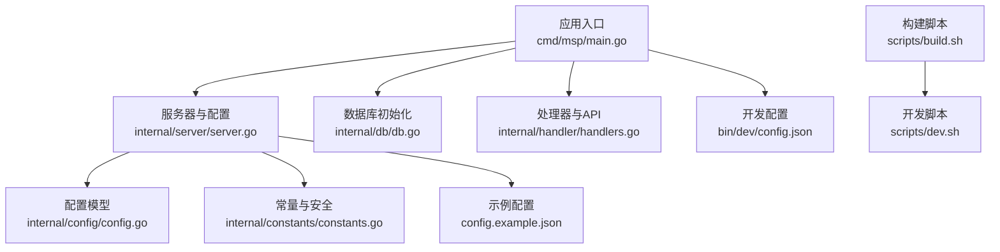
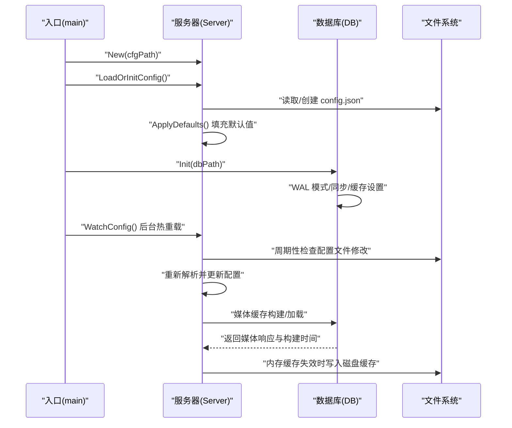
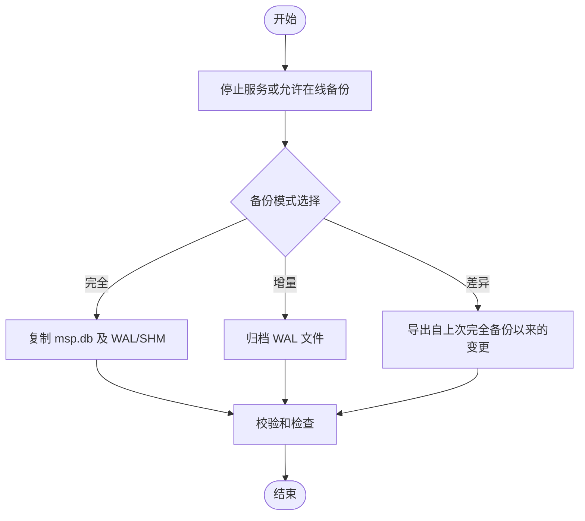
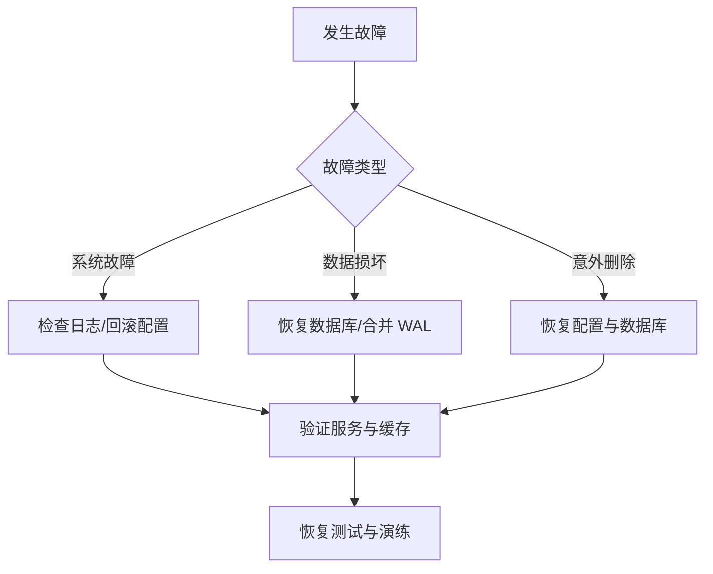
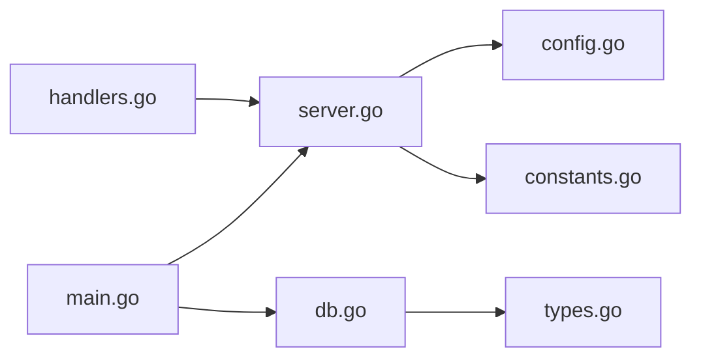

# 备份恢复

<cite>
**本文引用的文件**
- [cmd/msp/main.go](file://cmd/msp/main.go)
- [internal/db/db.go](file://internal/db/db.go)
- [internal/server/server.go](file://internal/server/server.go)
- [internal/config/config.go](file://internal/config/config.go)
- [internal/constants/constants.go](file://internal/constants/constants.go)
- [internal/handler/handlers.go](file://internal/handler/handlers.go)
- [bin/dev/config.json](file://bin/dev/config.json)
- [config.example.json](file://config.example.json)
- [scripts/build.sh](file://scripts/build.sh)
- [scripts/dev.sh](file://scripts/dev.sh)
- [docs/SECURITY.md](file://docs/SECURITY.md)
- [docs/SECURITY_QUICKSTART.md](file://docs/SECURITY_QUICKSTART.md)
- [docs/CONFIG_EXAMPLE.md](file://docs/CONFIG_EXAMPLE.md)
- [PERFORMANCE_ANALYSIS.md](file://PERFORMANCE_ANALYSIS.md)
- [SECURITY_AUDIT_REPORT.md](file://SECURITY_AUDIT_REPORT.md)
</cite>

## 目录
1. [简介](#简介)
2. [项目结构](#项目结构)
3. [核心组件](#核心组件)
4. [架构总览](#架构总览)
5. [详细组件分析](#详细组件分析)
6. [依赖关系分析](#依赖关系分析)
7. [性能考量](#性能考量)
8. [故障排查指南](#故障排查指南)
9. [结论](#结论)
10. [附录](#附录)

## 简介
本操作手册面向 MSP 的备份与恢复场景，围绕数据库备份策略（完全备份、增量备份、差异备份）、配置文件备份与重要性、数据完整性验证、灾难恢复流程、备份存储策略（本地/远程/云）、恢复测试与演练、自动化备份脚本与定时任务、以及备份数据的安全与加密进行系统化说明。文档同时结合代码实现与官方文档，给出可落地的操作步骤与最佳实践。

## 项目结构
MSP 的运行与备份密切相关的核心模块包括：
- 应用入口与启动：负责加载配置、初始化数据库、启动服务与路由注册
- 服务器与配置：负责配置文件的读取、默认值填充、热重载、日志与缓存
- 数据库层：负责 SQLite 初始化、WAL 模式、同步策略、连接池与迁移
- 配置模型：定义 config.json 的结构与默认值
- 常量与安全：端口、权限、日志轮转、会话与 PIN 等
- 文档与脚本：安全配置、示例配置、构建与开发脚本

图表来源
- [cmd/msp/main.go](file://cmd/msp/main.go#L26-L83)
- [internal/server/server.go](file://internal/server/server.go#L65-L131)
- [internal/db/db.go](file://internal/db/db.go#L32-L72)
- [internal/config/config.go](file://internal/config/config.go#L77-L146)
- [internal/constants/constants.go](file://internal/constants/constants.go#L8-L50)
- [internal/handler/handlers.go](file://internal/handler/handlers.go#L38-L43)
- [config.example.json](file://config.example.json#L1-L56)
- [bin/dev/config.json](file://bin/dev/config.json#L1-L56)
- [scripts/build.sh](file://scripts/build.sh#L150-L203)
- [scripts/dev.sh](file://scripts/dev.sh#L92-L131)

章节来源
- [cmd/msp/main.go](file://cmd/msp/main.go#L26-L83)
- [internal/server/server.go](file://internal/server/server.go#L65-L131)
- [internal/db/db.go](file://internal/db/db.go#L32-L72)
- [internal/config/config.go](file://internal/config/config.go#L77-L146)
- [internal/constants/constants.go](file://internal/constants/constants.go#L8-L50)
- [internal/handler/handlers.go](file://internal/handler/handlers.go#L38-L43)
- [config.example.json](file://config.example.json#L1-L56)
- [bin/dev/config.json](file://bin/dev/config.json#L1-L56)
- [scripts/build.sh](file://scripts/build.sh#L150-L203)
- [scripts/dev.sh](file://scripts/dev.sh#L92-L131)

## 核心组件
- 配置文件与热重载
  - 配置文件路径：可执行文件所在目录的 config.json
  - 加载与默认值填充：首次缺失时生成默认配置并保存；热重载周期检查文件修改时间并重新解析
  - 安全配置：IP 白名单、黑名单、PIN 认证
- 数据库与缓存
  - SQLite 初始化与 WAL 模式、同步策略、连接池
  - 媒体缓存：内存缓存 + 磁盘缓存（无数据库时）
- API 与日志
  - 配置读取与更新 API
  - 日志级别与轮转

章节来源
- [internal/server/server.go](file://internal/server/server.go#L76-L131)
- [internal/server/server.go](file://internal/server/server.go#L140-L188)
- [internal/db/db.go](file://internal/db/db.go#L32-L72)
- [internal/handler/handlers.go](file://internal/handler/handlers.go#L45-L66)
- [internal/server/server.go](file://internal/server/server.go#L190-L284)

## 架构总览
下图展示启动流程、配置与数据库交互、以及媒体缓存的构建与持久化：

图表来源
- [cmd/msp/main.go](file://cmd/msp/main.go#L26-L83)
- [internal/server/server.go](file://internal/server/server.go#L76-L131)
- [internal/server/server.go](file://internal/server/server.go#L140-L188)
- [internal/db/db.go](file://internal/db/db.go#L32-L72)

## 详细组件分析

### 数据库备份策略
- 完全备份
  - 适用：首次部署、重大升级前、迁移至新介质
  - 实施：停止服务后复制 msp.db 及其 WAL/SHM 文件；或在 WAL 模式下使用 SQLite 备份命令导出
  - 参考实现：SQLite 初始化与 WAL 设置
- 增量备份（基于 SQLite WAL）
  - 适用：频繁写入场景，降低停机时间
  - 实施：利用 WAL 模式，周期性归档 wal 文件；或使用 SQLite 的在线备份 API
  - 参考实现：WAL 模式与同步策略已在数据库初始化中启用
- 差异备份
  - 适用：在完全备份基础上仅备份自上次完全备份以来变化的数据
  - 实施：结合 WAL 归档与时间戳标记，提取增量记录；或通过应用层导出变更集
  - 注意：SQLite 本身不提供内置差异备份命令，需借助 WAL 归档与应用逻辑

章节来源
- [internal/db/db.go](file://internal/db/db.go#L32-L72)
- [SECURITY_AUDIT_REPORT.md](file://SECURITY_AUDIT_REPORT.md#L428-L438)

### 配置文件备份与重要性
- 重要性
  - config.json 包含端口、共享目录、功能开关、UI、播放策略、黑名单与安全策略等关键配置
  - 安全策略（IP 白名单、黑名单、PIN）直接影响访问控制
- 备份方法
  - 本地备份：直接复制 config.json 至安全位置
  - 远程/云备份：将配置文件上传至安全存储（见“备份存储策略”）
  - 版本化：保留历史版本，便于回滚
- 热重载与验证
  - 服务器周期性检查配置文件修改并自动重载
  - 建议在变更后查看日志确认重载成功

章节来源
- [internal/server/server.go](file://internal/server/server.go#L76-L131)
- [internal/server/server.go](file://internal/server/server.go#L140-L188)
- [docs/SECURITY.md](file://docs/SECURITY.md#L1-L188)
- [docs/SECURITY_QUICKSTART.md](file://docs/SECURITY_QUICKSTART.md#L1-L248)
- [docs/CONFIG_EXAMPLE.md](file://docs/CONFIG_EXAMPLE.md#L1-L202)

### 数据完整性验证
- 校验和检查
  - 构建产物提供 SHA-256 校验和文件，可用于验证二进制完整性
  - 备份文件同样建议生成与校验和，防止传输与存储过程中的损坏
- 数据一致性验证
  - 数据库层面：WAL 模式与同步策略提升一致性与可靠性
  - 应用层面：媒体缓存构建时使用弱 ETag 与构建时间，确保缓存一致性
  - 建议：在恢复后执行一次全量扫描或关键查询以验证数据可用性

章节来源
- [scripts/build.sh](file://scripts/build.sh#L69-L81)
- [internal/db/db.go](file://internal/db/db.go#L32-L72)
- [internal/server/server.go](file://internal/server/server.go#L520-L536)
- [SECURITY_AUDIT_REPORT.md](file://SECURITY_AUDIT_REPORT.md#L428-L438)

### 灾难恢复流程
- 系统故障
  - 快速定位：检查日志文件（msp.log），确认最近一次配置重载与缓存构建
  - 回滚：使用上一版本的 config.json 与数据库文件进行回滚
- 数据损坏
  - 若数据库损坏，使用完全备份恢复 msp.db；若存在 WAL 归档，可合并 WAL 恢复到最新时间点
  - 恢复后验证媒体缓存与播放进度数据
- 意外删除
  - 通过备份恢复 config.json 与数据库
  - 如无数据库，可从磁盘缓存重建（无数据库时的磁盘缓存）

章节来源
- [internal/server/server.go](file://internal/server/server.go#L190-L284)
- [internal/db/db.go](file://internal/db/db.go#L32-L72)
- [internal/server/server.go](file://internal/server/server.go#L487-L536)

### 备份存储策略
- 本地备份
  - 适合：快速恢复、低延迟
  - 建议：使用只读权限与物理隔离（如移动硬盘）
- 远程备份
  - 适合：异地容灾
  - 建议：通过安全通道（如 SFTP/SCP）传输，保留多版本
- 云存储
  - 适合：弹性扩展与集中管理
  - 建议：启用加密与访问控制，定期轮换密钥

[本节为通用策略说明，不直接分析具体文件]

### 恢复测试与演练
- 定期演练：在非生产环境导入备份，验证服务启动、缓存重建、播放功能
- 自动化脚本：结合定时任务执行备份与恢复测试
- 回滚预案：明确回滚步骤与验证清单

[本节为通用流程说明，不直接分析具体文件]

### 自动化备份脚本与定时任务
- 构建脚本与校验和
  - 构建完成后生成各平台二进制的 SHA-256 校验和文件，便于完整性验证
- 开发脚本
  - 开发环境脚本可作为模板，扩展为生产环境的备份与监控脚本
- 定时任务
  - Linux/macOS：使用 cron 定时执行备份脚本
  - Windows：使用任务计划程序

章节来源
- [scripts/build.sh](file://scripts/build.sh#L69-L81)
- [scripts/build.sh](file://scripts/build.sh#L150-L203)
- [scripts/dev.sh](file://scripts/dev.sh#L92-L131)

### 备份数据的安全性与加密
- 文件权限
  - 配置与日志文件采用严格权限（如 0600），避免未授权访问
- 传输加密
  - 远程/云传输建议使用加密通道（如 SFTP/HTTPS）
- 存储加密
  - 对备份文件进行加密存储，密钥与证书分离管理
- 会话与 PIN
  - PIN 认证与会话令牌用于 API 层访问控制，减少未授权操作风险

章节来源
- [internal/constants/constants.go](file://internal/constants/constants.go#L16-L23)
- [docs/SECURITY.md](file://docs/SECURITY.md#L1-L188)
- [docs/SECURITY_QUICKSTART.md](file://docs/SECURITY_QUICKSTART.md#L1-L248)
- [internal/server/server.go](file://internal/server/server.go#L570-L626)

## 依赖关系分析
- 组件耦合
  - 入口依赖服务器与数据库初始化
  - 服务器依赖配置模型与常量
  - 数据库依赖 GORM 与 SQLite 驱动
- 外部依赖
  - SQLite（WAL/同步/缓存）
  - GORM（迁移与事务控制）
  - HTTP 服务器（路由与中间件）

图表来源
- [cmd/msp/main.go](file://cmd/msp/main.go#L18-L25)
- [internal/server/server.go](file://internal/server/server.go#L23-L29)
- [internal/db/db.go](file://internal/db/db.go#L3-L16)
- [internal/config/config.go](file://internal/config/config.go#L3)
- [internal/constants/constants.go](file://internal/constants/constants.go#L5)
- [internal/handler/handlers.go](file://internal/handler/handlers.go#L18-L26)

章节来源
- [cmd/msp/main.go](file://cmd/msp/main.go#L18-L25)
- [internal/server/server.go](file://internal/server/server.go#L23-L29)
- [internal/db/db.go](file://internal/db/db.go#L3-L16)
- [internal/config/config.go](file://internal/config/config.go#L3)
- [internal/constants/constants.go](file://internal/constants/constants.go#L5)
- [internal/handler/handlers.go](file://internal/handler/handlers.go#L18-L26)

## 性能考量
- 数据库性能
  - WAL 模式、同步策略、连接池与缓存设置已优化
  - 建议：根据数据规模调整缓存大小与内存映射参数
- 媒体缓存
  - 内存缓存 + 磁盘缓存（无数据库时）提升启动与查询性能
- 日志轮转
  - 达到阈值自动轮转，避免日志过大影响性能

章节来源
- [PERFORMANCE_ANALYSIS.md](file://PERFORMANCE_ANALYSIS.md#L9-L79)
- [internal/db/db.go](file://internal/db/db.go#L32-L72)
- [internal/server/server.go](file://internal/server/server.go#L190-L284)

## 故障排查指南
- 配置热重载失败
  - 检查配置文件格式与权限；确认修改后日志提示已重载
- 数据库初始化失败
  - 检查数据库文件路径与权限；确认 WAL 模式设置成功
- 媒体缓存异常
  - 触发刷新或重建缓存；检查磁盘缓存写入与读取
- 日志问题
  - 检查日志文件路径与轮转条件；确认日志级别设置

章节来源
- [internal/server/server.go](file://internal/server/server.go#L76-L131)
- [internal/server/server.go](file://internal/server/server.go#L140-L188)
- [internal/db/db.go](file://internal/db/db.go#L32-L72)
- [internal/server/server.go](file://internal/server/server.go#L190-L284)

## 结论
通过结合 SQLite 的 WAL 模式、严格的文件权限与日志轮转、完善的配置热重载与安全策略，MSP 提供了可靠的备份与恢复基础。建议在现有基础上完善自动化备份脚本、定期演练恢复流程，并针对不同介质制定差异化的备份策略与加密方案，以满足生产环境的高可用与合规要求。

## 附录
- 配置文件示例与安全配置参考
  - 示例配置：config.example.json
  - 开发配置：bin/dev/config.json
  - 安全配置指南与快速开始
- 构建与开发脚本
  - 构建脚本：生成各平台二进制与校验和
  - 开发脚本：本地开发与热重载

章节来源
- [config.example.json](file://config.example.json#L1-L56)
- [bin/dev/config.json](file://bin/dev/config.json#L1-L56)
- [docs/SECURITY.md](file://docs/SECURITY.md#L1-L188)
- [docs/SECURITY_QUICKSTART.md](file://docs/SECURITY_QUICKSTART.md#L1-L248)
- [docs/CONFIG_EXAMPLE.md](file://docs/CONFIG_EXAMPLE.md#L1-L202)
- [scripts/build.sh](file://scripts/build.sh#L69-L81)
- [scripts/build.sh](file://scripts/build.sh#L150-L203)
- [scripts/dev.sh](file://scripts/dev.sh#L92-L131)