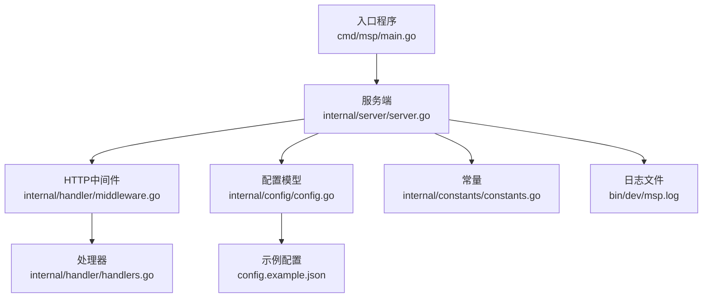
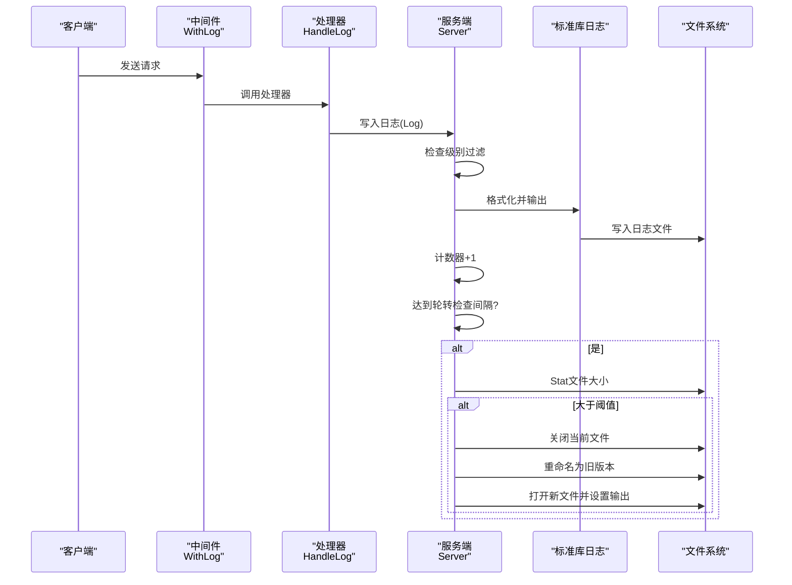
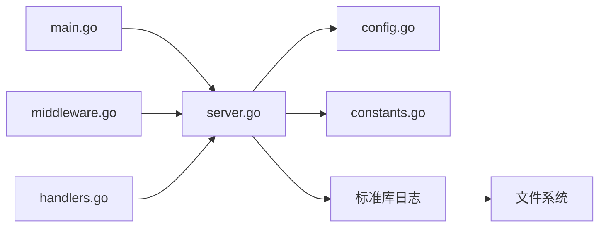

# 日志管理

<cite>
**本文引用的文件**
- [cmd/msp/main.go](file://cmd/msp/main.go)
- [internal/server/server.go](file://internal/server/server.go)
- [internal/handler/middleware.go](file://internal/handler/middleware.go)
- [internal/handler/handlers.go](file://internal/handler/handlers.go)
- [internal/config/config.go](file://internal/config/config.go)
- [internal/constants/constants.go](file://internal/constants/constants.go)
- [config.example.json](file://config.example.json)
- [bin/dev/msp.log](file://bin/dev/msp.log)
</cite>

## 目录
1. [简介](#简介)
2. [项目结构](#项目结构)
3. [核心组件](#核心组件)
4. [架构总览](#架构总览)
5. [详细组件分析](#详细组件分析)
6. [依赖关系分析](#依赖关系分析)
7. [性能考量](#性能考量)
8. [故障排查指南](#故障排查指南)
9. [结论](#结论)
10. [附录](#附录)

## 简介
本指南面向MSP日志管理，覆盖日志级别与分类、输出格式与结构、轮转策略、集中化方案、分析与检索、安全与隐私、清理与归档最佳实践。文档基于仓库中的实际实现进行说明，并提供可操作的配置与运维建议。

## 项目结构
MSP的日志体系由入口程序初始化、服务端统一日志接口、HTTP中间件记录请求、配置驱动的级别控制与文件落盘组成。关键位置如下：
- 入口：设置标准库日志标志位，加载配置后初始化日志输出到文件
- 服务端：提供统一日志接口、按级别过滤、按大小轮转
- 中间件：在请求完成后记录访问日志（含状态码、耗时、UA等）
- 配置：通过配置项控制日志级别与输出路径
- 示例配置：提供默认日志级别与输出文件示例

图表来源
- [cmd/msp/main.go](file://cmd/msp/main.go#L26-L83)
- [internal/server/server.go](file://internal/server/server.go#L190-L220)
- [internal/handler/middleware.go](file://internal/handler/middleware.go#L45-L52)
- [internal/handler/handlers.go](file://internal/handler/handlers.go#L235-L253)
- [internal/config/config.go](file://internal/config/config.go#L77-L88)
- [internal/constants/constants.go](file://internal/constants/constants.go#L25-L35)
- [config.example.json](file://config.example.json#L1-L56)
- [bin/dev/msp.log](file://bin/dev/msp.log#L1-L17)

章节来源
- [cmd/msp/main.go](file://cmd/msp/main.go#L26-L83)
- [internal/server/server.go](file://internal/server/server.go#L190-L220)
- [internal/handler/middleware.go](file://internal/handler/middleware.go#L45-L52)
- [internal/handler/handlers.go](file://internal/handler/handlers.go#L235-L253)
- [internal/config/config.go](file://internal/config/config.go#L77-L88)
- [internal/constants/constants.go](file://internal/constants/constants.go#L25-L35)
- [config.example.json](file://config.example.json#L1-L56)
- [bin/dev/msp.log](file://bin/dev/msp.log#L1-L17)

## 核心组件
- 日志初始化与输出
  - 入口程序设置标准库日志标志位，随后调用服务端初始化日志输出到文件
  - 服务端根据配置决定日志文件路径，确保目录存在并打开文件句柄
- 日志级别与过滤
  - 支持级别：debug、info、error、none
  - 过滤规则：error总是输出；info在info或debug级别下输出；debug仅在debug级别下输出
- 请求日志记录
  - 中间件在请求结束后记录方法、路径、状态码、用户代理、耗时等
  - 5xx状态自动提升为error级别
- 日志轮转
  - 基于大小的轮转：达到阈值时重命名当前文件为旧版本并重新打开新文件
  - 轮转检查频率：每N条日志检查一次，降低Stat开销
- 配置驱动
  - 通过配置项控制日志级别与输出文件路径
  - 默认级别为info，未指定输出路径时写入执行目录下的logs子目录

章节来源
- [cmd/msp/main.go](file://cmd/msp/main.go#L26-L44)
- [internal/server/server.go](file://internal/server/server.go#L190-L220)
- [internal/server/server.go](file://internal/server/server.go#L222-L248)
- [internal/server/server.go](file://internal/server/server.go#L250-L284)
- [internal/handler/middleware.go](file://internal/handler/middleware.go#L45-L52)
- [internal/handler/middleware.go](file://internal/handler/middleware.go#L286-L311)
- [internal/config/config.go](file://internal/config/config.go#L85-L86)
- [internal/constants/constants.go](file://internal/constants/constants.go#L25-L35)

## 架构总览
下面的序列图展示了从HTTP请求到日志落盘的关键流程，以及日志轮转触发点。

图表来源
- [internal/handler/middleware.go](file://internal/handler/middleware.go#L45-L52)
- [internal/handler/handlers.go](file://internal/handler/handlers.go#L235-L253)
- [internal/server/server.go](file://internal/server/server.go#L222-L248)
- [internal/server/server.go](file://internal/server/server.go#L250-L284)
- [internal/constants/constants.go](file://internal/constants/constants.go#L25-L35)

## 详细组件分析

### 日志级别与分类
- 支持级别
  - debug：仅在debug级别下输出
  - info：在info或debug级别下输出
  - error：在任何非none级别下输出
  - none：关闭所有日志输出
- 默认级别
  - 配置默认为info；若未显式设置则应用默认值
- 请求日志级别
  - 5xx状态码自动提升为error级别，便于快速定位异常

章节来源
- [internal/server/server.go](file://internal/server/server.go#L58-L63)
- [internal/server/server.go](file://internal/server/server.go#L222-L248)
- [internal/handler/middleware.go](file://internal/handler/middleware.go#L286-L311)
- [internal/config/config.go](file://internal/config/config.go#L143-L146)

### 日志输出格式与结构
- 时间戳
  - 使用固定格式字符串输出，包含年月日与时分秒及微秒
- 级别
  - 输出为大写形式，如DEBUG/INFO/ERROR
- 内容
  - 自定义消息文本
- 请求日志字段
  - 方法、路径、状态码、用户代理、耗时（毫秒）
- 示例日志片段
  - 展示了带时间戳与请求信息的典型行

章节来源
- [internal/server/server.go](file://internal/server/server.go#L239-L241)
- [internal/constants/constants.go](file://internal/constants/constants.go#L33-L35)
- [internal/handler/middleware.go](file://internal/handler/middleware.go#L286-L311)
- [bin/dev/msp.log](file://bin/dev/msp.log#L1-L17)

### 日志轮转策略
- 触发条件
  - 当前日志文件大小达到阈值时触发
- 轮转动作
  - 关闭当前文件句柄
  - 将当前文件重命名为旧版本文件
  - 重新打开新文件并设置为日志输出目标
- 性能优化
  - 每N条日志才检查一次文件大小，减少Stat调用频率
- 常量参数
  - 轮转阈值、检查间隔、时间格式等均以常量形式集中管理

章节来源
- [internal/server/server.go](file://internal/server/server.go#L250-L284)
- [internal/constants/constants.go](file://internal/constants/constants.go#L25-L35)

### 配置与初始化
- 初始化流程
  - 入口程序设置日志标志位
  - 加载或初始化配置
  - 服务端根据配置设置日志输出文件
- 配置项
  - logLevel：控制日志级别
  - logFile：控制日志文件路径（相对或绝对）
- 默认行为
  - 若未设置输出路径，默认写入执行目录logs子目录
  - 若未设置级别，默认为info

章节来源
- [cmd/msp/main.go](file://cmd/msp/main.go#L26-L44)
- [internal/server/server.go](file://internal/server/server.go#L190-L220)
- [internal/config/config.go](file://internal/config/config.go#L85-L86)
- [internal/config/config.go](file://internal/config/config.go#L143-L146)
- [config.example.json](file://config.example.json#L1-L56)

### 请求日志中间件
- 功能
  - 记录每次HTTP请求的详细信息
  - 自动识别新设备访问（非本地回环IP首次出现）
  - 将5xx状态码自动标记为error级别
- 输出内容
  - 方法、路径、状态码、用户代理、耗时（毫秒）
  - 新设备访问提示

章节来源
- [internal/handler/middleware.go](file://internal/handler/middleware.go#L45-L52)
- [internal/handler/middleware.go](file://internal/handler/middleware.go#L286-L311)

### API：远程注入日志
- 接口
  - POST /api/log
  - 请求体包含level与msg
- 行为
  - 解析请求体
  - 调用服务端日志接口写入
  - 成功返回无内容状态码

章节来源
- [internal/handler/handlers.go](file://internal/handler/handlers.go#L235-L253)
- [internal/types/types.go](file://internal/types/types.go#L108-L112)

## 依赖关系分析
- 组件耦合
  - 入口程序依赖服务端初始化日志
  - 服务端依赖配置与常量
  - 中间件依赖服务端日志接口
  - 处理器通过API接收外部日志请求
- 关键依赖链
  - main -> server.SetupLogger -> server.Log -> 标准库日志 -> 文件
  - middleware -> server.LogRequest -> server.Log
  - handlers.HandleLog -> server.Log

图表来源
- [cmd/msp/main.go](file://cmd/msp/main.go#L26-L44)
- [internal/server/server.go](file://internal/server/server.go#L190-L220)
- [internal/config/config.go](file://internal/config/config.go#L77-L88)
- [internal/constants/constants.go](file://internal/constants/constants.go#L25-L35)
- [internal/handler/middleware.go](file://internal/handler/middleware.go#L45-L52)
- [internal/handler/handlers.go](file://internal/handler/handlers.go#L235-L253)

## 性能考量
- 轮转检查频率
  - 每N条日志检查一次文件大小，降低Stat调用频率，平衡性能与及时性
- 日志级别过滤
  - 在写入前进行级别判断，避免不必要的格式化与IO
- 请求日志轻量
  - 仅记录必要字段，避免对高并发场景造成过大负担

章节来源
- [internal/server/server.go](file://internal/server/server.go#L243-L247)
- [internal/server/server.go](file://internal/server/server.go#L222-L248)

## 故障排查指南
- 无法写入日志文件
  - 检查日志目录权限与路径是否存在
  - 确认配置中的logFile是否正确
- 日志未按预期级别输出
  - 检查配置中的logLevel是否被正确应用
  - 确认请求日志中状态码是否导致级别提升
- 日志轮转未生效
  - 确认文件大小是否超过阈值
  - 检查轮转检查间隔是否触发
  - 查看是否有并发写入导致文件句柄问题

章节来源
- [internal/server/server.go](file://internal/server/server.go#L198-L220)
- [internal/server/server.go](file://internal/server/server.go#L250-L284)
- [internal/constants/constants.go](file://internal/constants/constants.go#L25-L35)

## 结论
MSP的日志系统以简洁高效为核心设计目标：通过配置驱动的日志级别、统一的服务端接口、基于大小的轮转策略与轻量的请求日志记录，满足开发调试、运行监控与问题定位的需求。结合集中化采集与分析工具，可进一步提升可观测性与运维效率。

## 附录

### 日志级别与用途速览
- debug：开发调试、内部诊断
- info：常规运行信息、请求访问日志
- error：错误与异常
- none：关闭日志输出

章节来源
- [internal/server/server.go](file://internal/server/server.go#L58-L63)
- [internal/config/config.go](file://internal/config/config.go#L143-L146)

### 输出字段说明
- 时间戳：精确到微秒
- 级别：大写形式
- 内容：自定义消息
- 请求日志扩展字段：方法、路径、状态码、用户代理、耗时（毫秒）

章节来源
- [internal/server/server.go](file://internal/server/server.go#L239-L241)
- [internal/constants/constants.go](file://internal/constants/constants.go#L33-L35)
- [internal/handler/middleware.go](file://internal/handler/middleware.go#L286-L311)

### 轮转配置与常量
- 轮转阈值：固定大小阈值
- 检查间隔：固定条数间隔
- 时间格式：固定格式字符串

章节来源
- [internal/constants/constants.go](file://internal/constants/constants.go#L25-L35)

### 集中化日志管理方案（概念性建议）
- 方案选择
  - ELK Stack：Elasticsearch + Logstash + Kibana
  - Fluentd/Fluent Bit：轻量采集与转发
  - OpenTelemetry：云原生可观测性栈
- 集成要点
  - 在服务端启用标准输出与文件双输出，便于容器或系统日志采集
  - 使用结构化日志（JSON）以便解析与检索
  - 配置索引模板与仪表板，支持关键词搜索、统计分析与趋势分析
  - 设置日志保留策略与归档任务，控制存储成本
- 注意事项
  - 传输加密与访问鉴权
  - 隐私与敏感信息脱敏
  - 合理的轮转与压缩策略，避免磁盘压力

[本节为概念性建议，不直接对应具体源码实现]

### 日志分析与检索方法（概念性建议）
- 关键词搜索：基于正则或布尔表达式
- 统计分析：按状态码、路径、UA、耗时等维度聚合
- 趋势分析：按时间窗口滚动统计错误率、吞吐量
- 告警联动：异常阈值触发告警

[本节为概念性建议，不直接对应具体源码实现]

### 日志安全与隐私保护（概念性建议）
- 最小化原则：仅记录必要字段
- 脱敏处理：对IP、路径、查询参数等敏感信息进行脱敏
- 存储安全：限制日志文件权限，定期审计访问
- 合规要求：遵循数据保护法规，明确留存期限

[本节为概念性建议，不直接对应具体源码实现]

### 日志清理与归档最佳实践（概念性建议）
- 清理策略：按大小与时间双重阈值清理
- 归档策略：压缩归档旧日志，保留关键指标
- 生命周期管理：设定保留周期，自动化清理过期日志
- 备份与恢复：定期备份重要日志，验证恢复流程

[本节为概念性建议，不直接对应具体源码实现]