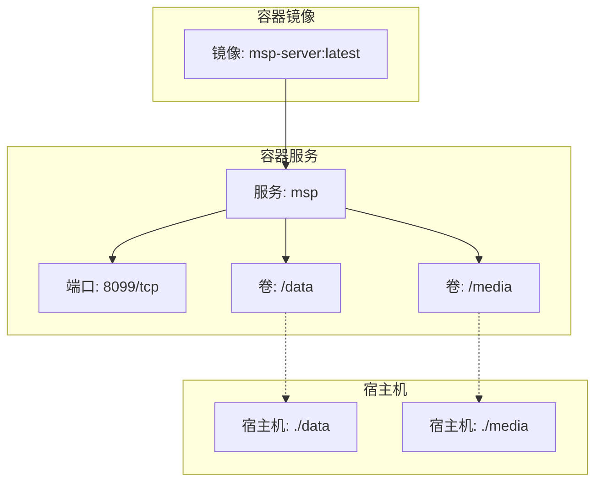
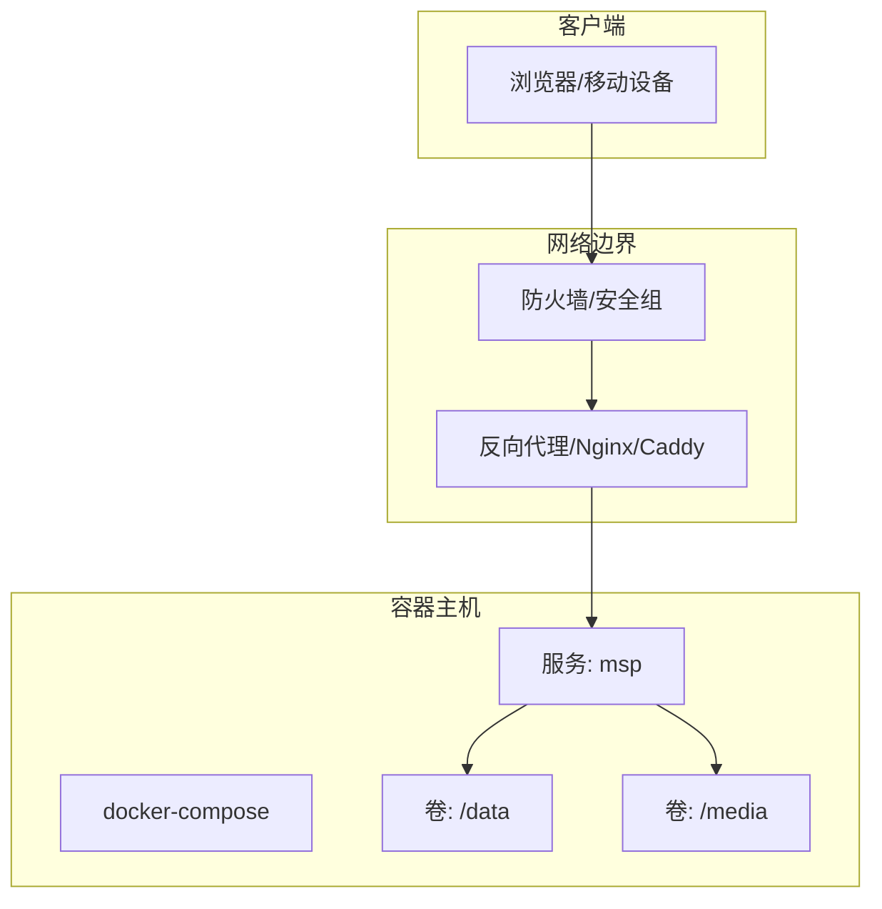
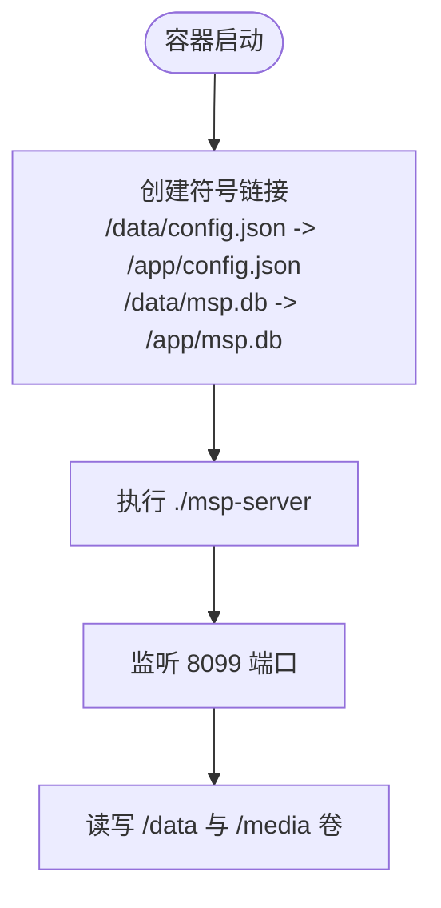
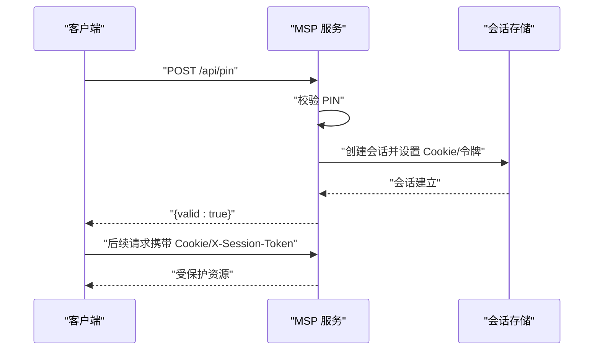
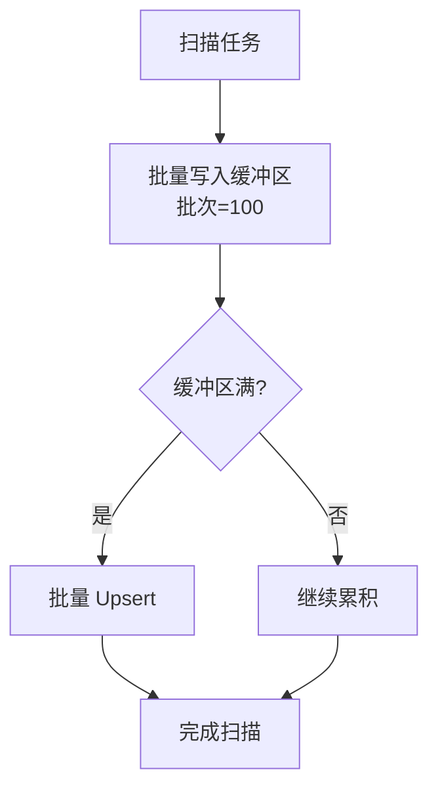
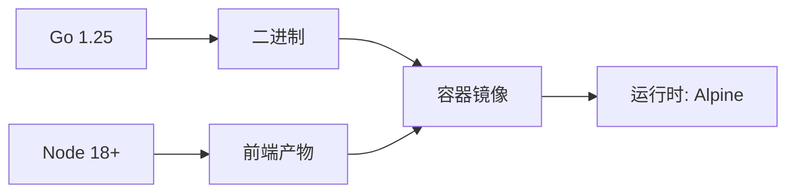

# 生产环境配置

<cite>
**本文引用的文件**
- [docker-compose.yml](file://docker-compose.yml)
- [Dockerfile](file://Dockerfile)
- [config.example.json](file://config.example.json)
- [internal/config/config.go](file://internal/config/config.go)
- [internal/config/validate.go](file://internal/config/validate.go)
- [internal/constants/constants.go](file://internal/constants/constants.go)
- [internal/server/server.go](file://internal/server/server.go)
- [docs/CONFIG_EXAMPLE.md](file://docs/CONFIG_EXAMPLE.md)
- [docs/SECURITY.md](file://docs/SECURITY.md)
- [docs/SECURITY_QUICKSTART.md](file://docs/SECURITY_QUICKSTART.md)
- [PERFORMANCE_ANALYSIS.md](file://PERFORMANCE_ANALYSIS.md)
- [README.md](file://README.md)
- [go.mod](file://go.mod)
- [scripts/build.sh](file://scripts/build.sh)
- [scripts/dev.sh](file://scripts/dev.sh)
</cite>

## 目录
1. [简介](#简介)
2. [项目结构](#项目结构)
3. [核心组件](#核心组件)
4. [架构总览](#架构总览)
5. [详细组件分析](#详细组件分析)
6. [依赖关系分析](#依赖关系分析)
7. [性能考虑](#性能考虑)
8. [故障排查指南](#故障排查指南)
9. [结论](#结论)
10. [附录](#附录)

## 简介
本文件面向生产环境，提供 MSP 的基础设施要求、容器化部署方案、网络与安全配置、资源限制与性能调优、以及不同部署场景的最佳实践。内容基于仓库中的配置文件、源码与文档，确保读者能够安全、稳定地在生产环境中部署与运维。

## 项目结构
MSP 采用前后端一体化的单二进制设计，后端使用 Go，前端使用 Vite 构建并打包到后端可嵌入的静态资源中。生产部署推荐使用 Docker 容器化方式，通过 docker-compose 管理服务生命周期与持久化存储。

图表来源
- [docker-compose.yml](file://docker-compose.yml#L1-L20)
- [Dockerfile](file://Dockerfile#L29-L49)

章节来源
- [docker-compose.yml](file://docker-compose.yml#L1-L20)
- [Dockerfile](file://Dockerfile#L1-L49)
- [README.md](file://README.md#L60-L72)

## 核心组件
- 配置系统：支持默认值注入、字段校验、热重载与安全裁剪（隐藏敏感字段）。
- 服务器：负责配置加载、日志、缓存、会话管理与安全策略执行。
- 数据库：SQLite（WAL 模式），配合 GORM 使用，支持批量写入与索引优化。
- 媒体处理：智能直连优先，必要时按需转码，支持并发限制与流式传输。
- 前端：Vite 构建，PWA 支持，静态资源内嵌至二进制。

章节来源
- [internal/config/config.go](file://internal/config/config.go#L77-L146)
- [internal/config/validate.go](file://internal/config/validate.go#L19-L58)
- [internal/server/server.go](file://internal/server/server.go#L31-L74)
- [PERFORMANCE_ANALYSIS.md](file://PERFORMANCE_ANALYSIS.md#L9-L79)

## 架构总览
下图展示生产环境的典型拓扑：容器内的 MSP 服务监听 8099 端口，通过卷挂载实现配置与媒体库持久化；反向代理可选地置于容器外，统一接入与 TLS 终止。

图表来源
- [docker-compose.yml](file://docker-compose.yml#L7-L19)
- [Dockerfile](file://Dockerfile#L41-L45)

## 详细组件分析

### 基础设施与系统要求
- 硬件建议
  - CPU：单核即可满足家庭场景；高并发或频繁转码场景建议多核。
  - 内存：建议 2GB+；转码密集场景建议 4GB+。
  - 存储：SSD 更佳；媒体库较大时预留充足空间。
- 操作系统兼容性
  - 后端：Linux/amd64/arm64、Windows/amd64、macOS/amd64/arm64。
  - 前端：Node.js 18+（构建阶段）。
- 网络端口
  - 默认监听端口：8099/TCP。
  - 建议仅在内网开放，如需公网访问，务必结合安全策略与反向代理。

章节来源
- [README.md](file://README.md#L84-L95)
- [internal/constants/constants.go](file://internal/constants/constants.go#L9-L14)
- [Dockerfile](file://Dockerfile#L41-L42)

### Docker 容器化部署
- 镜像构建
  - 多阶段构建：前端构建（Node）、后端构建（Go）、运行时（Alpine）。
  - 运行时镜像暴露 8099 端口，创建 /data 目录，设置 MSP_NO_AUTO_OPEN 环境变量。
- 服务编排
  - 端口映射：将容器 8099 映射到宿主机 8099。
  - 卷挂载：
    - ./data -> /data：持久化 config.json 与 msp.db。
    - ./media -> /media：媒体库根目录。
  - 启动入口：启动时创建符号链接将 /data/config.json 与 /data/msp.db 映射到 /app/config.json 与 /app/msp.db，便于统一卷管理。
- 环境变量
  - MSP_NO_AUTO_OPEN=1：避免容器启动时自动打开浏览器。

图表来源
- [docker-compose.yml](file://docker-compose.yml#L15-L19)
- [Dockerfile](file://Dockerfile#L35-L48)

章节来源
- [docker-compose.yml](file://docker-compose.yml#L1-L20)
- [Dockerfile](file://Dockerfile#L1-L49)

### 网络配置与端口映射
- 端口映射
  - 容器 8099 -> 宿主机 8099。
- 防火墙/安全组
  - 建议仅放通内网网段；如需公网访问，仅放通反向代理出口。
- 反向代理
  - 推荐使用 Nginx/Caddy：统一入口、TLS 终止、速率限制、访问日志。
  - 代理到容器 127.0.0.1:8099（或宿主机 8099，取决于网络模式）。

章节来源
- [docker-compose.yml](file://docker-compose.yml#L7-L8)
- [docs/SECURITY.md](file://docs/SECURITY.md#L169-L174)

### 安全配置
- IP 白名单与黑名单
  - 白名单优先级低于黑名单；支持单 IP 与 CIDR。
- PIN 认证
  - PIN 长度 4-8 位数字；验证成功后设置会话 Cookie，有效期 7 天。
  - 会话可通过 Cookie 或 X-Session-Token 传递。
- 配置热重载
  - 配置变更后约 2 秒生效；建议观察日志确认。

图表来源
- [docs/SECURITY.md](file://docs/SECURITY.md#L135-L167)
- [internal/constants/constants.go](file://internal/constants/constants.go#L45-L49)

章节来源
- [docs/SECURITY.md](file://docs/SECURITY.md#L1-L188)
- [docs/SECURITY_QUICKSTART.md](file://docs/SECURITY_QUICKSTART.md#L1-L248)
- [internal/config/config.go](file://internal/config/config.go#L56-L75)
- [internal/config/validate.go](file://internal/config/validate.go#L141-L176)

### 配置文件与模板
- 默认端口：8099；日志级别 info；日志文件相对可执行目录。
- 共享目录 shares：支持 label 与 path，重复校验。
- 播放行为：音频/视频/图片的启用、范围、转码、续播等。
- 黑名单：扩展名、文件名、文件夹、大小规则。
- 安全：IP 白名单、黑名单、PIN 开关与 PIN 值。

章节来源
- [config.example.json](file://config.example.json#L1-L56)
- [docs/CONFIG_EXAMPLE.md](file://docs/CONFIG_EXAMPLE.md#L1-L202)
- [internal/config/config.go](file://internal/config/config.go#L77-L88)
- [internal/config/validate.go](file://internal/config/validate.go#L90-L139)

### 性能调优与资源限制
- 数据库
  - WAL 模式、预编译语句缓存、单连接池、缓存大小、复合索引。
  - 建议：批量写入、临时表内存存储、内存映射、查询优化。
- 媒体处理
  - 并发转码限制为 2；H.264/AAC 直通优先；FFmpeg 参数优化。
  - 流式传输与缓冲池减少内存峰值。
- 缓存
  - 媒体列表缓存 TTL 2 分钟；可增加磁盘缓存与更高效键生成。
- 内存
  - GC 百分比与周期性释放；LRU 目录缓存；异常路径清理。
- 并发
  - 缓存重建信号量；细粒度锁；竞态修复（双重检查锁定）。

图表来源
- [PERFORMANCE_ANALYSIS.md](file://PERFORMANCE_ANALYSIS.md#L84-L127)

章节来源
- [PERFORMANCE_ANALYSIS.md](file://PERFORMANCE_ANALYSIS.md#L9-L147)
- [PERFORMANCE_ANALYSIS.md](file://PERFORMANCE_ANALYSIS.md#L151-L217)
- [PERFORMANCE_ANALYSIS.md](file://PERFORMANCE_ANALYSIS.md#L260-L297)
- [PERFORMANCE_ANALYSIS.md](file://PERFORMANCE_ANALYSIS.md#L301-L426)
- [PERFORMANCE_ANALYSIS.md](file://PERFORMANCE_ANALYSIS.md#L464-L586)

### 部署场景模板与最佳实践
- 家庭局域网
  - 仅允许 192.168.1.0/24；PIN 关闭。
- 小型办公
  - 多网段白名单；启用 PIN（如 628491）。
- 公网访问（不建议直连）
  - 仅放通单个公网 IP；启用 PIN（如 83927461）。
- 开发测试
  - 无限制；仅限本机调试。

章节来源
- [docs/SECURITY_QUICKSTART.md](file://docs/SECURITY_QUICKSTART.md#L180-L232)

## 依赖关系分析
- 运行时依赖
  - Go 1.25+；SQLite（modernc.org/sqlite）；GORM。
- 构建依赖
  - Node.js 18+（前端构建）；pnpm；交叉编译脚本。
- 容器镜像
  - 基于 Alpine；多阶段构建；运行时仅包含二进制与静态资源。

图表来源
- [go.mod](file://go.mod#L3-L9)
- [scripts/build.sh](file://scripts/build.sh#L126-L143)
- [Dockerfile](file://Dockerfile#L1-L49)

章节来源
- [go.mod](file://go.mod#L1-L31)
- [scripts/build.sh](file://scripts/build.sh#L1-L206)
- [Dockerfile](file://Dockerfile#L1-L49)

## 性能考虑
- 数据库
  - 使用 WAL、预编译、单连接池；建议添加复合索引与内存映射。
- 媒体处理
  - 控制并发转码；直通优先；流式传输；缓冲池。
- 缓存与内存
  - 缩短 TTL、分层缓存、LRU 目录缓存、定期清理。
- 并发与锁
  - 信号量限制后台任务；细粒度锁；竞态修复。

章节来源
- [PERFORMANCE_ANALYSIS.md](file://PERFORMANCE_ANALYSIS.md#L9-L147)
- [PERFORMANCE_ANALYSIS.md](file://PERFORMANCE_ANALYSIS.md#L151-L217)
- [PERFORMANCE_ANALYSIS.md](file://PERFORMANCE_ANALYSIS.md#L260-L297)
- [PERFORMANCE_ANALYSIS.md](file://PERFORMANCE_ANALYSIS.md#L301-L426)
- [PERFORMANCE_ANALYSIS.md](file://PERFORMANCE_ANALYSIS.md#L464-L586)

## 故障排查指南
- 配置校验
  - 端口范围 1-65535；日志级别合法；共享目录路径与标签非空且唯一；IP/CIDR 格式正确；PIN 4-8 位数字。
- 安全问题
  - 白名单未包含自身 IP 导致无法访问；黑名单优先级高于白名单；忘记 PIN 可编辑或删除 config.json。
- 热重载
  - 配置变更后约 2 秒生效；查看日志确认。
- 日志
  - 默认日志文件位于可执行目录 logs 子目录；可自定义日志文件路径。

章节来源
- [internal/config/validate.go](file://internal/config/validate.go#L19-L58)
- [docs/SECURITY_QUICKSTART.md](file://docs/SECURITY_QUICKSTART.md#L106-L135)
- [internal/server/server.go](file://internal/server/server.go#L140-L188)
- [internal/server/server.go](file://internal/server/server.go#L190-L200)

## 结论
通过 Docker 容器化与 docker-compose 编排，MSP 可在生产环境中实现稳定的媒体服务。结合内建的安全策略（IP 白/黑名单与 PIN）、完善的配置校验与热重载、以及针对数据库与媒体处理的性能优化，可在家庭与小型办公场景中获得良好的体验。公网直连不建议，如确需公网访问，务必配合反向代理与严格的安全策略。

## 附录
- 快速启动
  - 下载对应平台二进制，运行后在控制台查看访问地址；首次运行生成 config.json。
- 构建与发布
  - 使用脚本跨平台构建并生成校验文件；调试脚本支持热编译与前端联调。

章节来源
- [README.md](file://README.md#L60-L95)
- [scripts/build.sh](file://scripts/build.sh#L150-L201)
- [scripts/dev.sh](file://scripts/dev.sh#L92-L131)