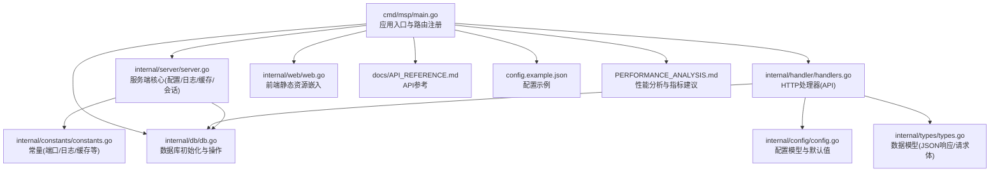
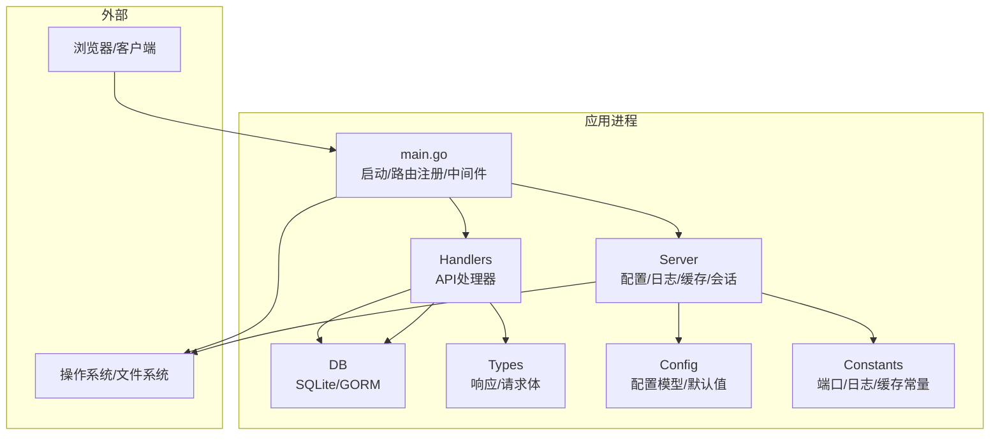
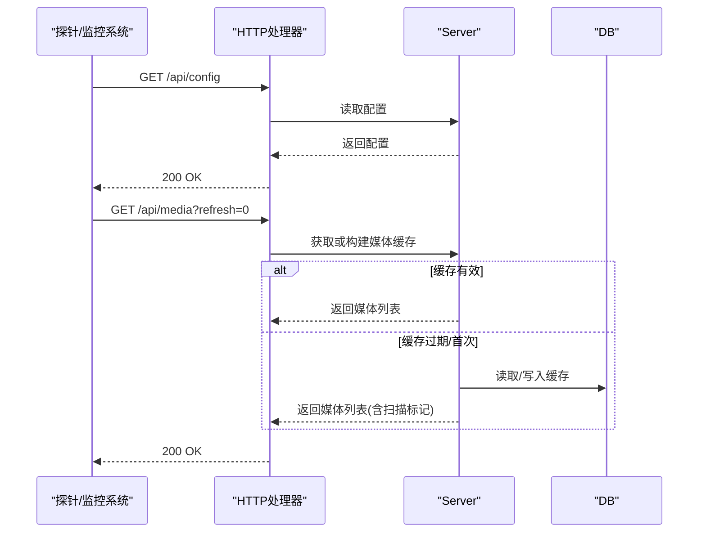
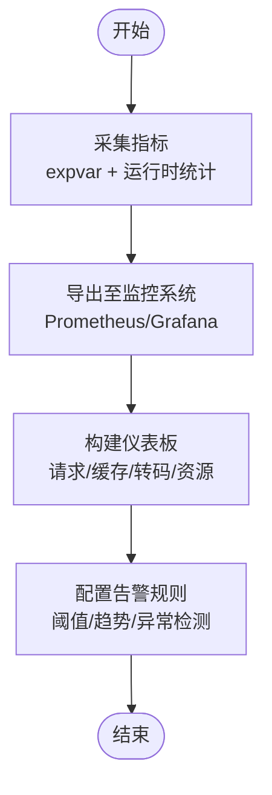
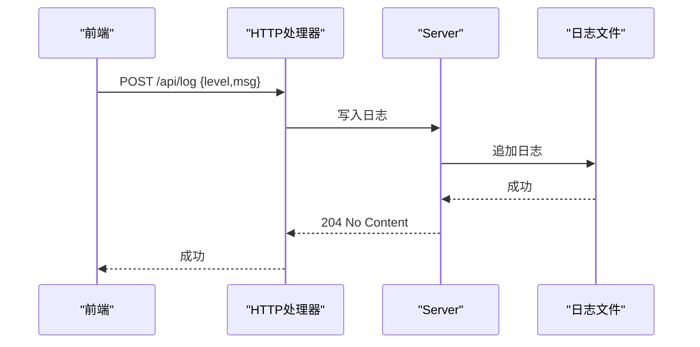
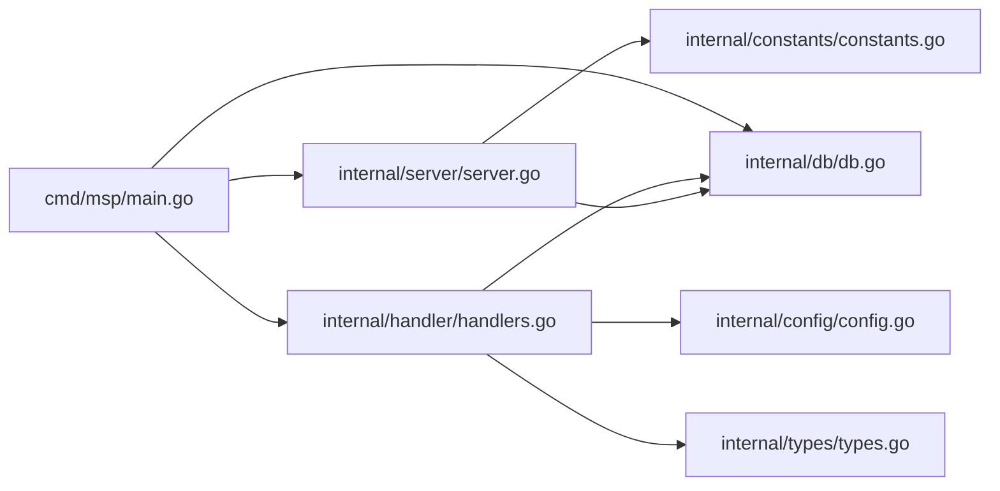

# 监控告警

<cite>
**本文引用的文件**
- [cmd\msp\main.go](file://cmd/msp/main.go)
- [internal\server\server.go](file://internal/server/server.go)
- [internal\handler\handlers.go](file://internal/handler/handlers.go)
- [internal\config\config.go](file://internal/config/config.go)
- [internal\db\db.go](file://internal/db/db.go)
- [internal\constants\constants.go](file://internal/constants/constants.go)
- [internal\types\types.go](file://internal/types/types.go)
- [docs\API_REFERENCE.md](file://docs/API_REFERENCE.md)
- [config.example.json](file://config.example.json)
- [PERFORMANCE_ANALYSIS.md](file://PERFORMANCE_ANALYSIS.md)
</cite>

## 目录
1. [简介](#简介)
2. [项目结构](#项目结构)
3. [核心组件](#核心组件)
4. [架构总览](#架构总览)
5. [详细组件分析](#详细组件分析)
6. [依赖关系分析](#依赖关系分析)
7. [性能考量](#性能考量)
8. [故障排查指南](#故障排查指南)
9. [结论](#结论)
10. [附录](#附录)

## 简介
本实施指南面向在本地局域网部署与运维 MSP 媒体分享服务的团队，围绕“健康检查端点”“性能指标监控”“日志聚合与分析”“告警规则配置”“监控仪表板搭建”“故障自愈与自动恢复”六个方面，提供可操作的落地步骤与最佳实践。文档严格基于仓库中的源码与文档，确保与实际实现一致。

## 项目结构
MSP 采用 Go 语言后端 + 前端静态资源嵌入的单体服务架构。核心入口负责初始化配置、数据库、日志与路由注册；服务端模块提供配置热重载、日志轮转、媒体缓存与会话管理；处理器模块承载 API 业务逻辑；类型与常量定义支撑配置、数据库模型与系统常量；性能分析文档提供了扩展指标采集的建议与实现路径。

图表来源
- [cmd\msp\main.go](file://cmd/msp/main.go#L26-L83)
- [internal\server\server.go](file://internal/server/server.go#L65-L74)
- [internal\handler\handlers.go](file://internal/handler/handlers.go#L38-L43)
- [internal\db\db.go](file://internal/db/db.go#L32-L72)
- [internal\config\config.go](file://internal/config/config.go#L77-L88)
- [internal\types\types.go](file://internal/types/types.go#L54-L66)
- [docs\API_REFERENCE.md](file://docs/API_REFERENCE.md#L1-L215)
- [config.example.json](file://config.example.json#L1-L56)
- [PERFORMANCE_ANALYSIS.md](file://PERFORMANCE_ANALYSIS.md#L875-L929)

章节来源
- [cmd\msp\main.go](file://cmd/msp/main.go#L26-L83)
- [docs\API_REFERENCE.md](file://docs/API_REFERENCE.md#L1-L215)

## 核心组件
- 应用入口与生命周期
  - 初始化日志、数据库、配置热重载、媒体缓存预热、路由注册与 HTTP 服务器启动。
- 服务端核心
  - 配置热重载、日志级别与轮转、请求日志记录、媒体缓存与 ETag、会话管理。
- 处理器模块
  - 提供配置、共享目录、媒体列表、流媒体、字幕、探针、进度、偏好、日志上报、PIN 认证等 API。
- 数据库
  - SQLite 初始化、连接池优化、迁移与常用 CRUD。
- 配置与类型
  - 配置模型、默认值填充、日志级别、安全策略、API 响应/请求体类型。

章节来源
- [cmd\msp\main.go](file://cmd/msp/main.go#L26-L83)
- [internal\server\server.go](file://internal/server/server.go#L65-L188)
- [internal\handler\handlers.go](file://internal/handler/handlers.go#L45-L621)
- [internal\db\db.go](file://internal/db/db.go#L32-L270)
- [internal\config\config.go](file://internal/config/config.go#L77-L146)
- [internal\types\types.go](file://internal/types/types.go#L54-L112)

## 架构总览
下图展示了 MSP 的关键组件交互与数据流，涵盖健康检查、日志、配置与数据库。

图表来源
- [cmd\msp\main.go](file://cmd/msp/main.go#L26-L83)
- [internal\server\server.go](file://internal/server/server.go#L65-L188)
- [internal\handler\handlers.go](file://internal/handler/handlers.go#L45-L621)
- [internal\db\db.go](file://internal/db/db.go#L32-L72)
- [internal\config\config.go](file://internal/config/config.go#L77-L88)
- [internal\types\types.go](file://internal/types/types.go#L54-L66)

## 详细组件分析

### 健康检查端点与存活/就绪探针
- 存活探针
  - 建议使用 GET /api/config 作为存活探针端点，该端点无需认证且返回当前配置，可快速判定服务可用性与基本健康状态。
- 就绪探针
  - 建议使用 GET /api/media?refresh=0 作为就绪探针端点，该端点会尝试读取或构建媒体缓存，若缓存未就绪则返回扫描标记，可用于判断服务是否完成媒体索引准备。
- 配置要点
  - 端口默认 8099，可通过配置覆盖；日志级别与文件路径可在配置中调整，便于定位问题。
  - 配置热重载：服务端周期检查配置文件修改并自动重载，减少人工干预。

图表来源
- [docs\API_REFERENCE.md](file://docs/API_REFERENCE.md#L12-L30)
- [docs\API_REFERENCE.md](file://docs/API_REFERENCE.md#L59-L84)
- [internal\handler\handlers.go](file://internal/handler/handlers.go#L333-L362)
- [internal\server\server.go](file://internal/server/server.go#L332-L396)

章节来源
- [docs\API_REFERENCE.md](file://docs/API_REFERENCE.md#L12-L30)
- [docs\API_REFERENCE.md](file://docs/API_REFERENCE.md#L59-L84)
- [internal\server\server.go](file://internal/server/server.go#L140-L188)

### 性能指标监控方案
- 指标采集
  - 建议在现有 expvar 指标基础上扩展：请求总数/平均耗时、缓存命中/未命中、转码活动/累计、内存分配/堆内存/GC 次数、协程数等。
  - 可参考性能分析文档中的指标采集与 /debug/vars 端点实现思路。
- 指标展示
  - 将 expvar 输出接入 Prometheus 抓取，再通过 Grafana 建立仪表板，展示 CPU 使用率、内存占用、磁盘空间、网络 I/O、请求延迟与吞吐等。
- 关键指标定义
  - 请求延迟：平均耗时、P95/P99 延迟。
  - 缓存效率：命中率、重建频率。
  - 转码负载：并发转码数、转码成功率。
  - 资源占用：内存分配、GC 次数、goroutine 数。
  - I/O 与磁盘：媒体扫描速率、数据库写入延迟、磁盘空间使用。

图表来源
- [PERFORMANCE_ANALYSIS.md](file://PERFORMANCE_ANALYSIS.md#L875-L929)

章节来源
- [PERFORMANCE_ANALYSIS.md](file://PERFORMANCE_ANALYSIS.md#L875-L929)

### 日志聚合与分析策略
- 结构化日志
  - 服务端日志已具备时间戳、级别与消息格式；建议在前端上报日志时统一结构化字段（如 level、msg、module、trace_id）。
- 日志级别
  - 支持 debug/info/error/nothing 四级；生产环境建议 info 或 error，避免噪声。
- 日志轮转
  - 超过阈值自动轮转，减少单文件过大带来的读写压力。
- 异常检测
  - 建议结合日志关键词（如 panic、error、failed、timeout）与异常分布进行异常检测与告警。
- 前端日志上报
  - 通过 POST /api/log 上报前端错误与调试信息，便于端到端问题定位。

图表来源
- [docs\API_REFERENCE.md](file://docs/API_REFERENCE.md#L204-L215)
- [internal\handler\handlers.go](file://internal/handler/handlers.go#L235-L253)
- [internal\server\server.go](file://internal/server/server.go#L190-L284)

章节来源
- [internal\server\server.go](file://internal/server/server.go#L190-L284)
- [internal\handler\handlers.go](file://internal/handler/handlers.go#L235-L253)
- [docs\API_REFERENCE.md](file://docs/API_REFERENCE.md#L204-L215)

### 告警规则配置
- 阈值设置
  - 请求错误率：连续 5 分钟内 5xx 错误占比超过阈值。
  - 延迟尖峰：P95 延迟超过阈值持续一段时间。
  - 缓存未命中率：缓存未命中比例过高。
  - 转码失败：转码失败次数/失败率超过阈值。
  - 资源占用：内存分配/堆内存/GC 次数/协程数异常升高。
  - 磁盘空间：可用空间低于阈值。
- 告警级别
  - 告警级别建议分三级：警告（Warn）、严重（Error）、危急（Critical）。
- 通知渠道
  - 邮件、IM（如钉钉/企业微信）、Webhook、PagerDuty 等。
- 异常检测
  - 基于规则与统计模型（如滑动窗口、指数平滑）识别异常波动与趋势。

章节来源
- [PERFORMANCE_ANALYSIS.md](file://PERFORMANCE_ANALYSIS.md#L875-L929)

### 监控仪表板搭建与可视化
- 指标来源
  - expvar 指标、运行时统计、数据库慢查询日志、系统级指标（CPU/内存/磁盘/网络）。
- 仪表板建议
  - 实时概览：请求总量、错误率、P95 延迟、缓存命中率。
  - 转码面板：并发转码数、转码成功率、失败原因分布。
  - 资源面板：内存分配、GC 次数、goroutine 数、磁盘空间。
  - 日志面板：错误/警告分布、异常关键字趋势。
- 可视化建议
  - 使用折线图、柱状图、热力图与表格组合呈现，支持时间轴缩放与钻取。

章节来源
- [PERFORMANCE_ANALYSIS.md](file://PERFORMANCE_ANALYSIS.md#L875-L929)

### 故障自愈与自动恢复
- 自愈机制
  - 数据库连接池与 WAL 模式：SQLite 已启用 WAL 与连接池优化，降低锁竞争与写入延迟。
  - 媒体缓存重建：缓存过期时后台异步重建，避免阻塞请求。
  - 日志轮转：达到阈值自动轮转，避免日志文件过大。
  - 内存管理：主动释放内存，降低内存压力。
- 自动恢复
  - 配置热重载：配置文件变更后自动重载，无需重启。
  - 会话清理：定期清理过期会话，避免会话表膨胀。
- 建议
  - 结合监控告警，对异常进行分级处置（自动降级、限流、隔离、重启）。

章节来源
- [internal\db\db.go](file://internal/db/db.go#L32-L72)
- [internal\server\server.go](file://internal/server/server.go#L140-L188)
- [internal\server\server.go](file://internal/server/server.go#L332-L441)
- [internal\server\server.go](file://internal/server/server.go#L570-L626)

## 依赖关系分析
- 组件耦合
  - main.go 依赖 server、handler、db、web 等模块；handler 依赖 server、db、types；server 依赖 config、constants。
- 外部依赖
  - SQLite(GORM)、expvar(性能指标)、FFmpeg(转码)、前端静态资源嵌入。
- 潜在循环依赖
  - 代码组织采用分层与接口隔离，未发现明显循环依赖。

图表来源
- [cmd\msp\main.go](file://cmd/msp/main.go#L18-L24)
- [internal\handler\handlers.go](file://internal/handler/handlers.go#L18-L26)
- [internal\server\server.go](file://internal/server/server.go#L31-L56)
- [internal\db\db.go](file://internal/db/db.go#L18)

章节来源
- [cmd\msp\main.go](file://cmd/msp/main.go#L18-L24)
- [internal\handler\handlers.go](file://internal/handler/handlers.go#L18-L26)
- [internal\server\server.go](file://internal/server/server.go#L31-L56)
- [internal\db\db.go](file://internal/db/db.go#L18)

## 性能考量
- 数据库性能
  - WAL 模式、预编译语句、单连接池、索引优化与批量写入。
- 媒体处理
  - 并发转码限制、智能转码策略、流式传输与缓冲池。
- 缓存策略
  - 内存缓存与 ETag、后台重建、缓存键优化。
- 内存与 GC
  - GC 百分比设置、定期释放内存、LRU 缓存淘汰。
- 并发与锁
  - 细粒度锁、原子计数器、信号量与 goroutine 监控。

章节来源
- [PERFORMANCE_ANALYSIS.md](file://PERFORMANCE_ANALYSIS.md#L9-L148)
- [PERFORMANCE_ANALYSIS.md](file://PERFORMANCE_ANALYSIS.md#L149-L297)
- [PERFORMANCE_ANALYSIS.md](file://PERFORMANCE_ANALYSIS.md#L299-L461)

## 故障排查指南
- 常见问题
  - 无法访问：确认端口与防火墙；检查配置文件与日志文件路径。
  - 媒体列表为空：检查共享目录权限与黑名单规则；尝试刷新缓存。
  - 转码失败：确认 FFmpeg 是否安装与可用；查看转码日志。
  - 日志过大：检查日志轮转阈值与目录权限。
- 排查步骤
  - 查看服务启动日志与端口绑定信息。
  - 使用 /api/config 与 /api/media 验证服务可用性与缓存状态。
  - 通过 /api/log 上报前端错误，辅助定位问题。
  - 检查数据库连接与迁移状态。

章节来源
- [cmd\msp\main.go](file://cmd/msp/main.go#L109-L123)
- [docs\API_REFERENCE.md](file://docs/API_REFERENCE.md#L12-L30)
- [docs\API_REFERENCE.md](file://docs/API_REFERENCE.md#L59-L84)
- [docs\API_REFERENCE.md](file://docs/API_REFERENCE.md#L204-L215)
- [internal\db\db.go](file://internal/db/db.go#L32-L72)

## 结论
本指南基于 MSP 代码库与文档，给出了健康检查端点、性能指标、日志与告警、仪表板与自愈机制的完整实施路径。建议在生产环境中结合 expvar 指标与系统级监控，建立完善的告警与自愈体系，确保服务稳定与可观测性。

## 附录
- API 参考与示例配置
  - API 参考文档与配置示例文件可作为部署与调优的权威依据。

章节来源
- [docs\API_REFERENCE.md](file://docs/API_REFERENCE.md#L1-L215)
- [config.example.json](file://config.example.json#L1-L56)