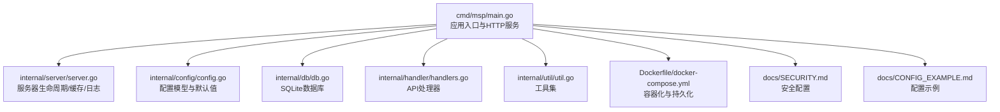
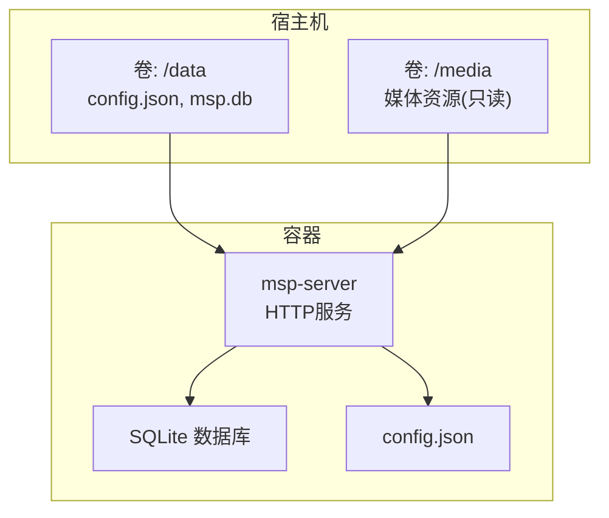
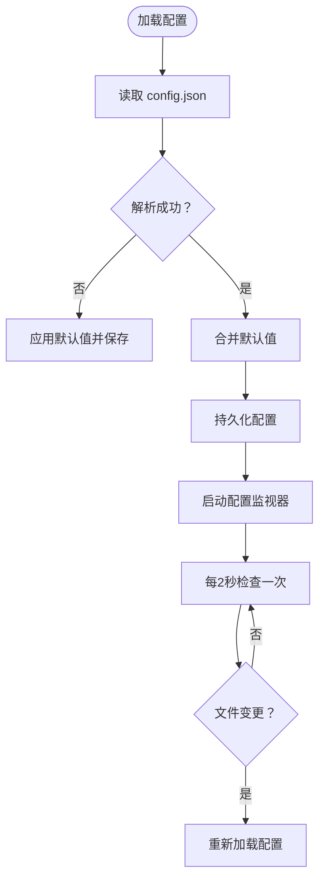
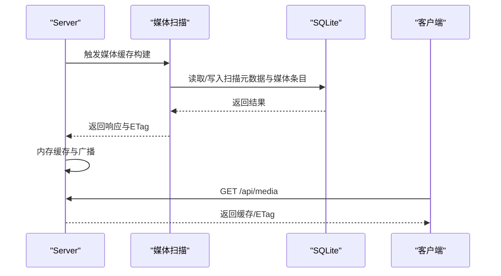
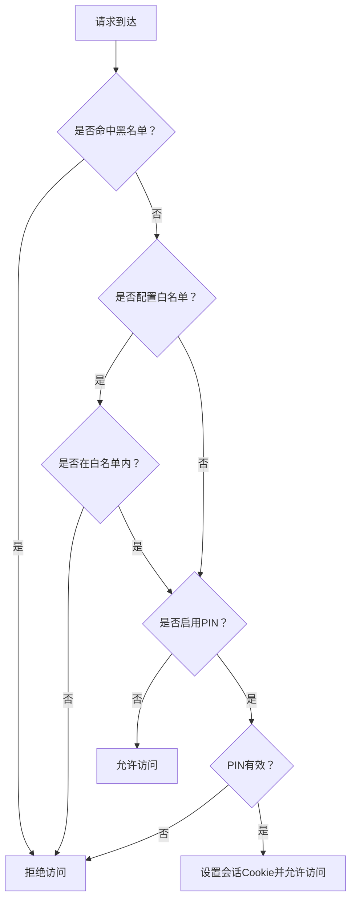
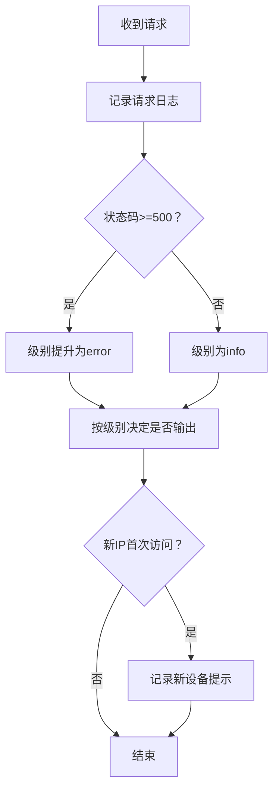
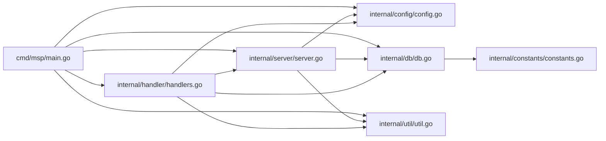

# 部署运维

<cite>
**本文引用的文件**
- [README.md](file://README.md)
- [config.example.json](file://config.example.json)
- [cmd/msp/main.go](file://cmd/msp/main.go)
- [internal/config/config.go](file://internal/config/config.go)
- [internal/constants/constants.go](file://internal/constants/constants.go)
- [internal/db/db.go](file://internal/db/db.go)
- [internal/handler/handlers.go](file://internal/handler/handlers.go)
- [internal/server/server.go](file://internal/server/server.go)
- [internal/util/util.go](file://internal/util/util.go)
- [Dockerfile](file://Dockerfile)
- [docker-compose.yml](file://docker-compose.yml)
- [docs/SECURITY.md](file://docs/SECURITY.md)
- [docs/CONFIG_EXAMPLE.md](file://docs/CONFIG_EXAMPLE.md)
- [scripts/build.sh](file://scripts/build.sh)
- [scripts/build.ps1](file://scripts/build.ps1)
- [scripts/dev.sh](file://scripts/dev.sh)
</cite>

## 目录
1. [简介](#简介)
2. [项目结构](#项目结构)
3. [核心组件](#核心组件)
4. [架构总览](#架构总览)
5. [详细组件分析](#详细组件分析)
6. [依赖关系分析](#依赖关系分析)
7. [性能考量](#性能考量)
8. [故障排查指南](#故障排查指南)
9. [结论](#结论)
10. [附录](#附录)

## 简介
本文件面向生产环境的部署与运维，围绕系统要求、网络与安全配置、监控与日志、备份与恢复、升级与维护、常见问题诊断以及运维自动化脚本进行系统化说明。MSP 是一个零外部依赖的单二进制媒体服务器，适合在家庭局域网内运行，亦可通过容器化方式部署。

## 项目结构
- 应用入口与主流程位于命令行模块，负责初始化配置、数据库、日志、路由注册与HTTP服务启动。
- 核心业务由内部模块提供：配置模型与默认值、常量定义、数据库（SQLite）、处理器（API）、服务器（生命周期与缓存）、工具（路径、IP、校验等）。
- 提供 Dockerfile 与 docker-compose.yml，便于容器化部署与持久化数据卷映射。
- 文档包含安全与配置示例，指导生产环境的安全加固与配置优化。

图表来源
- [cmd/msp/main.go](file://cmd/msp/main.go#L26-L83)
- [internal/server/server.go](file://internal/server/server.go#L65-L74)
- [internal/config/config.go](file://internal/config/config.go#L77-L88)
- [internal/db/db.go](file://internal/db/db.go#L32-L72)
- [internal/handler/handlers.go](file://internal/handler/handlers.go#L38-L107)
- [internal/util/util.go](file://internal/util/util.go#L116-L140)
- [Dockerfile](file://Dockerfile#L1-L49)
- [docker-compose.yml](file://docker-compose.yml#L1-L20)
- [docs/SECURITY.md](file://docs/SECURITY.md#L1-L188)
- [docs/CONFIG_EXAMPLE.md](file://docs/CONFIG_EXAMPLE.md#L1-L202)

章节来源
- [README.md](file://README.md#L1-L106)
- [cmd/msp/main.go](file://cmd/msp/main.go#L26-L83)
- [Dockerfile](file://Dockerfile#L1-L49)
- [docker-compose.yml](file://docker-compose.yml#L1-L20)

## 核心组件
- 配置系统：定义配置结构、默认值注入、热重载与持久化。
- 数据库层：基于 SQLite 的 GORM 实现，支持 WAL、同步模式与缓存调优。
- 服务器：统一管理配置、日志、媒体缓存、会话与请求日志。
- 处理器：提供配置、共享目录、媒体、流式播放、字幕、探测、IP、偏好、进度、日志上报、PIN 等 API。
- 工具集：路径规范化、IP 判定、大小解析、去重、随机令牌生成等。
- 容器化：多阶段构建、Alpine 运行时、数据卷映射、端口暴露与环境变量。

章节来源
- [internal/config/config.go](file://internal/config/config.go#L77-L146)
- [internal/db/db.go](file://internal/db/db.go#L32-L72)
- [internal/server/server.go](file://internal/server/server.go#L31-L74)
- [internal/handler/handlers.go](file://internal/handler/handlers.go#L28-L43)
- [internal/util/util.go](file://internal/util/util.go#L116-L140)
- [Dockerfile](file://Dockerfile#L26-L48)

## 架构总览
MSP 的生产部署建议采用容器化方案，结合持久化卷管理配置与数据库文件，通过反向代理或直接暴露端口提供服务。配置文件与数据库位于宿主机卷，媒体资源挂载为只读卷，确保稳定与可恢复性。

图表来源
- [Dockerfile](file://Dockerfile#L35-L48)
- [docker-compose.yml](file://docker-compose.yml#L9-L19)

## 详细组件分析

### 配置与默认值
- 配置结构覆盖日志、端口、共享目录、功能开关、UI、播放行为、黑名单与安全策略。
- 默认值注入策略：未设置字段自动填充为合理默认，保证最小可用配置。
- 热重载机制：后台轮询配置文件变更，2 秒周期检测，自动重载并记录日志。

图表来源
- [internal/config/config.go](file://internal/config/config.go#L94-L162)
- [internal/server/server.go](file://internal/server/server.go#L76-L112)
- [internal/server/server.go](file://internal/server/server.go#L140-L188)

章节来源
- [internal/config/config.go](file://internal/config/config.go#L77-L146)
- [internal/server/server.go](file://internal/server/server.go#L76-L112)
- [internal/server/server.go](file://internal/server/server.go#L140-L188)
- [docs/CONFIG_EXAMPLE.md](file://docs/CONFIG_EXAMPLE.md#L1-L202)

### 数据库与缓存
- 数据库：SQLite，启用 WAL、NORMAL 同步、2000 页面缓存，单连接避免锁竞争。
- 自动迁移：首次运行创建表结构。
- 媒体缓存：内存缓存 + ETag，TTL 2 分钟；支持磁盘缓存（无数据库时）；并发构建与广播通知。
- 进度与偏好：播放进度与用户偏好存储于数据库，支持批量写入与冲突更新。

图表来源
- [internal/db/db.go](file://internal/db/db.go#L32-L72)
- [internal/db/db.go](file://internal/db/db.go#L116-L142)
- [internal/db/db.go](file://internal/db/db.go#L144-L172)
- [internal/server/server.go](file://internal/server/server.go#L332-L396)

章节来源
- [internal/db/db.go](file://internal/db/db.go#L32-L72)
- [internal/db/db.go](file://internal/db/db.go#L116-L172)
- [internal/server/server.go](file://internal/server/server.go#L332-L396)

### 安全与访问控制
- IP 白名单/黑名单：支持单 IP 与 CIDR，黑名单优先级高于白名单。
- PIN 认证：启用后验证成功设置会话 Cookie，有效期 7 天；后续请求可携带 Cookie 或 X-Session-Token。
- 家庭模式：不信任代理头，仅使用 RemoteAddr 判定来源 IP。

图表来源
- [docs/SECURITY.md](file://docs/SECURITY.md#L11-L80)
- [docs/SECURITY.md](file://docs/SECURITY.md#L135-L167)
- [internal/handler/handlers.go](file://internal/handler/handlers.go#L255-L319)
- [internal/server/server.go](file://internal/server/server.go#L570-L626)

章节来源
- [docs/SECURITY.md](file://docs/SECURITY.md#L1-L188)
- [internal/handler/handlers.go](file://internal/handler/handlers.go#L255-L319)
- [internal/server/server.go](file://internal/server/server.go#L570-L626)

### 日志与监控
- 日志级别：debug/info/error/none；按级别输出。
- 日志文件：默认写入可执行目录下 logs 子目录，支持轮转（约 10MB 轮转）。
- 请求日志：记录方法、路径、状态码、User-Agent、耗时；5xx 级别提升为 error。
- 新设备检测：首次访问的非本地 IP 记录提示信息。

图表来源
- [internal/server/server.go](file://internal/server/server.go#L286-L311)
- [internal/server/server.go](file://internal/server/server.go#L222-L248)
- [internal/server/server.go](file://internal/server/server.go#L250-L284)
- [internal/constants/constants.go](file://internal/constants/constants.go#L25-L35)

章节来源
- [internal/server/server.go](file://internal/server/server.go#L190-L220)
- [internal/server/server.go](file://internal/server/server.go#L222-L248)
- [internal/server/server.go](file://internal/server/server.go#L286-L311)
- [internal/constants/constants.go](file://internal/constants/constants.go#L25-L35)

### API 与路由
- 路由注册：/api/config、/api/shares、/api/media、/api/stream、/api/subtitle、/api/probe、/api/ip、/api/prefs、/api/progress、/api/log、/api/pin。
- 中间件：日志、安全（PIN）、压缩（gzip）按序组合。
- 流式播放：优先直连，必要时转码；支持断点续播与缓存控制。

章节来源
- [cmd/msp/main.go](file://cmd/msp/main.go#L85-L107)
- [cmd/msp/main.go](file://cmd/msp/main.go#L65-L74)
- [internal/handler/handlers.go](file://internal/handler/handlers.go#L413-L446)
- [internal/handler/handlers.go](file://internal/handler/handlers.go#L513-L532)

### 容器化与持久化
- 多阶段构建：前端构建（Node）、后端构建（Go，CGO 禁用），最终运行在 Alpine。
- 端口：默认 8099，容器内 EXPOSE 并映射至宿主机。
- 卷：/data（config.json、msp.db）、/media（媒体资源），建议分离以实现只读挂载。
- 环境变量：MSP_NO_AUTO_OPEN=1，避免容器内自动打开浏览器。

章节来源
- [Dockerfile](file://Dockerfile#L1-L49)
- [docker-compose.yml](file://docker-compose.yml#L1-L20)

## 依赖关系分析
- 入口依赖：main.go 依赖 server、db、handler、util、webassets。
- 服务器依赖：config、constants、db、media、types、util。
- 处理器依赖：config、constants、db、media、server、service、types、util。
- 数据库依赖：sqlite 驱动、gorm、logger。
- 工具依赖：net、os、path/filepath、runtime、strconv、strings、sort。

图表来源
- [cmd/msp/main.go](file://cmd/msp/main.go#L18-L24)
- [internal/server/server.go](file://internal/server/server.go#L3-L29)
- [internal/handler/handlers.go](file://internal/handler/handlers.go#L3-L26)
- [internal/db/db.go](file://internal/db/db.go#L3-L16)
- [internal/config/config.go](file://internal/config/config.go#L3-L4)
- [internal/constants/constants.go](file://internal/constants/constants.go#L1-L115)

章节来源
- [cmd/msp/main.go](file://cmd/msp/main.go#L18-L24)
- [internal/server/server.go](file://internal/server/server.go#L3-L29)
- [internal/handler/handlers.go](file://internal/handler/handlers.go#L3-L26)
- [internal/db/db.go](file://internal/db/db.go#L3-L16)
- [internal/config/config.go](file://internal/config/config.go#L3-L4)
- [internal/constants/constants.go](file://internal/constants/constants.go#L1-L115)

## 性能考量
- 数据库连接：单连接 + WAL + NORMAL 同步 + 2000 页面缓存，降低锁竞争与 IO 抖动。
- 媒体缓存：内存缓存（2 分钟 TTL）+ ETag + 并发重建，减少重复扫描与数据库压力。
- 请求超时：读取超时 15 秒，空闲超时 60 秒，避免长时间连接占用。
- 转码策略：优先直连，仅在高风险容器或直连失败时转码，降低 CPU 占用。
- 日志轮转：按大小轮转，减少频繁 Stat 操作，降低 IO 压力。

章节来源
- [internal/db/db.go](file://internal/db/db.go#L54-L69)
- [internal/server/server.go](file://internal/server/server.go#L332-L396)
- [cmd/msp/main.go](file://cmd/msp/main.go#L67-L74)
- [internal/handler/handlers.go](file://internal/handler/handlers.go#L513-L532)
- [internal/server/server.go](file://internal/server/server.go#L250-L284)

## 故障排查指南
- 无法访问服务
  - 检查端口占用与防火墙策略，确认容器端口映射与宿主机开放。
  - 查看日志输出与容器启动日志，定位监听错误。
- 配置不生效
  - 确认 config.json 语法正确，保存后等待约 2 秒热重载生效。
  - 查看服务器日志中“Config reloaded successfully”提示。
- 媒体扫描异常
  - 检查共享目录权限与路径有效性，确认磁盘空间充足。
  - 若启用数据库，确认 msp.db 可写；若未启用数据库，确认磁盘缓存文件可写。
- 转码失败
  - 确认已安装 ffmpeg，检查转码策略与容器内可执行权限。
- PIN 无法登录
  - 确认 PIN 长度与字符范围（4-8 位数字），核对配置文件。
  - 如忘记 PIN，可编辑 config.json 修改或删除后使用默认值。
- 日志过大
  - 检查日志轮转阈值与轮转触发频率，必要时调整日志级别或外部采集。

章节来源
- [internal/server/server.go](file://internal/server/server.go#L140-L188)
- [internal/handler/handlers.go](file://internal/handler/handlers.go#L513-L532)
- [docs/SECURITY.md](file://docs/SECURITY.md#L176-L187)
- [internal/server/server.go](file://internal/server/server.go#L250-L284)

## 结论
MSP 通过零外部依赖与容器化部署，提供了简洁可靠的生产环境方案。结合合理的安全配置（IP 白名单/PIN）、完善的日志与缓存策略、以及可扩展的容器卷管理，可在家庭与小型办公环境中稳定运行。建议在生产中启用 IP 白名单与 PIN 认证，并配合外部日志与监控系统实现集中化可观测性。

## 附录

### 生产环境配置清单
- 系统要求
  - 操作系统：Linux/Windows/macOS（容器化推荐 Linux）。
  - 运行时：Alpine（容器镜像内置）。
  - 媒体转码：可选 ffmpeg（容器内需具备执行权限）。
- 网络配置
  - 端口：默认 8099，建议固定映射并在防火墙放通。
  - 反向代理：可选 Nginx/Traefik，注意 WebSocket 与长连接支持。
- 安全设置
  - IP 白名单：限定访问来源网段。
  - PIN 认证：启用并定期更换。
  - 会话管理：Cookie 有效期 7 天，支持 X-Session-Token。
- 日志与监控
  - 日志级别：info/trace（按需），建议集中化采集。
  - 监控指标：请求量、响应时间、错误率、媒体缓存命中率、数据库连接数。
- 备份与恢复
  - 备份对象：config.json、msp.db、媒体资源（可选）。
  - 恢复流程：停止服务 → 恢复文件 → 启动服务 → 验证配置与媒体缓存。
- 升级与维护
  - 升级策略：蓝绿/滚动更新，先拉取新镜像，再重启容器。
  - 配置迁移：遵循默认值注入策略，避免缺失字段。
  - 数据迁移：SQLite 为单文件，直接复制迁移即可。
- 运维自动化
  - 构建脚本：build.sh/build.ps1 支持跨平台交叉编译与校验和生成。
  - 开发脚本：dev.sh 提供前后端联调与热重载能力。
  - 容器编排：docker-compose.yml 提供一键部署与卷映射模板。

章节来源
- [docs/SECURITY.md](file://docs/SECURITY.md#L169-L187)
- [docs/CONFIG_EXAMPLE.md](file://docs/CONFIG_EXAMPLE.md#L178-L202)
- [scripts/build.sh](file://scripts/build.sh#L1-L206)
- [scripts/build.ps1](file://scripts/build.ps1#L1-L245)
- [scripts/dev.sh](file://scripts/dev.sh#L1-L175)
- [Dockerfile](file://Dockerfile#L1-L49)
- [docker-compose.yml](file://docker-compose.yml#L1-L20)