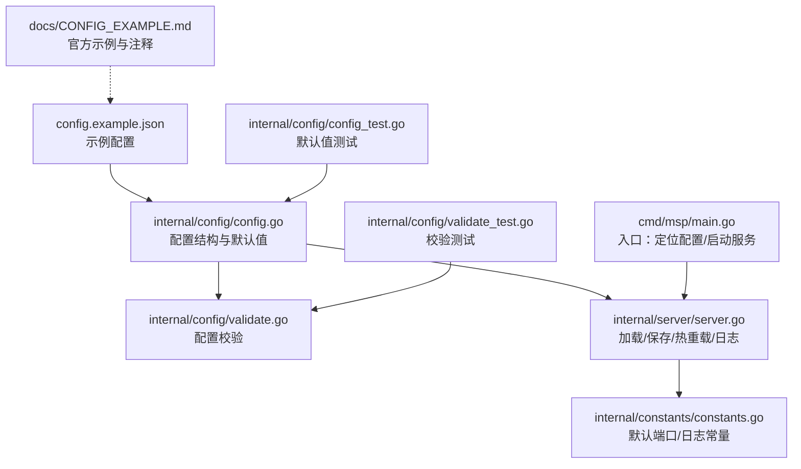
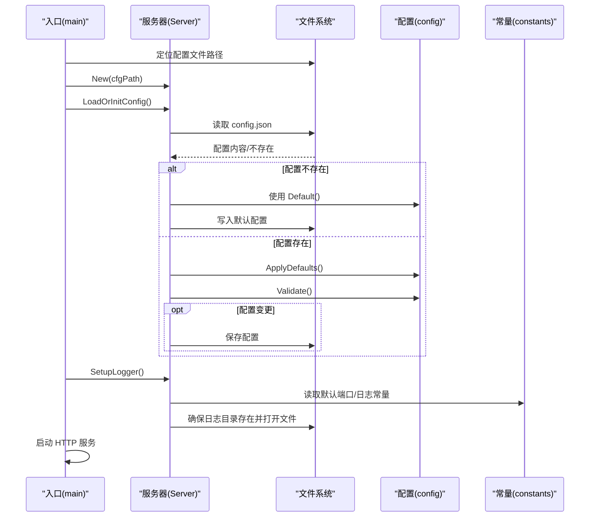
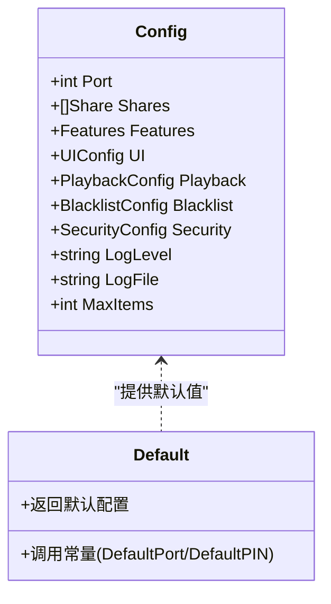
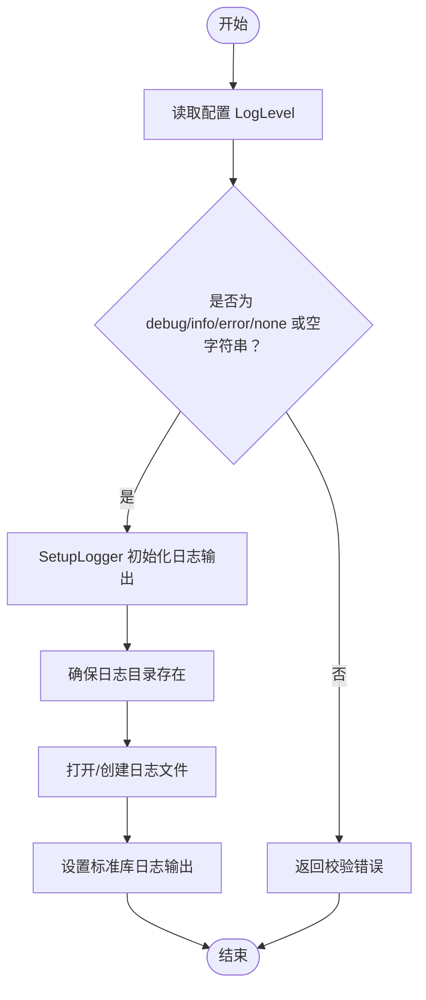
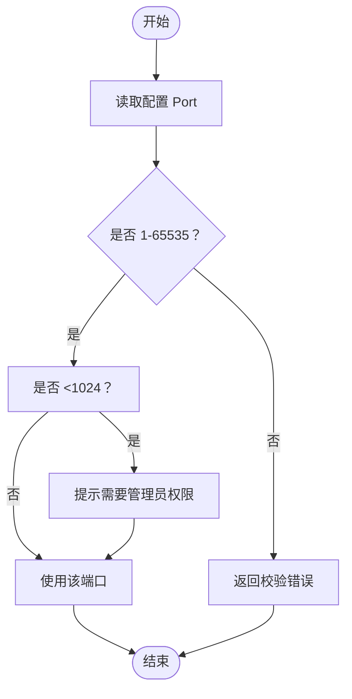
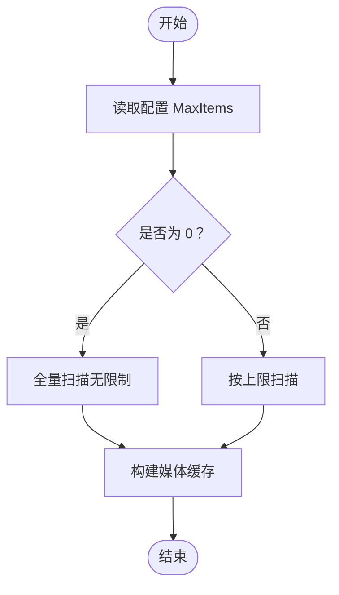
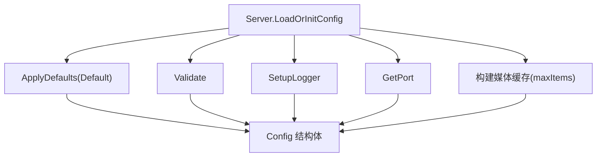

# 基础配置

<cite>
**本文引用的文件**
- [config.example.json](file://config.example.json)
- [internal/config/config.go](file://internal/config/config.go)
- [internal/config/validate.go](file://internal/config/validate.go)
- [internal/constants/constants.go](file://internal/constants/constants.go)
- [internal/server/server.go](file://internal/server/server.go)
- [cmd/msp/main.go](file://cmd/msp/main.go)
- [docs/CONFIG_EXAMPLE.md](file://docs/CONFIG_EXAMPLE.md)
- [internal/config/config_test.go](file://internal/config/config_test.go)
- [internal/config/validate_test.go](file://internal/config/validate_test.go)
</cite>

## 目录
1. [简介](#简介)
2. [项目结构](#项目结构)
3. [核心组件](#核心组件)
4. [架构总览](#架构总览)
5. [详细组件分析](#详细组件分析)
6. [依赖关系分析](#依赖关系分析)
7. [性能考量](#性能考量)
8. [故障排查指南](#故障排查指南)
9. [结论](#结论)
10. [附录](#附录)

## 简介
本章节聚焦于 MSP 项目的“基础配置”，重点解释 config.json 中的关键字段：logLevel（日志级别）、logFile（日志文件路径）、port（服务端口）、maxItems（最大项目数限制）。我们将从数据类型、默认值、有效范围、实际应用场景、最佳实践以及与代码实现的对应关系进行系统化说明，并给出配置文件的基本格式与语法要点。

## 项目结构
与基础配置直接相关的文件与职责如下：
- config.example.json：示例配置，展示 logLevel、logFile、port、maxItems 等字段的典型取值与注释。
- internal/config/config.go：定义配置结构体与默认值，包含 logLevel、logFile、port、maxItems 等字段及默认行为。
- internal/config/validate.go：提供配置校验逻辑，涵盖端口、日志级别、共享目录、安全、黑名单、播放范围等。
- internal/constants/constants.go：集中定义默认端口、默认 PIN、日志轮转阈值等常量。
- internal/server/server.go：负责加载/保存配置、热重载、日志初始化、端口读取、媒体扫描上限应用等。
- cmd/msp/main.go：程序入口，定位配置文件路径、初始化服务器、启动 HTTP 服务。
- docs/CONFIG_EXAMPLE.md：官方配置示例与注释文档，便于对照理解字段语义。
- 测试文件：internal/config/config_test.go、internal/config/validate_test.go，验证默认值与校验逻辑。

图表来源
- [config.example.json](file://config.example.json#L1-L56)
- [internal/config/config.go](file://internal/config/config.go#L77-L146)
- [internal/config/validate.go](file://internal/config/validate.go#L19-L88)
- [internal/constants/constants.go](file://internal/constants/constants.go#L9-L14)
- [internal/server/server.go](file://internal/server/server.go#L76-L125)
- [cmd/msp/main.go](file://cmd/msp/main.go#L26-L83)
- [docs/CONFIG_EXAMPLE.md](file://docs/CONFIG_EXAMPLE.md#L8-L24)
- [internal/config/config_test.go](file://internal/config/config_test.go#L5-L11)
- [internal/config/validate_test.go](file://internal/config/validate_test.go#L9-L63)

章节来源
- [config.example.json](file://config.example.json#L1-L56)
- [internal/config/config.go](file://internal/config/config.go#L77-L146)
- [internal/config/validate.go](file://internal/config/validate.go#L19-L88)
- [internal/constants/constants.go](file://internal/constants/constants.go#L9-L14)
- [internal/server/server.go](file://internal/server/server.go#L76-L125)
- [cmd/msp/main.go](file://cmd/msp/main.go#L26-L83)
- [docs/CONFIG_EXAMPLE.md](file://docs/CONFIG_EXAMPLE.md#L8-L24)
- [internal/config/config_test.go](file://internal/config/config_test.go#L5-L11)
- [internal/config/validate_test.go](file://internal/config/validate_test.go#L9-L63)

## 核心组件
本节聚焦基础配置项的定义、默认值、校验规则与运行时行为。

- logLevel（日志级别）
  - 数据类型：字符串
  - 默认值：未显式设置时，默认为 "info"
  - 有效范围：debug、info、error、none（大小写不敏感；空字符串也视为合法）
  - 实际应用场景：
    - 生产环境建议使用 "info" 或 "error"，平衡可观测性与日志体量
    - 开发调试建议使用 "debug"，获取更详细的内部流程日志
    - 若希望完全静默，可设为 "none"
  - 与实现的对应：
    - 默认值由 Default() 提供
    - 校验逻辑在 validateLogLevel 中，支持大小写不敏感与空字符串
    - 服务器按级别优先级决定是否输出日志

- logFile（日志文件路径）
  - 数据类型：字符串
  - 默认值：未显式设置时，服务器会在启动时自动补全为可执行文件所在目录下的 logs 子目录中的 msp.log
  - 有效范围：任意可写路径（相对路径基于可执行文件目录解析）
  - 实际应用场景：
    - 将日志输出到独立文件，便于运维收集与轮转
    - 在容器或受限环境中，确保目标路径存在且具备写权限
  - 与实现的对应：
    - 服务器 SetupLogger 会确保目录存在并打开文件，设置标准库日志输出
    - 日志轮转阈值与周期由常量控制

- port（服务端口）
  - 数据类型：整数
  - 默认值：未显式设置或为非正数时，使用默认端口 8099
  - 有效范围：1-65535，小于 1024 的端口需要管理员权限
  - 实际应用场景：
    - 局域网内默认使用 8099，避免冲突
    - 如需多实例部署，建议递增端口（如 8099、8100、8101…）
  - 与实现的对应：
    - 默认端口常量来自 constants.DefaultPort
    - 校验逻辑在 validatePort，包含范围与保留端口提示

- maxItems（最大项目数限制）
  - 数据类型：整数
  - 默认值：0 表示无限制（全量扫描），适合 SQLite 增量扫描场景
  - 有效范围：非负整数
  - 实际应用场景：
    - 大型媒体库或资源受限环境：设置合理上限以控制扫描耗时与内存占用
    - 小型家庭库：保持 0 以获得完整索引
  - 与实现的对应：
    - 服务器在构建媒体缓存时传入 maxItems，影响扫描深度
    - 常量中提供默认扫描限制与数据库扫描近似无限的上限

章节来源
- [internal/config/config.go](file://internal/config/config.go#L95-L146)
- [internal/config/validate.go](file://internal/config/validate.go#L75-L88)
- [internal/constants/constants.go](file://internal/constants/constants.go#L9-L14)
- [internal/server/server.go](file://internal/server/server.go#L190-L220)
- [internal/server/server.go](file://internal/server/server.go#L313-L320)
- [internal/server/server.go](file://internal/server/server.go#L400-L437)
- [internal/constants/constants.go](file://internal/constants/constants.go#L53-L59)

## 架构总览
下图展示配置从文件到运行时的加载、校验、应用与日志初始化的整体流程。

图表来源
- [cmd/msp/main.go](file://cmd/msp/main.go#L26-L83)
- [internal/server/server.go](file://internal/server/server.go#L76-L125)
- [internal/config/config.go](file://internal/config/config.go#L95-L146)
- [internal/config/validate.go](file://internal/config/validate.go#L19-L58)
- [internal/constants/constants.go](file://internal/constants/constants.go#L9-L14)

章节来源
- [cmd/msp/main.go](file://cmd/msp/main.go#L26-L83)
- [internal/server/server.go](file://internal/server/server.go#L76-L125)
- [internal/config/config.go](file://internal/config/config.go#L95-L146)
- [internal/config/validate.go](file://internal/config/validate.go#L19-L58)
- [internal/constants/constants.go](file://internal/constants/constants.go#L9-L14)

## 详细组件分析

### 配置结构与默认值
- 结构体字段与默认值来源：
  - logLevel 默认 "info"
  - logFile 默认空字符串，服务器启动时补齐为可执行目录下的 logs/msp.log
  - port 默认使用常量 DefaultPort（8099），若配置为非正数则回退
  - maxItems 默认 0（无限制）

图表来源
- [internal/config/config.go](file://internal/config/config.go#L77-L146)
- [internal/constants/constants.go](file://internal/constants/constants.go#L9-L14)

章节来源
- [internal/config/config.go](file://internal/config/config.go#L77-L146)
- [internal/constants/constants.go](file://internal/constants/constants.go#L9-L14)

### 日志级别与日志文件路径
- 日志级别校验：
  - 支持 debug、info、error、none（大小写不敏感），空字符串也视为合法
  - 服务器按优先级决定是否输出：error 总是输出；info 输出当级别为 info 或 debug；debug 仅当级别为 debug
- 日志文件路径：
  - 若未设置，服务器自动补齐为可执行目录/logs/msp.log
  - 服务器负责创建目录、打开文件并设置标准库日志输出
  - 日志轮转阈值与周期由常量控制，避免日志文件过大

图表来源
- [internal/config/validate.go](file://internal/config/validate.go#L75-L88)
- [internal/server/server.go](file://internal/server/server.go#L190-L220)
- [internal/constants/constants.go](file://internal/constants/constants.go#L27-L35)

章节来源
- [internal/config/validate.go](file://internal/config/validate.go#L75-L88)
- [internal/server/server.go](file://internal/server/server.go#L190-L220)
- [internal/constants/constants.go](file://internal/constants/constants.go#L27-L35)

### 端口配置
- 默认端口：8099（常量）
- 校验规则：
  - 必须为 1-65535
  - 小于 1024 的端口需要管理员权限
- 服务器读取端口：
  - 若配置为非正数，回退到默认端口
  - 启动 HTTP 服务时拼接 ":port"

图表来源
- [internal/config/validate.go](file://internal/config/validate.go#L61-L73)
- [internal/constants/constants.go](file://internal/constants/constants.go#L9-L14)
- [internal/server/server.go](file://internal/server/server.go#L313-L320)
- [cmd/msp/main.go](file://cmd/msp/main.go#L60-L64)

章节来源
- [internal/config/validate.go](file://internal/config/validate.go#L61-L73)
- [internal/constants/constants.go](file://internal/constants/constants.go#L9-L14)
- [internal/server/server.go](file://internal/server/server.go#L313-L320)
- [cmd/msp/main.go](file://cmd/msp/main.go#L60-L64)

### maxItems 对性能的影响
- 默认 0 表示无限制，适合 SQLite 增量扫描场景
- 设置上限可降低扫描时间与内存占用，适用于大型媒体库或资源受限环境
- 服务器在构建媒体缓存时将 maxItems 传入扫描流程，影响扫描深度

图表来源
- [internal/config/config.go](file://internal/config/config.go#L97-L98)
- [internal/server/server.go](file://internal/server/server.go#L400-L437)
- [internal/constants/constants.go](file://internal/constants/constants.go#L53-L59)

章节来源
- [internal/config/config.go](file://internal/config/config.go#L97-L98)
- [internal/server/server.go](file://internal/server/server.go#L400-L437)
- [internal/constants/constants.go](file://internal/constants/constants.go#L53-L59)

### 配置文件基本格式与语法
- JSON 格式：键名使用双引号，值支持字符串、数字、布尔、数组、对象
- 示例参考：config.example.json 与 docs/CONFIG_EXAMPLE.md
- 关键点：
  - 不支持注释（示例文档仅为说明用途）
  - 路径为字符串，相对路径基于可执行文件目录解析
  - 数值类型严格为整数或浮点数，布尔值为 true/false

章节来源
- [config.example.json](file://config.example.json#L1-L56)
- [docs/CONFIG_EXAMPLE.md](file://docs/CONFIG_EXAMPLE.md#L8-L24)

## 依赖关系分析
- 配置加载与默认值应用：
  - 服务器 LoadOrInitConfig 读取配置，ApplyDefaults 自动填充缺失字段
  - Default() 提供默认值，常量提供默认端口与默认 PIN
- 校验与安全：
  - Validate 统一校验端口、日志级别、共享目录、安全、黑名单、播放范围等
  - Sanitize 用于导出配置时清除敏感信息（如 PIN）
- 运行时应用：
  - SetupLogger 初始化日志输出
  - GetPort 读取端口并回退默认值
  - 构建媒体缓存时应用 maxItems

图表来源
- [internal/server/server.go](file://internal/server/server.go#L76-L125)
- [internal/config/config.go](file://internal/config/config.go#L95-L146)
- [internal/config/validate.go](file://internal/config/validate.go#L19-L58)
- [internal/server/server.go](file://internal/server/server.go#L190-L220)
- [internal/server/server.go](file://internal/server/server.go#L313-L320)
- [internal/server/server.go](file://internal/server/server.go#L400-L437)

章节来源
- [internal/server/server.go](file://internal/server/server.go#L76-L125)
- [internal/config/config.go](file://internal/config/config.go#L95-L146)
- [internal/config/validate.go](file://internal/config/validate.go#L19-L58)
- [internal/server/server.go](file://internal/server/server.go#L190-L220)
- [internal/server/server.go](file://internal/server/server.go#L313-L320)
- [internal/server/server.go](file://internal/server/server.go#L400-L437)

## 性能考量
- 日志级别选择：
  - "debug" 会产生大量日志，建议仅在开发或问题定位时使用
  - "info" 适合日常运维，兼顾可观测性与日志体量
  - "error" 仅记录错误，适合生产环境减少 IO
  - "none" 完全关闭日志，不建议长期使用
- 端口与并发：
  - 默认 8099 适合单实例；多实例建议递增端口
  - 小于 1024 端口需要管理员权限，避免启动失败
- maxItems 与扫描性能：
  - 0 表示全量扫描，适合 SQLite 增量扫描场景
  - 设置上限可显著降低扫描时间与内存占用，适合大型媒体库
- 日志轮转：
  - 服务器按阈值与周期进行轮转，避免日志文件过大影响磁盘与 IO

章节来源
- [internal/config/validate.go](file://internal/config/validate.go#L75-L88)
- [internal/constants/constants.go](file://internal/constants/constants.go#L27-L35)
- [internal/server/server.go](file://internal/server/server.go#L250-L284)
- [internal/server/server.go](file://internal/server/server.go#L400-L437)

## 故障排查指南
- 端口被占用或权限不足
  - 现象：启动失败或提示需要管理员权限
  - 排查：检查端口范围与是否小于 1024；确认权限
  - 参考：validatePort 校验逻辑
- 日志文件无法写入
  - 现象：日志输出异常或报错
  - 排查：确认 logFile 路径存在且具备写权限；检查目录是否存在
  - 参考：SetupLogger 初始化流程
- 配置热重载未生效
  - 现象：修改 config.json 后未立即生效
  - 排查：确认文件保存成功；等待约 2 秒；查看日志确认已重载
  - 参考：WatchConfig 监控与重载逻辑
- 配置校验失败
  - 现象：出现字段错误提示
  - 排查：对照 validate.go 中的校验规则修正
  - 参考：Validate 统一校验函数

章节来源
- [internal/config/validate.go](file://internal/config/validate.go#L61-L73)
- [internal/server/server.go](file://internal/server/server.go#L190-L220)
- [internal/server/server.go](file://internal/server/server.go#L140-L188)
- [internal/config/validate.go](file://internal/config/validate.go#L19-L58)

## 结论
- logLevel、logFile、port、maxItems 是 MSP 基础配置中最关键的四个字段
- 默认值与校验规则确保了配置的健壮性与易用性
- 运行时通过服务器统一加载、校验、应用与日志初始化
- 合理选择日志级别、端口与 maxItems，可在性能与可观测性之间取得平衡

## 附录
- 配置文件基本格式与语法要点
  - JSON 键名与字符串值使用双引号
  - 数值为整数或浮点数，布尔值为 true/false
  - 不支持注释（示例文档仅为说明用途）
- 示例参考
  - config.example.json 与 docs/CONFIG_EXAMPLE.md 提供字段说明与示例

章节来源
- [config.example.json](file://config.example.json#L1-L56)
- [docs/CONFIG_EXAMPLE.md](file://docs/CONFIG_EXAMPLE.md#L8-L24)