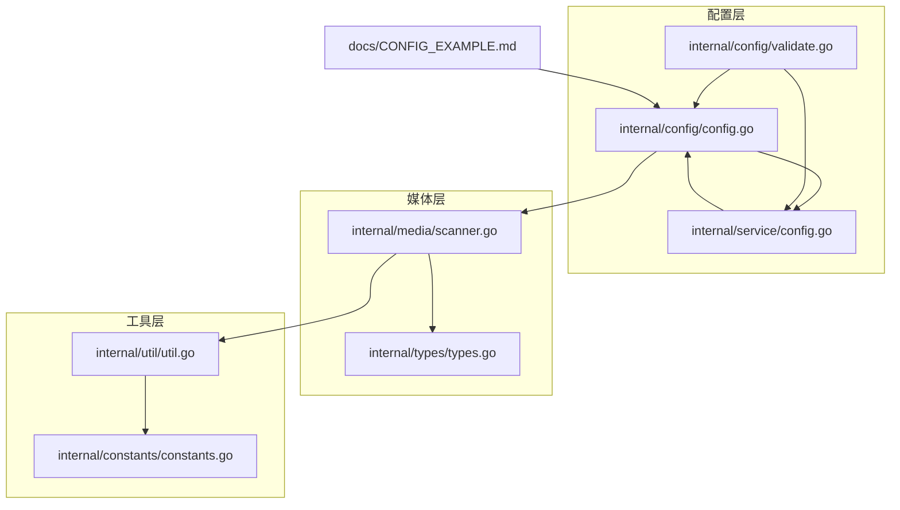
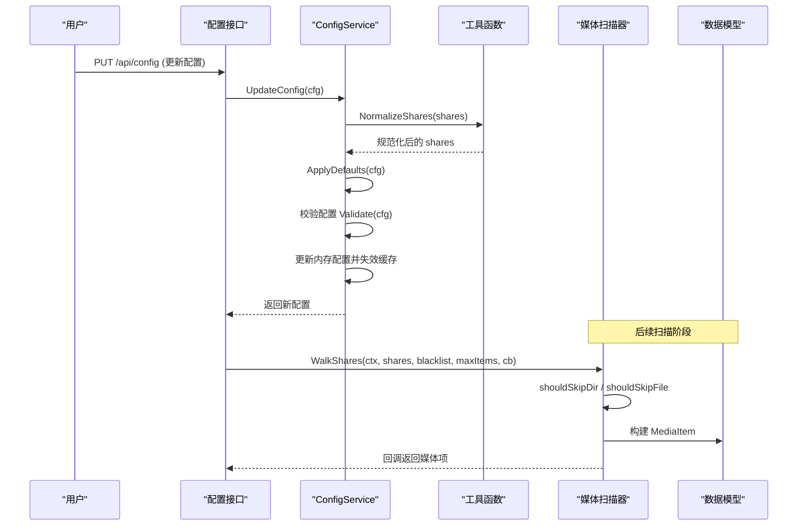
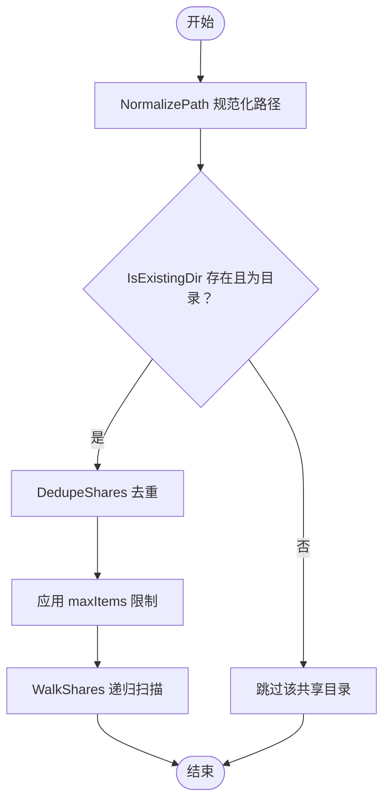
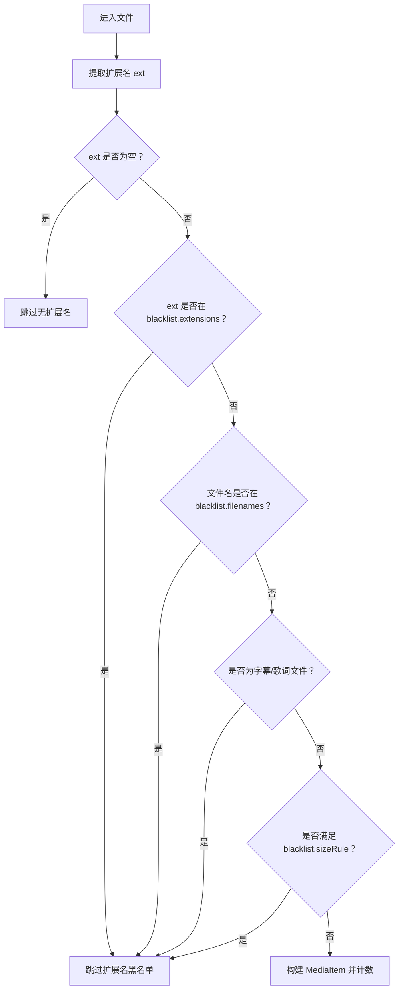
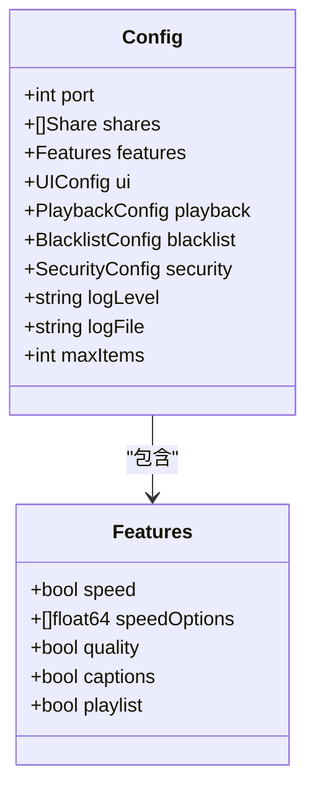
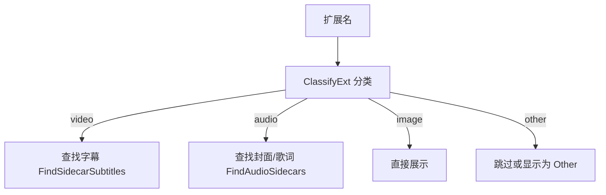
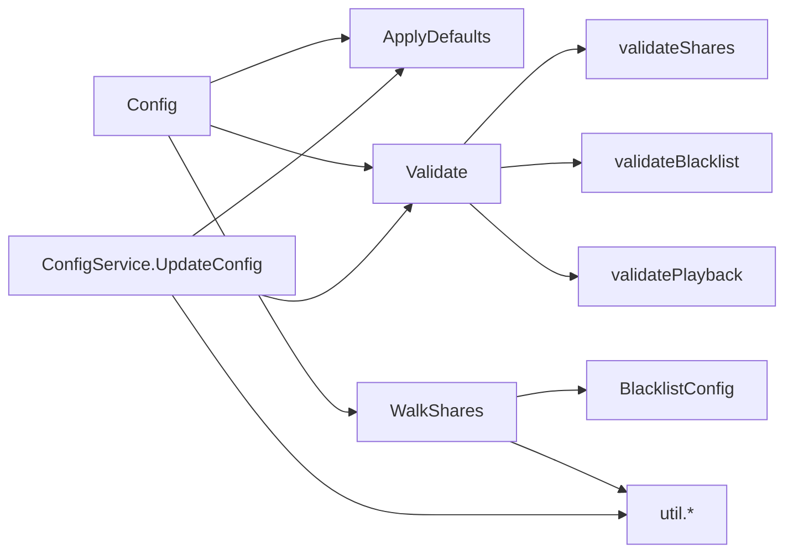

# 媒体配置

<cite>
**本文引用的文件**
- [config.example.json](file://config.example.json)
- [internal/config/config.go](file://internal/config/config.go)
- [internal/config/validate.go](file://internal/config/validate.go)
- [internal/media/scanner.go](file://internal/media/scanner.go)
- [internal/service/config.go](file://internal/service/config.go)
- [internal/util/util.go](file://internal/util/util.go)
- [internal/constants/constants.go](file://internal/constants/constants.go)
- [docs/CONFIG_EXAMPLE.md](file://docs/CONFIG_EXAMPLE.md)
- [internal/types/types.go](file://internal/types/types.go)
</cite>

## 目录
1. [简介](#简介)
2. [项目结构](#项目结构)
3. [核心组件](#核心组件)
4. [架构总览](#架构总览)
5. [详细组件分析](#详细组件分析)
6. [依赖关系分析](#依赖关系分析)
7. [性能考量](#性能考量)
8. [故障排查指南](#故障排查指南)
9. [结论](#结论)
10. [附录](#附录)

## 简介
本文件聚焦于 MSP 项目的媒体配置，围绕以下主题进行系统化说明：
- shares（共享目录）配置：目录路径格式、权限要求、去重与规范化、递归扫描限制
- blacklist（黑名单）配置：文件扩展名过滤、文件名匹配、文件夹排除、大小规则
- features（功能开关）：speed（速度控制）、quality（质量选择）、captions（字幕）、playlist（播放列表）
- 不同媒体类型的处理策略与推荐配置

## 项目结构
与媒体配置直接相关的模块分布如下：
- 配置模型与默认值：internal/config/config.go
- 配置校验：internal/config/validate.go
- 媒体扫描与黑名单逻辑：internal/media/scanner.go
- 配置服务与安全视图：internal/service/config.go
- 工具函数（路径规范化、去重、大小解析等）：internal/util/util.go
- 常量定义（端口、权限、扫描限制等）：internal/constants/constants.go
- 文档示例：docs/CONFIG_EXAMPLE.md
- 数据模型：internal/types/types.go

图表来源
- [internal/config/config.go](file://internal/config/config.go#L77-L88)
- [internal/config/validate.go](file://internal/config/validate.go#L19-L58)
- [internal/media/scanner.go](file://internal/media/scanner.go#L25-L57)
- [internal/service/config.go](file://internal/service/config.go#L12-L50)
- [internal/util/util.go](file://internal/util/util.go#L36-L140)
- [internal/constants/constants.go](file://internal/constants/constants.go#L8-L23)
- [docs/CONFIG_EXAMPLE.md](file://docs/CONFIG_EXAMPLE.md#L1-L202)

章节来源
- [internal/config/config.go](file://internal/config/config.go#L77-L88)
- [docs/CONFIG_EXAMPLE.md](file://docs/CONFIG_EXAMPLE.md#L1-L202)

## 核心组件
- 配置模型与默认值
  - shares：数组，元素为包含 label 与 path 的对象
  - blacklist：包含 extensions、filenames、folders、sizeRule
  - features：包含 speed、speedOptions、quality、captions、playlist
- 媒体扫描器
  - WalkShares：遍历共享目录，应用黑名单与扫描限制
  - shouldSkipFile/shouldSkipDir：黑名单匹配与跳过逻辑
  - ClassifyExt：媒体类型分类（video/audio/image/other）
- 配置服务
  - 安全视图：隐藏敏感字段（如 PIN），输出给前端
  - 更新配置：规范化路径、去重、校验有效性

章节来源
- [internal/config/config.go](file://internal/config/config.go#L5-L88)
- [internal/media/scanner.go](file://internal/media/scanner.go#L25-L146)
- [internal/service/config.go](file://internal/service/config.go#L12-L71)

## 架构总览
媒体配置在系统中的交互流程如下：

图表来源
- [internal/service/config.go](file://internal/service/config.go#L92-L122)
- [internal/util/util.go](file://internal/util/util.go#L101-L140)
- [internal/config/validate.go](file://internal/config/validate.go#L19-L58)
- [internal/media/scanner.go](file://internal/media/scanner.go#L25-L106)
- [internal/types/types.go](file://internal/types/types.go#L16-L32)

## 详细组件分析

### shares（共享目录）配置
- 结构与字段
  - label：共享目录的显示标签
  - path：共享目录的物理路径
- 路径格式与规范化
  - NormalizePath：去除多余空白、替换分隔符、转为绝对路径
  - IsExistingDir：确保路径存在且为目录
- 递归扫描与限制
  - WalkShares：遍历每个共享目录，应用 maxItems 限制与 dirCache 缓存
  - 默认扫描上限：常量定义的 DefaultScanLimit
- 去重与校验
  - DedupeShares：按路径去重（大小写不敏感）
  - validateShares：校验路径与标签非空、不允许重复
- 权限要求
  - 常量定义了文件与目录的默认权限（文件 0600，目录 0750）

图表来源
- [internal/util/util.go](file://internal/util/util.go#L36-L50)
- [internal/util/util.go](file://internal/util/util.go#L142-L146)
- [internal/util/util.go](file://internal/util/util.go#L101-L114)
- [internal/media/scanner.go](file://internal/media/scanner.go#L25-L57)
- [internal/constants/constants.go](file://internal/constants/constants.go#L53-L59)

章节来源
- [internal/config/config.go](file://internal/config/config.go#L13-L16)
- [internal/util/util.go](file://internal/util/util.go#L36-L50)
- [internal/util/util.go](file://internal/util/util.go#L101-L114)
- [internal/util/util.go](file://internal/util/util.go#L142-L146)
- [internal/media/scanner.go](file://internal/media/scanner.go#L25-L57)
- [internal/constants/constants.go](file://internal/constants/constants.go#L53-L59)
- [internal/config/validate.go](file://internal/config/validate.go#L90-L139)

### blacklist（黑名单）配置
- 组成部分
  - extensions：排除的文件扩展名（需包含点号）
  - filenames：排除的文件名
  - folders：排除的文件夹名
  - sizeRule：文件大小规则，支持比较与范围
- 匹配机制
  - shouldSkipDir：跳过以点开头的隐藏目录，以及匹配 folders 的目录
  - shouldSkipFile：跳过无扩展名、匹配 extensions/filenames、字幕/歌词文件；并应用 sizeRule
  - IsBlockedString：支持精确匹配与正则（/pattern/）
  - IsBlockedSize：支持 >=、<=、>、<、min-max 等格式
- 大小规则语法
  - 支持单位：KB、MB、GB、TB
  - 例如：">100MB"、"<1KB"、"100MB-1GB"

图表来源
- [internal/media/scanner.go](file://internal/media/scanner.go#L121-L146)
- [internal/media/scanner.go](file://internal/media/scanner.go#L181-L203)
- [internal/media/scanner.go](file://internal/media/scanner.go#L205-L231)

章节来源
- [internal/config/config.go](file://internal/config/config.go#L49-L54)
- [internal/media/scanner.go](file://internal/media/scanner.go#L121-L146)
- [internal/media/scanner.go](file://internal/media/scanner.go#L181-L231)
- [internal/config/validate.go](file://internal/config/validate.go#L242-L267)
- [internal/config/validate.go](file://internal/config/validate.go#L279-L310)
- [internal/util/util.go](file://internal/util/util.go#L52-L78)

### features（功能开关）
- speed：启用播放速度控制
- speedOptions：可选的速度列表，默认包含常见倍速
- quality：启用画质选择（默认关闭）
- captions：启用字幕功能
- playlist：启用播放列表功能

图表来源
- [internal/config/config.go](file://internal/config/config.go#L5-L11)
- [internal/config/config.go](file://internal/config/config.go#L77-L88)

章节来源
- [config.example.json](file://config.example.json#L7-L20)
- [internal/config/config.go](file://internal/config/config.go#L100-L106)
- [docs/CONFIG_EXAMPLE.md](file://docs/CONFIG_EXAMPLE.md#L26-L45)

### 媒体类型处理策略
- 分类依据
  - ClassifyExt：根据扩展名大小写不敏感分类为 video/audio/image/other
- 字幕与歌词
  - FindSidecarSubtitles：查找与媒体同目录的字幕文件（.vtt/.srt/.ass/.ssa）
  - FindAudioSidecars：查找封面与歌词（.lrc）
- MIME 与转码策略
  - 前端根据配置决定是否允许转码
  - 后端根据容器与编解码能力决定直连或转码

图表来源
- [internal/media/scanner.go](file://internal/media/scanner.go#L233-L246)
- [internal/media/scanner.go](file://internal/media/scanner.go#L259-L285)
- [internal/media/scanner.go](file://internal/media/scanner.go#L490-L561)

章节来源
- [internal/media/scanner.go](file://internal/media/scanner.go#L233-L246)
- [internal/media/scanner.go](file://internal/media/scanner.go#L259-L285)
- [internal/media/scanner.go](file://internal/media/scanner.go#L490-L561)
- [internal/types/types.go](file://internal/types/types.go#L8-L32)

## 依赖关系分析
- 配置模型与默认值
  - Config 包含 Features、BlacklistConfig、PlaybackConfig、SecurityConfig 等嵌套结构
  - ApplyDefaults 为缺失字段填充默认值
- 配置校验
  - Validate 对端口、日志级别、shares、security、blacklist、playback 进行校验
  - validateShares、validateBlacklist、validateSizeRule 等具体规则
- 媒体扫描
  - WalkShares 依赖 BlacklistConfig 与 util 工具函数
  - shouldSkipFile/shouldSkipDir 实现黑名单匹配
- 配置服务
  - UpdateConfig 中调用 ApplyDefaults、NormalizeShares、DedupeShares
  - 安全视图隐藏敏感字段（如 PIN）

图表来源
- [internal/config/config.go](file://internal/config/config.go#L148-L162)
- [internal/config/validate.go](file://internal/config/validate.go#L19-L58)
- [internal/media/scanner.go](file://internal/media/scanner.go#L25-L57)
- [internal/service/config.go](file://internal/service/config.go#L92-L122)

章节来源
- [internal/config/config.go](file://internal/config/config.go#L148-L162)
- [internal/config/validate.go](file://internal/config/validate.go#L19-L58)
- [internal/media/scanner.go](file://internal/media/scanner.go#L25-L57)
- [internal/service/config.go](file://internal/service/config.go#L92-L122)

## 性能考量
- 扫描限制
  - 默认扫描上限由常量 DefaultScanLimit 控制，避免大规模扫描导致资源占用过高
- 目录缓存
  - shareWalker.dirCache：减少重复读取目录的开销
- 路径规范化与去重
  - NormalizePath 与 DedupeShares 减少无效 IO 与重复处理
- 大小规则解析
  - ParseSize 支持单位解析，避免字符串处理开销

章节来源
- [internal/constants/constants.go](file://internal/constants/constants.go#L53-L59)
- [internal/media/scanner.go](file://internal/media/scanner.go#L37-L38)
- [internal/util/util.go](file://internal/util/util.go#L52-L78)
- [internal/util/util.go](file://internal/util/util.go#L101-L114)

## 故障排查指南
- 共享目录无效
  - 症状：共享目录未被扫描
  - 排查：确认路径存在且为目录；检查 NormalizePath 是否正确；查看 DedupeShares 是否误删
- 黑名单误判
  - 症状：某些文件被意外排除
  - 排查：检查 blacklist.extensions 是否以点号开头；确认 sizeRule 语法正确；验证 IsBlockedString 正则表达式
- 配置校验失败
  - 症状：启动时报错或配置未生效
  - 排查：使用 Validate 输出的错误信息逐项修正；关注端口范围、日志级别、IP/CIDR 格式、PIN 长度与字符集
- 权限问题
  - 症状：无法读取媒体文件
  - 排查：确认运行用户对共享目录具有读取权限；Windows 下注意符号链接解析与路径大小写

章节来源
- [internal/config/validate.go](file://internal/config/validate.go#L27-L88)
- [internal/config/validate.go](file://internal/config/validate.go#L90-L139)
- [internal/config/validate.go](file://internal/config/validate.go#L242-L310)
- [internal/util/util.go](file://internal/util/util.go#L142-L182)
- [internal/constants/constants.go](file://internal/constants/constants.go#L16-L23)

## 结论
- shares 与 blacklist 是媒体扫描的两大入口控制点，合理配置可显著提升扫描效率与准确性
- features 提供灵活的功能开关，结合 playback 配置可实现多样化的播放体验
- 配置服务与工具函数共同保障配置的规范化、安全性与一致性
- 建议在生产环境中启用适当的扫描限制与安全策略，并定期审查配置有效性

## 附录
- 推荐配置要点
  - shares：确保路径规范、标签唯一、目录存在
  - blacklist：仅添加必要规则，避免过度排除
  - features：根据设备与网络情况启用 speed/captions/playlist；quality 保持默认关闭以减少转码压力
  - playback：家庭场景可开启 transcode 以提升兼容性

章节来源
- [docs/CONFIG_EXAMPLE.md](file://docs/CONFIG_EXAMPLE.md#L94-L111)
- [docs/CONFIG_EXAMPLE.md](file://docs/CONFIG_EXAMPLE.md#L26-L45)
- [docs/CONFIG_EXAMPLE.md](file://docs/CONFIG_EXAMPLE.md#L59-L92)