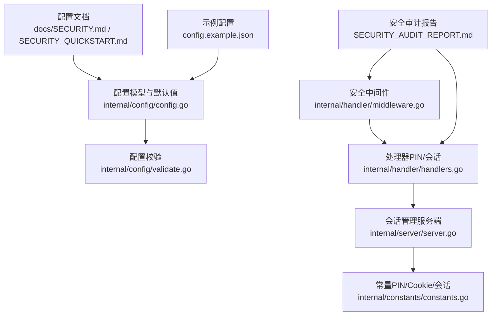
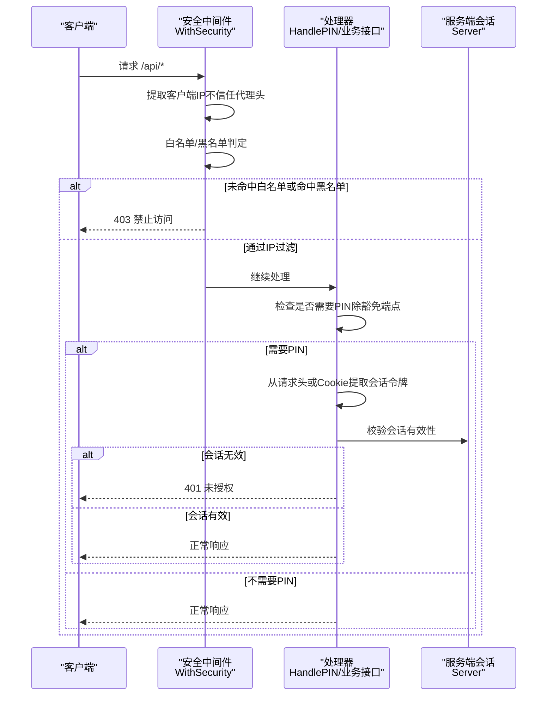
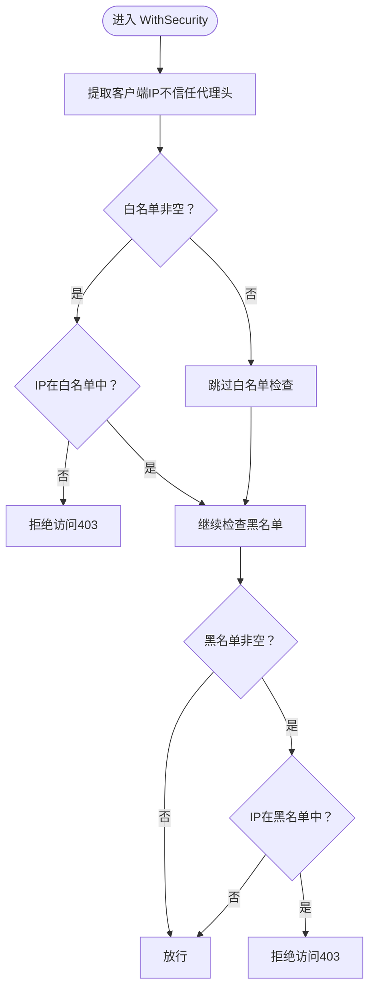
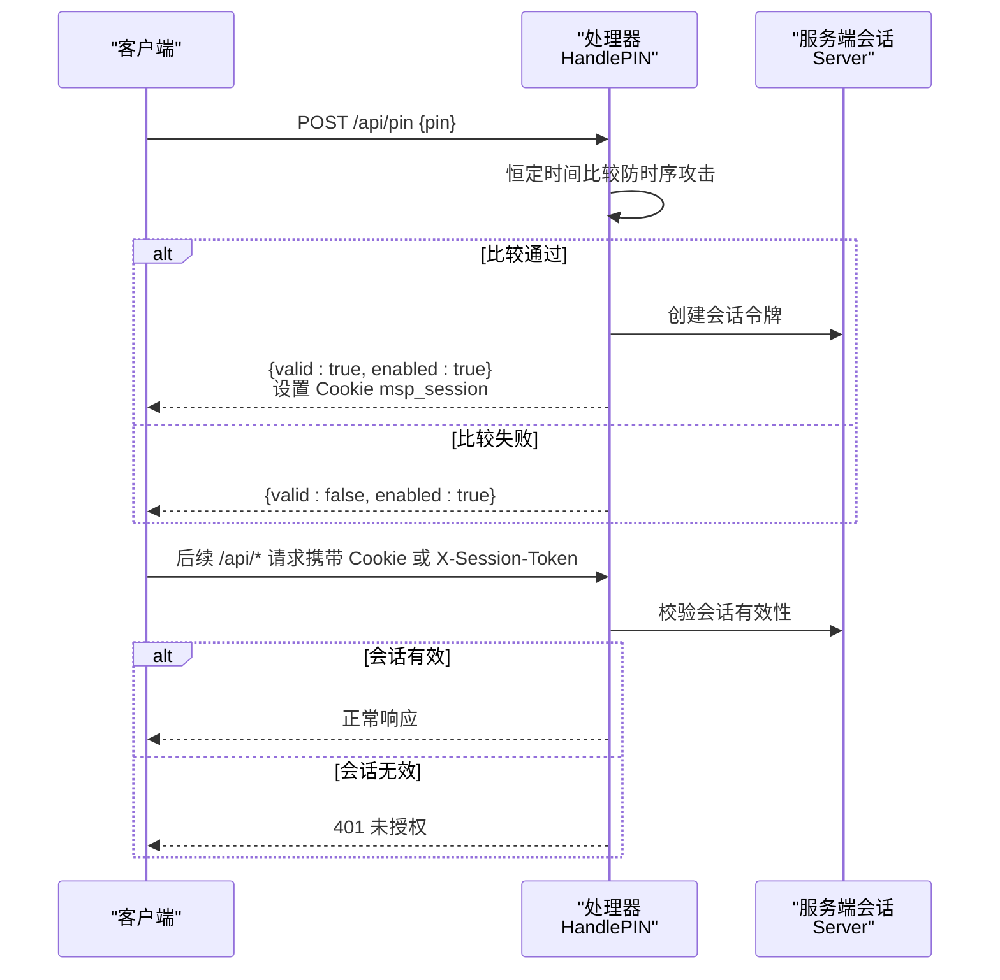
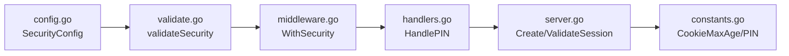

# 安全配置

<cite>
**本文引用的文件**
- [docs/SECURITY.md](file://docs/SECURITY.md)
- [docs/SECURITY_QUICKSTART.md](file://docs/SECURITY_QUICKSTART.md)
- [internal/config/config.go](file://internal/config/config.go)
- [internal/config/validate.go](file://internal/config/validate.go)
- [internal/handler/middleware.go](file://internal/handler/middleware.go)
- [internal/handler/handlers.go](file://internal/handler/handlers.go)
- [internal/server/server.go](file://internal/server/server.go)
- [internal/constants/constants.go](file://internal/constants/constants.go)
- [internal/handler/pin_test.go](file://internal/handler/pin_test.go)
- [SECURITY_AUDIT_REPORT.md](file://SECURITY_AUDIT_REPORT.md)
- [config.example.json](file://config.example.json)
</cite>

## 目录
1. [简介](#简介)
2. [项目结构](#项目结构)
3. [核心组件](#核心组件)
4. [架构总览](#架构总览)
5. [详细组件分析](#详细组件分析)
6. [依赖关系分析](#依赖关系分析)
7. [性能考量](#性能考量)
8. [故障排查指南](#故障排查指南)
9. [结论](#结论)
10. [附录](#附录)

## 简介
本文件聚焦 MSP 项目的“安全配置”部分，系统性阐述 security 配置项（ipWhitelist、ipBlacklist、pinEnabled、pin），解释 IP 访问控制与 PIN 认证的工作原理、配置方法、优先级规则与会话管理机制，并提供不同场景（家庭网络、公共空间、企业环境）的安全配置建议与最佳实践。

## 项目结构
围绕安全配置的关键文件与职责如下：
- 文档层：提供安全配置指南与快速开始，涵盖配置项说明、示例与注意事项
- 配置模型与校验：定义安全配置结构、默认值与校验逻辑
- 中间件与处理器：实现 IP 白/黑名单判定、PIN 验证与会话管理
- 常量与测试：提供默认 PIN、Cookie 有效期、会话令牌长度等常量，并通过测试验证 PIN 行为

图表来源
- [docs/SECURITY.md](file://docs/SECURITY.md#L1-L188)
- [docs/SECURITY_QUICKSTART.md](file://docs/SECURITY_QUICKSTART.md#L1-L248)
- [internal/config/config.go](file://internal/config/config.go#L56-L88)
- [internal/config/validate.go](file://internal/config/validate.go#L141-L176)
- [internal/handler/middleware.go](file://internal/handler/middleware.go#L77-L120)
- [internal/handler/handlers.go](file://internal/handler/handlers.go#L280-L331)
- [internal/server/server.go](file://internal/server/server.go#L570-L627)
- [internal/constants/constants.go](file://internal/constants/constants.go#L45-L50)
- [SECURITY_AUDIT_REPORT.md](file://SECURITY_AUDIT_REPORT.md#L247-L356)
- [config.example.json](file://config.example.json#L50-L56)

章节来源
- [docs/SECURITY.md](file://docs/SECURITY.md#L1-L188)
- [docs/SECURITY_QUICKSTART.md](file://docs/SECURITY_QUICKSTART.md#L1-L248)
- [internal/config/config.go](file://internal/config/config.go#L56-L88)
- [internal/config/validate.go](file://internal/config/validate.go#L141-L176)
- [internal/handler/middleware.go](file://internal/handler/middleware.go#L77-L120)
- [internal/handler/handlers.go](file://internal/handler/handlers.go#L280-L331)
- [internal/server/server.go](file://internal/server/server.go#L570-L627)
- [internal/constants/constants.go](file://internal/constants/constants.go#L45-L50)
- [SECURITY_AUDIT_REPORT.md](file://SECURITY_AUDIT_REPORT.md#L247-L356)
- [config.example.json](file://config.example.json#L50-L56)

## 核心组件
- 安全配置模型（SecurityConfig）
  - ipWhitelist：允许访问的 IP 列表（支持单 IP 与 CIDR）
  - ipBlacklist：禁止访问的 IP 列表（支持单 IP 与 CIDR）
  - pinEnabled：是否启用 PIN 认证
  - pin：PIN 码（默认值来自常量）
  - trustProxy：配置兼容保留字段（家庭模式忽略代理头）
- 配置默认与校验
  - 默认值应用：未设置时填充默认值
  - 校验规则：PIN 长度与字符范围、IP/CIDR 格式合法性
- 安全中间件
  - IP 过滤：基于白/黑名单判定
  - PIN 检查：对 /api/*（除特定豁免端点）要求会话令牌
  - 安全响应头：统一设置安全相关 HTTP 头
- 处理器与会话
  - PIN 验证：恒定时间比较、成功后下发会话 Cookie
  - 会话校验：从请求头或 Cookie 提取令牌并验证有效期
- 常量
  - 默认 PIN、Cookie 最大存活时间、会话令牌长度等

章节来源
- [internal/config/config.go](file://internal/config/config.go#L56-L88)
- [internal/config/validate.go](file://internal/config/validate.go#L141-L196)
- [internal/handler/middleware.go](file://internal/handler/middleware.go#L77-L120)
- [internal/handler/handlers.go](file://internal/handler/handlers.go#L280-L331)
- [internal/server/server.go](file://internal/server/server.go#L570-L627)
- [internal/constants/constants.go](file://internal/constants/constants.go#L12-L14)
- [internal/constants/constants.go](file://internal/constants/constants.go#L45-L50)

## 架构总览
安全控制流自上而下分为三层：
- 配置层：加载与校验 security 配置
- 中间件层：执行 IP 与 PIN 控制
- 处理器层：提供 PIN 验证接口与会话管理

图表来源
- [internal/handler/middleware.go](file://internal/handler/middleware.go#L77-L120)
- [internal/handler/middleware.go](file://internal/handler/middleware.go#L204-L228)
- [internal/handler/handlers.go](file://internal/handler/handlers.go#L280-L331)
- [internal/server/server.go](file://internal/server/server.go#L592-L615)

## 详细组件分析

### IP 访问控制（白名单与黑名单）
- 工作原理
  - 仅使用 RemoteAddr 获取客户端 IP，不信任代理头，避免 IP 欺骗
  - 支持单 IP 与 CIDR 表达式，使用标准库解析与匹配
  - 白名单优先级高于黑名单：若白名单非空，IP 必须在其中；随后再检查黑名单
- 配置方法
  - 在 security.ipWhitelist 与 security.ipBlacklist 中分别配置允许与禁止的 IP/CIDR
  - 若白名单为空，则不进行白名单过滤
- 优先级规则
  - 白名单优先：仅当 IP 在白名单中才进入下一步
  - 黑名单次之：若 IP 在黑名单中，则直接拒绝
  - 结果：通过白名单且未命中黑名单则放行

图表来源
- [internal/handler/middleware.go](file://internal/handler/middleware.go#L134-L163)
- [internal/handler/middleware.go](file://internal/handler/middleware.go#L165-L201)

章节来源
- [internal/handler/middleware.go](file://internal/handler/middleware.go#L77-L120)
- [internal/handler/middleware.go](file://internal/handler/middleware.go#L134-L163)
- [internal/handler/middleware.go](file://internal/handler/middleware.go#L165-L201)
- [docs/SECURITY.md](file://docs/SECURITY.md#L11-L60)

### PIN 认证机制（生成、验证、会话）
- PIN 配置与校验
  - pinEnabled：启用/禁用 PIN
  - pin：默认值来自常量，长度 4-8 位数字
  - 校验规则：长度与字符集校验、IP/CIDR 格式校验
- 验证流程
  - 调用 /api/pin，携带 { pin }，服务端进行恒定时间比较
  - 成功后下发会话 Cookie（msp_session），有效期 7 天；也可通过请求头 X-Session-Token 传递
  - 会话令牌通过服务端内存存储与过期时间控制
- 豁免端点
  - /api/pin、/api/ip、/api/config 不需要 PIN 验证，便于前端初始化与配置检查

图表来源
- [internal/handler/handlers.go](file://internal/handler/handlers.go#L280-L331)
- [internal/server/server.go](file://internal/server/server.go#L570-L627)
- [internal/constants/constants.go](file://internal/constants/constants.go#L45-L49)
- [internal/handler/middleware.go](file://internal/handler/middleware.go#L204-L228)

章节来源
- [internal/config/validate.go](file://internal/config/validate.go#L141-L196)
- [internal/handler/handlers.go](file://internal/handler/handlers.go#L280-L331)
- [internal/server/server.go](file://internal/server/server.go#L570-L627)
- [internal/constants/constants.go](file://internal/constants/constants.go#L12-L14)
- [internal/constants/constants.go](file://internal/constants/constants.go#L45-L50)
- [docs/SECURITY.md](file://docs/SECURITY.md#L61-L168)
- [docs/SECURITY_QUICKSTART.md](file://docs/SECURITY_QUICKSTART.md#L144-L179)
- [internal/handler/pin_test.go](file://internal/handler/pin_test.go#L99-L135)

### 会话管理与安全响应头
- 会话令牌
  - 长度固定，使用加密安全的随机源生成
  - 内存存储，带过期时间（7 天），定期清理过期项
- Cookie 安全属性
  - HttpOnly、SameSite=Lax
  - 家庭模式不设置 Secure（无 TLS 处理）
- 安全响应头
  - nosniff、DENY、XSS Protection、Referrer-Policy 等

章节来源
- [internal/server/server.go](file://internal/server/server.go#L570-L627)
- [internal/handler/handlers.go](file://internal/handler/handlers.go#L302-L313)
- [internal/handler/middleware.go](file://internal/handler/middleware.go#L122-L132)
- [SECURITY_AUDIT_REPORT.md](file://SECURITY_AUDIT_REPORT.md#L327-L356)

### 配置模型与默认值
- 安全配置结构体字段与默认值
  - ipWhitelist/ipBlacklist：默认空数组
  - pinEnabled：默认 false
  - pin：默认来自常量（"0000"）
  - trustProxy：默认 false（保持配置兼容）
- 默认值应用与校验
  - ApplyDefaults：为缺失字段填充默认值
  - Validate：校验端口、日志级别、共享目录、安全配置（IP/CIDR、PIN）

章节来源
- [internal/config/config.go](file://internal/config/config.go#L56-L88)
- [internal/config/config.go](file://internal/config/config.go#L136-L146)
- [internal/config/validate.go](file://internal/config/validate.go#L141-L196)
- [config.example.json](file://config.example.json#L50-L56)

## 依赖关系分析
- 配置层依赖
  - 配置模型定义安全字段
  - 校验模块对 IP/CIDR 与 PIN 进行合法性检查
- 中间件依赖
  - 从配置读取安全策略
  - 通过处理器与服务端会话完成会话校验
- 常量依赖
  - 默认 PIN、Cookie 最大存活时间、会话令牌长度

图表来源
- [internal/config/config.go](file://internal/config/config.go#L56-L88)
- [internal/config/validate.go](file://internal/config/validate.go#L141-L196)
- [internal/handler/middleware.go](file://internal/handler/middleware.go#L77-L120)
- [internal/handler/handlers.go](file://internal/handler/handlers.go#L280-L331)
- [internal/server/server.go](file://internal/server/server.go#L570-L627)
- [internal/constants/constants.go](file://internal/constants/constants.go#L45-L50)

章节来源
- [internal/config/config.go](file://internal/config/config.go#L56-L88)
- [internal/config/validate.go](file://internal/config/validate.go#L141-L196)
- [internal/handler/middleware.go](file://internal/handler/middleware.go#L77-L120)
- [internal/handler/handlers.go](file://internal/handler/handlers.go#L280-L331)
- [internal/server/server.go](file://internal/server/server.go#L570-L627)
- [internal/constants/constants.go](file://internal/constants/constants.go#L45-L50)

## 性能考量
- IP 匹配复杂度
  - 白名单/黑名单线性扫描，元素数量有限时开销极低
  - CIDR 匹配使用标准库，性能稳定
- PIN 校验
  - 恒定时间比较避免分支泄漏，CPU 开销小
  - 会话令牌短生命周期（7 天），内存占用可控
- 中间件开销
  - 仅在 /api/*（除豁免端点）执行 PIN 校验，静态资源与前端无需认证
- 建议
  - 合理设置白/黑名单规模，避免过多条目导致匹配延迟
  - 定期清理过期会话，维持内存健康

[本节为通用指导，不直接分析具体文件]

## 故障排查指南
- 无法访问（403）
  - 检查是否配置了白名单且自身 IP 未包含
  - 检查是否命中黑名单
  - 确认未使用代理或 VPN 导致源 IP 变化
- 401 未授权
  - 确认 PIN 已启用且输入正确
  - 检查 Cookie msp_session 是否存在且未过期
  - 确认请求头 X-Session-Token 是否正确传递
- 忘记 PIN
  - 修改 config.json 中的 pin 或禁用 pinEnabled
  - 删除配置文件后重启，将使用默认 PIN（"0000"）
- 配置热重载
  - 修改后通常约 2 秒生效

章节来源
- [docs/SECURITY.md](file://docs/SECURITY.md#L176-L188)
- [docs/SECURITY_QUICKSTART.md](file://docs/SECURITY_QUICKSTART.md#L120-L135)
- [internal/handler/pin_test.go](file://internal/handler/pin_test.go#L99-L135)

## 结论
MSP 的安全配置以“家庭局域网”为核心设计，通过严格的 IP 白/黑名单与 PIN 认证相结合，辅以安全响应头与恒定时间比较，提供了实用且易用的安全能力。建议在不同场景下按需启用与调整安全策略，并遵循最佳实践以降低风险。

[本节为总结性内容，不直接分析具体文件]

## 附录

### 不同场景的安全配置建议
- 家庭局域网
  - 仅允许本地网段访问（如 192.168.1.0/24）
  - PIN 可暂时关闭，便于日常使用
- 公共空间
  - 启用 PIN 并设置较长数字组合
  - 限制白名单为办公区域网段
- 企业环境
  - 强制启用 PIN，定期更换
  - 严格白名单与细粒度 CIDR
  - 结合网络 ACL 与反向代理（如需公网暴露）

章节来源
- [docs/SECURITY_QUICKSTART.md](file://docs/SECURITY_QUICKSTART.md#L182-L232)
- [docs/SECURITY.md](file://docs/SECURITY.md#L169-L175)

### 安全最佳实践
- 配置层面
  - PIN 长度不少于 4 位，建议 6-8 位
  - 定期更换 PIN，避免长期使用默认值
  - 仅在必要时启用白名单，确保自身 IP 被包含
- 运行层面
  - 使用安全响应头，提升浏览器侧防护
  - 会话令牌短生命周期，减少泄露窗口
  - 避免在公网直接暴露服务，必要时配合反向代理与 TLS

章节来源
- [docs/SECURITY.md](file://docs/SECURITY.md#L76-L81)
- [docs/SECURITY.md](file://docs/SECURITY.md#L169-L175)
- [internal/handler/middleware.go](file://internal/handler/middleware.go#L122-L132)
- [SECURITY_AUDIT_REPORT.md](file://SECURITY_AUDIT_REPORT.md#L247-L356)