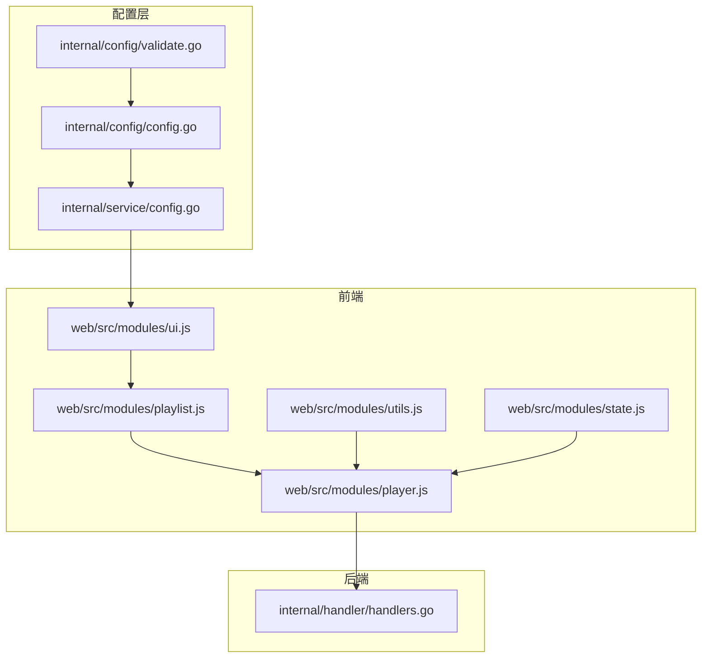
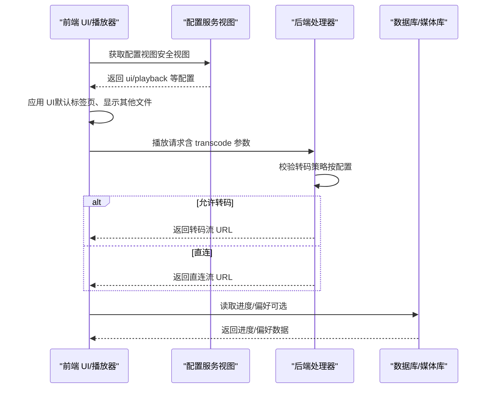
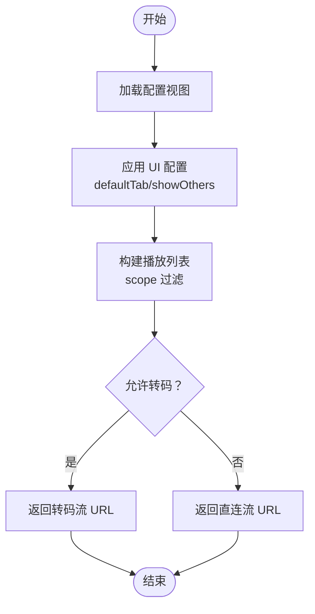
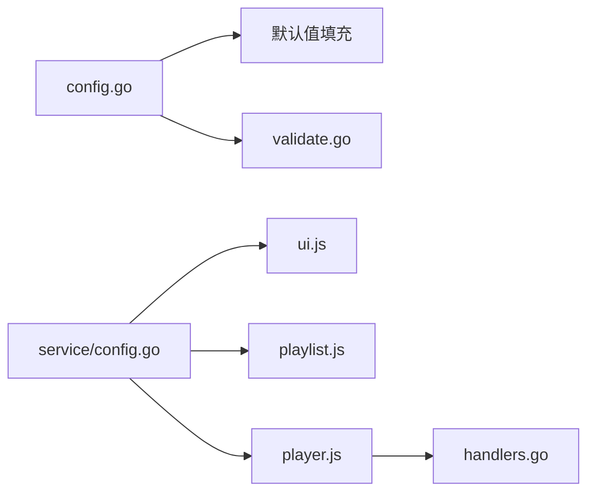

# 界面与播放配置

<cite>
**本文引用的文件**
- [config.example.json](file://config.example.json)
- [internal/config/config.go](file://internal/config/config.go)
- [internal/config/validate.go](file://internal/config/validate.go)
- [internal/service/config.go](file://internal/service/config.go)
- [docs/CONFIG_EXAMPLE.md](file://docs/CONFIG_EXAMPLE.md)
- [web/src/modules/ui.js](file://web/src/modules/ui.js)
- [web/src/modules/player.js](file://web/src/modules/player.js)
- [web/src/modules/playlist.js](file://web/src/modules/playlist.js)
- [web/src/modules/utils.js](file://web/src/modules/utils.js)
- [web/src/modules/state.js](file://web/src/modules/state.js)
- [internal/handler/handlers.go](file://internal/handler/handlers.go)
</cite>

## 目录
1. [简介](#简介)
2. [项目结构](#项目结构)
3. [核心组件](#核心组件)
4. [架构总览](#架构总览)
5. [详细组件分析](#详细组件分析)
6. [依赖关系分析](#依赖关系分析)
7. [性能考量](#性能考量)
8. [故障排查指南](#故障排查指南)
9. [结论](#结论)
10. [附录](#附录)

## 简介
本文件聚焦于 MSP 项目的“界面与播放配置”，系统性阐述以下内容：
- UI 配置：defaultTab（默认标签页）、showOthers（显示其他文件）等界面设置的作用与影响。
- 播放配置：audio（音频播放）、video（视频播放）、image（图片浏览）三类子配置的参数与行为，包括 enabled（启用）、shuffle（随机播放）、remember（记住设置）、scope（播放范围）、transcode（转码）、resume（继续播放）等选项。
- 不同用户群体的偏好配置建议：家庭用户、办公用户、移动设备用户、弱网环境用户等。
- 代码级实现映射与交互流程，帮助开发者与运维人员理解配置如何落地到前端与后端。

## 项目结构
本节概览与“界面与播放配置”直接相关的模块与文件分布：
- 配置定义与默认值：internal/config/config.go
- 配置校验：internal/config/validate.go
- 配置服务视图（安全视图）：internal/service/config.go
- 前端应用入口与 UI 绑定：web/src/modules/ui.js
- 播放器与转码逻辑：web/src/modules/player.js
- 播放列表与播放范围：web/src/modules/playlist.js
- 工具函数与配置读取：web/src/modules/utils.js
- 全局状态与本地存储键：web/src/modules/state.js
- 后端处理器（转码策略、进度接口等）：internal/handler/handlers.go
- 配置示例与注释文档：config.example.json、docs/CONFIG_EXAMPLE.md

图表来源
- [internal/config/config.go](file://internal/config/config.go#L18-L88)
- [internal/config/validate.go](file://internal/config/validate.go#L344-L391)
- [internal/service/config.go](file://internal/service/config.go#L28-L71)
- [web/src/modules/ui.js](file://web/src/modules/ui.js#L223-L273)
- [web/src/modules/playlist.js](file://web/src/modules/playlist.js#L400-L424)
- [web/src/modules/player.js](file://web/src/modules/player.js#L270-L439)
- [web/src/modules/utils.js](file://web/src/modules/utils.js#L23-L31)
- [web/src/modules/state.js](file://web/src/modules/state.js#L42-L58)
- [internal/handler/handlers.go](file://internal/handler/handlers.go#L513-L532)

章节来源
- [internal/config/config.go](file://internal/config/config.go#L1-L286)
- [internal/config/validate.go](file://internal/config/validate.go#L1-L412)
- [internal/service/config.go](file://internal/service/config.go#L1-L123)
- [web/src/modules/ui.js](file://web/src/modules/ui.js#L1-L417)
- [web/src/modules/player.js](file://web/src/modules/player.js#L1-L800)
- [web/src/modules/playlist.js](file://web/src/modules/playlist.js#L1-L457)
- [web/src/modules/utils.js](file://web/src/modules/utils.js#L1-L124)
- [web/src/modules/state.js](file://web/src/modules/state.js#L1-L127)
- [internal/handler/handlers.go](file://internal/handler/handlers.go#L1-L600)

## 核心组件
- UI 配置（ui）
  - defaultTab：默认激活的标签页，可选值为 video、audio、image、other（受 showOthers 控制）。
  - showOthers：是否显示“其他文件”标签页；若关闭且当前为 other，则自动切换到 defaultTab。
- 播放配置（playback）
  - audio：音频播放
    - enabled：是否启用音频播放
    - shuffle：默认随机播放
    - remember：是否记住播放位置（音频/视频）
    - scope：播放范围（all/folder/share）
    - transcode：是否允许转码
  - video：视频播放
    - enabled：是否启用视频播放
    - scope：播放范围（folder/share）
    - transcode：是否允许转码
    - resume：是否启用“继续播放”
  - image：图片浏览
    - enabled：是否启用图片浏览
    - scope：播放范围（folder/share）

章节来源
- [config.example.json](file://config.example.json#L21-L43)
- [docs/CONFIG_EXAMPLE.md](file://docs/CONFIG_EXAMPLE.md#L47-L92)
- [internal/config/config.go](file://internal/config/config.go#L18-L47)
- [internal/config/validate.go](file://internal/config/validate.go#L344-L391)

## 架构总览
下图展示“界面与播放配置”的端到端流转：前端读取配置，应用到 UI 与播放逻辑；后端根据配置策略决定直连或转码。

图表来源
- [internal/service/config.go](file://internal/service/config.go#L73-L90)
- [internal/handler/handlers.go](file://internal/handler/handlers.go#L513-L532)
- [web/src/modules/player.js](file://web/src/modules/player.js#L270-L439)
- [web/src/modules/api.js](file://web/src/modules/api.js#L95-L154)

## 详细组件分析

### UI 配置（ui）
- defaultTab
  - 作用：启动时默认激活的标签页，可选值为 video、audio、image、other。
  - 影响：若 showOthers=false 且 defaultTab=other，则当 other 标签不可见时，自动切换到 defaultTab。
- showOthers
  - 作用：控制“其他文件”标签页是否显示。
  - 影响：隐藏 other 标签页时，若当前处于 other，将切换到 defaultTab。

前端应用逻辑要点
- 读取配置并据此显示/隐藏 other 标签页。
- 若 features.playlist 关闭，playlist 相关 UI（上一首/下一首、随机播放等）也会隐藏。
- 默认标签页与随机播放状态会持久化到本地存储，重启后恢复。

章节来源
- [web/src/modules/ui.js](file://web/src/modules/ui.js#L223-L273)
- [web/src/modules/state.js](file://web/src/modules/state.js#L42-L58)

### 播放配置（playback）
- audio 子配置
  - enabled：是否启用音频播放
  - shuffle：默认随机播放
  - remember：是否记住播放位置（音频）
  - scope：all/folder/share
  - transcode：是否允许转码
- video 子配置
  - enabled：是否启用视频播放
  - scope：folder/share
  - transcode：是否允许转码
  - resume：是否启用“继续播放”
- image 子配置
  - enabled：是否启用图片浏览
  - scope：folder/share

配置默认值与校验
- 默认值：未显式配置时，系统会填充默认值（例如 audio 默认 scope=all、video 默认 scope=folder 等）。
- 校验：scope 仅允许 all、folder、share 三种值；非法值将触发配置验证错误。

章节来源
- [internal/config/config.go](file://internal/config/config.go#L23-L47)
- [internal/config/validate.go](file://internal/config/validate.go#L344-L391)
- [docs/CONFIG_EXAMPLE.md](file://docs/CONFIG_EXAMPLE.md#L59-L92)

### 播放范围（scope）与播放列表构建
- scope=all：播放池为全库
- scope=folder：播放池为当前文件所在目录
- scope=share：播放池为当前共享标签下的媒体
- 构建播放列表时，会根据 scope 过滤媒体池，并按名称排序；随后根据当前项生成播放顺序（支持随机播放）。

章节来源
- [web/src/modules/playlist.js](file://web/src/modules/playlist.js#L400-L424)

### 转码策略（transcode）
- 前端策略
  - 对常见容器（如 MP4/H.264/AAC）优先直连；对高风险容器（如 AVI/WMV）优先转码。
  - 若直连失败，自动回退到转码。
- 后端策略
  - 由配置决定是否允许转码；若请求携带 transcode=1 且配置允许，则返回转码流。
  - 对视频，针对特定容器进行预判；对音频，只要允许即放行。

章节来源
- [web/src/modules/player.js](file://web/src/modules/player.js#L270-L439)
- [internal/handler/handlers.go](file://internal/handler/handlers.go#L513-L532)
- [web/src/modules/utils.js](file://web/src/modules/utils.js#L95-L123)

### 继续播放（resume）与进度记忆（remember）
- 继续播放
  - 前端根据 lastActiveKind 与对应 lastID 恢复最近一次播放的媒体。
  - 若 features.playlist=true，可恢复播放列表状态（kind、索引、播放顺序）。
- 进度记忆
  - 音频/视频支持按媒体 ID 记录时间戳；图片不支持。
  - 本地存储键包含 audio/video/image 的 lastId/lastTime；同时支持后端 API 持久化。

章节来源
- [web/src/modules/player.js](file://web/src/modules/player.js#L52-L155)
- [web/src/modules/api.js](file://web/src/modules/api.js#L95-L154)
- [web/src/modules/state.js](file://web/src/modules/state.js#L42-L58)

### 随机播放（shuffle）
- 默认随机播放由 UI 层读取配置并持久化；切换时重建播放顺序。
- 随机播放保持当前曲目在首位，其余随机打乱。

章节来源
- [web/src/modules/ui.js](file://web/src/modules/ui.js#L251-L261)
- [web/src/modules/playlist.js](file://web/src/modules/playlist.js#L383-L398)

### 配置加载与应用流程
- 前端通过配置视图获取 ui/playback 等配置，应用到 UI 与播放逻辑。
- 后端在处理播放请求时，依据配置决定直连或转码。

图表来源
- [internal/service/config.go](file://internal/service/config.go#L73-L90)
- [web/src/modules/ui.js](file://web/src/modules/ui.js#L223-L273)
- [web/src/modules/playlist.js](file://web/src/modules/playlist.js#L400-L424)
- [web/src/modules/player.js](file://web/src/modules/player.js#L270-L439)

## 依赖关系分析
- 配置定义与默认值
  - internal/config/config.go 定义了 UIConfig、PlaybackConfig 及其子结构，并提供默认值填充逻辑。
- 配置校验
  - internal/config/validate.go 对 scope 等关键字段进行校验，保证配置合法。
- 配置服务视图
  - internal/service/config.go 提供安全视图，避免敏感信息泄露。
- 前端应用
  - web/src/modules/ui.js、playlist.js、player.js 读取配置并应用到 UI 与播放逻辑。
- 后端处理
  - internal/handler/handlers.go 根据配置决定转码策略与响应。

图表来源
- [internal/config/config.go](file://internal/config/config.go#L148-L234)
- [internal/config/validate.go](file://internal/config/validate.go#L344-L391)
- [internal/service/config.go](file://internal/service/config.go#L28-L71)
- [web/src/modules/ui.js](file://web/src/modules/ui.js#L223-L273)
- [web/src/modules/playlist.js](file://web/src/modules/playlist.js#L400-L424)
- [web/src/modules/player.js](file://web/src/modules/player.js#L270-L439)
- [internal/handler/handlers.go](file://internal/handler/handlers.go#L513-L532)

章节来源
- [internal/config/config.go](file://internal/config/config.go#L148-L234)
- [internal/config/validate.go](file://internal/config/validate.go#L344-L391)
- [internal/service/config.go](file://internal/service/config.go#L28-L71)
- [web/src/modules/ui.js](file://web/src/modules/ui.js#L223-L273)
- [web/src/modules/playlist.js](file://web/src/modules/playlist.js#L400-L424)
- [web/src/modules/player.js](file://web/src/modules/player.js#L270-L439)
- [internal/handler/handlers.go](file://internal/handler/handlers.go#L513-L532)

## 性能考量
- 转码策略
  - 仅对高风险容器或直连失败场景进行转码，减少不必要的 CPU 占用。
  - 转码流采用智能寻址，避免标准 seeking 失败导致的卡顿。
- 播放范围
  - scope=folder/share 可显著缩小播放池，降低排序与构建播放列表的成本。
- 进度记忆
  - 仅在需要时读取后端进度，避免频繁 IO；本地存储作为快速回退。

[本节为通用指导，无需特定文件来源]

## 故障排查指南
- 配置校验失败
  - 症状：保存配置后提示 scope 非法。
  - 排查：确认 scope 值为 all/folder/share。
- 转码未生效
  - 症状：请求携带 transcode=1 但未转码。
  - 排查：确认 playback.{audio,video}.transcode 已启用；后端策略允许转码。
- 继续播放无效
  - 症状：点击“继续播放”无反应。
  - 排查：确认 features.playlist 与 remember 对应项已启用；检查本地存储键与后端进度是否存在。
- 随机播放异常
  - 症状：切换随机播放后顺序未更新。
  - 排查：确认 UI 层已重建播放顺序；检查 shuffle 状态持久化。

章节来源
- [internal/config/validate.go](file://internal/config/validate.go#L344-L391)
- [internal/handler/handlers.go](file://internal/handler/handlers.go#L513-L532)
- [web/src/modules/player.js](file://web/src/modules/player.js#L52-L155)
- [web/src/modules/ui.js](file://web/src/modules/ui.js#L251-L261)

## 结论
- UI 配置决定了用户首次进入时的界面体验与可见性。
- 播放配置决定了媒体播放的行为边界，包括播放范围、转码策略与进度记忆。
- 前后端协同：前端负责 UI 与播放体验，后端负责转码与策略执行。
- 建议在不同场景下合理调整配置，以获得最佳的稳定性与性能。

[本节为总结，无需特定文件来源]

## 附录

### 不同用户群体的界面与播放偏好配置建议
- 家庭用户（默认）
  - UI：defaultTab=video；showOthers=false
  - 播放：audio.scope=all；video.scope=folder；video.transcode=true；video.resume=true；image.scope=folder
- 办公用户（强调效率）
  - UI：defaultTab=audio；showOthers=false
  - 播放：audio.scope=folder；video.scope=folder；video.transcode=false；audio.remember=true
- 移动设备用户（弱网/流量）
  - 播放：video.transcode=true；audio.transcode=true；video.scope=folder
- 弱网环境
  - 播放：video.transcode=true；减少 scope=folder；关闭非必要特效

[本节为建议性内容，无需特定文件来源]