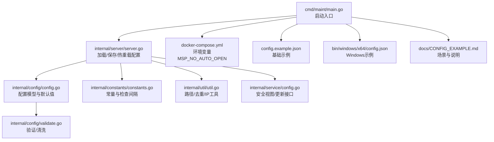
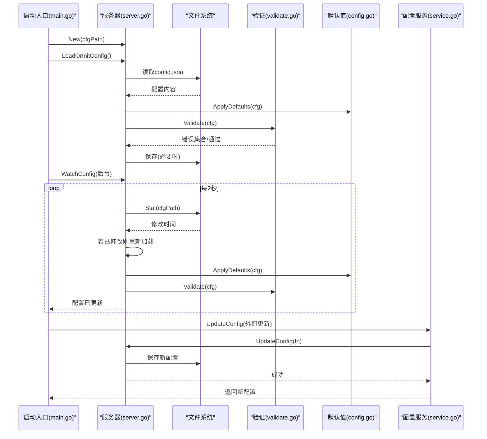
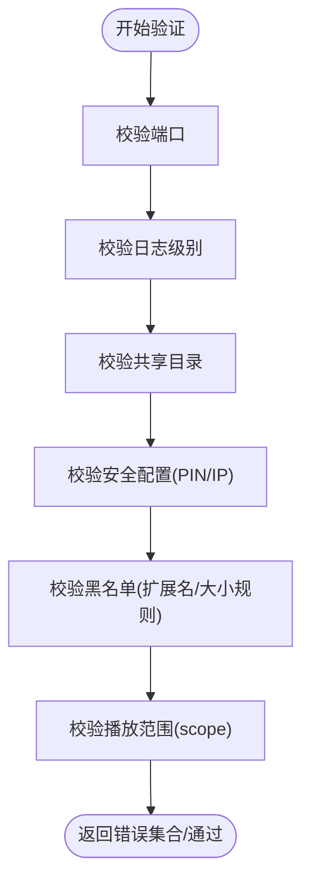
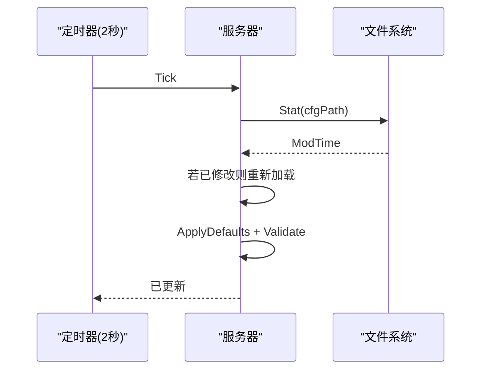
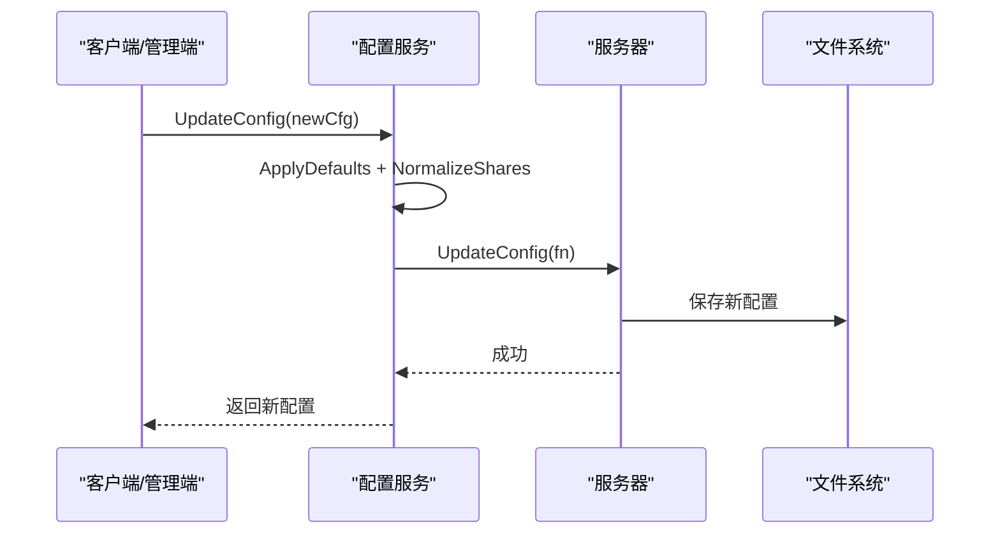
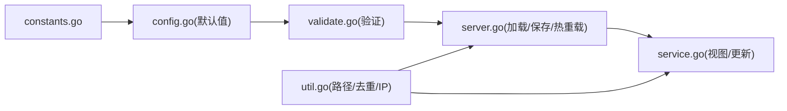

# 配置管理

<cite>
**本文引用的文件**   
- [config.go](file://internal/config/config.go)
- [validate.go](file://internal/config/validate.go)
- [constants.go](file://internal/constants/constants.go)
- [config.go](file://internal/service/config.go)
- [server.go](file://internal/server/server.go)
- [util.go](file://internal/util/util.go)
- [main.go](file://cmd/maint/main.go)
- [config.example.json](file://config.example.json)
- [config.json](file://bin/windows/x64/config.json)
- [CONFIG_EXAMPLE.md](file://docs/CONFIG_EXAMPLE.md)
- [docker-compose.yml](file://docker-compose.yml)
</cite>

## 目录
1. [简介](#简介)
2. [项目结构](#项目结构)
3. [核心组件](#核心组件)
4. [架构总览](#架构总览)
5. [详细组件分析](#详细组件分析)
6. [依赖关系分析](#依赖关系分析)
7. [性能考量](#性能考量)
8. [故障排查指南](#故障排查指南)
9. [结论](#结论)
10. [附录](#附录)

## 简介
本文件系统性阐述 MSP 项目的配置管理，围绕 config.json 配置文件展开，覆盖以下方面：
- 配置项结构与含义、默认值、取值范围与使用场景
- 配置验证机制与错误处理
- 环境变量覆盖与启动行为
- 不同使用场景下的推荐配置示例
- 配置热重载机制与变更影响分析

## 项目结构
与配置管理相关的核心文件与职责如下：
- 配置数据模型与默认值：internal/config/config.go
- 配置验证与清洗：internal/config/validate.go
- 常量定义（端口、PIN、日志轮转、配置检查间隔等）：internal/constants/constants.go
- 配置服务视图与更新：internal/service/config.go
- 服务器加载、保存、热重载与日志：internal/server/server.go
- 工具函数（路径规范化、去重、IP 判断等）：internal/util/util.go
- 启动入口与环境变量：cmd/maint/main.go、docker-compose.yml
- 配置示例与场景说明：config.example.json、docs/CONFIG_EXAMPLE.md、bin/windows/x64/config.json

图表来源
- [main.go](file://cmd/maint/main.go#L26-L83)
- [server.go](file://internal/server/server.go#L76-L125)
- [config.go](file://internal/config/config.go#L77-L146)
- [validate.go](file://internal/config/validate.go#L19-L58)
- [constants.go](file://internal/constants/constants.go#L8-L14)
- [util.go](file://internal/util/util.go#L101-L140)
- [config.go](file://internal/service/config.go#L12-L71)
- [docker-compose.yml](file://docker-compose.yml#L15-L16)
- [config.example.json](file://config.example.json#L1-L56)
- [config.json](file://bin/windows/x64/config.json#L1-L74)
- [CONFIG_EXAMPLE.md](file://docs/CONFIG_EXAMPLE.md#L1-L202)

章节来源
- [main.go](file://cmd/maint/main.go#L26-L83)
- [server.go](file://internal/server/server.go#L76-L125)
- [config.go](file://internal/config/config.go#L77-L146)
- [validate.go](file://internal/config/validate.go#L19-L58)
- [constants.go](file://internal/constants/constants.go#L8-L14)
- [util.go](file://internal/util/util.go#L101-L140)
- [config.go](file://internal/service/config.go#L12-L71)
- [docker-compose.yml](file://docker-compose.yml#L15-L16)
- [config.example.json](file://config.example.json#L1-L56)
- [config.json](file://bin/windows/x64/config.json#L1-L74)
- [CONFIG_EXAMPLE.md](file://docs/CONFIG_EXAMPLE.md#L1-L202)

## 核心组件
- 配置模型与默认值
  - 核心结构体包含端口、共享目录、功能开关、UI、播放、黑名单、安全、日志级别与文件、最大扫描项等字段。
  - 提供默认值构造函数与逐层默认应用逻辑，确保未显式配置时具备合理缺省。
- 配置验证与清洗
  - 对端口、日志级别、共享目录、安全（IP/CIDR/PIN）、黑名单（扩展名/大小规则）、播放范围进行严格校验。
  - 提供快速有效性判断与敏感信息清洗（PIN 清空）。
- 服务器配置生命周期
  - 加载/初始化配置、保存配置、热重载、日志初始化与级别控制。
- 配置服务视图
  - 对外暴露安全视图，隐藏敏感字段；提供前端所需运行态信息（LAN IP、URL、FFmpeg/FFprobe 可用性等）。

章节来源
- [config.go](file://internal/config/config.go#L77-L146)
- [validate.go](file://internal/config/validate.go#L19-L58)
- [server.go](file://internal/server/server.go#L76-L125)
- [config.go](file://internal/service/config.go#L28-L71)

## 架构总览
配置管理的关键流程：
- 启动阶段：定位 config.json，读取并应用默认值，必要时保存到磁盘。
- 运行阶段：按固定周期检查配置文件修改时间，若变化则重新加载并应用默认值。
- 更新接口：通过服务层接收外部更新请求，标准化共享目录，保存新配置并失效媒体缓存。
- 验证与安全：每次加载/更新均进行验证，敏感信息在对外视图中被清洗。

图表来源
- [main.go](file://cmd/maint/main.go#L30-L48)
- [server.go](file://internal/server/server.go#L76-L125)
- [server.go](file://internal/server/server.go#L140-L187)
- [validate.go](file://internal/config/validate.go#L19-L58)
- [config.go](file://internal/config/config.go#L148-L162)
- [config.go](file://internal/service/config.go#L92-L122)

## 详细组件分析

### 配置项总览与默认值
- 基础配置
  - 端口：默认来自常量；若未设置或非法将被修正。
  - 日志级别：默认 info；支持 debug/info/error/none。
  - 日志文件：默认位于可执行目录下 logs 子目录；可自定义绝对或相对路径。
  - 最大扫描项：默认 0（表示无限制，适合 SQLite 增量扫描）。
- 共享目录 shares
  - 每个共享包含 label 与 path；路径会规范化、去重、校验存在性；label 为空时使用目录基名。
- 功能开关 features
  - speed、quality、captions、playlist；speedOptions 为空时填充默认速度序列。
- UI 配置 ui
  - defaultTab 默认 video；showOthers 默认 false。
- 播放偏好 playback
  - audio.enabled=true、shuffle=false、remember=true、scope=all、transcode=false
  - video.enabled=true、scope=folder、transcode=false、resume=true
  - image.enabled=true、scope=folder
- 黑名单 blacklist
  - extensions/filenames/folders 为空切片；sizeRule 支持范围与比较表达式（含 B/KB/MB/GB/TB 单位）。
- 安全 security
  - ipWhitelist/ipBlacklist 支持 IP 或 CIDR；trustProxy 默认 false；pinEnabled 默认 false；pin 默认 0000（可通过常量修改）。

章节来源
- [config.go](file://internal/config/config.go#L77-L146)
- [constants.go](file://internal/constants/constants.go#L8-L14)
- [config.go](file://internal/config/config.go#L148-L285)
- [validate.go](file://internal/config/validate.go#L242-L267)
- [util.go](file://internal/util/util.go#L101-L140)

### 配置验证机制与错误处理
- 端口
  - 必须为正整数，且在 1-65535 范围内；小于 1024 的端口需要管理员权限。
- 日志级别
  - 必须为 debug/info/error/none 或空字符串。
- 共享目录
  - 路径与标签均不可为空；路径与标签均不允许重复（大小写不敏感）。
- 安全配置
  - PIN：启用时必须为 4-8 位纯数字。
  - IP/CIDR：支持形如 a.b.c.d 或 a.b.c.d/n 的格式，n 为 0-32 的掩码长度。
- 黑名单
  - 扩展名必须以点开头；sizeRule 支持 min-max、>=、<=、>、< 与合法单位。
- 播放范围
  - scope 仅允许 all/folder/share。
- 错误封装
  - 统一使用结构化错误对象，包含字段名与消息，便于定位问题。

图表来源
- [validate.go](file://internal/config/validate.go#L19-L58)
- [validate.go](file://internal/config/validate.go#L60-L73)
- [validate.go](file://internal/config/validate.go#L75-L88)
- [validate.go](file://internal/config/validate.go#L90-L139)
- [validate.go](file://internal/config/validate.go#L141-L176)
- [validate.go](file://internal/config/validate.go#L242-L267)
- [validate.go](file://internal/config/validate.go#L344-L379)
- [validate.go](file://internal/config/validate.go#L381-L391)

章节来源
- [validate.go](file://internal/config/validate.go#L19-L58)
- [validate.go](file://internal/config/validate.go#L90-L139)
- [validate.go](file://internal/config/validate.go#L141-L176)
- [validate.go](file://internal/config/validate.go#L242-L267)
- [validate.go](file://internal/config/validate.go#L344-L391)

### 环境变量覆盖机制
- MSP_NO_AUTO_OPEN=1
  - 控制启动后是否自动打开浏览器，默认不自动打开；设为 1 时禁用自动打开。
- 配置文件路径
  - 启动入口固定从可执行文件目录读取 config.json，不通过环境变量覆盖配置文件路径。
- Docker 环境
  - 通过挂载卷映射 config.json 与数据库文件，配合软链实现持久化与路径一致性。

章节来源
- [main.go](file://cmd/maint/main.go#L76-L78)
- [docker-compose.yml](file://docker-compose.yml#L15-L19)

### 配置热重载机制与影响分析
- 触发方式
  - 后台定时器以固定间隔检查配置文件修改时间；若检测到变更则重新读取、应用默认值并验证。
- 影响范围
  - 端口、日志级别、日志文件、共享目录、功能开关、UI、播放偏好、黑名单、安全策略等均可能受影响。
- 幂等与安全
  - 重新加载过程会再次应用默认值与验证，保证配置一致性与安全性。
- 前端可见性
  - 热重载后，前端通过配置视图接口可感知到最新配置（安全视图，不含敏感信息）。

图表来源
- [server.go](file://internal/server/server.go#L140-L187)
- [constants.go](file://internal/constants/constants.go#L42-L43)

章节来源
- [server.go](file://internal/server/server.go#L140-L187)
- [constants.go](file://internal/constants/constants.go#L42-L43)

### 配置更新与持久化
- 外部更新流程
  - 服务层接收新配置，先应用默认值与标准化共享目录，再调用服务器更新方法保存到磁盘。
  - 更新后失效媒体缓存，确保后续扫描与播放行为符合新配置。
- 安全视图
  - 对外返回的配置视图隐藏 PIN，仅暴露白名单、黑名单与启用状态等非敏感信息。

图表来源
- [config.go](file://internal/service/config.go#L92-L122)
- [server.go](file://internal/server/server.go#L133-L138)
- [server.go](file://internal/server/server.go#L114-L125)

章节来源
- [config.go](file://internal/service/config.go#L92-L122)
- [server.go](file://internal/server/server.go#L114-L125)

### 不同使用场景下的推荐配置示例
- 家庭网络（仅本地访问）
  - 仅允许 127.0.0.1 与局域网网段；PIN 可暂时关闭。
- 局域网增强（PIN 认证）
  - 关闭 IP 白名单，启用 PIN 并设置较强密码；适合多人共用但需认证的场景。
- 组合使用（最安全）
  - 白名单限定网段，黑名单屏蔽特定 IP；同时启用 PIN。
- 高并发/公网前置代理
  - 建议谨慎开放公网；结合反向代理与安全组策略；PIN 与 IP 过滤双保险。
- 转码策略
  - 家庭场景可开启视频转码以提升兼容性；注意转码会增加 CPU 开销。

章节来源
- [CONFIG_EXAMPLE.md](file://docs/CONFIG_EXAMPLE.md#L137-L202)
- [config.json](file://bin/windows/x64/config.json#L62-L63)

## 依赖关系分析
- 配置模型与默认值依赖常量（端口、PIN、扫描限制等）。
- 验证模块独立于服务器，但被服务器加载与热重载流程调用。
- 服务层在对外视图中隐藏敏感信息，更新流程依赖服务器保存能力。
- 工具模块提供路径规范化、去重与 IP 判断等基础能力。

图表来源
- [constants.go](file://internal/constants/constants.go#L8-L14)
- [config.go](file://internal/config/config.go#L95-L146)
- [validate.go](file://internal/config/validate.go#L19-L58)
- [server.go](file://internal/server/server.go#L76-L125)
- [util.go](file://internal/util/util.go#L101-L140)
- [config.go](file://internal/service/config.go#L52-L71)

章节来源
- [constants.go](file://internal/constants/constants.go#L8-L14)
- [config.go](file://internal/config/config.go#L95-L146)
- [validate.go](file://internal/config/validate.go#L19-L58)
- [server.go](file://internal/server/server.go#L76-L125)
- [util.go](file://internal/util/util.go#L101-L140)
- [config.go](file://internal/service/config.go#L52-L71)

## 性能考量
- 端口与日志级别
  - 合理设置日志级别可降低 I/O 压力；避免使用过低端口引发权限与兼容性问题。
- 扫描限制
  - maxItems=0 适合 SQLite 增量扫描；在大规模媒体库中建议结合黑名单与范围限制减少扫描开销。
- 转码策略
  - 视频转码可提升兼容性，但会显著增加 CPU 使用率；建议按需开启。
- 热重载频率
  - 固定 2 秒检查一次，通常足够及时反映配置变更，同时避免频繁 IO。

章节来源
- [constants.go](file://internal/constants/constants.go#L42-L43)
- [config.go](file://internal/config/config.go#L97-L98)
- [CONFIG_EXAMPLE.md](file://docs/CONFIG_EXAMPLE.md#L76-L86)

## 故障排查指南
- 配置文件格式错误
  - JSON 语法错误会导致加载失败；检查示例文件与官方文档。
- 端口占用或权限不足
  - 端口小于 1024 需管理员权限；超出范围或为负数将被拒绝。
- IP/CIDR 格式错误
  - 确保为标准 IPv4 或 CIDR；掩码范围应在 0-32。
- PIN 长度或字符不符
  - 必须为 4-8 位纯数字。
- 共享目录路径无效
  - 路径不存在或不是目录；路径会被规范化并去重。
- 热重载未生效
  - 确认配置文件确有修改且未被写保护；查看日志输出确认已重载。

章节来源
- [validate.go](file://internal/config/validate.go#L60-L73)
- [validate.go](file://internal/config/validate.go#L198-L240)
- [validate.go](file://internal/config/validate.go#L178-L196)
- [util.go](file://internal/util/util.go#L125-L140)
- [server.go](file://internal/server/server.go#L140-L187)

## 结论
MSP 的配置管理以清晰的数据模型、严格的验证与默认值应用为核心，辅以安全视图与热重载机制，满足家庭与复杂场景的多样化需求。遵循本文档的配置项说明、验证规则与最佳实践，可在保证安全与稳定的同时，灵活适配不同部署环境与使用场景。

## 附录
- 配置示例与场景说明
  - 基础示例与字段注释：config.example.json、docs/CONFIG_EXAMPLE.md
  - Windows 平台示例：bin/windows/x64/config.json
- 启动与环境变量
  - 启动入口与自动打开控制：cmd/maint/main.go
  - Docker 环境变量与挂载：docker-compose.yml

章节来源
- [config.example.json](file://config.example.json#L1-L56)
- [CONFIG_EXAMPLE.md](file://docs/CONFIG_EXAMPLE.md#L1-L202)
- [config.json](file://bin/windows/x64/config.json#L1-L74)
- [main.go](file://cmd/maint/main.go#L76-L78)
- [docker-compose.yml](file://docker-compose.yml#L15-L19)