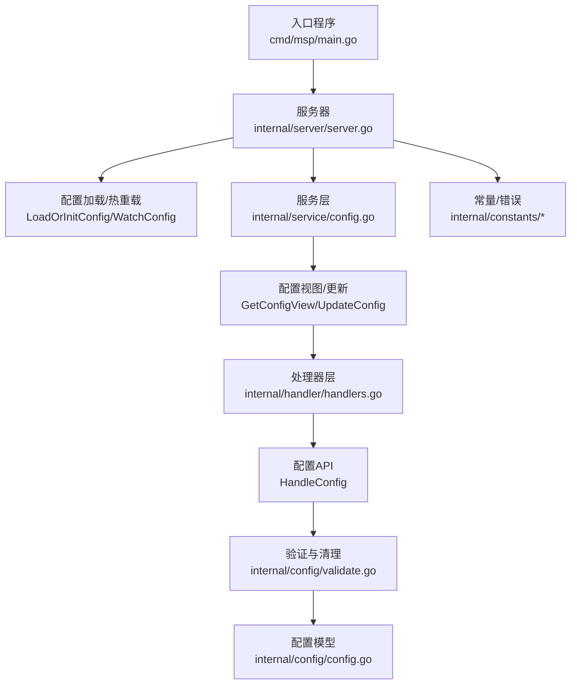
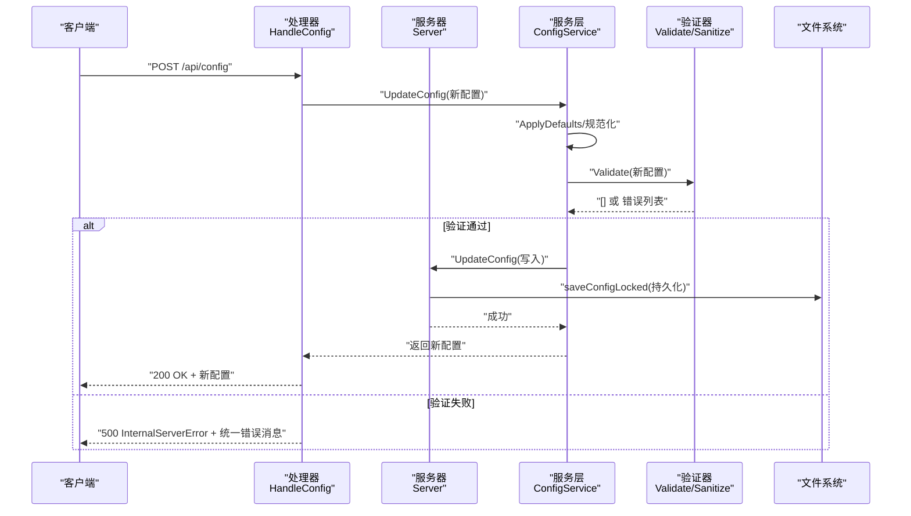
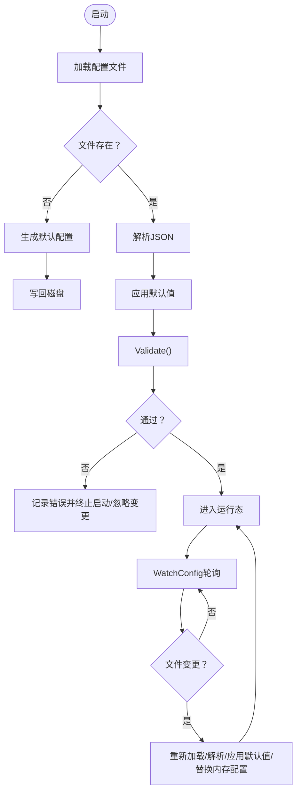
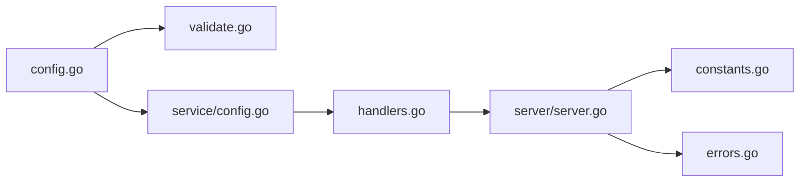

# 配置验证与错误处理

<cite>
**本文引用的文件列表**
- [validate.go](file://internal/config/validate.go)
- [config.go](file://internal/config/config.go)
- [server.go](file://internal/server/server.go)
- [handlers.go](file://internal/handler/handlers.go)
- [config.go](file://internal/service/config.go)
- [errors.go](file://internal/constants/errors.go)
- [constants.go](file://internal/constants/constants.go)
- [main.go](file://cmd/msp/main.go)
- [validate_test.go](file://internal/config/validate_test.go)
- [config.example.json](file://config.example.json)
</cite>

## 目录
1. [简介](#简介)
2. [项目结构](#项目结构)
3. [核心组件](#核心组件)
4. [架构总览](#架构总览)
5. [详细组件分析](#详细组件分析)
6. [依赖关系分析](#依赖关系分析)
7. [性能考量](#性能考量)
8. [故障排查指南](#故障排查指南)
9. [结论](#结论)
10. [附录](#附录)

## 简介
本文件聚焦于MSP项目的“配置验证与错误处理”机制，系统性阐述：
- 配置验证规则与错误类型
- 配置文件从加载到验证的完整流程
- 各类配置错误的诊断与修复方法
- 配置热重载机制的实现原理与注意事项
- 最佳实践与常见陷阱

目标是帮助开发者与运维人员快速定位问题、正确配置并安全地进行运行时调整。

## 项目结构
围绕配置验证与错误处理的关键模块如下：
- 配置模型与默认值：internal/config/config.go
- 验证与清理：internal/config/validate.go
- 服务层安全视图与更新：internal/service/config.go
- 处理器层错误输出与接口：internal/handler/handlers.go
- 服务器层配置加载与热重载：internal/server/server.go
- 常量与错误消息：internal/constants/*
- 入口程序与热重载触发：cmd/msp/main.go
- 测试用例与示例配置：internal/config/validate_test.go、config.example.json

图表来源
- [main.go](file://cmd/msp/main.go#L26-L83)
- [server.go](file://internal/server/server.go#L76-L188)
- [config.go](file://internal/service/config.go#L73-L122)
- [handlers.go](file://internal/handler/handlers.go#L45-L66)
- [validate.go](file://internal/config/validate.go#L19-L58)
- [config.go](file://internal/config/config.go#L77-L88)
- [errors.go](file://internal/constants/errors.go#L1-L68)

章节来源
- [main.go](file://cmd/msp/main.go#L26-L83)
- [server.go](file://internal/server/server.go#L76-L188)
- [config.go](file://internal/service/config.go#L73-L122)
- [handlers.go](file://internal/handler/handlers.go#L45-L66)
- [validate.go](file://internal/config/validate.go#L19-L58)
- [config.go](file://internal/config/config.go#L77-L88)
- [errors.go](file://internal/constants/errors.go#L1-L68)

## 核心组件
- 配置模型与默认值：定义Config及各子结构体，提供Default()与ApplyDefaults()，确保缺失字段有合理默认值。
- 验证器：Validate()统一入口，分模块验证端口、日志级别、共享目录、安全、黑名单、播放范围等；提供Sanitize()用于敏感信息脱敏。
- 服务层：ConfigService负责生成安全视图（隐藏PIN），并执行配置更新。
- 处理器层：HandleConfig接收/提交配置，结合服务层与验证器，返回标准化错误。
- 服务器层：LoadOrInitConfig负责首次加载与默认值回写；WatchConfig实现热重载。
- 常量与错误：集中管理错误消息与系统常量，便于统一处理与测试。

章节来源
- [config.go](file://internal/config/config.go#L77-L146)
- [validate.go](file://internal/config/validate.go#L19-L58)
- [config.go](file://internal/service/config.go#L20-L71)
- [handlers.go](file://internal/handler/handlers.go#L45-L66)
- [server.go](file://internal/server/server.go#L76-L188)
- [errors.go](file://internal/constants/errors.go#L1-L68)

## 架构总览
下图展示配置从加载、验证、更新到生效的端到端流程。

图表来源
- [handlers.go](file://internal/handler/handlers.go#L45-L66)
- [config.go](file://internal/service/config.go#L92-L122)
- [server.go](file://internal/server/server.go#L133-L138)
- [validate.go](file://internal/config/validate.go#L19-L58)

## 详细组件分析

### 配置验证机制与规则
- 统一错误类型：ValidationError携带字段名与消息，便于定位。
- 分模块验证：
  - 端口：必须>0且≤65535；<1024需管理员权限。
  - 日志级别：支持debug/info/error/none或空字符串，大小写不敏感。
  - 共享目录：路径非空且去空白后唯一；标签非空且全局唯一。
  - 安全：PIN启用时长度4-8且仅数字；IP白名单/黑名单支持IP/CIDR格式校验。
  - 黑名单：扩展名必须以.开头；大小规则支持min-max与>=、<=、>、<，并解析带单位的数值。
  - 播放范围：audio/video/image的scope必须为all/folder/share。
- 快速判断：IsValid()基于Validate()结果是否为空。
- 安全输出：Sanitize()返回不含PIN的安全副本，避免敏感信息泄露。

章节来源
- [validate.go](file://internal/config/validate.go#L10-L58)
- [validate.go](file://internal/config/validate.go#L60-L73)
- [validate.go](file://internal/config/validate.go#L75-L88)
- [validate.go](file://internal/config/validate.go#L90-L139)
- [validate.go](file://internal/config/validate.go#L141-L176)
- [validate.go](file://internal/config/validate.go#L178-L196)
- [validate.go](file://internal/config/validate.go#L198-L240)
- [validate.go](file://internal/config/validate.go#L242-L267)
- [validate.go](file://internal/config/validate.go#L269-L277)
- [validate.go](file://internal/config/validate.go#L279-L310)
- [validate.go](file://internal/config/validate.go#L312-L342)
- [validate.go](file://internal/config/validate.go#L344-L379)
- [validate.go](file://internal/config/validate.go#L381-L391)
- [validate.go](file://internal/config/validate.go#L393-L411)

### 配置文件加载与验证流程
- 首次启动：LoadOrInitConfig优先尝试读取配置文件；不存在则生成默认配置并写回磁盘；解析后应用默认值，必要时回写。
- 运行时：服务器启动后，后台协程WatchConfig按固定周期轮询配置文件修改时间，若变更则重新读取、解析、应用默认值并替换内存配置。
- 处理器：/api/config接口接收新配置，先ApplyDefaults与规范化，再调用Validate进行校验；通过后写入并使媒体缓存失效。

图表来源
- [server.go](file://internal/server/server.go#L76-L112)
- [server.go](file://internal/server/server.go#L140-L188)
- [config.go](file://internal/config/config.go#L148-L162)
- [handlers.go](file://internal/handler/handlers.go#L45-L66)

章节来源
- [server.go](file://internal/server/server.go#L76-L112)
- [server.go](file://internal/server/server.go#L140-L188)
- [config.go](file://internal/config/config.go#L148-L162)
- [handlers.go](file://internal/handler/handlers.go#L45-L66)

### 错误类型与处理方式
- 格式错误：JSON解析失败、请求体过大、字段格式非法（如IP/CIDR、扩展名、大小规则）。
- 值域错误：端口越界、日志级别非法、PIN长度或字符非法、大小值解析失败。
- 依赖关系错误：重复路径/标签、共享目录不存在或不可访问、白名单/黑名单格式不合法。
- 处理策略：
  - 加载阶段：解析失败直接报错；热重载失败记录错误并跳过本次变更。
  - 提交阶段：处理器捕获解码错误与验证错误，返回统一错误消息常量。
  - 安全输出：服务层生成安全视图，隐藏敏感字段；Sanitize()用于日志/调试输出。

章节来源
- [errors.go](file://internal/constants/errors.go#L1-L68)
- [handlers.go](file://internal/handler/handlers.go#L709-L720)
- [config.go](file://internal/service/config.go#L20-L71)
- [validate.go](file://internal/config/validate.go#L19-L58)

### 配置热重载机制
- 触发时机：主程序启动后立即启动WatchConfig协程。
- 检测策略：以固定周期（常量定义）读取配置文件修改时间，若晚于上次记录则判定变更。
- 重载步骤：读取→解析→应用默认值→替换内存配置→记录日志。
- 注意事项：
  - 解析失败或验证失败会记录错误并跳过本次重载。
  - 重载不会自动回写磁盘，除非显式写入配置。
  - 重载后会触发媒体缓存失效，避免旧缓存影响新配置。

章节来源
- [main.go](file://cmd/msp/main.go#L47-L48)
- [server.go](file://internal/server/server.go#L140-L188)
- [constants.go](file://internal/constants/constants.go#L42-L43)

### 配置错误诊断与解决方案
- 常见症状与定位
  - 端口无效：检查端口范围与权限；避免使用保留端口。
  - 日志级别无效：确认值属于允许集合。
  - 共享目录重复：检查路径与标签的唯一性。
  - IP/CIDR格式错误：确认IP与掩码范围。
  - 扩展名格式错误：确保以.开头。
  - 大小规则格式错误：参考支持的范围与比较符。
- 诊断步骤
  - 查看启动日志与热重载日志，确认解析与验证阶段是否报错。
  - 使用/安全视图接口获取当前配置快照，确认是否已应用默认值。
  - 通过处理器接口提交最小化配置，逐步定位具体字段。
- 修复建议
  - 修正字段值后保存配置文件，等待热重载生效或重启服务。
  - 对于PIN等敏感字段，使用安全视图确认是否正确隐藏。

章节来源
- [validate_test.go](file://internal/config/validate_test.go#L9-L35)
- [validate_test.go](file://internal/config/validate_test.go#L37-L63)
- [validate_test.go](file://internal/config/validate_test.go#L65-L90)
- [validate_test.go](file://internal/config/validate_test.go#L116-L138)
- [validate_test.go](file://internal/config/validate_test.go#L140-L159)
- [validate_test.go](file://internal/config/validate_test.go#L189-L214)
- [validate_test.go](file://internal/config/validate_test.go#L216-L240)
- [validate_test.go](file://internal/config/validate_test.go#L242-L288)
- [validate_test.go](file://internal/config/validate_test.go#L290-L305)
- [validate_test.go](file://internal/config/validate_test.go#L307-L322)

### 配置验证最佳实践与常见陷阱
- 最佳实践
  - 使用默认值策略：尽量依赖ApplyDefaults，减少手工配置遗漏。
  - 保持配置简洁：仅在必要时覆盖默认值，避免冗余字段。
  - 安全优先：PIN启用时确保长度与字符符合要求；白名单优先于黑名单。
  - 规范化输入：提交配置前先进行本地校验，减少无效请求。
  - 监控与日志：开启合适日志级别，关注热重载与验证错误。
- 常见陷阱
  - 忽视端口权限：小于1024端口需要管理员权限。
  - 重复路径/标签：导致验证失败或行为异常。
  - IP/CIDR掩码越界：掩码必须在0-32之间。
  - 扩展名不以.开头：会被视为无效。
  - 大小规则格式错误：注意空格、大小写与单位。
  - 热重载误解：热重载不会自动回写磁盘，需手动保存或确保写入流程。

章节来源
- [config.go](file://internal/config/config.go#L148-L162)
- [validate.go](file://internal/config/validate.go#L60-L73)
- [validate.go](file://internal/config/validate.go#L198-L240)
- [validate.go](file://internal/config/validate.go#L269-L277)
- [validate.go](file://internal/config/validate.go#L279-L310)
- [server.go](file://internal/server/server.go#L140-L188)

## 依赖关系分析
- 配置模型与验证器：validate.go依赖config.go中的结构体定义。
- 服务层与处理器：service/config.go依赖server/config，handlers.go依赖service与config。
- 服务器层：server.go依赖config、constants与util/db/media等。
- 常量与错误：errors.go与constants.go被多处模块引用。

图表来源
- [config.go](file://internal/config/config.go#L77-L88)
- [validate.go](file://internal/config/validate.go#L19-L58)
- [config.go](file://internal/service/config.go#L20-L71)
- [handlers.go](file://internal/handler/handlers.go#L45-L66)
- [server.go](file://internal/server/server.go#L76-L188)
- [errors.go](file://internal/constants/errors.go#L1-L68)
- [constants.go](file://internal/constants/constants.go#L1-L115)

章节来源
- [config.go](file://internal/config/config.go#L77-L88)
- [validate.go](file://internal/config/validate.go#L19-L58)
- [config.go](file://internal/service/config.go#L20-L71)
- [handlers.go](file://internal/handler/handlers.go#L45-L66)
- [server.go](file://internal/server/server.go#L76-L188)
- [errors.go](file://internal/constants/errors.go#L1-L68)
- [constants.go](file://internal/constants/constants.go#L1-L115)

## 性能考量
- 验证复杂度：Validate()线性遍历各字段，整体O(N)，其中N为配置项数量，可接受。
- 热重载频率：常量定义的检查间隔适中，避免频繁IO；建议根据实际部署规模调整。
- 日志与缓存：日志轮转与媒体缓存TTL控制资源占用；热重载后及时失效缓存，避免陈旧数据。
- 内存与并发：服务器使用读写锁保护配置，热重载与请求处理互不影响。

章节来源
- [constants.go](file://internal/constants/constants.go#L42-L43)
- [server.go](file://internal/server/server.go#L190-L284)
- [server.go](file://internal/server/server.go#L322-L330)

## 故障排查指南
- 启动失败
  - 检查配置文件是否存在与可读；查看解析错误日志。
  - 若默认值回写失败，确认磁盘权限。
- 热重载不生效
  - 确认WatchConfig协程已启动；检查文件修改时间是否变化。
  - 解析失败或验证失败会记录错误并跳过；修正配置后重试。
- 提交配置失败
  - 检查请求体大小与JSON格式；查看处理器返回的统一错误消息。
  - 使用安全视图确认敏感字段未被暴露。
- 安全问题
  - 确保PIN启用时长度与字符符合要求；避免在日志中打印原始配置。
  - 使用Sanitize()与安全视图输出。

章节来源
- [main.go](file://cmd/msp/main.go#L47-L48)
- [server.go](file://internal/server/server.go#L140-L188)
- [handlers.go](file://internal/handler/handlers.go#L709-L720)
- [config.go](file://internal/service/config.go#L20-L71)
- [validate.go](file://internal/config/validate.go#L393-L406)

## 结论
MSP的配置验证与错误处理体系以“模型+验证+默认值+安全视图+热重载”为核心，形成闭环：
- 明确的验证规则与统一错误类型，便于快速定位问题；
- 默认值与规范化减少手工配置负担；
- 安全视图与Sanitize保障敏感信息不泄露；
- 热重载提升运维效率，同时具备完善的错误隔离与恢复能力。

遵循最佳实践并结合本文提供的诊断方法，可显著降低配置相关问题的发生率与排障成本。

## 附录
- 示例配置：参考config.example.json，了解字段含义与默认值。
- 测试用例：validate_test.go覆盖端口、日志级别、IP/CIDR、扩展名、大小规则、作用域等关键场景。

章节来源
- [config.example.json](file://config.example.json#L1-L56)
- [validate_test.go](file://internal/config/validate_test.go#L9-L35)
- [validate_test.go](file://internal/config/validate_test.go#L37-L63)
- [validate_test.go](file://internal/config/validate_test.go#L116-L138)
- [validate_test.go](file://internal/config/validate_test.go#L140-L159)
- [validate_test.go](file://internal/config/validate_test.go#L189-L214)
- [validate_test.go](file://internal/config/validate_test.go#L216-L240)
- [validate_test.go](file://internal/config/validate_test.go#L242-L288)
- [validate_test.go](file://internal/config/validate_test.go#L290-L305)
- [validate_test.go](file://internal/config/validate_test.go#L307-L322)