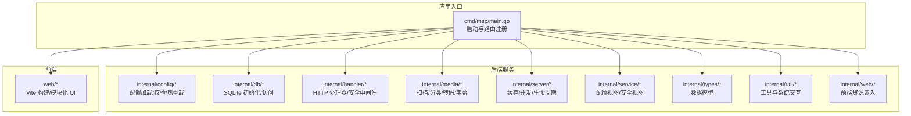
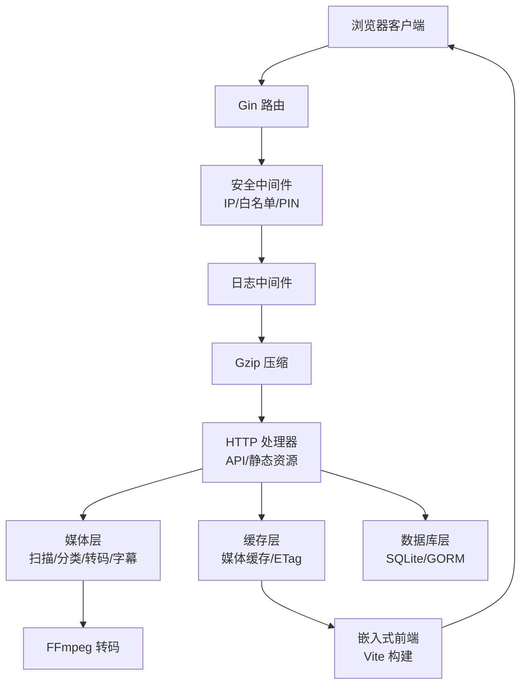
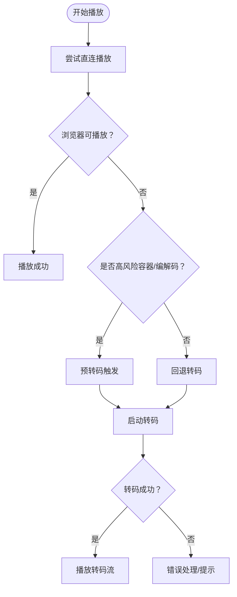
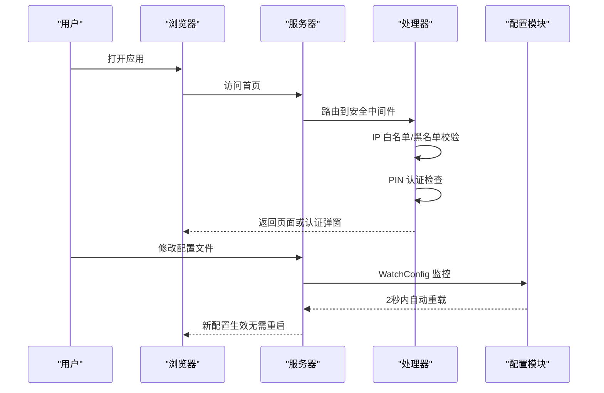
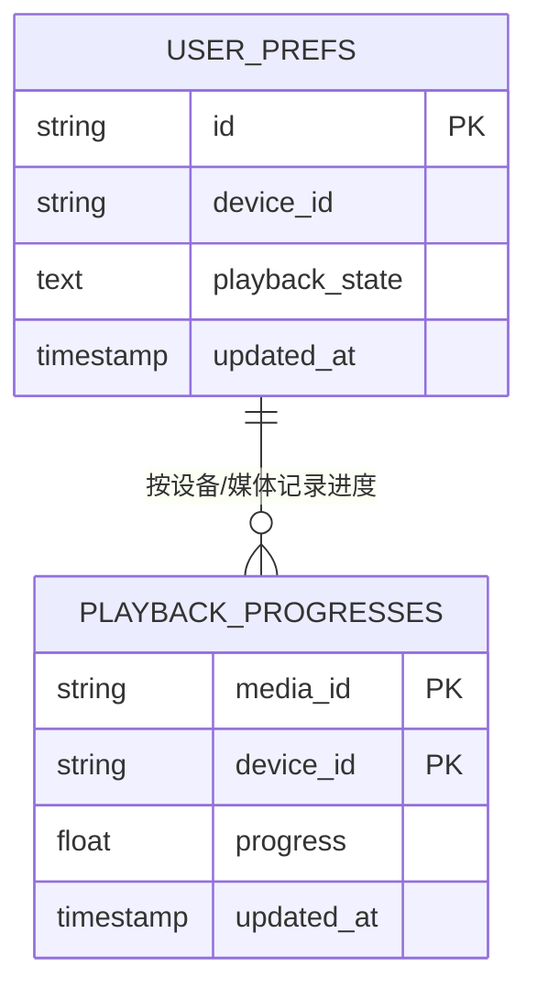

# 发展历程

<cite>
**本文引用的文件**
- [CHANGELOG.md](file://CHANGELOG.md)
- [README.md](file://README.md)
- [README_CN.md](file://README_CN.md)
- [CONTRIBUTING.md](file://CONTRIBUTING.md)
- [docs/v0.7.0_RELEASE_SUMMARY.md](file://docs/v0.7.0_RELEASE_SUMMARY.md)
- [docs/release/v0.8.12.md](file://docs/release/v0.8.12.md)
- [docs/release/v0.8.10.md](file://docs/release/v0.8.10.md)
- [cmd/msp/main.go](file://cmd/msp/main.go)
- [go.mod](file://go.mod)
- [IMPROVEMENTS.md](file://IMPROVEMENTS.md)
- [PERFORMANCE_ANALYSIS.md](file://PERFORMANCE_ANALYSIS.md)
</cite>

## 目录
1. [引言](#引言)
2. [项目结构](#项目结构)
3. [核心组件](#核心组件)
4. [架构总览](#架构总览)
5. [详细组件分析](#详细组件分析)
6. [依赖分析](#依赖分析)
7. [性能考量](#性能考量)
8. [故障排查指南](#故障排查指南)
9. [结论](#结论)
10. [附录](#附录)

## 引言
MSP 是一个面向家庭局域网的轻量级媒体服务器，目标是让用户在本地网络中通过现代浏览器直接播放本地媒体，无需外部数据库或复杂部署。项目起源于对“个人媒体服务器”的需求：在家庭环境中，用户希望将分散在各处的音视频、图片等媒体资源统一管理并通过浏览器进行播放，同时兼顾易用性、安全性与性能。

早期版本侧重于“零配置、直连优先”的播放体验；随着版本迭代，逐步引入安全机制（如 PIN 认证与 IP 访问控制）、智能转码（按需转码以兼容浏览器不支持的容器与编解码）、数据库性能优化（分离高频播放进度以降低数据库压力）、以及前端播放器与 UI 的持续改进。当前版本在播放策略、稳定性、安全与性能方面达到较为成熟的平衡。

## 项目结构
MSP 采用前后端一体化的单二进制部署思路：后端使用 Go 提供 HTTP API 与媒体扫描、转码、缓存与数据库管理；前端使用 Vite 构建并嵌入到二进制中，通过 Gin 框架提供静态资源与 API 路由。核心目录与职责如下：
- cmd/msp：程序入口，负责初始化配置、数据库、日志、路由注册与服务器启动。
- internal/*：核心业务模块
  - config：配置加载、校验与热重载
  - db：SQLite 数据库初始化、迁移与访问封装
  - handler：HTTP 处理器，提供 API 与安全中间件
  - media：媒体扫描、分类、转码与字幕处理
  - server：服务器生命周期、缓存与并发控制
  - service：配置视图与安全视图等服务层逻辑
  - types：数据库与 API 数据模型
  - util：通用工具与系统交互
  - web：前端资源嵌入与静态服务
- web：前端工程，包含播放器、播放列表、主题与国际化等模块
- docs：版本发布说明、安全指南、配置示例等文档
- 脚本与工作流：构建脚本、依赖升级与容灾计划等

图表来源
- [cmd/msp/main.go](file://cmd/msp/main.go#L26-L107)
- [internal/config/config.go](file://internal/config/config.go)
- [internal/db/db.go](file://internal/db/db.go)
- [internal/handler/handlers.go](file://internal/handler/handlers.go)
- [internal/media/media.go](file://internal/media/media.go)
- [internal/server/server.go](file://internal/server/server.go)
- [internal/service/config.go](file://internal/service/config.go)
- [internal/types/types.go](file://internal/types/types.go)
- [internal/util/util.go](file://internal/util/util.go)
- [internal/web/web.go](file://internal/web/web.go)
- [web/src/app.js](file://web/src/app.js)

章节来源
- [cmd/msp/main.go](file://cmd/msp/main.go#L26-L107)

## 核心组件
- 配置系统：支持配置文件热重载，涵盖安全、共享目录、转码、日志等配置项，确保运行时无需重启即可生效。
- 媒体扫描与缓存：扫描共享目录，建立媒体缓存，支持后台重建与 ETag 条件请求，降低重复扫描与网络传输。
- 智能转码：基于浏览器支持能力与媒体特征，按需触发转码，避免对可直连格式的不必要转码。
- 安全中间件：提供 IP 白名单/黑名单与 PIN 认证，支持 Cookie 会话与家庭局域网模式下的安全策略。
- 数据库与播放进度：将播放进度从用户偏好表中分离，显著提升性能与可维护性。
- 前端播放器与 UI：基于 Plyr 的播放器，支持视频/音频播放、歌词、播放列表与暗黑模式等。

章节来源
- [cmd/msp/main.go](file://cmd/msp/main.go#L47-L51)
- [CHANGELOG.md](file://CHANGELOG.md#L94-L100)
- [docs/v0.7.0_RELEASE_SUMMARY.md](file://docs/v0.7.0_RELEASE_SUMMARY.md#L13-L31)

## 架构总览
MSP 的整体架构围绕“单二进制 + 嵌入式前端”的模式展开。入口程序负责初始化与路由注册，处理器层组合安全中间件、日志与 gzip 压缩，媒体层负责扫描、转码与缓存，数据库层提供轻量持久化，前端通过嵌入式静态资源提供现代化播放体验。

图表来源
- [cmd/msp/main.go](file://cmd/msp/main.go#L65-L74)
- [internal/handler/handlers.go](file://internal/handler/handlers.go)
- [internal/media/transcoder.go](file://internal/media/transcoder.go)
- [internal/db/db.go](file://internal/db/db.go)
- [internal/web/web.go](file://internal/web/web.go)

## 详细组件分析

### 版本演进与里程碑
- 0.1.0：初版发布，提供局域网媒体共享与浏览器预览播放的基础能力。
- 0.2.x：优化前端静态资源与媒体类型 Content-Type，改善全屏与覆盖模式。
- 0.5.x：引入 context.Context 支持请求超时与优雅取消，核心模块拆分为 Scanner/Store/Media 三层，集成 CI 与代码规范。
- 0.6.0：UI/UX 全面升级，遵循设计规范，增强无障碍性与移动端体验。
- 0.7.0：安全功能全面升级，新增 IP 黑/白名单与 PIN 认证，支持配置热重载，发布 v0.7.0 发布总结文档。
- 0.8.0：数据库优化（播放进度表分离），新增服务端智能转码与专用进度 API，明确转码模式下不支持拖动。
- 0.8.4：播放策略重构为“先直连，失败再回退转码”，修复 AVI/MKV 在浏览器中的播放问题，优化转码并发与看门狗。
- 0.8.5：UI 圆角化与播放器稳定性修复，优化 Tooltip 与快速切换视频的错误。
- 0.8.6/0.8.7：代码质量重构，常量抽取、错误消息统一、测试覆盖率提升与性能优化。
- 0.8.8：随机播放逻辑重构，修复多次点击导致列表重排的问题。
- 0.8.10：安全与稳健性优化，统一 JSON 请求体大小限制、修正 limit 截断标记语义、字幕转换大文件保护、家庭模式下移除 HTTPS 推断。
- 0.8.11：播放器兼容策略精修，针对 AVI/WMV 与高风险编码优先预转码，增强错误回调兜底与媒体切换保护。
- 0.8.12：播放策略收敛（仅 AVI/WMV 触发预转码），播放器稳定性修复与 WMV 兼容补强。

章节来源
- [CHANGELOG.md](file://CHANGELOG.md#L1-L156)
- [docs/v0.7.0_RELEASE_SUMMARY.md](file://docs/v0.7.0_RELEASE_SUMMARY.md#L1-L204)
- [docs/release/v0.8.12.md](file://docs/release/v0.8.12.md#L1-L27)
- [docs/release/v0.8.10.md](file://docs/release/v0.8.10.md#L1-L127)

### 播放策略与转码机制
- 播放策略：默认优先直连；对高风险容器（如 AVI、WMV）与高风险编解码（如 HEVC/H.265、VC-1、AC-3、DTS、TrueHD）优先预转码；直连失败时保留一次带时间戳刷新的重试，再自动转码回退。
- 转码并发：默认限制并发转码会话数，防止 CPU 耗尽；对常见 H.264/AAC/MP3 直接复制以提升性能。
- 智能判定：通过 canPlayType 与媒体嗅探，避免对可直连格式的误判与下载弹窗。

图表来源
- [README.md](file://README.md#L33-L40)
- [CHANGELOG.md](file://CHANGELOG.md#L84-L92)

章节来源
- [README.md](file://README.md#L33-L40)
- [CHANGELOG.md](file://CHANGELOG.md#L84-L100)

### 安全与配置热重载
- 安全功能：IP 白名单/黑名单（支持 IPv4 CIDR）、PIN 认证（Cookie 会话、主题适配、国际化）、配置热重载（2 秒内自动生效）。
- 配置视图：/api/config 返回安全视图，隐藏敏感字段（如 PIN）。
- 家庭模式：在局域网直连场景下固定非 Secure Cookie 与客户端 IP 来源，简化运行路径。

图表来源
- [cmd/msp/main.go](file://cmd/msp/main.go#L47-L51)
- [docs/v0.7.0_RELEASE_SUMMARY.md](file://docs/v0.7.0_RELEASE_SUMMARY.md#L13-L31)

章节来源
- [docs/v0.7.0_RELEASE_SUMMARY.md](file://docs/v0.7.0_RELEASE_SUMMARY.md#L13-L31)
- [cmd/msp/main.go](file://cmd/msp/main.go#L47-L51)

### 数据库与播放进度优化
- 播放进度表分离：将高频播放进度更新从用户偏好表中分离，显著提升性能并减少数据库膨胀。
- SQLite 优化：WAL 模式、预编译语句缓存、连接池设置、复合索引等，配合批量插入与查询优化。

图表来源
- [CHANGELOG.md](file://CHANGELOG.md#L94-L99)
- [PERFORMANCE_ANALYSIS.md](file://PERFORMANCE_ANALYSIS.md#L9-L80)

章节来源
- [CHANGELOG.md](file://CHANGELOG.md#L94-L99)
- [PERFORMANCE_ANALYSIS.md](file://PERFORMANCE_ANALYSIS.md#L9-L80)

### 前端播放器与 UI 升级
- 播放器：基于 Plyr，支持视频/音频播放、歌词、播放列表与暗黑模式。
- UI：遵循设计规范，统一过渡动画、增强无障碍性与移动端布局。
- 稳定性：修复 Tooltip 被遮挡、快速切换视频的 canPlayType 报错等问题。

章节来源
- [CHANGELOG.md](file://CHANGELOG.md#L80-L92)

### 代码质量与测试
- 重构：提取魔法数字为常量、统一错误消息、为导出函数添加中文注释、消除重复代码。
- 测试：新增常量包与 util 包测试，覆盖率显著提升；新增安全测试文件覆盖关键边界。
- 安全：修复符号链接绕过、命令注入、配置信息泄露等高危漏洞，添加转码参数验证与配置验证模块。

章节来源
- [CHANGELOG.md](file://CHANGELOG.md#L58-L72)
- [IMPROVEMENTS.md](file://IMPROVEMENTS.md#L21-L83)
- [IMPROVEMENTS.md](file://IMPROVEMENTS.md#L85-L139)

## 依赖分析
- 后端依赖：Gin（HTTP 框架）、GORM（ORM）、SQLite 驱动等，Go 版本要求 1.25+。
- 前端依赖：Vite（构建）、PWA 插件、Plyr 播放器、pinyin-pro 等。
- 依赖升级与容灾：仓库提供依赖升级与容灾计划文档，指导安全与稳定性维护。

章节来源
- [go.mod](file://go.mod#L1-L31)
- [.trae/documents/MSP项目依赖升级与容灾计划.md](file://.trae/documents/MSP项目依赖升级与容灾计划.md)

## 性能考量
- 数据库：WAL 模式、预编译语句、连接池、复合索引；建议添加清理与排序相关索引，启用内存映射与 PRAGMA 优化。
- 媒体处理：并发转码限制、智能转码策略（H.264/AAC 直拷贝）、FFmpeg 参数优化、缓存与流式处理。
- 内存：积极 GC、定期释放内存、缓冲区池、LRU 目录缓存、Goroutine 数量监控与竞态修复。
- 前端：Vite 构建、PWA 缓存、资源预加载、API 请求去重与代码分割优化。

章节来源
- [PERFORMANCE_ANALYSIS.md](file://PERFORMANCE_ANALYSIS.md#L9-L148)
- [PERFORMANCE_ANALYSIS.md](file://PERFORMANCE_ANALYSIS.md#L151-L376)
- [PERFORMANCE_ANALYSIS.md](file://PERFORMANCE_ANALYSIS.md#L301-L461)
- [PERFORMANCE_ANALYSIS.md](file://PERFORMANCE_ANALYSIS.md#L590-L730)

## 故障排查指南
- 播放问题
  - 直连失败：检查媒体容器与编解码是否属于高风险；确认浏览器支持能力；查看转码并发与看门狗状态。
  - 播放器崩溃：关注错误回调兜底与变量作用域问题；必要时降级到原生媒体元素。
- 安全问题
  - PIN 不显示：确认 pinEnabled 为 true；清除 Cookie；查看控制台错误。
  - 白名单无效：确认 IP 在白名单中、CIDR 范围正确；临时清空白名单测试。
- 配置问题
  - 修改不生效：等待 2 秒热重载；查看服务器日志；检查 JSON 格式。
- 性能问题
  - CPU 过载：检查转码并发限制；优化 FFmpeg 参数；启用缓存与批量插入。
  - 内存占用高：启用内存限制、定期强制 GC；使用缓冲区池与 LRU 缓存。

章节来源
- [docs/release/v0.8.12.md](file://docs/release/v0.8.12.md#L1-L27)
- [docs/release/v0.8.10.md](file://docs/release/v0.8.10.md#L1-L127)
- [docs/v0.7.0_RELEASE_SUMMARY.md](file://docs/v0.7.0_RELEASE_SUMMARY.md#L169-L187)

## 结论
MSP 的发展历程体现了从“简单可用”到“安全可靠、性能优化”的演进路径。通过引入安全机制、智能转码、数据库优化与前端 UI 升级，项目在家庭局域网场景下提供了稳定、易用且高性能的媒体服务体验。未来可在多用户认证、API 文档、性能监控与前端模块化等方面继续深化。

## 附录

### 版本发布策略与更新频率
- 发布策略：以功能与稳定性为主，强调低侵入与向后兼容；重大变更（如安全、转码、数据库）通常伴随发布说明与文档同步更新。
- 更新频率：仓库未公开固定发布周期，但从变更日志可见按季度级节奏推进，包含功能迭代与安全修复。
- 发布流程：结合 Wiki 的发布流程文档与脚本自动化，确保构建、测试与打包的一致性。

章节来源
- [docs/v0.7.0_RELEASE_SUMMARY.md](file://docs/v0.7.0_RELEASE_SUMMARY.md#L145-L153)
- [README.md](file://README.md#L78-L81)

### 社区贡献与开源协作
- 贡献指南：明确开发环境要求（Go 1.24+、Node.js 18+）、构建步骤、测试与代码风格（gofmt、Conventional Commits）。
- 提交流程：分支命名规范、PR 要求、问题反馈模板。
- 代码质量：引入 golangci-lint、测试覆盖率提升与安全测试覆盖。

章节来源
- [CONTRIBUTING.md](file://CONTRIBUTING.md#L1-L73)

### 致谢
感谢以下开源项目与社区的支持：
- Plyr：简单、可访问的 HTML5 媒体播放器
- Gin：高性能 Go Web 框架
- GORM：优秀的 Golang ORM 库

章节来源
- [README.md](file://README.md#L101-L106)
- [README_CN.md](file://README_CN.md#L101-L106)