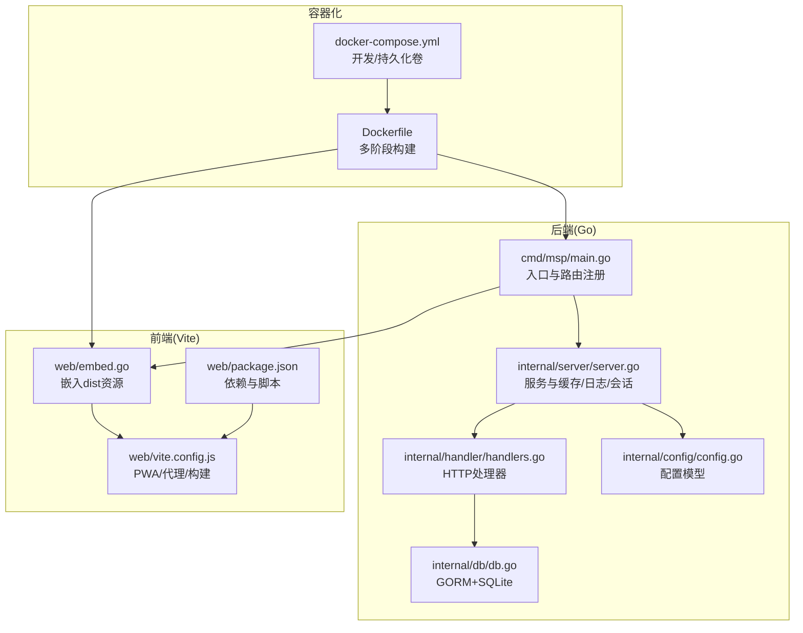
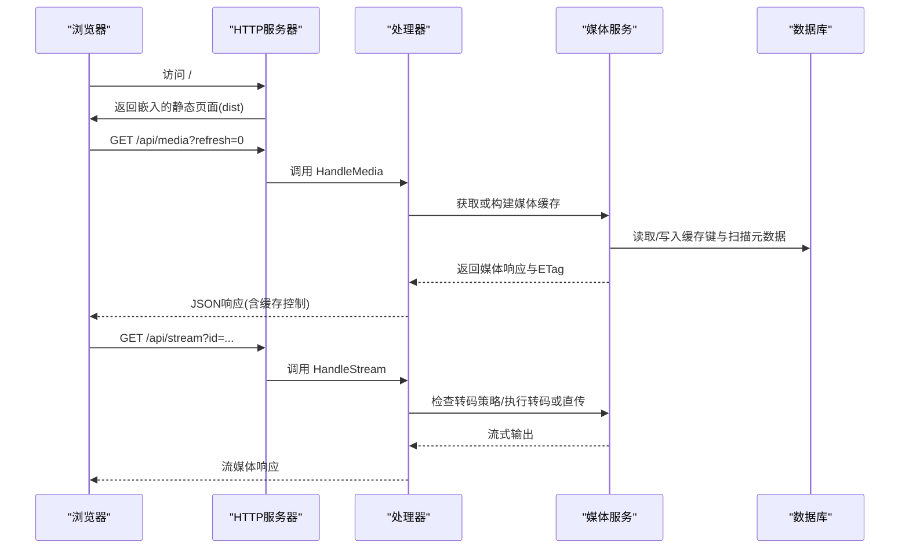
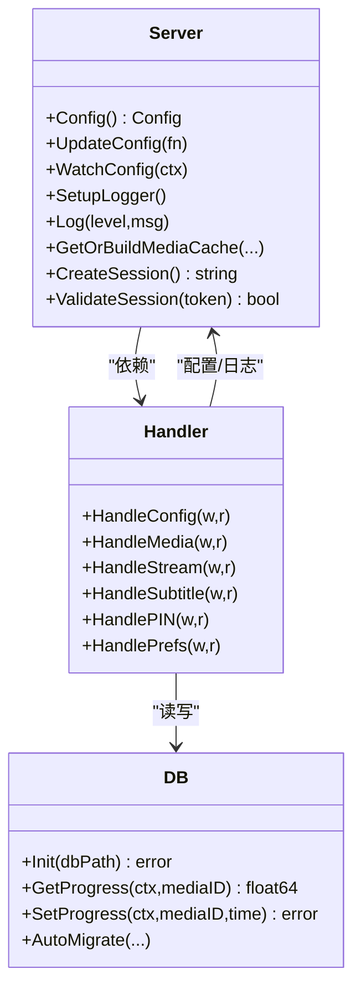
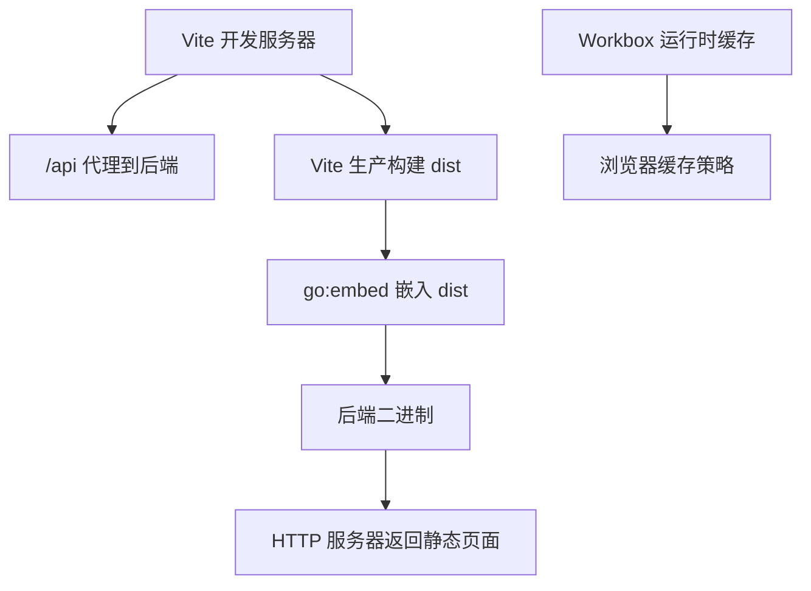
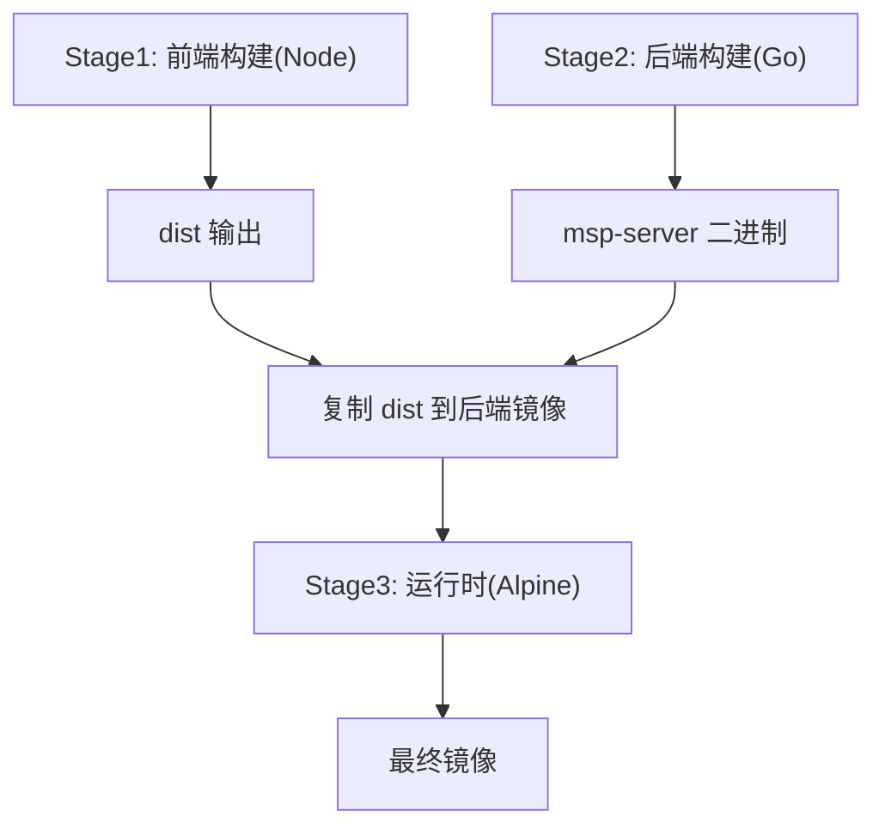
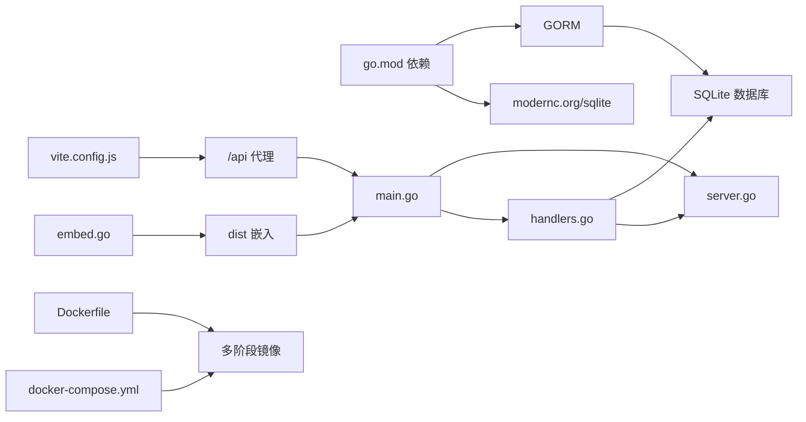

# 技术栈概览

<cite>
**本文引用的文件**
- [go.mod](file://go.mod)
- [cmd/msp/main.go](file://cmd/msp/main.go)
- [internal/db/db.go](file://internal/db/db.go)
- [internal/handler/handlers.go](file://internal/handler/handlers.go)
- [internal/server/server.go](file://internal/server/server.go)
- [internal/config/config.go](file://internal/config/config.go)
- [web/package.json](file://web/package.json)
- [web/vite.config.js](file://web/vite.config.js)
- [web/embed.go](file://web/embed.go)
- [Dockerfile](file://Dockerfile)
- [docker-compose.yml](file://docker-compose.yml)
- [scripts/build.sh](file://scripts/build.sh)
- [scripts/dev.sh](file://scripts/dev.sh)
</cite>

## 目录
1. [简介](#简介)
2. [项目结构](#项目结构)
3. [核心组件](#核心组件)
4. [架构总览](#架构总览)
5. [详细组件分析](#详细组件分析)
6. [依赖关系分析](#依赖关系分析)
7. [性能考量](#性能考量)
8. [故障排查指南](#故障排查指南)
9. [结论](#结论)
10. [附录](#附录)

## 简介
本文件面向MSP项目的开发者与运维人员，系统性梳理后端、前端、容器化与开发工具链的技术栈与选型理由，并阐明它们之间的协作关系与集成方式。重点覆盖：
- 后端：Go 1.24+、HTTP路由与中间件、GORM ORM、SQLite数据库
- 前端：原生JavaScript、PWA与Workbox缓存、Vite构建与代理
- 容器化：Docker多阶段构建、CGO禁用策略、跨平台镜像
- 开发工具链：Go Modules、pnpm、Git版本控制与CI脚本

## 项目结构
MSP采用“后端Go + 前端Vite + 容器化部署”的分层架构。后端通过HTTP接口提供媒体扫描、播放、字幕与配置管理能力；前端以PWA形式提供本地局域网媒体浏览与播放体验；容器化通过多阶段构建实现最小运行时与跨平台打包。

图表来源
- [cmd/msp/main.go](file://cmd/msp/main.go#L26-L107)
- [internal/server/server.go](file://internal/server/server.go#L31-L74)
- [internal/handler/handlers.go](file://internal/handler/handlers.go#L28-L43)
- [internal/db/db.go](file://internal/db/db.go#L18-L72)
- [web/embed.go](file://web/embed.go#L1-L7)
- [web/vite.config.js](file://web/vite.config.js#L1-L48)
- [Dockerfile](file://Dockerfile#L1-L49)
- [docker-compose.yml](file://docker-compose.yml#L1-L20)

章节来源
- [cmd/msp/main.go](file://cmd/msp/main.go#L26-L107)
- [web/embed.go](file://web/embed.go#L1-L7)

## 核心组件
- 后端入口与路由：在入口处初始化配置、数据库、日志与静态资源嵌入，注册API路由与静态页面路由，组装中间件链路。
- 服务器与缓存：提供配置热加载、媒体缓存（内存+磁盘）、日志轮转、会话管理与ETag弱校验。
- 处理器：统一JSON解析限制、错误响应格式化、安全中间件、GZIP压缩、跨域与安全头、PIN认证与会话Cookie。
- 数据库：GORM + SQLite，启用WAL、同步模式与缓存大小优化，自动迁移与冲突更新策略。
- 前端：Vite开发服务器与PWA插件，Workbox运行时缓存策略，代理后端API，构建产物嵌入后端二进制。
- 容器化：Node与Go双阶段构建，CGO禁用，Alpine运行时，暴露端口与数据卷挂载，Compose一键启动。

章节来源
- [cmd/msp/main.go](file://cmd/msp/main.go#L26-L107)
- [internal/server/server.go](file://internal/server/server.go#L31-L74)
- [internal/handler/handlers.go](file://internal/handler/handlers.go#L28-L43)
- [internal/db/db.go](file://internal/db/db.go#L18-L72)
- [web/vite.config.js](file://web/vite.config.js#L1-L48)
- [Dockerfile](file://Dockerfile#L1-L49)

## 架构总览
后端以HTTP Server为核心，结合处理器模块化API，数据库负责持久化与增量扫描缓存；前端通过Vite开发与PWA增强用户体验，容器化将前后端整合为单一镜像并支持跨平台部署。

图表来源
- [cmd/msp/main.go](file://cmd/msp/main.go#L85-L107)
- [internal/handler/handlers.go](file://internal/handler/handlers.go#L333-L446)
- [internal/server/server.go](file://internal/server/server.go#L332-L396)
- [internal/db/db.go](file://internal/db/db.go#L117-L142)

## 详细组件分析

### 后端技术栈与选型
- Go 1.24+：使用Go 1.25模块声明，配合CGO禁用构建，保证跨平台静态二进制与更小体积。
- Gin未直接使用：项目基于标准库net/http，通过自定义中间件组合实现安全、日志、GZIP等功能，减少外部依赖。
- GORM ORM + SQLite：选择GORM提升开发效率与可维护性，SQLite满足单机/局域网场景的数据持久化需求；启用WAL与缓存优化，降低锁竞争与I/O开销。
- 中间件链：日志、安全、GZIP按需组合，支持超时配置与长流媒体传输。
- 配置与会话：配置热加载、会话令牌生成与过期清理、ETag弱校验与条件请求。

图表来源
- [internal/server/server.go](file://internal/server/server.go#L31-L74)
- [internal/handler/handlers.go](file://internal/handler/handlers.go#L28-L43)
- [internal/db/db.go](file://internal/db/db.go#L18-L72)

章节来源
- [go.mod](file://go.mod#L3-L9)
- [cmd/msp/main.go](file://cmd/msp/main.go#L26-L83)
- [internal/db/db.go](file://internal/db/db.go#L32-L72)
- [internal/handler/handlers.go](file://internal/handler/handlers.go#L45-L66)

### 前端技术栈与选型
- 原生JavaScript：无框架，强调轻量与可控，便于与PWA与Workbox深度集成。
- PWA与Workbox：VitePWA插件生成manifest与Service Worker，Workbox配置运行时缓存策略，区分API与静态资源，支持自动更新。
- Vite构建与代理：开发时代理/api到后端，生产构建输出dist并嵌入后端二进制。
- 资源嵌入：go:embed将dist目录打包进二进制，减少部署复杂度。

图表来源
- [web/vite.config.js](file://web/vite.config.js#L34-L47)
- [web/embed.go](file://web/embed.go#L1-L7)
- [web/package.json](file://web/package.json#L6-L17)

章节来源
- [web/package.json](file://web/package.json#L1-L25)
- [web/vite.config.js](file://web/vite.config.js#L1-L48)
- [web/embed.go](file://web/embed.go#L1-L7)

### 容器化技术栈与集成
- 多阶段构建：前端阶段使用Node+pnpm安装依赖并构建；后端阶段使用Go 1.24 Alpine，禁用CGO，链接modernc.org/sqlite实现纯Go SQLite；最终运行时使用Alpine。
- 跨平台镜像：通过脚本与Dockerfile支持Linux/Windows/macOS与ARMv7/ARMv8/amd64等目标，生成独立二进制与校验文件。
- 卷与环境：暴露8099端口，映射/data与/media卷，通过软链接将宿主机配置与数据库映射到应用工作目录。

图表来源
- [Dockerfile](file://Dockerfile#L3-L27)
- [Dockerfile](file://Dockerfile#L29-L49)
- [docker-compose.yml](file://docker-compose.yml#L1-L20)

章节来源
- [Dockerfile](file://Dockerfile#L1-L49)
- [docker-compose.yml](file://docker-compose.yml#L1-L20)
- [scripts/build.sh](file://scripts/build.sh#L150-L201)

### 开发工具链
- Go Modules：明确Go版本与依赖，间接依赖包含modernc.org/sqlite，确保跨平台SQLite兼容。
- pnpm：作为包管理器，启用Corepack以激活pnpm，提升安装速度与一致性。
- Git版本控制：仓库包含CI/CD相关文件与脚本，支持自动化构建与发布。
- CI脚本：提供跨平台构建、校验与调试二进制复制，便于发布与归档。

章节来源
- [go.mod](file://go.mod#L3-L30)
- [web/package.json](file://web/package.json#L18-L24)
- [scripts/build.sh](file://scripts/build.sh#L127-L143)
- [scripts/dev.sh](file://scripts/dev.sh#L112-L131)

## 依赖关系分析
- 后端对数据库：GORM驱动SQLite，启用WAL与缓存优化，自动迁移表结构。
- 后端对处理器：处理器依赖服务器配置、日志与会话，同时调用媒体服务与数据库。
- 前端对后端：开发时通过Vite代理/api，生产时由后端嵌入静态资源。
- 容器对构建：Dockerfile串联前端与后端构建，Compose提供开发与持久化卷。

图表来源
- [go.mod](file://go.mod#L5-L30)
- [internal/db/db.go](file://internal/db/db.go#L44-L72)
- [cmd/msp/main.go](file://cmd/msp/main.go#L26-L83)
- [internal/handler/handlers.go](file://internal/handler/handlers.go#L45-L66)
- [web/vite.config.js](file://web/vite.config.js#L34-L42)
- [web/embed.go](file://web/embed.go#L1-L7)
- [Dockerfile](file://Dockerfile#L1-L49)
- [docker-compose.yml](file://docker-compose.yml#L1-L20)

## 性能考量
- 数据库层面：启用WAL、NORMAL同步与缓存大小调整，单连接池以减少锁竞争；使用冲突更新避免重复写入。
- 缓存与传输：媒体缓存内存+磁盘双重存储，弱ETag与条件请求减少重复传输；大文件设置缓存控制，小文件禁用缓存。
- 媒体流：支持转码策略与直传回退，长流媒体不设置写超时，避免中断。
- 前端缓存：Workbox运行时缓存策略区分API与静态资源，避免API被缓存影响实时性。
- 构建优化：CGO禁用与Alpine运行时减小镜像体积，多阶段构建分离构建与运行时环境。

章节来源
- [internal/db/db.go](file://internal/db/db.go#L54-L72)
- [internal/server/server.go](file://internal/server/server.go#L332-L396)
- [internal/handler/handlers.go](file://internal/handler/handlers.go#L566-L579)
- [web/vite.config.js](file://web/vite.config.js#L10-L18)
- [Dockerfile](file://Dockerfile#L26-L49)

## 故障排查指南
- 配置热加载失败：确认配置文件路径与权限，检查后台定时器是否正常触发。
- 数据库初始化失败：检查数据库路径是否存在与权限，确认WAL设置与缓存参数是否生效。
- 媒体缓存异常：查看媒体缓存键与ETag生成逻辑，确认刷新参数与条件请求头。
- 前端代理问题：确认Vite代理目标地址与端口，检查/api前缀匹配规则。
- 容器启动失败：检查卷挂载路径、端口映射与软链接是否正确，确认运行时环境与二进制权限。

章节来源
- [internal/server/server.go](file://internal/server/server.go#L140-L188)
- [internal/db/db.go](file://internal/db/db.go#L32-L72)
- [internal/server/server.go](file://internal/server/server.go#L332-L396)
- [web/vite.config.js](file://web/vite.config.js#L34-L42)
- [docker-compose.yml](file://docker-compose.yml#L17-L19)

## 结论
MSP采用“轻量后端+原生前端+容器化交付”的技术组合，在局域网媒体分享场景下实现了高性能、低耦合与易部署。后端通过GORM+SQLite与自定义中间件满足功能与性能需求；前端借助Vite与PWA提供良好的离线与缓存体验；容器化通过多阶段构建与CGO禁用策略实现跨平台与最小化运行时。整体选型兼顾可维护性与可扩展性，适合持续演进与团队协作。

## 附录
- 技术选型背景与权衡
  - Go 1.24+：稳定生态与跨平台能力，CGO禁用适配SQLite纯Go实现，降低运行时依赖。
  - GORM + SQLite：开发效率与可移植性平衡，WAL与缓存优化适配媒体扫描与播放场景。
  - 原生JS + PWA：避免框架带来的体积与复杂度，Workbox提供可靠缓存策略。
  - Vite：快速开发与热更新，PWA插件与代理简化前后端联调。
  - Docker多阶段：构建与运行时分离，Alpine最小化运行时，pnpm加速依赖安装。