# 数据流设计

<cite>
**本文引用的文件**
- [cmd/msp/main.go](file://cmd/msp/main.go)
- [internal/config/config.go](file://internal/config/config.go)
- [internal/types/types.go](file://internal/types/types.go)
- [internal/media/media.go](file://internal/media/media.go)
- [internal/media/scanner.go](file://internal/media/scanner.go)
- [internal/media/store.go](file://internal/media/store.go)
- [internal/media/transcoder.go](file://internal/media/transcoder.go)
- [internal/handler/handlers.go](file://internal/handler/handlers.go)
- [internal/server/server.go](file://internal/server/server.go)
- [internal/db/db.go](file://internal/db/db.go)
- [internal/service/config.go](file://internal/service/config.go)
- [internal/util/util.go](file://internal/util/util.go)
- [internal/constants/constants.go](file://internal/constants/constants.go)
</cite>

## 目录
1. [简介](#简介)
2. [项目结构](#项目结构)
3. [核心组件](#核心组件)
4. [架构总览](#架构总览)
5. [详细组件分析](#详细组件分析)
6. [依赖关系分析](#依赖关系分析)
7. [性能考量](#性能考量)
8. [故障排查指南](#故障排查指南)
9. [结论](#结论)
10. [附录](#附录)

## 简介
本文件面向MSP项目，系统性梳理从配置加载到运行时热更新、从媒体扫描到缓存构建、从HTTP请求处理到响应生成的完整数据流。重点解释核心数据结构（MediaItem、MediaResponse、UserPref等）的生命周期与跨层传递方式，覆盖内存缓存、磁盘持久化、网络传输等环节，并提供数据流图与时序图，帮助开发者与运维人员快速定位问题与优化性能。

## 项目结构
MSP采用分层清晰的Go模块化组织：
- cmd/msp：应用入口，负责初始化、路由注册、配置热监听与媒体缓存预构建
- internal/config：配置模型与默认值应用
- internal/types：核心数据模型定义
- internal/media：媒体扫描、索引、转码与探测
- internal/handler：HTTP处理器，封装业务逻辑与安全中间件
- internal/server：服务端状态、缓存、日志与会话管理
- internal/db：SQLite抽象与GORM操作
- internal/service：配置服务，提供安全视图与更新
- internal/util：工具函数（路径、ID编解码、校验等）
- internal/constants：集中常量定义

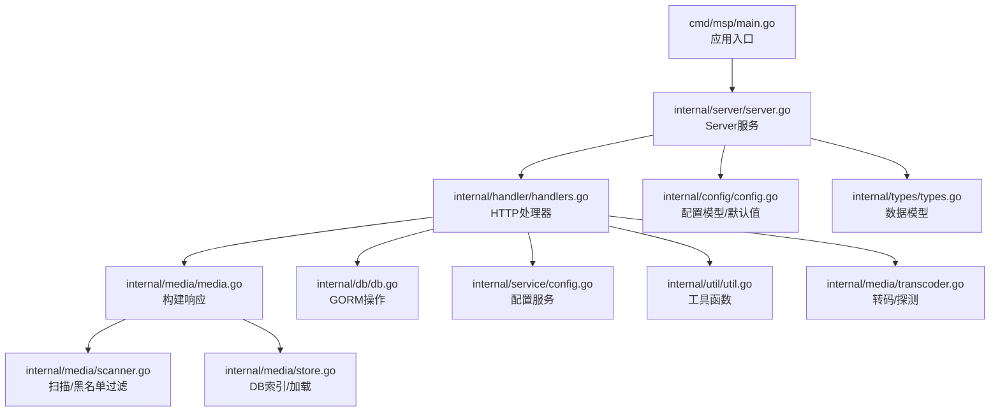

图表来源
- [cmd/msp/main.go](file://cmd/msp/main.go#L26-L83)
- [internal/server/server.go](file://internal/server/server.go#L65-L74)
- [internal/handler/handlers.go](file://internal/handler/handlers.go#L38-L43)
- [internal/media/media.go](file://internal/media/media.go#L12-L52)
- [internal/media/scanner.go](file://internal/media/scanner.go#L25-L57)
- [internal/media/store.go](file://internal/media/store.go#L17-L47)
- [internal/db/db.go](file://internal/db/db.go#L32-L72)
- [internal/service/config.go](file://internal/service/config.go#L12-L18)
- [internal/util/util.go](file://internal/util/util.go#L18-L34)
- [internal/config/config.go](file://internal/config/config.go#L77-L88)
- [internal/types/types.go](file://internal/types/types.go#L16-L66)
- [internal/media/transcoder.go](file://internal/media/transcoder.go#L138-L248)

章节来源
- [cmd/msp/main.go](file://cmd/msp/main.go#L26-L83)
- [internal/server/server.go](file://internal/server/server.go#L65-L74)

## 核心组件
- 配置系统：Config模型、默认值应用、安全视图、热重载
- 媒体扫描与索引：WalkShares、黑名单过滤、批量入库、增量扫描
- 缓存与响应：内存缓存（JSON序列化）、ETag、磁盘缓存、条件响应
- HTTP处理：路由注册、鉴权/安全中间件、限流、转码策略
- 数据持久化：SQLite/GORM、扫描元数据、用户偏好、播放进度
- 工具与常量：路径规范化、ID编解码、尺寸解析、私有IP检测

章节来源
- [internal/config/config.go](file://internal/config/config.go#L77-L146)
- [internal/types/types.go](file://internal/types/types.go#L16-L66)
- [internal/server/server.go](file://internal/server/server.go#L332-L396)
- [internal/media/store.go](file://internal/media/store.go#L49-L94)
- [internal/handler/handlers.go](file://internal/handler/handlers.go#L45-L66)
- [internal/db/db.go](file://internal/db/db.go#L32-L72)
- [internal/util/util.go](file://internal/util/util.go#L18-L34)
- [internal/constants/constants.go](file://internal/constants/constants.go#L7-L50)

## 架构总览
下图展示从配置加载到HTTP响应的端到端数据流，包含内存缓存、磁盘缓存、数据库索引与网络传输。

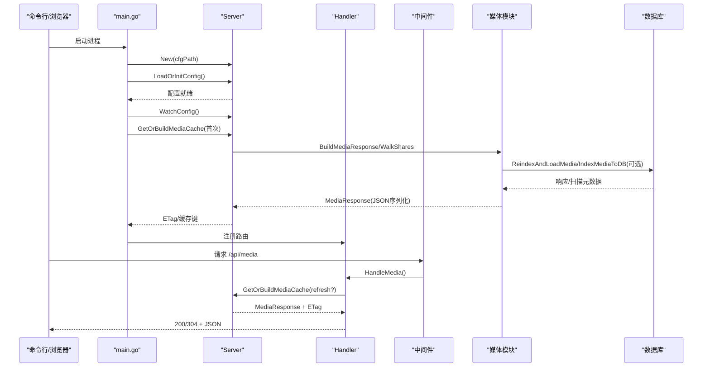

图表来源
- [cmd/msp/main.go](file://cmd/msp/main.go#L30-L51)
- [internal/server/server.go](file://internal/server/server.go#L332-L396)
- [internal/media/media.go](file://internal/media/media.go#L12-L52)
- [internal/media/store.go](file://internal/media/store.go#L33-L47)
- [internal/handler/handlers.go](file://internal/handler/handlers.go#L333-L362)

## 详细组件分析

### 配置加载与热更新
- 加载顺序：读取配置文件 → 应用默认值 → 保存必要字段到磁盘
- 热重载：后台定时轮询配置文件修改时间，发现变更则重新解析并更新内存配置
- 安全视图：对外仅暴露非敏感字段，隐藏PIN等敏感信息

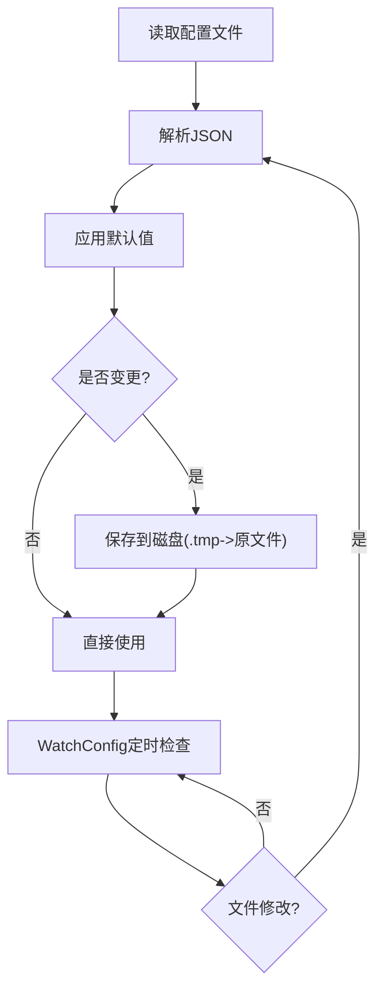

图表来源
- [internal/server/server.go](file://internal/server/server.go#L76-L112)
- [internal/config/config.go](file://internal/config/config.go#L148-L162)
- [internal/server/server.go](file://internal/server/server.go#L140-L188)
- [internal/service/config.go](file://internal/service/config.go#L28-L71)

章节来源
- [internal/server/server.go](file://internal/server/server.go#L76-L112)
- [internal/server/server.go](file://internal/server/server.go#L140-L188)
- [internal/service/config.go](file://internal/service/config.go#L28-L71)

### 媒体扫描与缓存构建
- 扫描策略：WalkShares遍历共享目录，按黑名单过滤，支持上下文取消与限速
- 索引与加载：IndexMediaToDB进行批量入库；ReindexAndLoadMedia先索引再加载；LoadMediaFromDB按缓存键命中
- 响应构建：BuildMediaResponse聚合视频/音频/图片/其他，排序并返回
- 缓存策略：内存JSON缓存 + ETag弱校验；磁盘缓存（无DB时）；TTL失效自动重建

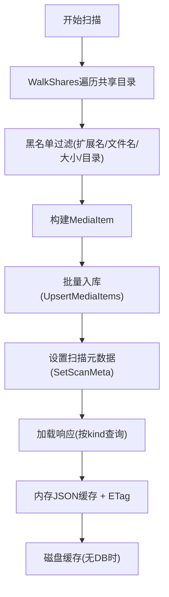

图表来源
- [internal/media/scanner.go](file://internal/media/scanner.go#L25-L57)
- [internal/media/scanner.go](file://internal/media/scanner.go#L74-L106)
- [internal/media/store.go](file://internal/media/store.go#L49-L94)
- [internal/media/store.go](file://internal/media/store.go#L111-L152)
- [internal/media/store.go](file://internal/media/store.go#L164-L197)
- [internal/media/media.go](file://internal/media/media.go#L12-L52)
- [internal/server/server.go](file://internal/server/server.go#L398-L437)
- [internal/server/server.go](file://internal/server/server.go#L487-L536)

章节来源
- [internal/media/scanner.go](file://internal/media/scanner.go#L25-L57)
- [internal/media/store.go](file://internal/media/store.go#L49-L94)
- [internal/media/media.go](file://internal/media/media.go#L12-L52)
- [internal/server/server.go](file://internal/server/server.go#L398-L437)

### HTTP请求处理与响应生成
- 路由注册：/api/config、/api/media、/api/stream、/api/subtitle、/api/probe、/api/prefs、/api/progress、/api/pin等
- 中间件链：WithLog → WithSecurity → WithGzip
- 媒体响应：支持limit参数裁剪、ETag条件响应、刷新策略
- 流媒体：支持直播与转码（受配置策略与FFmpeg可用性约束）

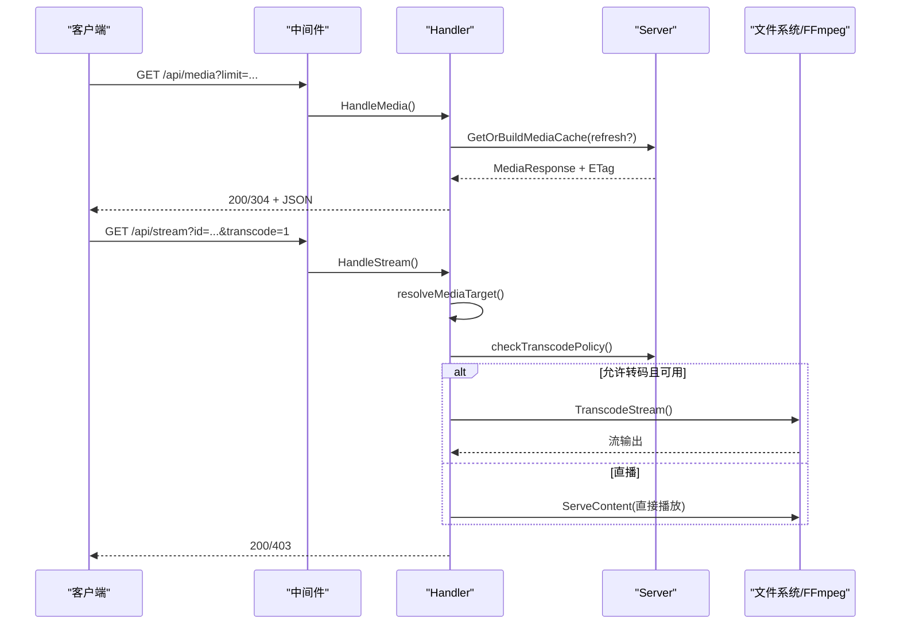

图表来源
- [cmd/msp/main.go](file://cmd/msp/main.go#L85-L107)
- [internal/handler/handlers.go](file://internal/handler/handlers.go#L333-L362)
- [internal/handler/handlers.go](file://internal/handler/handlers.go#L413-L446)
- [internal/handler/handlers.go](file://internal/handler/handlers.go#L513-L532)
- [internal/media/transcoder.go](file://internal/media/transcoder.go#L138-L248)

章节来源
- [cmd/msp/main.go](file://cmd/msp/main.go#L85-L107)
- [internal/handler/handlers.go](file://internal/handler/handlers.go#L333-L362)
- [internal/handler/handlers.go](file://internal/handler/handlers.go#L413-L446)
- [internal/media/transcoder.go](file://internal/media/transcoder.go#L138-L248)

### 数据结构生命周期

#### MediaItem
- 创建：扫描阶段由buildMediaItem生成，填充ID、名称、扩展名、类型、大小、修改时间、归属共享标签、扫描ID等
- 更新：通过批量Upsert更新，保持唯一性
- 销毁：当共享目录变更或扫描完成清理过期数据

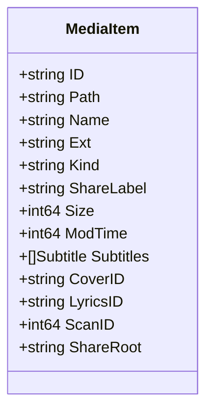

图表来源
- [internal/types/types.go](file://internal/types/types.go#L16-L32)
- [internal/media/scanner.go](file://internal/media/scanner.go#L148-L179)
- [internal/media/store.go](file://internal/media/store.go#L111-L152)

章节来源
- [internal/types/types.go](file://internal/types/types.go#L16-L32)
- [internal/media/scanner.go](file://internal/media/scanner.go#L148-L179)
- [internal/media/store.go](file://internal/media/store.go#L111-L152)

#### MediaResponse
- 创建：BuildMediaResponse聚合各类型媒体列表并排序
- 更新：每次扫描/加载后替换内存缓存
- 销毁：缓存过期或配置变更触发重建

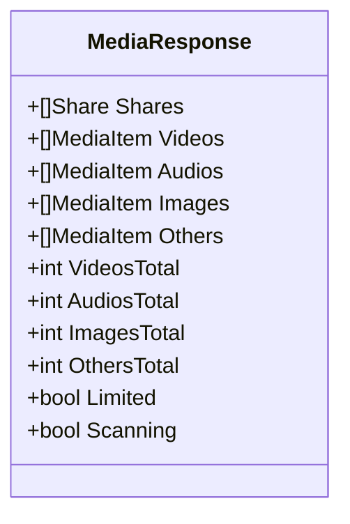

图表来源
- [internal/types/types.go](file://internal/types/types.go#L54-L66)
- [internal/media/media.go](file://internal/media/media.go#L12-L52)

章节来源
- [internal/types/types.go](file://internal/types/types.go#L54-L66)
- [internal/media/media.go](file://internal/media/media.go#L12-L52)

#### UserPref
- 创建：SetPrefs批量写入
- 更新：OnConflict更新
- 销毁：无显式删除逻辑，可通过覆盖实现“删除”语义

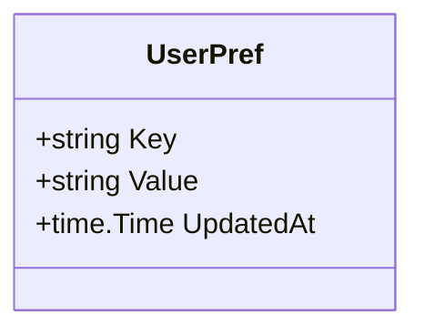

图表来源
- [internal/types/types.go](file://internal/types/types.go#L42-L46)
- [internal/db/db.go](file://internal/db/db.go#L242-L259)

章节来源
- [internal/types/types.go](file://internal/types/types.go#L42-L46)
- [internal/db/db.go](file://internal/db/db.go#L242-L259)

#### PlaybackProgress
- 创建：SetProgress写入
- 更新：OnConflict更新
- 销毁：无显式删除逻辑

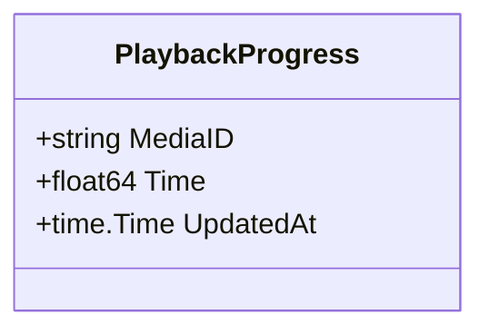

图表来源
- [internal/types/types.go](file://internal/types/types.go#L48-L52)
- [internal/db/db.go](file://internal/db/db.go#L88-L99)

章节来源
- [internal/types/types.go](file://internal/types/types.go#L48-L52)
- [internal/db/db.go](file://internal/db/db.go#L88-L99)

### 关键数据流图

#### 配置热更新数据流
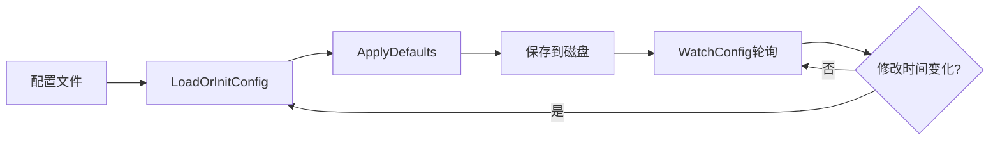

图表来源
- [internal/server/server.go](file://internal/server/server.go#L76-L112)
- [internal/config/config.go](file://internal/config/config.go#L148-L162)
- [internal/server/server.go](file://internal/server/server.go#L140-L188)

#### 媒体缓存构建与命中
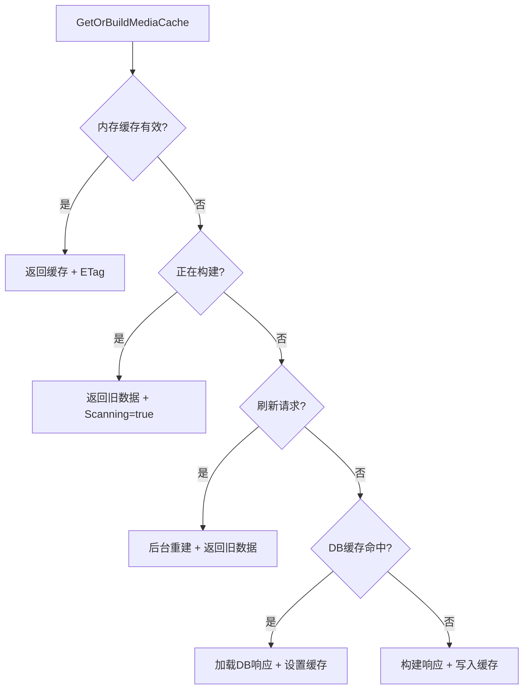

图表来源
- [internal/server/server.go](file://internal/server/server.go#L332-L396)
- [internal/server/server.go](file://internal/server/server.go#L398-L437)

#### 流媒体转码数据流
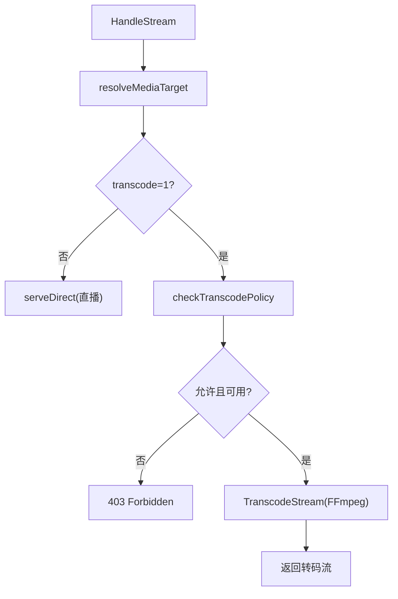

图表来源
- [internal/handler/handlers.go](file://internal/handler/handlers.go#L413-L446)
- [internal/handler/handlers.go](file://internal/handler/handlers.go#L513-L532)
- [internal/media/transcoder.go](file://internal/media/transcoder.go#L138-L248)

## 依赖关系分析
- 组件耦合
  - Server与Handler强耦合：Handler依赖Server的配置、缓存与日志能力
  - Media模块与DB模块双向协作：扫描索引写入DB，加载响应从DB读取
  - Util与各模块广泛依赖：路径规范化、ID编解码、尺寸解析、安全校验
- 外部依赖
  - SQLite/GORM：数据持久化
  - FFmpeg/FFprobe：媒体转码与探测
  - 标准库：HTTP、日志、文件系统、网络

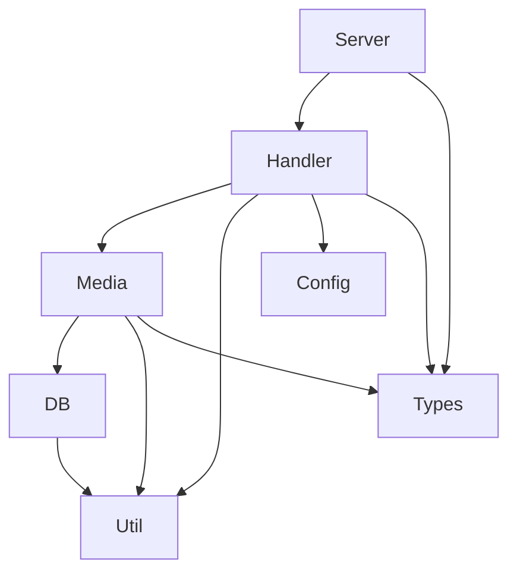

图表来源
- [internal/server/server.go](file://internal/server/server.go#L31-L56)
- [internal/handler/handlers.go](file://internal/handler/handlers.go#L28-L31)
- [internal/media/store.go](file://internal/media/store.go#L17-L47)
- [internal/db/db.go](file://internal/db/db.go#L32-L72)
- [internal/util/util.go](file://internal/util/util.go#L18-L34)
- [internal/config/config.go](file://internal/config/config.go#L77-L88)
- [internal/types/types.go](file://internal/types/types.go#L16-L66)

章节来源
- [internal/server/server.go](file://internal/server/server.go#L31-L56)
- [internal/handler/handlers.go](file://internal/handler/handlers.go#L28-L31)
- [internal/media/store.go](file://internal/media/store.go#L17-L47)
- [internal/db/db.go](file://internal/db/db.go#L32-L72)
- [internal/util/util.go](file://internal/util/util.go#L18-L34)
- [internal/config/config.go](file://internal/config/config.go#L77-L88)
- [internal/types/types.go](file://internal/types/types.go#L16-L66)

## 性能考量
- 缓存策略
  - 内存缓存：JSON序列化减少重复序列化开销；弱ETag基于构建时间与键值哈希
  - 磁盘缓存：无DB时启用，降低IO压力
  - TTL：2分钟，避免陈旧数据影响体验
- 扫描与索引
  - 批量写入：每批100条，减少事务开销
  - 上下文取消：支持长时间扫描的中断
  - 限速：默认扫描上限10万，DB模式近似无限
- 转码并发
  - 并发信号量限制为2，避免CPU资源争用
  - 智能策略：已为目标格式时复制流，否则选择合适编码器与预设
- I/O与网络
  - 大文件启用缓存头，小文件禁用缓存
  - 直播使用ServeContent，转码流禁用Content-Length并设置no-store

章节来源
- [internal/server/server.go](file://internal/server/server.go#L398-L437)
- [internal/media/store.go](file://internal/media/store.go#L118-L152)
- [internal/constants/constants.go](file://internal/constants/constants.go#L37-L60)
- [internal/media/transcoder.go](file://internal/media/transcoder.go#L15-L17)
- [internal/media/transcoder.go](file://internal/media/transcoder.go#L184-L222)
- [internal/handler/handlers.go](file://internal/handler/handlers.go#L566-L579)

## 故障排查指南
- 配置热更新未生效
  - 检查配置文件修改时间是否更新（WatchConfig轮询间隔2秒）
  - 确认ApplyDefaults是否触发保存
- 媒体缓存不更新
  - 检查refresh参数与TTL（2分钟），确认内存缓存键是否变化
  - 若DB可用，确认ScanMeta是否正确写入
- 流媒体转码失败
  - 检查transcode参数与配置策略（音频/视频Transcode开关）
  - 确认FFmpeg/FFprobe是否可用
  - 查看转码并发限制（最多2个）
- 权限与路径问题
  - 使用IsAllowedFile与WithinRoot确保路径在校验范围内
  - 使用NormalizePath与NormalizeShares规范路径

章节来源
- [internal/server/server.go](file://internal/server/server.go#L140-L188)
- [internal/server/server.go](file://internal/server/server.go#L332-L396)
- [internal/handler/handlers.go](file://internal/handler/handlers.go#L513-L532)
- [internal/media/transcoder.go](file://internal/media/transcoder.go#L91-L104)
- [internal/util/util.go](file://internal/util/util.go#L148-L182)
- [internal/util/util.go](file://internal/util/util.go#L36-L50)
- [internal/util/util.go](file://internal/util/util.go#L125-L140)

## 结论
MSP通过清晰的分层与严格的边界划分，实现了从配置到缓存再到HTTP响应的高效数据流。核心优势在于：
- 配置热更新与安全视图保障运行时灵活性与安全性
- 媒体扫描与DB索引结合，兼顾性能与一致性
- 内存/磁盘双重缓存与弱ETag机制，显著降低重复计算与网络开销
- 转码并发限制与智能策略，平衡CPU占用与用户体验

建议持续关注：
- DB性能调优（WAL、同步模式、缓存大小）
- 转码参数与并发策略的动态调整
- 日志轮转与错误上报的可观测性增强

## 附录
- 常量定义参考：端口、权限、日志轮转、缓存TTL、扫描限制、私有IP段、字节单位等
- 工具函数参考：ID编解码、路径规范化、尺寸解析、私有IP检测、同路径判断等

章节来源
- [internal/constants/constants.go](file://internal/constants/constants.go#L7-L115)
- [internal/util/util.go](file://internal/util/util.go#L18-L34)
- [internal/util/util.go](file://internal/util/util.go#L36-L50)
- [internal/util/util.go](file://internal/util/util.go#L52-L78)
- [internal/util/util.go](file://internal/util/util.go#L218-L273)