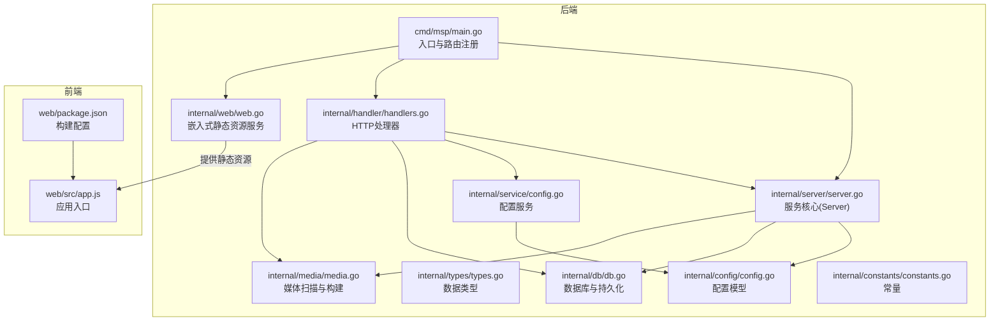
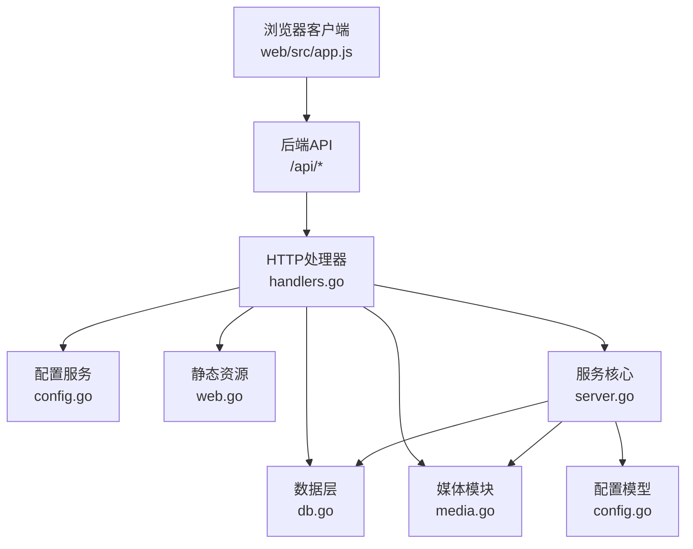
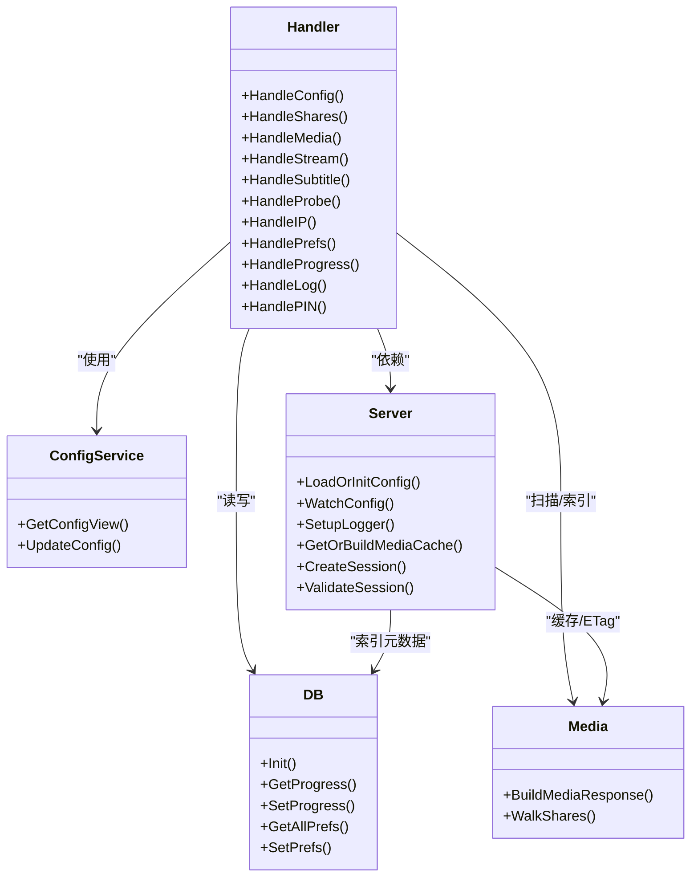
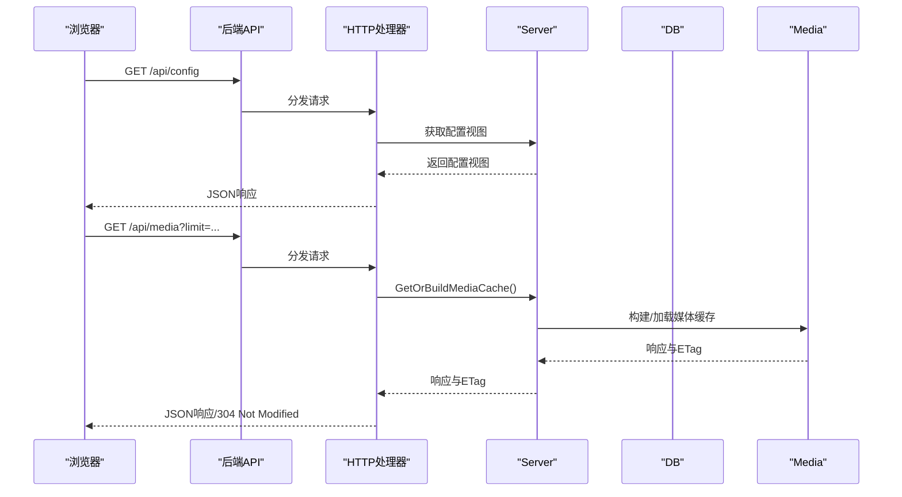
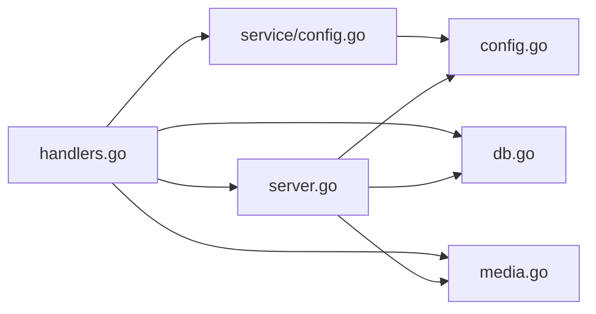
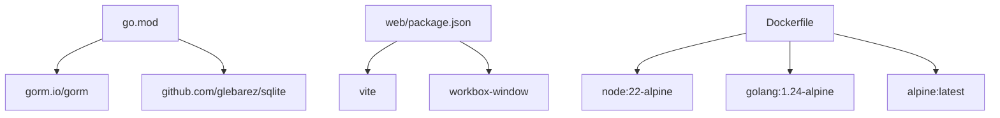

# 整体架构模式

<cite>
**本文档引用的文件**
- [cmd/msp/main.go](file://cmd/msp/main.go)
- [internal/server/server.go](file://internal/server/server.go)
- [internal/handler/handlers.go](file://internal/handler/handlers.go)
- [internal/web/web.go](file://internal/web/web.go)
- [internal/config/config.go](file://internal/config/config.go)
- [internal/service/config.go](file://internal/service/config.go)
- [internal/types/types.go](file://internal/types/types.go)
- [internal/media/media.go](file://internal/media/media.go)
- [internal/db/db.go](file://internal/db/db.go)
- [internal/constants/constants.go](file://internal/constants/constants.go)
- [web/src/app.js](file://web/src/app.js)
- [web/package.json](file://web/package.json)
- [Dockerfile](file://Dockerfile)
- [go.mod](file://go.mod)
- [README.md](file://README.md)
</cite>

## 目录
1. [引言](#引言)
2. [项目结构](#项目结构)
3. [核心组件](#核心组件)
4. [架构总览](#架构总览)
5. [详细组件分析](#详细组件分析)
6. [依赖关系分析](#依赖关系分析)
7. [性能考量](#性能考量)
8. [故障排查指南](#故障排查指南)
9. [结论](#结论)
10. [附录](#附录)

## 引言
本文件面向MSP项目的整体架构模式，系统性阐述其分层架构设计、前后端分离协作方式、微服务化与模块化理念，以及关键设计原则在代码中的体现。目标是帮助开发者快速理解系统结构与各组件职责边界，并为后续扩展与维护提供清晰的参考。

## 项目结构
MSP采用多模块Go后端与独立前端的混合架构：后端以单一二进制提供HTTP服务、静态资源嵌入与媒体处理能力；前端通过Vite构建并打包到后端资源中，运行时由后端统一托管。Dockerfile实现前后端一体化构建与运行。

**图表来源**
- [cmd/msp/main.go](file://cmd/msp/main.go#L26-L107)
- [internal/server/server.go](file://internal/server/server.go#L31-L74)
- [internal/handler/handlers.go](file://internal/handler/handlers.go#L28-L43)
- [internal/web/web.go](file://internal/web/web.go#L14-L32)
- [internal/config/config.go](file://internal/config/config.go#L77-L88)
- [internal/service/config.go](file://internal/service/config.go#L12-L18)
- [internal/types/types.go](file://internal/types/types.go#L54-L66)
- [internal/media/media.go](file://internal/media/media.go#L12-L52)
- [internal/db/db.go](file://internal/db/db.go#L32-L72)
- [internal/constants/constants.go](file://internal/constants/constants.go#L7-L14)
- [web/src/app.js](file://web/src/app.js#L1-L5)
- [web/package.json](file://web/package.json#L1-L25)

**章节来源**
- [cmd/msp/main.go](file://cmd/msp/main.go#L26-L107)
- [Dockerfile](file://Dockerfile#L1-L49)
- [README.md](file://README.md#L21-L31)

## 核心组件
- 入口与路由注册：负责初始化配置、数据库、日志与静态资源，注册API路由并启动HTTP服务。
- 服务核心（Server）：集中管理配置、日志、媒体缓存、会话与并发控制，提供配置热重载与媒体缓存策略。
- HTTP处理器（Handler）：实现REST风格API，协调配置服务、数据库与媒体模块，处理鉴权、流媒体与字幕转换。
- 配置服务（ConfigService）：生成前端安全可见的配置视图，执行配置更新与校验。
- 数据层（DB）：基于GORM/SQLite的轻量持久化，支撑播放进度、用户偏好与媒体索引元数据。
- 媒体模块（Media）：扫描共享目录、构建媒体响应、支持增量索引与缓存。
- 静态资源（Web）：将前端构建产物嵌入二进制，提供统一的静态文件服务与缓存策略。
- 类型与常量：统一的数据结构与系统常量，确保跨模块一致性。

**章节来源**
- [internal/server/server.go](file://internal/server/server.go#L31-L74)
- [internal/handler/handlers.go](file://internal/handler/handlers.go#L28-L43)
- [internal/service/config.go](file://internal/service/config.go#L12-L18)
- [internal/db/db.go](file://internal/db/db.go#L18-L72)
- [internal/media/media.go](file://internal/media/media.go#L12-L52)
- [internal/web/web.go](file://internal/web/web.go#L14-L32)
- [internal/types/types.go](file://internal/types/types.go#L54-L66)
- [internal/constants/constants.go](file://internal/constants/constants.go#L7-L14)

## 架构总览
MSP采用“单二进制”后端+“前端构建产物嵌入”的前后端分离模式。后端提供统一的HTTP服务，包含：
- 静态资源服务：直接从嵌入式文件系统提供前端产物。
- API服务：配置、媒体、播放、日志、认证等接口。
- 媒体服务：扫描、索引、缓存与转码（可选）。
- 数据持久化：SQLite + GORM，用于播放进度、用户偏好与索引元数据。

**图表来源**
- [internal/handler/handlers.go](file://internal/handler/handlers.go#L45-L104)
- [internal/web/web.go](file://internal/web/web.go#L14-L32)
- [internal/server/server.go](file://internal/server/server.go#L31-L74)
- [internal/service/config.go](file://internal/service/config.go#L73-L90)
- [internal/db/db.go](file://internal/db/db.go#L32-L72)
- [internal/media/media.go](file://internal/media/media.go#L12-L52)
- [internal/config/config.go](file://internal/config/config.go#L77-L88)

## 详细组件分析

### 分层架构与职责划分
- 表现层（前端）
  - 职责：用户界面渲染、事件处理、与后端API通信。
  - 实现：Vite构建，入口为web/src/app.js，打包产物嵌入后端。
- 控制层（后端HTTP处理器）
  - 职责：接收请求、参数解析、鉴权与会话管理、调用业务服务与数据层。
  - 实现：handlers.go中按API路径分发，统一中间件链路。
- 业务层（服务与媒体）
  - 职责：配置视图生成、配置更新、媒体扫描与缓存、转码策略。
  - 实现：service/config.go、media/media.go。
- 数据层（数据库与缓存）
  - 职责：持久化播放进度、用户偏好、媒体索引元数据；内存与磁盘缓存媒体列表。
  - 实现：db.go、server.go中的媒体缓存与ETag机制。

**图表来源**
- [internal/handler/handlers.go](file://internal/handler/handlers.go#L28-L43)
- [internal/service/config.go](file://internal/service/config.go#L12-L18)
- [internal/server/server.go](file://internal/server/server.go#L31-L74)
- [internal/db/db.go](file://internal/db/db.go#L18-L72)
- [internal/media/media.go](file://internal/media/media.go#L12-L52)

**章节来源**
- [internal/handler/handlers.go](file://internal/handler/handlers.go#L45-L104)
- [internal/server/server.go](file://internal/server/server.go#L332-L396)
- [internal/db/db.go](file://internal/db/db.go#L32-L72)
- [internal/media/media.go](file://internal/media/media.go#L12-L52)

### 前后端分离与协作模式
- 前端通过Vite开发与构建，生产构建产物位于web/dist，后端以嵌入式文件系统提供。
- 后端统一暴露REST API，前端通过XHR/Fetch与后端交互，实现配置、媒体列表、播放进度、字幕等能力。
- 静态资源服务根据扩展名自动设置Content-Type与缓存策略，支持条件请求与范围请求。

**图表来源**
- [internal/handler/handlers.go](file://internal/handler/handlers.go#L45-L104)
- [internal/handler/handlers.go](file://internal/handler/handlers.go#L333-L362)
- [internal/server/server.go](file://internal/server/server.go#L332-L396)
- [internal/media/media.go](file://internal/media/media.go#L12-L52)

**章节来源**
- [internal/web/web.go](file://internal/web/web.go#L14-L32)
- [web/src/app.js](file://web/src/app.js#L1-L5)
- [web/package.json](file://web/package.json#L1-L25)

### 微服务化思路与模块化设计
- 模块边界清晰：handler、service、server、db、media、web、types、config、constants各自职责明确，通过接口与依赖注入弱耦合。
- 可替换性：Server作为核心协调者，通过接口与具体实现解耦；DB层可替换为其他存储；媒体扫描策略可扩展。
- 接口契约：Handler仅依赖抽象（Server、ConfigService），不直接依赖具体实现细节，便于测试与演进。

**图表来源**
- [internal/handler/handlers.go](file://internal/handler/handlers.go#L28-L43)
- [internal/server/server.go](file://internal/server/server.go#L31-L74)
- [internal/service/config.go](file://internal/service/config.go#L12-L18)
- [internal/db/db.go](file://internal/db/db.go#L18-L72)
- [internal/media/media.go](file://internal/media/media.go#L12-L52)
- [internal/config/config.go](file://internal/config/config.go#L77-L88)

**章节来源**
- [internal/handler/handlers.go](file://internal/handler/handlers.go#L28-L43)
- [internal/server/server.go](file://internal/server/server.go#L31-L74)

### 关键设计原则
- 单一职责：Handler专注HTTP协议与参数处理；Server专注配置、缓存与会话；DB专注数据持久化；Media专注媒体扫描与构建。
- 开闭原则：通过接口与抽象（如Server对DB、Media的依赖）实现对扩展开放、对修改封闭。
- 依赖倒置：高层模块（Handler、Server）依赖抽象（接口/抽象类型），低层模块（DB、Media）实现具体逻辑。
- 最小惊讶：统一的错误响应格式、一致的HTTP状态码使用、严格的输入校验与超时控制。

**章节来源**
- [internal/handler/handlers.go](file://internal/handler/handlers.go#L686-L720)
- [internal/server/server.go](file://internal/server/server.go#L222-L248)
- [internal/constants/constants.go](file://internal/constants/constants.go#L97-L108)

## 依赖关系分析
- 后端依赖：Go 1.25+，SQLite驱动与GORM，用于本地数据库与ORM操作。
- 前端依赖：Vite、Workbox（PWA）、pnpm包管理，构建产物嵌入后端。
- Docker：多阶段构建，先构建前端再构建后端，最终运行于Alpine容器。

**图表来源**
- [go.mod](file://go.mod#L5-L9)
- [web/package.json](file://web/package.json#L11-L17)
- [Dockerfile](file://Dockerfile#L1-L49)

**章节来源**
- [go.mod](file://go.mod#L1-L31)
- [web/package.json](file://web/package.json#L1-L25)
- [Dockerfile](file://Dockerfile#L1-L49)

## 性能考量
- 媒体缓存：Server内置内存缓存与ETag，结合磁盘缓存与TTL，降低重复扫描成本。
- 数据库优化：SQLite WAL模式、连接池配置、预编译语句与显式事务控制，减少锁竞争与IO开销。
- 流媒体传输：优先直播放，必要时按需转码；大文件设置合理缓存策略，小文件禁用缓存。
- 日志与监控：按级别输出与轮转，避免高频写入影响性能。

**章节来源**
- [internal/server/server.go](file://internal/server/server.go#L332-L396)
- [internal/db/db.go](file://internal/db/db.go#L32-L72)
- [internal/handler/handlers.go](file://internal/handler/handlers.go#L566-L579)

## 故障排查指南
- 配置热重载失败：确认配置文件路径与权限，检查配置变更检测循环与日志输出。
- 媒体缓存异常：检查缓存键生成、ETag计算与重建流程，验证磁盘缓存文件存在性。
- 数据库写入冲突：关注ON CONFLICT策略与事务边界，定位并发写入问题。
- 静态资源404：确认嵌入式文件系统路径与扩展名映射，检查缓存头设置。
- 转码失败：确认FFmpeg可用性与转码策略，查看转码回退逻辑。

**章节来源**
- [internal/server/server.go](file://internal/server/server.go#L140-L188)
- [internal/server/server.go](file://internal/server/server.go#L487-L536)
- [internal/db/db.go](file://internal/db/db.go#L130-L142)
- [internal/web/web.go](file://internal/web/web.go#L14-L32)
- [internal/handler/handlers.go](file://internal/handler/handlers.go#L534-L564)

## 结论
MSP通过清晰的分层与模块化设计，实现了“单二进制后端+前端构建产物嵌入”的高效部署模式。其核心在于：以Server为中心的配置与缓存治理、以Handler为核心的API编排、以DB与Media为支撑的数据与媒体能力，以及以Web为载体的静态资源服务。该架构既满足家庭局域网场景的易用性，又具备良好的扩展性与可维护性。

## 附录
- 快速启动：下载二进制后直接运行，打开控制台打印的URL即可访问。
- 构建流程：前端Vite构建产物复制到后端web/dist，后端CGO关闭编译，Docker多阶段构建。
- 文档与Wiki：项目提供安装、配置、播放与安全等完整文档索引。

**章节来源**
- [README.md](file://README.md#L61-L71)
- [Dockerfile](file://Dockerfile#L26-L27)
- [README.md](file://README.md#L73-L81)