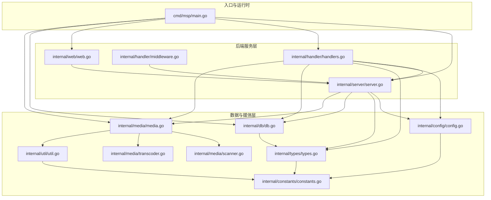
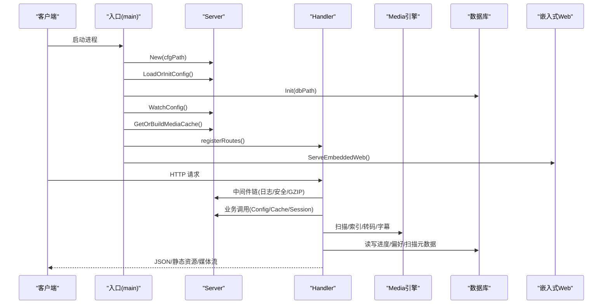
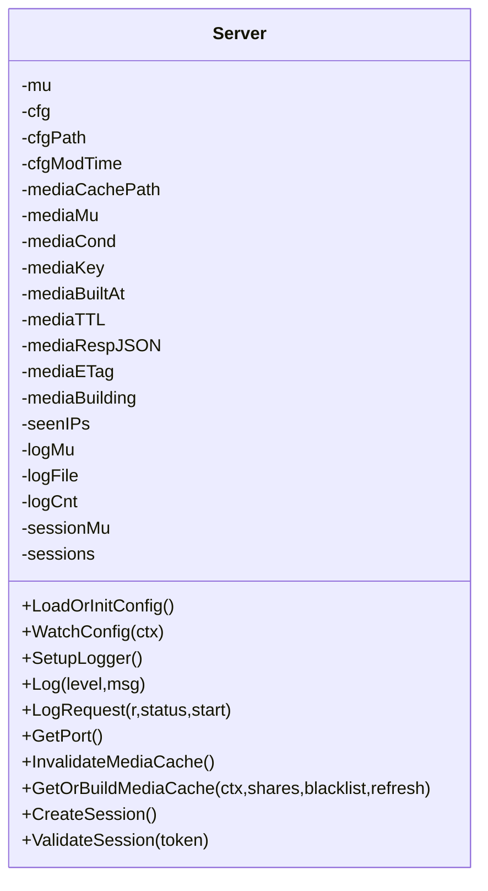
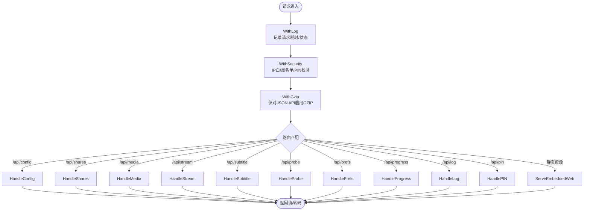
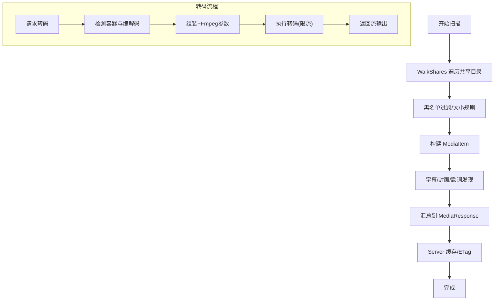
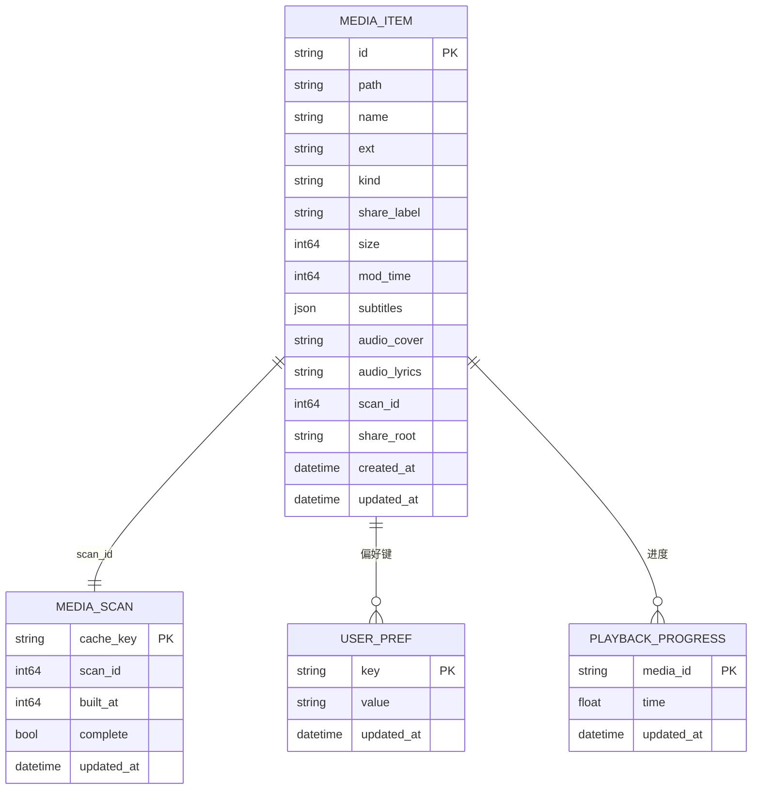
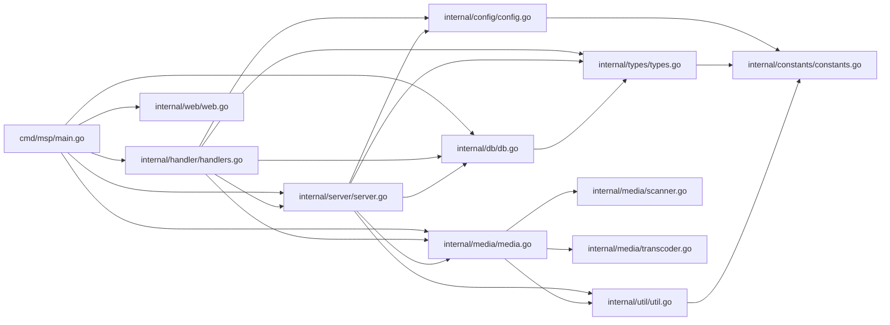

# 架构设计

<cite>
**本文引用的文件**
- [cmd/msp/main.go](file://cmd/msp/main.go)
- [internal/server/server.go](file://internal/server/server.go)
- [internal/handler/handlers.go](file://internal/handler/handlers.go)
- [internal/handler/middleware.go](file://internal/handler/middleware.go)
- [internal/media/media.go](file://internal/media/media.go)
- [internal/media/scanner.go](file://internal/media/scanner.go)
- [internal/media/transcoder.go](file://internal/media/transcoder.go)
- [internal/db/db.go](file://internal/db/db.go)
- [internal/web/web.go](file://internal/web/web.go)
- [internal/config/config.go](file://internal/config/config.go)
- [internal/types/types.go](file://internal/types/types.go)
- [internal/util/util.go](file://internal/util/util.go)
- [internal/constants/constants.go](file://internal/constants/constants.go)
- [go.mod](file://go.mod)
</cite>

## 目录
1. [简介](#简介)
2. [项目结构](#项目结构)
3. [核心组件](#核心组件)
4. [架构总览](#架构总览)
5. [详细组件分析](#详细组件分析)
6. [依赖关系分析](#依赖关系分析)
7. [性能考量](#性能考量)
8. [故障排查指南](#故障排查指南)
9. [结论](#结论)
10. [附录](#附录)

## 简介
本项目是一个基于 Go 的媒体服务应用，提供媒体扫描、缓存、播放、字幕与转码能力，并通过内置 Web 前端提供用户界面。整体采用分层架构与前后端分离模式：
- 后端由入口程序、Server 核心协调器、Handler 处理器、Media 引擎、Database 层组成；
- 前端为嵌入式静态资源，通过 API 与后端交互；
- 支持配置热重载、媒体缓存、ETag、GZIP 压缩、安全中间件、会话认证等特性；
- 设计上强调可扩展性与可维护性，便于后续微服务化演进。

## 项目结构
项目采用按功能域划分的包结构，清晰分离各模块职责：
- cmd/msp：应用入口与生命周期管理
- internal/server：Server 核心协调器，负责配置、日志、媒体缓存、会话管理
- internal/handler：HTTP 请求处理器与中间件（日志、安全、压缩）
- internal/media：媒体扫描、索引、转码、字幕解析
- internal/db：SQLite 数据访问与持久化
- internal/web：嵌入式静态资源服务
- internal/config/types/util/constants：配置模型、类型定义、工具与常量

图表来源
- [cmd/msp/main.go](file://cmd/msp/main.go#L1-L151)
- [internal/server/server.go](file://internal/server/server.go#L1-L627)
- [internal/handler/handlers.go](file://internal/handler/handlers.go#L1-L721)
- [internal/handler/middleware.go](file://internal/handler/middleware.go#L1-L229)
- [internal/web/web.go](file://internal/web/web.go#L1-L84)
- [internal/media/media.go](file://internal/media/media.go#L1-L53)
- [internal/media/scanner.go](file://internal/media/scanner.go#L1-L800)
- [internal/media/transcoder.go](file://internal/media/transcoder.go#L1-L249)
- [internal/db/db.go](file://internal/db/db.go#L1-L270)
- [internal/config/config.go](file://internal/config/config.go#L1-L286)
- [internal/types/types.go](file://internal/types/types.go#L1-L112)
- [internal/util/util.go](file://internal/util/util.go#L1-L288)
- [internal/constants/constants.go](file://internal/constants/constants.go#L1-L115)

章节来源
- [cmd/msp/main.go](file://cmd/msp/main.go#L1-L151)
- [go.mod](file://go.mod#L1-L31)

## 核心组件
- Server 核心协调器：负责配置加载与热重载、日志与轮转、媒体缓存（内存+磁盘）、ETag、会话管理（PIN 认证）
- Handler 处理器：统一注册路由，处理 API 请求，调用服务层与媒体层，返回 JSON 响应
- Media 引擎：扫描共享目录、构建媒体响应、字幕与封面发现、容器探测、转码（可选）
- Database 层：SQLite 存储媒体扫描元数据、播放进度、用户偏好
- Web 资产：嵌入式静态资源服务，提供前端页面与资源
- 工具与常量：路径规范化、ID 编解码、尺寸解析、安全校验、日志与缓存常量

章节来源
- [internal/server/server.go](file://internal/server/server.go#L31-L74)
- [internal/handler/handlers.go](file://internal/handler/handlers.go#L28-L43)
- [internal/media/media.go](file://internal/media/media.go#L12-L52)
- [internal/db/db.go](file://internal/db/db.go#L32-L72)
- [internal/web/web.go](file://internal/web/web.go#L14-L32)
- [internal/util/util.go](file://internal/util/util.go#L18-L34)
- [internal/constants/constants.go](file://internal/constants/constants.go#L7-L50)

## 架构总览
系统采用“入口程序 + Server 协调器 + Handler + 媒体引擎 + 数据库 + 嵌入式 Web”的分层架构，前后端分离，API 驱动交互。核心流程：
- 启动阶段：加载配置、初始化数据库、启动配置热重载、触发首次媒体扫描
- 请求阶段：中间件链（日志、安全、压缩）→ 路由分发 → Handler → 业务处理（Server/DB/Media）
- 响应阶段：JSON 响应或静态资源返回；媒体流支持直传或转码

图表来源
- [cmd/msp/main.go](file://cmd/msp/main.go#L26-L83)
- [internal/server/server.go](file://internal/server/server.go#L76-L125)
- [internal/handler/handlers.go](file://internal/handler/handlers.go#L85-L107)
- [internal/web/web.go](file://internal/web/web.go#L14-L32)
- [internal/db/db.go](file://internal/db/db.go#L32-L72)

## 详细组件分析

### Server 核心协调器
职责与特性：
- 配置管理：加载/保存配置、默认值填充、热重载监听
- 日志管理：级别过滤、轮转、并发安全
- 媒体缓存：内存缓存（含 ETag）、TTL、重建、磁盘缓存回退
- 会话管理：PIN 认证、会话令牌、过期清理
- 并发与同步：读写锁、条件变量、原子计数

图表来源
- [internal/server/server.go](file://internal/server/server.go#L31-L74)
- [internal/server/server.go](file://internal/server/server.go#L76-L188)
- [internal/server/server.go](file://internal/server/server.go#L190-L284)
- [internal/server/server.go](file://internal/server/server.go#L322-L396)
- [internal/server/server.go](file://internal/server/server.go#L570-L626)

章节来源
- [internal/server/server.go](file://internal/server/server.go#L31-L74)
- [internal/server/server.go](file://internal/server/server.go#L76-L188)
- [internal/server/server.go](file://internal/server/server.go#L190-L284)
- [internal/server/server.go](file://internal/server/server.go#L322-L396)
- [internal/server/server.go](file://internal/server/server.go#L570-L626)

### Handler 处理器与中间件
职责与特性：
- 路由注册：/api/* 与静态资源路由
- 中间件链：日志记录、安全校验（IP 白/黑名单、PIN 会话）、GZIP 压缩
- API 实现：配置、分享目录、媒体列表、流媒体、字幕、探测、进度、日志、PIN
- 安全：常量时间比较、会话校验、安全头设置

图表来源
- [internal/handler/middleware.go](file://internal/handler/middleware.go#L25-L43)
- [internal/handler/middleware.go](file://internal/handler/middleware.go#L45-L76)
- [internal/handler/middleware.go](file://internal/handler/middleware.go#L77-L120)
- [internal/handler/middleware.go](file://internal/handler/middleware.go#L203-L229)
- [internal/handler/handlers.go](file://internal/handler/handlers.go#L85-L107)
- [internal/web/web.go](file://internal/web/web.go#L14-L32)

章节来源
- [internal/handler/middleware.go](file://internal/handler/middleware.go#L25-L43)
- [internal/handler/middleware.go](file://internal/handler/middleware.go#L45-L76)
- [internal/handler/middleware.go](file://internal/handler/middleware.go#L77-L120)
- [internal/handler/middleware.go](file://internal/handler/middleware.go#L203-L229)
- [internal/handler/handlers.go](file://internal/handler/handlers.go#L45-L66)
- [internal/handler/handlers.go](file://internal/handler/handlers.go#L68-L94)
- [internal/handler/handlers.go](file://internal/handler/handlers.go#L333-L362)
- [internal/handler/handlers.go](file://internal/handler/handlers.go#L413-L446)
- [internal/handler/handlers.go](file://internal/handler/handlers.go#L623-L646)
- [internal/handler/handlers.go](file://internal/handler/handlers.go#L581-L621)
- [internal/handler/handlers.go](file://internal/handler/handlers.go#L161-L190)
- [internal/handler/handlers.go](file://internal/handler/handlers.go#L192-L233)
- [internal/handler/handlers.go](file://internal/handler/handlers.go#L235-L253)
- [internal/handler/handlers.go](file://internal/handler/handlers.go#L256-L319)
- [internal/web/web.go](file://internal/web/web.go#L14-L32)

### Media 引擎
职责与特性：
- 扫描与索引：遍历共享目录，黑名单过滤，限制扫描数量，构建媒体响应
- 字幕与封面：外挂字幕发现、歌词匹配、封面选择
- 容器探测：根据文件头识别视频/音频编码
- 转码：基于 ffmpeg/ffprobe 的智能转码，限流并发，支持格式白名单与参数校验

图表来源
- [internal/media/media.go](file://internal/media/media.go#L12-L52)
- [internal/media/scanner.go](file://internal/media/scanner.go#L25-L57)
- [internal/media/scanner.go](file://internal/media/scanner.go#L108-L146)
- [internal/media/scanner.go](file://internal/media/scanner.go#L259-L285)
- [internal/media/transcoder.go](file://internal/media/transcoder.go#L138-L248)

章节来源
- [internal/media/media.go](file://internal/media/media.go#L12-L52)
- [internal/media/scanner.go](file://internal/media/scanner.go#L25-L57)
- [internal/media/scanner.go](file://internal/media/scanner.go#L108-L146)
- [internal/media/scanner.go](file://internal/media/scanner.go#L259-L285)
- [internal/media/transcoder.go](file://internal/media/transcoder.go#L138-L248)

### Database 层
职责与特性：
- ORM：GORM + SQLite，自动迁移
- 连接池：单连接 + WAL + 优化参数
- 业务接口：播放进度、用户偏好、扫描元数据、批量 Upsert
- 事务：手动控制，避免默认事务开销

图表来源
- [internal/types/types.go](file://internal/types/types.go#L16-L52)
- [internal/db/db.go](file://internal/db/db.go#L32-L72)
- [internal/db/db.go](file://internal/db/db.go#L117-L142)
- [internal/db/db.go](file://internal/db/db.go#L144-L172)
- [internal/db/db.go](file://internal/db/db.go#L202-L224)

章节来源
- [internal/db/db.go](file://internal/db/db.go#L32-L72)
- [internal/types/types.go](file://internal/types/types.go#L16-L52)

### Web 资产
职责与特性：
- 嵌入式静态资源：通过 fs.FS 提供前端资源
- 路由策略：/ 与 /index.html 返回首页；/api/* 不透传给前端
- 内容类型与缓存策略：根据扩展名与资源类型设置 Content-Type 与 Cache-Control

章节来源
- [internal/web/web.go](file://internal/web/web.go#L14-L32)
- [internal/web/web.go](file://internal/web/web.go#L34-L68)

### 配置与类型
- 配置模型：端口、共享目录、功能开关、UI、播放策略、黑名单、安全策略、日志级别与文件
- 默认值填充：ApplyDefaults 逐项补齐缺失字段
- 类型定义：媒体项、扫描元数据、用户偏好、播放进度、API 响应结构

章节来源
- [internal/config/config.go](file://internal/config/config.go#L77-L88)
- [internal/config/config.go](file://internal/config/config.go#L94-L146)
- [internal/types/types.go](file://internal/types/types.go#L54-L112)

### 工具与常量
- ID 编解码：Base64 URL 安全编码，用于安全传递文件路径
- 路径与安全：规范化路径、符号链接解析、目录遍历防护
- 尺寸解析：支持 KB/MB/GB/TB 文本解析
- 常量：端口、PIN、权限、日志轮转、缓存 TTL、扫描限制、私有网络段、HTTP 状态码

章节来源
- [internal/util/util.go](file://internal/util/util.go#L18-L34)
- [internal/util/util.go](file://internal/util/util.go#L148-L182)
- [internal/util/util.go](file://internal/util/util.go#L52-L78)
- [internal/constants/constants.go](file://internal/constants/constants.go#L7-L115)

## 依赖关系分析
- 外部依赖：sqlite 驱动、GORM ORM
- 模块耦合：Handler 依赖 Server/DB/Media/Config/Types；Server 依赖 Config/DB/Media/Types/Util；Media 依赖 Scanner/Transcoder/Util；Web 依赖嵌入式 FS；入口依赖 Server/DB/Web

图表来源
- [go.mod](file://go.mod#L5-L9)
- [cmd/msp/main.go](file://cmd/msp/main.go#L18-L24)
- [internal/handler/handlers.go](file://internal/handler/handlers.go#L18-L26)
- [internal/server/server.go](file://internal/server/server.go#L23-L29)

章节来源
- [go.mod](file://go.mod#L1-L31)
- [cmd/msp/main.go](file://cmd/msp/main.go#L18-L24)

## 性能考量
- 媒体缓存：内存缓存 + ETag + TTL，重建异步进行，避免阻塞请求；无 DB 时磁盘缓存回退
- 数据库：单连接 + WAL + 优化参数，禁用默认事务，批量 Upsert，减少锁竞争
- 转码限流：全局信号量限制并发，避免 CPU 抢占
- 压缩：仅对 JSON API 启用 GZIP，避免对大文件流造成额外负担
- 扫描限制：默认扫描上限，避免大规模 IO 压力
- 日志轮转：按条数阈值触发，降低 Stat 开销

章节来源
- [internal/server/server.go](file://internal/server/server.go#L332-L396)
- [internal/db/db.go](file://internal/db/db.go#L32-L72)
- [internal/media/transcoder.go](file://internal/media/transcoder.go#L15-L17)
- [internal/handler/middleware.go](file://internal/handler/middleware.go#L25-L43)
- [internal/media/scanner.go](file://internal/media/scanner.go#L27-L31)
- [internal/server/server.go](file://internal/server/server.go#L250-L284)

## 故障排查指南
- 配置热重载未生效：确认配置文件修改时间变化，检查 WatchConfig 循环与错误日志
- 媒体缓存不更新：检查 InvalidateMediaCache 调用与 ETag 生成；确认刷新参数
- 转码失败：检查 ffmpeg/ffprobe 是否安装；查看转码参数与并发限制
- 安全访问被拒绝：核对 IP 白/黑名单、代理模式、会话是否过期
- 数据库异常：关注 WAL 设置、连接池参数、事务控制；检查迁移与表结构

章节来源
- [internal/server/server.go](file://internal/server/server.go#L140-L188)
- [internal/server/server.go](file://internal/server/server.go#L322-L396)
- [internal/media/transcoder.go](file://internal/media/transcoder.go#L91-L104)
- [internal/handler/middleware.go](file://internal/handler/middleware.go#L77-L120)
- [internal/db/db.go](file://internal/db/db.go#L32-L72)

## 结论
本项目以清晰的分层架构与前后端分离模式实现媒体服务，具备良好的可扩展性与可维护性。通过 Server 协调器统一管理配置、缓存与安全，Handler 与中间件提供稳定的 API 与安全边界，Media 引擎与 Database 层支撑高效的数据处理与存储。建议后续在微服务化方向上，将媒体扫描与转码拆分为独立服务，结合消息队列与容器编排进一步提升弹性与可观测性。

## 附录
- 关键设计模式
  - 中间件模式：日志、安全、压缩层层叠加
  - 工厂模式：配置默认值填充、类型实例化
  - 观察者模式：配置热重载监听
  - 策略模式：转码参数与容器探测策略
- 数据流路径
  - 配置加载：入口 → Server.LoadOrInitConfig → WatchConfig
  - 媒体扫描：Server.GetOrBuildMediaCache → Media.BuildMediaResponse → Scanner.WalkShares
  - 请求处理：Handler 路由 → 中间件 → 业务处理 → 响应
  - 媒体流：Handler.HandleStream → 转码或直传 → 流式输出