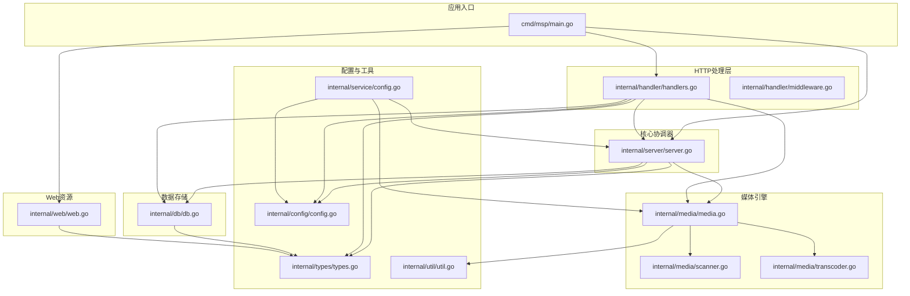
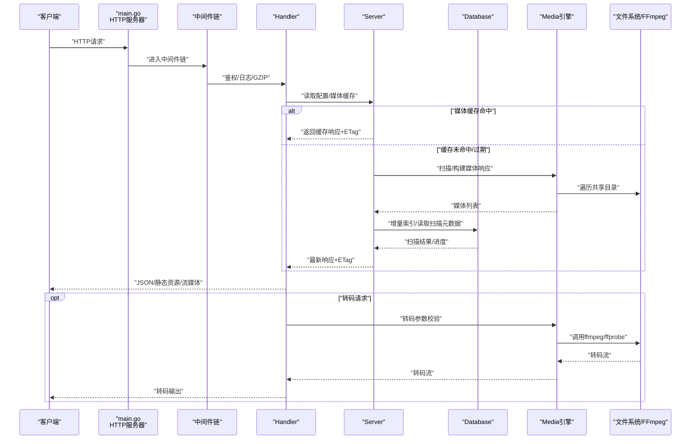
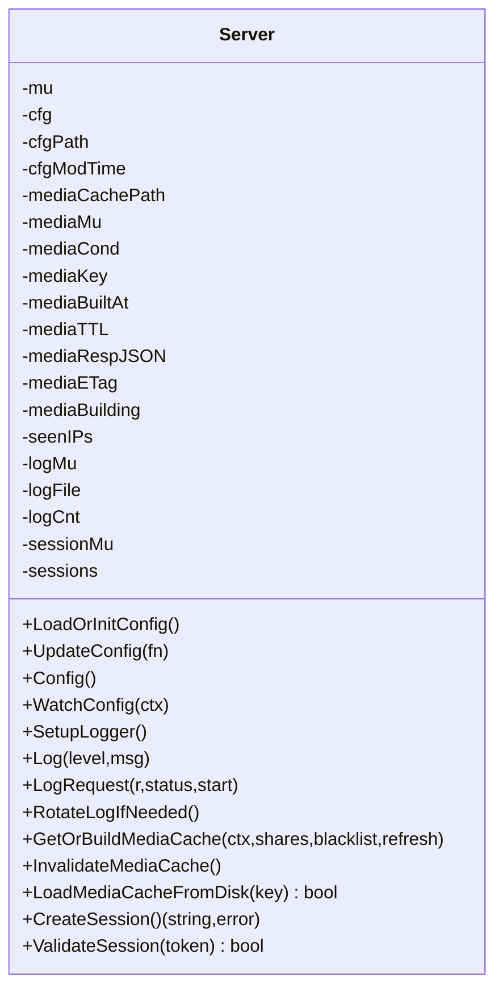
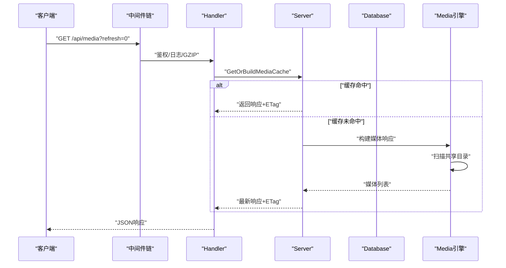
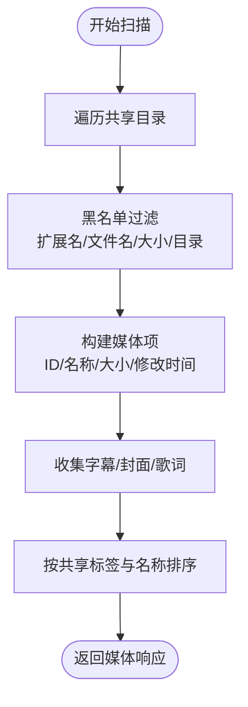
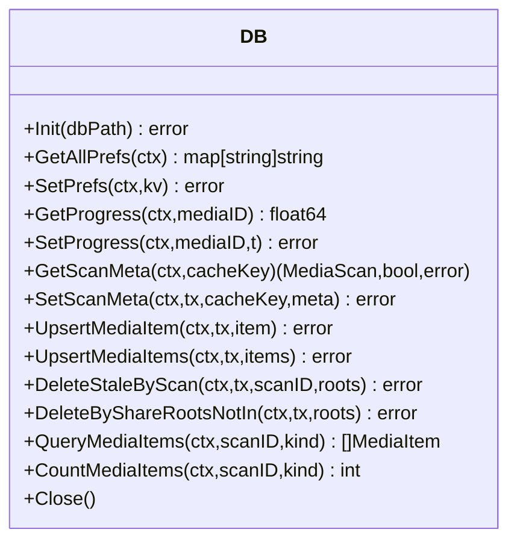
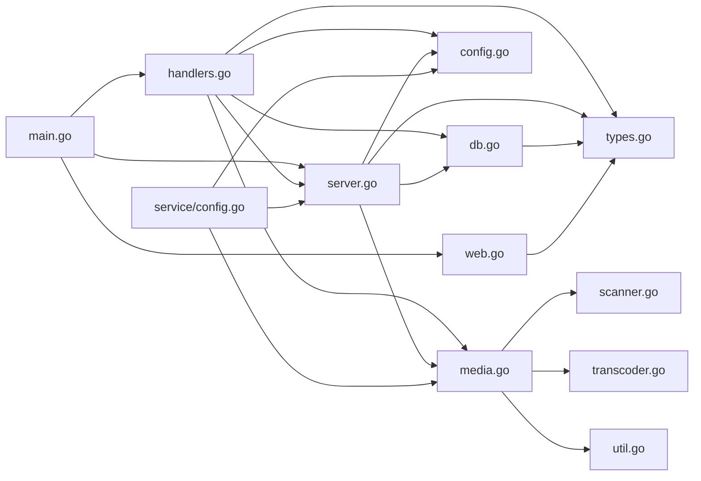

# 组件交互关系

<cite>
**本文引用的文件**
- [cmd/msp/main.go](file://cmd/msp/main.go)
- [internal/server/server.go](file://internal/server/server.go)
- [internal/handler/handlers.go](file://internal/handler/handlers.go)
- [internal/handler/middleware.go](file://internal/handler/middleware.go)
- [internal/media/media.go](file://internal/media/media.go)
- [internal/media/scanner.go](file://internal/media/scanner.go)
- [internal/media/transcoder.go](file://internal/media/transcoder.go)
- [internal/db/db.go](file://internal/db/db.go)
- [internal/web/web.go](file://internal/web/web.go)
- [internal/config/config.go](file://internal/config/config.go)
- [internal/types/types.go](file://internal/types/types.go)
- [internal/util/util.go](file://internal/util/util.go)
- [internal/service/config.go](file://internal/service/config.go)
</cite>

## 目录
1. [简介](#简介)
2. [项目结构](#项目结构)
3. [核心组件](#核心组件)
4. [架构总览](#架构总览)
5. [详细组件分析](#详细组件分析)
6. [依赖关系分析](#依赖关系分析)
7. [性能考量](#性能考量)
8. [故障排查指南](#故障排查指南)
9. [结论](#结论)

## 简介
本文件面向MSP项目的开发者与维护者，系统性梳理组件交互关系与协作流程，覆盖从配置加载、媒体扫描、请求处理到响应返回的完整链路。重点说明Server核心协调器、Handler处理器、Media引擎、Database层、Web资产等模块的职责边界、依赖关系与调用链路，并提供可视化图表帮助理解数据流与控制流。

## 项目结构
MSP采用分层清晰的Go模块组织：
- cmd/msp：应用入口，负责初始化Server、注册路由、启动HTTP服务与自动打开浏览器。
- internal/server：核心协调器，管理配置、日志、媒体缓存、会话与并发控制。
- internal/handler：HTTP处理器，实现REST API与静态资源服务，内置中间件链。
- internal/media：媒体引擎，负责扫描、索引、转码、字幕与容器探测。
- internal/db：数据库抽象，基于GORM/SQLite，提供偏好、进度、扫描元数据与媒体项持久化。
- internal/web：嵌入式Web资源服务，向浏览器提供前端静态资源。
- internal/config/types/util/service：配置模型、类型定义、工具方法与配置服务。

**图表来源**
- [cmd/msp/main.go](file://cmd/msp/main.go#L26-L83)
- [internal/server/server.go](file://internal/server/server.go#L31-L74)
- [internal/handler/handlers.go](file://internal/handler/handlers.go#L38-L43)
- [internal/media/media.go](file://internal/media/media.go#L12-L52)
- [internal/db/db.go](file://internal/db/db.go#L32-L72)
- [internal/web/web.go](file://internal/web/web.go#L14-L32)
- [internal/config/config.go](file://internal/config/config.go#L77-L88)
- [internal/types/types.go](file://internal/types/types.go#L54-L66)
- [internal/util/util.go](file://internal/util/util.go#L18-L34)
- [internal/service/config.go](file://internal/service/config.go#L12-L18)

**章节来源**
- [cmd/msp/main.go](file://cmd/msp/main.go#L26-L83)
- [internal/server/server.go](file://internal/server/server.go#L31-L74)

## 核心组件
- Server核心协调器：负责配置加载/热重载、日志、媒体缓存（内存+磁盘）、ETag弱校验、会话管理（PIN认证）、并发条件变量与缓存失效。
- Handler处理器：封装HTTP路由与中间件，提供配置、媒体、流媒体、字幕、探测、进度、日志、PIN等API；负责输入校验、权限控制与错误响应。
- Media引擎：扫描共享目录、构建媒体响应、字幕/歌词发现、容器与编解码探测、可选的FFmpeg转码。
- Database层：SQLite/GORM封装，提供偏好设置、播放进度、扫描元数据与媒体项的增删改查。
- Web资产：嵌入式静态资源服务，向浏览器提供前端页面与资源。
- 配置与类型：定义配置结构、API响应类型、工具函数与安全视图。
- 中间件：GZIP压缩、请求日志、安全头、IP白黑名单与PIN认证。

**章节来源**
- [internal/server/server.go](file://internal/server/server.go#L31-L74)
- [internal/handler/handlers.go](file://internal/handler/handlers.go#L28-L43)
- [internal/media/media.go](file://internal/media/media.go#L12-L52)
- [internal/db/db.go](file://internal/db/db.go#L18-L72)
- [internal/web/web.go](file://internal/web/web.go#L14-L32)
- [internal/config/config.go](file://internal/config/config.go#L77-L88)
- [internal/types/types.go](file://internal/types/types.go#L54-L66)
- [internal/handler/middleware.go](file://internal/handler/middleware.go#L25-L43)

## 架构总览
下图展示从客户端请求到媒体渲染的端到端交互，包括配置、缓存、扫描、转码与数据库的协作。

**图表来源**
- [cmd/msp/main.go](file://cmd/msp/main.go#L58-L83)
- [internal/handler/middleware.go](file://internal/handler/middleware.go#L77-L120)
- [internal/handler/handlers.go](file://internal/handler/handlers.go#L333-L446)
- [internal/server/server.go](file://internal/server/server.go#L332-L437)
- [internal/media/media.go](file://internal/media/media.go#L12-L52)
- [internal/media/transcoder.go](file://internal/media/transcoder.go#L138-L248)
- [internal/db/db.go](file://internal/db/db.go#L32-L72)

## 详细组件分析

### Server核心协调器
- 职责
  - 配置加载与热重载：读取/保存配置，监听变更并自动重载。
  - 日志管理：可配置日志级别、文件轮转、请求日志记录与新设备检测。
  - 媒体缓存：内存缓存+磁盘缓存，弱ETag，TTL失效与重建，支持并发等待与广播通知。
  - 会话管理：PIN认证会话令牌生成、校验与过期清理。
- 关键接口
  - 配置：LoadOrInitConfig、UpdateConfig、Config、WatchConfig
  - 日志：SetupLogger、Log、LogRequest、RotateLogIfNeeded
  - 媒体缓存：GetOrBuildMediaCache、InvalidateMediaCache、LoadMediaCacheFromDisk、saveMediaCacheToDisk
  - 会话：CreateSession、ValidateSession

**图表来源**
- [internal/server/server.go](file://internal/server/server.go#L31-L74)
- [internal/server/server.go](file://internal/server/server.go#L76-L112)
- [internal/server/server.go](file://internal/server/server.go#L190-L284)
- [internal/server/server.go](file://internal/server/server.go#L332-L437)
- [internal/server/server.go](file://internal/server/server.go#L570-L626)

**章节来源**
- [internal/server/server.go](file://internal/server/server.go#L31-L74)
- [internal/server/server.go](file://internal/server/server.go#L76-L112)
- [internal/server/server.go](file://internal/server/server.go#L190-L284)
- [internal/server/server.go](file://internal/server/server.go#L332-L437)
- [internal/server/server.go](file://internal/server/server.go#L570-L626)

### Handler处理器与中间件
- 职责
  - 注册路由与中间件链：GZIP压缩、请求日志、安全头、IP白黑名单、PIN认证。
  - API实现：配置、共享目录、媒体列表、流媒体、字幕、探测、进度、日志、PIN。
  - 输入校验、错误处理、ETag条件返回、内容类型推断、转码策略。
- 关键接口
  - 中间件：WithGzip、WithLog、WithSecurity
  - API：HandleConfig、HandleShares、HandleMedia、HandleStream、HandleSubtitle、HandleProbe、HandlePrefs、HandleProgress、HandleLog、HandlePIN

**图表来源**
- [internal/handler/middleware.go](file://internal/handler/middleware.go#L25-L43)
- [internal/handler/middleware.go](file://internal/handler/middleware.go#L77-L120)
- [internal/handler/handlers.go](file://internal/handler/handlers.go#L333-L362)
- [internal/server/server.go](file://internal/server/server.go#L332-L396)

**章节来源**
- [internal/handler/middleware.go](file://internal/handler/middleware.go#L25-L43)
- [internal/handler/middleware.go](file://internal/handler/middleware.go#L77-L120)
- [internal/handler/handlers.go](file://internal/handler/handlers.go#L45-L66)
- [internal/handler/handlers.go](file://internal/handler/handlers.go#L333-L362)

### Media引擎（扫描、索引、转码）
- 职责
  - 扫描：遍历共享目录，黑名单过滤，大小/扩展名/文件名规则，目录跳过。
  - 索引：构建媒体响应，按共享标签与名称排序，收集字幕/封面/歌词。
  - 转码：基于FFmpeg/ffprobe，限制并发，智能选择copy或转码策略，支持偏移与码率。
  - 探测：容器头探测视频/音频编解码，字幕/歌词发现。
- 关键接口
  - BuildMediaResponse、WalkShares、ClassifyExt、FindSidecarSubtitles、SrtToVtt、AssToVtt、SniffContainerCodecs、TranscodeStream、CheckFFmpeg/CheckFFprobe

**图表来源**
- [internal/media/media.go](file://internal/media/media.go#L12-L52)
- [internal/media/scanner.go](file://internal/media/scanner.go#L25-L57)
- [internal/media/scanner.go](file://internal/media/scanner.go#L74-L106)

**章节来源**
- [internal/media/media.go](file://internal/media/media.go#L12-L52)
- [internal/media/scanner.go](file://internal/media/scanner.go#L25-L57)
- [internal/media/scanner.go](file://internal/media/scanner.go#L148-L179)
- [internal/media/transcoder.go](file://internal/media/transcoder.go#L138-L248)

### Database层（GORM/SQLite）
- 职责
  - 初始化连接、WAL/同步/缓存参数调优、自动迁移。
  - 偏好设置：读取/写入用户偏好。
  - 播放进度：读取/写入媒体播放进度。
  - 扫描元数据：保存/读取扫描会话与媒体项。
- 关键接口
  - Init、GetAllPrefs/SetPrefs、GetProgress/SetProgress、GetScanMeta/SetScanMeta、UpsertMediaItem/UpsertMediaItems、DeleteStaleByScan/DeleteByShareRootsNotIn、QueryMediaItems/CountMediaItems、Close

**图表来源**
- [internal/db/db.go](file://internal/db/db.go#L32-L72)
- [internal/db/db.go](file://internal/db/db.go#L74-L99)
- [internal/db/db.go](file://internal/db/db.go#L117-L142)
- [internal/db/db.go](file://internal/db/db.go#L144-L172)
- [internal/db/db.go](file://internal/db/db.go#L174-L199)
- [internal/db/db.go](file://internal/db/db.go#L201-L224)
- [internal/db/db.go](file://internal/db/db.go#L226-L259)
- [internal/db/db.go](file://internal/db/db.go#L261-L270)

**章节来源**
- [internal/db/db.go](file://internal/db/db.go#L32-L72)
- [internal/db/db.go](file://internal/db/db.go#L74-L99)
- [internal/db/db.go](file://internal/db/db.go#L117-L142)
- [internal/db/db.go](file://internal/db/db.go#L144-L172)
- [internal/db/db.go](file://internal/db/db.go#L174-L199)
- [internal/db/db.go](file://internal/db/db.go#L201-L224)
- [internal/db/db.go](file://internal/db/db.go#L226-L259)
- [internal/db/db.go](file://internal/db/db.go#L261-L270)

### Web资产（嵌入式静态资源）
- 职责
  - 将web/dist作为嵌入FS提供静态资源，自动推断Content-Type与Cache-Control。
  - 对/api前缀返回404，确保API由Handler处理。
- 关键接口
  - ServeEmbeddedWeb、ServeEmbeddedFSFile

**章节来源**
- [internal/web/web.go](file://internal/web/web.go#L14-L32)
- [internal/web/web.go](file://internal/web/web.go#L34-L68)

### 配置与类型
- 配置结构：端口、共享目录、功能开关、UI、播放、黑名单、安全、日志、最大项数。
- 类型定义：媒体项、扫描元数据、用户偏好、播放进度、API响应类型。
- 工具函数：ID编解码、路径规范化、大小解析、去重、IP判断、随机数生成等。
- 配置服务：安全视图（隐藏PIN），生成前端所需配置视图。

**章节来源**
- [internal/config/config.go](file://internal/config/config.go#L77-L88)
- [internal/types/types.go](file://internal/types/types.go#L16-L66)
- [internal/util/util.go](file://internal/util/util.go#L18-L34)
- [internal/util/util.go](file://internal/util/util.go#L101-L140)
- [internal/util/util.go](file://internal/util/util.go#L148-L182)
- [internal/util/util.go](file://internal/util/util.go#L218-L273)
- [internal/service/config.go](file://internal/service/config.go#L20-L71)
- [internal/service/config.go](file://internal/service/config.go#L73-L90)
- [internal/service/config.go](file://internal/service/config.go#L92-L122)

## 依赖关系分析
- 组件耦合
  - main依赖Server、Handler、Web与DB初始化顺序明确，先配置再DB，再路由注册。
  - Handler依赖Server、Config、Types、DB、Media；Server依赖Config、Types、DB、Media。
  - Media依赖Util、Config、Types；DB依赖Types；Web依赖Types。
- 外部依赖
  - FFmpeg/ffprobe：转码与探测；若缺失则降级直播。
  - SQLite/GORM：轻量持久化，WAL模式提升并发。
- 循环依赖
  - 无直接循环依赖；通过接口与方法调用形成清晰的单向依赖。

**图表来源**
- [cmd/msp/main.go](file://cmd/msp/main.go#L18-L24)
- [internal/handler/handlers.go](file://internal/handler/handlers.go#L18-L26)
- [internal/server/server.go](file://internal/server/server.go#L23-L29)
- [internal/media/media.go](file://internal/media/media.go#L3-L10)
- [internal/db/db.go](file://internal/db/db.go#L3-L16)
- [internal/web/web.go](file://internal/web/web.go#L3-L12)
- [internal/service/config.go](file://internal/service/config.go#L3-L10)

**章节来源**
- [cmd/msp/main.go](file://cmd/msp/main.go#L18-L24)
- [internal/handler/handlers.go](file://internal/handler/handlers.go#L18-L26)
- [internal/server/server.go](file://internal/server/server.go#L23-L29)
- [internal/media/media.go](file://internal/media/media.go#L3-L10)
- [internal/db/db.go](file://internal/db/db.go#L3-L16)
- [internal/web/web.go](file://internal/web/web.go#L3-L12)
- [internal/service/config.go](file://internal/service/config.go#L3-L10)

## 性能考量
- 媒体缓存
  - 内存缓存+弱ETag，TTL过期时后台重建，避免阻塞请求；并发等待通过条件变量广播。
  - 磁盘缓存用于无DB场景，减少重复扫描开销。
- 数据库
  - 单连接WAL模式、NORMAL同步、缓存预编译语句，降低锁竞争与IO开销。
- 转码
  - 并发限流（2路），智能copy/转码策略，faststart优化MP4，保留时间戳便于进度。
- 压缩与日志
  - API响应GZIP压缩（排除流媒体/字幕），日志按阈值轮转，避免频繁Stat。
- 路由与中间件
  - 仅对JSON API启用GZIP，静态资源独立处理，减少不必要的压缩成本。

[本节为通用性能建议，无需特定文件引用]

## 故障排查指南
- 配置问题
  - 配置文件不存在或损坏：首次运行自动生成默认配置；热重载失败时检查文件权限与格式。
  - 黑名单规则：大小规则、正则表达式需符合解析规范。
- 媒体扫描
  - 目录不可访问：确认路径存在且可读；Windows大小写不敏感路径比较。
  - 扫描超时：适当调整MaxItems或禁用DB以使用磁盘缓存。
- 流媒体与转码
  - FFmpeg/ffprobe缺失：转码请求将降级为直播；安装后自动启用。
  - 转码失败：检查输入路径、偏移与码率参数；查看stderr日志。
- 认证与安全
  - PIN认证失败：确认会话Cookie有效；检查会话过期清理。
  - IP白黑名单：CIDR匹配与精确IP匹配，注意Home/LAN模式不信任代理头。
- 数据库
  - 连接异常：检查DB路径权限与WAL设置；必要时关闭其他进程占用。

**章节来源**
- [internal/server/server.go](file://internal/server/server.go#L76-L112)
- [internal/server/server.go](file://internal/server/server.go#L140-L188)
- [internal/media/scanner.go](file://internal/media/scanner.go#L108-L146)
- [internal/media/transcoder.go](file://internal/media/transcoder.go#L91-L104)
- [internal/handler/middleware.go](file://internal/handler/middleware.go#L134-L144)
- [internal/handler/middleware.go](file://internal/handler/middleware.go#L189-L201)
- [internal/db/db.go](file://internal/db/db.go#L32-L72)

## 结论
MSP通过清晰的分层设计与强约束的职责划分，实现了从配置、缓存、扫描到转码与持久化的完整闭环。Server作为核心协调器统一调度，Handler提供稳定的API与安全中间件，Media引擎承担复杂的文件系统与外部工具集成，Database提供轻量可靠的数据持久化，Web模块负责静态资源交付。整体架构具备良好的可维护性与扩展性，适合在家庭/局域网环境中稳定运行。