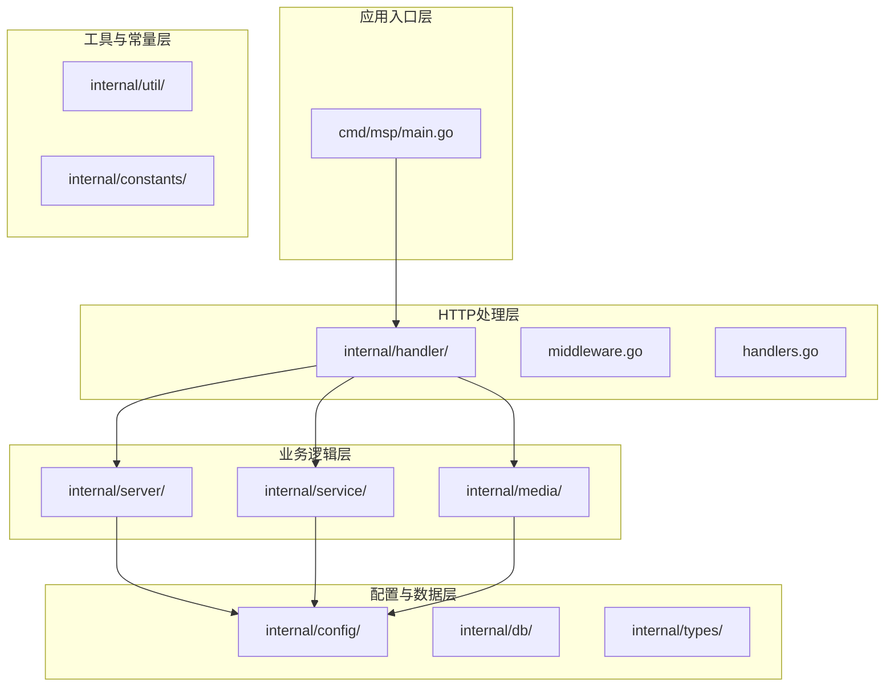
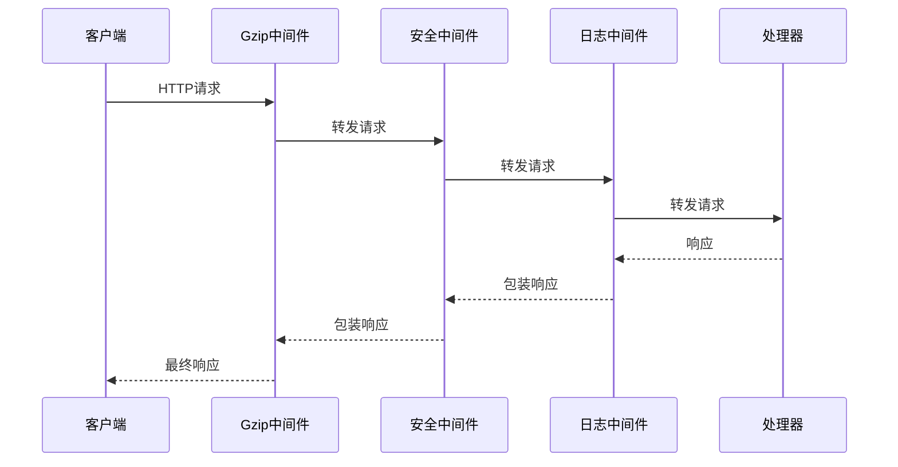
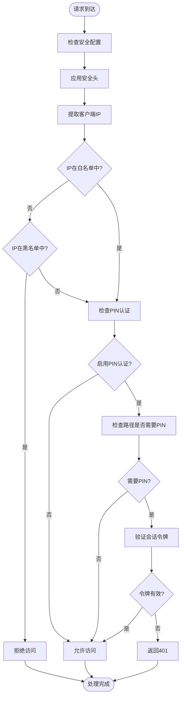
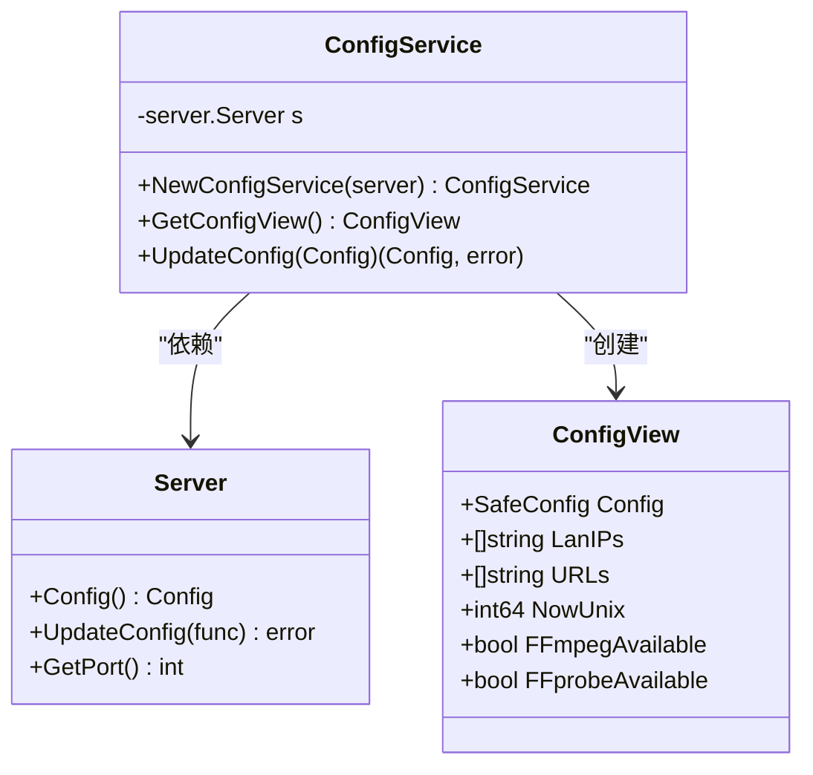
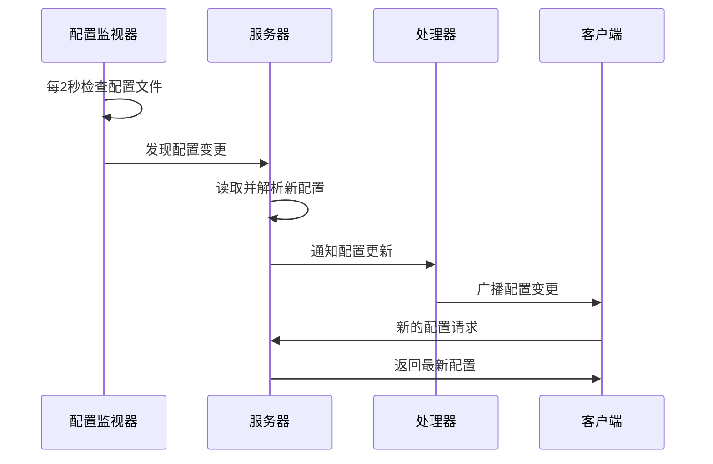
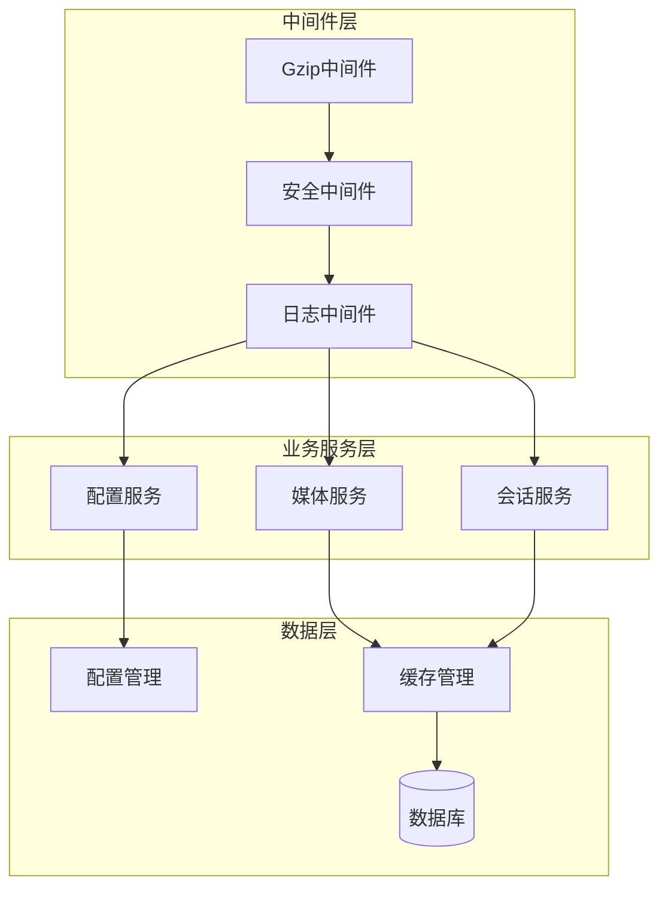

# 设计模式应用

<cite>
**本文档引用的文件**
- [main.go](file://cmd/msp/main.go)
- [middleware.go](file://internal/handler/middleware.go)
- [handlers.go](file://internal/handler/handlers.go)
- [server.go](file://internal/server/server.go)
- [transcoder.go](file://internal/media/transcoder.go)
- [config.go](file://internal/service/config.go)
- [config.go](file://internal/config/config.go)
- [constants.go](file://internal/constants/constants.go)
</cite>

## 目录
1. [引言](#引言)
2. [项目结构概述](#项目结构概述)
3. [核心设计模式分析](#核心设计模式分析)
4. [中间件模式详解](#中间件模式详解)
5. [工厂模式应用](#工厂模式应用)
6. [观察者模式实现](#观察者模式实现)
7. [模式协同作用](#模式协同作用)
8. [性能考虑](#性能考虑)
9. [故障排除指南](#故障排除指南)
10. [结论](#结论)

## 引言

MSP（Media Streaming Platform）是一个基于Go语言开发的媒体流媒体平台，该项目在架构设计中巧妙地运用了多种经典设计模式来解决实际的工程问题。本文档深入分析了项目中应用的关键设计模式，包括中间件模式在HTTP请求处理中的应用、工厂模式在对象创建中的使用、以及观察者模式在事件通知中的实现。

通过这些设计模式的应用，MSP项目实现了高度模块化的架构、灵活的扩展性、强大的安全性保障和优秀的性能表现。每个设计模式都针对特定的架构问题提供了优雅的解决方案，并且相互协作形成了完整的架构体系。

## 项目结构概述

MSP项目采用分层架构设计，主要分为以下几个层次：

**图表来源**
- [main.go](file://cmd/msp/main.go#L26-L83)
- [middleware.go](file://internal/handler/middleware.go#L25-L43)
- [handlers.go](file://internal/handler/handlers.go#L38-L43)

**章节来源**
- [main.go](file://cmd/msp/main.go#L1-L151)
- [server.go](file://internal/server/server.go#L31-L74)

## 核心设计模式分析

### 中间件模式

中间件模式是MSP项目中最突出的设计模式之一，它在HTTP请求处理链中发挥着至关重要的作用。项目通过装饰器模式实现了可组合的中间件链，为每个HTTP请求提供统一的处理能力。

### 工厂模式

项目在多个层面应用了工厂模式，特别是在对象创建和配置管理方面。通过工厂模式，系统能够根据不同的条件创建合适的服务实例，提高了代码的灵活性和可维护性。

### 观察者模式

虽然MSP项目中的观察者模式不如中间件模式那样显眼，但在配置热重载、媒体缓存管理和会话管理等方面都有体现。系统通过观察者模式实现了松耦合的事件通知机制。

## 中间件模式详解

### 模式定义与适用场景

中间件模式允许在请求处理过程中插入多个处理步骤，每个中间件负责特定的功能，如日志记录、安全验证、压缩处理等。在MSP项目中，中间件模式主要用于：

- HTTP请求的安全过滤
- 请求日志记录和监控
- 响应内容的压缩优化
- 统一的错误处理

### 实现细节分析

#### 中间件链构建

项目通过装饰器模式构建了灵活的中间件链，最终形成如下处理流程：

**图表来源**
- [main.go](file://cmd/msp/main.go#L65-L66)
- [middleware.go](file://internal/handler/middleware.go#L25-L43)

#### 安全中间件实现

安全中间件实现了多层次的安全防护：

1. **IP白名单/黑名单过滤**：支持精确IP匹配和CIDR范围匹配
2. **PIN认证机制**：提供基于会话令牌的身份验证
3. **安全头设置**：防止常见的Web攻击

**图表来源**
- [middleware.go](file://internal/handler/middleware.go#L77-L120)
- [middleware.go](file://internal/handler/middleware.go#L147-L163)

#### 日志中间件实现

日志中间件提供了统一的请求日志记录功能：

- **请求统计**：记录请求方法、路径、状态码、用户代理和处理时间
- **异常检测**：自动标记5xx错误级别
- **新设备检测**：跟踪首次访问的IP地址

#### 压缩中间件实现

压缩中间件实现了智能的内容压缩：

- **条件压缩**：仅对API响应进行压缩，静态资源除外
- **Gzip支持**：根据客户端的Accept-Encoding头部决定是否压缩
- **性能优化**：避免对大文件和实时流进行压缩

**章节来源**
- [middleware.go](file://internal/handler/middleware.go#L25-L120)
- [main.go](file://cmd/msp/main.go#L65-L66)

## 工厂模式应用

### 配置服务工厂

项目在配置服务中应用了工厂模式，通过`NewConfigService`函数创建配置服务实例：

**图表来源**
- [config.go](file://internal/service/config.go#L16-L18)
- [config.go](file://internal/service/config.go#L73-L90)

### 对象创建优化

工厂模式在以下场景中发挥了重要作用：

1. **配置视图创建**：通过工厂方法创建安全的配置视图，隐藏敏感信息
2. **服务实例化**：统一的构造函数确保依赖注入的一致性
3. **配置验证**：在创建过程中执行必要的验证和规范化操作

**章节来源**
- [config.go](file://internal/service/config.go#L16-L90)
- [config.go](file://internal/config/config.go#L95-L146)

## 观察者模式实现

### 配置热重载

MSP项目实现了基于观察者模式的配置热重载机制：

**图表来源**
- [server.go](file://internal/server/server.go#L141-L187)

### 媒体缓存管理

观察者模式还体现在媒体缓存的管理中：

- **缓存失效通知**：当配置变更时通知所有相关的缓存组件
- **重建触发机制**：通过观察者模式协调缓存的重建过程
- **状态同步**：确保各个组件的缓存状态保持一致

**章节来源**
- [server.go](file://internal/server/server.go#L141-L187)
- [server.go](file://internal/server/server.go#L322-L330)

## 模式协同作用

### 整体架构协同

MSP项目中的各种设计模式形成了紧密的协同关系：

### 松耦合设计

通过设计模式的综合应用，MSP实现了高度的模块化和松耦合：

- **中间件解耦**：各中间件独立工作，可以单独启用或禁用
- **服务隔离**：业务服务之间通过接口通信，减少直接依赖
- **配置独立**：配置管理与其他组件解耦，支持热重载

### 扩展性保障

设计模式为系统的扩展提供了良好的基础：

- **中间件扩展**：可以轻松添加新的中间件处理逻辑
- **服务扩展**：通过工厂模式可以方便地添加新的服务类型
- **监控扩展**：观察者模式支持添加新的监控和通知机制

## 性能考虑

### 中间件性能优化

1. **短路评估**：安全中间件在早期阶段拒绝明显违规的请求
2. **条件压缩**：避免对大文件和实时流进行不必要的压缩
3. **异步处理**：配置监视器使用goroutine实现非阻塞的文件监控

### 缓存策略

项目采用了多层缓存策略：

- **内存缓存**：媒体信息的内存缓存，支持TTL过期
- **磁盘缓存**：SQLite数据库的持久化缓存
- **ETag机制**：基于内容的缓存验证机制

### 资源限制

通过工厂模式和观察者模式实现了资源的有效管理：

- **并发控制**：转码操作的并发限制，防止CPU过度占用
- **内存管理**：定期垃圾回收触发，保持内存使用在合理范围内

## 故障排除指南

### 中间件相关问题

**问题**：中间件链顺序错误导致功能异常
- **诊断**：检查中间件的注册顺序
- **解决方案**：按照安全→日志→压缩的顺序注册中间件

**问题**：安全中间件误判合法IP
- **诊断**：检查IP白名单/黑名单配置
- **解决方案**：使用CIDR格式支持网络段匹配

### 工厂模式相关问题

**问题**：配置服务创建失败
- **诊断**：检查Server实例的可用性和配置
- **解决方案**：确保Server实例正确初始化后再创建配置服务

### 观察者模式相关问题

**问题**：配置热重载不生效
- **诊断**：检查配置文件监视器的状态
- **解决方案**：重启应用或检查文件权限

**章节来源**
- [middleware.go](file://internal/handler/middleware.go#L147-L201)
- [server.go](file://internal/server/server.go#L141-L187)

## 结论

MSP项目通过精心设计和应用多种经典设计模式，成功构建了一个高性能、高可用、易扩展的媒体流媒体平台。中间件模式、工厂模式和观察者模式的有机结合，不仅解决了实际的工程问题，还为未来的功能扩展奠定了坚实的基础。

### 主要成就

1. **架构清晰**：通过中间件模式实现了清晰的请求处理链
2. **扩展性强**：工厂模式和观察者模式提供了良好的扩展基础
3. **性能优秀**：多层缓存和资源限制机制确保了系统的高性能
4. **安全可靠**：多层次的安全防护机制保障了系统的安全性

### 最佳实践建议

1. **中间件设计**：遵循单一职责原则，每个中间件只负责特定功能
2. **工厂模式应用**：在复杂对象创建场景中优先考虑工厂模式
3. **观察者模式选择**：在需要松耦合事件通知时使用观察者模式
4. **性能监控**：建立完善的性能监控和告警机制

通过这些设计模式的成功应用，MSP项目展示了现代Go语言应用开发的最佳实践，为类似项目的架构设计提供了宝贵的参考价值。