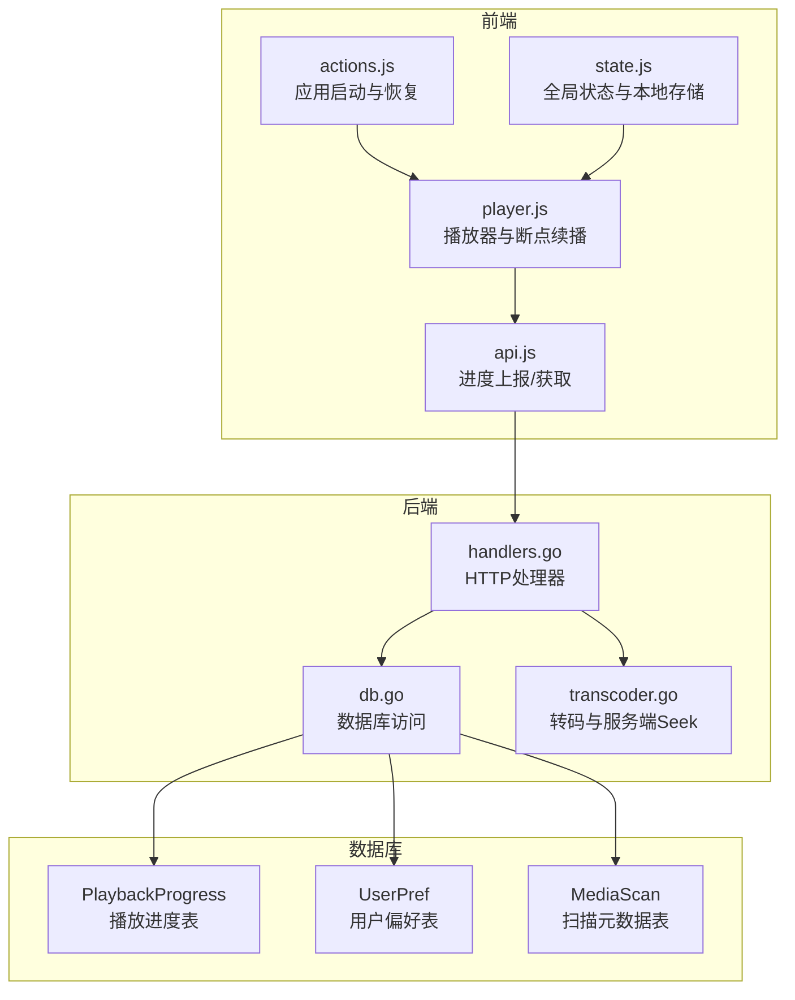
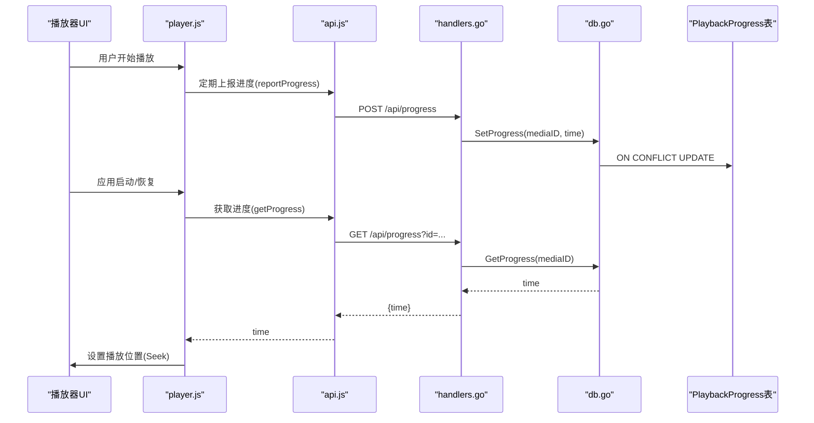
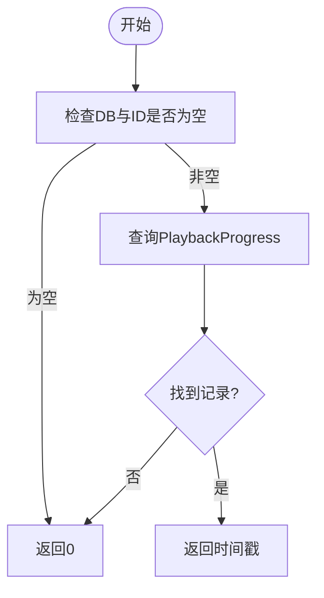
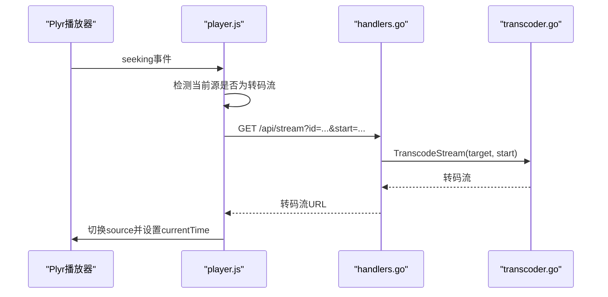
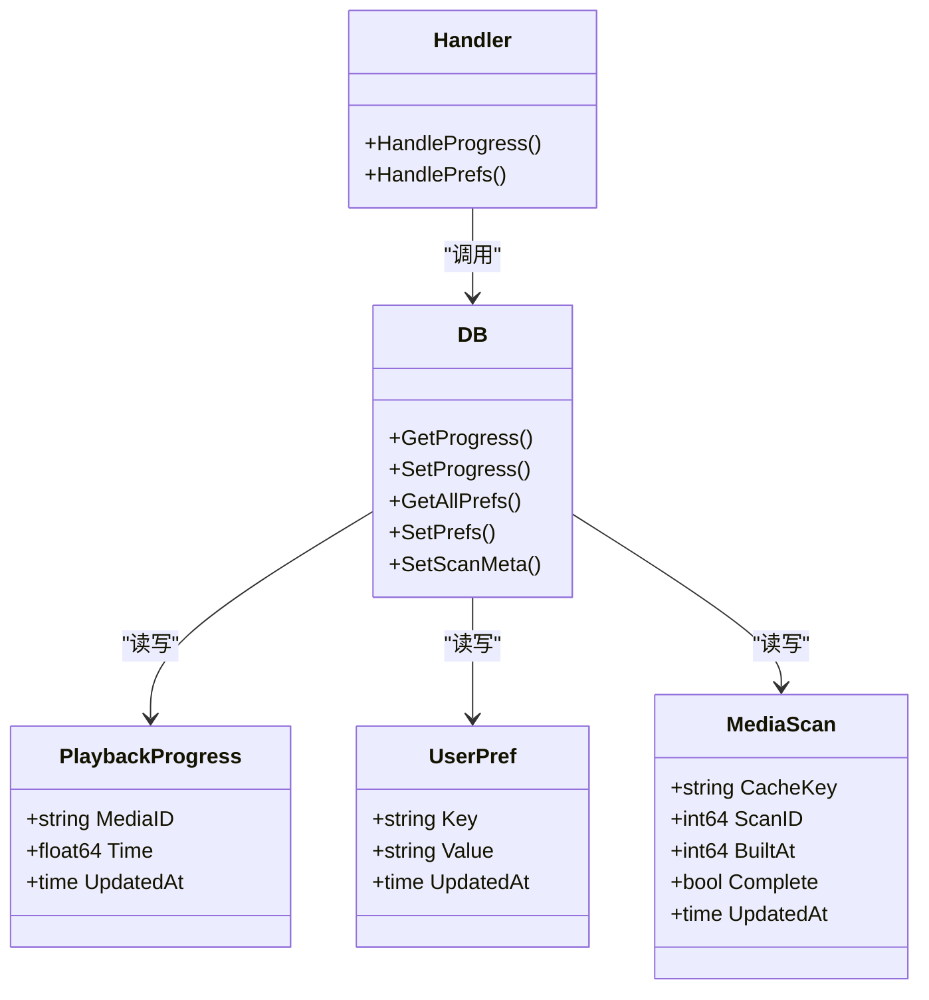

# 断点续播功能

<cite>
**本文引用的文件**
- [internal/db/db.go](file://internal/db/db.go)
- [internal/types/types.go](file://internal/types/types.go)
- [internal/handler/handlers.go](file://internal/handler/handlers.go)
- [web/src/modules/player.js](file://web/src/modules/player.js)
- [web/src/modules/api.js](file://web/src/modules/api.js)
- [web/src/modules/state.js](file://web/src/modules/state.js)
- [web/src/modules/actions.js](file://web/src/modules/actions.js)
- [internal/config/config.go](file://internal/config/config.go)
- [internal/media/transcoder.go](file://internal/media/transcoder.go)
- [docs/release/v0.8.0.md](file://docs/release/v0.8.0.md)
- [PERFORMANCE_ANALYSIS.md](file://PERFORMANCE_ANALYSIS.md)
</cite>

## 目录
1. [简介](#简介)
2. [项目结构](#项目结构)
3. [核心组件](#核心组件)
4. [架构总览](#架构总览)
5. [详细组件分析](#详细组件分析)
6. [依赖关系分析](#依赖关系分析)
7. [性能考量](#性能考量)
8. [故障排查指南](#故障排查指南)
9. [结论](#结论)
10. [附录](#附录)

## 简介
本文件面向MSP项目的断点续播功能，系统性阐述播放进度跟踪的实现机制、跨设备同步方案、播放位置精确计算方法、用户偏好与历史记录管理、以及进度数据的持久化与备份恢复策略。文档同时给出可视化流程图与序列图，帮助开发者与运维人员快速理解与落地。

## 项目结构
断点续播功能横跨前端与后端，主要涉及以下模块：
- 前端播放器模块：负责进度上报、断点恢复、播放位置设置与UI交互
- API层：提供进度查询与上报接口
- 数据库层：存储播放进度、用户偏好与扫描元数据
- 媒体转码层：支持智能转码与服务端Seek，保障跨设备续播体验

图表来源
- [web/src/modules/player.js](file://web/src/modules/player.js#L15-L50)
- [web/src/modules/api.js](file://web/src/modules/api.js#L95-L108)
- [internal/handler/handlers.go](file://internal/handler/handlers.go#L192-L233)
- [internal/db/db.go](file://internal/db/db.go#L74-L99)
- [internal/media/transcoder.go](file://internal/media/transcoder.go)

章节来源
- [web/src/modules/player.js](file://web/src/modules/player.js#L1-L155)
- [web/src/modules/api.js](file://web/src/modules/api.js#L95-L154)
- [internal/handler/handlers.go](file://internal/handler/handlers.go#L192-L233)
- [internal/db/db.go](file://internal/db/db.go#L32-L72)

## 核心组件
- 播放进度模型：PlaybackProgress，包含媒体ID与时间戳字段，自动维护更新时间
- 进度上报与查询：前端通过API上报当前时间，后端提供按ID查询进度
- 断点恢复：应用启动或播放器初始化时，优先从服务器拉取进度，回退到本地存储
- 用户偏好与历史：通过UserPref表与本地localStorage协同，支持批量异步持久化
- 转码与服务端Seek：支持在非原生格式下进行精准跳转，保证续播一致性

章节来源
- [internal/types/types.go](file://internal/types/types.go#L48-L52)
- [internal/db/db.go](file://internal/db/db.go#L74-L99)
- [web/src/modules/player.js](file://web/src/modules/player.js#L130-L155)
- [web/src/modules/api.js](file://web/src/modules/api.js#L95-L108)

## 架构总览
断点续播的端到端流程如下：

图表来源
- [web/src/modules/player.js](file://web/src/modules/player.js#L15-L50)
- [web/src/modules/api.js](file://web/src/modules/api.js#L95-L108)
- [internal/handler/handlers.go](file://internal/handler/handlers.go#L192-L233)
- [internal/db/db.go](file://internal/db/db.go#L74-L99)

## 详细组件分析

### 播放进度跟踪与存储
- 存储格式：PlaybackProgress表，主键为媒体ID，字段包含时间戳与自动更新时间
- 写入策略：使用ON CONFLICT UPDATE，避免重复INSERT，减少日志噪音
- 查询策略：静默查询，不存在则返回0，避免“记录不存在”日志干扰

图表来源
- [internal/db/db.go](file://internal/db/db.go#L74-L86)

章节来源
- [internal/types/types.go](file://internal/types/types.go#L48-L52)
- [internal/db/db.go](file://internal/db/db.go#L74-L99)

### 进度上报与更新频率控制
- 前端上报：reportProgress在播放器事件中触发，异步上报，失败不阻塞
- 批量偏好：gpSet采用300ms窗口批量提交，降低API压力
- 心跳检测：播放器内置心跳监控，检测播放停滞并触发结束逻辑，间接保护续播一致性

章节来源
- [web/src/modules/api.js](file://web/src/modules/api.js#L95-L108)
- [web/src/modules/api.js](file://web/src/modules/api.js#L129-L144)
- [web/src/modules/player.js](file://web/src/modules/player.js#L531-L555)

### 跨设备同步与冲突解决
- 同步范围：当前实现以媒体ID为维度的单值进度；未引入版本号或时间戳字段
- 冲突策略：ON CONFLICT UPDATE以最新上报为准；无显式合并策略
- 建议：若未来扩展多设备场景，可在PlaybackProgress增加版本号/时间戳字段，后端实现“最后写入获胜”或“向量时钟”策略

章节来源
- [internal/db/db.go](file://internal/db/db.go#L89-L99)
- [internal/types/types.go](file://internal/types/types.go#L48-L52)

### 播放位置精确计算
- 时间戳同步：后端转码流使用FFmpeg -copyts对齐时间戳，前端设置currentTime保持UI一致性
- 智能Seek：当检测到转码流且发生拖拽时，重新构造带start参数的转码流，避免标准seek失效
- 缓冲区处理：播放器在readyState>=3且长时间无进度时强制结束，避免卡死
- 网络延迟补偿：当前未实现专门的RTT/抖动补偿算法；可通过服务端Seek(start)与客户端预加载策略缓解

图表来源
- [web/src/modules/player.js](file://web/src/modules/player.js#L570-L624)
- [internal/handler/handlers.go](file://internal/handler/handlers.go#L534-L564)
- [internal/media/transcoder.go](file://internal/media/transcoder.go)

章节来源
- [web/src/modules/player.js](file://web/src/modules/player.js#L557-L624)
- [internal/handler/handlers.go](file://internal/handler/handlers.go#L534-L564)

### 用户偏好与历史记录
- 偏好存储：UserPref表与本地localStorage双通道，优先使用服务端偏好
- 历史记录：音频/视频最近ID与时间、播放列表、音量、字幕等均持久化
- 清理策略：未见专门的清理策略；建议结合扫描元数据与时间戳定期清理过期历史

章节来源
- [internal/types/types.go](file://internal/types/types.go#L42-L46)
- [web/src/modules/state.js](file://web/src/modules/state.js#L42-L58)
- [web/src/modules/api.js](file://web/src/modules/api.js#L110-L154)

### 持久化与备份恢复
- 数据库：SQLite WAL模式，单连接池，PRAGMA优化
- 备份：未见自动化备份脚本；建议定期复制msp.db及其WAL/SHM文件
- 损坏修复：未见专门修复工具；可利用SQLite的在线备份与VACUUM能力

章节来源
- [internal/db/db.go](file://internal/db/db.go#L32-L72)
- [PERFORMANCE_ANALYSIS.md](file://PERFORMANCE_ANALYSIS.md#L9-L28)

## 依赖关系分析

图表来源
- [internal/types/types.go](file://internal/types/types.go#L42-L52)
- [internal/handler/handlers.go](file://internal/handler/handlers.go#L192-L233)
- [internal/db/db.go](file://internal/db/db.go#L74-L142)

章节来源
- [internal/types/types.go](file://internal/types/types.go#L1-L112)
- [internal/handler/handlers.go](file://internal/handler/handlers.go#L161-L190)
- [internal/db/db.go](file://internal/db/db.go#L101-L142)

## 性能考量
- 数据库写入：禁用默认事务、单连接池、WAL模式、PRAGMA优化，显著降低写入开销
- 查询静默化：避免“记录不存在”日志刷屏
- 前端批处理：偏好设置批量提交，降低网络请求频率
- 转码并发：转码流并发限制与释放器，防止资源争用

章节来源
- [internal/db/db.go](file://internal/db/db.go#L32-L72)
- [web/src/modules/api.js](file://web/src/modules/api.js#L129-L144)
- [internal/media/transcoder_test.go](file://internal/media/transcoder_test.go#L242-L265)

## 故障排查指南
- 进度上报失败：确认/report接口可达，检查网络与CORS；查看前端日志与后端错误码
- 无法续播：确认GET /api/progress返回正确时间；检查媒体ID是否匹配
- 转码Seek无效：确认transcode参数与start参数传递；检查后端转码策略与FFmpeg可用性
- 播放卡住：播放器心跳检测会在15秒无进度时强制结束；检查网络与缓冲状态
- 数据库异常：检查WAL/SHM文件完整性；必要时进行SQLite备份与恢复

章节来源
- [internal/handler/handlers.go](file://internal/handler/handlers.go#L192-L233)
- [web/src/modules/player.js](file://web/src/modules/player.js#L531-L555)
- [docs/release/v0.8.0.md](file://docs/release/v0.8.0.md#L10-L13)

## 结论
MSP的断点续播功能以简洁高效的数据库模型与前后端协作实现，具备良好的性能与可维护性。当前实现以媒体ID为中心的单值进度与ON CONFLICT UPDATE策略满足多数场景需求。为进一步增强跨设备一致性与用户体验，建议引入版本号/时间戳字段与更完善的冲突解决策略，并考虑在网络延迟补偿与转码Seek稳定性方面做针对性优化。

## 附录
- 版本演进：v0.8.0引入专用进度表与智能转码Seek，v0.8.1强化媒体入库健壮性
- 配置参考：Playback.Video.Resume控制视频续播开关

章节来源
- [docs/release/v0.8.0.md](file://docs/release/v0.8.0.md#L10-L13)
- [internal/config/config.go](file://internal/config/config.go#L119-L124)