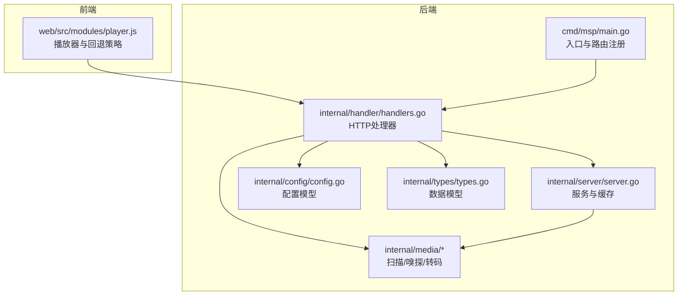
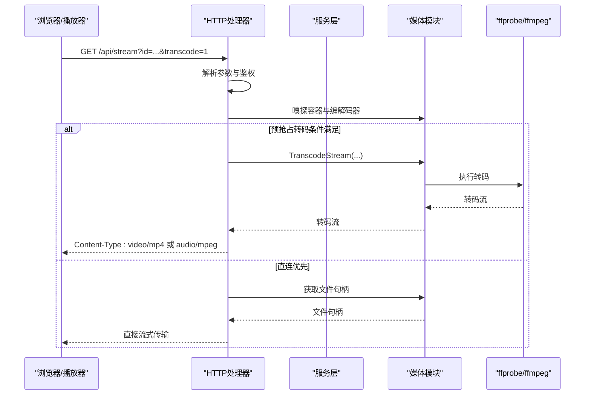
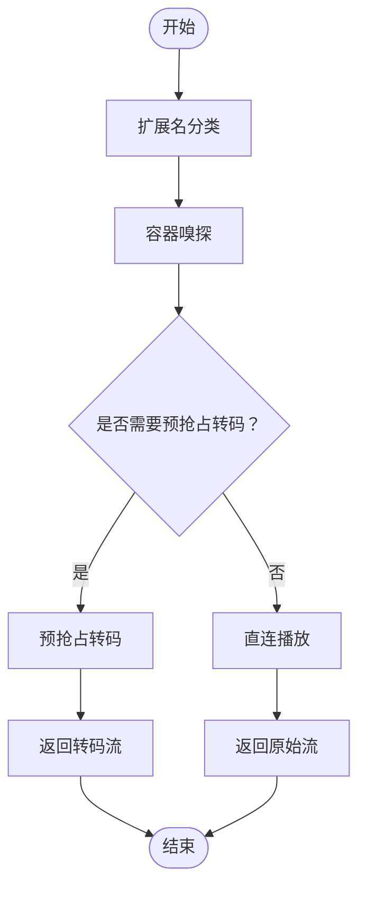
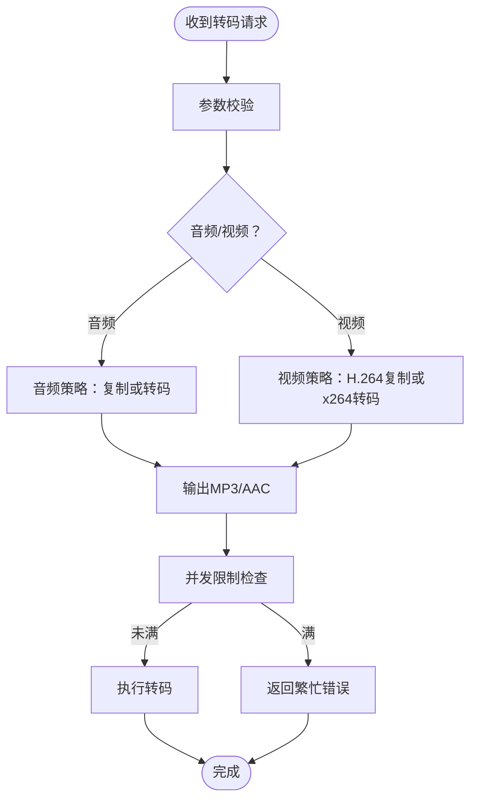
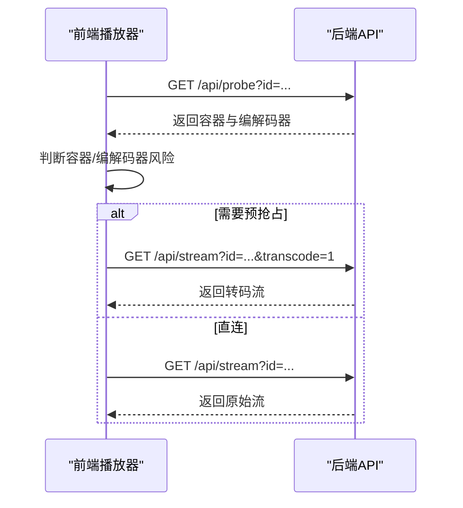
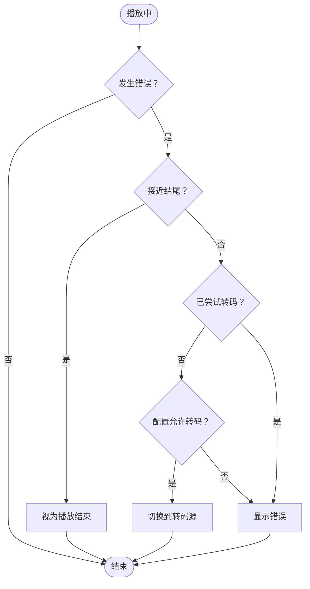
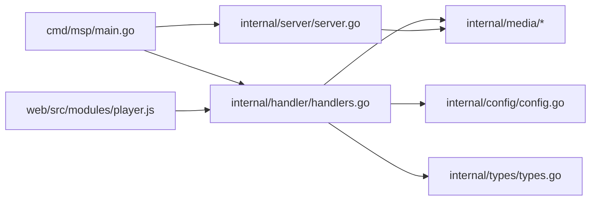

# 智能播放机制

<cite>
**本文档引用的文件**
- [cmd\msp\main.go](file://cmd\msp\main.go)
- [internal\handler\handlers.go](file://internal\handler\handlers.go)
- [internal\media\transcoder.go](file://internal\media\transcoder.go)
- [internal\media\scanner.go](file://internal\media\scanner.go)
- [internal\media\media.go](file://internal\media\media.go)
- [internal\config\config.go](file://internal\config\config.go)
- [internal\types\types.go](file://internal\types\types.go)
- [internal\server\server.go](file://internal\server\server.go)
- [docs\API_REFERENCE.md](file://docs\API_REFERENCE.md)
- [config.example.json](file://config.example.json)
- [internal\media\transcoder_test.go](file://internal\media\transcoder_test.go)
- [internal\media\scanner_test.go](file://internal\media\scanner_test.go)
- [internal\constants\constants.go](file://internal\constants\constants.go)
- [web\src\modules\player.js](file://web\src\modules\player.js)
</cite>

## 目录
1. [简介](#简介)
2. [项目结构](#项目结构)
3. [核心组件](#核心组件)
4. [架构总览](#架构总览)
5. [详细组件分析](#详细组件分析)
6. [依赖关系分析](#依赖关系分析)
7. [性能考量](#性能考量)
8. [故障排查指南](#故障排查指南)
9. [结论](#结论)
10. [附录](#附录)

## 简介
本文件面向MSP项目的智能播放机制，系统化阐述以下能力与实现：
- 直接播放优先策略：媒体格式检测、容器与编解码器嗅探、播放器兼容性判断
- 按需转码决策算法：转码触发条件、风险评估与性能权衡
- 预抢占转码应用：针对高风险容器与编解码器的策略
- 播放行为配置与调试：日志、性能监控与回退重试机制

## 项目结构
MSP采用Go后端与前端模块分离的架构，核心播放链路由HTTP处理器、媒体扫描与转码模块、前端播放器共同组成。

**图表来源**
- [cmd\msp\main.go](file://cmd\msp\main.go#L85-L107)
- [internal\handler\handlers.go](file://internal\handler\handlers.go#L1-L721)
- [internal\media\scanner.go](file://internal\media\scanner.go#L1-L870)
- [internal\media\transcoder.go](file://internal\media\transcoder.go#L1-L249)
- [internal\server\server.go](file://internal\server\server.go#L1-L627)
- [internal\config\config.go](file://internal\config\config.go#L1-L286)
- [internal\types\types.go](file://internal\types\types.go#L1-L112)

**章节来源**
- [cmd\msp\main.go](file://cmd\msp\main.go#L1-L151)
- [internal\handler\handlers.go](file://internal\handler\handlers.go#L1-L721)
- [internal\server\server.go](file://internal\server\server.go#L1-L627)

## 核心组件
- HTTP处理器：负责解析请求、鉴权、媒体探测、直连/转码分流与字幕转换
- 媒体扫描与嗅探：遍历共享目录、识别扩展名、嗅探容器与编解码器、提取字幕
- 转码引擎：基于ffprobe/ffmpeg执行按需转码，限制并发与参数校验
- 服务层：配置热加载、媒体缓存、日志与会话管理
- 前端播放器：根据探测结果与播放器兼容性选择直连或预抢占转码，并在失败时自动回退

**章节来源**
- [internal\handler\handlers.go](file://internal\handler\handlers.go#L413-L564)
- [internal\media\scanner.go](file://internal\media\scanner.go#L233-L246)
- [internal\media\transcoder.go](file://internal\media\transcoder.go#L138-L248)
- [internal\server\server.go](file://internal\server\server.go#L332-L437)
- [web\src\modules\player.js](file://web\src\modules\player.js#L270-L459)

## 架构总览
智能播放的关键流程如下：

**图表来源**
- [internal\handler\handlers.go](file://internal\handler\handlers.go#L413-L564)
- [internal\media\transcoder.go](file://internal\media\transcoder.go#L138-L248)
- [internal\media\scanner.go](file://internal\media\scanner.go#L578-L687)

## 详细组件分析

### 直接播放优先策略
- 媒体格式检测与容器嗅探
  - 扩展名分类：根据扩展名将媒体归类为video/audio/image/other，用于后续嗅探与字幕关联
  - 容器与编解码器嗅探：读取文件头部与尾部（针对MOV/MP4原子），匹配特征字符串以识别视频/音频编解码器
- 播放器兼容性判断
  - 前端基于探测结果与容器类型决定是否预抢占转码（例如AVI/WMV）
  - 前端对常见容器设置正确的Content-Type，提升浏览器兼容性
- 直连策略
  - 对大文件启用缓存控制，小文件禁用缓存，减少带宽浪费
  - 支持Range请求，适配拖动与断点续播

**图表来源**
- [internal\media\scanner.go](file://internal\media\scanner.go#L233-L246)
- [internal\media\scanner.go](file://internal\media\scanner.go#L578-L687)
- [web\src\modules\player.js](file://web\src\modules\player.js#L270-L281)
- [internal\handler\handlers.go](file://internal\handler\handlers.go#L566-L579)

**章节来源**
- [internal\media\scanner.go](file://internal\media\scanner.go#L233-L246)
- [internal\media\scanner.go](file://internal\media\scanner.go#L578-L687)
- [web\src\modules\player.js](file://web\src\modules\player.js#L270-L459)
- [internal\handler\handlers.go](file://internal\handler\handlers.go#L566-L579)

### 按需转码决策算法
- 触发条件
  - 前端显式请求transcode=1
  - 配置允许对应类型的转码（音频或视频）
- 参数与策略
  - 音频：若目标格式与源一致则复制，否则转为mp3/aac等
  - 视频：H.264可复制，否则使用libx264快速预设，限制线程数，输出MP4并启用faststart优化
  - 支持起始偏移、码率限制与元数据清理
- 并发与资源控制
  - 全局并发信号量限制同时转码任务数量，避免CPU过载
  - 转码失败时自动释放资源，保证系统稳定

**图表来源**
- [internal\media\transcoder.go](file://internal\media\transcoder.go#L138-L248)
- [internal\media\transcoder.go](file://internal\media\transcoder.go#L15-L17)
- [internal\handler\handlers.go](file://internal\handler\handlers.go#L534-L564)

**章节来源**
- [internal\media\transcoder.go](file://internal\media\transcoder.go#L19-L70)
- [internal\media\transcoder.go](file://internal\media\transcoder.go#L138-L248)
- [internal\handler\handlers.go](file://internal\handler\handlers.go#L534-L564)

### 预抢占转码应用场景
- 容器格式（AVI、WMV）
  - 前端对这些容器直接请求转码，避免浏览器下载对话框或解码失败
- 高风险编解码器
  - 前端结合探测结果，对高风险容器与编解码器组合触发转码
- 策略收敛
  - 仅对AVI/WMV容器进行预抢占转码，避免对常见可直连格式误判

**图表来源**
- [web\src\modules\player.js](file://web\src\modules\player.js#L270-L281)
- [internal\handler\handlers.go](file://internal\handler\handlers.go#L581-L621)
- [docs\API_REFERENCE.md](file://docs\API_REFERENCE.md#L101-L106)

**章节来源**
- [web\src\modules\player.js](file://web\src\modules\player.js#L270-L459)
- [docs\API_REFERENCE.md](file://docs\API_REFERENCE.md#L101-L106)

### 播放行为配置与调试
- 配置项
  - playback.audio.transcode / playback.video.transcode：开启对应类型转码
  - port、maxItems、shares、blacklist、security等
- 调试方法
  - 后端日志级别与文件路径
  - 前端上报日志至后端（/api/log）
  - 探针接口（/api/probe）查看容器与编解码器
- 性能监控
  - 服务端缓存与ETag机制
  - 媒体扫描与缓存重建策略

**章节来源**
- [internal\config\config.go](file://internal\config\config.go#L25-L47)
- [config.example.json](file://config.example.json#L1-L56)
- [internal\server\server.go](file://internal\server\server.go#L190-L284)
- [internal\handler\handlers.go](file://internal\handler\handlers.go#L581-L621)
- [docs\API_REFERENCE.md](file://docs\API_REFERENCE.md#L204-L215)

### 回退与重试机制
- 播放失败的回退
  - 播放器拦截解码错误，若未尝试过转码且配置允许，则自动切换到转码源
  - 对源错误（code=4）进行一次性刷新URL重试，缓解范围请求问题
- 永久失败提示
  - 若转码也失败或被禁用，向用户展示明确错误信息
- 服务端兜底
  - 转码失败时记录警告日志，不影响后续请求

**图表来源**
- [web\src\modules\player.js](file://web\src\modules\player.js#L360-L459)
- [internal\handler\handlers.go](file://internal\handler\handlers.go#L534-L564)

**章节来源**
- [web\src\modules\player.js](file://web\src\modules\player.js#L360-L459)
- [internal\handler\handlers.go](file://internal\handler\handlers.go#L534-L564)

## 依赖关系分析

**图表来源**
- [cmd\msp\main.go](file://cmd\msp\main.go#L85-L107)
- [internal\handler\handlers.go](file://internal\handler\handlers.go#L1-L721)
- [internal\server\server.go](file://internal\server\server.go#L1-L627)
- [web\src\modules\player.js](file://web\src\modules\player.js#L1-L1292)

**章节来源**
- [cmd\msp\main.go](file://cmd\msp\main.go#L1-L151)
- [internal\handler\handlers.go](file://internal\handler\handlers.go#L1-L721)
- [internal\server\server.go](file://internal\server\server.go#L1-L627)

## 性能考量
- 转码并发限制：全局信号量限制同时转码任务数量，避免CPU与内存压力
- 缓存与ETag：媒体列表缓存与弱ETag，降低重复扫描与传输开销
- 大小文件差异化策略：大文件启用缓存，小文件禁用缓存，提升交互体验
- 转码参数优化：快速预设、线程限制、MP4 faststart，兼顾速度与兼容性

**章节来源**
- [internal\media\transcoder.go](file://internal\media\transcoder.go#L15-L17)
- [internal\server\server.go](file://internal\server\server.go#L332-L437)
- [internal\handler\handlers.go](file://internal\handler\handlers.go#L566-L579)

## 故障排查指南
- 常见问题定位
  - 转码失败：检查ffmpeg/ffprobe是否安装，查看后端日志中的stderr信息
  - 播放失败：使用/ probe接口确认容器与编解码器，结合前端错误日志
  - 配置问题：核对playback.transcode开关与端口、日志级别
- 调试步骤
  - 启用更高日志级别，观察服务端日志
  - 前端通过/api/log上报关键信息
  - 使用/ api/probe获取容器与编解码器详情
- 回退验证
  - 确认播放器错误拦截与转码回退逻辑是否生效
  - 检查是否已达到并发上限导致转码失败

**章节来源**
- [internal\media\transcoder.go](file://internal\media\transcoder.go#L91-L104)
- [internal\handler\handlers.go](file://internal\handler\handlers.go#L581-L621)
- [docs\API_REFERENCE.md](file://docs\API_REFERENCE.md#L204-L215)

## 结论
MSP的智能播放机制以“直连优先、按需转码、预抢占策略”为核心，结合容器与编解码器嗅探、播放器兼容性判断、并发控制与回退重试，实现了在多终端与多样化媒体格式下的稳定播放体验。通过配置化与日志监控，用户可在不同硬件与网络环境下获得最佳的播放效果。

## 附录
- API参考与播放策略说明：参见API文档中的播放策略说明与推荐用法
- 配置示例：参考配置示例文件中的playback字段

**章节来源**
- [docs\API_REFERENCE.md](file://docs\API_REFERENCE.md#L101-L135)
- [config.example.json](file://config.example.json#L25-L43)