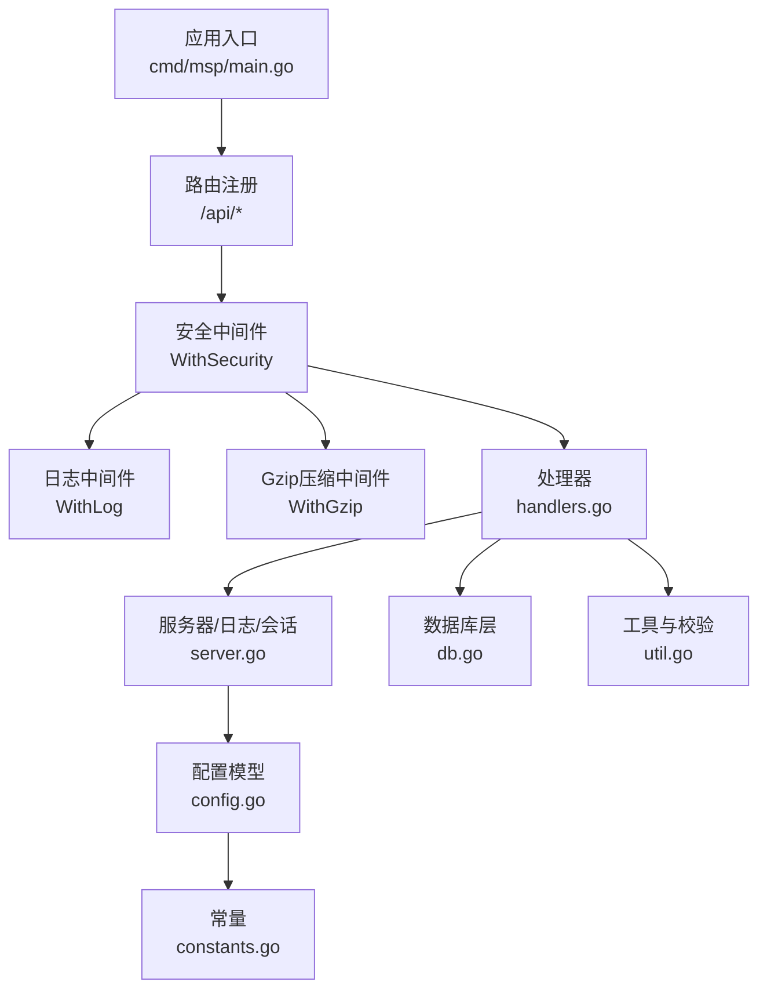
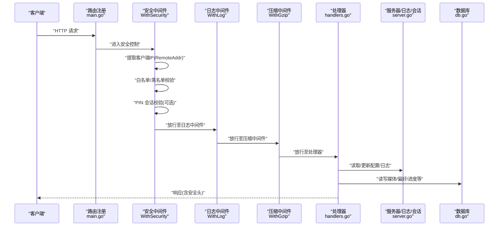
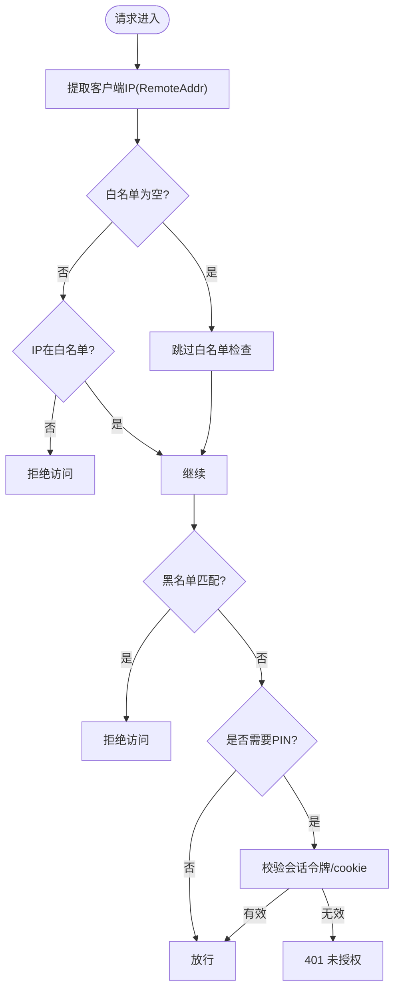
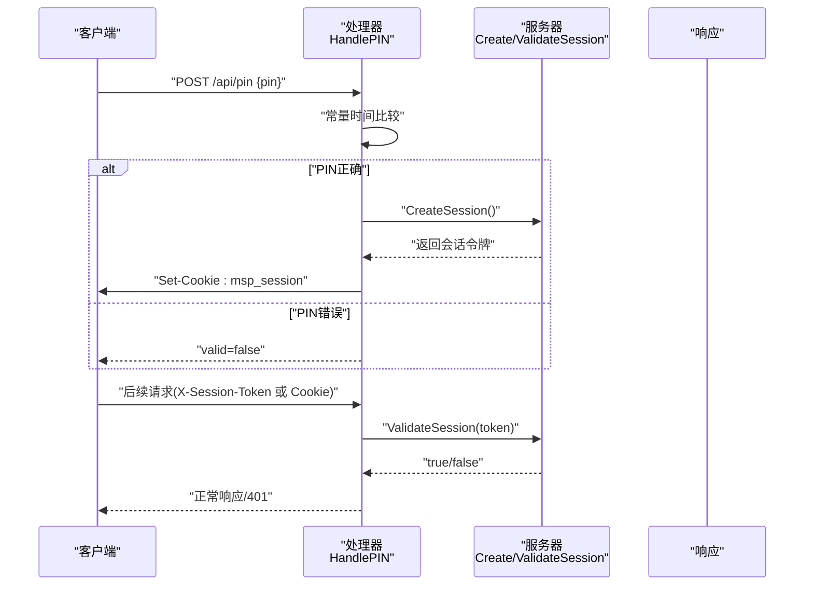
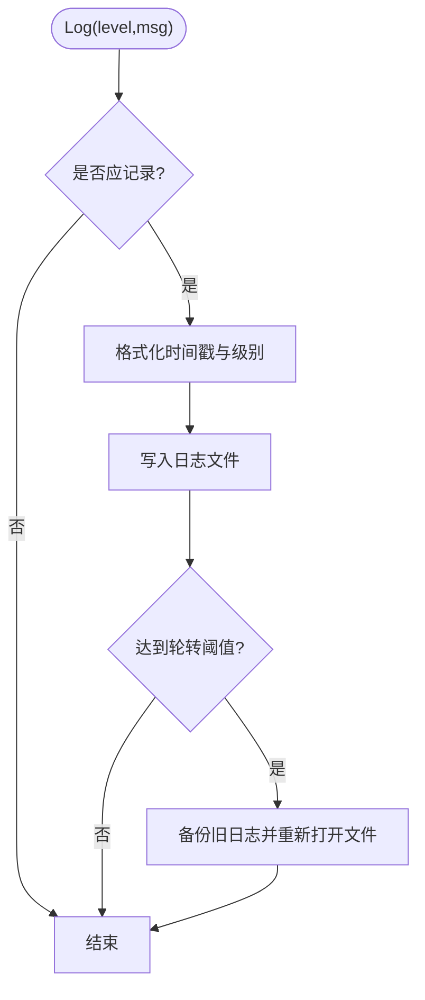
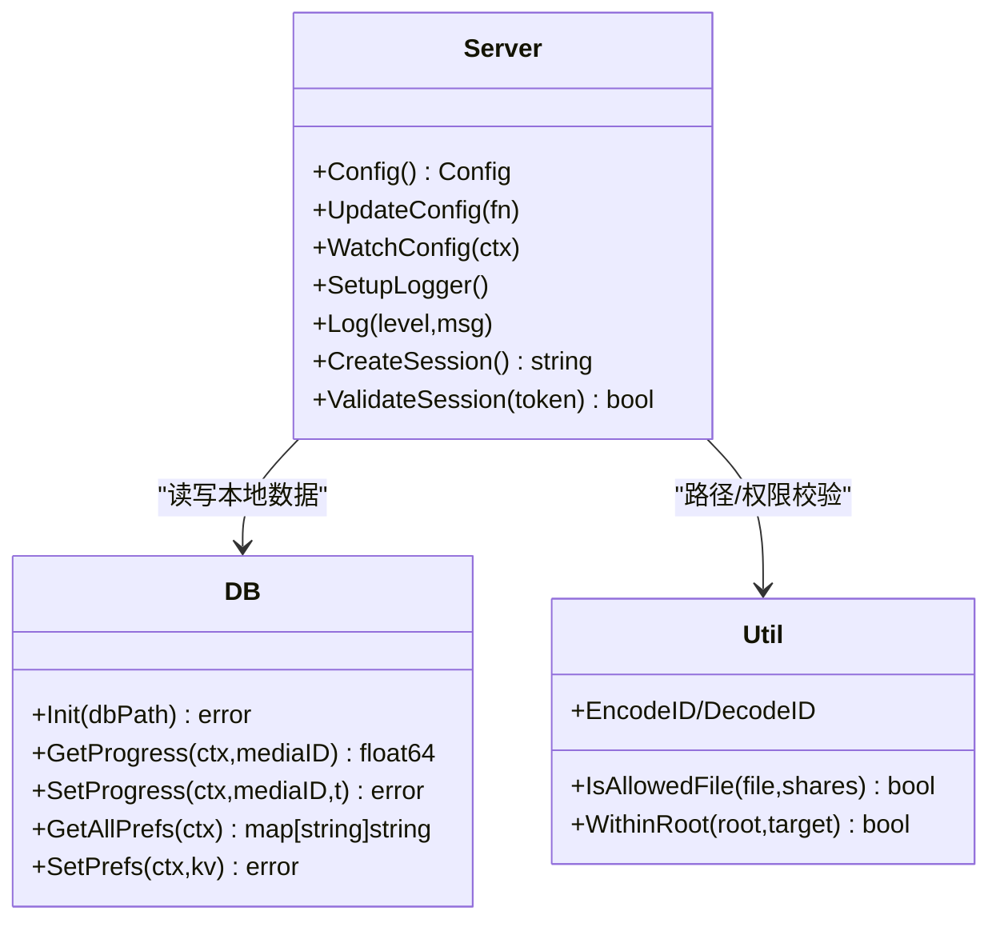
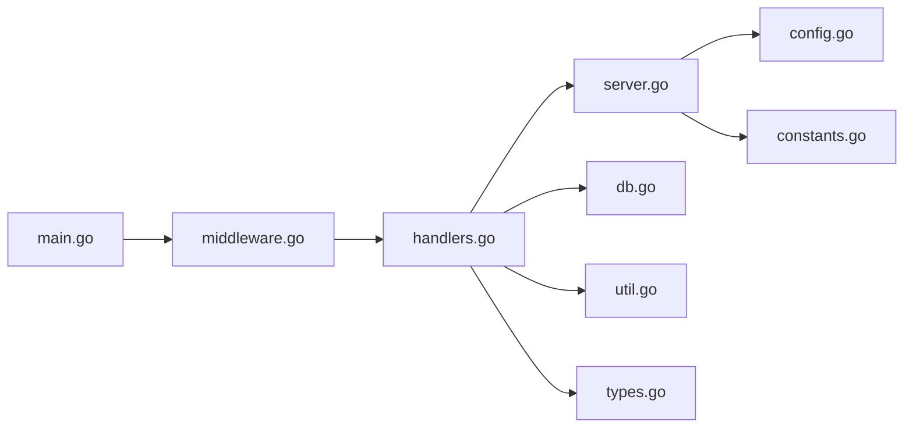

# 本地优先与隐私保护

<cite>
**本文引用的文件**
- [cmd/msp/main.go](file://cmd/msp/main.go)
- [docs/SECURITY.md](file://docs/SECURITY.md)
- [docs/SECURITY_QUICKSTART.md](file://docs/SECURITY_QUICKSTART.md)
- [docs/CONFIG_EXAMPLE.md](file://docs/CONFIG_EXAMPLE.md)
- [internal/config/config.go](file://internal/config/config.go)
- [internal/constants/constants.go](file://internal/constants/constants.go)
- [internal/db/db.go](file://internal/db/db.go)
- [internal/handler/middleware.go](file://internal/handler/middleware.go)
- [internal/handler/handlers.go](file://internal/handler/handlers.go)
- [internal/server/server.go](file://internal/server/server.go)
- [internal/util/util.go](file://internal/util/util.go)
- [internal/types/types.go](file://internal/types/types.go)
- [config.example.json](file://config.example.json)
</cite>

## 目录
1. [简介](#简介)
2. [项目结构](#项目结构)
3. [核心组件](#核心组件)
4. [架构总览](#架构总览)
5. [详细组件分析](#详细组件分析)
6. [依赖关系分析](#依赖关系分析)
7. [性能考量](#性能考量)
8. [故障排查指南](#故障排查指南)
9. [结论](#结论)
10. [附录](#附录)

## 简介
本文件围绕 MSP 的“本地优先”与“隐私保护”两大核心特性，系统性梳理其设计理念、技术实现与安全实践。重点涵盖：
- 本地数据处理：数据不出本地网络、无云端上传、私有部署优势
- 隐私保护：用户数据加密、访问日志管理与审计追踪
- 无跟踪设计：不收集用户信息、无第三方分析、匿名化处理
- 配置文件安全：权限设置、加密存储、安全传输
- 隐私合规：数据最小化、用户同意、数据删除权
- 威胁模型与防护：DDoS、SQL 注入、XSS 等

## 项目结构
MSP 的安全相关能力主要分布在以下模块：
- 应用入口与路由注册：cmd/msp/main.go
- 安全中间件与处理器：internal/handler/middleware.go、internal/handler/handlers.go
- 配置模型与默认值：internal/config/config.go、config.example.json
- 服务器与日志/会话管理：internal/server/server.go
- 数据库与持久化：internal/db/db.go
- 工具函数与路径/权限校验：internal/util/util.go
- 常量定义：internal/constants/constants.go
- 文档与示例：docs/SECURITY.md、docs/SECURITY_QUICKSTART.md、docs/CONFIG_EXAMPLE.md

图表来源
- [cmd/msp/main.go](file://cmd/msp/main.go#L85-L107)
- [internal/handler/middleware.go](file://internal/handler/middleware.go#L77-L120)
- [internal/handler/handlers.go](file://internal/handler/handlers.go#L255-L319)
- [internal/server/server.go](file://internal/server/server.go#L31-L74)
- [internal/db/db.go](file://internal/db/db.go#L32-L72)
- [internal/util/util.go](file://internal/util/util.go#L148-L182)
- [internal/config/config.go](file://internal/config/config.go#L56-L88)
- [internal/constants/constants.go](file://internal/constants/constants.go#L7-L23)

章节来源
- [cmd/msp/main.go](file://cmd/msp/main.go#L26-L83)
- [docs/SECURITY.md](file://docs/SECURITY.md#L1-L188)
- [docs/SECURITY_QUICKSTART.md](file://docs/SECURITY_QUICKSTART.md#L1-L248)
- [docs/CONFIG_EXAMPLE.md](file://docs/CONFIG_EXAMPLE.md#L1-L202)

## 核心组件
- 安全中间件 WithSecurity：负责 IP 白名单/黑名单过滤、PIN 认证、安全响应头注入、基于 RemoteAddr 的客户端 IP 提取策略
- PIN 认证流程：/api/pin 验证端点、会话令牌创建与校验、Cookie 设置（HttpOnly、SameSite、非 HTTPS）
- 日志与审计：统一日志接口、日志轮转、请求记录（含 UA、耗时、新设备检测）
- 本地数据处理：媒体扫描与缓存、SQLite 存储、路径解析与目录遍历防护
- 配置热重载：配置文件监控与自动重载，权限与原子写入

章节来源
- [internal/handler/middleware.go](file://internal/handler/middleware.go#L77-L132)
- [internal/handler/handlers.go](file://internal/handler/handlers.go#L255-L331)
- [internal/server/server.go](file://internal/server/server.go#L190-L284)
- [internal/db/db.go](file://internal/db/db.go#L32-L72)
- [internal/util/util.go](file://internal/util/util.go#L148-L182)
- [internal/config/config.go](file://internal/config/config.go#L148-L162)

## 架构总览
下图展示从客户端到服务端的关键交互链路，以及安全控制点：

图表来源
- [cmd/msp/main.go](file://cmd/msp/main.go#L65-L83)
- [internal/handler/middleware.go](file://internal/handler/middleware.go#L77-L132)
- [internal/handler/handlers.go](file://internal/handler/handlers.go#L255-L319)
- [internal/server/server.go](file://internal/server/server.go#L286-L311)
- [internal/db/db.go](file://internal/db/db.go#L32-L72)

## 详细组件分析

### 安全中间件与无跟踪设计
- IP 白名单/黑名单：支持精确 IP 与 CIDR；白名单为空表示不限制；黑名单优先级高于白名单
- 客户端 IP 来源：家庭/局域网模式仅信任 RemoteAddr，不信任代理头，避免被伪造
- PIN 认证：仅对 /api/*（除 /api/pin、/api/ip、/api/config）生效；会话通过 Cookie 或 X-Session-Token 传递
- 安全响应头：X-Content-Type-Options、X-Frame-Options、X-XSS-Protection、Referrer-Policy
- 无跟踪：不收集用户信息、无第三方分析、无匿名化标识；日志仅记录必要字段并支持轮转

图表来源
- [internal/handler/middleware.go](file://internal/handler/middleware.go#L134-L228)

章节来源
- [internal/handler/middleware.go](file://internal/handler/middleware.go#L77-L132)
- [internal/handler/middleware.go](file://internal/handler/middleware.go#L146-L228)
- [docs/SECURITY.md](file://docs/SECURITY.md#L164-L187)

### PIN 认证与会话管理
- /api/pin：接收 4-8 位数字 PIN，常量时间比较防侧信道；成功后创建会话令牌并设置 HttpOnly Cookie（有效期 7 天）
- 会话校验：支持 X-Session-Token 请求头或 Cookie；服务端维护内存会话表并定期清理过期会话
- 免侵入前端集成：前端可先调用 /api/pin 验证 PIN，随后在后续请求头中携带会话令牌

图表来源
- [internal/handler/handlers.go](file://internal/handler/handlers.go#L255-L319)
- [internal/server/server.go](file://internal/server/server.go#L570-L626)
- [internal/constants/constants.go](file://internal/constants/constants.go#L45-L49)

章节来源
- [internal/handler/handlers.go](file://internal/handler/handlers.go#L255-L331)
- [internal/server/server.go](file://internal/server/server.go#L570-L626)
- [docs/SECURITY.md](file://docs/SECURITY.md#L135-L167)

### 日志与审计追踪
- 统一日志接口：支持 debug/info/error/none 四级；错误级别自动提升为 error
- 日志轮转：达到阈值后自动备份并重新打开文件；按固定频率检查避免频繁 Stat
- 请求审计：记录方法、路径、状态码、UA、耗时；对非本地回环 IP 首次访问标记“新设备”
- 配置热重载日志：检测到配置变更后记录重载事件

图表来源
- [internal/server/server.go](file://internal/server/server.go#L222-L284)

章节来源
- [internal/server/server.go](file://internal/server/server.go#L190-L284)
- [internal/constants/constants.go](file://internal/constants/constants.go#L25-L35)

### 本地数据处理与隐私保护
- 本地扫描与缓存：媒体扫描与缓存驻留内存与磁盘，支持弱 ETag；数据库不可用时降级为磁盘缓存
- 路径与目录遍历防护：解析符号链接、规范化路径、严格判断 WithinRoot，防止越权访问
- SQLite 存储：播放进度、用户偏好、扫描元数据等均本地持久化，无云端同步
- 静态资源与流媒体：静态资源不强制 PIN；流媒体与字幕服务在本地完成，不上传至外部

图表来源
- [internal/server/server.go](file://internal/server/server.go#L31-L74)
- [internal/db/db.go](file://internal/db/db.go#L32-L72)
- [internal/util/util.go](file://internal/util/util.go#L148-L206)

章节来源
- [internal/db/db.go](file://internal/db/db.go#L32-L72)
- [internal/util/util.go](file://internal/util/util.go#L148-L206)
- [internal/server/server.go](file://internal/server/server.go#L332-L436)

### 配置文件安全存储与访问控制
- 配置文件位置：与可执行文件同目录的 config.json；不存在时首次运行自动生成
- 权限设置：配置写入采用 0600 原子写入（.tmp 写入后重命名），日志目录 0750
- 加密存储：未发现内置加密存储；建议结合操作系统级文件加密（如 BitLocker、EncFS、eCryptfs）
- 安全传输：默认仅本地访问；公网暴露不建议，若需暴露建议前置反向代理并启用 TLS
- 热重载：配置文件监控周期 2 秒，变更后自动重载并记录日志

章节来源
- [cmd/msp/main.go](file://cmd/msp/main.go#L30-L48)
- [internal/server/server.go](file://internal/server/server.go#L114-L138)
- [internal/server/server.go](file://internal/server/server.go#L140-L187)
- [docs/SECURITY.md](file://docs/SECURITY.md#L169-L187)

### 隐私合规最佳实践
- 数据最小化：仅存储必要的播放进度与用户偏好；媒体库索引与缓存驻留在本地
- 用户同意：通过 PIN 认证明确授权访问；未收集用户画像或行为数据
- 数据删除权：删除配置文件与数据库文件即可清除所有本地数据；日志文件可按需清理

章节来源
- [internal/db/db.go](file://internal/db/db.go#L226-L259)
- [docs/SECURITY.md](file://docs/SECURITY.md#L169-L187)

### 安全威胁模型与防护
- DDoS 防护：通过 IP 白名单/黑名单限制来源；短超时配置（读取头 10s、读取 15s、空闲 60s）
- SQL 注入：使用 ORM（GORM）与参数化查询，未发现原生 SQL 拼接
- XSS 防护：设置安全响应头（X-XSS-Protection），静态资源与 API 响应头均包含
- 目录遍历与越权：严格的路径解析与 WithinRoot 校验，禁止符号链接绕过
- 会话安全：HttpOnly Cookie、SameSite、7 天有效期；服务端维护会话表并清理过期会话

章节来源
- [cmd/msp/main.go](file://cmd/msp/main.go#L67-L74)
- [internal/handler/middleware.go](file://internal/handler/middleware.go#L122-L132)
- [internal/util/util.go](file://internal/util/util.go#L148-L206)
- [internal/db/db.go](file://internal/db/db.go#L32-L72)

## 依赖关系分析
- 中间件链：WithSecurity → WithLog → WithGzip → Handlers
- 处理器依赖：配置服务、数据库、媒体服务、工具函数
- 服务器职责：配置管理、日志、会话、媒体缓存、磁盘缓存
- 常量集中：端口、默认 PIN、文件/目录权限、日志轮转阈值、会话时长等

图表来源
- [cmd/msp/main.go](file://cmd/msp/main.go#L65-L83)
- [internal/handler/middleware.go](file://internal/handler/middleware.go#L77-L120)
- [internal/handler/handlers.go](file://internal/handler/handlers.go#L38-L43)
- [internal/server/server.go](file://internal/server/server.go#L31-L74)
- [internal/db/db.go](file://internal/db/db.go#L18-L20)
- [internal/util/util.go](file://internal/util/util.go#L1-L20)
- [internal/config/config.go](file://internal/config/config.go#L1-L20)
- [internal/constants/constants.go](file://internal/constants/constants.go#L1-L20)
- [internal/types/types.go](file://internal/types/types.go#L1-L20)

章节来源
- [cmd/msp/main.go](file://cmd/msp/main.go#L26-L83)
- [internal/handler/middleware.go](file://internal/handler/middleware.go#L77-L132)
- [internal/handler/handlers.go](file://internal/handler/handlers.go#L255-L319)
- [internal/server/server.go](file://internal/server/server.go#L31-L74)
- [internal/db/db.go](file://internal/db/db.go#L18-L20)
- [internal/util/util.go](file://internal/util/util.go#L1-L20)
- [internal/config/config.go](file://internal/config/config.go#L1-L20)
- [internal/constants/constants.go](file://internal/constants/constants.go#L1-L20)
- [internal/types/types.go](file://internal/types/types.go#L1-L20)

## 性能考量
- 压缩策略：仅对 /api/*（除 /api/stream、/api/subtitle）启用 gzip，避免对流媒体造成额外开销
- 数据库优化：SQLite 单连接、WAL 模式、NORMAL 同步、缓存大小调整；预编译语句提升性能
- 媒体缓存：内存缓存 + 弱 ETag；DB 可用时优先从数据库加载；DB 不可用时落盘缓存
- GC 策略：主动触发 GC 降低内存占用

章节来源
- [internal/handler/middleware.go](file://internal/handler/middleware.go#L25-L43)
- [internal/db/db.go](file://internal/db/db.go#L54-L72)
- [internal/server/server.go](file://internal/server/server.go#L398-L436)

## 故障排查指南
- 无法访问：检查 IP 白名单是否包含当前 IP；确认未被黑名单命中；查看日志确认是否为“新设备”提示
- 忘记 PIN：编辑 config.json 修改或禁用；或删除配置文件使用默认 PIN
- 配置不生效：确认配置热重载周期（约 2 秒）；检查日志中“Config reloaded successfully”
- 日志过大：确认轮转阈值与轮转逻辑；必要时手动清理旧日志
- 流媒体异常：检查转码策略与 FFmpeg 可用性；查看处理器日志中的转码回退提示

章节来源
- [docs/SECURITY_QUICKSTART.md](file://docs/SECURITY_QUICKSTART.md#L106-L248)
- [internal/server/server.go](file://internal/server/server.go#L140-L187)
- [internal/server/server.go](file://internal/server/server.go#L250-L284)
- [internal/handler/handlers.go](file://internal/handler/handlers.go#L534-L564)

## 结论
MSP 通过“家庭/局域网优先”的设计，将数据处理与存储完全置于本地，配合 IP 白名单/黑名单、PIN 认证、安全响应头与严格的路径校验，实现了强隐私保护与无跟踪设计。配置热重载与日志轮转进一步提升了运维体验。建议在生产环境中结合操作系统级文件加密与反向代理 TLS，以满足更严苛的隐私与合规要求。

## 附录
- 配置示例与注释：参见 docs/CONFIG_EXAMPLE.md 与 config.example.json
- 快速开始与常见问题：参见 docs/SECURITY_QUICKSTART.md 与 docs/SECURITY.md

章节来源
- [docs/CONFIG_EXAMPLE.md](file://docs/CONFIG_EXAMPLE.md#L1-L202)
- [config.example.json](file://config.example.json#L1-L56)
- [docs/SECURITY_QUICKSTART.md](file://docs/SECURITY_QUICKSTART.md#L1-L248)
- [docs/SECURITY.md](file://docs/SECURITY.md#L1-L188)