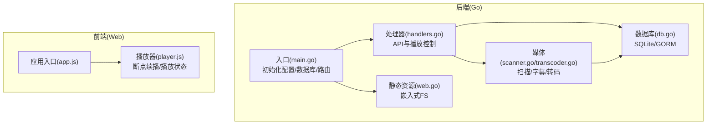
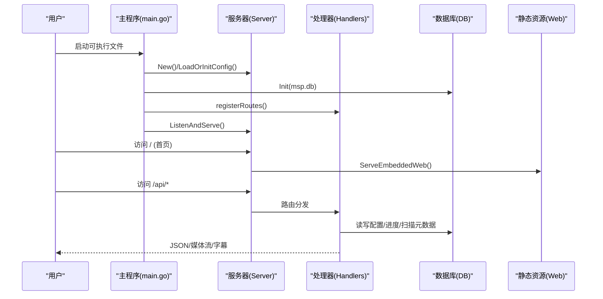
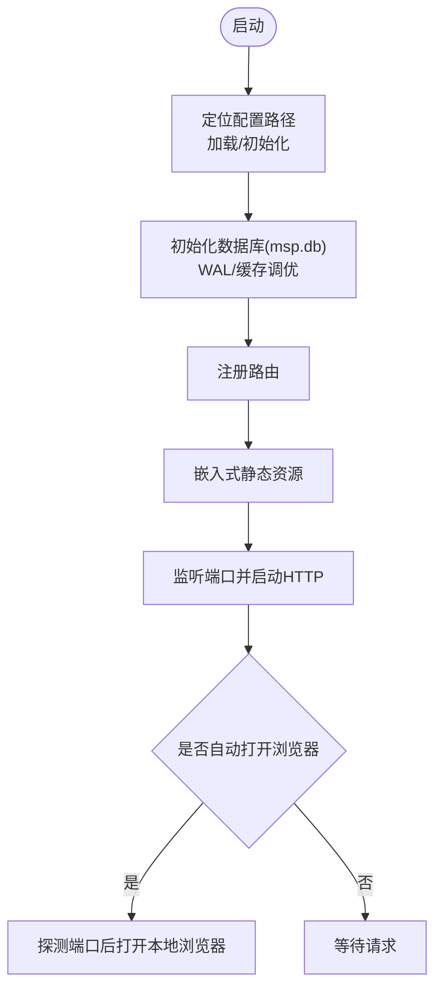
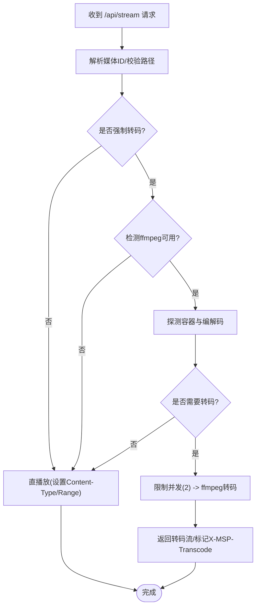
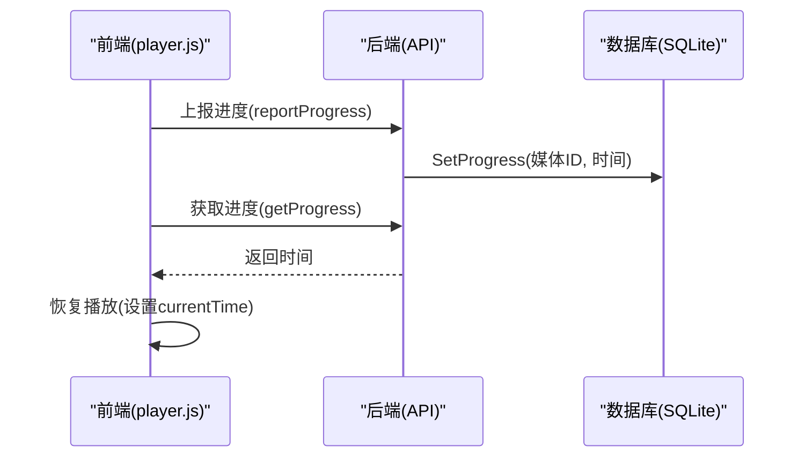
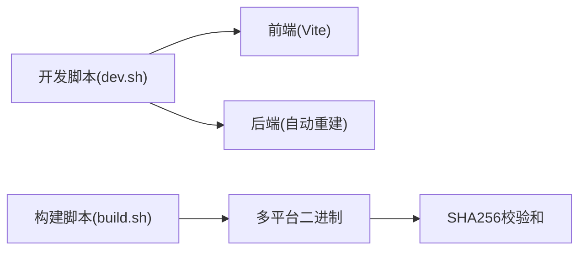
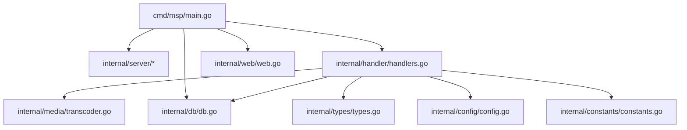

# 核心特性

<cite>
**本文引用的文件**
- [cmd\msp\main.go](file://cmd/msp/main.go)
- [internal\db\db.go](file://internal/db/db.go)
- [internal\media\transcoder.go](file://internal/media/transcoder.go)
- [internal\media\scanner.go](file://internal/media/scanner.go)
- [internal\web\web.go](file://internal/web/web.go)
- [internal\handler\handlers.go](file://internal/handler/handlers.go)
- [internal\config\config.go](file://internal/config/config.go)
- [internal\types\types.go](file://internal/types/types.go)
- [internal\constants\constants.go](file://internal/constants/constants.go)
- [web\src\app.js](file://web/src/app.js)
- [web\src\modules\player.js](file://web/src/modules/player.js)
- [scripts\build.sh](file://scripts/build.sh)
- [scripts\dev.sh](file://scripts/dev.sh)
- [go.mod](file://go.mod)
- [docs\SECURITY.md](file://docs/SECURITY.md)
</cite>

## 目录
1. [简介](#简介)
2. [项目结构](#项目结构)
3. [核心组件](#核心组件)
4. [架构总览](#架构总览)
5. [详细组件分析](#详细组件分析)
6. [依赖关系分析](#依赖关系分析)
7. [性能考量](#性能考量)
8. [故障排查指南](#故障排查指南)
9. [结论](#结论)
10. [附录](#附录)

## 简介
本文件聚焦 MSP 项目的核心特性，围绕“零配置部署”“智能播放与转码”“断点续播”“跨平台支持”“浏览器客户端响应式与移动端适配”“本地优先与隐私保护”等主题，结合代码级实现进行系统化说明，并提供使用场景与效果参考。

## 项目结构
MSP 采用前后端一体化的单体应用架构：
- 后端由 Go 实现，内置 HTTP 服务器、路由与处理器，负责媒体扫描、数据库持久化、转码调度、静态资源嵌入与安全策略。
- 前端基于浏览器原生模块与 Vite 开发，构建后资源被打包进二进制，启动时直接提供静态页面与资源。
- 构建脚本统一产出多平台可执行文件与校验和，便于分发与验证。

图表来源
- [cmd\msp\main.go](file://cmd/msp/main.go#L26-L83)
- [internal\handler\handlers.go](file://internal/handler/handlers.go#L38-L43)
- [internal\media\scanner.go](file://internal/media/scanner.go#L25-L57)
- [internal\media\transcoder.go](file://internal/media/transcoder.go#L138-L248)
- [internal\db\db.go](file://internal/db/db.go#L32-L72)
- [internal\web\web.go](file://internal/web/web.go#L14-L32)
- [web\src\app.js](file://web/src/app.js#L1-L5)
- [web\src\modules\player.js](file://web/src/modules/player.js#L15-L50)

章节来源
- [cmd\msp\main.go](file://cmd/msp/main.go#L26-L83)
- [scripts\build.sh](file://scripts/build.sh#L126-L206)
- [scripts\dev.sh](file://scripts/dev.sh#L92-L131)

## 核心组件
- 零配置部署与单文件运行
  - 启动时自动加载/初始化配置与数据库，无需外部依赖；内置静态资源，单文件即可运行。
- 智能播放与按需转码
  - 播放前根据容器与编解码探测结果，优先直播放；当浏览器不支持或需要格式统一时，按策略触发转码。
- 断点续播
  - 基于本地存储与后端数据库双通道记录播放进度，恢复时优先使用后端进度，回退到本地存储。
- 跨平台支持
  - 通过构建脚本统一产出 Windows/Linux/macOS 多平台二进制，支持 x64、ARM 等架构。
- 浏览器客户端响应式与移动端适配
  - 前端模块化组织，播放器模块负责进度保存与恢复，UI 适配桌面与移动端。
- 本地优先与隐私保护
  - 数据库与配置均位于可执行文件同目录；支持 IP 白/黑名单与 PIN 认证，Cookie 无 Secure 标记以契合局域网场景。

章节来源
- [cmd\msp\main.go](file://cmd/msp/main.go#L30-L45)
- [internal\handler\handlers.go](file://internal/handler/handlers.go#L413-L446)
- [internal\media\transcoder.go](file://internal/media/transcoder.go#L138-L248)
- [internal\db\db.go](file://internal/db/db.go#L74-L99)
- [web\src\modules\player.js](file://web/src/modules/player.js#L15-L50)
- [scripts\build.sh](file://scripts/build.sh#L150-L201)
- [docs\SECURITY.md](file://docs/SECURITY.md#L1-L188)

## 架构总览
后端启动流程概览：解析配置 → 初始化数据库 → 注册路由 → 启动 HTTP 服务器 → 自动打开浏览器 → 提供 API 与静态资源。

图表来源
- [cmd\msp\main.go](file://cmd/msp/main.go#L26-L83)
- [internal\web\web.go](file://internal/web/web.go#L14-L32)
- [internal\handler\handlers.go](file://internal/handler/handlers.go#L85-L107)

## 详细组件分析

### 零配置部署与单文件运行
- 配置与数据库
  - 启动时在可执行文件所在目录查找/创建配置与数据库文件，避免外部依赖。
  - 数据库采用 SQLite，连接池仅开 1 个连接并启用 WAL，兼顾并发与稳定性。
- 静态资源嵌入
  - 构建后前端资源被打包进二进制，运行时通过嵌入式文件系统提供。
- 自动打开浏览器
  - 启动后尝试探测端口可用性，随后自动打开本地浏览器访问首页。

图表来源
- [cmd\msp\main.go](file://cmd/msp/main.go#L30-L45)
- [internal\db\db.go](file://internal/db/db.go#L32-L72)
- [internal\web\web.go](file://internal/web/web.go#L14-L32)
- [cmd\msp\main.go](file://cmd/msp/main.go#L76-L78)

章节来源
- [cmd\msp\main.go](file://cmd/msp/main.go#L30-L45)
- [internal\db\db.go](file://internal/db/db.go#L32-L72)
- [internal\web\web.go](file://internal/web/web.go#L14-L32)

### 智能播放与按需转码
- 播放策略
  - 优先直播放：根据扩展名与内容类型设置合适的 Content-Type，并启用 Accept-Ranges。
  - 按需转码：当客户端请求明确要求转码或浏览器不支持容器/编解码时，调用 ffmpeg 进行转码输出。
- 转码决策
  - 视频：若容器/编解码已满足常见播放需求则复制流；否则使用硬件友好的参数进行转码并优化 MP4 输出。
  - 音频：若已是目标格式则复制；否则转为目标音频格式并可设置码率。
  - 并发限制：全局并发转码上限为 2，避免 CPU 过载。
- 字幕处理
  - 支持 SRT/ASS/SSA 到 WebVTT 的在线转换，限制最大字幕体积，避免内存压力。

图表来源
- [internal\handler\handlers.go](file://internal/handler/handlers.go#L413-L446)
- [internal\handler\handlers.go](file://internal/handler/handlers.go#L513-L532)
- [internal\media\transcoder.go](file://internal/media/transcoder.go#L138-L248)

章节来源
- [internal\handler\handlers.go](file://internal/handler/handlers.go#L413-L446)
- [internal\handler\handlers.go](file://internal/handler/handlers.go#L513-L532)
- [internal\media\transcoder.go](file://internal/media/transcoder.go#L138-L248)

### 断点续播
- 进度记录
  - 前端在播放音频/视频时保存当前项 ID 与时间至本地存储，并周期性上报后端。
  - 后端使用 SQLite 存储播放进度，键为媒体 ID，值为时间点。
- 恢复策略
  - 启动时根据上次活跃类型与存储的 ID 查找对应媒体池，优先通过 API 获取后端进度；若无则回退到本地存储。
  - 可恢复播放列表状态与音量，提升连续观看体验。

图表来源
- [web\src\modules\player.js](file://web/src/modules/player.js#L15-L50)
- [internal\db\db.go](file://internal/db/db.go#L74-L99)
- [internal\handler\handlers.go](file://internal/handler/handlers.go#L192-L233)

章节来源
- [web\src\modules\player.js](file://web/src/modules/player.js#L15-L50)
- [internal\db\db.go](file://internal/db/db.go#L74-L99)
- [internal\handler\handlers.go](file://internal/handler/handlers.go#L192-L233)

### 跨平台支持与构建
- 多平台产物
  - 脚本统一构建 Linux、macOS、Windows 以及 ARM 平台产物，支持 x64、x86、arm64、v7、v8 等架构。
- 开发与测试
  - 开发脚本支持热更新：Go 源码变更自动重建并重启后端，前端使用 Vite 热更新。
- 依赖与工具链
  - 后端使用 GORM + SQLite，前端使用 pnpm/Vite，构建脚本自动校验与生成 SHA256 校验和。

图表来源
- [scripts\dev.sh](file://scripts/dev.sh#L92-L131)
- [scripts\build.sh](file://scripts/build.sh#L150-L201)
- [go.mod](file://go.mod#L5-L9)

章节来源
- [scripts\build.sh](file://scripts/build.sh#L150-L201)
- [scripts\dev.sh](file://scripts/dev.sh#L92-L131)
- [go.mod](file://go.mod#L5-L9)

### 浏览器客户端响应式与移动端适配
- 模块化组织
  - 应用入口导入播放器模块，负责进度保存、恢复与 UI 交互。
- 响应式与可访问性
  - 播放器模块根据当前媒体类型切换视频/音频元素，支持移动端手势与键盘快捷键。
- 字幕与歌词
  - 字幕在线转换为 WebVTT，歌词模块支持 LRC 解析与同步渲染。

章节来源
- [web\src\app.js](file://web/src/app.js#L1-L5)
- [web\src\modules\player.js](file://web/src/modules/player.js#L15-L50)

### 本地优先与隐私保护
- 本地优先
  - 配置与数据库位于可执行文件同目录，无需系统级安装或外部服务。
- 隐私与安全
  - 支持 IP 白名单/黑名单与 PIN 认证；PIN 验证成功后下发 HttpOnly 会话 Cookie（局域网模式不带 Secure 标记）。
  - 配置热重载，变更后快速生效。

章节来源
- [docs\SECURITY.md](file://docs/SECURITY.md#L1-L188)
- [internal\handler\handlers.go](file://internal/handler/handlers.go#L255-L319)
- [internal\constants\constants.go](file://internal/constants/constants.go#L45-L49)

## 依赖关系分析
后端核心模块之间的依赖关系如下：

图表来源
- [cmd\msp\main.go](file://cmd/msp/main.go#L18-L24)
- [internal\handler\handlers.go](file://internal/handler/handlers.go#L38-L43)
- [internal\db\db.go](file://internal/db/db.go#L18-L19)
- [internal\types\types.go](file://internal/types/types.go#L1-L112)
- [internal\config\config.go](file://internal/config/config.go#L77-L88)
- [internal\constants\constants.go](file://internal/constants/constants.go#L7-L14)

章节来源
- [cmd\msp\main.go](file://cmd/msp/main.go#L18-L24)
- [internal\handler\handlers.go](file://internal/handler/handlers.go#L38-L43)

## 性能考量
- 数据库
  - 单连接 + WAL + 调优参数，适合单机与局域网场景；对写入吞吐与并发访问做了平衡。
- 转码
  - 并发上限 2，避免 CPU 抢占；针对常见容器/编解码采用“复制流”策略减少 CPU 压力。
- 静态资源
  - 嵌入式 FS 减少磁盘 IO；对大文件设置合理缓存策略，小文件禁用缓存。
- 扫描
  - 支持黑名单与扫描上限，避免大规模目录遍历带来的性能问题。

章节来源
- [internal\db\db.go](file://internal/db/db.go#L54-L69)
- [internal\media\transcoder.go](file://internal/media/transcoder.go#L15-L17)
- [internal\web\web.go](file://internal/web/web.go#L26-L31)
- [internal\media\scanner.go](file://internal/media/scanner.go#L25-L57)

## 故障排查指南
- 启动后无法访问
  - 检查端口占用与防火墙；查看启动日志输出的访问 URL。
- 播放卡顿或黑屏
  - 若未安装 ffmpeg，将无法转码；确认浏览器支持的容器/编解码；必要时在配置中开启转码。
- 进度不同步
  - 确认前端上报与后端存储均正常；检查 SQLite 文件是否存在与权限是否正确。
- 安全相关
  - 若启用 PIN，确认 Cookie 是否正确下发；局域网模式下 Cookie 不带 Secure 标记属预期行为。

章节来源
- [cmd\msp\main.go](file://cmd/msp/main.go#L109-L123)
- [internal\handler\handlers.go](file://internal/handler/handlers.go#L513-L532)
- [internal\db\db.go](file://internal/db/db.go#L74-L99)
- [docs\SECURITY.md](file://docs/SECURITY.md#L135-L167)

## 结论
MSP 通过“零配置部署 + 内置 SQLite + 嵌入式前端”的组合，实现了开箱即用的媒体服务；配合“智能播放/按需转码”“断点续播”“跨平台构建”“本地优先与隐私保护”，在家庭与局域网场景下具备良好的可用性与安全性。对于需要更高并发或云化部署的场景，可在现有模块基础上扩展外部存储与负载均衡层。

## 附录
- 使用场景示例
  - 家庭影音中心：将 NAS 中的视频/音频资源直接分享，自动扫描与索引，支持断点续播与字幕。
  - 局域网演示：无需安装额外软件，单机运行即可提供网页端播放。
  - 移动端观看：通过手机浏览器访问，播放器模块适配移动端手势与屏幕尺寸。
- 实际效果
  - 首次启动后自动打开浏览器，访问首页即可看到媒体列表；播放时支持进度上报与恢复；转码时可观察到“X-MSP-Transcode”响应头。