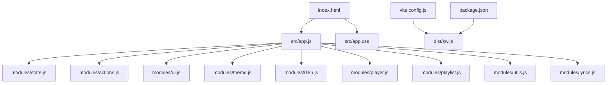
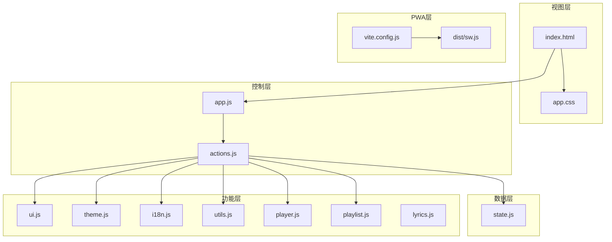
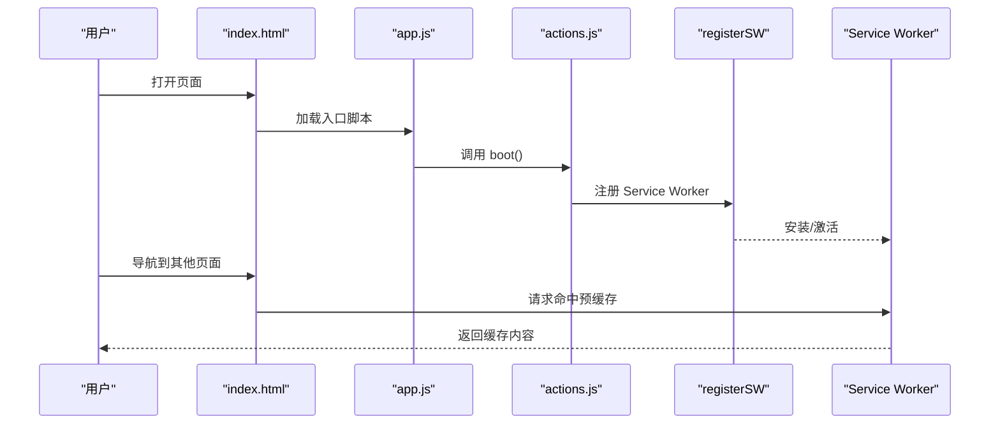
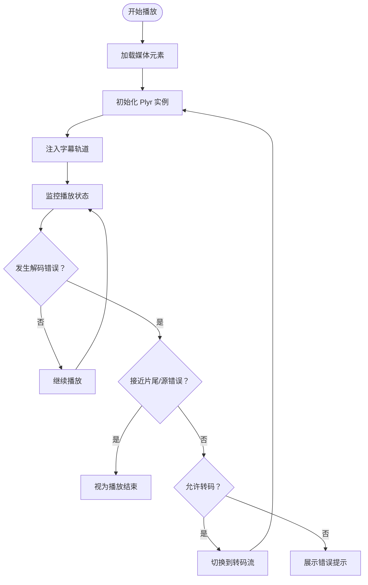
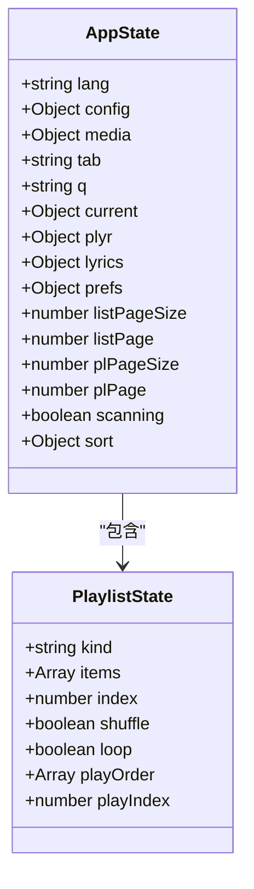
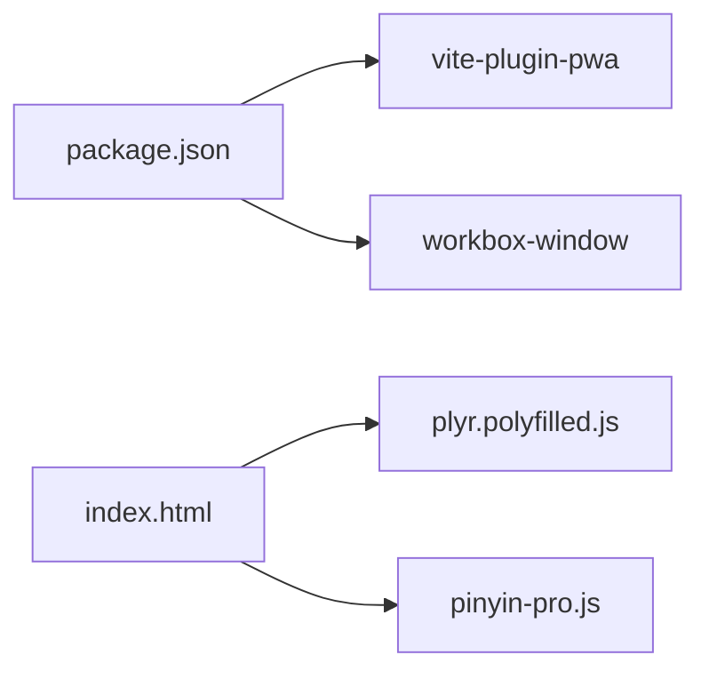

# 浏览器客户端

<cite>
**本文引用的文件**
- [web/src/app.js](file://web/src/app.js)
- [web/index.html](file://web/index/html)
- [web/src/app.css](file://web/src/app.css)
- [web/vite.config.js](file://web/vite.config.js)
- [web/package.json](file://web/package.json)
- [web/src/modules/state.js](file://web/src/modules/state.js)
- [web/src/modules/actions.js](file://web/src/modules/actions.js)
- [web/src/modules/ui.js](file://web/src/modules/ui.js)
- [web/src/modules/theme.js](file://web/src/modules/theme.js)
- [web/src/modules/i18n.js](file://web/src/modules/i18n.js)
- [web/src/modules/utils.js](file://web/src/modules/utils.js)
- [web/src/modules/player.js](file://web/src/modules/player.js)
- [web/src/modules/playlist.js](file://web/src/modules/playlist.js)
- [web/src/modules/lyrics.js](file://web/src/modules/lyrics.js)
- [web/dist/sw.js](file://web/dist/sw.js)
</cite>

## 目录
1. [简介](#简介)
2. [项目结构](#项目结构)
3. [核心组件](#核心组件)
4. [架构总览](#架构总览)
5. [详细组件分析](#详细组件分析)
6. [依赖关系分析](#依赖关系分析)
7. [性能考量](#性能考量)
8. [故障排查指南](#故障排查指南)
9. [结论](#结论)
10. [附录](#附录)

## 简介
本文件面向MSP项目的浏览器客户端，聚焦以下目标：
- 响应式设计与移动端适配：基于CSS变量、网格与弹性布局，结合媒体查询与视口元信息，实现跨设备一致体验。
- PWA能力：通过VitePWA插件生成Service Worker与清单文件，结合Workbox运行时缓存策略，提供离线与更新能力。
- 现代浏览器兼容：使用ES模块与现代Web API；播放器采用Polyfilled版本以覆盖旧环境。
- 播放器集成：基于Plyr播放器的深度定制，包括字幕轨道注入、音轨检测、转码回退与智能跳转。
- 模块化设计：以状态管理、UI绑定、播放控制、国际化与主题为核心模块，配合工具函数与歌词渲染。
- 主题与国际化：双主题切换与多语言文案映射，动态更新页面文本与占位符。

## 项目结构
前端位于web目录，采用Vite构建，核心入口为index.html与src/app.js，样式集中于src/app.css，模块化代码位于src/modules。

图表来源
- [web/index.html](file://web/index.html#L1-L195)
- [web/src/app.js](file://web/src/app.js#L1-L5)
- [web/src/app.css](file://web/src/app.css#L1-L1373)
- [web/vite.config.js](file://web/vite.config.js#L1-L48)
- [web/package.json](file://web/package.json#L1-L25)
- [web/src/modules/state.js](file://web/src/modules/state.js#L1-L127)
- [web/src/modules/actions.js](file://web/src/modules/actions.js#L1-L164)
- [web/src/modules/ui.js](file://web/src/modules/ui.js#L1-L417)
- [web/src/modules/theme.js](file://web/src/modules/theme.js#L1-L67)
- [web/src/modules/i18n.js](file://web/src/modules/i18n.js#L1-L201)
- [web/src/modules/utils.js](file://web/src/modules/utils.js#L1-L124)
- [web/src/modules/player.js](file://web/src/modules/player.js#L1-L1292)
- [web/src/modules/playlist.js](file://web/src/modules/playlist.js#L1-L457)
- [web/src/modules/lyrics.js](file://web/src/modules/lyrics.js#L1-L74)
- [web/dist/sw.js](file://web/dist/sw.js#L1-L2)

章节来源
- [web/index.html](file://web/index.html#L1-L195)
- [web/src/app.js](file://web/src/app.js#L1-L5)
- [web/src/app.css](file://web/src/app.css#L1-L1373)
- [web/vite.config.js](file://web/vite.config.js#L1-L48)
- [web/package.json](file://web/package.json#L1-L25)

## 核心组件
- 入口与引导：app.js导入样式与动作模块，执行启动流程。
- 状态与存储：state.js定义全局状态、本地存储键与读写辅助。
- 行为编排：actions.js负责配置/偏好加载、媒体列表拉取、PWA注册与引导。
- 用户界面：ui.js负责渲染列表、分页、设置对话框、语言与UI更新。
- 主题系统：theme.js实现明暗主题切换、系统偏好监听与过渡动画。
- 国际化：i18n.js提供多语言字典与翻译函数，配合UI动态更新。
- 工具函数：utils.js提供格式化、MIME判断、URL拼接等通用能力。
- 播放器：player.js封装Plyr实例、错误拦截、转码回退、字幕/音轨处理、进度持久化。
- 播放列表：playlist.js实现筛选/排序、分页自适应、播放顺序与导航。
- 歌词：lyrics.js解析LRC、渲染与高亮滚动。

章节来源
- [web/src/app.js](file://web/src/app.js#L1-L5)
- [web/src/modules/state.js](file://web/src/modules/state.js#L1-L127)
- [web/src/modules/actions.js](file://web/src/modules/actions.js#L1-L164)
- [web/src/modules/ui.js](file://web/src/modules/ui.js#L1-L417)
- [web/src/modules/theme.js](file://web/src/modules/theme.js#L1-L67)
- [web/src/modules/i18n.js](file://web/src/modules/i18n.js#L1-L201)
- [web/src/modules/utils.js](file://web/src/modules/utils.js#L1-L124)
- [web/src/modules/player.js](file://web/src/modules/player.js#L1-L1292)
- [web/src/modules/playlist.js](file://web/src/modules/playlist.js#L1-L457)
- [web/src/modules/lyrics.js](file://web/src/modules/lyrics.js#L1-L74)

## 架构总览
浏览器客户端采用“模块化单页应用”架构：
- 视图层：index.html定义骨架，CSS提供主题与布局。
- 控制层：app.js作为引导，actions.js协调数据流。
- 数据层：state.js集中状态，localStorage持久化偏好。
- 功能层：player/playlist/lyrics/i18n/theme等模块解耦职责。
- PWA层：VitePWA生成Service Worker与清单，Workbox路由与缓存。

图表来源
- [web/index.html](file://web/index.html#L1-L195)
- [web/src/app.js](file://web/src/app.js#L1-L5)
- [web/src/modules/actions.js](file://web/src/modules/actions.js#L1-L164)
- [web/src/modules/state.js](file://web/src/modules/state.js#L1-L127)
- [web/src/modules/ui.js](file://web/src/modules/ui.js#L1-L417)
- [web/src/modules/theme.js](file://web/src/modules/theme.js#L1-L67)
- [web/src/modules/i18n.js](file://web/src/modules/i18n.js#L1-L201)
- [web/src/modules/utils.js](file://web/src/modules/utils.js#L1-L124)
- [web/src/modules/player.js](file://web/src/modules/player.js#L1-L1292)
- [web/src/modules/playlist.js](file://web/src/modules/playlist.js#L1-L457)
- [web/src/modules/lyrics.js](file://web/src/modules/lyrics.js#L1-L74)
- [web/vite.config.js](file://web/vite.config.js#L1-L48)
- [web/dist/sw.js](file://web/dist/sw.js#L1-L2)

## 详细组件分析

### 响应式设计与移动端适配
- 视口与基础布局
  - 视口元信息确保移动端缩放正确。
  - 根元素与全局样式统一字体、颜色与过渡。
- CSS变量与主题
  - 使用CSS变量定义主色、表面色、阴影、圆角与过渡，支持明/暗两套主题。
  - 通过[data-theme]属性切换主题，配合渐变背景与模糊玻璃效果。
- 布局体系
  - 顶部栏使用flex布局，内容区采用CSS Grid三栏布局，左右侧边栏与舞台区域自适应。
  - 列表与播放列表采用flex与自适应分页，保证在窄屏下可滚动阅读。
- 移动端适配
  - 媒体查询针对小屏宽度调整音频元信息布局与歌词容器尺寸。
  - 视频播放强制内联播放与控制条显示，提升触摸交互体验。
  - 字体与间距按密度优化，确保触控可达性。

章节来源
- [web/index.html](file://web/index.html#L1-L195)
- [web/src/app.css](file://web/src/app.css#L1-L1373)

### PWA与离线能力
- Service Worker与清单
  - VitePWA在开发与生产均生成Service Worker与manifest，支持自动更新与图标资源缓存。
- 运行时缓存策略
  - Workbox对静态资源进行预缓存与清理过时缓存。
  - 导航请求默认走预缓存命中，否则回源；/api前缀请求强制NetworkOnly，避免污染缓存。
- 注册与更新
  - 引导阶段通过registerSW触发Service Worker注册，支持立即更新。

图表来源
- [web/src/app.js](file://web/src/app.js#L1-L5)
- [web/src/modules/actions.js](file://web/src/modules/actions.js#L93-L164)
- [web/vite.config.js](file://web/vite.config.js#L1-L48)
- [web/dist/sw.js](file://web/dist/sw.js#L1-L2)

章节来源
- [web/vite.config.js](file://web/vite.config.js#L1-L48)
- [web/package.json](file://web/package.json#L1-L25)
- [web/dist/sw.js](file://web/dist/sw.js#L1-L2)

### 现代浏览器兼容与polyfill策略
- ES模块与现代API
  - 使用ES模块组织代码，现代浏览器原生支持。
- 播放器兼容
  - 引入Plyr polyfilled版本，覆盖旧版浏览器的Web Audio/Video API差异。
- 字幕与音轨
  - 使用HTML5原生textTracks与audioTracks API，必要时通过Plyr刷新菜单。
- 转码回退
  - 当解码错误发生在片尾或源不可用时，自动尝试转码流；若仍失败则提示用户。

章节来源
- [web/index.html](file://web/index.html#L190-L191)
- [web/src/modules/player.js](file://web/src/modules/player.js#L356-L706)

### 播放器集成与字幕支持
- Plyr实例化与控制
  - 根据设备类型决定是否显示原生控制条与内联播放。
  - 启用字幕、画质、速度与循环设置菜单，持久化音量/倍速/静音状态。
- 字幕轨道注入
  - 从媒体对象的subtitles数组动态创建track节点，支持默认字幕与语言切换。
  - 通过Plyr captions接口与textTracks同步用户偏好的字幕轨道。
- 音轨检测
  - 在loadedmetadata事件后检测多音轨并恢复上次选择，定期保存当前音轨索引。
- 错误与回退
  - 捕获MEDIA_ERR_DECODE/MEDIA_ERR_SRC_NOT_SUPPORTED，临近片尾时视为结束，否则尝试转码。
  - 对于部分浏览器的源错误，提供一次刷新时间戳的重试。
- 智能跳转
  - 在转码流场景下拦截seeking事件，重新构造带起始时间的转码URL并平滑恢复播放。

图表来源
- [web/src/modules/player.js](file://web/src/modules/player.js#L356-L706)

章节来源
- [web/src/modules/player.js](file://web/src/modules/player.js#L1-L1292)

### 模块化设计与状态管理
- 状态模型
  - AppState包含语言、配置、媒体数据、当前播放项、播放列表、排序与扫描状态等。
  - PlaylistState维护播放类型、列表、索引、随机/循环与播放顺序。
- 本地存储
  - LS键涵盖音频/视频最后ID与时间、随机/循环、主题、语言、音量、播放列表、排序字段与顺序等。
- 事件与UI绑定
  - UI模块绑定搜索、排序、标签页切换、分页与设置对话框，动态更新文案与占位符。
- 性能优化
  - 列表与播放列表分页自适应，根据容器高度动态计算每页项数。
  - 播放器心跳检测与播放停滞保护，避免长时间无进展导致卡死。

图表来源
- [web/src/modules/state.js](file://web/src/modules/state.js#L1-L127)

章节来源
- [web/src/modules/state.js](file://web/src/modules/state.js#L1-L127)
- [web/src/modules/ui.js](file://web/src/modules/ui.js#L1-L417)
- [web/src/modules/playlist.js](file://web/src/modules/playlist.js#L1-L457)

### 主题系统与国际化
- 主题
  - 通过data-theme属性切换明/暗主题，支持系统偏好与手动切换，提供视图过渡动画。
- 国际化
  - 多语言字典覆盖界面文案、错误提示与帮助信息；动态更新HTML元素的文本与占位符。
  - 平台特定占位符提示（Windows/Unix/macOS），黑名单提示支持正则与大小范围说明。

章节来源
- [web/src/modules/theme.js](file://web/src/modules/theme.js#L1-L67)
- [web/src/modules/i18n.js](file://web/src/modules/i18n.js#L1-L201)
- [web/src/modules/ui.js](file://web/src/modules/ui.js#L1-L417)

## 依赖关系分析
- 构建与PWA
  - VitePWA插件生成Service Worker与清单；Workbox提供预缓存、清理与导航路由。
- 运行时依赖
  - workbox-window用于SW更新通知与注册。
- 播放器与工具
  - 播放器引入polyfilled版本；pinyin-pro用于中文拼音/模糊搜索。

图表来源
- [web/package.json](file://web/package.json#L1-L25)
- [web/index.html](file://web/index.html#L190-L191)

章节来源
- [web/package.json](file://web/package.json#L1-L25)
- [web/vite.config.js](file://web/vite.config.js#L1-L48)

## 性能考量
- 渲染与滚动
  - 列表与播放列表分页自适应，减少一次性DOM节点数量。
  - 歌词容器使用mask与滚动定位，避免频繁重排。
- 播放器优化
  - 心跳检测与播放停滞保护，降低卡顿风险。
  - 智能跳转在转码流场景下避免标准seek失效。
- 缓存策略
  - 非API请求预缓存，导航快速命中；API请求直连网络，避免缓存污染。
- 体积与加载
  - 播放器polyfilled版本按需加载，减少不必要的垫片。

## 故障排查指南
- 无法播放/解码失败
  - 检查媒体容器/编码是否受支持；确认配置允许转码；尝试“在新标签打开”原始文件。
- 字幕/音轨不显示
  - 确认媒体内封字幕轨道存在；检查字幕语言与默认标记；通过Plyr设置菜单切换。
- 主题切换无效
  - 检查data-theme属性与CSS变量是否正确更新；确认系统偏好未覆盖。
- 语言切换未生效
  - 确认本地存储语言键值；检查UI更新逻辑与占位符替换。
- Service Worker未注册
  - 检查HTTPS与registerSW调用；查看控制台错误与Service Worker生命周期日志。

章节来源
- [web/src/modules/player.js](file://web/src/modules/player.js#L356-L706)
- [web/src/modules/theme.js](file://web/src/modules/theme.js#L1-L67)
- [web/src/modules/i18n.js](file://web/src/modules/i18n.js#L1-L201)
- [web/src/modules/ui.js](file://web/src/modules/ui.js#L1-L417)
- [web/vite.config.js](file://web/vite.config.js#L1-L48)

## 结论
MSP浏览器客户端以模块化与PWA为核心，结合响应式布局与播放器深度定制，实现了跨设备的稳定媒体预览体验。通过本地存储与Workbox缓存策略，兼顾了性能与离线可用性；通过字幕/音轨与转码回退机制，提升了兼容性与健壮性。建议后续持续关注浏览器API演进与缓存策略迭代，以进一步优化加载与播放体验。

## 附录
- 关键实现路径参考
  - 启动流程：[web/src/app.js](file://web/src/app.js#L1-L5)，[web/src/modules/actions.js](file://web/src/modules/actions.js#L93-L164)
  - 主题切换：[web/src/modules/theme.js](file://web/src/modules/theme.js#L1-L67)
  - 国际化更新：[web/src/modules/i18n.js](file://web/src/modules/i18n.js#L1-L201)，[web/src/modules/ui.js](file://web/src/modules/ui.js#L19-L72)
  - 播放器初始化与回退：[web/src/modules/player.js](file://web/src/modules/player.js#L356-L706)
  - 列表与播放列表：[web/src/modules/ui.js](file://web/src/modules/ui.js#L74-L170)，[web/src/modules/playlist.js](file://web/src/modules/playlist.js#L238-L325)
  - 歌词渲染：[web/src/modules/lyrics.js](file://web/src/modules/lyrics.js#L27-L73)
  - PWA配置与SW：[web/vite.config.js](file://web/vite.config.js#L1-L48)，[web/dist/sw.js](file://web/dist/sw.js#L1-L2)