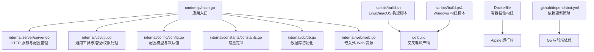
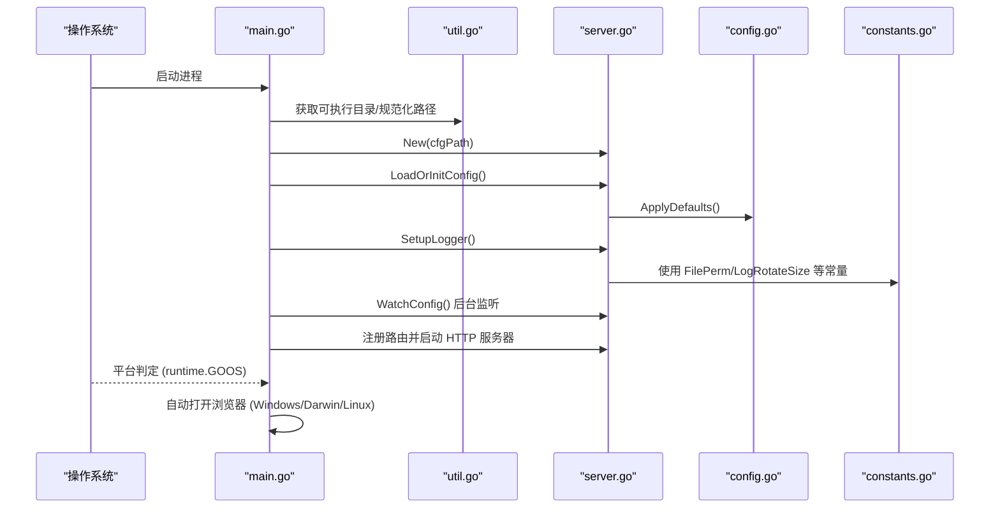
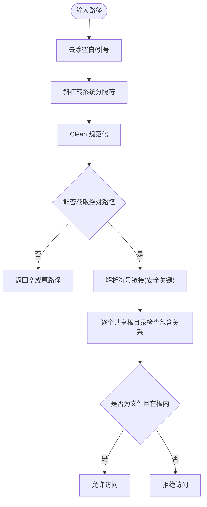
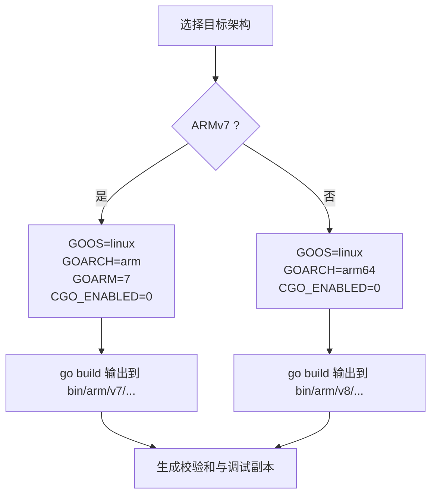
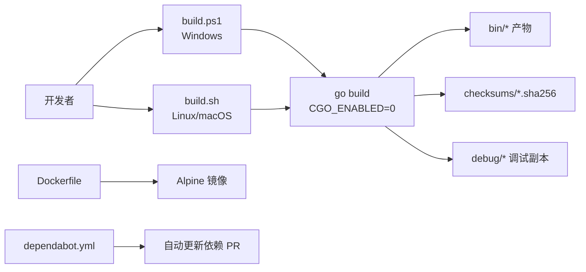
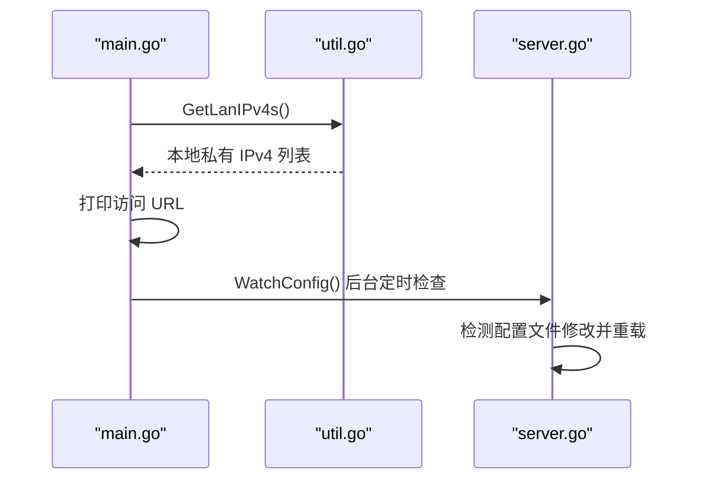
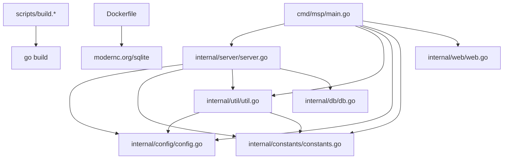

# 跨平台支持

<cite>
**本文引用的文件**
- [cmd/msp/main.go](file://cmd/msp/main.go)
- [internal/util/util.go](file://internal/util/util.go)
- [internal/constants/constants.go](file://internal/constants/constants.go)
- [internal/server/server.go](file://internal/server/server.go)
- [internal/config/config.go](file://internal/config/config.go)
- [scripts/build.sh](file://scripts/build.sh)
- [scripts/build.ps1](file://scripts/build.ps1)
- [Dockerfile](file://Dockerfile)
- [.github/dependabot.yml](file://.github/dependabot.yml)
- [config.example.json](file://config.example.json)
- [go.mod](file://go.mod)
- [README.md](file://README.md)
</cite>

## 目录
1. [简介](#简介)
2. [项目结构](#项目结构)
3. [核心组件](#核心组件)
4. [架构总览](#架构总览)
5. [详细组件分析](#详细组件分析)
6. [依赖关系分析](#依赖关系分析)
7. [性能考量](#性能考量)
8. [故障排除指南](#故障排除指南)
9. [结论](#结论)
10. [附录](#附录)

## 简介
本文件系统性阐述 MSP 项目的跨平台支持特性，覆盖 Windows、Linux、macOS 三大桌面/服务器平台的兼容性实现；ARM 架构（ARMv7、ARMv8）的差异化处理与性能优化；多平台构建系统（含交叉编译、依赖管理与自动化流水线）；以及平台特定优化策略（文件系统差异处理、路径分隔符转换、权限管理、网络接口选择、浏览器自动打开等）。同时提供安装部署与故障排除建议，帮助用户在不同平台上稳定运行。

## 项目结构
MSP 采用模块化的 Go 应用结构，入口位于 cmd/msp/main.go，核心业务逻辑分布在 internal/* 包中，前端资源通过嵌入式文件系统提供，脚本化构建工具支持多平台交叉编译，容器镜像基于 Alpine 发行版。

图表来源
- [cmd/msp/main.go](file://cmd/msp/main.go#L1-L151)
- [internal/server/server.go](file://internal/server/server.go#L1-L120)
- [internal/util/util.go](file://internal/util/util.go#L1-L120)
- [internal/config/config.go](file://internal/config/config.go#L1-L120)
- [internal/constants/constants.go](file://internal/constants/constants.go#L1-L115)
- [scripts/build.sh](file://scripts/build.sh#L1-L206)
- [scripts/build.ps1](file://scripts/build.ps1#L1-L245)
- [Dockerfile](file://Dockerfile#L1-L49)
- [.github/dependabot.yml](file://.github/dependabot.yml#L1-L31)

章节来源
- [README.md](file://README.md#L1-L106)
- [go.mod](file://go.mod#L1-L31)

## 核心组件
- 应用入口与启动流程：负责加载配置、初始化日志、数据库、注册路由、启动 HTTP 服务，并按平台自动打开浏览器。
- 服务器与配置：提供配置热重载、日志轮转、媒体缓存、会话管理等能力。
- 工具库：统一处理路径规范化、大小解析、权限判断、IP 判定、去重等。
- 配置模型：集中定义配置字段、默认值与校验规则。
- 常量：统一管理端口、权限掩码、日志轮转、缓存 TTL、字节单位、HTTP 状态码等。
- 构建系统：Shell/PowerShell 脚本实现多平台交叉编译、校验和生成与调试拷贝。
- 容器镜像：多阶段构建，前端静态资源与后端二进制合并，运行于 Alpine。

章节来源
- [cmd/msp/main.go](file://cmd/msp/main.go#L26-L151)
- [internal/server/server.go](file://internal/server/server.go#L65-L188)
- [internal/util/util.go](file://internal/util/util.go#L36-L288)
- [internal/config/config.go](file://internal/config/config.go#L77-L286)
- [internal/constants/constants.go](file://internal/constants/constants.go#L7-L115)
- [scripts/build.sh](file://scripts/build.sh#L47-L206)
- [scripts/build.ps1](file://scripts/build.ps1#L89-L245)
- [Dockerfile](file://Dockerfile#L1-L49)

## 架构总览
下图展示跨平台启动与关键交互：入口根据运行时操作系统决定浏览器打开行为；服务器负责配置读取/保存、日志输出与轮转、媒体缓存与 ETag、会话管理；工具库提供路径与权限判定；构建脚本与容器镜像支撑多平台交付。

图表来源
- [cmd/msp/main.go](file://cmd/msp/main.go#L26-L151)
- [internal/server/server.go](file://internal/server/server.go#L76-L188)
- [internal/util/util.go](file://internal/util/util.go#L116-L140)
- [internal/constants/constants.go](file://internal/constants/constants.go#L16-L35)

## 详细组件分析

### 路径与文件系统差异处理
- 路径规范化：统一使用斜杠到系统分隔符的转换、清理多余分隔符、获取绝对路径，确保跨平台一致性。
- 目录遍历防护：在 Windows（大小写不敏感）与类 Unix（大小写敏感）场景分别处理前缀匹配，防止目录穿越。
- 符号链接解析：对目标文件进行真实路径解析，避免通过符号链接越权访问。
- 权限管理：日志与缓存文件使用统一的权限掩码，确保最小权限原则；日志目录创建时设置目录权限。
- 共享目录去重与标签：对共享路径进行大小写不敏感去重，并为空标签生成默认标签。

图表来源
- [internal/util/util.go](file://internal/util/util.go#L36-L206)

章节来源
- [internal/util/util.go](file://internal/util/util.go#L36-L206)
- [internal/constants/constants.go](file://internal/constants/constants.go#L16-L23)

### 权限管理策略
- 文件权限：常规文件使用只属主可读写的权限掩码；目录使用仅属主可读写执行的掩码。
- 日志文件：按配置创建/追加写入，使用统一权限掩码；日志轮转时先关闭旧文件再重命名，再以相同权限打开新文件。
- 配置保存：临时文件写入后原子重命名为最终配置文件，避免部分写入导致的损坏。

章节来源
- [internal/constants/constants.go](file://internal/constants/constants.go#L16-L23)
- [internal/server/server.go](file://internal/server/server.go#L190-L284)
- [internal/server/server.go](file://internal/server/server.go#L114-L125)

### ARM 架构支持（ARMv7/ARMv8）
- 交叉编译参数：通过环境变量控制 GOOS、GOARCH、CGO_ENABLED 与 GOARM（ARMv7 显式设置为 7，ARMv8 使用 arm64）。
- 产物命名：bin/arm/v7 与 bin/arm/v8 下分别产出对应架构的可执行文件；构建脚本同时生成校验和与调试副本。
- 性能优化：构建时启用裁剪路径与符号表剥离，减少体积与加载时间；运行时通过内存缓存与 ETag 减少重复计算与传输。

图表来源
- [scripts/build.sh](file://scripts/build.sh#L47-L66)
- [scripts/build.ps1](file://scripts/build.ps1#L89-L105)

章节来源
- [scripts/build.sh](file://scripts/build.sh#L167-L177)
- [scripts/build.sh](file://scripts/build.sh#L173-L177)
- [scripts/build.ps1](file://scripts/build.ps1#L163-L173)
- [scripts/build.ps1](file://scripts/build.ps1#L206-L216)

### 多平台构建系统
- 脚本化构建：Linux/macOS 使用 Bash 脚本，Windows 使用 PowerShell 脚本，均支持按平台与架构筛选构建目标。
- 依赖管理：前端依赖通过 pnpm 安装，后端依赖由 go mod 管理；Docker 多阶段构建集成前端产物。
- 自动化与可重复性：统一的构建标志（裁剪路径、剥离符号）、校验和生成、调试副本复制，便于发布与验证。
- CI/CD 依赖更新：通过 Dependabot 自动维护 Go、npm 与 GitHub Actions 依赖。

图表来源
- [scripts/build.sh](file://scripts/build.sh#L1-L206)
- [scripts/build.ps1](file://scripts/build.ps1#L1-L245)
- [Dockerfile](file://Dockerfile#L1-L49)
- [.github/dependabot.yml](file://.github/dependabot.yml#L1-L31)

章节来源
- [scripts/build.sh](file://scripts/build.sh#L126-L206)
- [scripts/build.ps1](file://scripts/build.ps1#L40-L245)
- [Dockerfile](file://Dockerfile#L1-L49)
- [.github/dependabot.yml](file://.github/dependabot.yml#L1-L31)

### 平台特定优化策略
- 浏览器自动打开：根据 runtime.GOOS 分发到 rundll32/open/xdg-open，提升首次体验。
- 网络接口选择：自动枚举本地私有 IPv4 地址，用于启动提示与访问指引。
- 文件系统监控：通过配置文件修改时间检测实现热重载，避免轮询带来的开销。
- 媒体缓存与 ETag：内存缓存结合弱 ETag，降低重复扫描成本；数据库后备与磁盘缓存增强可用性。

图表来源
- [cmd/msp/main.go](file://cmd/msp/main.go#L109-L123)
- [internal/util/util.go](file://internal/util/util.go#L218-L273)
- [internal/server/server.go](file://internal/server/server.go#L140-L188)

章节来源
- [cmd/msp/main.go](file://cmd/msp/main.go#L141-L150)
- [internal/util/util.go](file://internal/util/util.go#L218-L273)
- [internal/server/server.go](file://internal/server/server.go#L140-L188)

## 依赖关系分析
- 内部依赖：main.go 依赖 server、util、config、constants、db、web；server 依赖 config、constants、db、util、types；util 依赖 config、constants。
- 外部依赖：go.mod 指定 SQLite、GORM 等核心库；Dockerfile 使用 modernc.org/sqlite，避免系统 sqlite 库依赖。
- 版本与工具链：Go 1.25+，Node.js 18+（前端），pnpm 作为包管理器。

图表来源
- [cmd/msp/main.go](file://cmd/msp/main.go#L18-L24)
- [internal/server/server.go](file://internal/server/server.go#L23-L29)
- [internal/util/util.go](file://internal/util/util.go#L3-L16)
- [go.mod](file://go.mod#L5-L30)
- [Dockerfile](file://Dockerfile#L26-L35)

章节来源
- [go.mod](file://go.mod#L1-L31)
- [Dockerfile](file://Dockerfile#L26-L35)

## 性能考量
- 内存与 GC：启动时调整 GC 百分比，降低内存占用；索引完成后触发内存回收。
- 缓存策略：媒体缓存内存驻留 + 数据库存储 + 磁盘缓存，结合弱 ETag 与 TTL 控制刷新频率。
- I/O 与日志：日志轮转按大小阈值与计数间隔触发，减少 Stat 开销；日志文件与目录使用最小必要权限。
- 构建优化：裁剪路径与符号表，减小二进制体积；CGO 关闭以简化部署。

章节来源
- [cmd/msp/main.go](file://cmd/msp/main.go#L26-L28)
- [internal/server/server.go](file://internal/server/server.go#L332-L437)
- [internal/server/server.go](file://internal/server/server.go#L250-L284)
- [scripts/build.sh](file://scripts/build.sh#L63-L63)
- [scripts/build.ps1](file://scripts/build.ps1#L98-L98)

## 故障排除指南
- 权限问题
  - 日志目录无法创建：确认运行用户对日志目录具备写权限；检查目录权限掩码是否正确。
  - 文件访问被拒绝：检查共享目录是否在允许范围内，避免符号链接越权；确认路径大小写与分隔符已规范化。
- 端口占用
  - 默认端口冲突：在配置中修改端口；确认防火墙未拦截。
- 配置热重载无效
  - 检查配置文件修改时间是否变化；确认后台监听任务正常运行。
- ARM 架构运行异常
  - 确认下载的二进制与设备架构匹配；若需调试，使用对应 debug 副本。
- 容器运行
  - 确保挂载数据卷（/data）与媒体目录；暴露端口 8099；避免自动打开浏览器影响容器日志。

章节来源
- [internal/server/server.go](file://internal/server/server.go#L190-L220)
- [internal/util/util.go](file://internal/util/util.go#L148-L206)
- [internal/server/server.go](file://internal/server/server.go#L140-L188)
- [config.example.json](file://config.example.json#L1-L56)
- [Dockerfile](file://Dockerfile#L36-L48)

## 结论
MSP 通过统一的工具库与配置模型，在 Windows、Linux、macOS 上实现了路径与权限的一致性；借助脚本化与容器化构建，高效产出多架构二进制；配合缓存与日志轮转策略，兼顾易用性与性能。ARMv7/ARMv8 的差异化处理与优化进一步扩大了适用范围。建议在生产环境中结合配置示例与容器部署，配合防火墙与权限策略，获得稳定可靠的本地流媒体体验。

## 附录
- 安装与快速开始
  - 下载对应平台二进制，直接运行；首次启动添加共享目录；在控制台查看访问 URL。
- 配置参考
  - 参考配置示例文件，调整端口、日志级别与路径；启用 PIN 或 IP 黑白名单加强安全。
- 构建与发布
  - 使用脚本按需选择平台与架构；生成校验和与调试副本；打包发布。

章节来源
- [README.md](file://README.md#L61-L95)
- [config.example.json](file://config.example.json#L1-L56)
- [scripts/build.sh](file://scripts/build.sh#L150-L206)
- [scripts/build.ps1](file://scripts/build.ps1#L146-L245)