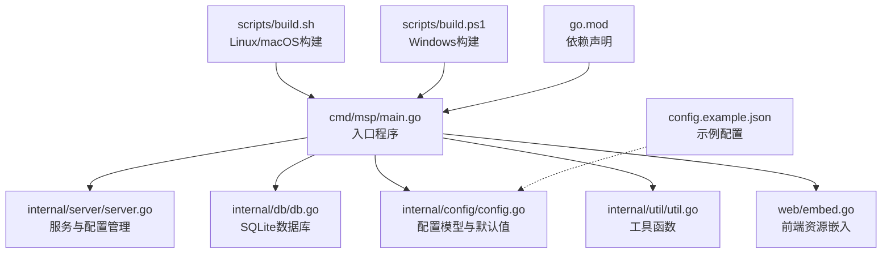
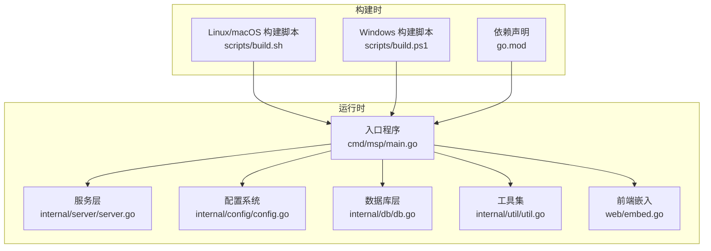
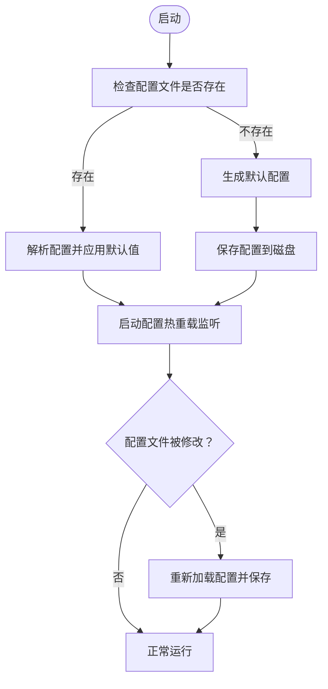
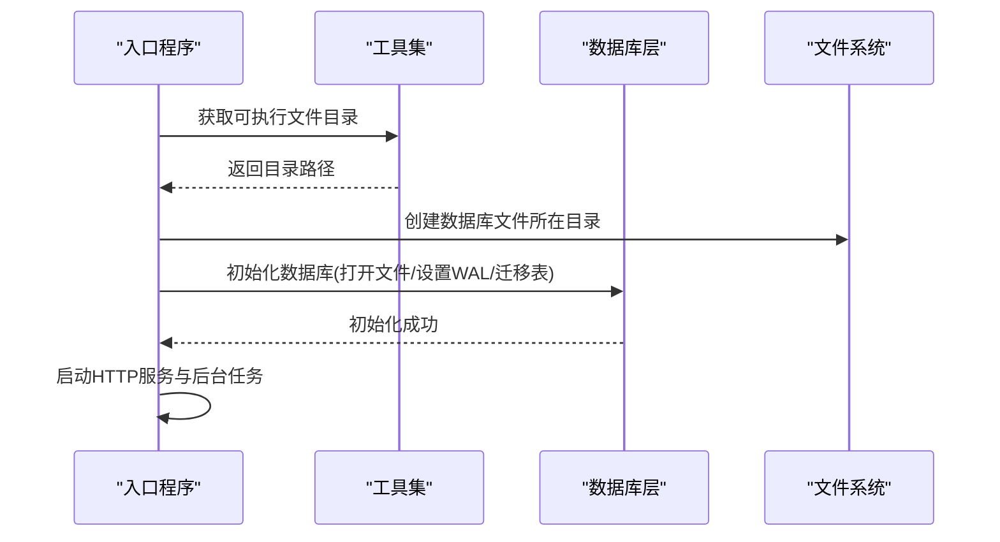
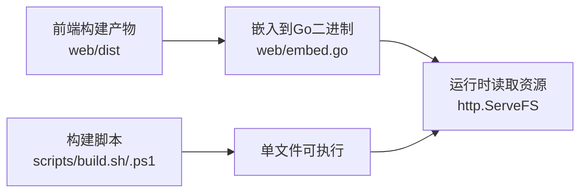
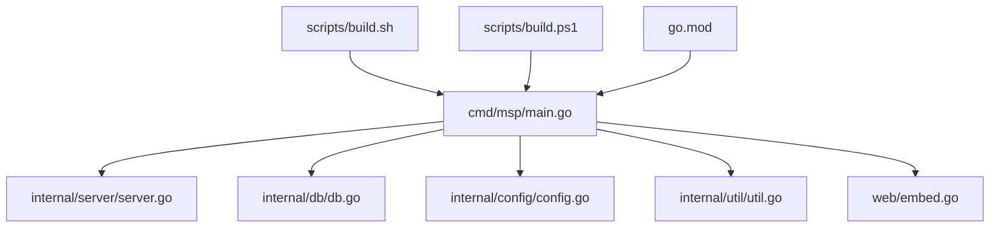

# 零配置部署

<cite>
**本文引用的文件**
- [cmd/msp/main.go](file://cmd/msp/main.go)
- [internal/db/db.go](file://internal/db/db.go)
- [internal/config/config.go](file://internal/config/config.go)
- [internal/constants/constants.go](file://internal/constants/constants.go)
- [internal/server/server.go](file://internal/server/server.go)
- [internal/util/util.go](file://internal/util/util.go)
- [web/embed.go](file://web/embed.go)
- [scripts/build.sh](file://scripts/build.sh)
- [scripts/build.ps1](file://scripts/build.ps1)
- [config.example.json](file://config.example.json)
- [go.mod](file://go.mod)
- [README.md](file://README.md)
</cite>

## 目录
1. [简介](#简介)
2. [项目结构](#项目结构)
3. [核心组件](#核心组件)
4. [架构总览](#架构总览)
5. [组件详解](#组件详解)
6. [依赖关系分析](#依赖关系分析)
7. [性能考量](#性能考量)
8. [故障排查指南](#故障排查指南)
9. [结论](#结论)
10. [附录](#附录)

## 简介
本文件聚焦于MSP项目的“零配置部署”能力，围绕以下目标展开：
- 内置SQLite数据库的设计理念与实现：单文件数据库的优势、自动初始化机制、数据持久化策略。
- 单文件可执行程序的打包技术：静态链接、资源嵌入、跨平台兼容性。
- 无外部依赖的架构优势：简化部署流程、减少故障点、降低维护成本。
- 配置文件的自动生成机制与默认值策略。
- 具体部署示例与最佳实践：文件权限、启动参数、环境变量使用。

## 项目结构
MSP采用“入口程序 + 内部模块 + 构建脚本”的组织方式，入口程序负责加载配置、初始化数据库、启动HTTP服务；内部模块封装配置、数据库、服务、工具等；构建脚本负责跨平台静态编译与产物校验。

图表来源
- [cmd/msp/main.go](file://cmd/msp/main.go#L26-L83)
- [internal/server/server.go](file://internal/server/server.go#L65-L74)
- [internal/db/db.go](file://internal/db/db.go#L32-L72)
- [internal/config/config.go](file://internal/config/config.go#L77-L146)
- [internal/util/util.go](file://internal/util/util.go#L116-L123)
- [web/embed.go](file://web/embed.go#L1-L7)
- [scripts/build.sh](file://scripts/build.sh#L47-L66)
- [scripts/build.ps1](file://scripts/build.ps1#L89-L105)
- [go.mod](file://go.mod#L5-L9)
- [config.example.json](file://config.example.json#L1-L56)

章节来源
- [cmd/msp/main.go](file://cmd/msp/main.go#L26-L83)
- [internal/server/server.go](file://internal/server/server.go#L65-L74)
- [internal/db/db.go](file://internal/db/db.go#L32-L72)
- [internal/config/config.go](file://internal/config/config.go#L77-L146)
- [internal/util/util.go](file://internal/util/util.go#L116-L123)
- [web/embed.go](file://web/embed.go#L1-L7)
- [scripts/build.sh](file://scripts/build.sh#L47-L66)
- [scripts/build.ps1](file://scripts/build.ps1#L89-L105)
- [go.mod](file://go.mod#L5-L9)
- [config.example.json](file://config.example.json#L1-L56)

## 核心组件
- 零配置启动：入口程序在可执行文件同目录下查找并加载/生成配置文件，随后初始化日志、数据库、媒体缓存与HTTP服务。
- 内置SQLite：使用单文件数据库，自动迁移表结构，支持WAL模式与缓存优化，确保高并发下的稳定性。
- 前端资源嵌入：将构建后的前端静态资源打包进二进制，运行时直接从内存读取，无需额外文件。
- 跨平台打包：通过构建脚本在不同操作系统与架构上进行静态编译，输出独立可执行文件并生成校验文件。

章节来源
- [cmd/msp/main.go](file://cmd/msp/main.go#L26-L83)
- [internal/db/db.go](file://internal/db/db.go#L32-L72)
- [web/embed.go](file://web/embed.go#L1-L7)
- [scripts/build.sh](file://scripts/build.sh#L47-L66)
- [scripts/build.ps1](file://scripts/build.ps1#L89-L105)

## 架构总览
MSP的零配置部署由“入口程序 + 配置系统 + 数据库层 + 服务层 + 前端嵌入 + 构建脚本”构成，形成闭环：入口程序启动后自动完成配置与数据库初始化，服务层提供HTTP接口与缓存，前端资源随二进制发布，构建脚本保证跨平台一致性。

图表来源
- [cmd/msp/main.go](file://cmd/msp/main.go#L26-L83)
- [internal/server/server.go](file://internal/server/server.go#L65-L74)
- [internal/config/config.go](file://internal/config/config.go#L77-L146)
- [internal/db/db.go](file://internal/db/db.go#L32-L72)
- [internal/util/util.go](file://internal/util/util.go#L116-L123)
- [web/embed.go](file://web/embed.go#L1-L7)
- [scripts/build.sh](file://scripts/build.sh#L47-L66)
- [scripts/build.ps1](file://scripts/build.ps1#L89-L105)
- [go.mod](file://go.mod#L5-L9)

## 组件详解

### 配置系统与自动生成机制
- 自动加载与生成：入口程序在可执行文件目录查找配置文件，若不存在则生成默认配置并保存；若存在则解析并应用默认值策略。
- 默认值策略：配置结构体包含多级默认值函数，未设置的字段会被填充为合理默认值，确保首次运行即可工作。
- 热重载：服务层后台监控配置文件变更，检测到修改后自动重新加载并更新运行时配置。
- 示例配置：仓库提供示例配置文件，展示各字段含义与默认行为。

图表来源
- [cmd/msp/main.go](file://cmd/msp/main.go#L30-L48)
- [internal/server/server.go](file://internal/server/server.go#L76-L112)
- [internal/server/server.go](file://internal/server/server.go#L140-L188)
- [internal/config/config.go](file://internal/config/config.go#L94-L146)

章节来源
- [cmd/msp/main.go](file://cmd/msp/main.go#L30-L48)
- [internal/server/server.go](file://internal/server/server.go#L76-L112)
- [internal/server/server.go](file://internal/server/server.go#L140-L188)
- [internal/config/config.go](file://internal/config/config.go#L94-L146)
- [config.example.json](file://config.example.json#L1-L56)

### 内置SQLite数据库设计与实现
- 单文件数据库：数据库文件位于可执行文件同目录，便于携带与部署；初始化时自动创建目录与数据库文件。
- 自动迁移：启动时执行表结构迁移，确保数据库schema与代码一致。
- 性能优化：启用WAL模式、调整同步级别与缓存大小，限制连接池为单连接以减少锁竞争。
- 数据持久化：播放进度、用户偏好、扫描元信息等均持久化至SQLite，支持断电恢复与跨设备续播。

图表来源
- [cmd/msp/main.go](file://cmd/msp/main.go#L40-L45)
- [internal/db/db.go](file://internal/db/db.go#L32-L72)
- [internal/util/util.go](file://internal/util/util.go#L116-L123)

章节来源
- [cmd/msp/main.go](file://cmd/msp/main.go#L40-L45)
- [internal/db/db.go](file://internal/db/db.go#L32-L72)
- [internal/util/util.go](file://internal/util/util.go#L116-L123)

### 前端资源嵌入与单文件可执行
- 资源嵌入：前端构建产物打包进Go二进制，运行时通过嵌入文件系统提供静态资源。
- 可执行文件：构建脚本在不同平台输出独立可执行文件，无需额外依赖。
- 跨平台：脚本支持Linux、macOS、Windows及多种架构，统一使用静态编译与strip优化。

图表来源
- [web/embed.go](file://web/embed.go#L1-L7)
- [scripts/build.sh](file://scripts/build.sh#L47-L66)
- [scripts/build.ps1](file://scripts/build.ps1#L89-L105)

章节来源
- [web/embed.go](file://web/embed.go#L1-L7)
- [scripts/build.sh](file://scripts/build.sh#L47-L66)
- [scripts/build.ps1](file://scripts/build.ps1#L89-L105)

### 部署与运行最佳实践
- 部署位置：将可执行文件放置在任意可执行目录，其同目录将作为配置与数据存储根目录。
- 权限设置：日志与数据库文件使用受控权限，建议在生产环境中确保目录与文件权限最小化。
- 环境变量：支持通过环境变量控制自动打开浏览器的行为；其他运行时参数可通过配置文件与命令行传入。
- 启动流程：入口程序自动完成配置加载/生成、数据库初始化、日志设置、媒体缓存预热与HTTP服务启动。

章节来源
- [cmd/msp/main.go](file://cmd/msp/main.go#L26-L83)
- [internal/server/server.go](file://internal/server/server.go#L190-L220)
- [internal/constants/constants.go](file://internal/constants/constants.go#L17-L23)

## 依赖关系分析
- 语言与框架：Go 1.25+，GORM用于ORM，sqlite驱动用于SQLite访问。
- 构建工具：Node.js用于前端构建，Go构建系统用于静态编译。
- 依赖注入：入口程序通过导入内部模块实现功能组合，模块间职责清晰。

图表来源
- [cmd/msp/main.go](file://cmd/msp/main.go#L18-L24)
- [internal/server/server.go](file://internal/server/server.go#L31-L56)
- [internal/db/db.go](file://internal/db/db.go#L3-L16)
- [internal/config/config.go](file://internal/config/config.go#L1-L4)
- [internal/util/util.go](file://internal/util/util.go#L1-L16)
- [web/embed.go](file://web/embed.go#L1-L7)
- [scripts/build.sh](file://scripts/build.sh#L47-L66)
- [scripts/build.ps1](file://scripts/build.ps1#L89-L105)
- [go.mod](file://go.mod#L5-L9)

章节来源
- [cmd/msp/main.go](file://cmd/msp/main.go#L18-L24)
- [go.mod](file://go.mod#L5-L9)

## 性能考量
- 数据库连接池：限制为单连接，配合WAL模式与缓存参数，减少锁竞争，提升并发写入稳定性。
- 日志轮转：按大小轮转，避免日志文件过大影响性能与磁盘空间。
- 媒体缓存：内存缓存+磁盘缓存（无数据库时），弱ETag用于条件请求，减少重复传输。
- 构建优化：静态编译、strip调试符号、最小化依赖，减小二进制体积与启动开销。

章节来源
- [internal/db/db.go](file://internal/db/db.go#L54-L72)
- [internal/server/server.go](file://internal/server/server.go#L250-L284)
- [internal/server/server.go](file://internal/server/server.go#L332-L437)
- [scripts/build.sh](file://scripts/build.sh#L63-L63)
- [scripts/build.ps1](file://scripts/build.ps1#L98-L98)

## 故障排查指南
- 配置文件问题：若配置损坏或缺失，入口程序会自动生成默认配置；也可参考示例配置文件核对字段。
- 数据库初始化失败：检查可执行文件目录权限与磁盘空间；确认WAL模式与缓存参数设置是否生效。
- 日志定位：根据配置设置的日志文件路径查看日志；注意日志轮转触发条件。
- 热重载无效：确认配置文件路径正确且可写；检查后台监听线程是否正常运行。
- 跨平台兼容：确保使用对应平台的可执行文件；如需特定架构，请选择相应版本。

章节来源
- [cmd/msp/main.go](file://cmd/msp/main.go#L34-L44)
- [internal/server/server.go](file://internal/server/server.go#L76-L112)
- [internal/server/server.go](file://internal/server/server.go#L140-L188)
- [internal/server/server.go](file://internal/server/server.go#L190-L220)
- [config.example.json](file://config.example.json#L1-L56)

## 结论
MSP通过“零配置启动 + 内置SQLite + 前端嵌入 + 跨平台静态编译”的组合，实现了真正的“零配置部署”。该方案显著降低了部署复杂度、减少了外部依赖带来的故障点，并提升了跨平台一致性与可维护性。结合默认值策略、热重载与完善的日志机制，用户可在最短时间内完成部署并稳定运行。

## 附录

### 部署示例与操作步骤
- 下载对应平台与架构的可执行文件。
- 将文件放置在目标目录，确保具备执行权限。
- 首次运行时，程序会在同目录生成配置文件与数据库文件。
- 打开浏览器访问控制台打印的URL，添加共享目录并开始使用。

章节来源
- [README.md](file://README.md#L61-L71)
- [cmd/msp/main.go](file://cmd/msp/main.go#L30-L48)

### 环境变量与启动参数
- 环境变量：支持通过环境变量控制自动打开浏览器的行为。
- 启动参数：可通过命令行传入运行时参数（如端口、日志级别等），具体请参考配置文件与服务层实现。

章节来源
- [cmd/msp/main.go](file://cmd/msp/main.go#L76-L78)
- [internal/server/server.go](file://internal/server/server.go#L313-L320)

### 配置文件默认值策略
- 默认端口、默认PIN、默认UI与播放行为等均在配置模型中定义。
- 应用默认值时，未设置的字段会被填充为合理默认值，确保系统可用。

章节来源
- [internal/config/config.go](file://internal/config/config.go#L94-L146)
- [internal/constants/constants.go](file://internal/constants/constants.go#L8-L14)