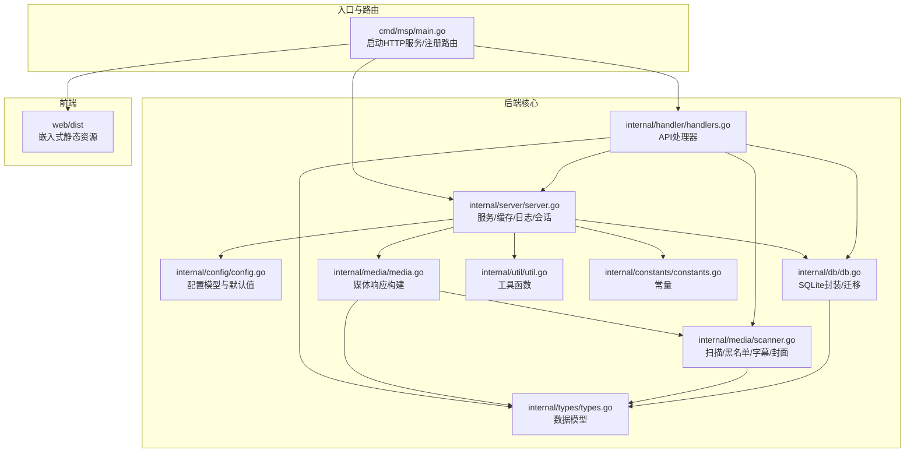
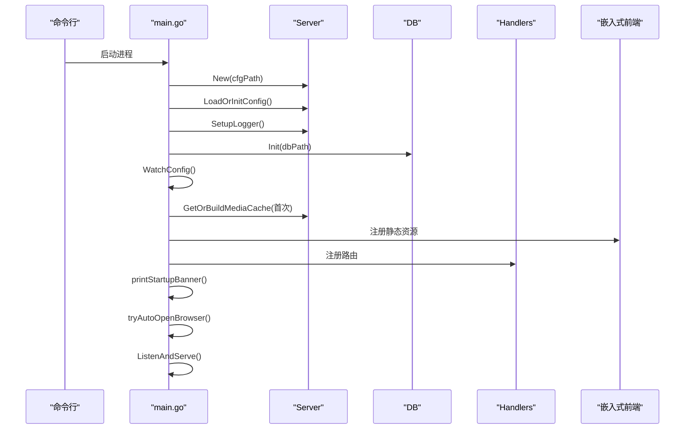
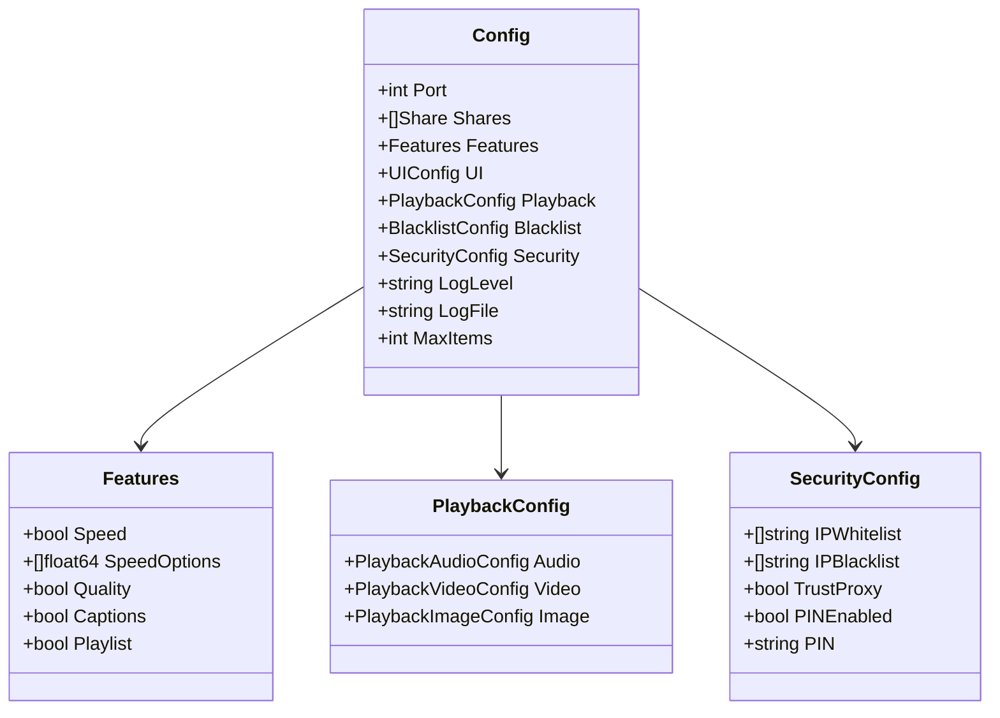
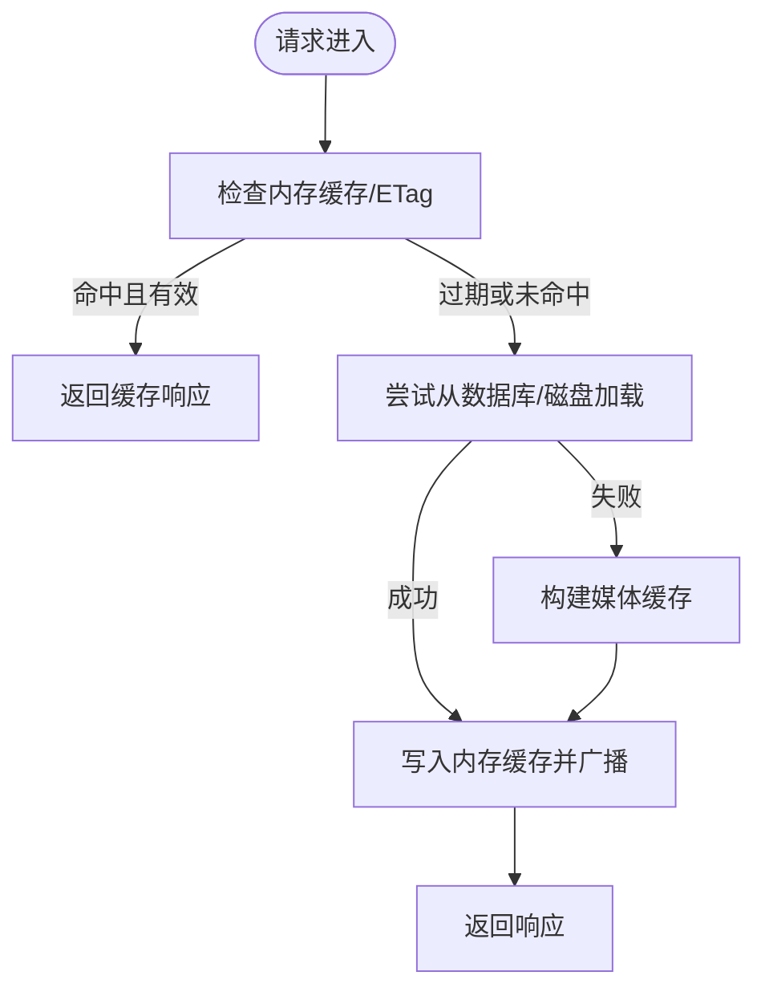
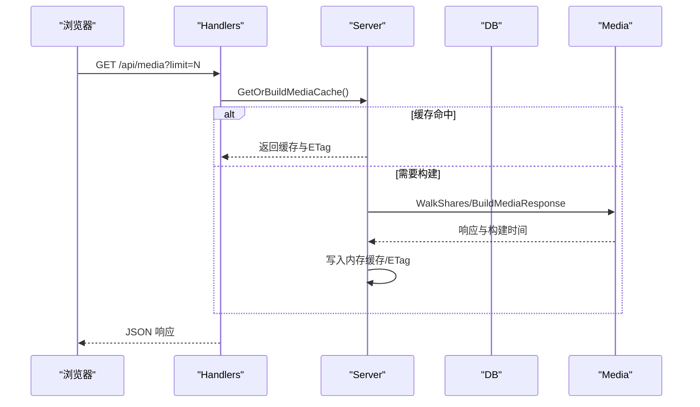
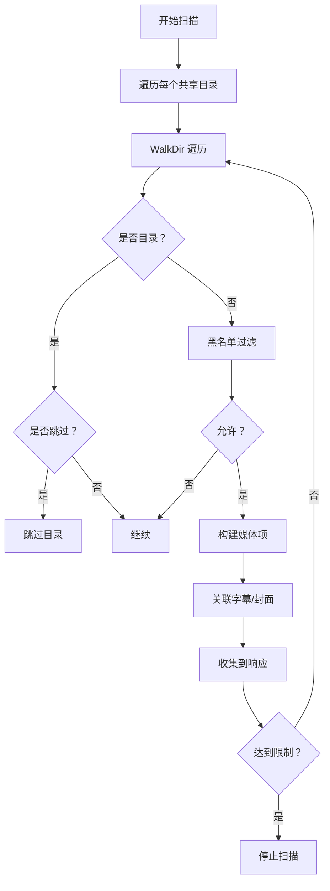
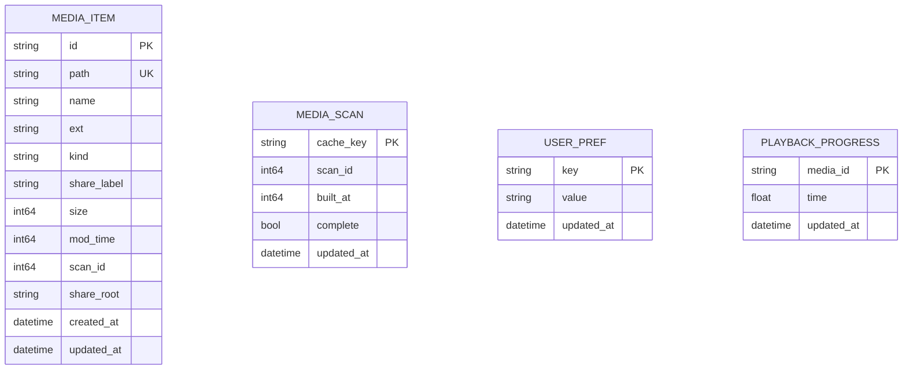
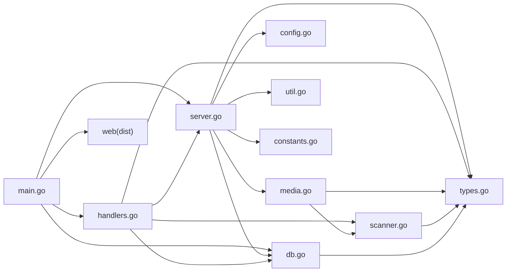

# 项目介绍

<cite>
**本文引用的文件**
- [README.md](file://README.md)
- [cmd/msp/main.go](file://cmd/msp/main.go)
- [internal/config/config.go](file://internal/config/config.go)
- [internal/server/server.go](file://internal/server/server.go)
- [internal/handler/handlers.go](file://internal/handler/handlers.go)
- [internal/media/media.go](file://internal/media/media.go)
- [internal/media/scanner.go](file://internal/media/scanner.go)
- [internal/db/db.go](file://internal/db/db.go)
- [internal/constants/constants.go](file://internal/constants/constants.go)
- [internal/types/types.go](file://internal/types/types.go)
- [internal/util/util.go](file://internal/util/util.go)
- [CHANGELOG.md](file://CHANGELOG.md)
</cite>

## 目录
1. [简介](#简介)
2. [项目结构](#项目结构)
3. [核心组件](#核心组件)
4. [架构总览](#架构总览)
5. [详细组件分析](#详细组件分析)
6. [依赖关系分析](#依赖关系分析)
7. [性能考量](#性能考量)
8. [故障排查指南](#故障排查指南)
9. [结论](#结论)
10. [附录](#附录)

## 简介
MSP 是一款面向家庭局域网的轻量级媒体服务器，专注于“零配置部署、智能播放、断点续播、跨平台支持、浏览器客户端”。它通过单二进制可执行文件运行，无需外部数据库或复杂部署，即可在局域网内共享本地媒体资源，并通过现代浏览器进行播放。其设计坚持“本地优先”，不依赖云端账户与追踪，适合追求隐私与易用性的个人用户与家庭用户。

- 零配置部署：内置默认配置，首次运行自动初始化，无需繁琐设置。
- 智能播放：优先直连播放，针对高风险容器与编码自动回退转码，兼顾兼容性与性能。
- 断点续播：基于本地数据库持久化播放进度，跨设备无缝续播。
- 跨平台服务端：Windows/Linux/macOS 均可运行。
- 浏览器客户端：桌面与移动端现代浏览器均可使用。
- 本地优先：无云账户、无追踪，数据仅驻留本地。

**章节来源**
- [README.md](file://README.md#L21-L31)

## 项目结构
MSP 采用前后端一体化的单二进制架构：后端使用 Go 实现 HTTP 服务、媒体扫描与数据库；前端使用嵌入式静态资源，通过 Gin 路由提供 API 与静态页面。核心目录与职责如下：
- cmd/msp：入口程序，负责加载配置、初始化数据库、注册路由、启动 HTTP 服务器。
- internal/*：核心业务层
  - config：配置模型与默认值应用
  - server：HTTP 服务、配置热重载、媒体缓存、日志与会话管理
  - handler：HTTP 请求处理器，提供配置、媒体、流媒体、字幕、进度、日志、PIN 等 API
  - media：媒体扫描、索引、转码、字幕与封面发现、容器与编解码探测
  - db：SQLite 数据库封装与迁移，播放进度、用户偏好、扫描元数据
  - types：数据模型（媒体项、扫描元数据、播放进度、响应结构等）
  - util：工具函数（路径规范化、ID 编解码、IP 判断、大小解析等）
  - constants：常量集中管理
- web：前端静态资源与构建产物，通过嵌入式文件系统提供
- docs：文档与发布说明
- scripts：构建与开发脚本

**图表来源**
- [cmd/msp/main.go](file://cmd/msp/main.go#L26-L83)
- [internal/server/server.go](file://internal/server/server.go#L65-L74)
- [internal/handler/handlers.go](file://internal/handler/handlers.go#L38-L107)
- [internal/media/media.go](file://internal/media/media.go#L12-L52)
- [internal/media/scanner.go](file://internal/media/scanner.go#L25-L57)
- [internal/db/db.go](file://internal/db/db.go#L32-L72)
- [internal/types/types.go](file://internal/types/types.go#L16-L66)
- [internal/util/util.go](file://internal/util/util.go#L18-L50)
- [internal/constants/constants.go](file://internal/constants/constants.go#L7-L50)

**章节来源**
- [cmd/msp/main.go](file://cmd/msp/main.go#L26-L83)
- [README.md](file://README.md#L1-L106)

## 核心组件
- 配置系统：集中定义端口、共享目录、功能开关、UI 默认项、播放策略、黑名单、安全策略与日志级别等，并提供默认值应用与热重载。
- 服务层：负责配置读写、媒体缓存（内存+磁盘/数据库）、日志轮转、会话管理（PIN）、请求日志与统计。
- 处理器层：提供配置、共享目录、媒体列表、流媒体、字幕、探测、IP、偏好、进度、日志、PIN 等 API。
- 媒体层：扫描共享目录，构建媒体响应，支持黑名单过滤、字幕与封面发现、容器与编解码探测、可选转码。
- 数据层：SQLite 存储媒体项、扫描元数据、用户偏好与播放进度，支持 WAL、缓存与并发优化。
- 工具与常量：路径规范化、ID 编解码、IP 判断、大小解析、日志轮转阈值、缓存 TTL、端口与权限等。

**章节来源**
- [internal/config/config.go](file://internal/config/config.go#L77-L146)
- [internal/server/server.go](file://internal/server/server.go#L31-L74)
- [internal/handler/handlers.go](file://internal/handler/handlers.go#L28-L43)
- [internal/media/media.go](file://internal/media/media.go#L12-L52)
- [internal/media/scanner.go](file://internal/media/scanner.go#L25-L57)
- [internal/db/db.go](file://internal/db/db.go#L32-L72)
- [internal/constants/constants.go](file://internal/constants/constants.go#L7-L50)

## 架构总览
MSP 的运行时架构围绕“单二进制 + 内嵌前端 + 本地 SQLite”的设计展开。启动流程如下：
- 加载配置（默认值应用与热重载）
- 初始化数据库（迁移表结构）
- 注册路由（API + 嵌入式前端）
- 启动 HTTP 服务器（Gin）
- 首次后台触发媒体缓存构建
- 自动打开浏览器（可禁用）

**图表来源**
- [cmd/msp/main.go](file://cmd/msp/main.go#L26-L83)
- [internal/server/server.go](file://internal/server/server.go#L76-L112)
- [internal/db/db.go](file://internal/db/db.go#L32-L72)

**章节来源**
- [cmd/msp/main.go](file://cmd/msp/main.go#L26-L83)

## 详细组件分析

### 配置系统（Config）
- 结构化配置：包含端口、共享目录、功能开关（速度/画质/字幕/播放列表）、UI 默认项、播放策略（音视频开关、范围、转码、续播）、黑名单（扩展名/文件名/目录/大小规则）、安全策略（IP 白/黑名单、PIN）与日志级别/文件。
- 默认值应用：当配置缺失或为空时，自动填充默认值，保证最小可用配置。
- 热重载：监控配置文件修改，自动重新加载并保存必要的默认值。

**图表来源**
- [internal/config/config.go](file://internal/config/config.go#L5-L88)

**章节来源**
- [internal/config/config.go](file://internal/config/config.go#L77-L146)
- [internal/config/config.go](file://internal/config/config.go#L148-L286)

### 服务层（Server）
- 配置管理：读取/保存配置，热重载检测，日志初始化与轮转。
- 媒体缓存：内存缓存 + 磁盘缓存（无数据库时）+ 数据库存储（有数据库时），弱 ETag 标识，TTL 控制，重建与广播通知。
- 会话管理：PIN 登录创建会话令牌，设置非 Secure Cookie，定期清理过期会话。
- 请求日志：记录方法、路径、状态码、UA、耗时，识别新设备 IP 并记录。

**图表来源**
- [internal/server/server.go](file://internal/server/server.go#L332-L396)
- [internal/server/server.go](file://internal/server/server.go#L400-L437)

**章节来源**
- [internal/server/server.go](file://internal/server/server.go#L31-L74)
- [internal/server/server.go](file://internal/server/server.go#L140-L188)
- [internal/server/server.go](file://internal/server/server.go#L332-L437)
- [internal/server/server.go](file://internal/server/server.go#L570-L626)

### 处理器层（Handlers）
- 配置：GET 返回视图，POST 更新配置并返回最新配置。
- 共享目录：POST 添加/删除共享目录，更新后失效媒体缓存。
- 媒体：GET 返回媒体列表，支持 limit 截断与 ETag 条件请求。
- 流媒体：GET 直连或转码播放，按策略决定是否转码，支持断点续播。
- 字幕：GET 返回 VTT/SRT/ASS/SSA，SRT/ASS 自动转换为 VTT。
- 探测：GET 返回容器与编解码信息及可用字幕。
- IP：GET 返回局域网 IPv4 列表。
- 偏好：GET/POST 用户偏好设置。
- 进度：GET/POST 播放进度。
- 日志：POST 远程记录日志。
- PIN：POST 验证 PIN，成功后下发会话 Cookie。

**图表来源**
- [internal/handler/handlers.go](file://internal/handler/handlers.go#L333-L362)
- [internal/server/server.go](file://internal/server/server.go#L332-L396)

**章节来源**
- [internal/handler/handlers.go](file://internal/handler/handlers.go#L45-L94)
- [internal/handler/handlers.go](file://internal/handler/handlers.go#L333-L362)
- [internal/handler/handlers.go](file://internal/handler/handlers.go#L413-L446)
- [internal/handler/handlers.go](file://internal/handler/handlers.go#L623-L646)
- [internal/handler/handlers.go](file://internal/handler/handlers.go#L581-L621)
- [internal/handler/handlers.go](file://internal/handler/handlers.go#L151-L159)
- [internal/handler/handlers.go](file://internal/handler/handlers.go#L161-L190)
- [internal/handler/handlers.go](file://internal/handler/handlers.go#L192-L233)
- [internal/handler/handlers.go](file://internal/handler/handlers.go#L235-L253)
- [internal/handler/handlers.go](file://internal/handler/handlers.go#L255-L319)

### 媒体层（Scanner/Media）
- 扫描：遍历共享目录，尊重黑名单（扩展名/文件名/目录/大小规则），限制扫描数量，缓存目录条目，构建媒体项并关联字幕/封面。
- 分类与探测：按扩展名分类（视频/音频/图片/其他），探测容器与编解码，支持 MKV/MP4/MOV。
- 字幕与封面：按命名约定匹配字幕与封面，支持 SRT/ASS/SSA 转 VTT，封面候选集。
- 响应构建：按标签与名称排序，聚合视频/音频/图片/Others。

**图表来源**
- [internal/media/scanner.go](file://internal/media/scanner.go#L25-L57)
- [internal/media/scanner.go](file://internal/media/scanner.go#L68-L106)
- [internal/media/scanner.go](file://internal/media/scanner.go#L108-L146)
- [internal/media/media.go](file://internal/media/media.go#L12-L52)

**章节来源**
- [internal/media/scanner.go](file://internal/media/scanner.go#L25-L57)
- [internal/media/scanner.go](file://internal/media/scanner.go#L108-L146)
- [internal/media/scanner.go](file://internal/media/scanner.go#L233-L246)
- [internal/media/scanner.go](file://internal/media/scanner.go#L259-L285)
- [internal/media/scanner.go](file://internal/media/scanner.go#L490-L509)
- [internal/media/media.go](file://internal/media/media.go#L12-L52)

### 数据层（DB）
- 初始化：确保目录存在，打开 SQLite，设置连接池与 WAL/synchronous/cache，自动迁移表。
- 播放进度：按媒体 ID 读取/写入，ON CONFLICT UPDATE，避免膨胀。
- 用户偏好：键值对存储，批量写入。
- 扫描元数据：按 cacheKey 记录扫描会话与构建时间，支持增量更新。

**图表来源**
- [internal/types/types.go](file://internal/types/types.go#L16-L52)
- [internal/db/db.go](file://internal/db/db.go#L32-L72)
- [internal/db/db.go](file://internal/db/db.go#L74-L99)
- [internal/db/db.go](file://internal/db/db.go#L117-L142)

**章节来源**
- [internal/db/db.go](file://internal/db/db.go#L32-L72)
- [internal/db/db.go](file://internal/db/db.go#L74-L99)
- [internal/db/db.go](file://internal/db/db.go#L117-L142)
- [internal/types/types.go](file://internal/types/types.go#L16-L52)

### 工具与常量（Util/Constants）
- ID 编解码：Base64 URL 安全编码，避免路径泄露。
- 路径与安全：规范化路径、解析符号链接、防止目录遍历。
- IP 判断：识别私有网络 IPv4，支持多网卡与去重。
- 大小解析：支持 KB/MB/GB/TB。
- 常量：端口、权限、日志轮转阈值、缓存 TTL、扫描限制、字节单位、HTTP 状态码、本地回环地址等。

**章节来源**
- [internal/util/util.go](file://internal/util/util.go#L18-L50)
- [internal/util/util.go](file://internal/util/util.go#L148-L182)
- [internal/util/util.go](file://internal/util/util.go#L218-L256)
- [internal/util/util.go](file://internal/util/util.go#L52-L78)
- [internal/constants/constants.go](file://internal/constants/constants.go#L7-L50)

## 依赖关系分析
- 入口依赖：main 依赖 server、db、handler、webassets。
- 服务依赖：server 依赖 config、db、media、types、util、constants。
- 处理器依赖：handler 依赖 server、db、media、service、types、util。
- 媒体依赖：media 依赖 config、types、util。
- 数据依赖：db 依赖 types、constants。
- 工具与常量：被广泛使用于各层。

**图表来源**
- [cmd/msp/main.go](file://cmd/msp/main.go#L18-L24)
- [internal/server/server.go](file://internal/server/server.go#L23-L29)
- [internal/handler/handlers.go](file://internal/handler/handlers.go#L18-L26)
- [internal/media/media.go](file://internal/media/media.go#L3-L10)
- [internal/media/scanner.go](file://internal/media/scanner.go#L3-L19)
- [internal/db/db.go](file://internal/db/db.go#L3-L16)
- [internal/types/types.go](file://internal/types/types.go#L3-L6)

**章节来源**
- [cmd/msp/main.go](file://cmd/msp/main.go#L18-L24)
- [internal/server/server.go](file://internal/server/server.go#L23-L29)
- [internal/handler/handlers.go](file://internal/handler/handlers.go#L18-L26)

## 性能考量
- 媒体缓存：内存缓存 + 弱 ETag + TTL，避免重复扫描；数据库/磁盘缓存作为后备；重建过程异步进行，不阻塞请求。
- 数据库优化：SQLite 使用 WAL、synchronous=NORMAL、cache_size=-2000，单连接写入，ON CONFLICT UPDATE 降低写放大。
- 扫描限制：默认扫描上限，避免大规模目录导致的内存与 I/O 压力。
- 转码策略：直连优先，失败回退转码，避免不必要的转码；转码并发限制，防止 CPU 耗尽。
- 日志轮转：按大小阈值轮转，减少磁盘占用与 Stat 开销。
- 前端静态资源：嵌入式资源，减少网络往返。

[本节为通用性能建议，不直接分析具体文件]

## 故障排查指南
- 无法访问：确认端口未被占用，查看启动日志打印的访问 URL；检查防火墙与路由器设置。
- 配置不生效：确认配置文件路径与权限，检查是否被热重载覆盖；查看日志中“Config reloaded successfully”提示。
- 媒体未显示：检查共享目录是否存在且可访问；确认黑名单规则未误删；尝试刷新媒体缓存。
- 播放失败：确认浏览器支持的容器/编解码；若需转码，确认已启用并安装 FFmpeg；查看转码回退日志。
- 进度不同步：确认数据库正常；检查播放进度写入是否成功；重启服务后重试。
- 安全问题：启用 PIN 或 IP 黑/白名单；避免在公网暴露服务；定期更新版本。

**章节来源**
- [internal/server/server.go](file://internal/server/server.go#L140-L188)
- [internal/handler/handlers.go](file://internal/handler/handlers.go#L413-L446)
- [internal/db/db.go](file://internal/db/db.go#L74-L99)
- [CHANGELOG.md](file://CHANGELOG.md#L3-L16)

## 结论
MSP 以“零配置、智能播放、断点续播、跨平台、本地优先”为核心价值主张，通过单二进制部署、嵌入式前端与本地 SQLite，实现了家庭局域网媒体服务器的易用与稳定。其设计强调安全性（PIN/IP 黑/白名单）、兼容性（直连优先+转码回退）、可维护性（模块化与常量集中管理）。对于希望在家中轻松分享与播放媒体资源的用户而言，MSP 提供了开箱即用的解决方案。

[本节为总结性内容，不直接分析具体文件]

## 附录
- 快速开始：下载可执行文件，双击运行，打开控制台打印的 URL，首次运行添加共享目录。
- 功能特性清单（摘要）：
  - 零配置部署
  - 智能播放（直连优先，失败回退转码）
  - 断点续播（播放进度持久化）
  - 跨平台服务端（Windows/Linux/macOS）
  - 浏览器客户端（桌面/移动）
  - 本地优先（无云账户、无追踪）
  - 安全策略（IP 黑/白名单、PIN 认证）
  - 媒体扫描与索引（黑名单、字幕/封面发现）
  - API 与嵌入式前端

**章节来源**
- [README.md](file://README.md#L59-L81)
- [README.md](file://README.md#L24-L31)