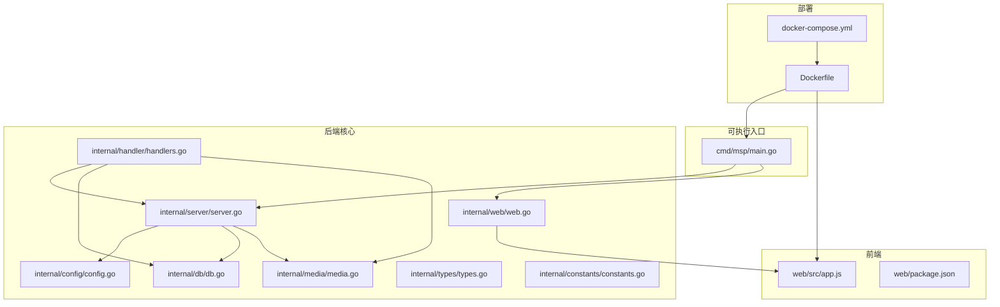
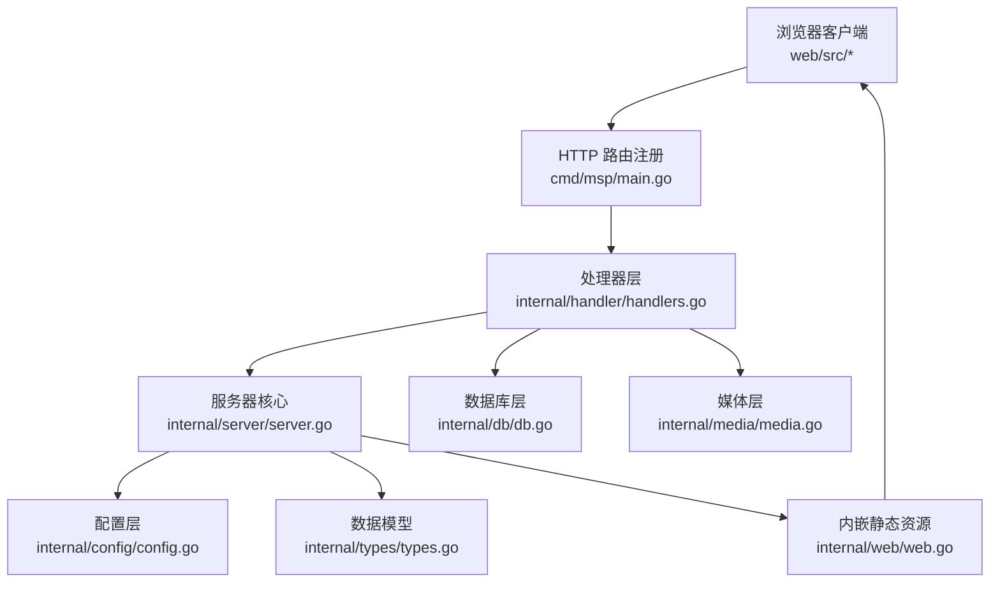
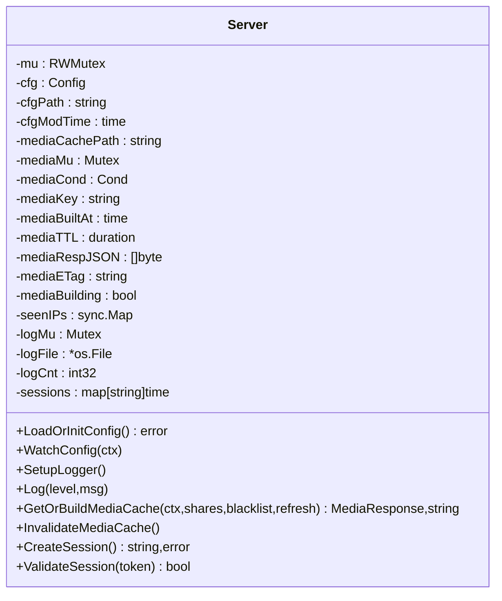
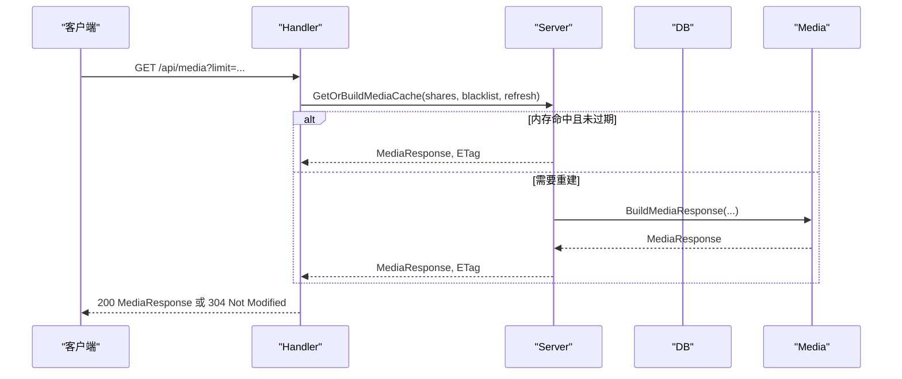
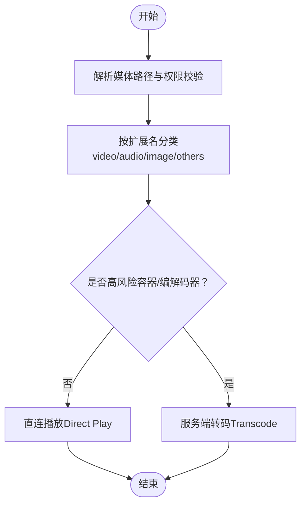
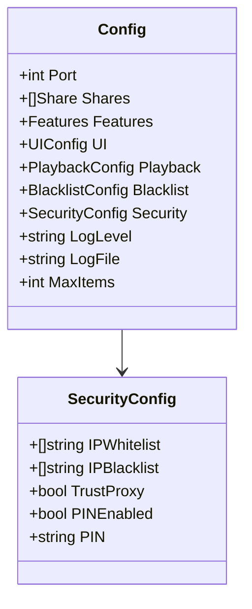
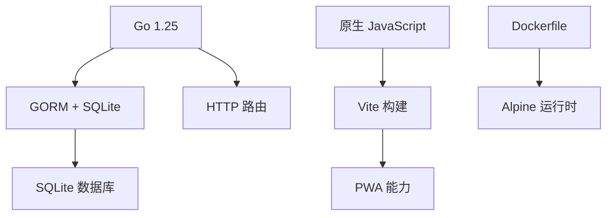

# 项目概述

<cite>
**本文档引用的文件**
- [README.md](file://README.md)
- [cmd/msp/main.go](file://cmd/msp/main.go)
- [internal/config/config.go](file://internal/config/config.go)
- [internal/db/db.go](file://internal/db/db.go)
- [internal/media/media.go](file://internal/media/media.go)
- [internal/web/web.go](file://internal/web/web.go)
- [internal/server/server.go](file://internal/server/server.go)
- [internal/handler/handlers.go](file://internal/handler/handlers.go)
- [internal/types/types.go](file://internal/types/types.go)
- [internal/constants/constants.go](file://internal/constants/constants.go)
- [go.mod](file://go.mod)
- [Dockerfile](file://Dockerfile)
- [docker-compose.yml](file://docker-compose.yml)
- [web/src/app.js](file://web/src/app.js)
- [web/package.json](file://web/package.json)
- [CHANGELOG.md](file://CHANGELOG.md)
- [LICENSE](file://LICENSE)
</cite>

## 目录
1. [简介](#简介)
2. [项目结构](#项目结构)
3. [核心组件](#核心组件)
4. [架构总览](#架构总览)
5. [详细组件分析](#详细组件分析)
6. [依赖关系分析](#依赖关系分析)
7. [性能考量](#性能考量)
8. [故障排查指南](#故障排查指南)
9. [结论](#结论)
10. [附录](#附录)

## 简介
MSP 是一款面向家庭局域网的轻量级媒体流式传输服务器，定位为“个人局域网影院”。其核心目标是让用户在本地网络内零配置地运行一个单二进制文件的媒体服务器，即可通过任意现代浏览器浏览并播放本地共享文件夹中的音视频内容。

项目的主要特性包括：
- 零配置部署：无需外部数据库或复杂环境，开箱即用
- 智能播放：优先直连播放，仅在必要时进行服务端转码
- 断点续播：基于 SQLite 的播放进度持久化，跨设备可用
- 跨平台支持：同时提供 Windows、Linux、macOS 的原生可执行文件
- 浏览器客户端：桌面与移动浏览器均可使用
- 本地优先：完全离线，无云端账户与追踪

此外，项目提供 Docker 容器化部署方案，并内置安全机制（IP 白/黑名单、PIN 认证）与日志轮转等运维能力。

**章节来源**
- [README.md](file://README.md#L21-L31)

## 项目结构
项目采用前后端分离的组织方式：
- 后端（Go）：位于 internal 子包，包含配置、数据库、媒体扫描与转码、HTTP 处理器、Web 资源嵌入等模块
- 前端（原生 JavaScript + Vite + PWA）：位于 web 子目录，构建产物嵌入到后端二进制中
- 可执行入口：cmd/msp/main.go
- 容器化：Dockerfile 与 docker-compose.yml



**图示来源**
- [cmd/msp/main.go](file://cmd/msp/main.go#L26-L83)
- [internal/server/server.go](file://internal/server/server.go#L65-L74)
- [internal/handler/handlers.go](file://internal/handler/handlers.go#L38-L43)
- [internal/web/web.go](file://internal/web/web.go#L14-L32)
- [internal/config/config.go](file://internal/config/config.go#L77-L88)
- [internal/db/db.go](file://internal/db/db.go#L32-L72)
- [internal/media/media.go](file://internal/media/media.go#L12-L52)
- [internal/types/types.go](file://internal/types/types.go#L54-L66)
- [internal/constants/constants.go](file://internal/constants/constants.go#L9-L14)
- [web/src/app.js](file://web/src/app.js#L1-L5)
- [web/package.json](file://web/package.json#L1-L25)
- [Dockerfile](file://Dockerfile#L1-L49)
- [docker-compose.yml](file://docker-compose.yml#L1-L20)

**章节来源**
- [cmd/msp/main.go](file://cmd/msp/main.go#L26-L83)
- [go.mod](file://go.mod#L1-L31)

## 核心组件
- 服务器核心（Server）：负责配置加载与热重载、日志系统、媒体缓存（内存+磁盘）、ETag 生成、会话管理（PIN）
- HTTP 处理器（Handler）：提供 /api/* 接口，包括配置、共享目录、媒体列表、流式播放、字幕、探测、进度、日志、PIN 等
- 数据库（db）：基于 SQLite 与 GORM，提供媒体条目、扫描元数据、用户偏好、播放进度的持久化
- 媒体模块（media）：扫描共享目录、构建媒体响应、转码策略与实现
- Web 资源（web）：将前端构建产物嵌入为内联文件系统，提供静态资源服务
- 配置（config）：定义配置结构、默认值与校验
- 类型与常量（types/constants）：统一的数据模型与系统常量

**章节来源**
- [internal/server/server.go](file://internal/server/server.go#L31-L74)
- [internal/handler/handlers.go](file://internal/handler/handlers.go#L28-L43)
- [internal/db/db.go](file://internal/db/db.go#L18-L72)
- [internal/media/media.go](file://internal/media/media.go#L12-L52)
- [internal/web/web.go](file://internal/web/web.go#L14-L32)
- [internal/config/config.go](file://internal/config/config.go#L77-L88)
- [internal/types/types.go](file://internal/types/types.go#L16-L52)
- [internal/constants/constants.go](file://internal/constants/constants.go#L9-L14)

## 架构总览
MSP 采用“单二进制 + 内嵌前端”的架构：后端以 Gin 风格的 HTTP 路由组织，将 web/dist 目录打包为内联文件系统；前端通过原生 JavaScript 实现播放器与 UI，借助 PWA 能力提升离线体验。



**图示来源**
- [cmd/msp/main.go](file://cmd/msp/main.go#L85-L107)
- [internal/handler/handlers.go](file://internal/handler/handlers.go#L45-L66)
- [internal/server/server.go](file://internal/server/server.go#L31-L74)
- [internal/db/db.go](file://internal/db/db.go#L32-L72)
- [internal/media/media.go](file://internal/media/media.go#L12-L52)
- [internal/web/web.go](file://internal/web/web.go#L14-L32)
- [internal/config/config.go](file://internal/config/config.go#L77-L88)
- [internal/types/types.go](file://internal/types/types.go#L54-L66)

## 详细组件分析

### 服务器核心（Server）
- 职责：配置管理（含热重载）、日志系统（含轮转）、媒体缓存（内存+磁盘）、ETag 生成、会话（PIN）管理
- 关键机制：
  - 配置热重载：定时轮询配置文件修改时间，发现变更则重新解析并应用默认值
  - 媒体缓存：内存缓存 + 磁盘缓存（JSON 序列化），弱 ETag 基于内容键与构建时间
  - 日志：按级别输出，支持轮转与设备首次访问提示
  - 会话：PIN 验证成功后生成会话令牌并设置 Cookie（LAN 模式非 Secure）



**图示来源**
- [internal/server/server.go](file://internal/server/server.go#L31-L74)
- [internal/server/server.go](file://internal/server/server.go#L76-L112)
- [internal/server/server.go](file://internal/server/server.go#L140-L188)
- [internal/server/server.go](file://internal/server/server.go#L190-L284)
- [internal/server/server.go](file://internal/server/server.go#L332-L441)
- [internal/server/server.go](file://internal/server/server.go#L570-L626)

**章节来源**
- [internal/server/server.go](file://internal/server/server.go#L31-L74)
- [internal/server/server.go](file://internal/server/server.go#L76-L112)
- [internal/server/server.go](file://internal/server/server.go#L140-L188)
- [internal/server/server.go](file://internal/server/server.go#L190-L284)
- [internal/server/server.go](file://internal/server/server.go#L332-L441)
- [internal/server/server.go](file://internal/server/server.go#L570-L626)

### HTTP 处理器（Handler）
- 职责：实现 /api/* 接口，协调 Server、DB、Media 层完成业务逻辑
- 主要接口：
  - 配置：GET/POST /api/config
  - 共享目录：POST /api/shares
  - 媒体：GET /api/media（支持 ETag、limit 参数）
  - 流式播放：GET/HEAD /api/stream（直连优先，必要时转码）
  - 字幕：GET/HEAD /api/subtitle（VTT/SRT/ASS 转换）
  - 探测：GET /api/probe（容器/编解码器/字幕）
  - 进度：GET/POST /api/progress（播放进度）
  - 日志：POST /api/log（远程日志）
  - PIN：POST /api/pin（认证与会话）



**图示来源**
- [internal/handler/handlers.go](file://internal/handler/handlers.go#L333-L362)
- [internal/server/server.go](file://internal/server/server.go#L332-L441)
- [internal/media/media.go](file://internal/media/media.go#L12-L52)

**章节来源**
- [internal/handler/handlers.go](file://internal/handler/handlers.go#L45-L66)
- [internal/handler/handlers.go](file://internal/handler/handlers.go#L68-L94)
- [internal/handler/handlers.go](file://internal/handler/handlers.go#L333-L362)
- [internal/handler/handlers.go](file://internal/handler/handlers.go#L413-L446)
- [internal/handler/handlers.go](file://internal/handler/handlers.go#L623-L684)
- [internal/handler/handlers.go](file://internal/handler/handlers.go#L581-L621)
- [internal/handler/handlers.go](file://internal/handler/handlers.go#L192-L233)
- [internal/handler/handlers.go](file://internal/handler/handlers.go#L235-L253)
- [internal/handler/handlers.go](file://internal/handler/handlers.go#L255-L319)

### 数据库与模型（DB/Types）
- 数据库：SQLite + GORM，使用 WAL、缓存与连接池优化
- 主要表：
  - MediaItem：媒体条目（含 kind、scan_id、share_label 等索引）
  - MediaScan：扫描会话元数据
  - UserPref：用户偏好键值
  - PlaybackProgress：播放进度（高频更新独立表）
- 关键操作：Upsert、按扫描会话清理、批量写入、进度读写

```mermaid
erDiagram
MEDIA_ITEM {
string id PK
string path UK
string name
string ext
string kind IDX
string share_label IDX
int64 size
int64 mod_time
json subtitles
string audio_cover
string audio_lyrics
int64 scan_id IDX
string share_root
time created_at
time updated_at
}
MEDIA_SCAN {
string cache_key PK
int64 scan_id
int64 built_at
bool complete
time updated_at
}
USER_PREF {
string key PK
string value
time updated_at
}
PLAYBACK_PROGRESS {
string media_id PK
float time
time updated_at
}
```

**图示来源**
- [internal/types/types.go](file://internal/types/types.go#L16-L52)
- [internal/db/db.go](file://internal/db/db.go#L74-L99)
- [internal/db/db.go](file://internal/db/db.go#L116-L142)
- [internal/db/db.go](file://internal/db/db.go#L144-L172)
- [internal/db/db.go](file://internal/db/db.go#L201-L224)
- [internal/db/db.go](file://internal/db/db.go#L226-L259)

**章节来源**
- [internal/db/db.go](file://internal/db/db.go#L32-L72)
- [internal/db/db.go](file://internal/db/db.go#L74-L99)
- [internal/db/db.go](file://internal/db/db.go#L116-L142)
- [internal/db/db.go](file://internal/db/db.go#L144-L172)
- [internal/db/db.go](file://internal/db/db.go#L201-L259)
- [internal/types/types.go](file://internal/types/types.go#L16-L52)

### 媒体扫描与转码策略
- 扫描：遍历共享目录，按 kind 分类，支持黑名单规则（扩展名、文件名、文件夹、大小规则）
- 响应：按 share_label 与名称排序，支持 limit 截断
- 转码策略：直连优先；对高风险容器或编解码器（如 AVI/WMV、HEVC/VC-1/AC-3/DTS/TrueHD）进行预转码；失败后回退转码



**图示来源**
- [internal/handler/handlers.go](file://internal/handler/handlers.go#L448-L486)
- [internal/handler/handlers.go](file://internal/handler/handlers.go#L513-L532)
- [internal/handler/handlers.go](file://internal/handler/handlers.go#L534-L564)
- [internal/handler/handlers.go](file://internal/handler/handlers.go#L566-L579)

**章节来源**
- [internal/media/media.go](file://internal/media/media.go#L12-L52)
- [internal/handler/handlers.go](file://internal/handler/handlers.go#L413-L446)
- [internal/handler/handlers.go](file://internal/handler/handlers.go#L513-L564)

### 配置与安全
- 配置结构：端口、共享目录、功能开关、UI、播放行为、黑名单、安全、日志、最大项数等
- 默认值：ApplyDefaults 自动补齐缺失字段
- 安全：IP 白名单/黑名单、PIN 认证（常量时间比较）、Cookie 会话（LAN 模式非 Secure）



**图示来源**
- [internal/config/config.go](file://internal/config/config.go#L77-L88)
- [internal/config/config.go](file://internal/config/config.go#L56-L75)

**章节来源**
- [internal/config/config.go](file://internal/config/config.go#L77-L88)
- [internal/config/config.go](file://internal/config/config.go#L94-L146)
- [internal/config/config.go](file://internal/config/config.go#L148-L286)
- [internal/handler/handlers.go](file://internal/handler/handlers.go#L255-L319)
- [internal/constants/constants.go](file://internal/constants/constants.go#L12-L14)
- [internal/constants/constants.go](file://internal/constants/constants.go#L45-L49)

### 前端与容器化
- 前端：原生 JavaScript + Vite + PWA，入口为 web/src/app.js，构建脚本在 web/package.json
- 容器化：Dockerfile 多阶段构建（前端 + 后端），docker-compose.yml 提供卷挂载与软链接初始化


**图示来源**
- [web/src/app.js](file://web/src/app.js#L1-L5)
- [web/package.json](file://web/package.json#L6-L10)
- [internal/web/web.go](file://internal/web/web.go#L14-L32)
- [cmd/msp/main.go](file://cmd/msp/main.go#L53-L58)

**章节来源**
- [web/src/app.js](file://web/src/app.js#L1-L5)
- [web/package.json](file://web/package.json#L1-L25)
- [Dockerfile](file://Dockerfile#L1-L49)
- [docker-compose.yml](file://docker-compose.yml#L1-L20)

## 依赖关系分析
- 技术栈：
  - 后端：Go 1.25+，GORM + SQLite，HTTP 路由与中间件
  - 前端：原生 JavaScript，Vite + PWA
  - 容器：Alpine Linux，多阶段构建
- 外部依赖：sqlite 驱动、GORM、测试工具等



**图示来源**
- [go.mod](file://go.mod#L3-L9)
- [Dockerfile](file://Dockerfile#L1-L49)

**章节来源**
- [go.mod](file://go.mod#L1-L31)
- [Dockerfile](file://Dockerfile#L1-L49)

## 性能考量
- 媒体缓存：内存缓存（TTL 2 分钟）+ 磁盘缓存（JSON），弱 ETag 支持条件请求
- 数据库优化：WAL、同步 NORMAL、缓存大小、单连接、预编译语句、按索引查询
- 扫描与限制：默认扫描上限、增量扫描、黑名单过滤
- 转码并发：默认并发限制，避免 CPU 耗尽
- 日志轮转：按大小轮转，减少 IO 压力

**章节来源**
- [internal/server/server.go](file://internal/server/server.go#L396-L437)
- [internal/db/db.go](file://internal/db/db.go#L54-L69)
- [internal/db/db.go](file://internal/db/db.go#L201-L224)
- [internal/constants/constants.go](file://internal/constants/constants.go#L39-L40)
- [CHANGELOG.md](file://CHANGELOG.md#L91-L92)

## 故障排查指南
- 无法访问：确认端口与局域网地址，查看启动日志输出的访问 URL
- 配置不生效：检查配置文件修改时间与热重载日志，确认 ApplyDefaults 是否补全默认值
- 媒体未更新：调用 /api/media?refresh=1 强制刷新，或 InvalidateMediaCache
- 播放失败：检查直连策略与转码开关，确认浏览器支持情况；必要时强制转码
- 字幕问题：确认字幕文件大小限制与格式支持（VTT/SRT/ASS）
- 日志：通过 /api/log 远程写入日志，或查看本地日志文件

**章节来源**
- [cmd/msp/main.go](file://cmd/msp/main.go#L109-L123)
- [internal/server/server.go](file://internal/server/server.go#L140-L188)
- [internal/handler/handlers.go](file://internal/handler/handlers.go#L333-L362)
- [internal/handler/handlers.go](file://internal/handler/handlers.go#L623-L684)
- [internal/handler/handlers.go](file://internal/handler/handlers.go#L235-L253)

## 结论
MSP 以“零配置、智能播放、断点续播、跨平台、本地优先”为核心价值，结合 Go 的高性能与 SQLite 的轻量特性，提供了稳定可靠的个人局域网影院解决方案。其前后端分离、内嵌前端资源、容器化部署的设计，既保证了易用性，也兼顾了可维护性与可扩展性。

## 附录
- 发展历程：参考变更日志，了解播放策略收敛、安全与稳健性优化、随机播放逻辑重构、智能转码与数据库优化等重要里程碑
- 许可证：MIT 许可证
- 致谢：Plyr、Gin、GORM 等开源项目

**章节来源**
- [CHANGELOG.md](file://CHANGELOG.md#L1-L156)
- [LICENSE](file://LICENSE#L1-L22)