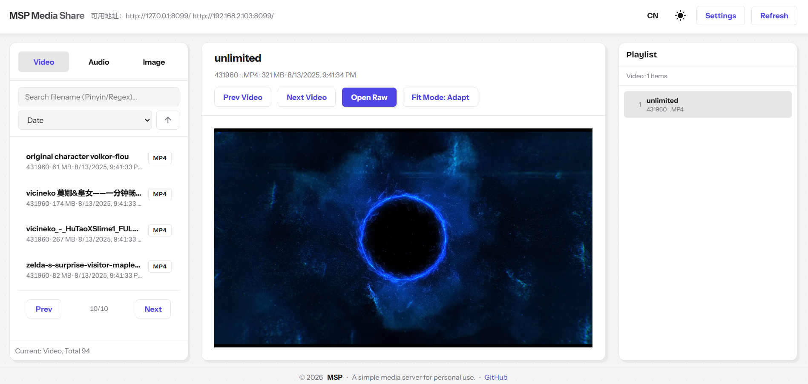
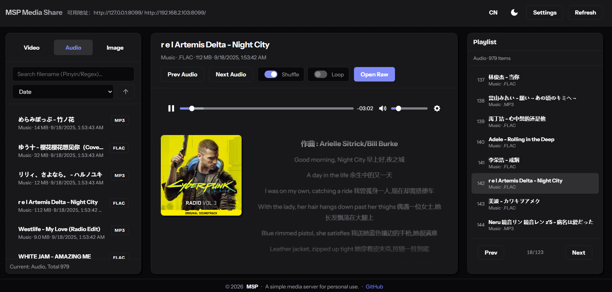

# MSP: Media Share & Preview

<div align="center">


<h3>Your Personal LAN Cinema.</h3>
<p>Lightweight, fast, and privacy-friendly media streaming for your home network.</p>

[中文文档](README_CN.md) | [Wiki](https://github.com/blycr/msp/wiki) | [Report Bug](https://github.com/blycr/msp/issues)

</div>

---

**MSP** is a single-binary media server designed for simplicity. Run it on your PC, and instantly stream your video and audio collections to any device on your Wi-Fi/LAN via a modern web interface.

## ✨ Why MSP?

| Feature | Description |
| :--- | :--- |
| 🚀 **Zero Config** | No database setup, no complex installation. Just run the binary. |
| 🍿 **Smart Transcoding** | Automatically transcodes unsupported formats (MKV, FLAC, AVI) to play in your browser. |
| ⏸️ **Resume Playback** | Remember exactly where you left off, across all devices. |
| 📱 **Cross Platform** | Server runs on Windows/Linux/macOS. Client works on any modern browser (Mobile/Desktop). |
| 🔒 **Privacy First** | No cloud accounts, no tracking. Your media stays on your local network. |
| ⚡ **Blazing Fast** | Built with Go and Vite. Instant scanning and navigation. |

## �️ Preview

<div align="center">

### Video Mode

<kbd>
  
</kbd>

### Audio Mode

<kbd>
  
</kbd>

</div>

## �🚀 Quick Start

1.  **Download** the latest release for your OS from [Releases](https://github.com/blycr/msp/releases).
2.  **Run** the executable:
    ```bash
    # Windows
    ./msp.exe

    # Linux/macOS
    ./msp
    ```
3.  **Open** the browser:
    The console will print the address (e.g., `http://127.0.0.1:8099`).
    *On first run, you can configure your shared folders directly in the UI.*

## 📚 Documentation

Visit the **[Project Wiki](https://github.com/blycr/msp/wiki)** for detailed guides:

*   **[Installation Guide](https://github.com/blycr/msp/wiki/Installation)** (Run as Service, Docker, etc.)
*   **[Configuration Reference](https://github.com/blycr/msp/wiki/Configuration)**
*   **[Encoding & Transcoding](https://github.com/blycr/msp/wiki/Encoding)**

## 🛠️ Build from Source

Requirements: **Go 1.24+**, **Node.js 18+** (for frontend)

```bash
# Clone the repo
git clone https://github.com/blycr/msp.git
cd msp

# Build everything (frontend + backend)
# Windows
./scripts/build.ps1 -Platforms windows -Architectures x64

# Linux/macOS
./scripts/build.sh --platforms linux --architectures amd64
```

## 📄 License

MIT License © 2024-Present [blycr](https://github.com/blycr)

## ❤️ Acknowledgements

*   [Plyr](https://github.com/sampotts/plyr) - A simple, accessible HTML5 media player.
*   [Gin](https://github.com/gin-gonic/gin) - HTTP web framework written in Go.
*   [GORM](https://gorm.io/) - The fantastic ORM library for Golang.
