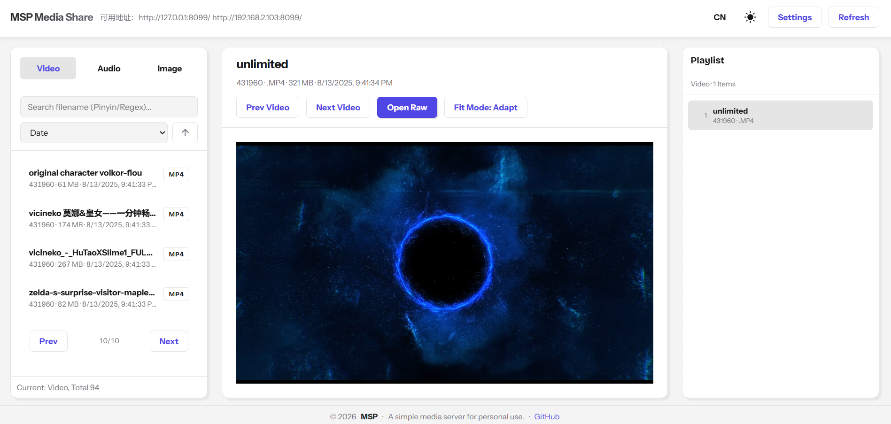
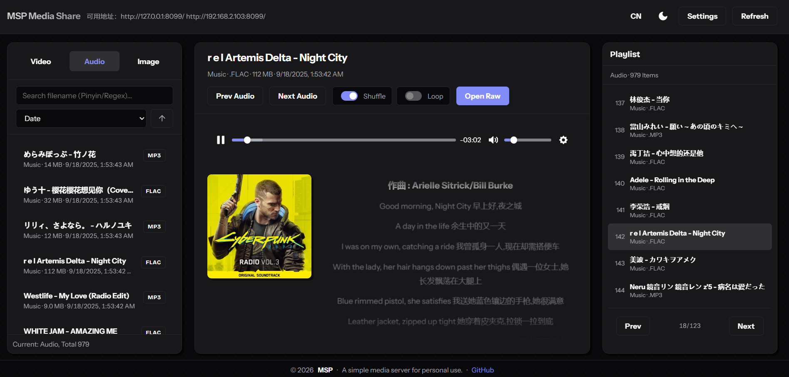

# MSP: Media Share & Preview

<div align="center">


[](https://deepwiki.com/blycr/msp)

<h3>Your Personal LAN Cinema.</h3>
<p>A lightweight media server for home LAN streaming.</p>

[CodeMap](docs/CodeMap.md) | [中文文档](docs/README_CN.md) | [Report Bug](https://github.com/blycr/msp/issues)

</div>

---

MSP is a single-binary media server focused on practical home use.  
Run it on your PC, share local folders, and play media from any modern browser in your LAN.

## Highlights

- Zero setup: no external database or complex deployment.
- Smart playback: direct play first, transcode only when needed.
- Resume playback: continue from last position across devices.
- Cross-platform server: Windows, Linux, macOS.
- Browser client: desktop and mobile modern browsers.
- Local-first: no cloud account, no tracking.

> **Note for Firefox users:** The audio metadata panel (`audioMeta`) may occasionally render as a black block. For the best experience, a Chromium-based browser is recommended.

## Playback Behavior

- Direct play is preferred by default.
- Preemptive transcode is applied only for higher-risk cases, such as:
  - Containers: `AVI`, `WMV`
  - Codecs: `HEVC/H.265`, `VC-1`, `AC-3`, `DTS`, `TrueHD`
- If direct play fails, MSP retries once, then falls back to transcoding (when enabled).

## Preview

<div align="center">

### Video Mode

<kbd>
  
</kbd>

### Audio Mode

<kbd>
  
</kbd>

</div>

## Quick Start

1. Download the latest build from [Releases](https://github.com/blycr/msp/releases).
2. Run the executable:
```bash
# Windows
./msp.exe

# Linux/macOS
./msp
```
3. Open the URL printed in the console, for example `http://127.0.0.1:8099`.
4. Add shared folders from Settings on first launch.

## Build from Source

Requirements: `Go 1.25+`, `Node.js 18+` (frontend build)

```bash
git clone https://github.com/blycr/msp.git
cd msp

# Windows (PowerShell)
.\scripts\build.ps1 -P windows              # Windows all architectures
.\scripts\build.ps1 -P all                  # All platforms and architectures
.\scripts\build.ps1 -H                      # Show all available options

# Linux/macOS (Bash)
./scripts/build.sh -P linux                 # Linux all architectures
./scripts/build.sh -P all                   # All platforms and architectures
./scripts/build.sh -h                       # Show all available options
```

For more build and dev script options, see [Scripts Guide](scripts/README.md).

## License

MIT License © 2024-Present [blycr](https://github.com/blycr)

## Acknowledgements

*   [Plyr](https://github.com/sampotts/plyr) - A simple, accessible HTML5 media player.
*   [Gin](https://github.com/gin-gonic/gin) - HTTP web framework written in Go.
*   [GORM](https://gorm.io/) - The fantastic ORM library for Golang.
