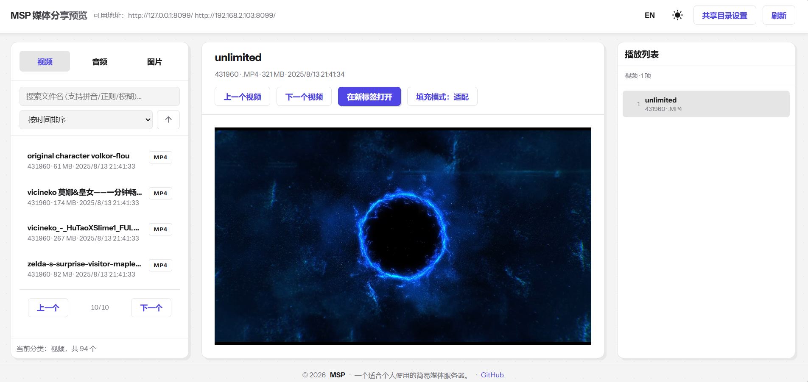
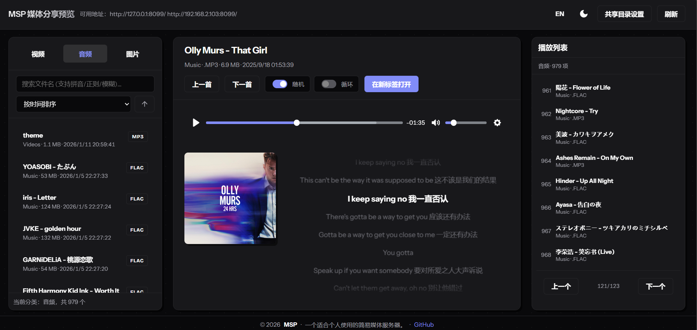

# MSP: 极简局域网媒体服务器

<div align="center">


[](https://deepwiki.com/blycr/msp)

<h3>打造你的家庭局域网影院。</h3>
<p>面向家庭局域网的轻量媒体服务器。</p>

[English](README.md) | [Wiki 文档](https://github.com/blycr/msp/wiki) | [提交 Bug](https://github.com/blycr/msp/issues)

</div>

---

MSP 是一个单文件部署的媒体服务器，面向家庭场景。  
在电脑上启动后，即可通过浏览器在局域网内访问并播放本地媒体。

## 核心亮点

- 零配置启动：无需外部数据库和复杂部署。
- 智能播放：优先直连，必要时再转码。
- 断点续播：跨设备记住播放进度。
- 全平台服务端：支持 Windows、Linux、macOS。
- 浏览器客户端：支持桌面端与移动端现代浏览器。
- 本地优先：不依赖云账号，不做数据追踪。

> **Firefox 用户提示：** 音频信息面板（`audioMeta`）偶尔可能出现黑块渲染问题。如需最佳体验，推荐使用 Chromium 内核浏览器。

## 播放策略

- 默认优先直连播放。
- 仅对高风险场景优先转码，例如：
  - 容器：`AVI`、`WMV`
  - 编码：`HEVC/H.265`、`VC-1`、`AC-3`、`DTS`、`TrueHD`
- 直连失败时先重试一次，仍失败再回退到转码（需启用转码）。

## 界面预览

<div align="center">

### 视频模式

<kbd>
  
</kbd>

### 音频模式

<kbd>
  
</kbd>

</div>

## 快速开始

1. 从 [Releases 页面](https://github.com/blycr/msp/releases) 下载对应系统版本。
2. 运行可执行文件：
```bash
# Windows
./msp.exe

# Linux/macOS
./msp
```
3. 打开控制台输出地址，例如 `http://127.0.0.1:8099`。
4. 首次进入后在设置中添加共享目录。

## 文档支持

- Wiki 总览：[项目 Wiki](https://github.com/blycr/msp/wiki)
- 安装与运行：[Installation_CN](https://github.com/blycr/msp/wiki/Installation_CN)
- 配置说明：[Configuration_CN](https://github.com/blycr/msp/wiki/Configuration_CN)
- 编码与转码：[Encoding_CN](https://github.com/blycr/msp/wiki/Encoding_CN)
- 安全功能：[Security_CN](https://github.com/blycr/msp/wiki/Security_CN)
- 发布流程：[Release](https://github.com/blycr/msp/wiki/Release)

## 源码编译

环境要求：`Go 1.24+`、`Node.js 18+`（用于构建前端）

```bash
git clone https://github.com/blycr/msp.git
cd msp

# Windows
./scripts/build.ps1 -Platforms windows -Architectures x64

# Linux/macOS
./scripts/build.sh --platforms linux --architectures amd64
```

## 许可证

本项目采用 [MIT License](LICENSE) 授权。

## 致谢

*   [Plyr](https://github.com/sampotts/plyr) - 简单、灵活的 HTML5 媒体播放器。
*   [Gin](https://github.com/gin-gonic/gin) - 高性能 Go Web 框架。
*   [GORM](https://gorm.io/) - 优秀的 Golang ORM 库。
